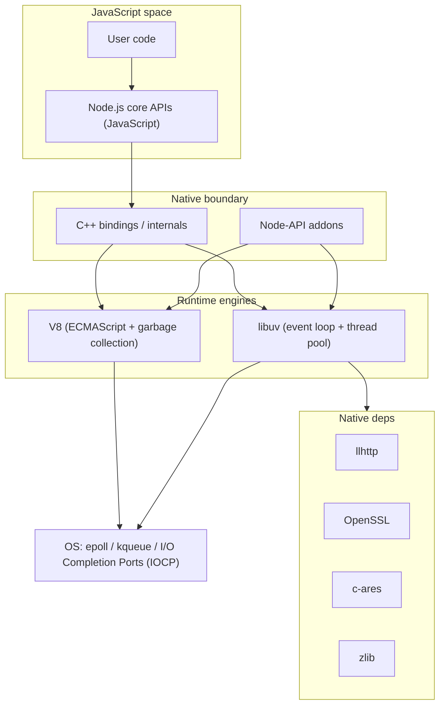

# Node.js Runtime Architecture: Event Loop, Streams, and APIs

Node.js is a host environment that pairs V8 with libuv, a C++ bindings layer, and a large set of JavaScript core modules and application programming interfaces (APIs). This article focuses on the runtime boundaries that matter at scale: event loop ordering, microtasks, thread pool backpressure, buffer and stream memory, and Application Binary Interface (ABI) stable extension points.

<figure>



<figcaption>Runtime layering from JavaScript to native engines, dependencies, and the OS.</figcaption>
</figure>

## TLDR

### Architecture in one screen

- V8 executes ECMAScript; libuv owns the event loop and asynchronous I/O (Input/Output); C++ bindings bridge the two.
- Node-API is the only ABI (Application Binary Interface) stable native surface across Node.js major versions.
- Example: A single `fs.readFile` call crosses JavaScript -> C++ bindings -> libuv thread pool before re-entering JavaScript.

### Scheduling and concurrency

- Event loop phases are timers, pending callbacks, poll, check, close. Since libuv 1.45 (Node.js 20), timers run only after poll.
- Node drains the `process.nextTick` queue before Promise microtasks and before the next loop phase.
- Example: Inside an I/O callback, `setImmediate` typically wins over `setTimeout(0)`; recursive `nextTick` chains can starve poll.

### Data movement and backpressure

- `Writable.write()` returning `false` is a hard signal to stop; ignoring it can spike RSS (Resident Set Size) and even abort the process.
- Buffers are `Uint8Array` backed; small `allocUnsafe` buffers use a shared pool.
- Example: A 200 MB upload piped through `stream.pipeline()` stays bounded by `highWaterMark`, while manual writes can overrun memory.

### Operational guardrails

- `monitorEventLoopDelay()` measures loop lag; `process.memoryUsage().arrayBuffers` exposes Buffer footprint.
- The libuv thread pool defaults to 4 threads and is tuned via `UV_THREADPOOL_SIZE` (max 1024).
- Example: 64 concurrent file reads queue behind 4 workers unless you resize the pool.

## Runtime Layers and Call Path

Node.js is a host for ECMAScript. V8 executes JavaScript, libuv implements the event loop and I/O multiplexing, and a C++ bindings layer translates JavaScript calls into libuv and native library calls. libuv runs a single threaded event loop and polls non-blocking sockets using the best platform backend (epoll, kqueue, I/O Completion Ports (IOCP)). The loop itself is not thread-safe, so cross-thread work must hop via libuv's queues.

The design trade-off is intentional: a single event loop keeps scheduling deterministic and lightweight, but any synchronous Central Processing Unit (CPU) bound work on the main thread blocks every connection.

Example: A gateway handling 30k idle keep-alive sockets is fine as long as request handlers avoid synchronous JSON parsing. A single 20 ms CPU spike blocks all 30k sockets.

## Event Loop, Microtasks, and Ordering

The Node.js event loop executes callbacks in phases (timers, pending callbacks, poll, check, close). `setImmediate()` callbacks run in the check phase, after poll. As of libuv 1.45 (Node.js 20), timers are only run after poll, which changes the timing of `setTimeout()` relative to `setImmediate()` in some scenarios.

`process.nextTick()` is not part of the event loop phases; its queue is drained after the current JavaScript stack completes and before the loop is allowed to continue. Recursive `nextTick` scheduling can starve I/O.

ECMAScript defines job queues for Promise reactions but leaves inter-queue ordering to the host:

> "This specification does not define the order in which multiple Job Queues are serviced." (ECMA-262)

Node documents that it drains the `process.nextTick` queue before the Promise microtask queue, then proceeds to macrotask phases.

```js title="timeout-vs-immediate.js" collapse={1-3,6-7}
import { readFile } from "node:fs"

readFile(__filename, () => {
  setTimeout(() => console.log("timeout"), 0)
  setImmediate(() => console.log("immediate"))
})
```

Example: If you need "after poll" ordering inside an I/O callback, use `setImmediate()`; `setTimeout(0)` can slip past it depending on poll timing and the libuv 1.45 timer change.

## libuv Thread Pool: When Async I/O Is Not Truly Non-Blocking

libuv uses a shared thread pool to offload operations that do not have non-blocking OS primitives. The pool is used for file system operations and `getaddrinfo` / `getnameinfo`. The default size is 4 threads, configurable via `UV_THREADPOOL_SIZE` with a maximum of 1024. The pool is global across event loops and preallocated to the configured maximum.

Example: On a 16 core machine, 64 concurrent `fs.readFile` calls still execute only four at a time by default. Raising `UV_THREADPOOL_SIZE` reduces queueing but increases memory and context switching.

## V8 Execution and Garbage Collection in Node

V8 runs a tiered pipeline: Ignition interprets bytecode, Sparkplug adds a fast non-optimizing just-in-time (JIT) tier between Ignition and TurboFan, and Maglev sits between Sparkplug and TurboFan as a fast optimizing tier. TurboFan remains the top tier for peak optimization.

V8 uses generational garbage collection (GC). The young generation is intentionally small (up to about 16 MiB (mebibytes) in the Orinoco design), so it fills quickly and triggers frequent scavenges; survivors are promoted to the old generation. The young generation scavenger runs in parallel to reduce pause time.

Example (inference): Long lived services with stable object shapes benefit from Maglev and TurboFan tier-up, while short lived serverless functions spend most of their time in Ignition and Sparkplug.

## Buffers and Streams: Moving Bytes Without Blowing RAM

### Buffers

`Buffer` is a subclass of `Uint8Array`; Node.js APIs accept plain `Uint8Array` where buffers are supported. `Buffer.allocUnsafe()` returns uninitialized memory and may use a shared internal pool for small allocations. `process.memoryUsage().arrayBuffers` includes memory held by `Buffer` and `SharedArrayBuffer` objects.

Example: If `arrayBuffers` grows by 200 MB while `heapUsed` is flat, you likely have large binary payloads or pooled buffers, not a JavaScript heap leak.

### Streams and backpressure

`Writable.write()` returns `false` when the internal buffer exceeds `highWaterMark`. Once this happens, no more data should be written until the `drain` event fires. Ignoring this rule forces Node to buffer until it hits maximum memory and aborts, and it can expose a vulnerability if the remote peer never drains.

Node's backpressure guidance notes a common default `highWaterMark` of 16 KB for byte streams (or 16 objects in object mode), but this can be tuned per stream.

```js title="write-with-drain.js" collapse={1-2,6-7}
const ok = writable.write(chunk)

if (!ok) {
  writable.once("drain", resume)
}
```

Example: A 200 MB upload that is piped through `stream.pipeline()` stays bounded by `highWaterMark`. The same upload pushed via a tight `write()` loop can spike RSS and trigger an abort.

### Web Streams alignment

Node's Web Streams API is an implementation of the WHATWG Streams Standard and is stable in modern releases. Web streams define a queuing strategy with a `highWaterMark` that can be any non-negative number (including Infinity, which disables backpressure).

Example: When building a library shared between browser and Node, prefer Web Streams and convert Node streams with `toWeb()` / `fromWeb()` to keep backpressure semantics consistent.

## Native Extensions and ABI Stability

Node's native addon story is now defined by Node-API (N-API). It was introduced in Node.js 8.6 and marked stable in Node.js 8.12. Node-API provides a forward compatibility guarantee across major Node.js versions, while the C++ APIs in `node.h`, `uv.h`, and `v8.h` do not provide ABI stability across majors.

Example: If you ship a native addon using Node-API only, a single build can run across multiple Node.js major versions. If you include `v8.h`, you should expect to rebuild for every major.

## Module Loading and Package Scope

Within a package, the `package.json` `"type"` field defines how Node.js treats `.js` files. `"type": "module"` means `.js` files are ECMAScript (ES) modules; no `"type"` means `.js` files are CommonJS. `.mjs` is always ES module and `.cjs` is always CommonJS, regardless of the `type` field. The rule applies to entry points and to files referenced by `import` or `import()`.

Example: In a `"type": "module"` package, name legacy config files `*.cjs` to keep tooling that still uses `require()` working.

## Observability and Failure Modes

Use `perf_hooks.monitorEventLoopDelay()` to measure event loop delay as a histogram; it samples delays in nanoseconds and is tied to the libuv loop. Use `process.memoryUsage()` to track `arrayBuffers` separately from the V8 heap. Remember that `process.nextTick()` is drained before I/O, so unbounded recursion can block progress.

```js title="event-loop-delay.js" collapse={1-3,6-7}
import { monitorEventLoopDelay } from "node:perf_hooks"

const h = monitorEventLoopDelay({ resolution: 20 })
h.enable()
```

Example: If event loop delay stays low but file latency is high, suspect thread pool saturation; if delay spikes, look for synchronous CPU work or large GC pauses.

## Conclusion

Node.js performance lives at the boundaries: JavaScript to C++, event loop phases to microtasks, and buffer queues to OS backpressure. Treat those boundary points as explicit design surfaces, and instrument them, or they will surface as tail latency and memory spikes.

## Appendix

### Prerequisites

- Familiarity with JavaScript execution and the event loop
- Basic OS I/O primitives (epoll, kqueue, IOCP)
- C/C++ shared library concepts

### Terminology

- ABI (Application Binary Interface): The binary contract between compiled modules.
- API (Application Programming Interface): The callable surface exposed to users.
- GC (Garbage Collection): Automatic memory reclamation.
- I/O (Input/Output): Data movement to or from external devices.
- RSS (Resident Set Size): Memory resident in RAM for a process.

### Summary

- Node.js layers V8, libuv, and C++ bindings behind a large JavaScript core API.
- Event loop ordering is phase based; `process.nextTick` and Promise microtasks are higher priority than timers.
- Thread pool limits and backpressure dominate tail latency and memory in I/O heavy systems.
- V8 tiering and GC behavior explain warmup and pause characteristics.
- Node-API is the only ABI stable native extension point across majors.

### References

- [ECMAScript 2017 Language Specification](https://tc39.es/ecma262/2017/) - Job queues and ordering
- [Streams Standard](https://streams.spec.whatwg.org/) - Queuing strategy and `highWaterMark`
- [Node.js Event Loop](https://nodejs.org/en/guides/event-loop-timers-and-nexttick)
- [Node.js `process` API](https://nodejs.org/docs/latest/api/process.html) - `process.nextTick`, `process.memoryUsage`
- [Node.js Streams API](https://nodejs.org/api/stream.html) - `write()`, `drain`, backpressure
- [Node.js Backpressuring in Streams](https://nodejs.org/en/learn/modules/backpressuring-in-streams)
- [Node.js Buffer API](https://nodejs.org/api/buffer.html)
- [Node.js Web Streams API](https://nodejs.org/api/webstreams.html)
- [Node.js Packages (ESM/CJS)](https://nodejs.org/api/packages.html)
- [Node.js Performance Hooks](https://nodejs.org/api/perf_hooks.html) - `monitorEventLoopDelay`
- [Node.js Worker Threads](https://nodejs.org/api/worker_threads.html) - structured clone, `transferList`
- [Node.js ABI Stability](https://nodejs.org/en/learn/modules/abi-stability)
- [Node-API Documentation](https://nodejs.org/api/n-api.html)
- [libuv Design Overview](https://docs.libuv.org/en/latest/design.html)
- [libuv Thread Pool](https://docs.libuv.org/en/v1.x/threadpool.html)
- [Sparkplug: a non-optimizing JavaScript compiler](https://v8.dev/blog/sparkplug)
- [Maglev: V8's fastest optimizing JIT](https://v8.dev/blog/maglev)
- [Orinoco: young generation garbage collection](https://v8.dev/blog/orinoco-parallel-scavenger)
