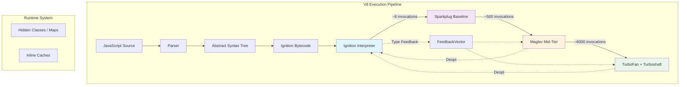
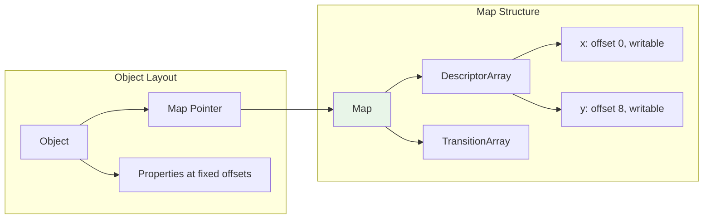
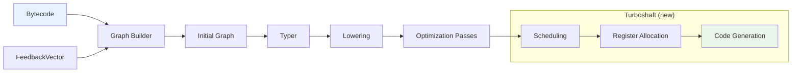

# V8 Engine Architecture: Parsing, Optimization, and JIT

V8's multi-tiered compilation pipeline—Ignition interpreter through TurboFan optimizer—achieves near-native JavaScript performance while maintaining language dynamism. This analysis covers the four-tier architecture (as of V8 12.x / Chrome 120+), the runtime's hidden class and inline caching systems that enable speculative optimization, and the Orinoco garbage collector's parallel/concurrent strategies.

<figure>



<figcaption>V8's four-tier compilation pipeline with tier-up thresholds and feedback-driven optimization</figcaption>

</figure>

## Abstract

V8 solves the fundamental tension in dynamic language execution: achieving static-language performance without sacrificing JavaScript's runtime flexibility. The architecture's core insight is **speculative optimization**—assume code behaves predictably based on observed patterns, optimize aggressively for that assumption, and have a safe bailout path when assumptions fail.

**The four-tier pipeline** balances compilation cost against execution speed:

| Tier      | Compilation Speed | Execution Speed     | Trigger     |
| --------- | ----------------- | ------------------- | ----------- |
| Ignition  | Instant           | Slow (~100x native) | Always      |
| Sparkplug | ~10μs/function    | Moderate            | ~8 calls    |
| Maglev    | ~100μs/function   | Fast                | ~500 calls  |
| TurboFan  | ~1ms/function     | Near-native         | ~6000 calls |

**The runtime system** makes speculation viable through:

- **Hidden Classes (Maps)**: Transform dynamic property access into fixed-offset memory loads
- **Inline Caches (ICs)**: Track which object shapes appear at each property access site
- **FeedbackVector**: Store IC data separately from code, enabling safe speculation

**The optimization contract**: If an IC site is monomorphic (single shape), TurboFan generates a fast path with a single map check + direct load. If polymorphic (2-4 shapes), it generates a linear chain of checks. If megamorphic (>4 shapes), optimization is abandoned for that site.

**Deoptimization** is the safety net—when speculation fails at runtime, V8 reconstructs the interpreter frame and resumes in Ignition. This makes aggressive optimization safe because incorrect speculation never produces wrong results, only slower execution.

**Orinoco GC** applies the generational hypothesis (most objects die young) with parallel young-generation collection and concurrent old-generation marking, achieving sub-millisecond pause times in typical workloads.

## The Core Trade-off

JIT (Just-In-Time) compilers face an inherent tension: compilation time steals from execution time. Spending 100ms optimizing a function that runs once wastes 100ms. Spending 0ms optimizing a function that runs a million times wastes cycles on every iteration.

V8's answer is **tiered compilation**—start executing immediately with minimal compilation cost, then progressively recompile hot code with increasing optimization levels. Each tier represents a different point on the compilation-time vs. execution-speed curve.

The key insight enabling this architecture: **JavaScript code exhibits predictable patterns despite being dynamically typed**. Objects created by the same constructor tend to have the same shape. Functions called repeatedly tend to receive the same types. Property accesses at a given source location tend to hit the same object layouts.

V8's runtime system—hidden classes and inline caches—captures these patterns as they emerge during execution. The optimizing compilers then treat this observed behavior as ground truth for speculation, with deoptimization as the safety net when reality diverges from expectation.

## Parsing: Source to Bytecode

Before execution, V8 transforms JavaScript source into bytecode—the canonical representation consumed by all subsequent tiers.

### Scanner and Tokenizer

The scanner consumes UTF-16 source characters and emits tokens—identifiers, operators, literals, keywords. This is a straightforward lexical analysis pass.

### Parser and AST Generation

The parser consumes tokens and builds an Abstract Syntax Tree (AST). V8's parser is hand-written (not generated) for performance and JavaScript's context-sensitive grammar requirements.

### Lazy Parsing: The Startup Optimization

**The problem**: Parsing is expensive. A typical web page loads megabytes of JavaScript, but most functions are never called during initial page render.

**The solution**: V8 employs a two-pass strategy:

1. **Pre-parser (fast pass)**: Identifies function boundaries and validates syntax without building full AST nodes. Runs at ~2x the speed of full parsing.

2. **Full parser (deferred)**: Builds complete AST only when a function is first called.

<figure>


<figcaption>Lazy parsing defers full AST construction until function invocation</figcaption>

</figure>

**Edge case—inner functions**: When an outer function is compiled, its inner functions are pre-parsed. If the outer function references variables from an inner function's closure, the pre-parser must track this without building full AST nodes. This is a significant source of parser complexity.

**Trade-off**: Lazy parsing saves startup time but creates a "double parse" cost when functions are eventually called. For functions that will definitely be called immediately, this is wasted work. Chrome 136+ introduces explicit compile hints (`//# allFunctionsCalledOnLoad`) to let developers signal which functions should be eagerly compiled, moving parsing to background threads.

## Ignition: The Interpreter Foundation

Ignition is V8's bytecode interpreter—the first execution tier and the foundation for all subsequent optimization.

### Register Machine Architecture

Ignition uses a **register-based** design (not stack-based like the JVM). Bytecode instructions operate on virtual registers (`r0`, `r1`, etc.) with a dedicated **accumulator** register that serves as an implicit operand for most operations.

**Why registers over stack?** Register machines produce shorter bytecode sequences because operations don't need explicit stack manipulation. The accumulator pattern further compresses bytecode—common operation chains like `a + b - c` keep intermediate results in the accumulator without explicit stores.

### Bytecode Generation

The BytecodeGenerator traverses the AST and emits V8 bytecode. Consider:

```javascript
function incrementX(obj) {
  return 1 + obj.x
}
```

Generated bytecode:

```plain
LdaSmi [1]                      // Load Small Integer 1 → accumulator
Star0                           // Store accumulator → r0
GetNamedProperty a0, [0], [0]   // Load obj.x → accumulator (feedback slot 0)
Add r0, [1]                     // r0 + accumulator → accumulator (feedback slot 1)
Return                          // Return accumulator
```

The bracketed indices (`[0]`, `[1]`) reference slots in the FeedbackVector—this is how Ignition records type information for the optimizing compilers.

### CodeStubAssembler: Cross-Platform Handler Generation

Bytecode handlers (the machine code implementing each instruction) are written in **CodeStubAssembler (CSA)**—a platform-independent C++ DSL that TurboFan compiles to native code for each architecture. This means improvements to TurboFan's backend automatically accelerate the interpreter.

At runtime, the interpreter dispatch loop:

1. Fetches the next bytecode from BytecodeArray
2. Indexes into a global dispatch table
3. Jumps to the handler's machine code

This indirect-threaded dispatch costs ~10-15 cycles per bytecode on modern CPUs.

## Hidden Classes and Inline Caching: The Runtime Foundation

The entire speculative optimization strategy depends on the runtime system's ability to observe predictable patterns in dynamic code. Two mechanisms make this possible.

### Hidden Classes (Maps)

JavaScript objects are dynamic—properties can be added or deleted at any time. A naive implementation requires hash table lookups for every property access (~100+ cycles). V8's insight: most objects in practice have stable, predictable shapes.

**The solution**: Associate every object with a **Hidden Class** (internally called a **Map**). The Map describes:

- Which properties exist
- Their types (where known)
- Their memory offsets within the object

Property access becomes:

1. Load the object's Map pointer (1 instruction)
2. Compare against expected Map (1 instruction)
3. Load from fixed offset (1 instruction)

This transforms O(n) hash lookups into O(1) offset loads.

<figure>



<figcaption>Object memory layout with Map pointer and fixed-offset properties</figcaption>

</figure>

### Map Transitions: Shape Evolution

Maps form a **transition tree**. When properties are added, V8 follows (or creates) transitions to new Maps:

```javascript
const obj = {} // Map M0: empty
obj.x = 1 // Map M1: {x} (transition from M0)
obj.y = 2 // Map M2: {x, y} (transition from M1)
```

**Critical implication**: Property addition order matters.

```javascript
const a = {}
a.x = 1
a.y = 2 // Map path: M0 → M1(x) → M2(x,y)
const b = {}
b.y = 1
b.x = 2 // Map path: M0 → M3(y) → M4(y,x)
```

Objects `a` and `b` have different Maps despite identical property sets. A function optimized for `a`'s Map will deoptimize when passed `b`.

**Best practice**: Initialize all properties in constructors, in consistent order.

### Inline Caches and FeedbackVector

**Inline Caches (ICs)** track which Maps appear at each property access site. The data is stored in a per-function **FeedbackVector**—a separate array with slots for each IC site.

As Ignition executes, it populates FeedbackVector slots with observed Maps. This separation of feedback from code is deliberate—it enables sharing optimized code across closures while maintaining per-closure type information.

### IC States: Quantifying Predictability

| State             | Shapes Seen | Access Cost   | Optimization Impact                            |
| ----------------- | ----------- | ------------- | ---------------------------------------------- |
| **Uninitialized** | 0           | N/A           | No feedback yet                                |
| **Monomorphic**   | 1           | ~3 cycles     | Ideal—single map check + direct load           |
| **Polymorphic**   | 2-4         | ~10-20 cycles | Linear chain of map checks                     |
| **Megamorphic**   | >4          | ~100+ cycles  | Global stub cache; often prevents optimization |

**The megamorphic cliff**: When an IC exceeds 4 shapes, V8 abandons local caching and falls back to a global hashtable. Performance degrades 10-50x, and TurboFan typically refuses to optimize the containing function.

**Real-world example**: A function processing heterogeneous API responses where each endpoint returns differently-shaped objects will quickly go megamorphic. Solutions include normalizing shapes early or splitting into shape-specific functions.

## Sparkplug: The Baseline JIT

Introduced in Chrome 91 (2021), Sparkplug bridges the performance gap between interpretation and optimization.

### Design Philosophy

Sparkplug optimizes for **compilation speed**, not execution speed. Its entire compiler is essentially "a switch statement inside a for loop":

1. For each bytecode instruction
2. Emit the corresponding machine code template
3. No analysis, no optimization, no IR

**Tier-up trigger**: ~8 invocations, no feedback required.

### Key Design Decisions

**Compiles from bytecode, not source**: Sparkplug reuses all the work the parser and BytecodeGenerator already did. This is why it's fast—most of the "compilation" already happened.

**No Intermediate Representation**: Unlike optimizing compilers that build graphs for analysis, Sparkplug generates machine code directly in a single linear pass. Complex operations emit calls to pre-compiled builtins.

**Interpreter-compatible frame layout**: Sparkplug uses the same stack frame structure as Ignition. This enables trivial On-Stack Replacement (OSR)—mid-execution switches between tiers require no frame reconstruction.

### Performance Characteristics

Compilation: ~10μs per function (orders of magnitude faster than TurboFan's ~1ms)
Execution: ~30-50% faster than Ignition interpretation

Sparkplug's value is in eliminating interpreter dispatch overhead. The generated code still performs all the same runtime checks—it's just native code doing it instead of bytecode handlers.

**Trade-off**: Sparkplug code is larger than bytecode and less efficient than optimized code. For short-lived or rarely-called functions, Ignition's lower memory footprint may be preferable. V8's heuristics handle this automatically.

## Maglev: The Mid-Tier Optimizer

Introduced in Chrome 117 (2023), Maglev closes the compilation-speed vs. execution-speed gap between Sparkplug and TurboFan.

### Why a Mid-Tier?

The Ignition/TurboFan gap was too wide. TurboFan produces excellent code but takes ~1ms to compile. For functions that run hundreds of times but not thousands, TurboFan's compilation cost exceeds its benefits. Maglev compiles ~10x faster than TurboFan while producing code ~2x faster than Sparkplug.

**Tier-up trigger**: ~500 invocations with stable feedback. If feedback changes (new shapes appear), the counter resets.

### Architecture: CFG over Sea of Nodes

Maglev deliberately uses a traditional SSA (Static Single-Assignment) CFG (Control-Flow Graph) rather than TurboFan's Sea of Nodes IR. The V8 team found that for JavaScript's heavily effectful operations, Sea of Nodes' theoretical advantages didn't materialize in practice—most nodes ended up chained together anyway.

The CFG approach provides:

- **Faster compilation**: No complex graph scheduling
- **Easier debugging**: Linear control flow is human-readable
- **Simpler implementation**: Traditional compiler textbook techniques apply directly

### Optimization Capabilities

**Feedback-driven specialization**: Maglev consumes FeedbackVector data to emit specialized code. A property access `o.x` with monomorphic feedback becomes a map check + direct offset load.

**Representation selection**: Numbers can be unboxed to raw machine integers/floats in registers, avoiding heap allocation overhead for arithmetic-heavy code.

**Inlining**: Limited function inlining for small, hot callees.

**What Maglev skips**: Loop unrolling, escape analysis, advanced load elimination—these are TurboFan's domain.

### Performance Impact

V8 benchmarks (2023):

- JetStream 2: +8.2%
- Speedometer 2: +6%
- Energy consumption: -10%

For typical web workloads, Maglev handles most optimization needs. TurboFan activates only for genuinely hot loops and compute-intensive functions.

## TurboFan: The Top-Tier Optimizer

TurboFan generates the fastest possible code for hot functions. It's expensive—~1ms compilation time—but produces code that approaches native performance.

**Tier-up trigger**: ~6000 invocations with stable feedback.

### The Sea of Nodes IR (Historical)

TurboFan was built on **Sea of Nodes (SoN)**—an IR where nodes represent operations and edges represent dependencies (data, control, and effect). Unlike CFG-based IRs, nodes without dependency chains are "free-floating," theoretically enabling aggressive reordering and optimization.

**Why it seemed like a good idea**: SoN works excellently for static languages like Java (where it originated). Pure operations can float freely, enabling powerful global optimizations.

**Why it failed for JavaScript**: In JavaScript, almost every operation is potentially effectful—property access can trigger getters, operators can call `valueOf()`. This forced most nodes onto the effect chain, which effectively recreated CFG constraints anyway.

The result:

- Graphs were difficult to read and debug
- Poor cache locality (nodes scattered in memory)
- Compilation was ~2x slower than CFG approaches
- Optimizations requiring control-flow reasoning became harder, not easier

### Turboshaft: The CFG Replacement

Starting in 2023 (Chrome 120+), V8 has been migrating TurboFan's backend to **Turboshaft**—a CFG-based IR. As of 2025, all CPU-agnostic backend phases use Turboshaft.

**Results**: Compilation time halved. Same or better code quality.

The Sea of Nodes frontend (JavaScript → IR) is being gradually replaced as well, with the emerging **Turbolev** project aiming to use Maglev's CFG-based IR as the starting point for TurboFan-level optimizations.

### TurboFan Optimization Capabilities

**Speculative optimizations based on feedback**:

- Type-specialized arithmetic (Int32Add instead of generic Add)
- Inline property access (map check + offset load)
- Function inlining

**Advanced analyses**:

- **Escape analysis**: Allocate objects on stack when they don't escape
- **Loop-invariant code motion**: Hoist computations out of loops
- **Redundancy elimination**: Remove duplicate map checks
- **Dead code elimination**: Remove unreachable paths

**Representation selection**: Choose optimal numeric representations:

- Smi (tagged small integer) for values in [-2³¹, 2³¹-1]
- HeapNumber for larger integers or floats
- Raw Int32/Float64 in registers when unboxing is profitable

### Pipeline Walkthrough

<figure>



<figcaption>TurboFan compilation pipeline with Turboshaft backend</figcaption>

</figure>

## Deoptimization: The Safety Net

Speculative optimization is only safe because deoptimization provides a reliable escape hatch. When an assumption fails at runtime, V8 reconstructs the interpreter state and resumes in Ignition.

### Why Deoptimization is Not Failure

Deoptimization is designed into V8's architecture, not a bug. It enables aggressive speculation—if V8 had to guarantee correctness without bailouts, it couldn't optimize nearly as aggressively.

**Frequency in practice**: V8 benchmarks show 8 of 15 Octane tests have >5 deoptimization checks per 100 instructions. Real-world code typically stabilizes after warmup, with deoptimizations becoming rare.

### Common Deoptimization Reasons

| Reason                      | Trigger                                 | Example                                        |
| --------------------------- | --------------------------------------- | ---------------------------------------------- |
| `kWrongMap`                 | Object shape changed                    | Function optimized for `{x}` receives `{y, x}` |
| `kNotASmi`                  | Expected small integer, got heap number | `x + 1` where `x` becomes a float              |
| `kOutOfBounds`              | Array access beyond length              | `arr[i]` where `i >= arr.length`               |
| `kOverflow`                 | Integer arithmetic overflow             | Addition exceeds Smi range [-2³¹, 2³¹-1]       |
| `kHole`                     | Sparse array access                     | Accessing uninitialized array element          |
| `kInsufficientTypeFeedback` | Optimized before feedback stabilized    | Polymorphic site went megamorphic              |

### Eager vs. Lazy Deoptimization

**Eager**: Check fails in the currently executing optimized code. Immediate bailout.

**Lazy**: External change invalidates assumptions (e.g., prototype modification). The optimized function is marked for deoptimization and will bailout on next invocation.

### Frame Translation: The Mechanical Challenge

Deoptimization cannot restart from the beginning—side effects may have occurred. It must resume at the exact bytecode offset corresponding to the failed check.

**The process**:

1. **Capture state**: Serialize CPU registers and stack values into FrameDescription
2. **Translate**: Map optimized frame layout to interpreter frame layout (TurboFan pre-generates this mapping)
3. **Replace**: Pop optimized frame, push interpreter frame, jump to bytecode offset

**Why Sparkplug's frame compatibility matters**: Sparkplug uses Ignition's frame layout, making OSR trivial. Maglev/TurboFan use different layouts, requiring full frame translation.

### Performance Impact

Deoptimization cost: ~2x to 20x slowdown for that invocation, depending on function complexity.

**The real cost**: Not the single deoptimization, but the feedback pollution it causes. A function that deoptimizes repeatedly may never reach TurboFan, staying in Maglev or even Sparkplug.

## Orinoco: The Garbage Collector

Orinoco is V8's garbage collection system—designed to minimize pause times while maintaining memory efficiency.

### The Generational Hypothesis

**Core observation**: Most objects die young. A typical web application allocates thousands of short-lived objects (event handlers, intermediate computations, closures) for every long-lived one (cached data, application state).

**Design implication**: Optimize for the common case. Collect young objects frequently and cheaply; collect old objects rarely and thoroughly.

### Heap Structure

| Generation | Size                   | Collection Frequency | Algorithm                     |
| ---------- | ---------------------- | -------------------- | ----------------------------- |
| **Young**  | 1-16 MB (configurable) | Every few ms         | Parallel Scavenge (copying)   |
| **Old**    | Heap limit - young gen | Every few seconds    | Concurrent Mark-Sweep-Compact |

Young generation is further divided:

- **Nursery**: Brand-new allocations
- **Intermediate**: Survived one scavenge

### Young Generation: Parallel Scavenger

**Algorithm**: Semi-space copying. The young generation has two equal-sized spaces (From-Space and To-Space). Live objects are copied from From to To; dead objects are implicitly reclaimed.

**Why copying works for young gen**: With high mortality rates, copying is efficient—you only pay for survivors. Dead objects (the majority) require zero work.

**Orinoco innovation**: **Parallel scavenging**. Multiple threads scan roots and copy survivors simultaneously. Pause time scales inversely with CPU cores.

**Promotion**: Objects surviving two scavenges are promoted to old generation, not copied again. This assumes the generational hypothesis—surviving twice suggests longevity.

### Old Generation: Concurrent Mark-Sweep-Compact

**Three-phase algorithm**:

1. **Mark**: Traverse object graph from roots, mark reachable objects
2. **Sweep**: Add unmarked object memory to free lists
3. **Compact**: Defragment by moving live objects together (optional, triggered by fragmentation thresholds)

**Orinoco's parallelism strategy**:

| Phase   | Execution Model                 | Pause Required                 |
| ------- | ------------------------------- | ------------------------------ |
| Mark    | Concurrent (background threads) | Brief (~1ms) for root scanning |
| Sweep   | Concurrent (background threads) | None                           |
| Compact | Parallel (all threads)          | Full pause (but shared work)   |

**Write barriers**: When JavaScript creates/modifies object pointers during concurrent marking, write barriers record these changes so the GC maintains a consistent view.

### Advanced Techniques

**Black allocation**: Objects promoted to old generation are pre-marked as live ("black"). This skips them in the next marking cycle—a valid optimization because promotion implies expected longevity.

**Remembered sets**: Track old→young pointers so young generation scavenges don't scan the entire old generation. Orinoco uses per-page granularity for parallel-friendly processing.

**Idle-time GC**: Chrome signals idle periods to V8, which performs opportunistic GC work (incremental marking, deferred sweeping). This can reduce heap size by ~45% during idle with minimal user impact.

### Performance Characteristics

Typical pause times:

- Minor GC (scavenge): <1ms
- Major GC (mark-sweep): 1-10ms (most work concurrent)
- Compaction: 10-50ms (rare, only when fragmented)

**Trade-off**: Concurrent GC requires write barriers, adding ~5% overhead to pointer-mutating operations. This is worth it for the pause time reduction.

## Pipeline Evolution

V8's architecture has evolved through three major eras, each addressing the limitations of its predecessor.

### Era 1: Full-codegen + Crankshaft (2008-2017)

**Full-codegen**: Fast baseline compiler generating unoptimized machine code directly from AST. No bytecode.

**Crankshaft**: Optimizing compiler for hot functions.

**The problem—performance cliffs**: Crankshaft could only optimize a subset of JavaScript. Using `try-catch`, certain `arguments` patterns, or `with` statements caused permanent bailouts. Functions would be stuck in slow Full-codegen code forever, with no recovery path.

### Era 2: Ignition + TurboFan (2017-2021)

**The fix**: Bytecode as the canonical representation. Ignition interprets bytecode; TurboFan optimizes from bytecode. This decoupled optimization from parsing and enabled full-language optimization.

**New problem**: The compilation gap. TurboFan's ~1ms compilation cost meant functions needed thousands of invocations to justify optimization.

### Era 3: Four-Tier Pipeline (2021-Present)

**The fix**: Intermediate tiers to smooth the performance curve.

| Year  | Addition   | Purpose                                     |
| ----- | ---------- | ------------------------------------------- |
| 2021  | Sparkplug  | Eliminate interpreter dispatch overhead     |
| 2023  | Maglev     | Quick optimizations without TurboFan's cost |
| 2023+ | Turboshaft | Replace TurboFan's Sea of Nodes backend     |

### Future: Turbolev

The **Turbolev** project (in development as of 2025) aims to use Maglev's CFG-based IR as input to Turboshaft's backend, potentially replacing TurboFan entirely.

## Conclusion

V8's performance emerges from the interplay between its components:

- **Tiered compilation** provides fast startup while enabling peak performance for hot code
- **Hidden classes and ICs** make predictable patterns observable, enabling speculative optimization
- **Deoptimization** makes aggressive speculation safe
- **Orinoco GC** minimizes pause times through parallelism and concurrency

The architecture's evolution—from performance cliffs to smooth gradients, from Sea of Nodes to CFG—demonstrates pragmatic engineering over dogma. Each change addressed real performance gaps measured in production.

## Appendix

### Prerequisites

- Understanding of JIT compilation concepts (interpreter vs. compiler trade-offs)
- Familiarity with basic compiler terminology (AST, IR, bytecode)
- Knowledge of JavaScript's dynamic typing model

### Summary

- V8 uses four compilation tiers: Ignition (interpreter) → Sparkplug (baseline) → Maglev (mid-tier) → TurboFan (top-tier)
- Hidden classes (Maps) enable O(1) property access by describing object shapes
- Inline caches track shapes at each property access site; megamorphic (>4 shapes) sites prevent optimization
- Deoptimization safely reverts to interpreter when speculation fails
- Orinoco GC achieves <1ms pauses for young generation through parallel scavenging
- Turboshaft is replacing TurboFan's Sea of Nodes backend with CFG-based IR

### Terminology

- **AST (Abstract Syntax Tree)**: Tree representation of source code structure
- **CFG (Control-Flow Graph)**: IR representing program as basic blocks connected by control edges
- **Deoptimization**: Reverting from optimized code to interpreter when assumptions fail
- **FeedbackVector**: Per-function array storing inline cache data for optimization
- **Hidden Class / Map**: V8's internal object shape descriptor enabling fast property access
- **IC (Inline Cache)**: Mechanism tracking object shapes at property access sites
- **IR (Intermediate Representation)**: Compiler's internal code representation between source and machine code
- **JIT (Just-In-Time)**: Compilation strategy that compiles code during execution
- **Megamorphic**: IC state when >4 different shapes observed; optimization typically abandoned
- **Monomorphic**: IC state when exactly 1 shape observed; optimal for speculation
- **OSR (On-Stack Replacement)**: Switching between tiers mid-function-execution
- **Polymorphic**: IC state when 2-4 shapes observed; still optimizable with shape checks
- **Sea of Nodes**: Graph-based IR where nodes represent operations and edges represent dependencies
- **Smi (Small Integer)**: V8's tagged integer representation for values in [-2³¹, 2³¹-1]
- **SSA (Static Single-Assignment)**: IR form where each variable is assigned exactly once
- **Turboshaft**: V8's new CFG-based backend replacing Sea of Nodes in TurboFan

### References

#### Official V8 Documentation

- [V8 Ignition Documentation](https://v8.dev/docs/ignition) - Interpreter architecture
- [V8 TurboFan Documentation](https://v8.dev/docs/turbofan) - Top-tier optimizer
- [V8 Hidden Classes](https://v8.dev/docs/hidden-classes) - Object shape tracking

#### V8 Blog (Primary Source)

- [Launching Ignition and TurboFan](https://v8.dev/blog/launching-ignition-and-turbofan) - 2017 architecture rewrite
- [Sparkplug — a non-optimizing JavaScript compiler](https://v8.dev/blog/sparkplug) - Baseline JIT introduction (2021)
- [Maglev - V8's Fastest Optimizing JIT](https://v8.dev/blog/maglev) - Mid-tier compiler (2023)
- [Trash talk: the Orinoco garbage collector](https://v8.dev/blog/trash-talk) - GC architecture
- [Land ahoy: leaving the Sea of Nodes](https://v8.dev/blog/leaving-the-sea-of-nodes) - Turboshaft migration
- [Static Roots: Objects Allocated at Compile Time](https://v8.dev/blog/static-roots) - 2024 optimization
- [Explicit Compile Hints](https://v8.dev/blog/explicit-compile-hints) - Chrome 136+ feature

#### Core Maintainer Content

- [An Introduction to Speculative Optimization in V8](https://benediktmeurer.de/2017/12/13/an-introduction-to-speculative-optimization-in-v8/) - Benedikt Meurer
- [V8 Behind the Scenes](https://benediktmeurer.de/2017/03/01/v8-behind-the-scenes-february-edition/) - Benedikt Meurer
- [Understanding V8's Bytecode](https://medium.com/dailyjs/understanding-v8s-bytecode-317d46c94775) - Franziska Hinkelmann

#### Technical Deep Dives

- [The Sea of Nodes](https://darksi.de/d.sea-of-nodes/) - IR architecture explanation
- [Monomorphism in JavaScript](https://www.builder.io/blog/monomorphic-javascript) - IC optimization guide
