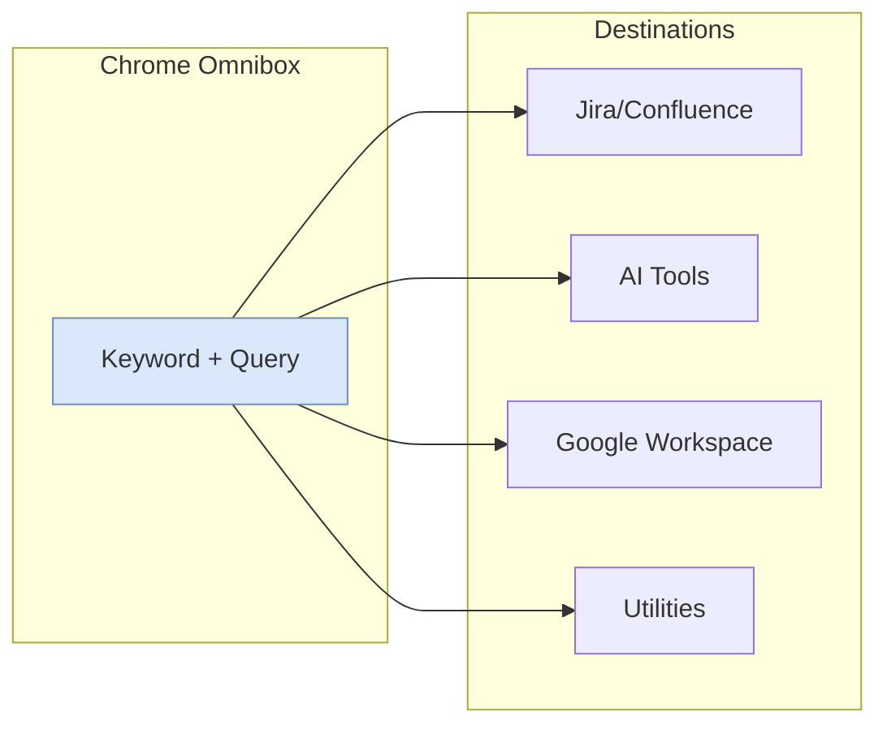

# Chrome Developer Setup: Extensions, Profiles, and Shortcuts

A Chrome configuration optimized for senior developers: omnibox keywords for instant navigation, browser-agnostic tooling for cross-browser testing, and profile isolation for multi-account workflows.

<figure>

<figcaption>Address bar keywords route queries directly to target services via URL template substitution</figcaption>

</figure>

## Abstract

Chrome's omnibox functions as a command-line interface when configured with custom site search shortcuts. Each shortcut maps a keyword to a URL template containing `%s` as a query placeholder—typing `j 123` expands to `https://company.atlassian.net/secure/QuickSearch.jspa?searchString=123`.

**The core mental model:**

1. **Omnibox = dispatch layer** — Keywords trigger URL template expansion, bypassing navigation entirely
2. **AI tool URL parameters are unreliable (2025)** — Only Perplexity's `?q=` works; Claude, ChatGPT, and Gemini parameters broke or were restricted due to security concerns
3. **Browser-agnostic tools = portability** — Raindrop.io and Bitwarden sync across Chrome, Firefox, Arc, Brave; no lock-in when testing browsers
4. **Profile isolation = context separation** — Each Chrome profile maintains independent cookies, extensions, and search engines; use separate profiles for work/personal/testing
5. **Manifest V3 reality** — Chrome removed MV2 support in Chrome 139 (June 2025); ad blockers like uBlock Origin Lite operate under Declarative Net Request (DNR) API limitations; full blocking requires Firefox or Brave

**Why this matters:** Developers context-switch constantly between Jira, Confluence, AI tools, and Google Workspace. Omnibox shortcuts eliminate the navigate-then-search pattern, reducing each lookup to a single keyboard action—though AI tool integration has become more fragmented.

---

## Address Bar Keywords

Chrome's site search shortcuts (Settings → Search engine → Manage search engines and site search) let you define custom URL templates. When you type a keyword followed by a space or tab, Chrome enters "search mode" for that shortcut—your query replaces `%s` in the URL template.

**Setup:** Navigate to `chrome://settings/searchEngines`, scroll to **Site search**, click **Add**.

**How it works:** Chrome stores three fields per shortcut:

- **Name**: Display label (e.g., "Jira Quick Search")
- **Shortcut**: The keyword you type (e.g., `j`)
- **URL**: Template with `%s` placeholder (e.g., `https://company.atlassian.net/secure/QuickSearch.jspa?searchString=%s`)

When you type `j 123` and press Enter, Chrome substitutes `123` for `%s` and navigates directly to the resulting URL. The space after the keyword triggers search mode; you can also press Tab for explicit activation.

### Development & Work Tools

> Replace `<your-company-name>` and `<your-project-code>` with your actual Jira/Atlassian values.

| Tool                    | Keyword | URL Template                                                                                             | Example                                      |
| :---------------------- | :------ | :------------------------------------------------------------------------------------------------------- | :------------------------------------------- |
| **Jira (Smart Search)** | `j`     | `https://<your-company-name>.atlassian.net/secure/QuickSearch.jspa?searchString=%s`                      | `j 123` (jumps to ticket) or `j login bug`   |
| **Jira (Project)**      | `jp`    | `https://<your-company-name>.atlassian.net/issues?jql=textfields~"%s" AND project="<your-project-code>"` | `jp checkout` (searches only this project)   |
| **Jira Ticket**         | `jt`    | `https://<your-company-name>.atlassian.net/browse/<your-project-code>-%s`                                | `jt 125` (opens ticket `<project-code>-125`) |
| **Confluence**          | `cf`    | `https://<your-company-name>.atlassian.net/wiki/search?text=%s`                                          | `cf onboarding`                              |
| **Bitbucket**           | `bb`    | `https://bitbucket.org/search?q=%s`                                                                      | `bb repo_name`                               |
| **Chrome Web Store**    | `ext`   | `https://chrome.google.com/webstore/search/%s`                                                           | `ext json viewer`                            |

**Why these shortcuts matter:** Jira's Smart Search (`QuickSearch.jspa`) is particularly powerful—it accepts ticket numbers, text queries, and JQL fragments. Typing `j PROJ-123` navigates directly to the ticket; `j login bug` searches across all projects. The project-scoped `jp` shortcut adds a JQL filter to constrain results when you're focused on a single codebase.

### AI Tools

| Tool           | Keyword  | URL Template                            | Status (January 2026)              |
| :------------- | :------- | :-------------------------------------- | :--------------------------------- |
| **Perplexity** | `p`      | `https://www.perplexity.ai/search?q=%s` | Works; auto-submits                |
| **Claude**     | `c`      | `https://claude.ai/new?q=%s`            | Broken since October 2025          |
| **ChatGPT**    | `gpt`    | `https://chatgpt.com/?q=%s`             | Restricted; security modifications |
| **Gemini**     | `gemini` | Use `@gemini` in omnibox                | Requires Chrome's native shortcut  |

**Current status by tool:**

- **Perplexity**: Fully working. Auto-submits the query immediately—results appear without additional interaction. This is the only AI tool where URL parameters work reliably.
- **Claude**: The `?q=` parameter stopped working in October 2025. No official fix announced. You can still use the shortcut to navigate to Claude, but the query won't pre-fill.
- **ChatGPT**: OpenAI added security protections in July 2025 that restrict `?q=` parameter behavior based on the `sec-fetch-site` header. Third-party extensions exist to restore functionality, but native URL parameters are unreliable.
- **Gemini**: Chrome's native `@gemini` omnibox shortcut works (type `@gemini` then space or tab), but it uses HTTP headers rather than URL parameters. The `?q=` parameter requires the [Gemini URL Prompt extension](https://chromewebstore.google.com/detail/gemini-url-prompt-auto-prefill/gcooahlbfkojbacclfbofkcknbiopjan).

**Profile-specific defaults:** I configure Perplexity as the default search engine on my personal profile (for general research). Given the URL parameter restrictions on other AI tools, Perplexity is currently the most reliable option for omnibox-based AI queries.

### Google Workspace

| Tool              | Keyword | URL Template                                     | Example                 |
| :---------------- | :------ | :----------------------------------------------- | :---------------------- |
| **Google Sheets** | `sheet` | `https://docs.google.com/spreadsheets/u/0/?q=%s` | `sheet Q1 budget`       |
| **Google Docs**   | `doc`   | `https://docs.google.com/document/u/0/?q=%s`     | `doc meeting notes`     |
| **Google Drive**  | `dr`    | `https://drive.google.com/drive/search?q=%s`     | `dr project proposal`   |
| **Gmail**         | `gm`    | `https://mail.google.com/mail/u/0/#search/%s`    | `gm invoice from apple` |

**The `/u/0/` path segment:** This specifies the first logged-in Google account. If you use multiple Google accounts, `/u/1/` accesses the second account, `/u/2/` the third, etc. For multi-account workflows, create separate shortcuts per account index.

**Instant creation shortcuts:** Chrome recognizes `.new` TLDs owned by Google. Type `sheet.new`, `doc.new`, `slides.new`, or `meet.new` directly in the omnibox to create a blank file or start a meeting—no custom shortcut required.

### Entertainment & Shopping

| Tool              | Keyword | URL Template                                      | Example              |
| :---------------- | :------ | :------------------------------------------------ | :------------------- |
| **YouTube**       | `yt`    | `https://www.youtube.com/results?search_query=%s` | `yt coding tutorial` |
| **YouTube Music** | `ym`    | `https://music.youtube.com/search?q=%s`           | `ym lo-fi beats`     |
| **Amazon**        | `az`    | `https://www.amazon.com/s?k=%s`                   | `az running shoes`   |

### Utilities

| Tool                | Keyword | URL Template                                         | Example                |
| :------------------ | :------ | :--------------------------------------------------- | :--------------------- |
| **Google Maps**     | `map`   | `https://www.google.com/maps/search/%s`              | `map coffee near me`   |
| **Google Calendar** | `cal`   | `https://calendar.google.com/calendar/r/search?q=%s` | `cal standup`          |
| **Google Images**   | `img`   | `https://www.google.com/search?tbm=isch&q=%s`        | `img transparent logo` |
| **Define (Google)** | `def`   | `https://www.google.com/search?q=define+%s`          | `def esoteric`         |

**Additional `.new` shortcuts:** `cal.new` creates a calendar event, `meet.new` starts a Google Meet.

---

## Chrome Profiles

Chrome profiles provide isolated browser environments—each profile maintains separate cookies, history, extensions, bookmarks, and site search shortcuts. This isolation is essential for developers who:

- **Manage multiple accounts**: Separate profiles for work Google account, personal account, and client accounts avoid constant sign-in/sign-out cycles
- **Test in clean environments**: A "testing" profile without extensions reveals how users experience your site
- **Maintain context boundaries**: Work bookmarks, search engines, and extensions stay out of personal browsing

**Creating profiles:** Click your profile avatar (top-right) → **Add** → Sign in with a Google account or use without an account for local-only profiles.

**Visual identification:** Assign distinct colors and names to each profile. Chrome displays the profile color in the title bar, making it immediately obvious which context you're in.

**Profile sync:** When signed into a Google account, Chrome syncs bookmarks, history, passwords, and extensions across devices. Each profile syncs independently—work profile syncs to work account, personal to personal.

> **Edge case:** Site search shortcuts do **not** sync across devices as of Chrome 144 (January 2026). Export/import is not supported natively; you must recreate them manually on each device. Third-party extensions like "More Than 10 Shortcuts" offer experimental sync via JSON export/import.

---

## Essential Extensions

Browser-agnostic tools are essential for developers who test across Chrome, Firefox, Arc, and Brave. The goal: avoid lock-in while maintaining consistent workflows.

### Cross-Browser Sync

| Extension                               | Purpose                                                                                                                                                                                                       |
| :-------------------------------------- | :------------------------------------------------------------------------------------------------------------------------------------------------------------------------------------------------------------ |
| **[Raindrop.io](https://raindrop.io/)** | Bookmark manager with browser extensions for Chrome, Firefox, Safari, and Edge. Syncs via Raindrop's servers, not browser-native sync. Supports nested collections, tags, and full-text search.               |
| **[Bitwarden](https://bitwarden.com/)** | Open-source password manager with passkey storage. The desktop app provides system-wide autofill (works in all browsers and native apps). Browser extensions connect to the desktop app or Bitwarden servers. |

**Why Raindrop.io over browser bookmarks:** Browser-native bookmarks only sync within the same browser ecosystem. Raindrop.io maintains a single bookmark library accessible from any browser—essential when switching to Firefox for testing uBlock Origin or Arc for its workspace features.

**Chrome side panel support (September 2025):** The Raindrop extension now supports Chrome's side panel toggle, allowing quick access to your bookmarks without leaving the current page.

**Important limitation:** Raindrop.io does not integrate with the browser's built-in "Add bookmark" dialog. You must use the Raindrop extension's save button or keyboard shortcut to capture bookmarks into Raindrop.

**Bitwarden passkey support (November 2025):** Bitwarden browser extensions for Chromium-based browsers support passkey login using WebAuthn PRF (Pseudo-Random Function). This enables passwordless vault unlock with a hardware key or platform authenticator—up to five PRF-compatible passkeys per account. Available on the free tier. The Windows 11 desktop app also integrates as a native passkey provider, allowing passkey creation and use outside the browser.

### Development

| Extension                                                                                                                    | Purpose                                                                                                                                                                                                                                            |
| :--------------------------------------------------------------------------------------------------------------------------- | :------------------------------------------------------------------------------------------------------------------------------------------------------------------------------------------------------------------------------------------------- |
| **[React Developer Tools](https://chromewebstore.google.com/detail/react-developer-tools/fmkadmapgofadopljbjfkapdkoienihi)** | Adds "Components" and "Profiler" tabs to DevTools. Inspect component hierarchy, props, state; profile render performance. Version 7.0.1 (October 2025) adds full React 19 support including `useActionState`, `useOptimistic`, and the `use` hook. |
| **[uBlock Origin Lite](https://chromewebstore.google.com/detail/ublock-origin-lite/ddkjiahejlhfcafbddmgiahcphecmpfh)**       | MV3 ad blocker using Declarative Net Request (DNR) API. Limited to 30,000 filtering rules (vs. unlimited in full uBlock Origin). Blocks ~60% of what the full version catches—adequate for basic ads, insufficient for sophisticated ad networks.  |

**React Developer Tools capabilities (v7.0.1):**

- **Components tab**: Browse component tree, inspect props/state, edit values in real-time
- **Profiler tab**: Record render sessions, view flamegraphs showing which components rendered and how long each took
- **Element sync**: Selecting an element in the Elements panel highlights the corresponding React component
- **Server Components debugging**: "Suspended by" section shows all suspension causes for Next.js Server Components
- **React 19 hooks**: Full inspection support for `useActionState`, `useOptimistic`, `useFormStatus`, and the `use` hook
- **Hydration mismatch debugging**: Improved error reporting for SSR hydration issues

**The Manifest V3 reality (June 2025):** Chrome removed MV2 support entirely in Chrome 139 (June 2025). The original uBlock Origin is no longer available on Chrome Web Store and cannot be re-enabled.

| Timeline               | Event                                                           |
| :--------------------- | :-------------------------------------------------------------- |
| October 2024           | Gradual MV2 disabling began in Chrome stable                    |
| June 2025 (Chrome 139) | MV2 support removed entirely; enterprise policy exemption ended |

**Why MV3 limits ad blockers:** MV2's `webRequest` API allowed extensions to intercept and modify network requests dynamically—this powered uBlock Origin's context-aware blocking. MV3's Declarative Net Request (DNR) API requires extensions to declare static filtering rules in advance, capped at 30,000 rules. The result: uBlock Origin Lite cannot perform the dynamic blocking that made the original effective against sophisticated ad networks.

**Alternatives for full ad blocking:**

- **Firefox**: Mozilla confirmed MV2 support continues with no deprecation planned; run the original uBlock Origin
- **Brave**: Hosts uBlock Origin (MV2) on their own extension backend at `brave://settings/extensions/v2`; also has a built-in ad blocker
- **Opera/Vivaldi**: Actively maintaining MV2 support

### AI Integration

| Extension                               | Purpose                                                                                                                                                                      |
| :-------------------------------------- | :--------------------------------------------------------------------------------------------------------------------------------------------------------------------------- |
| **[Claude](https://claude.com/chrome)** | Browser automation via side panel. Claude can navigate pages, click elements, fill forms, read console logs, manage tabs, and execute multi-step workflows. Paid plans only. |

**Claude in Chrome capabilities (as of January 2026):**

The extension operates in a side panel while you browse. Key features:

- **Direct browser control**: Navigate, click, type, scroll, read DOM and console logs
- **Multi-tab workflows**: Group tabs for Claude to interact with multiple pages simultaneously
- **Scheduled tasks**: Configure shortcuts to run automatically on a schedule
- **Workflow recording**: Record manual actions to teach Claude repeatable workflows
- **Planning mode**: "Ask before acting" has Claude propose a plan for approval, then execute autonomously within approved boundaries
- **Claude Code integration**: Build in terminal, test in browser, debug via console—Claude Code sends commands to the Chrome extension via Native Messaging API
- **MCP Apps** (January 2026): MCP servers can deliver interactive UI elements directly in conversations

**Model availability (January 2026):**

| Plan                     | Available Models                              |
| :----------------------- | :-------------------------------------------- |
| **Free**                 | Haiku 4.5                                     |
| **Pro** ($20/month)      | Sonnet 4, Opus 4.1, Haiku 4.5                 |
| **Max** ($100-200/month) | Full lineup including Opus 4.5, higher limits |
| **Team, Enterprise**     | All models, admin controls                    |

**Model deprecation note:** Claude 3 Opus (February 2024) and Claude 3.5 Sonnet were retired January 5, 2026. Opus 4.5, released November 24, 2025, is the current flagship model with improvements in coding and workplace tasks.

**My Claude workflow:**

| Surface                     | Use Case                                                     |
| :-------------------------- | :----------------------------------------------------------- |
| **Desktop app** (`⌥ Space`) | Quick questions without context-switching                    |
| **Claude Code CLI + IDE**   | Coding tasks: debugging, refactoring, generation             |
| **Browser extension**       | Automation: filling forms, navigating sites, extracting data |

This multi-surface approach eliminates tool-switching: quick lookups in the desktop app, coding in the terminal, browser automation in Chrome.

## Conclusion

Chrome's productivity comes from treating the omnibox as a command dispatcher rather than just a search bar. Site search shortcuts eliminate the navigate-then-search pattern, reducing each lookup to a single keyboard action. Combined with profile isolation for multi-account workflows and browser-agnostic tools like Raindrop.io and Bitwarden, this setup maintains consistency whether you're in Chrome, Firefox, or Arc.

The Manifest V3 transition completed in June 2025 with Chrome 139—serious ad blocking now requires Firefox or Brave. AI tool URL parameters have become unreliable: only Perplexity's `?q=` parameter works consistently, while Claude, ChatGPT, and Gemini require workarounds. For development tools (React DevTools, Vue DevTools) and AI integration (Claude in Chrome), Chrome's extension ecosystem remains robust.

The key insight: invest time configuring shortcuts and profiles once, then benefit from reduced friction on every subsequent interaction.

## Appendix

### Prerequisites

- Chrome (or Chromium-based browser) installed
- Familiarity with Chrome DevTools basics
- For Claude extension: Paid Claude subscription (Pro, Max, Team, or Enterprise)

### Terminology

- **Omnibox**: Chrome's address bar, which functions as both URL input and search box
- **Site search shortcut**: Chrome's term for custom search engine keywords
- **Manifest V3 (MV3)**: Chrome's extension platform introduced in 2020, replacing Manifest V2; uses declarative APIs with reduced dynamic capabilities; MV2 support removed in Chrome 139 (June 2025)
- **DNR API**: Declarative Net Request API, MV3's replacement for the webRequest API; requires static rule declaration with a 30,000 rule limit
- **WebAuthn PRF**: Pseudo-Random Function extension for WebAuthn, enabling passkeys to derive encryption keys for vault decryption
- **MCP Apps**: Model Context Protocol apps; allow MCP servers to deliver interactive UI elements in Claude conversations (January 2026)

### Summary

- **Omnibox shortcuts** map keywords to URL templates; `j 123` becomes direct Jira navigation; shortcuts do not sync across devices (as of Chrome 144)
- **AI tool URL parameters** are unreliable: only Perplexity's `?q=` works; Claude and ChatGPT parameters broke in 2025; Gemini requires Chrome's native `@gemini` shortcut
- **Chrome profiles** provide isolated environments for work, personal, and testing contexts
- **Raindrop.io** syncs bookmarks across browsers with Chrome side panel support; use the extension's save action
- **Bitwarden** supports passkey login on Chromium browsers (November 2025); free tier included
- **Manifest V3** completed June 2025 (Chrome 139); uBlock Origin Lite blocks ~60% of ads; for full blocking, use Firefox or Brave
- **Claude in Chrome** automates browser tasks; model availability varies by plan (Opus 4.5 on Max/Team/Enterprise)

### References

**Official Documentation:**

- [Set default search engine and site search shortcuts](https://support.google.com/chrome/answer/95426) - Chrome Help Center
- [Manage Chrome with multiple profiles](https://support.google.com/chrome/answer/2364824) - Chrome Help Center
- [Manifest V2 support timeline](https://developer.chrome.com/docs/extensions/develop/migrate/mv2-deprecation-timeline) - Chrome Developers
- [Resuming the transition to Manifest V3](https://developer.chrome.com/blog/resuming-the-transition-to-mv3) - Chrome Developers (June 2025 completion)
- [React Developer Tools](https://react.dev/learn/react-developer-tools) - React documentation
- [Chrome Releases Blog](https://chromereleases.googleblog.com/) - Version announcements

**Vendor Pages:**

- [Claude in Chrome](https://claude.com/chrome) - Anthropic
- [Piloting Claude in Chrome](https://www.anthropic.com/news/claude-for-chrome) - Anthropic announcement (December 2025)
- [Introducing Claude Opus 4.5](https://www.anthropic.com/news/claude-opus-4-5) - Anthropic (November 2025)
- [Raindrop.io](https://raindrop.io/) - Bookmark manager
- [Raindrop.io Changelog](https://help.raindrop.io/changelog) - Recent updates
- [Bitwarden](https://bitwarden.com/) - Password manager
- [Bitwarden passkey login for browser extensions](https://bitwarden.com/blog/log-into-bitwarden-with-a-passkey/) - Bitwarden blog (November 2025)

**Technical Analysis:**

- [uBlock Origin vs uBlock Origin Lite](https://adblock-tester.com/ad-blockers/ublock-origin-vs-ublock-origin-lite/) - MV2 vs MV3 capability comparison
- [About Chrome's MV3 extension warnings](https://github.com/gorhill/uBlock/wiki/About-Google-Chrome's-%22This-extension-may-soon-no-longer-be-supported%22) - uBlock Origin wiki

**AI Tool URL Parameters:**

- [ChatGPT Prompt Injection via ?q= Parameter](https://de.tenable.com/security/research/tra-2025-22) - Tenable Research (July 2025 security changes)
- [Gemini URL Prompt extension](https://chromewebstore.google.com/detail/gemini-url-prompt-auto-prefill/gcooahlbfkojbacclfbofkcknbiopjan) - Chrome Web Store
