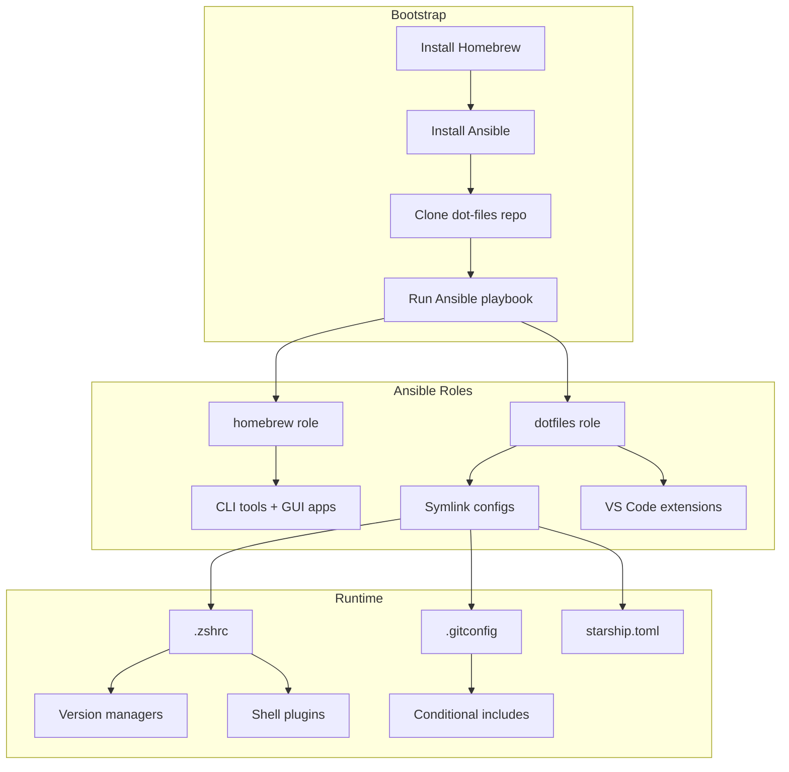

# macOS Developer Environment Setup

A production-ready development environment for macOS, designed around keyboard-driven workflows, reproducible setup via Ansible, and modern CLI tools that replace legacy UNIX utilities. This configuration separates work and personal contexts at the Git, SSH, and directory levels. Optimized for Apple Silicon with sub-100ms shell startup.

<figure>



<figcaption>Bootstrap flow: Homebrew → Ansible → tool installation + config symlinking. Runtime loads shell config, git profiles, and prompt.</figcaption>
</figure>

## Abstract

The setup centers on three principles:

1. **Declarative automation**: An Ansible playbook installs all tools and symlinks all configuration files—a fresh machine reaches full productivity in one command.
2. **Context separation**: Git config uses `includeIf` to load different identities based on repo path (`~/work/` vs `~/personal/`). SSH config maps hosts to identity files.
3. **Modern CLI replacements**: `eza` > `ls`, `bat` > `cat`, `ripgrep` > `grep`, `fzf` for fuzzy search, `zoxide` for directory jumping—each is faster and more ergonomic than its predecessor.

The configuration assumes macOS with Apple Silicon (M1/M2/M3/M4). Paths reference `/opt/homebrew`; Intel Macs use `/usr/local`.

## Shell Configuration

The `.zshrc` is organized into numbered sections that load in dependency order. The design ensures version managers initialize before tools that depend on them, and plugins that modify the prompt load last. Target startup time: under 100ms.

### PATH and Homebrew

```zsh title=".zshrc" collapse={1-8}
########################################
# ~/.zshrc - Sujeet's shell configuration
########################################

########################################
# 0. Early environment / Homebrew setup
########################################

# Static Homebrew paths (faster than eval "$(brew shellenv)")
export HOMEBREW_PREFIX="/opt/homebrew"
export HOMEBREW_CELLAR="/opt/homebrew/Cellar"
export HOMEBREW_REPOSITORY="/opt/homebrew"

export PATH="$HOME/.local/bin:$PATH"
export PATH="$HOMEBREW_PREFIX/bin:$HOMEBREW_PREFIX/sbin:$PATH"
export FPATH="$HOMEBREW_PREFIX/share/zsh/site-functions:$FPATH"
```

**Why static paths over `brew shellenv`**: The `eval "$(brew shellenv)"` call spawns a subprocess (~50-400ms). Since Homebrew paths are constant on Apple Silicon (`/opt/homebrew`), hardcoding them saves startup time. Intel Macs use `/usr/local` instead.

### Version Managers

The config supports four language ecosystems via dedicated version managers:

| Language   | Manager | Root Directory | Init Mechanism                            |
| ---------- | ------- | -------------- | ----------------------------------------- |
| Go         | goenv   | `~/.goenv`     | `eval "$(goenv init -)"`                  |
| Python     | pyenv   | `~/.pyenv`     | `eval "$(pyenv init -)"`                  |
| Java (JVM) | SDKMAN  | `~/.sdkman`    | `source "$SDKMAN_DIR/bin/sdkman-init.sh"` |
| Node.js    | fnm     | `~/.fnm`       | `eval "$(fnm env --use-on-cd)"`           |

```zsh title=".zshrc" collapse={1-3, 8-10, 15-17, 22-24}
# --- Go (goenv) ---
export GOENV_ROOT="$HOME/.goenv"
export PATH="$GOENV_ROOT/bin:$PATH"
if command -v goenv &>/dev/null; then
  eval "$(goenv init -)"
fi

# --- Python (pyenv) ---
export PYENV_ROOT="$HOME/.pyenv"
export PATH="$PYENV_ROOT/bin:$PATH"
if command -v pyenv &>/dev/null; then
  eval "$(pyenv init -)"
fi

# --- Java (SDKMAN) ---
export SDKMAN_DIR="$HOME/.sdkman"
if [ -s "$SDKMAN_DIR/bin/sdkman-init.sh" ]; then
  source "$SDKMAN_DIR/bin/sdkman-init.sh"
fi

# --- Node.js (fnm) ---
export FNM_DIR="$HOME/.fnm"
if command -v fnm &>/dev/null; then
  eval "$(fnm env --use-on-cd)"
fi
```

**Why fnm over nvm/Volta**: fnm (Fast Node Manager) is written in Rust and initializes in ~5ms versus nvm's 500-2000ms. The `--use-on-cd` flag auto-switches versions when entering directories with `.nvmrc` or `.node-version` files. fnm is now listed as the default download option on nodejs.org.

> **Migration note**: Volta was previously recommended here but is now unmaintained as of 2024. The Volta team recommends migrating to mise or fnm. Existing Volta installations continue to work but won't receive updates for OS changes or ecosystem breakages.

### History Configuration

```zsh title=".zshrc"
export HISTFILE="$HOME/.zsh_history"
export HISTSIZE=100000
export SAVEHIST=100000

setopt EXTENDED_HISTORY        # Write format ':start:elapsed;command'
setopt SHARE_HISTORY           # Share across all sessions (implies INC_APPEND_HISTORY)
setopt HIST_EXPIRE_DUPS_FIRST  # Expire duplicates first when trimming
setopt HIST_IGNORE_ALL_DUPS    # Delete old duplicate when new is added
setopt HIST_FIND_NO_DUPS       # Don't show duplicates in search
setopt HIST_IGNORE_SPACE       # Don't record commands starting with space
setopt HIST_SAVE_NO_DUPS       # Don't write duplicates to file
setopt HIST_REDUCE_BLANKS      # Strip extra whitespace
setopt HIST_VERIFY             # Expand history before executing
```

**Why 100K entries**: Disk is cheap; losing a command you ran six months ago is expensive. The deduplication options (`HIST_IGNORE_ALL_DUPS`, `HIST_SAVE_NO_DUPS`, `HIST_FIND_NO_DUPS`) prevent bloat from repeated commands.

**Why `SHARE_HISTORY` alone**: It implicitly enables `INC_APPEND_HISTORY`. Setting both can cause conflicts. `EXTENDED_HISTORY` adds timestamps, enabling time-based search and forensics.

### Prefix-Based History Search

```zsh title=".zshrc"
bindkey '^[[A' history-beginning-search-backward   # Up arrow
bindkey '^[[B' history-beginning-search-forward    # Down arrow
```

Type `git co` then press Up—cycles through all history entries starting with `git co`. This is more useful than generic reverse search for common prefixes.

### Completion System

```zsh title=".zshrc"
# Rebuild completion cache only once per day
autoload -Uz compinit
if [ "$(date +'%j')" != "$(stat -f '%Sm' -t '%j' ~/.zcompdump 2>/dev/null)" ]; then
  compinit
else
  compinit -C  # Skip security check, use cache
fi

zstyle ':completion:*' menu select
zstyle ':completion:*' matcher-list 'm:{a-z}={A-Z}' 'r:|=*' 'l:|=*'
zstyle ':completion:*' completer _complete _approximate _expand_alias

setopt COMPLETE_IN_WORD
setopt AUTO_MENU
setopt AUTO_LIST
```

**Why daily cache**: `compinit` regenerates completion definitions on every startup unless cached. The date check rebuilds once per day; `compinit -C` skips security checks on subsequent loads, saving ~100-200ms.

The `matcher-list` enables case-insensitive matching and fuzzy completion. `menu select` shows a navigable menu when multiple completions exist. The `completer` style adds approximate matching and alias expansion.

## Modern CLI Replacements

These tools are faster, have better defaults, and produce more readable output than their UNIX predecessors. All are written in Rust or Go for performance.

| Legacy | Replacement | Key Improvements                                              |
| ------ | ----------- | ------------------------------------------------------------- |
| `ls`   | `eza`       | Git status, icons (Nerd Font), tree view, color by type       |
| `cat`  | `bat`       | Syntax highlighting, line numbers, Git integration            |
| `grep` | `ripgrep`   | Respects `.gitignore`, parallel search, faster on large trees |
| `find` | `fd`        | Simpler syntax, respects `.gitignore`, regex by default       |
| `find` | `fzf`       | Interactive fuzzy finder for files, history, anything         |
| `cd`   | `zoxide`    | Frecency-based jumping, learns from usage                     |
| `man`  | `tldr`      | Concise examples instead of verbose manuals                   |

> **Note on eza**: eza is the community-maintained fork of exa, which was discontinued in June 2023. eza receives active updates including new Nerd Fonts icon support.

### Aliases

```zsh title=".zshrc"
# eza aliases (requires Nerd Font)
alias ll="eza -lah --icons"
alias tree="eza --tree --level=2 --icons"

# Directory navigation
alias ..="cd .."
alias ...="cd ../.."

# Git shortcuts
alias gs="git status"
alias gl="git log --oneline --graph --decorate"
alias gcl='git checkout $(git branch | fzf | sed "s/^[* ]*//")'      # Local branch picker
alias gcr='git checkout $(git branch -r | fzf | sed "s/^[* ]*//" | sed "s/origin\///")'  # Remote branch picker
```

The `gcl` and `gcr` aliases pipe branch lists through `fzf` for interactive selection—eliminates typing branch names.

### Fuzzy Finder Integration

```zsh title=".zshrc"
if command -v fzf &>/dev/null; then
  source <(fzf --zsh)
fi
```

This enables (as of fzf v0.48.0+):

- `Ctrl+R`: Fuzzy search command history
- `Ctrl+T`: Fuzzy search files in current directory
- `Alt+C`: Fuzzy search and cd into directories

The `fzf --zsh` syntax is the modern shell integration method introduced in v0.48.0. It uses fzf's built-in file walker instead of spawning `find`, improving performance.

> **Breaking change**: fzf v0.51.0+ requires zsh 5.1 or later. If using an older zsh version, pin fzf to v0.50.0.

### Directory Jumping with zoxide

```zsh title=".zshrc"
if command -v zoxide &>/dev/null; then
  eval "$(zoxide init zsh)"
fi
```

After visiting directories, `z <pattern>` jumps to the most frecent (frequent + recent) match. `z proj` might jump to `~/work/my-project` if you visit it often.

**Frecency algorithm**: Each directory starts with a score of 1, incremented on each access. Scores decay based on last access time. When total score exceeds `_ZO_MAXAGE` (default: 10000), all scores are reduced to ~90% of max, and directories below score 1 are pruned.

> **Dependency**: zoxide v0.9.8+ requires fzf v0.51.0+ for interactive selection. Update fzf if `zi` (interactive mode) fails.

## Shell Plugins

### Autosuggestions

```zsh title=".zshrc"
if [ -f "$HOMEBREW_PREFIX/share/zsh-autosuggestions/zsh-autosuggestions.zsh" ]; then
  source "$HOMEBREW_PREFIX/share/zsh-autosuggestions/zsh-autosuggestions.zsh"
fi
```

Shows grayed-out suggestions as you type, based on history. Press Right Arrow to accept.

### Syntax Highlighting

```zsh title=".zshrc"
# Must be sourced last for best compatibility
if [ -f "$HOMEBREW_PREFIX/share/zsh-syntax-highlighting/zsh-syntax-highlighting.zsh" ]; then
  source "$HOMEBREW_PREFIX/share/zsh-syntax-highlighting/zsh-syntax-highlighting.zsh"
fi
```

Colors commands, options, and paths as you type. Invalid commands appear red before you hit Enter.

**Why last**: The plugin hooks into the line editor. Loading it after other plugins ensures it sees the final state of each line.

## Starship Prompt

Starship is a Rust-based prompt that renders in ~10ms. Configuration lives in `~/.config/starship.toml`. As of v1.24.x (December 2025), Starship includes parallelized module loading and improved context detection.

### Core Configuration

```toml title="starship.toml"
add_newline = true
command_timeout = 800
scan_timeout = 50

format = """
$directory$git_branch$git_status$python$nodejs$golang$java
$character"""
```

The prompt shows: directory → git branch → git status → active language version → newline → prompt character.

### Prompt Character

```toml title="starship.toml"
[character]
success_symbol = "[❯](bold green) "
error_symbol = "[❯](bold red) "
vicmd_symbol = "[❮](bold yellow) "
```

The character changes color based on exit code—instant visual feedback for failed commands.

### Git Status Symbols

```toml title="starship.toml"
[git_status]
format = "[($all_status$ahead_behind )]($style)"
conflicted = "≠"
ahead = "⇡"
behind = "⇣"
diverged = "⇕"
untracked = "…"
stashed = "⚑"
modified = "✚"
staged = "●"
renamed = "»"
deleted = "✖"
```

These symbols appear only when relevant. A clean repo shows nothing; a repo with staged and modified files shows `●✚`.

### Language Version Indicators

```toml title="starship.toml"
[python]
symbol = " "
format = "[$symbol$version]($style) "

[nodejs]
symbol = "⬢ "
format = "[$symbol$version]($style) "

[golang]
symbol = " "
format = "[$symbol$version]($style) "

[java]
symbol = "☕ "
format = "[$symbol$version]($style) "
```

Starship detects language context via marker files (`package.json`, `go.mod`, `pom.xml`, etc.) and displays the active version. This requires a Nerd Font for icon rendering.

## Git Configuration

The Git setup uses conditional includes to load different identities based on repository path.

### Base Configuration

```ini title=".gitconfig" collapse={1-14}
########################################
# ~/.gitconfig - Global Git config
########################################
#
# Directory conventions:
#   - All work repos under:     ~/work/
#   - All personal repos under: ~/personal/
#
# Git will automatically load:
#   - ~/.gitconfig-work      if repo lives under ~/work/
#   - ~/.gitconfig-personal  if repo lives under ~/personal/
########################################

[user]
    name = Sujeet
    # Email NOT set here—forces work/personal to specify

[init]
    defaultBranch = main

[push]
    autoSetupRemote = true
    default = simple
    useForceIfIncludes = true

[pull]
    rebase = true

[fetch]
    prune = true

[rebase]
    autoStash = true

[rerere]
    enabled = true
    autoupdate = true

[column]
    ui = auto

[branch]
    sort = -committerdate

[commit]
    verbose = true

[alias]
    co = checkout
    br = branch
    st = status -sb
    ci = commit
    lg = log --oneline --graph --decorate --all
```

**Why no email in base config**: Forces explicit configuration per context. Committing with the wrong email to a work repo (or vice versa) is a compliance issue in some organizations.

**Why `pull.rebase = true`**: Creates a linear history by replaying local commits on top of upstream changes. Cleaner than merge commits for feature branches. `rebase.autoStash` handles uncommitted changes automatically.

**Why `push.useForceIfIncludes = true`** (Git 2.30+): Makes `--force-with-lease` safer by ensuring the remote tip was actually fetched locally, preventing accidental overwrites when the remote was updated between your last fetch and push.

**Why `rerere.enabled = true`**: "Reuse Recorded Resolution" remembers how you resolved merge conflicts and auto-applies the same resolution next time. Essential for long-running branches with repeated rebases.

**Why `fetch.prune = true`**: Automatically removes remote-tracking references to deleted branches. Keeps `git branch -r` clean.

**Why `branch.sort = -committerdate`**: Shows most recently committed branches first in `git branch` output. More useful than alphabetical sorting.

### Conditional Includes

```ini title=".gitconfig"
[includeIf "gitdir:~/work/"]
    path = ~/.gitconfig-work

[includeIf "gitdir:~/personal/"]
    path = ~/.gitconfig-personal

# Alternative: match by remote URL (Git 2.36+)
# [includeIf "hasconfig:remote.*.url:git@github.com:mycompany/**"]
#     path = ~/.gitconfig-company
```

Git evaluates `gitdir:` against the repository's `.git` directory path. Any repo under `~/work/` loads `.gitconfig-work`; repos under `~/personal/` load `.gitconfig-personal`.

**Available conditions** (as of Git 2.48):

| Condition                      | Since    | Use Case                                |
| ------------------------------ | -------- | --------------------------------------- |
| `gitdir:`                      | Git 2.13 | Match by repo path                      |
| `gitdir/i:`                    | Git 2.13 | Case-insensitive (Windows)              |
| `onbranch:`                    | Git 2.23 | Match by current branch                 |
| `hasconfig:remote.*.url:`      | Git 2.36 | Match by remote URL pattern             |

The `hasconfig:remote.*.url:` condition is useful when repos aren't organized by directory but by remote (e.g., all `github.com/mycompany/*` repos should use work email regardless of local path).

### Personal Profile

```ini title=".gitconfig-personal"
[user]
    name = Sujeet
    email = contact@sujeet.pro
```

### Work Profile

```ini title=".gitconfig-work"
[user]
    name = Sujeet
    email = sujeet@company-name.com
```

## SSH Configuration

SSH config maps hosts to identity files, enabling different keys for different services.

```ini title=".ssh/config"
Host github.com
  HostName github.com
  User git
  IdentityFile ~/.ssh/id_ed25519_personal

Host bitbucket.org
  HostName bitbucket.org
  User git
  IdentityFile ~/.ssh/id_ed25519_work
```

**Why Ed25519**: Smaller keys (256-bit vs RSA's 2048+), faster operations, and no known weaknesses. Ed25519 is now the default recommendation from GitHub and GitLab. RSA is only needed for legacy systems that don't support modern algorithms.

**Key generation**:

```bash
ssh-keygen -t ed25519 -C "your_email@example.com"
```

This pattern extends to any service: add a `Host` block with the appropriate `IdentityFile`. For high-security environments, consider hardware security keys (YubiKey) which store the private key on the device.

## Editor Setup

### VS Code Configuration

```json title=".vscode/settings.json"
{
  "editor.fontFamily": "'JetBrains Mono', Menlo, Monaco, 'Courier New', monospace",
  "editor.fontSize": 16,
  "terminal.integrated.fontFamily": "'JetBrainsMono Nerd Font'",
  "terminal.integrated.fontSize": 14,
  "files.associations": {
    "**/.gitconfig-work": "properties",
    "**/.gitconfig-personal": "properties",
    "**/starship.toml": "toml",
    "**/.aws/credentials": "ini",
    "**/.aws/config": "ini"
  }
}
```

**Why separate fonts**: The editor uses JetBrains Mono (ligatures, readability). The integrated terminal uses the Nerd Font variant for icon support in `eza`, `starship`, etc.

### Recommended Extensions

| Extension                   | Purpose                   |
| --------------------------- | ------------------------- |
| `anthropic.claude-code`     | AI coding assistant       |
| `astro-build.astro-vscode`  | Astro framework support   |
| `bradlc.vscode-tailwindcss` | Tailwind CSS IntelliSense |
| `dbaeumer.vscode-eslint`    | ESLint integration        |
| `esbenp.prettier-vscode`    | Code formatting           |
| `humao.rest-client`         | HTTP client in editor     |
| `mrmlnc.vscode-json5`       | JSON5 syntax support      |
| `tamasfe.even-better-toml`  | TOML language support     |

## Automated Setup with Ansible

The entire configuration is applied via a single Ansible playbook.

### Prerequisites

```bash
# 1. Install Homebrew
/bin/bash -c "$(curl -fsSL https://raw.githubusercontent.com/Homebrew/install/HEAD/install.sh)"

# 2. Install Ansible
brew install ansible

# 3. Clone the dot-files repo
git clone https://github.com/your-username/dot-files.git ~/dot-files
cd ~/dot-files
```

### Running the Playbook

```bash
ansible-playbook setup.yml --ask-become-pass
```

The playbook:

1. **Homebrew role**: Installs all CLI tools (formulae) and GUI applications (casks)
2. **Dotfiles role**: Creates directories, symlinks configs, sets SSH permissions, installs VS Code extensions

### Homebrew Packages

```yaml title="roles/homebrew/vars/main.yml"
homebrew_formulae:
  - aichat
  - ansible
  - awscli
  - bat
  - eza
  - fd
  - fnm
  - fzf
  - httpie
  - ripgrep
  - starship
  - tlrc
  - tree
  - zoxide
  - zsh-autosuggestions
  - zsh-syntax-highlighting

homebrew_casks:
  - cursor
  - visual-studio-code
  - chatgpt-atlas
  - claude
  - claude-code
  - zoom
  - maccy
  - rectangle
  - font-jetbrains-mono
  - font-jetbrains-mono-nerd-font
```

### Dotfiles Symlinking

```yaml title="roles/dotfiles/vars/main.yml"
dotfiles_links:
  - src: ".zshrc"
    dest: ".zshrc"
  - src: ".gitconfig"
    dest: ".gitconfig"
  - src: ".gitconfig-personal"
    dest: ".gitconfig-personal"
  - src: ".gitconfig-work"
    dest: ".gitconfig-work"
  - src: ".config/starship.toml"
    dest: ".config/starship.toml"
  - src: ".ssh/config"
    dest: ".ssh/config"
```

Symlinks point from `~/.zshrc` → `~/dot-files/.zshrc`. Changes in either location reflect immediately. The repo is the source of truth; push changes to propagate across machines.

## Productivity Applications

### Window Management

**Rectangle** (`rectangle` cask): Keyboard-driven window tiling. `Ctrl+Option+←` snaps to left half; `Ctrl+Option+→` snaps to right. Eliminates mouse-based window arrangement.

### Clipboard Manager

**Maccy** (`maccy` cask): Clipboard history with fuzzy search. `Cmd+Shift+C` opens history; type to filter; Enter to paste. Essential when copying multiple items.

### AI Tools

| Tool                 | Purpose                                          |
| -------------------- | ------------------------------------------------ |
| `aichat`             | CLI interface to multiple LLMs (aliased to `ai`) |
| Claude (desktop app) | Conversational AI assistant                      |
| Claude Code          | AI coding agent for terminal                     |
| ChatGPT Atlas        | Browser with ChatGPT integration                 |

## Conclusion

This setup optimizes for:

- **Reproducibility**: One Ansible command provisions a new machine
- **Context isolation**: Git commits, SSH keys, and directory structure enforce work/personal separation
- **Keyboard efficiency**: Fuzzy finders, aliases, and tiling window managers minimize mouse usage
- **Modern tooling**: CLI replacements that are faster and produce better output

The configuration is opinionated but modular. Swap version managers, remove unused language indicators, or add new Homebrew packages by editing the respective YAML files.

## Appendix

### Prerequisites

- macOS 13+ with Apple Silicon (M1/M2/M3/M4); Intel requires path adjustments (`/usr/local` instead of `/opt/homebrew`)
- Homebrew installed
- zsh 5.1+ (macOS ships with zsh 5.9 as of macOS 14)
- Basic familiarity with shell configuration and Git

### Terminology

- **Frecency**: Frequency + recency ranking algorithm used by zoxide; balances how often and how recently a directory was visited
- **Nerd Font**: Font patched with 3000+ icons for terminal display (file types, git status, language logos)
- **Shim**: Wrapper script that intercepts commands and routes to the correct version; used by version managers like fnm and pyenv
- **rerere**: "Reuse Recorded Resolution"—Git feature that remembers conflict resolutions for automatic reapplication
- **compinit**: Zsh completion initialization; generates and caches completion definitions

### Summary

- Ansible playbook automates full environment setup from a fresh macOS install
- `.zshrc` loads version managers, configures history, enables fuzzy search and autosuggestions; targets sub-100ms startup
- Static Homebrew paths and daily compinit caching eliminate common startup bottlenecks
- Starship prompt shows git status and language versions with ~10ms render time
- Git conditional includes (`gitdir:`, `hasconfig:remote.*.url:`) load different identities based on repo location or remote URL
- SSH config maps hosts to Ed25519 identity files for work/personal key separation
- Modern CLI tools (`eza`, `bat`, `ripgrep`, `fzf`, `zoxide`, `fd`) replace legacy UNIX utilities
- fnm replaces Volta for Node.js version management (Volta is now unmaintained)

### References

- [Git Configuration Documentation](https://git-scm.com/docs/git-config) - Official Git config reference including conditional includes
- [Zsh Options](https://zsh.sourceforge.io/Doc/Release/Options.html) - Complete list of setopt flags
- [Zsh Completion System](https://zsh.sourceforge.io/Doc/Release/Completion-System.html) - compinit and zstyle reference
- [Starship Configuration](https://starship.rs/config/) - Prompt customization reference
- [fzf Shell Integration](https://junegunn.github.io/fzf/shell-integration/) - Modern shell setup (v0.48.0+)
- [zoxide Algorithm](https://github.com/ajeetdsouza/zoxide/wiki/Algorithm) - Frecency ranking explanation
- [fnm Documentation](https://github.com/Schniz/fnm) - Fast Node Manager setup and usage
- [eza Documentation](https://eza.rocks/) - Modern ls replacement (exa fork)
- [Ansible Homebrew Module](https://docs.ansible.com/ansible/latest/collections/community/general/homebrew_module.html) - Package installation
- [Volta Deprecation Notice](https://github.com/volta-cli/volta/issues/2080) - Migration guidance to mise/fnm
