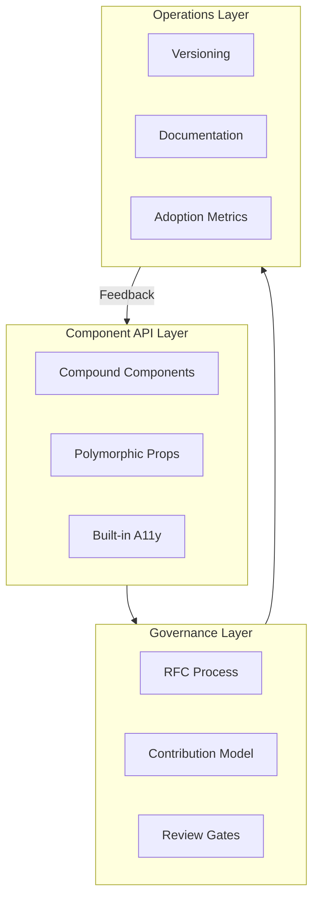

# Component Library Architecture and Governance

A component library is a product with internal customers. Its success depends on API stability, contribution workflows, and operational rigor. This article covers the architectural decisions and governance models that separate thriving design systems from abandoned experiments.

The focus is on React-based systems, though most principles apply across frameworks.

<figure>



<figcaption>Component libraries operate as products with three interconnected layers: API design shapes developer experience, governance manages change, and operations ensure sustainable adoption.</figcaption>
</figure>

## Abstract

A component library succeeds when it achieves three things: predictable APIs that don't break consumers, a governance model that balances velocity with consistency, and operational practices that treat documentation and tooling as first-class features.

**API design** centers on composition over configuration. Compound components using React Context provide explicit state management without prop drilling. Supporting both controlled and uncontrolled modes maximizes flexibility. Polymorphic components (via `as` or `asChild` props) give consumers DOM control. Accessibility must be baked into the API layer—handled by the component, not delegated to consumers.

**Versioning** follows Semantic Versioning (SemVer) strictly. Deprecation happens across release cycles with clear migration paths. Codemods automate breaking changes at scale. Per-component versioning signals maturity in large systems.

**Governance** scales through federation. A dedicated core team maintains standards while distributed contributors add domain-specific components. RFCs (Request for Comments) formalize substantial changes. Inner-source practices—visibility, pull requests, documentation—break silos and increase reuse.

**Quality gates** automate what can be automated. Accessibility testing with axe-core catches roughly 57% of WCAG issues but doesn't replace manual audits. Visual regression testing (Chromatic, Percy) prevents unintended changes. Performance budgets prevent library bloat.

**Adoption** requires active enablement: playbooks, champions, training. Measure contextually—who uses which components, not just download counts.

## Component API Design Principles

API design determines whether teams adopt your library or route around it. The goal is flexibility without complexity—components that handle common cases simply while enabling advanced customization.

### Composition Patterns

The compound component pattern solves the "prop explosion" problem. Instead of passing every option to a single component, related pieces compose together:

```tsx title="Dialog compound components" collapse={1-4, 18-20}
import { Dialog } from "@acme/ui"

// Usage - explicit, composable structure
function ConfirmDialog({ onConfirm, onCancel }) {
  return (
    <Dialog.Root>
      <Dialog.Trigger>Delete Item</Dialog.Trigger>
      <Dialog.Portal>
        <Dialog.Overlay />
        <Dialog.Content>
          <Dialog.Title>Confirm Deletion</Dialog.Title>
          <Dialog.Description>This action cannot be undone.</Dialog.Description>
          <Dialog.Close onClick={onCancel}>Cancel</Dialog.Close>
          <button onClick={onConfirm}>Confirm</button>
        </Dialog.Content>
      </Dialog.Portal>
    </Dialog.Root>
  )
}
```

The parent component (`Dialog.Root`) manages shared state via React Context. Child components access state through that context. This pattern provides explicit structure without prop drilling and enables consumers to omit pieces they don't need.

Radix UI, Headless UI, and Chakra UI all use this pattern. The alternative—a single `<Dialog>` component with 15+ props—creates APIs that are hard to learn, harder to type, and impossible to extend.

**Trade-offs**: Compound components require more JSX to use correctly. Simple use cases take more lines than a single-component API. The explicit structure is worth it for complex components but overkill for primitives like `Button`.

### Controlled vs Uncontrolled Components

Components should support both controlled and uncontrolled modes. Controlled components receive state externally via props:

```tsx title="Controlled input" {3,5}
function ControlledExample() {
  const [value, setValue] = useState("")

  return <Input value={value} onChange={(e) => setValue(e.target.value)} />
}
```

Uncontrolled components manage state internally:

```tsx title="Uncontrolled input" {3}
function UncontrolledExample() {
  const inputRef = useRef<HTMLInputElement>(null)

  return <Input ref={inputRef} defaultValue="" />
}
```

**Design rule**: A component must not switch between controlled and uncontrolled modes during its lifetime. React will warn if `value` changes from `undefined` to a defined value, indicating the component switched modes.

Controlled mode enables validation on every keystroke and predictable state management. Uncontrolled mode works better for non-React integrations and reduces re-renders for large forms.

### Polymorphic Components

The `as` prop allows consumers to change the rendered element:

```tsx title="Polymorphic button usage"
<Button as="a" href="/dashboard">
  Go to Dashboard
</Button>
```

This keeps styling and behavior while rendering the appropriate semantic element. MUI, Chakra UI, and Styled Components use this pattern extensively.

Radix UI takes an alternative approach with `asChild`:

```tsx title="asChild pattern"
<Dialog.Trigger asChild>
  <Button variant="outline">Open Dialog</Button>
</Dialog.Trigger>
```

When `asChild={true}`, the component clones the child element instead of rendering its default DOM element. Props and behavior pass to the child. This keeps DOM semantics explicit—consumers see exactly what renders.

**TypeScript complexity**: Polymorphic components require advanced typing to infer the correct props for the `as` target. Libraries like `@radix-ui/react-polymorphic` provide utility types, but the complexity is real. `asChild` avoids this by delegating element choice entirely to consumers.

### Accessibility Built Into APIs

Accessibility implementation belongs in the component library, not consumer code. Components should handle:

- **ARIA attributes**: `aria-expanded`, `aria-controls`, `aria-labelledby`
- **Focus management**: Trapping focus in modals, restoring focus on close
- **Keyboard navigation**: Arrow keys for menus, Escape to close
- **Role semantics**: Correct `role` attributes for custom widgets

Radix Primitives implements WAI-ARIA design patterns for all components. React Aria (Adobe) provides 40+ hooks with built-in behavior, adaptive interactions, and internationalization (i18n). The goal is zero-cost abstractions—accessibility without forcing styling opinions.

**Why this matters**: Implementing accessible dialogs, comboboxes, or disclosure widgets correctly is difficult. Getting focus management right requires handling edge cases most developers won't discover until production. Centralizing this logic in the library means fixing it once benefits everyone.

## Versioning, Deprecation, and Upgrade Paths

Versioning signals stability to consumers. Get it wrong and teams will pin to old versions indefinitely rather than risk breakage.

### Semantic Versioning for Component Libraries

SemVer (Semantic Versioning) uses `MAJOR.MINOR.PATCH`:

- **Major**: Breaking changes to existing APIs
- **Minor**: New features without breaking existing functionality
- **Patch**: Bug fixes and documentation updates

This seems obvious, but the definition of "breaking change" matters. In component libraries, breaking changes include:

- Removing or renaming props
- Changing default values
- Altering event handler signatures
- Modifying DOM structure (affects selectors in tests)
- Changing TypeScript types

**Design decision**: Some teams version the entire library (monolithic—all components at v3.2.1). Others version per-component (Button v2.1.0, Dialog v1.4.0). Per-component versioning signals component maturity and allows independent release cadences. Atlassian adopted per-component SemVer by 2023 with detailed changelogs per package. The overhead is higher but the flexibility benefits large systems.

### Deprecation Patterns

Deprecation requires lead time. The standard flow:

1. Mark component as deprecated in code and design library
2. Issue a minor release with deprecation warnings (console warnings in development)
3. Document migration path—what replaces it, how to migrate
4. Maintain at least one minor release cycle before removal
5. Remove in the next major version

**Rolling deprecation** spreads impact over time. Instead of deprecating 10 components simultaneously, deprecate 2-3 per minor release. Teams can plan updates incrementally.

```tsx title="Deprecation warning pattern" collapse={1-2, 9-12}
import { useEffect } from "react"

function DeprecatedCard(props) {
  useEffect(() => {
    console.warn(
      "[ACME UI] Card is deprecated and will be removed in v4.0. " +
        "Use Surface instead: https://acme.design/migration/card",
    )
  }, [])

  return <Surface {...props} />
}
```

### Codemods for Automated Migration

Codemods transform code programmatically using Abstract Syntax Tree (AST) manipulation. For breaking changes, they automate what would otherwise be manual find-and-replace across codebases.

jscodeshift is the primary tool. A codemod for renaming a prop:

```js title="Codemod: rename 'size' to 'scale'" collapse={1-2}
// Run: npx jscodeshift -t rename-size-prop.js src/**/*.tsx
export default function transformer(file, api) {
  const j = api.jscodeshift

  return j(file.source)
    .find(j.JSXAttribute, { name: { name: "size" } })
    .filter((path) => {
      const parent = path.parentPath.value
      return parent.name?.name === "Button"
    })
    .forEach((path) => {
      path.node.name.name = "scale"
    })
    .toSource()
}
```

**Real-world usage**: MUI provides codemods for API updates between major versions. Next.js ships codemods for async API transformations. React 19's upgrade guide includes codemods for deprecated patterns.

Codemods reduce migration burden and accelerate major version adoption. The investment pays off at scale—writing a codemod once saves hundreds of manual changes across consuming teams.

## Contribution and Review Workflows

Governance determines who can change what, how changes are proposed, and what quality bars must be met. The model you choose affects both quality and velocity.

### RFC Process for Substantial Changes

The RFC (Request for Comments) process formalizes design consensus before implementation. Large changes—new components, API overhauls, breaking changes—go through structured review.

A typical RFC workflow:

1. **Propose**: Author submits RFC document describing the problem, proposed solution, alternatives considered, and migration impact
2. **Discuss**: Core team and stakeholders comment, request changes, raise concerns
3. **Decide**: Core team approves, requests revision, or rejects
4. **Implement**: Approved RFCs move to implementation
5. **Document**: API documentation and migration guides accompany release

Carbon Design System maintains RFCs in a dedicated repository. Each RFC has a standard template covering motivation, detailed design, drawbacks, alternatives, and adoption strategy.

**Why RFCs matter**: They create a written record of design decisions. Six months later, when someone asks "why does this API work this way?", the RFC explains the reasoning and rejected alternatives.

### Federated vs Centralized Ownership

**Centralized model**: A single team makes all decisions and builds all components. This works for early-stage systems or organizations requiring strict brand consistency. The bottleneck is capacity—requests queue behind the core team's bandwidth.

**Federated model**: Multiple teams contribute under shared guidelines. A core team maintains standards, tooling, and governance. Product teams contribute domain-specific components. Atlassian evolved to this model with "design system champions" embedded across the organization.

**Trade-offs**:

| Aspect       | Centralized               | Federated                              |
| ------------ | ------------------------- | -------------------------------------- |
| Consistency  | High (single team vision) | Requires active governance             |
| Velocity     | Limited by core capacity  | Scales with contributors               |
| Expertise    | Deep in core team         | Distributed across org                 |
| Coordination | Minimal                   | Requires clear processes               |
| Adoption     | Push model (core decides) | Pull model (teams request what's used) |

Most mature systems land on federated with strong governance. Shopify's Polaris balances autonomy with coherence across 100+ teams through design proposal templates and designated councils for triage.

### Inner-Source Practices

Inner-source applies open-source practices within an organization. The component library becomes an internal project where any team can contribute, subject to review.

Seven key practices:

1. **Visibility**: Development happens in the open (within the org). Anyone can see PRs, issues, roadmaps
2. **Forking**: Teams can fork for experimentation before contributing upstream
3. **Pull requests**: All changes go through code review
4. **Testing**: Automated quality gates (see next section)
5. **CI/CD**: Continuous integration validates every change
6. **Documentation**: Contributing guides, architecture decision records (ADRs), API docs
7. **Issue tracking**: Public (internal) backlog for feature requests and bugs

**Benefits**: Breaks silos. Leverages expertise across the entire developer pool. Increases reuse because teams see what exists before building custom solutions. "Given enough eyeballs, all bugs are shallow"—broader review catches issues faster.

### Contribution Criteria

Clear criteria prevent scope creep. Atlassian's design system explicitly states what it accepts:

- **Accepts**: Bug fixes, small enhancements (new icons, color variants), accessibility improvements
- **May decline**: Major feature enhancements, entirely new components/patterns that don't generalize

The test: Does this addition benefit multiple teams, or is it specific to one product? Components that generalize belong in the library. One-offs belong in product codebases.

## Documentation and Example Strategy

Documentation is a product feature. Undocumented components are undiscoverable. Poorly documented components generate support burden that scales with adoption.

### Storybook as Documentation

Storybook provides a UI development environment for isolated component development. It doubles as interactive documentation.

**Design tokens integration**: The `storybook-design-token` addon displays token documentation alongside components. Consumers see which tokens a component uses, enabling consistent customization.

**Story patterns**:

```tsx title="Button.stories.tsx" collapse={1-3, 10-20}
import type { Meta, StoryObj } from "@storybook/react"
import { Button } from "./Button"

const meta: Meta<typeof Button> = {
  component: Button,
  tags: ["autodocs"],
}

export default meta
type Story = StoryObj<typeof Button>

export const Primary: Story = {
  args: { variant: "primary", children: "Primary Action" },
}

export const Disabled: Story = {
  args: { variant: "primary", disabled: true, children: "Cannot Click" },
}

export const AsLink: Story = {
  args: { as: "a", href: "/dashboard", children: "Navigate" },
}
```

The `autodocs` tag generates API documentation from TypeScript props. Custom doc blocks add prose explanations, usage guidelines, and accessibility notes.

### API Documentation Generation

TypeScript definitions are documentation. Tools like `react-docgen-typescript` extract props, descriptions, and types to generate API tables.

**Best practice**: Write JSDoc comments on prop interfaces:

```tsx title="Button.types.ts"
export interface ButtonProps {
  /**
   * Visual style variant.
   * @default 'primary'
   */
  variant?: "primary" | "secondary" | "ghost"

  /**
   * Prevents interaction and applies disabled styling.
   * Sets `aria-disabled` when true.
   */
  disabled?: boolean
}
```

These comments become the documentation. No separate doc maintenance required.

### Interactive Examples

Static code examples show syntax. Interactive examples demonstrate behavior. For complex components (data tables, rich text editors), interactive playgrounds let consumers experiment before integrating.

**Pattern**: Embed simplified versions of Storybook stories in documentation sites. Or use tools like Sandpack for editable, runnable examples directly in docs.

## Quality Gates: A11y, Performance, Testing

Quality gates automate enforcement. Manual review doesn't scale; automated checks catch regressions before merge.

### Accessibility Testing

**axe-core** scans for accessibility issues based on WCAG standards. Integration with Jest via `jest-axe`:

```tsx title="Button.a11y.test.tsx" collapse={1-4, 14-16}
import { render } from "@testing-library/react"
import { axe, toHaveNoViolations } from "jest-axe"
import { Button } from "./Button"

expect.extend(toHaveNoViolations)

describe("Button accessibility", () => {
  it("has no axe violations", async () => {
    const { container } = render(<Button>Click me</Button>)
    const results = await axe(container)
    expect(results).toHaveNoViolations()
  })
})
```

**Limitation**: Automated testing catches approximately 57% of WCAG issues on average (per axe-core's own documentation). Manual audits remain essential. Automated tests catch regressions on known issues and provide immediate feedback during development.

### Visual Regression Testing

Visual regression testing compares screenshots between builds to detect unintended changes.

**Chromatic** (by Storybook maintainers):

- Integrates directly with Storybook
- Captures screenshots of every story
- Highlights pixel differences
- Requires approval for intentional changes
- Free tier: 5,000 screenshots/month

**Percy** (by BrowserStack):

- Framework-agnostic (works beyond Storybook)
- Cross-browser screenshot comparison
- AI-powered detection ignores anti-aliasing, focuses on meaningful changes

**When to use which**: Chromatic for component-focused workflows where Storybook is the source of truth. Percy for full-page validation across browsers and devices.

### Performance Budgets

As libraries grow, bundle size creeps up. Performance budgets enforce limits:

- **Per-component size**: Alert if a component exceeds N KB
- **Tree-shaking validation**: Ensure unused components don't end up in consumer bundles
- **CSS growth rate**: Track design system CSS impact on overall page weight

**Metrics worth tracking**:

| Metric                     | What it measures                                            |
| -------------------------- | ----------------------------------------------------------- |
| Component bundle size      | JS/CSS cost of individual components                        |
| Import cost                | Size added when a consumer imports a component              |
| Time to render             | Performance impact on consuming applications                |
| Design system CSS coverage | Percentage of page styles coming from system vs custom code |

Set thresholds and fail CI when exceeded. This forces conversations about whether new features are worth the size cost.

## Operating Model and Staffing

Sustainable design systems require dedicated investment. Side-of-desk efforts produce side-of-desk results.

### Team Composition

Atlassian's design system team (as of 2023): 18 full-time equivalents (FTEs)—5 designers, 1 content writer, 1 product manager, 11 developers.

**Core team responsibilities**:

- Strategic direction and roadmap
- Component API design and implementation
- Tooling (Storybook config, build pipelines, codemods)
- Governance (RFC reviews, contribution triage)
- Documentation and training

**Part-time contributors** from product teams add domain expertise. They build components their teams need, following core team patterns. This federated contribution scales capacity without scaling headcount.

**Design system champions** are advocates embedded in product teams. Not full-time, but engaged—they drive adoption within their teams and surface feedback to the core team.

### Adoption Measurement

Download counts measure distribution, not adoption. Better metrics:

**Code-based**:

- Dependency version freshness (how current are consumers?)
- Component import frequency (which components are actually used?)
- Custom component ratio (how much UI is system vs custom?)

**Contextual** (most valuable):

- Which teams use which components?
- What patterns correlate with successful adoption?
- Where do teams override or detach from system components?

Figma's Library Analytics tracks variable, style, and component usage across organizations. For code, tools like Omlet analyze production codebases to show actual component usage.

**Success criteria to track**:

| Metric                       | Target direction |
| ---------------------------- | ---------------- |
| Designer productivity        | Increase         |
| Custom component creation    | Decrease         |
| Time to build new features   | Decrease         |
| Visual consistency score     | Increase         |
| Accessibility audit findings | Decrease         |

### Active Enablement

Adoption doesn't happen passively. Teams need:

- **Playbooks**: Step-by-step checklists for integrating the system
- **Ambassador programs**: Champions who advocate within their teams
- **Training sessions**: Workshops on component usage and contribution
- **Recognition**: Visibility for teams and individuals contributing quality components
- **Clear pathways**: How to request new components, report bugs, propose changes

Shopify evolved Polaris from passive documentation to active enablement. The result: faster onboarding and higher adoption across 100+ teams.

## Conclusion

Component libraries succeed as products. API stability creates trust. Governance manages change without creating bottlenecks. Documentation and tooling reduce friction. Quality gates enforce standards automatically.

The compound component pattern, SemVer discipline, federated contribution models, and automated quality gates form a foundation that scales. The operating model—dedicated team, embedded champions, active enablement—sustains momentum.

Start with strong API conventions. Add governance when contribution volume demands it. Automate everything that can be automated. Measure what matters: not downloads, but actual adoption in shipped products.

## Appendix

### Prerequisites

- Experience building and maintaining frontend applications at scale
- Familiarity with React component patterns (hooks, context, composition)
- Understanding of SemVer and package management
- Exposure to design systems (either as consumer or contributor)

### Terminology

- **Compound Components**: Pattern where a parent component provides state via Context, and child components consume and act on that state
- **Controlled Component**: Component whose state is managed externally via props (value + onChange pattern)
- **Uncontrolled Component**: Component that manages its own internal state, accessed via refs
- **Polymorphic Component**: Component that can render as different HTML elements via an `as` prop
- **RFC (Request for Comments)**: Formal process for proposing and discussing substantial changes before implementation
- **Inner-source**: Applying open-source development practices (visibility, PRs, documentation) to internal projects
- **Codemod**: Programmatic code transformation using AST manipulation, typically via jscodeshift
- **axe-core**: Open-source JavaScript library for automated accessibility testing based on WCAG standards

### Summary

- **API design**: Compound components for complex widgets, controlled/uncontrolled support, polymorphic props for DOM flexibility, accessibility baked in
- **Versioning**: Strict SemVer, deprecation with lead time, codemods for automated migration, per-component versioning for large systems
- **Governance**: RFC process for substantial changes, federated model for scale, inner-source practices for transparency
- **Quality**: Automated a11y testing (catches ~57% of issues), visual regression testing, performance budgets
- **Operations**: Dedicated core team plus distributed contributors, measure adoption contextually, active enablement over passive documentation

### References

- [Radix UI Primitives - Composition Guide](https://www.radix-ui.com/primitives/docs/guides/composition) - Compound component patterns and asChild
- [Radix Primitives Philosophy](https://github.com/radix-ui/primitives/blob/main/philosophy.md) - Accessibility-first design principles
- [React Aria Documentation](https://react-spectrum.adobe.com/react-aria/) - Adobe's accessibility hooks library
- [Headless UI](https://headlessui.com/) - Tailwind Labs' unstyled accessible components
- [MUI API Design Guide](https://mui.com/material-ui/guides/api/) - Prop spreading and polymorphic patterns
- [Semantic Versioning Specification](https://semver.org/) - MAJOR.MINOR.PATCH semantics
- [Versioning Design Systems](https://medium.com/eightshapes-llc/versioning-design-systems-48cceb5ace4d) - Nathan Curtis on monolithic vs per-component versioning
- [Design System Governance Process](https://bradfrost.com/blog/post/a-design-system-governance-process/) - Brad Frost on RFC and review workflows
- [Carbon Design System RFCs](https://github.com/carbon-design-system/rfcs) - IBM's public RFC repository
- [Atlassian Design System Contribution](https://atlassian.design/contribution/) - Acceptance criteria and federated model
- [Team Models for Scaling a Design System](https://medium.com/eightshapes-llc/team-models-for-scaling-a-design-system-2cf9d03be6a0) - Nathan Curtis on centralized vs federated teams
- [What is InnerSource](https://about.gitlab.com/topics/version-control/what-is-innersource/) - GitLab's guide to internal open-source practices
- [Shopify Polaris Design System](https://www.shopify.com/partners/blog/design-system) - Governance at scale across 100+ teams
- [axe-core Accessibility Engine](https://github.com/dequelabs/axe-core) - Automated WCAG testing
- [jest-axe](https://www.npmjs.com/package/jest-axe) - Jest integration for accessibility testing
- [Chromatic Visual Testing](https://www.chromatic.com/) - Storybook-native visual regression
- [Percy Visual Testing](https://percy.io/) - Cross-browser screenshot comparison
- [Adopting Design Systems](https://medium.com/eightshapes-llc/adopting-design-systems-71e599ff660a) - Playbooks and enablement strategies
- [Measuring Design System Adoption](https://www.figma.com/blog/how-pinterests-design-systems-team-measures-adoption/) - Pinterest's contextual metrics approach
