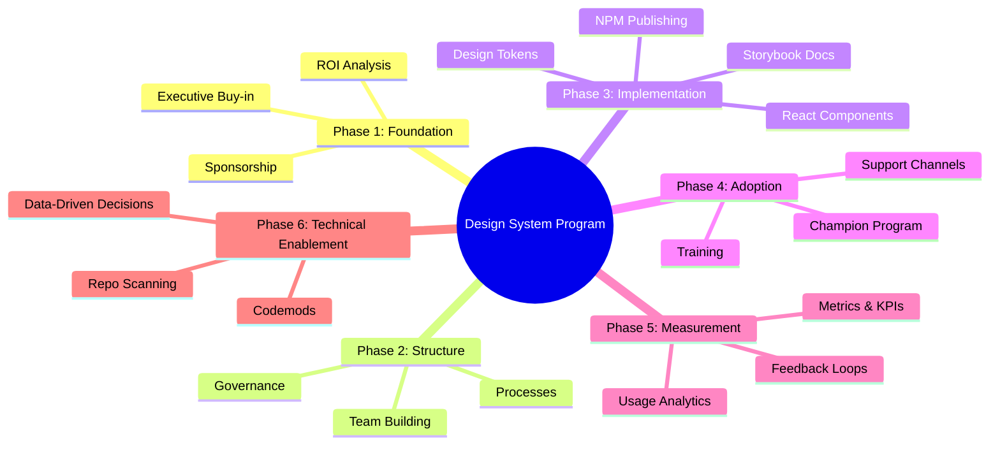
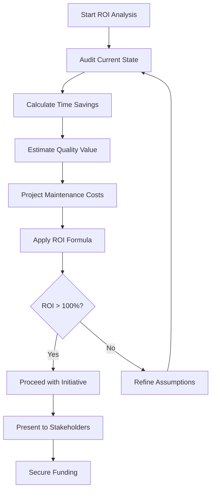
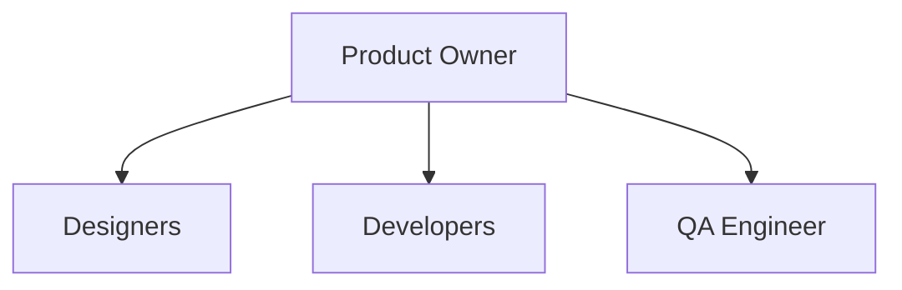
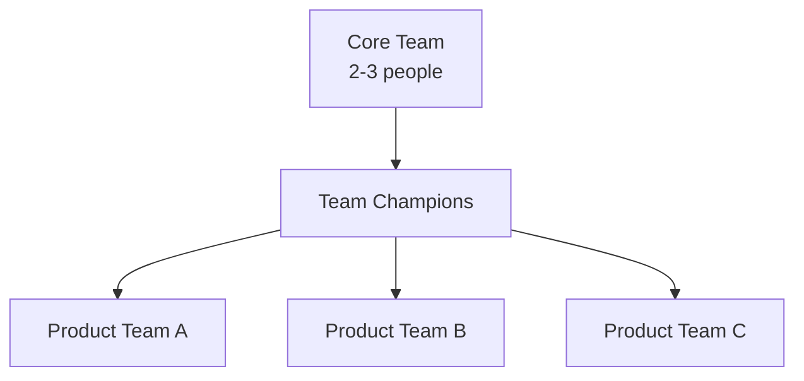
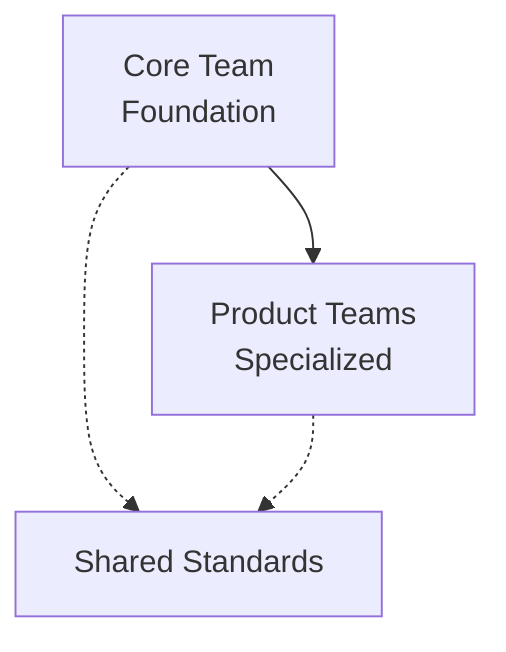

# Design System Adoption: Foundations and Governance

A comprehensive framework for building and scaling design systems from initial conception through enterprise-wide adoption—covering ROI analysis, executive buy-in, team structures, governance models, technical implementation, migration strategies, adoption tooling, and continuous improvement. This guide addresses the organizational, technical, and cultural challenges across the entire design system lifecycle, from proving the business case through measuring long-term impact.

<figure>

<figcaption>The six-phase framework for design system programs, from proving the business case through technical enablement and enterprise-wide scaling</figcaption>

</figure>

## TLDR

**A design system program** spans the entire lifecycle from building the business case through implementation, adoption, and long-term evolution. Success requires balancing technical excellence with cultural change, strategic vision with tactical execution, and centralized control with distributed autonomy.

### Foundation & Business Case

- **Start with pain points**: Audit UI inconsistencies, component duplication, and development velocity before proposing solutions
- **Calculate ROI systematically**: Use the formula `ROI = (Time Savings + Quality Value - Maintenance Cost) / Maintenance Cost × 100`
- **Expect negative first-year ROI**: Initial investment is front-loaded; benefits compound over 2-3 years
- **Secure executive sponsorship early**: Budget allocation and policy support require leadership engagement before technical work begins

### Team Structure & Governance

- **Three governance models exist**: Centralized (dedicated team owns everything), Federated (representatives from product teams), and Hybrid (core team + product contributions)
- **Centralized pitfall**: Can become a bottleneck or "dictatorship" where control is quickly lost
- **Federated prerequisite**: Requires strong governance processes and dedicated staff; not suitable for small teams
- **Start minimal**: Begin with 1 designer + 1 developer; expand based on adoption success

### Technical Architecture

- **Adopt DTCG token standard**: The W3C Design Tokens Community Group specification (v2025.10) is now the industry standard for interoperability
- **Use three-tier token architecture**: Primitives (raw values) → Semantics (intent-based) → Components (element-specific)
- **Choose framework strategy deliberately**: Framework-specific offers better DX; framework-agnostic (Web Components) offers future-proofing; hybrid is often optimal
- **Validate with pilots**: Prototype approaches with 2-3 pilot projects before committing

### Component Library Implementation

- **React with TypeScript**: The dominant choice for design systems in 2025-2026; export props interfaces for consuming teams to extend
- **Accessibility as architecture**: Build on headless libraries (Radix UI, React Aria) rather than implementing a11y from scratch
- **RSC compatibility**: Consider server/client boundaries; RSC-compatible systems can reduce bundle size 40-60%
- **Storybook for development**: Configure to mirror production build; use autodocs, visual regression testing (Chromatic/Percy)
- **Vite + Rollup bundling**: Vite for development, Rollup (via library mode) for production; publish ESM and CJS formats
- **Changesets for versioning**: Document changes at PR time, batch releases, generate changelogs automatically

### Migration & Adoption

- **Strangler Fig pattern**: Build new features with design system while incrementally migrating legacy—reduces risk but requires running two systems
- **Champion program**: Identify advocates in each team, provide training and early access, empower them to help their teams
- **Measure adoption weekly**: Track component coverage, team adoption rate, usage frequency, and detachment rate
- **Documentation before release**: Launch documentation portal and support channels before any team adoption

### Practical Challenges

- **Shared asset hosting**: Centralize fonts, icons, and base CSS on a common CDN path; enables cross-application browser caching
- **Version mismatch**: Establish compatibility windows (e.g., within 3 minor versions); maintain visual regression baselines per version
- **Microfrontend integration**: Shared dependencies create upgrade coupling; use SDK abstraction and provider-based injection for isolation
- **Checkout/webview complexity**: Native app release cycles lag web; consider parallel deployment paths or version negotiation

### Technical Enablement for Adoption

- **Codemods for automated migration**: Write jscodeshift transforms to automate API changes; distribute alongside major version releases
- **Repository scanning**: Scripts that traverse company repos checking `package.json` for design system usage; tracks adoption across the organization
- **Usage analytics pipeline**: Scrape production code to identify which components are used, which props are popular, which see overrides
- **Data-driven prioritization**: Use analytics to identify candidates for refactoring, deprecation, or codemod investment
- **Branch configuration**: Default to `main` branch scanning with per-repo overrides for teams using `master` or feature branches

### Continuous Improvement

- **Four metric categories**: Adoption (coverage, teams), Efficiency (velocity, bugs), Quality (accessibility, consistency), Business (ROI validation)
- **Feedback loops**: Collect continuously, review weekly, implement high-impact changes within 2 weeks
- **Plan for scaling**: Establish federated governance, regional champions, and clear contribution guidelines before capacity limits

## Phase 1: Foundation and Strategic Alignment

### 1.1 Defining the Problem Space

Before proposing a design system, you must understand the specific pain points your organization faces. This requires answering fundamental questions: What UI consistency challenges exist today? Which teams and products stand to benefit most? What is the current state of design and development workflows? How much technical debt has accumulated in your UI components?

**Metrics to Establish Baseline**

Quantifying the problem creates the foundation for your business case. The **UI Inconsistency Index** audits existing products to measure visual variations—this becomes your before-and-after benchmark. Track the **Component Duplication Count** to understand how many similar components have been built across teams, revealing redundant effort. Measure **Development Velocity** as the ratio of time spent on UI-related tasks versus feature development. Finally, catalog **Design Debt** by counting variations for common elements like buttons, forms, and navigation patterns.

**Timing the Audit**

Conduct this audit only after securing executive support for the initiative—without leadership buy-in, findings often stall in committee. Present results within 2-3 weeks to maintain organizational momentum; longer timelines allow priorities to shift and stakeholders to disengage. Use the data directly in your business case rather than treating the audit as a separate deliverable.

**What Typical Audit Findings Look Like**

A mid-sized organization might discover 15 different button styles across 8 products, 23 form implementations with varying validation patterns, over 40 hours per month spent on UI consistency fixes, and 3 different color palettes in active use. These numbers translate directly into development cost and brand inconsistency—both compelling arguments for executive stakeholders.

### 1.2 Building the Business Case

The business case must answer four essential questions: How does the design system align with business objectives? What is the expected ROI over a 3-5 year horizon? Which stakeholders require convincing? What resources will the initial implementation require?

**Quantifying the Value**

Your business case rests on four measurable outcomes. **Development Time Savings** projects the hours saved per team per month once components are reusable—this is typically the largest and most defensible number. **Quality Improvements** estimates the reduction in UI-related bugs, drawing from your current bug tracking data for credibility. **Onboarding Acceleration** measures time saved for new team members who no longer need to learn multiple component implementations. **Maintenance Cost Reduction** captures ongoing savings from centralized component management, including reduced coordination overhead across teams.

**ROI Calculation Framework:**

$$
\text{ROI} = \frac{\text{TS} + \text{QV} - \text{MC}}{\text{MC}} \times 100
$$

**Variable Definitions:**

- **TS** = Annual Time & Cost Savings
- **QV** = Quality Improvements Value
- **MC** = Design System Maintenance Cost

**Business Context:**

- **TS**: Total annual savings from reduced development time and costs
- **QV**: Value of improved quality, reduced bugs, and better user experience
- **MC**: Ongoing costs to maintain and evolve the design system

**Industry Benchmarks:**

Research indicates typical efficiency gains from design system adoption:

| Team Type         | Efficiency Gain Range | Average |
| ----------------- | --------------------- | ------- |
| Design Teams      | 31-50%                | ~38%    |
| Development Teams | 20-47%                | ~31%    |

**ROI Timeline Expectations:**

- **Year 1**: Often negative or low ROI (normal ramp-up period with front-loaded investment)
- **Year 2-3**: ROI compounds as adoption grows and maintenance costs stabilize
- **Year 3+**: Mature systems typically achieve 100-200%+ ROI

**ROI Calculation Process:**

<figure>

<figcaption>The iterative ROI calculation process, from audit through stakeholder presentation</figcaption>

</figure>

**Taking Action**

Present the ROI analysis to both finance and engineering leadership together when possible—this prevents misaligned expectations between technical and financial stakeholders. Secure an initial funding commitment before proceeding with any technical work. Establish a quarterly review cadence for ROI validation from day one; this creates accountability and demonstrates the initiative's ongoing value.

### 1.3 Securing Executive Sponsorship

Executive sponsorship determines whether a design system becomes a strategic asset or an abandoned initiative. You must identify the key decision-makers in your organization and understand what motivates each stakeholder—the CTO typically cares about technical excellence and developer productivity, the CFO about cost reduction and ROI, and the Head of Product about speed to market and brand consistency. Determine the level of sponsorship required: some initiatives need active championship, while others require only policy support and budget allocation.

**Measuring Sponsorship Effectiveness**

Track four indicators to assess sponsorship health. **Sponsorship Level** measures executive time allocated to design system initiatives—a sponsor who never attends reviews provides weak support. **Budget Allocation** as a percentage of engineering budget dedicated to the design system signals organizational commitment. **Leadership Participation** through attendance at design system review meetings indicates ongoing engagement. **Policy Support** counts the number of design system requirements embedded in team processes and guidelines.

**Timing Executive Engagement**

Secure sponsorship before any technical work begins—building without executive backing leads to abandoned initiatives when priorities shift. Maintain monthly executive updates during implementation to sustain engagement and surface blockers early. Escalate issues that require leadership intervention within 24 hours; delays erode sponsor confidence and allow problems to compound.

## Phase 2: Team Structure and Governance

### 2.1 Building the Core Team

The team structure decision shapes how your design system will evolve and who controls its direction. You must determine which roles are essential, how to balance centralized control with distributed contribution, which governance model fits your organization's culture, and how to handle the inevitable conflicts between consistency and flexibility.

**Team Composition by Model**

The **Centralized Model** establishes a dedicated team that owns all design system decisions. This typically includes 1 Product Owner (full-time), 1-2 Designers (full-time), 1-2 Developers (full-time), and 1 QA Engineer (part-time). This model works well when you need strong consistency and have the budget for dedicated headcount.

The **Federated Model** distributes ownership across product teams while maintaining coordination. A small Core Team of 2-3 people provides guidance and standards, while Design System Champions embedded in each product team drive local adoption. Success requires well-documented contribution guidelines and robust review processes.

The **Hybrid Model** splits responsibilities between a core team that owns foundational elements (tokens, primitives, base components) and product teams that contribute specialized components for their domains. Clear boundaries between core and product-specific components prevent ownership conflicts.

> **Real-World Example: Vista's SWAN Design System**
>
> [SWAN](https://vista.design/swan/), Vista's enterprise design system, employs a hybrid model with a dedicated core team (developers, team lead, designers) that owns the design system itself, combined with a champion model for frontend-heavy teams such as upper-funnel discovery pages and platform teams. Champions receive early access to new features and training, enabling them to drive adoption within their domains while contributing feedback that shapes the system's evolution.

**Team Structure Visualization:**

<figure>

<figcaption>Centralized Model: A dedicated team with clear hierarchy owns all design system decisions and components</figcaption>

</figure>

<figure>

<figcaption>Federated Model: A small core team coordinates champions embedded in each product team</figcaption>

</figure>

<figure>

<figcaption>Hybrid Model: Core team owns foundations while product teams contribute specialized components, both adhering to shared standards</figcaption>

</figure>

**Model Trade-offs:**

| Model           | Best For                                                    | Pitfalls                                                                                                                       |
| --------------- | ----------------------------------------------------------- | ------------------------------------------------------------------------------------------------------------------------------ |
| **Centralized** | Consistency, quality control, clear ownership               | Can become a bottleneck; "dictatorship" dynamic where control is quickly lost; slow response to team needs                     |
| **Federated**   | Realistic component usage, team investment, scalability     | Requires strong governance processes; needs dedicated coordinating staff; not suitable for small teams or early-stage startups |
| **Hybrid**      | Balance of consistency and flexibility; large organizations | Requires clear boundaries; can create confusion about ownership; needs explicit contribution guidelines                        |

**Tracking Team Effectiveness**

Measure **Team Velocity** through components delivered per sprint, but balance this against quality—shipping fast but buggy components destroys trust. **Response Time** to address team requests indicates whether the design system team is enabling or blocking product teams. Track **Quality Metrics** through the bug rate in design system components; this number should trend down over time as the team matures. **Team Satisfaction** measured via Net Promoter Score from internal users reveals whether the design system is perceived as helpful or burdensome.

**Scaling the Team**

Start with a minimal viable team of 1 designer plus 1 developer. This constraint forces focus on the highest-value components and prevents over-engineering. Expand the team based on adoption success and workload—let demand pull resources rather than pushing capacity ahead of need. Reassess the team structure every 6 months; what works for 3 consuming teams may fail at 15.

### 2.2 Establishing Governance

Governance determines how decisions get made at scale. Without clear governance, design systems either become bottlenecks (when everything requires central approval) or fragment (when teams diverge without coordination). You must define how design decisions will be made, establish the contribution process for new components, determine how breaking changes are handled, and specify what quality standards components must meet.

**Governance Framework**

Different decision types require different governance approaches:

| Decision Type        | Governance Approach                                     |
| -------------------- | ------------------------------------------------------- |
| **Core Components**  | Central team approval required                          |
| **Product-Specific** | Team autonomy with design review                        |
| **Breaking Changes** | RFC process with stakeholder input                      |
| **Quality Gates**    | Automated testing + design review + accessibility audit |

Core components that affect the entire organization warrant central team approval because changes ripple across all products. Product-specific components can follow a lighter-weight process with team autonomy balanced by design review. Breaking changes require an RFC (Request for Comments) process with stakeholder input and adequate migration timelines. Quality gates should be automated wherever possible—automated testing, design review checklists, and accessibility audits prevent regression without creating bottlenecks.

**Measuring Governance Health**

Track **Decision Velocity** as the time from request to decision; slow governance frustrates teams and encourages workarounds. **Contribution Rate** measures the number of contributions from product teams; low rates may indicate the process is too burdensome or the system lacks features teams need. **Quality Compliance** tracks the percentage of components meeting standards—this should trend toward 100% as the team matures. **Breaking Change Frequency** counts breaking changes per quarter; too many indicates poor initial design, while zero may indicate the system isn't evolving with user needs.

**Governance Timing**

Establish the governance framework before component development begins—retrofitting governance onto an existing system creates friction. Review and adjust governance every quarter based on friction points and team feedback. Escalate governance conflicts within 48 hours; unresolved conflicts breed resentment and encourage teams to bypass the system entirely.

## Conclusion

Foundations and governance set the pace for design system success. Align on goals, sponsorship, and operating model early so implementation can scale without friction.
