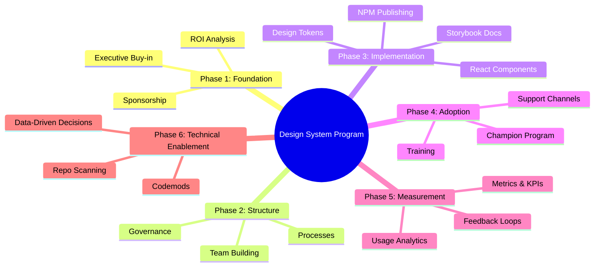
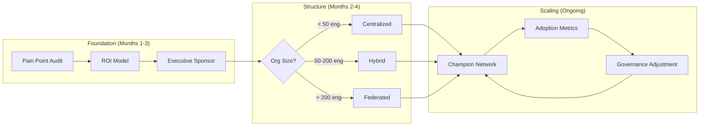
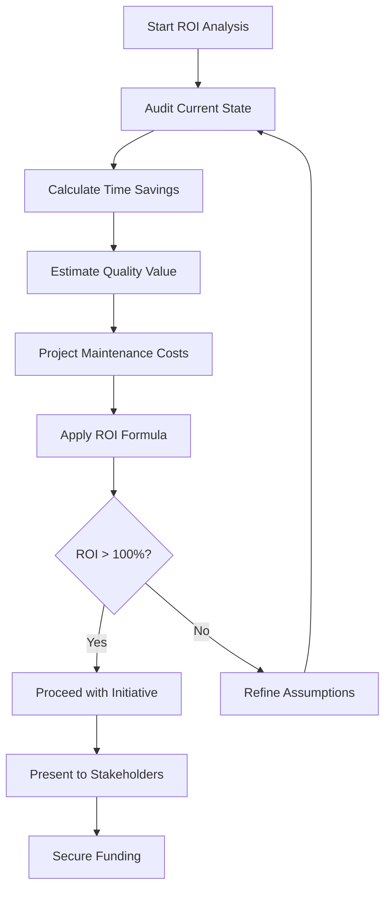
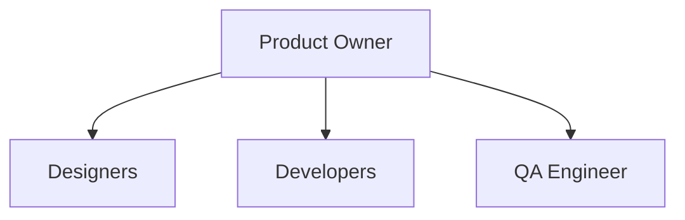
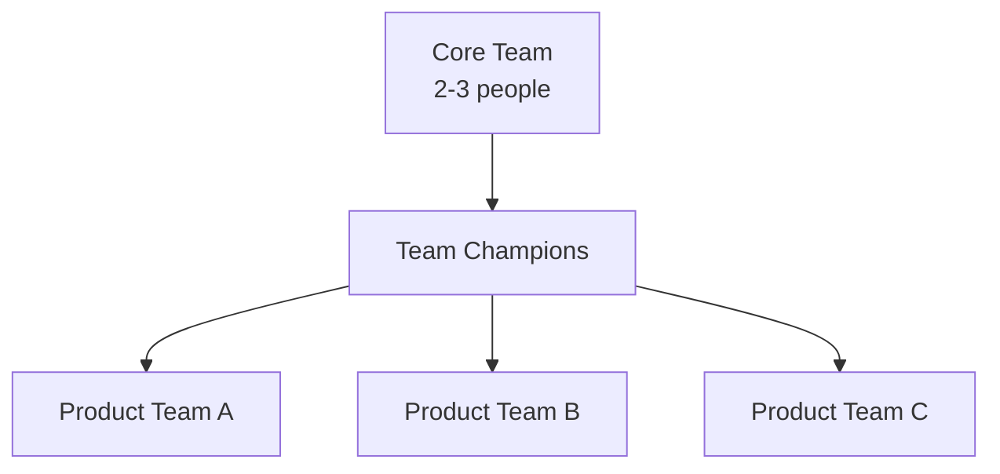
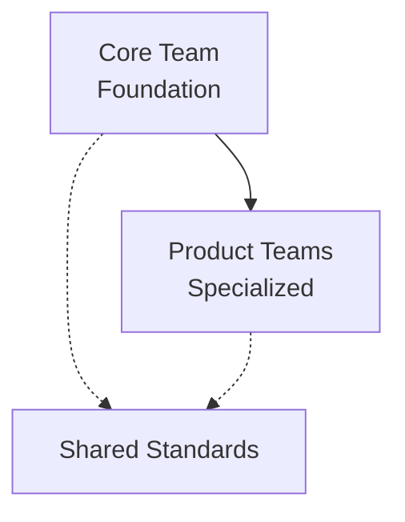

# Design System Adoption: Foundations and Governance

A comprehensive framework for building and scaling design systems from initial conception through enterprise-wide adoption—covering ROI analysis, executive buy-in, team structures, governance models, technical implementation, migration strategies, adoption tooling, and continuous improvement. This guide addresses the organizational, technical, and cultural challenges across the entire design system lifecycle, from proving the business case through measuring long-term impact.

<figure>

<figcaption>The six-phase framework for design system programs, from proving the business case through technical enablement and enterprise-wide scaling</figcaption>

</figure>

## Abstract

Design system success is fundamentally a governance problem, not a technical one. The technical implementation—tokens, components, tooling—is well understood. The challenge is organizational: securing sustained investment, choosing governance that scales with your organization's culture, and creating adoption incentives that outweigh migration friction.

<figure>

<figcaption>The governance model must match organizational scale—start centralized, evolve toward federated as adoption grows</figcaption>

</figure>

**The mental model**: A design system is a product serving internal customers. Like any product, it requires a business case, a team, a roadmap, and continuous feedback. The difference: your customers are colleagues who can bypass your product if it creates more friction than it removes. Success means making the design system the path of least resistance for building UI.

## Phase 1: Foundation and Strategic Alignment

### 1.1 Defining the Problem Space

Before proposing a design system, you must understand the specific pain points your organization faces. This requires answering fundamental questions: What UI consistency challenges exist today? Which teams and products stand to benefit most? What is the current state of design and development workflows? How much technical debt has accumulated in your UI components?

**Metrics to Establish Baseline**

Quantifying the problem creates the foundation for your business case. The **UI Inconsistency Index** audits existing products to measure visual variations—this becomes your before-and-after benchmark. Track the **Component Duplication Count** to understand how many similar components have been built across teams, revealing redundant effort. Measure **Development Velocity** as the ratio of time spent on UI-related tasks versus feature development. Finally, catalog **Design Debt** by counting variations for common elements like buttons, forms, and navigation patterns.

**Timing the Audit**

Conduct this audit only after securing executive support for the initiative—without leadership buy-in, findings often stall in committee. Present results within 2-3 weeks to maintain organizational momentum; longer timelines allow priorities to shift and stakeholders to disengage. Use the data directly in your business case rather than treating the audit as a separate deliverable.

**What Typical Audit Findings Look Like**

A mid-sized organization might discover 15 different button styles across 8 products, 23 form implementations with varying validation patterns, over 40 hours per month spent on UI consistency fixes, and 3 different color palettes in active use. These numbers translate directly into development cost and brand inconsistency—both compelling arguments for executive stakeholders.

### 1.2 Building the Business Case

The business case must answer four essential questions: How does the design system align with business objectives? What is the expected ROI over a 3-5 year horizon? Which stakeholders require convincing? What resources will the initial implementation require?

**Quantifying the Value**

Your business case rests on four measurable outcomes. **Development Time Savings** projects the hours saved per team per month once components are reusable—this is typically the largest and most defensible number. **Quality Improvements** estimates the reduction in UI-related bugs, drawing from your current bug tracking data for credibility. **Onboarding Acceleration** measures time saved for new team members who no longer need to learn multiple component implementations. **Maintenance Cost Reduction** captures ongoing savings from centralized component management, including reduced coordination overhead across teams.

**ROI Calculation Framework:**

$$
\text{ROI} = \frac{\text{TS} + \text{QV} - \text{MC}}{\text{MC}} \times 100
$$

**Variable Definitions:**

- **TS** = Annual Time & Cost Savings
- **QV** = Quality Improvements Value
- **MC** = Design System Maintenance Cost

**Business Context:**

- **TS**: Total annual savings from reduced development time and costs
- **QV**: Value of improved quality, reduced bugs, and better user experience
- **MC**: Ongoing costs to maintain and evolve the design system

**Industry Benchmarks (2024-2025 Data):**

Research from the Knapsack ROI Report (2025) and Zeroheight Design Systems Report indicates typical efficiency gains:

| Team Type         | Efficiency Gain Range | Average | Source                 |
| ----------------- | --------------------- | ------- | ---------------------- |
| Design Teams      | 31-50%                | ~38%    | Knapsack ROI Report    |
| Development Teams | 20-47%                | ~31%    | Knapsack ROI Report    |
| Combined (Mature) | 50-75%                | ~60%    | Zeroheight 2025 Survey |

Notable case studies: Salesforce Lightning achieved 60% productivity increase with 70% CSS reduction; IBM Carbon reported 75% design cost reduction and 66% development cost reduction. These represent mature systems with 3+ years of investment.

**ROI Timeline Expectations:**

- **Year 1**: Often negative or low ROI (normal ramp-up period with front-loaded investment)
- **Year 2-3**: ROI compounds as adoption grows and maintenance costs stabilize
- **Year 3+**: Mature systems typically achieve 100-200%+ ROI

**ROI Calculation Process:**

<figure>

<figcaption>The iterative ROI calculation process, from audit through stakeholder presentation</figcaption>

</figure>

**Taking Action**

Present the ROI analysis to both finance and engineering leadership together when possible—this prevents misaligned expectations between technical and financial stakeholders. Secure an initial funding commitment before proceeding with any technical work. Establish a quarterly review cadence for ROI validation from day one; this creates accountability and demonstrates the initiative's ongoing value.

### 1.3 Securing Executive Sponsorship

Executive sponsorship determines whether a design system becomes a strategic asset or an abandoned initiative. You must identify the key decision-makers in your organization and understand what motivates each stakeholder—the CTO typically cares about technical excellence and developer productivity, the CFO about cost reduction and ROI, and the Head of Product about speed to market and brand consistency. Determine the level of sponsorship required: some initiatives need active championship, while others require only policy support and budget allocation.

**Measuring Sponsorship Effectiveness**

Track four indicators to assess sponsorship health. **Sponsorship Level** measures executive time allocated to design system initiatives—a sponsor who never attends reviews provides weak support. **Budget Allocation** as a percentage of engineering budget dedicated to the design system signals organizational commitment. **Leadership Participation** through attendance at design system review meetings indicates ongoing engagement. **Policy Support** counts the number of design system requirements embedded in team processes and guidelines.

**Timing Executive Engagement**

Secure sponsorship before any technical work begins—building without executive backing leads to abandoned initiatives when priorities shift. Maintain monthly executive updates during implementation to sustain engagement and surface blockers early. Escalate issues that require leadership intervention within 24 hours; delays erode sponsor confidence and allow problems to compound.

## Phase 2: Team Structure and Governance

### 2.1 Building the Core Team

The team structure decision shapes how your design system will evolve and who controls its direction. You must determine which roles are essential, how to balance centralized control with distributed contribution, which governance model fits your organization's culture, and how to handle the inevitable conflicts between consistency and flexibility.

**Team Composition by Model**

The **Centralized Model** establishes a dedicated team that owns all design system decisions. This typically includes 1 Product Owner (full-time), 1-2 Designers (full-time), 1-2 Developers (full-time), and 1 QA Engineer (part-time). This model works well when you need strong consistency and have the budget for dedicated headcount.

The **Federated Model** distributes ownership across product teams while maintaining coordination. A small Core Team of 2-3 people provides guidance and standards, while Design System Champions embedded in each product team drive local adoption. Success requires well-documented contribution guidelines and robust review processes.

The **Hybrid Model** splits responsibilities between a core team that owns foundational elements (tokens, primitives, base components) and product teams that contribute specialized components for their domains. Clear boundaries between core and product-specific components prevent ownership conflicts.

> **Real-World Example: Vista's SWAN Design System**
>
> [SWAN](https://vista.design/swan/), Vista's enterprise design system, employs a hybrid model with a dedicated core team (developers, team lead, designers) that owns the design system itself, combined with a champion model for frontend-heavy teams such as upper-funnel discovery pages and platform teams. Champions receive early access to new features and training, enabling them to drive adoption within their domains while contributing feedback that shapes the system's evolution.

**Team Structure Visualization:**

<figure>

<figcaption>Centralized Model: A dedicated team with clear hierarchy owns all design system decisions and components</figcaption>

</figure>

<figure>

<figcaption>Federated Model: A small core team coordinates champions embedded in each product team</figcaption>

</figure>

<figure>

<figcaption>Hybrid Model: Core team owns foundations while product teams contribute specialized components, both adhering to shared standards</figcaption>

</figure>

**Model Trade-offs:**

| Model           | Best For                                                    | Pitfalls                                                                                                                       |
| --------------- | ----------------------------------------------------------- | ------------------------------------------------------------------------------------------------------------------------------ |
| **Centralized** | Consistency, quality control, clear ownership               | Can become a bottleneck; "dictatorship" dynamic where control is quickly lost; slow response to team needs                     |
| **Federated**   | Realistic component usage, team investment, scalability     | Requires strong governance processes; needs dedicated coordinating staff; not suitable for small teams or early-stage startups |
| **Hybrid**      | Balance of consistency and flexibility; large organizations | Requires clear boundaries; can create confusion about ownership; needs explicit contribution guidelines                        |

**Tracking Team Effectiveness**

Measure **Team Velocity** through components delivered per sprint, but balance this against quality—shipping fast but buggy components destroys trust. **Response Time** to address team requests indicates whether the design system team is enabling or blocking product teams. Track **Quality Metrics** through the bug rate in design system components; this number should trend down over time as the team matures. **Team Satisfaction** measured via Net Promoter Score from internal users reveals whether the design system is perceived as helpful or burdensome.

**Scaling the Team**

Start with a minimal viable team of 1 designer plus 1 developer. This constraint forces focus on the highest-value components and prevents over-engineering. Expand the team based on adoption success and workload—let demand pull resources rather than pushing capacity ahead of need. Reassess the team structure every 6 months; what works for 3 consuming teams may fail at 15.

### 2.2 Establishing Governance

Governance determines how decisions get made at scale. Without clear governance, design systems either become bottlenecks (when everything requires central approval) or fragment (when teams diverge without coordination). You must define how design decisions will be made, establish the contribution process for new components, determine how breaking changes are handled, and specify what quality standards components must meet.

**Governance Framework**

Different decision types require different governance approaches:

| Decision Type        | Governance Approach                                     |
| -------------------- | ------------------------------------------------------- |
| **Core Components**  | Central team approval required                          |
| **Product-Specific** | Team autonomy with design review                        |
| **Breaking Changes** | RFC process with stakeholder input                      |
| **Quality Gates**    | Automated testing + design review + accessibility audit |

Core components that affect the entire organization warrant central team approval because changes ripple across all products. Product-specific components can follow a lighter-weight process with team autonomy balanced by design review. Breaking changes require an RFC (Request for Comments) process with stakeholder input and adequate migration timelines. Quality gates should be automated wherever possible—automated testing, design review checklists, and accessibility audits prevent regression without creating bottlenecks.

**Measuring Governance Health**

Track **Decision Velocity** as the time from request to decision; slow governance frustrates teams and encourages workarounds. **Contribution Rate** measures the number of contributions from product teams; low rates may indicate the process is too burdensome or the system lacks features teams need. **Quality Compliance** tracks the percentage of components meeting standards—this should trend toward 100% as the team matures. **Breaking Change Frequency** counts breaking changes per quarter; too many indicates poor initial design, while zero may indicate the system isn't evolving with user needs.

**Governance Timing**

Establish the governance framework before component development begins—retrofitting governance onto an existing system creates friction. Review and adjust governance every quarter based on friction points and team feedback. Escalate governance conflicts within 48 hours; unresolved conflicts breed resentment and encourage teams to bypass the system entirely.

**Governance Failure Modes**

| Failure Mode              | Symptoms                                                        | Recovery                                                      |
| ------------------------- | --------------------------------------------------------------- | ------------------------------------------------------------- |
| **Bottleneck governance** | Decision queue grows; teams build workarounds; adoption stalls  | Delegate categories; add async approval paths; SLA guarantees |
| **Absent governance**     | Component drift; inconsistent patterns; "design system" in name | Introduce lightweight review; define canonical patterns       |
| **Hostile governance**    | Teams perceive system as obstacle; detachment rate climbs       | Survey friction points; simplify contribution; quick wins     |
| **Scope creep**           | System tries to solve every problem; quality degrades           | Define explicit boundaries; say no to edge cases              |
| **Zombie governance**     | Documented processes exist but aren't followed; reviews are     | Enforce or remove; dead rules erode trust                     |

The most common failure is bottleneck governance—centralized teams that can't keep pace with demand. The solution isn't removing governance but creating tiered approval: trivial changes self-serve, significant changes need review, breaking changes need RFC. Brad Frost describes this as treating the design system as a product with different support tiers.

## Conclusion

Design system adoption succeeds or fails at the organizational layer, not the technical one. The patterns here—pain-point-driven business cases, governance models matched to organizational scale, and feedback loops that drive continuous improvement—apply regardless of whether you're using React, Vue, or Web Components.

**Key decisions that compound**: The governance model you choose in month two constrains how you can scale in year three. Starting centralized with a small team is almost always correct—it establishes quality standards and builds trust. The transition to federated contribution is the hard part: it requires explicit contribution guidelines, quality gates, and a champion network before product teams will invest in contributing.

**The ROI trap**: First-year ROI is typically negative or marginal. Executive sponsors who expect quick wins will lose patience. Frame the investment honestly: Year 1 builds infrastructure, Year 2 sees adoption compound, Year 3+ delivers the efficiency gains. Organizations that abandon design systems mid-journey have sunk costs with no returns—commitment through the J-curve is essential.

**What distinguishes successful programs**: They treat the design system as a product with customers, not a technical artifact to be maintained. They measure adoption and act on the data. They create contribution paths that reduce friction rather than adding process. And they evolve governance as the organization grows, resisting both the bottleneck of over-centralization and the fragmentation of ungoverned federation.

## Appendix

### Prerequisites

- Familiarity with component-based UI frameworks (React, Vue, or similar)
- Understanding of semantic versioning and package management
- Experience with cross-functional collaboration (design and engineering)
- Basic knowledge of accessibility standards (WCAG 2.1+)

### Terminology

| Term                              | Definition                                                                                                                          |
| --------------------------------- | ----------------------------------------------------------------------------------------------------------------------------------- |
| **Design Token**                  | A named value representing a design decision (color, spacing, typography) in a platform-agnostic format                             |
| **DTCG**                          | Design Tokens Community Group—W3C community group defining the interoperable token specification                                    |
| **Federated Governance**          | A model where design system decisions are distributed across product teams with coordination from a small core team                 |
| **Strangler Fig Pattern**         | A migration strategy where new functionality is built with the new system while legacy is incrementally replaced                    |
| **Champion Program**              | A network of advocates embedded in product teams who drive adoption and provide feedback                                            |
| **Headless Component Library**    | UI components providing behavior and accessibility without styling, allowing consuming teams to apply their own visual design       |
| **RSC (React Server Components)** | A React architecture where components can render on the server, reducing client bundle size                                         |
| **Changesets**                    | A versioning tool for monorepos that tracks changes at PR time and automates version bumps and changelog generation                 |
| **Codemod**                       | An automated code transformation script (typically using jscodeshift) that migrates code between API versions                       |
| **Detachment Rate**               | The percentage of component instances where teams have overridden or disconnected from the design system version                    |
| **ROI (Return on Investment)**    | The ratio of net benefits (time savings + quality improvements - maintenance costs) to maintenance costs, expressed as a percentage |

### Summary

- **Governance model selection**: Match to organizational scale—centralized for <50 engineers, hybrid for 50-200, federated for 200+. All models require evolution as adoption grows.
- **Business case essentials**: Audit pain points before proposing solutions; calculate ROI using Time Savings + Quality Value - Maintenance Cost; expect Year 1 to be investment-heavy with compounding returns in Years 2-3.
- **Executive sponsorship**: Secure before technical work; maintain through monthly updates; measure via budget allocation, policy support, and leadership participation.
- **Team scaling**: Start with 1 designer + 1 developer; expand based on adoption demand rather than anticipated need; reassess structure every 6 months.
- **Governance health metrics**: Decision velocity, contribution rate, quality compliance, and breaking change frequency reveal whether governance enables or blocks adoption.
- **Adoption success factors**: Champion programs, documentation before release, weekly adoption measurement, and feedback loops that implement high-impact changes within 2 weeks.

### References

**Specifications and Standards**

- [W3C Design Tokens Community Group Specification](https://www.designtokens.org/) - DTCG stable version 2025.10, the industry standard for token interoperability
- [DTCG First Stable Version Announcement](https://www.w3.org/community/design-tokens/2025/10/28/design-tokens-specification-reaches-first-stable-version/) - October 2025 release notes and tool support

**Core Maintainer and Industry Expert Content**

- [Nathan Curtis - Team Models for Scaling a Design System](https://medium.com/eightshapes-llc/team-models-for-scaling-a-design-system-2cf9d03be6a0) - EightShapes; defines Solitary, Centralized, and Federated models
- [Nathan Curtis - Designing a Systems Team](https://medium.com/eightshapes-llc/designing-a-systems-team-d22f27a2d81d) - Team composition patterns and lessons learned
- [Brad Frost - A Design System Governance Process](https://bradfrost.com/blog/post/a-design-system-governance-process/) - Governance framework for design systems as products
- [Brad Frost - Maintaining Design Systems (Atomic Design)](https://atomicdesign.bradfrost.com/chapter-5/) - Long-term maintenance best practices
- [Martin Fowler - Strangler Fig Application](https://martinfowler.com/bliki/StranglerFigApplication.html) - Original pattern description (2004, updated)

**ROI Research and Industry Reports**

- [Knapsack Design Systems ROI Report 2025](https://www.knapsack.cloud/reports/roi-report) - ROI calculation methodology and benchmarks
- [Zeroheight Design Systems Report 2025](https://zeroheight.com/blog/design-systems-report-2025-an-overview/) - Industry adoption trends

**Tools and Libraries**

- [Radix Primitives](https://www.radix-ui.com/) - Headless component library with 32+ primitives
- [Changesets Documentation](https://github.com/changesets/changesets) - Monorepo versioning and changelog automation
- [Vista SWAN Design System](https://vista.design/swan/) - Enterprise design system case study referenced in governance models
