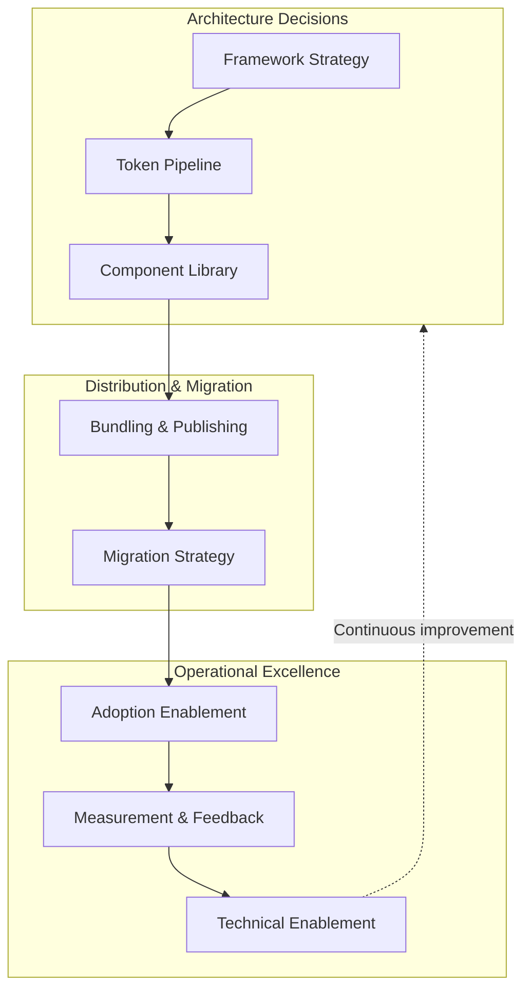
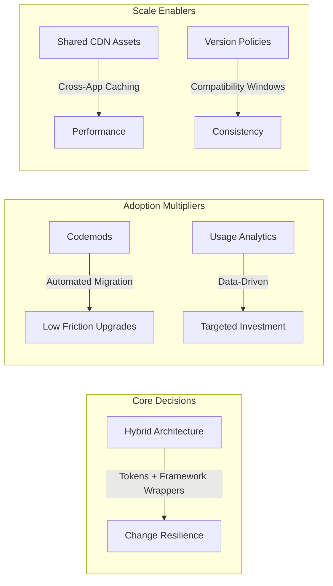
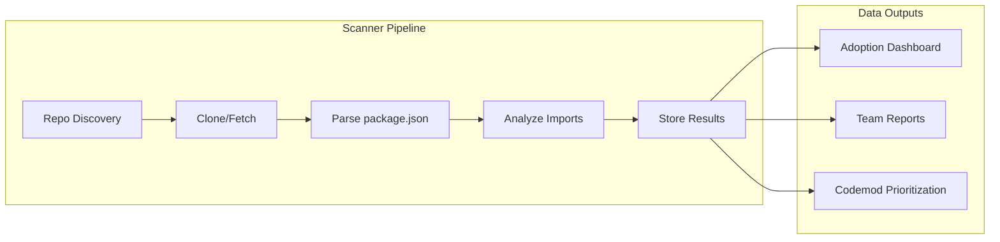

# Design System Implementation and Scaling

Technical implementation patterns for building, migrating, and operating design systems at enterprise scale. This article assumes governance and strategic alignment are in place (see [Design System Adoption: Foundations and Governance](../design-system-adoption-foundations/README.md)) and focuses on the engineering decisions that determine whether a design system thrives or becomes technical debt.

<figure>



<figcaption>Design system implementation lifecycle: architecture decisions flow into distribution, which feeds operational practices that inform architectural evolution.</figcaption>

</figure>

## Abstract

Design system implementation succeeds when three forces align: **architecture that anticipates change**, **distribution that minimizes friction**, and **operations that treat the system as a product**.

<figure>



<figcaption>The mental model: architecture enables change, automation reduces friction, data drives decisions.</figcaption>

</figure>

**Architecture**: The hybrid approach—platform-agnostic tokens with framework-specific component wrappers—survives technology shifts. React Server Components (RSC) compatibility, headless accessibility primitives (Radix, React Aria), and tree-shakeable bundles are table stakes for 2025+.

**Distribution**: Codemods transform major version upgrades from multi-sprint projects to single-command operations. Repository scanning reveals adoption patterns that documentation alone cannot surface. Shared CDN hosting eliminates duplicate asset downloads across applications.

**Operations**: Version compatibility windows (all apps within N minor versions) create upgrade pressure without breaking stability. Usage analytics—which components, which props, which overrides—drive prioritization better than feature requests.

## Technical Architecture and Implementation

### Making Architectural Decisions

The architectural foundation determines the long-term viability of your design system. You must decide whether to build framework-specific or framework-agnostic components, how to handle multiple frontend technologies across the organization, what migration strategy applies to existing applications, and how to ensure backward compatibility as the system evolves.

**Architecture Strategy Comparison**

| Approach                                     | Pros                                               | Cons                                                       |
| -------------------------------------------- | -------------------------------------------------- | ---------------------------------------------------------- |
| **Framework-Specific** (React, Angular, Vue) | Better developer experience, seamless integration  | Vendor lock-in, maintenance overhead, framework dependency |
| **Framework-Agnostic** (Web Components)      | Future-proof, technology-agnostic, single codebase | Steeper learning curve, limited ecosystem integration      |
| **Hybrid**                                   | Best of both worlds, flexibility                   | More complexity to manage                                  |

The **Hybrid Approach** often provides the best balance for organizations with diverse technology stacks. Design tokens and principles remain platform-agnostic, serving as the single source of truth. Framework-specific component wrappers consume these tokens and implement interaction patterns optimized for each framework. This approach maintains a shared design language across platforms while delivering the developer experience teams expect.

**Measuring Architecture Success**

**Integration Complexity** measures the time required to integrate components into existing projects—high complexity indicates the architecture doesn't match how teams actually work. **Performance Impact** tracks bundle size and runtime performance; a design system that bloats bundles or slows rendering will face adoption resistance. **Browser Compatibility** through cross-browser testing results ensures the system works across your supported browser matrix. **Developer Experience** measured as time to implement common patterns reveals whether the architecture accelerates or impedes development.

**Architecture Decision Timeline**

Make architectural decisions before any component development begins—changing architecture later requires extensive rework. Prototype both framework-specific and framework-agnostic approaches with a small team to understand the real trade-offs in your context. Validate decisions with 2-3 pilot projects before committing; theoretical advantages often don't survive contact with production requirements.

### Design Token Strategy

Design tokens encode design decisions as platform-agnostic data. For comprehensive coverage of token taxonomy, naming conventions, theming architecture, and governance, see [Design Tokens and Theming Architecture](../design-tokens-and-theming/README.md). This section focuses on implementation decisions specific to scaling.

**Industry Standard: DTCG Specification (v2025.10)**

The W3C Design Tokens Community Group (DTCG) specification reached its first stable version in October 2025. Over 20 organizations—including Adobe, Amazon, Google, Microsoft, Meta, Figma, Salesforce, and Shopify—contributed to this standardization effort.

**Why DTCG matters for implementation**: The specification standardizes the JSON format with `$value`, `$type`, and `$description` properties. Tools like Style Dictionary v4, Tokens Studio, and Terrazzo all support DTCG natively, enabling interoperability between design tools and development pipelines without custom transformation logic.

**Token Transformation with Style Dictionary v4**

[Style Dictionary v4](https://styledictionary.com/) is the industry-standard build system for design tokens. Key changes from v3:

| Change           | v3 Behavior                             | v4 Behavior                                    | Why It Matters        |
| ---------------- | --------------------------------------- | ---------------------------------------------- | --------------------- |
| **Format**       | Custom `value`/`type` properties        | DTCG `$value`/`$type` support                  | Tool interoperability |
| **CTI Coupling** | Hard-coded Category-Type-Item structure | Uses `token.type` property                     | Flexible naming       |
| **Transforms**   | Limited chaining                        | Transitive transforms resolve reference chains | Complex aliases work  |

```javascript title="style-dictionary.config.mjs" collapse={1-2, 22-35}
// Style Dictionary v4 configuration with DTCG support
import StyleDictionary from "style-dictionary"

export default {
  source: ["tokens/**/*.json"],
  platforms: {
    css: {
      transformGroup: "css",
      buildPath: "dist/css/",
      files: [
        {
          destination: "variables.css",
          format: "css/variables",
          options: { outputReferences: true }, // Preserve aliases: --color-action: var(--color-blue-500)
        },
      ],
    },
    js: {
      transformGroup: "js",
      buildPath: "dist/js/",
      files: [{ destination: "tokens.mjs", format: "javascript/esm" }],
    },
    // iOS and Android configurations
    ios: {
      transformGroup: "ios-swift",
      buildPath: "dist/ios/",
      files: [{ destination: "Tokens.swift", format: "ios-swift/class.swift" }],
    },
    android: {
      transformGroup: "android",
      buildPath: "dist/android/",
      files: [{ destination: "tokens.xml", format: "android/resources" }],
    },
  },
}
```

**Three-Tier Token Architecture:**

| Tier           | Purpose                               | Example                                     | When to Add                      |
| -------------- | ------------------------------------- | ------------------------------------------- | -------------------------------- |
| **Primitives** | Raw values defining what styles exist | `color-blue-500: #0070f3`                   | Always (foundation)              |
| **Semantics**  | Intent-based mappings                 | `color-action-primary: {color.blue.500}`    | Always (enables theming)         |
| **Components** | Element-specific bindings             | `button-background: {color.action.primary}` | Only for multi-brand/white-label |

**Design reasoning**: Most systems operate well with primitives and semantic tokens alone. Component tokens multiply maintenance overhead—a 200-token semantic layer can balloon to 2000+ with component tokens. Only introduce the third tier when multi-brand theming or white-labeling requires granular per-component customization.

**Measuring Token Effectiveness**

| Metric         | Target                | Why It Matters                                            |
| -------------- | --------------------- | --------------------------------------------------------- |
| Token Coverage | >90% of UI            | Below 90% indicates adoption gaps or missing tokens       |
| Theme Count    | ≥2 functional themes  | Validates the token architecture actually enables theming |
| Build Time     | <10s for full rebuild | Slow builds discourage iteration and CI feedback          |

### Component Library Implementation

Building the component library is where architectural decisions meet production reality. For comprehensive coverage of API design patterns, versioning, and governance workflows, see [Component Library Architecture and Governance](../component-library-architecture-and-governance/README.md). This section focuses on implementation decisions specific to scaling.

#### React-Based Component Architecture (2025+)

React remains the dominant choice for design system component libraries, with TypeScript as the expected baseline. Three architectural decisions dominate the 2025+ landscape:

**1. Headless Accessibility Primitives**

Building accessible components from scratch is expensive and error-prone. The pragmatic choice is standing on the shoulders of accessibility experts:

| Library         | Approach                                    | Weekly Downloads | Best For                              |
| --------------- | ------------------------------------------- | ---------------- | ------------------------------------- |
| **Radix UI**    | Unstyled primitives + optional Radix Themes | 2M+              | Teams wanting maximum styling control |
| **React Aria**  | Hooks + optional components                 | 260K+            | Complex ARIA patterns, i18n           |
| **Headless UI** | Tailwind-focused components                 | 500K+            | Tailwind-native teams                 |

**Design reasoning**: These libraries handle focus management, keyboard navigation, and ARIA attributes correctly. Radix now offers a unified `radix-ui` package with tree-shakeable exports. React Aria's `react-aria-components` layer provides simpler consumption than raw hooks.

**2. React Server Components Compatibility**

RSC is production-ready in Next.js 15+. Design systems must consider the server/client boundary:

```tsx title="RSC-compatible component pattern" collapse={1-4}
// Server-safe: no useState, useEffect, event handlers
// Client components need 'use client' directive
"use client"

import { useState } from "react"
import { Button as RadixButton } from "@radix-ui/react-button"

export function InteractiveButton({ children, ...props }) {
  const [loading, setLoading] = useState(false)
  return <RadixButton {...props}>{loading ? "Loading..." : children}</RadixButton>
}
```

**Why RSC matters**: RSC-compatible design systems can reduce client bundle size by 40-60% in content-heavy applications. The industry is shifting toward libraries that enable maximum tree-shaking with minimal runtime JavaScript.

> **2025+ Trend**: The shadcn/ui model—where consumers own the source code—is gaining traction because it provides maximum tree-shaking, minimal bundle size, and true RSC control. Consider offering both npm-distributed components and copy-paste primitives.

**3. Component API Design**

Compound components solve the "prop explosion" problem. Export both the compound pattern and convenient presets:

```typescript title="Dialog.tsx" collapse={1-3, 15-20}
// Compound pattern for flexibility
import { Dialog as RadixDialog } from '@radix-ui/react-dialog';

// Re-export with consistent naming
export const Dialog = {
  Root: RadixDialog.Root,
  Trigger: RadixDialog.Trigger,
  Portal: RadixDialog.Portal,
  Overlay: styled(RadixDialog.Overlay, overlayStyles),
  Content: styled(RadixDialog.Content, contentStyles),
  Title: RadixDialog.Title,
  Description: RadixDialog.Description,
  Close: RadixDialog.Close,
};

// Convenient preset for simple use cases
export function ConfirmDialog({ title, description, onConfirm, onCancel }) {
  return (
    <Dialog.Root>
      {/* Pre-composed structure */}
    </Dialog.Root>
  );
}
```

#### Storybook 8+ for Documentation and Development

Storybook 8 (released March 2024, with 8.2+ updates through 2025) is the standard development environment for design systems. Key features for implementation:

| Feature                | Benefit                              | Configuration              |
| ---------------------- | ------------------------------------ | -------------------------- |
| **Visual Tests Addon** | Chromatic integration built-in       | `@chromatic-com/storybook` |
| **RSC Support**        | Experimental React Server Components | Next.js framework only     |
| **Autodocs**           | 25-50% faster React docgen           | `tags: ['autodocs']`       |
| **Test Builds**        | 2-4x faster CI                       | SWC support for Webpack    |

```typescript title=".storybook/main.ts" collapse={1-2}
import type { StorybookConfig } from "@storybook/react-vite"

const config: StorybookConfig = {
  stories: ["../src/**/*.stories.@(ts|tsx)"],
  addons: [
    "@storybook/addon-essentials",
    "@storybook/addon-a11y", // Automated accessibility checks
    "@storybook/addon-interactions", // Interactive testing
    "@chromatic-com/storybook", // Visual regression (Storybook 8+)
  ],
  framework: "@storybook/react-vite",
  docs: { autodocs: "tag" },
}

export default config
```

**Story Organization for Scale**

Organize stories by function (Forms, Navigation, Feedback) rather than implementation detail. Each component needs four story types:

1. **Default**: Typical usage with sensible props
2. **Variants**: All visual variants side-by-side
3. **Interactive**: Controls for all props (auto-generated with autodocs)
4. **Edge Cases**: Loading states, error states, boundary conditions

**Visual Regression Testing (2025 Pricing)**

| Tool          | Cost              | Key Differentiator                    |
| ------------- | ----------------- | ------------------------------------- |
| **Chromatic** | $0.006/snapshot   | Git-based baselines, Storybook-native |
| **Percy**     | $0.036/screenshot | OCR-based detection, cross-browser    |

**Design reasoning**: Chromatic's Git-based baseline management means baselines persist through branches and merges like code changes. Percy's OCR detection eliminates false positives from minor text rendering differences. Choose Chromatic for Storybook-centric workflows; Percy for full-page cross-browser validation.

> **Real-World Example: SWAN's Documentation Excellence**
>
> Vista's [SWAN](https://vista.design/swan/) documentation site demonstrates enterprise-grade practices:
>
> - **Versioned deployments**: Every release (major, minor, patch) gets its own Storybook deployment
> - **React-Live integration**: Editable code examples that users can modify and share—enabling live reproductions for support
> - **Accessibility documentation**: Keyboard interactions, ARIA attributes, and screen reader behavior per component

#### Bundling and Package Distribution

How you bundle and distribute your design system determines the consumption experience for every team in the organization. Poor bundling decisions create friction that compounds across dozens of consuming applications.

**Build Tool Selection**

For design system libraries, Rollup remains the gold standard for production builds due to its excellent tree-shaking and clean output. Vite, which uses Rollup internally for production builds, provides a superior development experience with near-instant hot module replacement. The recommended approach is Vite for development with Rollup for production via Vite's library mode.

```typescript title="vite.config.ts" collapse={1-5}
import { defineConfig } from "vite"
import react from "@vitejs/plugin-react"
import dts from "vite-plugin-dts"
import { resolve } from "path"

export default defineConfig({
  plugins: [react(), dts({ rollupTypes: true })],
  build: {
    lib: {
      entry: resolve(__dirname, "src/index.ts"),
      formats: ["es", "cjs"],
      fileName: (format) => `index.${format === "es" ? "mjs" : "cjs"}`,
    },
    rollupOptions: {
      external: ["react", "react-dom", "react/jsx-runtime"],
      output: {
        preserveModules: true, // Enable tree-shaking
        preserveModulesRoot: "src",
      },
    },
  },
})
```

**Output Format Strategy**

Publish both ESM (`.mjs`) and CommonJS (`.cjs`) formats for maximum compatibility. ESM enables tree-shaking in modern bundlers, while CommonJS supports legacy toolchains and Node.js scripts. Configure `package.json` exports to direct consumers to the appropriate format automatically:

```json title="package.json"
{
  "name": "@company/design-system",
  "type": "module",
  "main": "./dist/index.cjs",
  "module": "./dist/index.mjs",
  "types": "./dist/index.d.ts",
  "exports": {
    ".": {
      "import": "./dist/index.mjs",
      "require": "./dist/index.cjs",
      "types": "./dist/index.d.ts"
    },
    "./styles.css": "./dist/styles.css"
  },
  "sideEffects": ["*.css"]
}
```

**CSS Strategy**

For CSS, you have three viable approaches. **Bundled CSS** ships a single CSS file that consumers import; this is simple but prevents tree-shaking of unused styles. **CSS-in-JS** (styled-components, Emotion) bundles styles with components for automatic tree-shaking but adds runtime overhead. **CSS Modules with build-time extraction** (vanilla-extract, Linaria) provides tree-shaking without runtime cost but requires compatible build tooling in consuming apps.

For most organizations, bundled CSS with manual layer organization (using CSS `@layer`) provides the best balance of simplicity and maintainability. Sophisticated teams with homogeneous build tooling can benefit from build-time CSS extraction.

#### NPM Package Publishing

Publishing to npm (or a private registry) makes your design system a first-class dependency with versioning, changelogs, and predictable updates.

**Versioning with Changesets**

Changesets provides the workflow design systems need: documenting changes at PR time, batching changes into releases, and generating changelogs automatically. Unlike semantic-release which releases on every merge, Changesets allows batching changes until you're ready to cut a release—valuable when coordinating multiple component updates.

```bash
# Developer runs this when making changes
npx changeset

# CI creates a "Version Packages" PR when changesets accumulate
# Merging that PR publishes to npm
```

Follow semantic versioning strictly: major versions for breaking changes, minor for new features, patch for bug fixes. Design systems have many consumers, so breaking changes are expensive; invest in backward compatibility and migration codemods.

**Registry and Access Control**

For internal design systems, publish to a private npm registry (npm Enterprise, Artifactory, Verdaccio). This provides access control, audit logs, and independence from npm's public infrastructure. Configure CI to publish automatically on release merges, requiring no manual steps.

**Dependency Management**

Mark React and other framework dependencies as `peerDependencies` to avoid version conflicts and bundle duplication. Be explicit about version ranges—too loose allows incompatible versions, too strict creates unnecessary upgrade friction. Document the tested version matrix clearly.

### Migration Strategy

Migration strategy determines how existing applications adopt the design system. You must answer which applications should migrate first, how to handle legacy code integration, what the rollback strategy looks like, and how to measure migration progress.

**Migration Approaches**

The **Strangler Fig Pattern**, named by Martin Fowler after Australian strangler fig trees that gradually envelop their hosts, applies well to design system migration. New features are built with the design system while legacy UI remains functional. A facade layer presents a unified interface, routing to either legacy or new components based on feature flags or URL paths.

| Aspect         | Consideration                                                                     |
| -------------- | --------------------------------------------------------------------------------- |
| **Mechanism**  | New features built with design system; facade routes between legacy and new       |
| **Risk**       | Low—legacy remains functional throughout migration                                |
| **Resources**  | Higher—requires running two systems simultaneously                                |
| **Timeline**   | Long—large systems can take years to fully migrate                                |
| **State sync** | Challenging—maintaining consistency between systems requires careful coordination |

The Strangler Fig pattern is inappropriate for small systems where wholesale replacement is simpler, when a facade layer isn't architecturally feasible, or when the team cannot commit to the extended timeline large migrations require.

**Greenfield First** starts adoption with new projects rather than migrating existing ones. This builds momentum and success stories with teams who are inherently more receptive—they're not being asked to change working code. Use these successes to justify and inform legacy migrations.

**Parallel Development** maintains legacy systems during migration with gradual feature-by-feature replacement. Each migrated feature is validated in production before proceeding to the next. Full legacy decommissioning occurs only after the migration is complete and validated.

**Measuring Migration Progress**

Track **Migration Progress** as the percentage of UI surface area using the design system—this is the headline metric for executive reporting. **Feature Parity** ensures functionality is maintained during migration; any regression erodes trust in the design system. **Performance Impact** monitors load time and runtime performance; migration should not degrade user experience. **User Experience** measured through satisfaction scores during transition catches issues that technical metrics miss.

**Migration Timeline**

Start migration with 1-2 pilot applications selected for their combination of representative complexity and willing teams. Plan for a 6-12 month migration timeline for substantial applications; shorter estimates typically prove optimistic. Monitor progress weekly and adjust strategy monthly based on actual velocity and discovered obstacles.

### Practical Challenges and Solutions

Enterprise design system adoption encounters recurring challenges that theoretical architecture discussions often overlook. This section addresses the real-world problems that emerge when multiple applications, teams, and deployment contexts consume a shared design system.

#### Shared Static Assets and Cross-Application Caching

When multiple applications on the same domain use the design system, duplicate downloads of fonts, icons, and base CSS waste bandwidth and degrade performance. The solution is centralizing static assets on a shared CDN path that all applications reference.

**The Problem**

Each application bundles its own copy of design system assets:

- `app-a.example.com/fonts/opensans.woff2` (450KB)
- `app-b.example.com/fonts/opensans.woff2` (450KB duplicate)
- `checkout.example.com/fonts/opensans.woff2` (450KB duplicate)

Users navigating between applications download the same fonts repeatedly because browser caching is origin-scoped.

**The Solution: Centralized Asset Hosting**

Host shared assets on a common subdomain or CDN path that all applications reference:

```
https://assets.example.com/design-system/v3/
├── fonts/
│   ├── opensans-regular.woff2
│   └── opensans-bold.woff2
├── icons/
│   └── sprite.svg
└── base.css
```

All applications import from this shared location:

```css
/* In each application's CSS */
@import url("https://assets.example.com/design-system/v3/base.css");

@font-face {
  font-family: "Open Sans";
  src: url("https://assets.example.com/design-system/v3/fonts/opensans-regular.woff2") format("woff2");
}
```

**Implementation Considerations**

Configure aggressive caching headers (`Cache-Control: public, max-age=31536000, immutable`) for versioned asset paths. When the design system releases a new version, assets move to a new path (`/v4/`), while existing applications continue using `/v3/` until they upgrade. This prevents cache invalidation storms during rollouts while enabling gradual adoption.

CORS headers must allow all consuming domains: `Access-Control-Allow-Origin: *.example.com`. For organizations with multiple top-level domains, consider a dedicated asset domain with explicit CORS allowlists.

#### Version Mismatch Across Applications

In large organizations, different applications inevitably run different design system versions. This creates visual inconsistency when users navigate between applications and complicates support when bugs are reported against "the design system" without version context.

**The Scenario**

The main marketing website runs design system v3.2, the product application upgraded to v3.5, but the checkout flow (built as a separate application for mobile webview reuse) remains on v3.0 due to native app release cycles. Users experience jarring visual shifts—button styles change, spacing differs, and the brand feels inconsistent.

**Mitigation Strategies**

**Semantic versioning discipline**: Reserve major versions for breaking visual changes. Minor versions add components or fix bugs without altering existing component appearance. This allows applications to upgrade minors without visual regression testing.

**Version compatibility windows**: Establish a policy that all production applications must be within N minor versions of the latest release (e.g., within 3 minor versions). Applications outside this window receive no bug fixes for their version, creating pressure to upgrade.

**Visual regression baselines per version**: Maintain Chromatic or Percy baselines for each supported version. When a team reports a bug, the first question is "which version?" and the investigation uses that version's baseline.

**Shared component shell**: For applications that must visually integrate (e.g., checkout embedded in the main app), consider a thin "shell" layer that provides navigation, header, and footer at a consistent version, while the inner application content can vary.

**The Checkout/Webview Special Case**

Checkout flows often serve double duty: web checkout and native app webview. Native app release cycles (app store review, user update lag) mean the webview might run for months after web has upgraded. Solutions include:

- **Feature detection**: The design system exports a version identifier; applications can conditionally render based on detected version
- **Parallel deployment**: Maintain the checkout at `/checkout` (latest) and `/checkout-legacy` (pinned version) with native apps pointing to the legacy path until they update
- **Version negotiation**: Native apps pass their expected design system version via URL parameter or header; the server renders accordingly

#### Microfrontend Integration Patterns

Microfrontend architectures introduce unique design system challenges: multiple independently deployed applications must present a unified visual experience while maintaining deployment independence. For comprehensive coverage of microfrontend architecture, see [Micro-Frontends Architecture](../../frontend-architecture-patterns/micro-frontends-architecture/README.md).

**Module Federation (2025 State)**

Module Federation has evolved beyond Webpack-only implementation. Vite plugins (`@module-federation/vite`, `@originjs/vite-plugin-federation`) and Native Federation (ESM + import maps) are now production options.

**Design reasoning**: Microfrontends solve organizational problems, not technical ones. They're worth the complexity when independent team deployment and release cycles are the primary constraint—typically organizations with 200+ engineers.

```javascript title="Shell application with Module Federation" collapse={1-3}
// webpack.config.js or vite.config.ts
// Shared dependencies avoid bundle duplication
new ModuleFederationPlugin({
  name: "shell",
  shared: {
    react: { singleton: true, requiredVersion: "^18.0.0" },
    "react-dom": { singleton: true, requiredVersion: "^18.0.0" },
    "@company/design-system": { singleton: true, requiredVersion: "^3.0.0" },
  },
})
```

This creates upgrade coupling: to upgrade the design system, all microfrontends must be compatible with the new version. If microfrontend A requires design system v4 but microfrontend B hasn't been tested with v4, the upgrade blocks.

**The Interdependency Cascade**

Shared dependencies create transitive upgrade requirements. If your application uses two SDKs that both depend on the design system:

- SDK Alpha requires `@company/design-system@^3.0.0`
- SDK Beta requires `@company/design-system@^3.2.0`

Upgrading to design system v4.0.0 requires both SDK Alpha and SDK Beta to release compatible versions first. This cascade effect can delay upgrades by months as teams coordinate releases.

**Isolation vs. Consistency Trade-off**

The fundamental tension: shared dependencies enable visual consistency and reduce bundle size, but create coupling. Isolated dependencies (each microfrontend bundles its own design system) enable independent deployment but risk visual inconsistency and bundle bloat.

**Recommended Architecture: Loosely Coupled Components**

For organizations navigating this tension, several architectural patterns provide solutions. The key principles:

1. **SDK Abstraction Layer**: Components don't directly depend on framework or shell APIs. Instead, they consume abstract interfaces (routing, analytics, state) that the shell implements. This allows components to be tested in isolation and deployed independently.

2. **Boundary Control**: Explicit rules about what each architectural layer can import, enforced through ESLint. The design system (primitives) has no dependencies on application code. Business components (blocks) consume primitives and SDKs. Page sections (widgets) compose blocks.

3. **Provider-Based Dependency Injection**: All external dependencies are injected via React Context providers. In production, the shell provides real implementations. In tests, mock providers enable isolated testing without framework setup.

This architecture enables design system upgrades without coordinated deployments: the shell upgrades the design system and re-exports it through the shared dependency configuration. Microfrontends automatically receive the new version on their next deployment, with no code changes required if the design system maintained backward compatibility.

**When to Accept Duplication**

In some cases, accepting design system duplication across microfrontends is the pragmatic choice:

- **Versioned visual experiences**: A/B tests that require different component versions
- **Legacy integration**: A legacy microfrontend that cannot upgrade but must continue operating
- **Risk isolation**: A high-risk microfrontend (payment processing) that requires independent deployment with pinned dependencies

The cost is larger bundles and potential visual drift. Mitigate by tracking which microfrontends diverge and establishing sunset timelines for duplicated versions.

#### Operational Considerations

**Design System Versioning in Production**

Every application should expose its design system version in a discoverable way:

```html
<!-- In the HTML head -->
<meta name="design-system-version" content="3.5.2" />
```

```javascript
// In the JavaScript console
window.__DESIGN_SYSTEM_VERSION__ // "3.5.2"
```

This enables support teams to immediately identify version context when investigating issues.

**Monitoring Cross-Application Consistency**

Implement automated visual regression testing that captures screenshots across all production applications and flags visual divergence. Tools like Percy or Chromatic can run against multiple applications and alert when the same component renders differently across properties.

**Documentation as Code**

The design system's documentation site should itself be a consumer of the design system, guaranteeing that documented examples work.

> **Real-World Example: SWAN's Complete Design System Artifact Suite**
>
> [SWAN](https://vista.design/swan/) exemplifies a comprehensive design system that spans the full design-to-development workflow:
>
> - **Code library**: 80+ React components with TypeScript definitions, ESLint plugin for code quality, and Stylelint plugin for CSS validation
> - **Figma UI Kit**: A complete Figma library matching the code components 1:1, enabling designers to use the same components product teams implement—no translation layer required
> - **Codemods**: Automated migration scripts shipped with major versions, reducing upgrade friction
> - **Live playground**: React-Live integration for interactive, editable code examples
>
> The Figma integration deserves emphasis: when designers use SWAN components in their designs, developers receive specs that map directly to available components. This eliminates the "designer handoff" problem where custom designs require new component development. Additional integrations (like product card data connections) were achieved through the champion model, with product teams building domain-specific extensions on the SWAN foundation.

## Adoption and Change Management

### Building Adoption Momentum

A design system succeeds or fails based on adoption—technical excellence without usage is expensive shelf-ware. You must strategically create early adopters, design incentives that encourage system usage, prepare to handle resistance and pushback constructively, and establish support mechanisms teams actually use.

**Adoption Strategies**

The **Champion Program** creates advocates within each product team who serve as local experts and feedback channels. Identify individuals who are naturally enthusiastic about consistency and quality—forcing reluctant participants into champion roles backfires. Provide champions with training and early access to upcoming features, empowering them to help their teams and collect feedback that shapes the system's evolution.

The **Pilot Program** validates the design system with real projects before broad rollout. Start with 1-2 willing teams who understand they're providing feedback on a maturing system, not receiving a finished product. Provide dedicated support and resources during the pilot—problems solved quickly during piloting become war stories, while unresolved issues become cautionary tales. Document and share success stories; concrete wins persuade skeptics more effectively than theoretical benefits.

**Incentive Structure** aligns individual and team motivations with design system adoption. Recognition for adoption milestones—shoutouts in engineering all-hands, badges in internal systems—provides social incentive. Reduced review cycles for pull requests using design system components creates practical benefit. Integration with team performance metrics (where appropriate for your culture) establishes organizational expectation. Avoid coercive mandates; they generate compliance without commitment.

**Measuring Adoption Health**

**Adoption Rate** tracks the percentage of teams actively using the design system—this is the primary indicator of organizational traction. **Component Usage** measures frequency across products, revealing which components provide value and which are ignored. **User Satisfaction** via Net Promoter Score from internal users indicates whether teams view the system as helpful or burdensome. **Support Requests** by number and type reveal friction points and documentation gaps.

**Adoption Timeline**

Launch the champion program before component release so advocates are prepared to support their teams. Start the pilot program within 2 weeks of initial release to capture momentum and gather feedback while the team is focused on adoption. Review adoption metrics weekly; adjust strategy monthly based on observed patterns rather than assumptions.

### Training and Support

Adoption requires enablement. Teams need to understand what skills are required to use the system effectively, how to access ongoing support, which documentation and resources are essential, and how to surface questions and feedback. The quality of your support infrastructure often determines adoption velocity more than the quality of the components themselves.

**Documentation Portal**

The documentation portal is the front door to your design system. It should include a **component library** with interactive examples showing each component's variants, states, and composition patterns. **Integration guides** for each supported framework walk teams through installation, configuration, and first component usage. **Best practices and design principles** explain the "why" behind design decisions, helping teams make consistent choices when the documentation doesn't cover their specific case. **Troubleshooting and FAQ sections** address common issues; every support request should result in a documentation update.

**Training Programs**

Training accelerates adoption by reducing the cost of learning. **Onboarding sessions** for new teams provide structured introduction to the system's philosophy, architecture, and workflows. **Advanced workshops** for power users cover contribution processes, customization patterns, and edge cases. **Regular office hours** provide real-time support and surface common questions. **Video tutorials and interactive demos** serve asynchronous learners and provide reference material teams can revisit.

**Support Channels**

Effective support requires clear channels with appropriate response expectations. A **dedicated Slack or Discord channel** provides fast, informal support and creates a searchable archive of solutions. **Scheduled office hours** offer guaranteed availability for complex questions requiring discussion. A clear **escalation process** ensures blockers reach the right people quickly. **Feedback collection mechanisms** (forms, surveys, embedded feedback widgets) capture suggestions and pain points systematically.

> **Real-World Example: SWAN's Multi-Channel Support Structure**
>
> Vista's SWAN design system implements a tiered support structure with purpose-specific channels:
>
> - **#swan-announcements**: One-way channel for updates, releases, and deprecation notices
> - **#swan-help**: Two-way support channel where teams can ask questions and get rapid responses
> - **Request form**: Structured intake for improvements, new component requests, and bug reports—ensuring requests don't get lost in chat history
> - **Looker dashboards**: Self-service analytics showing adoption rates, component usage, and version distribution across applications
>
> This separation prevents support requests from drowning out announcements while providing multiple engagement paths based on urgency and formality.

**Measuring Support Effectiveness**

**Documentation Usage** through page views and search queries reveals what teams need most and where they struggle to find answers. **Training Completion** as the percentage of team members trained indicates enablement coverage. **Support Response Time** measures how long teams wait for help—long waits create workarounds and frustration. **Knowledge Retention** through post-training assessments identifies whether training is effective or merely completed.

**Support Infrastructure Timeline**

Launch the documentation portal before component release—teams discovering components without documentation form negative first impressions. Schedule training sessions within the first month of adoption while teams are actively learning. Establish support channels before any team adoption begins; a team blocked without support becomes a vocal detractor.

## Measurement and Continuous Improvement

### Key Performance Indicators

Measurement transforms design system management from opinion-based to evidence-based. You must determine which metrics indicate design system success, how to track adoption and usage systematically, which quality metrics matter most for your context, and how to measure business impact in terms executives understand.

**KPI Framework**

Organize metrics into four categories that together provide a complete picture:

| Category       | Metric               | What It Measures               |
| -------------- | -------------------- | ------------------------------ |
| **Adoption**   | Component Coverage   | % of UI using design system    |
| **Adoption**   | Team Adoption        | Number of active teams         |
| **Adoption**   | Usage Frequency      | Components used per project    |
| **Adoption**   | Detachment Rate      | % of components customized     |
| **Efficiency** | Development Velocity | Time to implement features     |
| **Efficiency** | Bug Reduction        | UI-related bug count           |
| **Efficiency** | Onboarding Time      | Time for new team members      |
| **Efficiency** | Maintenance Overhead | Time spent on UI consistency   |
| **Quality**    | Accessibility Score  | WCAG compliance                |
| **Quality**    | Visual Consistency   | Design audit scores            |
| **Quality**    | Performance Impact   | Bundle size and load time      |
| **Quality**    | User Satisfaction    | Internal and external feedback |

**Adoption metrics** tell you whether teams are using the system. **Efficiency metrics** demonstrate whether the system delivers promised productivity gains. **Quality metrics** verify that adoption doesn't come at the cost of user experience. Track all four categories—optimizing one while ignoring others creates invisible debt.

**Measurement Cadence**

Different metrics require different review frequencies. **Real-time metrics** like component usage, error rates, and performance should be monitored continuously via dashboards and alerts. **Weekly metrics** covering adoption progress, support requests, and quality scores inform tactical decisions. **Monthly metrics** including ROI validation, team satisfaction, and business impact feed into leadership updates. **Quarterly metrics** on strategic alignment, governance effectiveness, and roadmap progress support planning cycles.

**Measurement Timeline**

Establish baseline metrics before launch—you cannot demonstrate improvement without a starting point. Review metrics weekly to catch issues early; adjust strategy monthly based on observed trends rather than assumptions. Present comprehensive reports quarterly to maintain executive engagement and secure continued investment.

### Feedback Loops and Iteration

Design systems that don't evolve become obstacles rather than enablers. Effective evolution requires systematic feedback collection, clear prioritization processes, mechanisms for handling conflicting requirements, and a release strategy that balances stability with progress.

**Feedback Mechanisms**

**Continuous collection** captures feedback as it occurs. In-app feedback widgets reduce friction for users reporting issues while they work. Regular user surveys provide structured input on satisfaction and priorities. Support channel monitoring surfaces pain points that users might not formally report. Usage analytics reveal patterns that complement qualitative feedback—what users do often matters more than what they say.

**Structured reviews** provide forums for deeper discussion. Quarterly user research sessions explore user needs and validate roadmap direction. Monthly stakeholder meetings align design system priorities with product and business needs. Weekly team retrospectives identify process improvements within the design system team. Annual strategic planning connects design system evolution to organizational direction.

**Prioritization Framework**

Use an **Impact vs. Effort matrix** to visualize trade-offs—high-impact, low-effort items are obvious wins, while low-impact, high-effort items should be deprioritized or rejected. Weight **user request volume and frequency** as a signal of pain point severity. Ensure **business priority alignment** so the design system supports rather than conflicts with organizational goals. Account for **technical debt considerations** to prevent accumulated shortcuts from blocking future progress.

**Measuring Feedback Effectiveness**

**Feedback Volume** indicates whether channels are functioning and users feel heard. **Response Time** measures how quickly feedback is acknowledged and addressed—slow response discourages future feedback. **Implementation Rate** as the percentage of feedback implemented demonstrates that input leads to action. **User Satisfaction** with feedback handling reveals whether the process feels productive or frustrating.

**Feedback Cadence**

Collect feedback continuously through low-friction channels. Review and prioritize weekly to maintain responsiveness. Implement high-impact changes within 2 weeks to demonstrate that feedback matters. Communicate roadmap updates monthly so users understand what's coming and why.

### Technical Enablement for Adoption

Driving adoption at scale requires more than documentation and training—it requires automation. This section covers the technical tooling that enables data-driven decision making and reduces the friction of migration and upgrades.

#### Codemods for Automated Migration

Codemods are scripts that programmatically transform code, enabling automated migration when the design system introduces breaking changes. Rather than documenting manual migration steps and hoping teams follow them, ship codemods that do the work automatically.

**Why Codemods Matter**

Major version upgrades are adoption killers. Teams delay upgrades because migration is manual, error-prone, and time-consuming. Codemods flip this dynamic: upgrades become a single command, reducing adoption friction to near zero for most changes.

**jscodeshift: The Industry Standard**

[jscodeshift](https://github.com/facebook/jscodeshift) is Facebook's toolkit for running codemods. It parses JavaScript/TypeScript into an AST (Abstract Syntax Tree), allows transformations, and writes the result back to files.

```typescript title="codemods/v3-to-v4/rename-button-variant.ts" collapse={1-2}
import { API, FileInfo, Options } from "jscodeshift"

/**
 * Codemod: Rename Button 'type' prop to 'variant'
 *
 * Before: <Button type="primary" />
 * After:  <Button variant="primary" />
 */
export default function transformer(file: FileInfo, api: API, options: Options) {
  const j = api.jscodeshift
  const root = j(file.source)

  // Find all JSX elements named "Button"
  root
    .find(j.JSXOpeningElement, { name: { name: "Button" } })
    .find(j.JSXAttribute, { name: { name: "type" } })
    .forEach((path) => {
      // Rename 'type' to 'variant'
      path.node.name.name = "variant"
    })

  return root.toSource({ quote: "single" })
}
```

**Distributing Codemods**

Package codemods alongside each major version release:

```
@company/design-system/
├── dist/           # Compiled components
├── codemods/
│   ├── v2-to-v3/
│   │   ├── index.ts
│   │   └── transforms/
│   └── v3-to-v4/
│       ├── index.ts
│       └── transforms/
└── package.json
```

Expose them via npx for easy execution:

```bash
# Run all v3→v4 codemods on the src directory
npx @company/design-system-codemods v3-to-v4 ./src

# Run a specific transform
npx @company/design-system-codemods v3-to-v4 ./src --transform rename-button-variant
```

**Codemod Testing Strategy**

Codemods must be tested as rigorously as components. Use snapshot testing with before/after fixtures:

```typescript title="codemods/v3-to-v4/__tests__/rename-button-variant.test.ts"
import { defineTest } from "jscodeshift/src/testUtils"

defineTest(
  __dirname,
  "rename-button-variant",
  null,
  "rename-button-variant/basic", // Uses __testfixtures__/rename-button-variant/basic.input.tsx
  { parser: "tsx" }, // And compares to basic.output.tsx
)
```

**When to Write Codemods**

Not every change warrants a codemod. Prioritize based on:

| Change Type                | Codemod Priority | Rationale                                           |
| -------------------------- | ---------------- | --------------------------------------------------- |
| Prop rename                | High             | Mechanical change, easy to automate, common pattern |
| Component rename           | High             | Find-and-replace at scale                           |
| Prop value changes         | Medium           | May require context the codemod lacks               |
| API restructuring          | Medium           | Complex but high-value for major versions           |
| Behavior changes           | Low              | Often requires human judgment                       |
| Removal of deprecated APIs | High             | Teams have had warning; enforce the deadline        |

#### Repository Scanning for Adoption Tracking

Understanding adoption across the organization requires systematic scanning of all repositories. This isn't just about measuring adoption—it's about identifying which teams need help and where to focus codemod development.

**The Repository Scanner Architecture**

<figure>



<figcaption>Repository scanner pipeline: discover repos, analyze dependencies, feed into dashboards and prioritization</figcaption>

</figure>

**Implementation Approach**

```typescript title="scripts/repo-scanner/index.ts" collapse={1-12}
interface RepoConfig {
  name: string
  url: string
  defaultBranch: string // 'main' for most, 'master' for legacy repos
}

interface ScanResult {
  repo: string
  designSystemVersion: string | null
  lastUpdated: Date
  components: ComponentUsage[]
}

async function scanRepository(config: RepoConfig): Promise<ScanResult> {
  // 1. Clone or fetch the latest from the configured branch
  await git.fetch(config.url, config.defaultBranch)

  // 2. Read package.json to get design system version
  const packageJson = await readFile(`${repoPath}/package.json`)
  const dsVersion =
    packageJson.dependencies?.["@company/design-system"] ||
    packageJson.devDependencies?.["@company/design-system"] ||
    null

  // 3. If design system is installed, analyze usage
  const components = dsVersion ? await analyzeComponentUsage(repoPath) : []

  return {
    repo: config.name,
    designSystemVersion: dsVersion,
    lastUpdated: new Date(),
    components,
  }
}
```

**Branch Configuration**

Most repos use `main` as the default branch, but legacy repos may use `master`. Allow per-repo configuration:

```yaml title="repo-config.yaml"
defaults:
  branch: main

repositories:
  - name: marketing-website
    url: git@github.com:company/marketing-website.git
    # Uses default branch: main

  - name: legacy-checkout
    url: git@github.com:company/legacy-checkout.git
    branch: master # Override for legacy repo

  - name: feature-experiment
    url: git@github.com:company/feature-experiment.git
    branch: experiment-v2 # Specific branch for active experiment
```

**Scheduling and Automation**

Run the scanner on a schedule (daily or weekly) via CI:

```yaml title=".github/workflows/repo-scanner.yml"
name: Design System Adoption Scanner

on:
  schedule:
    - cron: "0 6 * * 1" # Every Monday at 6 AM
  workflow_dispatch: # Manual trigger

jobs:
  scan:
    runs-on: ubuntu-latest
    steps:
      - uses: actions/checkout@v4
      - name: Run scanner
        run: npx ts-node scripts/repo-scanner/index.ts
        env:
          GITHUB_TOKEN: ${{ secrets.REPO_SCANNER_TOKEN }}
      - name: Upload results to analytics
        run: npx ts-node scripts/upload-to-looker.ts
```

#### Usage Analytics: Data-Driven Decision Making

Beyond knowing which repos use the design system, you need to understand _how_ they use it. Which components are popular? Which props are used? Where do teams override or customize? This data drives prioritization for everything from documentation to deprecation.

**What to Track**

| Metric                | Question It Answers                   | Actionable Insight                                       |
| --------------------- | ------------------------------------- | -------------------------------------------------------- |
| Component usage count | Which components are most used?       | Focus documentation and stability efforts                |
| Props frequency       | Which props are commonly used?        | Consider making rare props opt-in; simplify common cases |
| Override frequency    | Which components get customized most? | Candidate for API expansion or variants                  |
| Version distribution  | How many versions are in production?  | Urgency for codemod development                          |
| Unused components     | Which components have zero usage?     | Candidates for deprecation                               |

**Static Analysis Pipeline**

Scrape production codebases to build a usage database:

```typescript title="scripts/usage-analyzer/index.ts" collapse={1-14}
interface ComponentUsage {
  component: string
  repo: string
  file: string
  props: Record<string, PropUsage>
  hasOverrides: boolean
}

interface PropUsage {
  prop: string
  valueType: "literal" | "expression" | "spread"
  literalValue?: string // e.g., variant="primary"
}

async function analyzeFile(filePath: string): Promise<ComponentUsage[]> {
  const ast = parse(await readFile(filePath), {
    plugins: ["jsx", "typescript"],
  })

  const usages: ComponentUsage[] = []

  traverse(ast, {
    JSXOpeningElement(path) {
      const componentName = getComponentName(path.node)
      if (!isDesignSystemComponent(componentName)) return

      const props = extractProps(path.node.attributes)
      const hasOverrides = detectOverrides(path)

      usages.push({
        component: componentName,
        repo: currentRepo,
        file: filePath,
        props,
        hasOverrides,
      })
    },
  })

  return usages
}
```

**Detecting Overrides**

Overrides indicate API gaps or component inflexibility. Track several patterns:

```typescript
function detectOverrides(path: NodePath): boolean {
  // Pattern 1: className prop with non-token values
  const classNameAttr = path.node.attributes.find((attr) => attr.name?.name === "className")
  if (classNameAttr && !usesDesignTokenClasses(classNameAttr)) {
    return true
  }

  // Pattern 2: style prop with inline styles
  const styleAttr = path.node.attributes.find((attr) => attr.name?.name === "style")
  if (styleAttr) {
    return true
  }

  // Pattern 3: Wrapper div with styling
  const parent = path.parentPath
  if (parent.isJSXElement() && hasInlineStyling(parent)) {
    return true
  }

  return false
}
```

**Looker/Dashboard Integration**

Push analytics data to a BI tool for visualization and team access:

```typescript title="scripts/upload-to-looker.ts"
async function uploadToLooker(results: AnalysisResults) {
  const records = results.flatMap((repo) =>
    repo.components.map((usage) => ({
      timestamp: new Date().toISOString(),
      repo: repo.name,
      team: repo.team,
      component: usage.component,
      version: repo.designSystemVersion,
      props: JSON.stringify(usage.props),
      has_overrides: usage.hasOverrides,
    })),
  )

  await lookerClient.insert("design_system_usage", records)
}
```

**Dashboard Views**

Build dashboards that answer strategic questions:

1. **Adoption Overview**: Percentage of repos using design system, version distribution, trend over time
2. **Component Popularity**: Top 20 components by usage count, components with zero usage
3. **Override Hotspots**: Components with highest override rates, specific props being worked around
4. **Team Health**: Per-team adoption rates, version currency, override frequency
5. **Codemod Impact**: Before/after metrics showing migration automation effectiveness

**Data-Driven Prioritization**

Use analytics to drive roadmap decisions:

| Signal                                        | Action                                               |
| --------------------------------------------- | ---------------------------------------------------- |
| Component has 500+ usages, high override rate | Expand API, add variants to cover override cases     |
| Component has 0 usages across all repos       | Candidate for deprecation in next major version      |
| Specific prop unused across 95% of usages     | Make it optional, improve defaults                   |
| 40% of repos still on v2                      | Invest in v2→v3 codemod, outreach to lagging teams   |
| One team has 80% override rate                | Investigate: API gaps or team needs custom training? |

**Privacy and Sensitivity**

Usage analytics can feel like surveillance. Mitigate concerns by:

- Aggregating data—report team-level, not individual-level metrics
- Sharing dashboards openly—teams should see their own data
- Framing as enablement—"How can we help you?" not "Why aren't you compliant?"
- Using data to improve the system, not to criticize teams

## Scaling and Evolution

### Managing Growth

Success creates its own challenges. As adoption grows, you must plan how the system will scale with organizational growth, what happens when new teams or products join, how to maintain consistency across increasingly diverse needs, and what the long-term vision looks like as the system matures.

**Organizational Scaling**

Expand the core team based on adoption growth and workload, not preemptively. For large organizations, implement federated governance where product areas have representation in design system decisions. Create regional or product-specific champions who understand both the design system and their domain's unique needs. Establish clear contribution guidelines that enable product teams to contribute components without creating bottlenecks.

**Technical Scaling**

Modular architecture becomes essential as the component library grows—monolithic packages create upgrade friction and bundle bloat. Automated testing and quality gates prevent regressions as more contributors touch the codebase. Performance monitoring and optimization ensure the design system doesn't become a performance liability. Documentation and knowledge management systems must scale with the component count; undiscoverable components are unused components.

**Process Scaling**

Standardized onboarding for new teams reduces the cost of adoption and ensures consistent understanding. Automated compliance checking (linting, accessibility testing, visual regression) catches issues before they reach production. Self-service tools and resources reduce support burden on the core team. Clear escalation paths for complex issues prevent teams from getting stuck.

**Measuring Scale Effectiveness**

**Scalability Metrics** track system performance under load—both technical (build times, package size) and organizational (response times, queue depth). **Maintenance Overhead** measures time spent on system maintenance relative to feature development; growing overhead indicates technical debt. **Team Efficiency** ensures developer productivity with the system improves as the system matures, not degrades. **Quality Consistency** across all products verifies that scaling hasn't compromised standards.

**Scaling Timeline**

Plan for scaling before reaching capacity limits—reactive scaling creates crises. Review scaling needs quarterly as part of strategic planning. Implement scaling improvements incrementally, validating each change before adding complexity.

### Future-Proofing

The frontend landscape evolves rapidly—frameworks rise and fall, design trends shift, and browser capabilities expand. Future-proofing requires strategies for handling technology changes, mechanisms for design evolution, approaches to maintaining backward compatibility, and clear sunset policies for deprecated components.

**Technology Evolution Strategy**

A framework-agnostic core architecture (design tokens, design principles, accessibility guidelines) survives framework changes even when component implementations must be rewritten. A plugin system for framework-specific features allows adopting new frameworks without abandoning the existing ecosystem. Regular technology stack assessments (annually at minimum) identify emerging technologies worth adopting and deprecated technologies worth sunsetting. Clear migration paths for major changes reduce the cost of evolution for consuming teams.

**Design Evolution Strategy**

Design token versioning allows visual refresh without breaking changes—semantic tokens can map to new primitives while maintaining backward compatibility. Component deprecation policies with clear timelines give teams advance notice to migrate. Migration guides for design updates explain not just what changed but how to update existing implementations. A/B testing for significant design changes validates improvements with real users before full rollout.

**Compatibility Management**

Semantic versioning for all changes communicates the impact of updates—major versions signal breaking changes, minor versions indicate new features, patch versions contain bug fixes. Deprecation warnings and timelines (typically 6-12 months) provide adequate migration runway. Automated migration tools (codemods) reduce the cost of adopting new versions. Comprehensive testing across versions ensures changes don't break existing integrations.

**Measuring Future-Readiness**

**Technology Relevance** tracks framework usage across the organization; a design system tied to a framework nobody uses is obsolete. **Design Currency** assesses alignment with current design trends and accessibility standards. **Migration Success** measures the success rate of automated migrations; low rates indicate tooling gaps. **User Impact** evaluates how changes affect the end-user experience, ensuring evolution serves users rather than just developers.

**Future-Proofing Timeline**

Monitor technology trends continuously through industry news, conference talks, and community discussions. Plan for major changes 6-12 months in advance to allow adequate preparation. Communicate changes 3 months before implementation so teams can plan their migration work.

## Conclusion

Design system implementation succeeds when architecture anticipates change, distribution minimizes friction, and operations treat the system as a product.

**Architecture decisions that compound**: The hybrid approach—platform-agnostic tokens with framework-specific wrappers—survives technology shifts. RSC compatibility, headless accessibility primitives, and tree-shakeable bundles are table stakes. These decisions in year one constrain what's possible in year three.

**Technical enablement as a multiplier**: Codemods transform major version upgrades from multi-sprint projects to single-command operations. Repository scanning reveals adoption patterns. Shared CDN hosting eliminates duplicate downloads. These investments pay dividends with every consuming application.

**Operations that sustain momentum**: Version compatibility windows create upgrade pressure without breaking stability. Usage analytics drive prioritization better than feature requests. The design system team that measures what matters—which components, which props, which overrides—makes better decisions than the team that relies on intuition.

## Appendix

### Prerequisites

- Familiarity with React component patterns (hooks, context, composition)
- Understanding of npm package publishing and semantic versioning
- Experience with CI/CD pipelines (GitHub Actions or similar)
- Exposure to design systems as a consumer or contributor
- Basic knowledge of AST (Abstract Syntax Tree) concepts for codemod understanding

### Terminology

| Term                      | Definition                                                                                                    |
| ------------------------- | ------------------------------------------------------------------------------------------------------------- |
| **DTCG**                  | Design Tokens Community Group—W3C community group authoring the token specification (v2025.10 stable)         |
| **RSC**                   | React Server Components—React architecture where components render on the server, reducing client bundle size |
| **Headless Components**   | UI components providing behavior and accessibility without styling (Radix, React Aria, Headless UI)           |
| **Codemod**               | Programmatic code transformation using AST manipulation, typically via jscodeshift                            |
| **Strangler Fig Pattern** | Migration strategy where new functionality uses the new system while legacy is incrementally replaced         |
| **Module Federation**     | Webpack/Vite feature enabling runtime sharing of JavaScript modules across separately deployed applications   |
| **Changesets**            | Versioning tool for monorepos that tracks changes at PR time and automates version bumps and changelogs       |
| **Detachment Rate**       | Percentage of component instances where teams override or disconnect from the design system version           |

### Summary

- **Architecture**: Hybrid approach (platform-agnostic tokens + framework wrappers) survives technology shifts; RSC compatibility and headless primitives are table stakes for 2025+
- **Token pipeline**: DTCG v2025.10 is the stable standard; Style Dictionary v4 provides first-class support with transitive transforms
- **Component implementation**: Build on Radix/React Aria for accessibility; support both RSC-safe and interactive variants; export compound patterns with convenient presets
- **Distribution**: Changesets for semantic versioning; ESM + CJS dual output; `preserveModules` for tree-shaking; shared CDN for cross-app caching
- **Migration**: Strangler Fig for gradual adoption; codemods automate breaking changes; version compatibility windows create upgrade pressure
- **Technical enablement**: Repository scanning reveals adoption patterns; usage analytics (component, prop, override frequency) drive prioritization; codemods reduce upgrade friction to near-zero

### References

**Specifications**

- [W3C Design Tokens Specification v2025.10](https://www.designtokens.org/) - First stable version of the DTCG specification
- [Style Dictionary v4](https://styledictionary.com/) - Industry-standard token transformation with DTCG support
- [Semantic Versioning](https://semver.org/) - MAJOR.MINOR.PATCH versioning standard

**Tools and Libraries**

- [Radix UI Primitives](https://www.radix-ui.com/) - Unstyled, accessible component primitives
- [React Aria](https://react-spectrum.adobe.com/react-aria/) - Adobe's accessibility hooks library (40+ components)
- [Storybook 8](https://storybook.js.org/) - Component development environment with visual testing
- [Chromatic](https://www.chromatic.com/) - Visual regression testing with Git-based baselines
- [jscodeshift](https://github.com/facebook/jscodeshift) - Facebook's codemod toolkit
- [Changesets](https://github.com/changesets/changesets) - Monorepo versioning and changelog automation

**Core Maintainer Content**

- [Martin Fowler - Strangler Fig Application](https://martinfowler.com/bliki/StranglerFigApplication.html) - Original pattern description
- [Nathan Curtis - Team Models for Scaling](https://medium.com/eightshapes-llc/team-models-for-scaling-a-design-system-2cf9d03be6a0) - Centralized, federated, and hybrid models

**Migration Patterns**

- [AWS Strangler Fig Pattern](https://docs.aws.amazon.com/prescriptive-guidance/latest/cloud-design-patterns/strangler-fig.html) - Implementation guidance
- [Azure Strangler Fig Pattern](https://learn.microsoft.com/en-us/azure/architecture/patterns/strangler-fig) - Microsoft's architectural perspective

**Enterprise Examples**

- [Vista SWAN Design System](https://vista.design/swan/) - 80+ components with ESLint/Stylelint plugins, codemods, Figma UI kit
- [Shopify Polaris](https://polaris.shopify.com/) - Governance at scale across 100+ teams

**Related Articles in This Series**

- [Design System Adoption: Foundations and Governance](../design-system-adoption-foundations/README.md) - ROI analysis, executive buy-in, team structures, governance models
- [Design Tokens and Theming Architecture](../design-tokens-and-theming/README.md) - Token taxonomy, naming conventions, theming, Style Dictionary pipeline
- [Component Library Architecture and Governance](../component-library-architecture-and-governance/README.md) - API design patterns, versioning, contribution workflows
