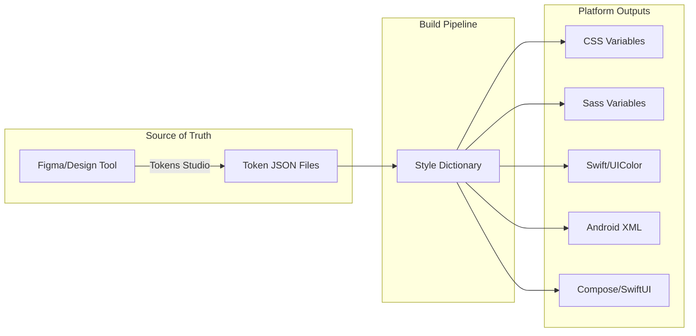
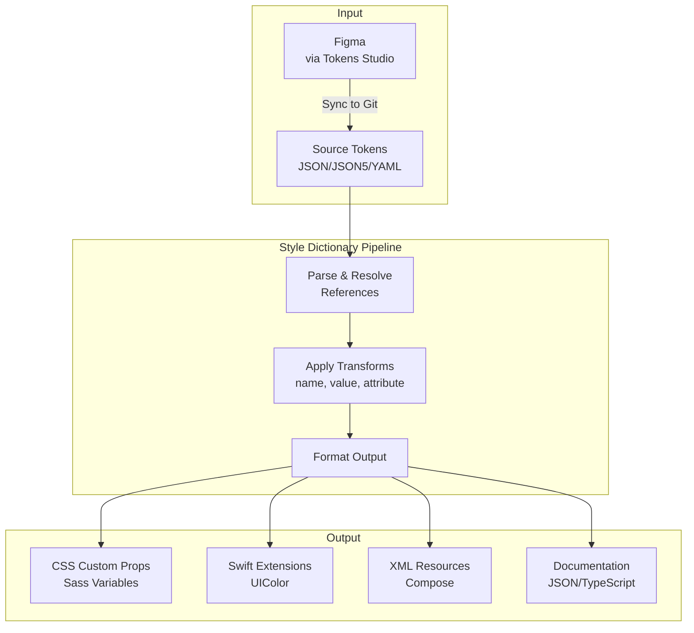

# Design Tokens and Theming Architecture

Design tokens encode design decisions as platform-agnostic data, enabling consistent UI across web, iOS, and Android from a single source of truth. This article covers the token taxonomy, semantic layering for theming, multi-platform transformation pipelines, and governance strategies that make enterprise design systems maintainable at scale.

<figure>



<figcaption>Design token pipeline: tokens defined once, transformed per platform.</figcaption>
</figure>

## Abstract

Design tokens are named entities storing visual design attributes—colors, spacing, typography—that serve as the atomic building blocks of a design system. The core mental model:

- **Primitives** answer "what values exist?" (raw palette: `blue-500: #2563eb`)
- **Semantic tokens** answer "what does this value mean?" (purpose: `color-action-primary`)
- **Component tokens** answer "where is this used?" (specificity: `button-background`)

Theming works by swapping semantic layers while primitives remain constant. A dark theme redefines `color-background` from `{gray-50}` to `{gray-900}`—components referencing the semantic token adapt automatically.

The W3C Design Tokens Community Group (DTCG) specification (v2025.10) standardizes the JSON format with `$value`, `$type`, and `$description` properties. Tools like Style Dictionary transform this source into platform-specific outputs (CSS custom properties, Swift UIColor, Android XML resources).

## Token Taxonomy

The three-tier token hierarchy emerged from Salesforce's Lightning Design System work (2014-2015), where Jina Anne and Jon Levine needed to scale design decisions across platforms and partner implementations.

### Primitive Tokens (Reference/Global)

Primitives define the raw design palette with no semantic meaning attached. They answer "what options exist?" and form the foundation that semantic tokens reference.

```json title="primitives.tokens.json"
{
  "color": {
    "blue": {
      "100": { "$value": "#dbeafe", "$type": "color" },
      "500": { "$value": "#3b82f6", "$type": "color" },
      "900": { "$value": "#1e3a8a", "$type": "color" }
    },
    "gray": {
      "50": { "$value": "#f9fafb", "$type": "color" },
      "900": { "$value": "#111827", "$type": "color" }
    }
  },
  "spacing": {
    "100": { "$value": "4px", "$type": "dimension" },
    "200": { "$value": "8px", "$type": "dimension" },
    "400": { "$value": "16px", "$type": "dimension" }
  }
}
```

**Naming convention**: Primitives use appearance-based names (`blue-500`, `gray-50`) because they carry no semantic intent. The value itself is the identity.

**Scale design**: Avoid sequential integers (`shadow-1`, `shadow-2`) which leave no room for insertion. Use:

- **Numeric scales**: 100, 200, 400, 800 (doubling allows interpolation)
- **T-shirt sizes**: xs, sm, md, lg, xl, 2xl
- **Named variants**: subtle, default, strong

### Semantic Tokens (Alias/Purpose)

Semantic tokens assign meaning to primitives. They answer "how should this value be used?" and create the indirection layer that enables theming.

```json title="semantic.tokens.json"
{
  "color": {
    "background": {
      "default": { "$value": "{color.gray.50}", "$type": "color" },
      "surface": { "$value": "#ffffff", "$type": "color" },
      "inverse": { "$value": "{color.gray.900}", "$type": "color" }
    },
    "text": {
      "primary": { "$value": "{color.gray.900}", "$type": "color" },
      "secondary": { "$value": "{color.gray.600}", "$type": "color" },
      "inverse": { "$value": "#ffffff", "$type": "color" }
    },
    "action": {
      "primary": { "$value": "{color.blue.500}", "$type": "color" },
      "primary-hover": { "$value": "{color.blue.600}", "$type": "color" }
    }
  }
}
```

The curly brace syntax `{color.gray.50}` creates an alias—the DTCG spec's reference mechanism. When the primitive changes, all semantic tokens referencing it update automatically.

**Naming convention**: Semantic tokens use purpose-based names. The pattern `{category}.{concept}.{variant}` yields names like `color.action.primary` or `spacing.layout.gutter`. This decouples the "what" (blue) from the "why" (primary action).

### Component Tokens (Specific/Application)

Component tokens map semantic values to specific UI component parts. They answer "where exactly is this used?"

```json title="component.tokens.json"
{
  "button": {
    "primary": {
      "background": { "$value": "{color.action.primary}", "$type": "color" },
      "background-hover": { "$value": "{color.action.primary-hover}", "$type": "color" },
      "text": { "$value": "{color.text.inverse}", "$type": "color" },
      "border-radius": { "$value": "{spacing.100}", "$type": "dimension" },
      "padding-x": { "$value": "{spacing.400}", "$type": "dimension" },
      "padding-y": { "$value": "{spacing.200}", "$type": "dimension" }
    }
  }
}
```

**When to use component tokens**: They add significant maintenance overhead. Only introduce this tier when you need:

- **Multi-brand theming**: Different brands require different component appearances beyond color swaps
- **Granular component customization**: Consumers need to override specific component parts
- **White-labeling**: Partners skin components while core semantics stay constant

Most design systems operate well with just primitives and semantic tokens. Component tokens multiply the token count significantly—a system with 200 semantic tokens might balloon to 2000+ with component tokens.

### Tier Trade-offs

| Approach              | Token Count       | Flexibility | Maintenance | Use Case                           |
| --------------------- | ----------------- | ----------- | ----------- | ---------------------------------- |
| Primitives only       | Low (~50-100)     | Limited     | Minimal     | Simple apps, prototypes            |
| Primitives + Semantic | Medium (~200-500) | Good        | Moderate    | Most production systems            |
| All three tiers       | High (~1000+)     | Maximum     | Significant | Multi-brand, white-label platforms |

## Naming Conventions

The Category-Type-Item (CTI) pattern from Style Dictionary provides hierarchical, predictable token names that transform cleanly across platforms.

### Full Naming Structure

| Level         | Purpose             | Examples                                |
| ------------- | ------------------- | --------------------------------------- |
| **Namespace** | System identifier   | `acme-`, `spectrum-`                    |
| **Category**  | Output type         | `color`, `spacing`, `font`, `shadow`    |
| **Concept**   | Semantic grouping   | `background`, `action`, `feedback`      |
| **Property**  | CSS property target | `text`, `border`, `fill`                |
| **Variant**   | Scale position      | `primary`, `secondary`, `100`, `lg`     |
| **State**     | Interaction state   | `default`, `hover`, `disabled`, `focus` |

A fully qualified token: `acme-color-action-background-primary-hover`

### Practical Naming Rules

**For primitives**: Use appearance descriptors.

- `blue-500`, `gray-100` ✓
- `primary-blue`, `link-color` ✗ (semantic meaning doesn't belong in primitives)

**For semantic tokens**: Use purpose descriptors.

- `color-text-primary`, `color-action-danger` ✓
- `color-blue`, `dark-gray` ✗ (appearance doesn't belong in semantics)

**Forbidden characters**: The DTCG spec prohibits `{`, `}`, and `.` in token names—these are reserved for the reference syntax. Use hyphens or underscores as delimiters.

**Case conventions by platform**:

| Platform     | Convention | Example                |
| ------------ | ---------- | ---------------------- |
| CSS          | kebab-case | `--color-text-primary` |
| JavaScript   | camelCase  | `colorTextPrimary`     |
| Swift/Kotlin | camelCase  | `colorTextPrimary`     |
| Android XML  | snake_case | `color_text_primary`   |

Style Dictionary handles these transformations automatically via name transforms.

## Theming Architecture

Theming swaps semantic token values while keeping primitives constant. The semantic layer acts as a "switchboard" between raw values and component consumption.

### Theme Structure

```json title="themes/light.tokens.json"
{
  "color": {
    "background": {
      "default": { "$value": "{color.gray.50}" },
      "surface": { "$value": "#ffffff" },
      "elevated": { "$value": "#ffffff" }
    },
    "text": {
      "primary": { "$value": "{color.gray.900}" },
      "secondary": { "$value": "{color.gray.600}" }
    }
  }
}
```

```json title="themes/dark.tokens.json"
{
  "color": {
    "background": {
      "default": { "$value": "{color.gray.900}" },
      "surface": { "$value": "{color.gray.800}" },
      "elevated": { "$value": "{color.gray.700}" }
    },
    "text": {
      "primary": { "$value": "#ffffff" },
      "secondary": { "$value": "{color.gray.300}" }
    }
  }
}
```

### CSS Implementation

Theme switching via CSS custom properties and a data attribute:

```css title="tokens.css"
:root {
  /* Primitives - constant */
  --color-blue-500: #3b82f6;
  --color-gray-50: #f9fafb;
  --color-gray-900: #111827;
}

/* Light theme (default) */
:root,
[data-theme="light"] {
  --color-background-default: var(--color-gray-50);
  --color-text-primary: var(--color-gray-900);
}

/* Dark theme */
[data-theme="dark"] {
  --color-background-default: var(--color-gray-900);
  --color-text-primary: #ffffff;
}
```

```js title="theme-switcher.js" collapse={1-2}
// Theme toggle implementation
function setTheme(theme) {
  document.documentElement.setAttribute("data-theme", theme)
  localStorage.setItem("theme", theme)
}
```

### Multi-Dimensional Theming

Production systems often need multiple orthogonal theme dimensions:

| Dimension  | Values                        | Mechanism                 |
| ---------- | ----------------------------- | ------------------------- |
| Color mode | light, dark, high-contrast    | Semantic color layer swap |
| Brand      | primary, partner-a, partner-b | Primitive palette swap    |
| Density    | comfortable, compact          | Spacing token scale swap  |
| Platform   | desktop, mobile               | Component token overrides |

These dimensions compose. A "dark + partner-a + compact" theme combines three orthogonal token sets. The implementation typically uses multiple data attributes or CSS class composition:

```css
[data-mode="dark"][data-brand="partner-a"][data-density="compact"] {
  /* Composed token values */
}
```

### Dark Mode Pitfalls

Dark mode isn't color inversion. Common mistakes:

**Saturated colors fail contrast**: A vibrant `#3b82f6` blue meets WCAG 4.5:1 contrast on white but fails on dark backgrounds. Dark themes require desaturated color variants.

**Elevation reverses direction**: In light mode, elevation increases brightness (shadows lift elements). In dark mode, elevation increases brightness too—not darkness. Material Design 3 uses "surface tint" overlays that lighten elevated surfaces.

**Don't invert the entire palette**: Simply swapping `gray-100` ↔ `gray-900` breaks visual hierarchy. Dark themes need deliberate surface level definitions.

### Contrast Validation

The USWDS (U.S. Web Design System) "magic number" approach: token values include a contrast grade (0-100). Any pair with a difference of 40+ passes WCAG AA for large text, 50+ for normal text.

```json
{
  "gray": {
    "5": { "$value": "#f0f0f0", "contrast-grade": 5 },
    "90": { "$value": "#1b1b1b", "contrast-grade": 90 }
  }
}
```

`90 - 5 = 85` → Passes AAA (70+ required).

## Distribution Pipeline

Style Dictionary (originally from Amazon) is the industry standard for token transformation. It parses source tokens, applies transforms, and outputs platform-specific formats.

### Pipeline Architecture



### Style Dictionary Configuration

```js title="style-dictionary.config.mjs" collapse={1-3, 35-50}
// Configuration for multi-platform token build
import StyleDictionary from "style-dictionary"

export default {
  source: ["tokens/**/*.json"],
  platforms: {
    css: {
      transformGroup: "css",
      buildPath: "dist/css/",
      files: [
        {
          destination: "tokens.css",
          format: "css/variables",
          options: {
            outputReferences: true, // Preserve aliases in output
          },
        },
      ],
    },
    scss: {
      transformGroup: "scss",
      buildPath: "dist/scss/",
      files: [
        {
          destination: "_tokens.scss",
          format: "scss/variables",
        },
      ],
    },
    ios: {
      transformGroup: "ios-swift",
      buildPath: "dist/ios/",
      files: [
        {
          destination: "Tokens.swift",
          format: "ios-swift/class.swift",
          className: "DesignTokens",
        },
      ],
    },
    // Android configuration
    android: {
      transformGroup: "android",
      buildPath: "dist/android/",
      files: [
        {
          destination: "tokens.xml",
          format: "android/resources",
        },
      ],
    },
  },
}
```

### Transform Types

| Transform Type | Purpose                        | Example                                       |
| -------------- | ------------------------------ | --------------------------------------------- |
| **name**       | Convert token name format      | `color.text.primary` → `--color-text-primary` |
| **value**      | Convert value representation   | `16` → `1rem`, `#ff0000` → `UIColor.red`      |
| **attribute**  | Add metadata based on CTI path | Add `category: 'color'` based on token path   |

### Platform-Specific Value Transformations

The same token requires different representations per platform:

| Token                   | Web CSS   | Android            | iOS                                              |
| ----------------------- | --------- | ------------------ | ------------------------------------------------ |
| `spacing.md: 16`        | `1rem`    | `16dp`             | `16.0` (CGFloat)                                 |
| `color.brand: #2563eb`  | `#2563eb` | `#FF2563EB` (ARGB) | `UIColor(red:0.15,green:0.39,blue:0.92,alpha:1)` |
| `font.weight.bold: 700` | `700`     | `Typeface.BOLD`    | `.bold`                                          |

Style Dictionary v4 (current) supports transitive transforms—resolving reference chains iteratively. A component token referencing a semantic token referencing a primitive resolves correctly through the chain.

### CI/CD Integration

```yaml title=".github/workflows/tokens.yml" collapse={1-5, 25-35}
# GitHub Actions workflow for token builds
name: Build Tokens
on:
  push:
    paths: ["tokens/**"]

jobs:
  build:
    runs-on: ubuntu-latest
    steps:
      - uses: actions/checkout@v4

      - uses: actions/setup-node@v4
        with:
          node-version: "20"

      - run: npm ci

      - run: npm run build:tokens

      - name: Publish to npm
        run: npm publish
        env:
          NODE_AUTH_TOKEN: ${{ secrets.NPM_TOKEN }}

      # Upload artifacts for other platforms
      - uses: actions/upload-artifact@v4
        with:
          name: ios-tokens
          path: dist/ios/

      - uses: actions/upload-artifact@v4
        with:
          name: android-tokens
          path: dist/android/
```

### Tokens Studio Integration

Tokens Studio (Figma plugin) enables designers to define tokens in Figma and sync to Git. The workflow:

1. Designer creates/updates tokens in Figma using Tokens Studio plugin
2. Plugin pushes changes to GitHub/GitLab (JSON format)
3. CI triggers Style Dictionary build
4. Platform outputs published to package registries
5. Consuming apps update dependency version

Tokens Studio supports 24+ token types—more than native Figma Variables (which only support color, number, boolean, string). As of v1.37, Tokens Studio can sync plugin tokens with native Figma Variables for broader tool compatibility.

## Version Management

Design tokens follow semantic versioning with domain-specific considerations for breaking changes.

### Semantic Versioning for Tokens

| Version Bump      | Trigger                                 | Example                                                                    |
| ----------------- | --------------------------------------- | -------------------------------------------------------------------------- |
| **Major (X.0.0)** | Token removed, renamed, or type changed | Removing `color-accent`, renaming `color-primary` → `color-action-primary` |
| **Minor (0.X.0)** | New tokens added                        | Adding `color-accent-subtle`                                               |
| **Patch (0.0.X)** | Value adjustments                       | Changing `blue-500` from `#3b82f6` to `#2563eb`                            |

### Deprecation Strategy

The DTCG spec includes a `$deprecated` property for staged removal:

```json title="deprecated-token.json"
{
  "color-accent": {
    "$value": "{color.action.primary}",
    "$type": "color",
    "$deprecated": "Use color.action.primary instead. Removal in v3.0.0."
  }
}
```

**Deprecation workflow**:

1. **Mark deprecated**: Add `$deprecated` with migration guidance
2. **Emit warnings**: Build tooling warns on deprecated token usage
3. **Maintain alias**: Point deprecated token to replacement value
4. **Stage removal**: Give consumers 1-2 minor versions to migrate
5. **Remove**: Major version bump with changelog documentation

### Migration Tooling

For large codebases, automated migration via codemods:

```js title="codemod-rename-token.js" collapse={1-5}
// Example jscodeshift codemod for token renames
// Run: npx jscodeshift -t codemod-rename-token.js src/

const tokenRenames = {
  "color-accent": "color-action-primary",
  "color-accent-hover": "color-action-primary-hover",
}

export default function transformer(file, api) {
  const j = api.jscodeshift

  return j(file.source)
    .find(j.Literal)
    .filter((path) => tokenRenames[path.value])
    .forEach((path) => {
      path.replace(j.literal(tokenRenames[path.value]))
    })
    .toSource()
}
```

### Changelog Requirements

Token changelogs should include:

- **Added**: New tokens with intended use case
- **Changed**: Value modifications with before/after
- **Deprecated**: Tokens marked for removal with migration path
- **Removed**: Tokens deleted (major version only)

```markdown
## [2.0.0] - 2025-01-15

### Removed

- `color-accent` - Use `color.action.primary`

### Changed

- `color.blue.500` - #3b82f6 → #2563eb (improved contrast)

## [1.5.0] - 2024-12-01

### Deprecated

- `color-accent` - Will be removed in v2.0. Use `color.action.primary`

### Added

- `color.action.primary-subtle` - Low-emphasis action color
```

## Governance

Effective token governance requires clear ownership, change processes, and quality gates.

### Ownership Model

| Role                   | Responsibility                                          |
| ---------------------- | ------------------------------------------------------- |
| **Design System Team** | Token schema, naming conventions, build pipeline        |
| **Platform Leads**     | Platform-specific transforms, integration patterns      |
| **Design Lead**        | Visual decisions, brand alignment, accessibility review |
| **Consumers**          | Adoption, feedback, bug reports                         |

### Change Process

1. **Proposal**: RFC describing token addition/change with rationale
2. **Design Review**: Visual validation against brand guidelines
3. **Accessibility Review**: Contrast ratios, color blindness simulation
4. **Technical Review**: Naming convention compliance, platform impact
5. **Approval**: Sign-off from design system team
6. **Implementation**: Token file changes with tests
7. **Release**: Version bump, changelog, communication

### Quality Gates (CI)

```yaml title=".github/workflows/token-validation.yml" collapse={1-8}
# Validation checks for token PRs
name: Token Validation
on:
  pull_request:
    paths: ["tokens/**"]

jobs:
  validate:
    runs-on: ubuntu-latest
    steps:
      - uses: actions/checkout@v4

      - name: Validate JSON Schema
        run: npx ajv validate -s schema/dtcg.json -d "tokens/**/*.json"

      - name: Check Naming Conventions
        run: npm run lint:tokens

      - name: Validate Contrast Ratios
        run: npm run test:contrast

      - name: Build All Platforms
        run: npm run build:tokens

      - name: Check for Breaking Changes
        run: npm run check:breaking
```

### Linting Rules

Enforce conventions programmatically:

- **Naming**: Token names match CTI pattern
- **Values**: Colors in valid hex/rgb format, dimensions include units
- **References**: All aliases resolve to existing tokens
- **Completeness**: Semantic tokens have light and dark variants
- **Documentation**: Required tokens have `$description`

## Real-World Design System Examples

### Salesforce Lightning Design System

The pioneer of design tokens (2014). SLDS evolved from version 1 (design tokens as build-time values) to SLDS 2 with "styling hooks"—CSS custom properties exposed at runtime for component customization.

Styling hooks pattern:

```css
/* Consumer overrides at component level */
.my-context .slds-button {
  --slds-c-button-brand-color-background: var(--my-brand-color);
}
```

### Adobe Spectrum

Spectrum publishes tokens in `@adobe/spectrum-tokens` (v12+). Their Token Visualizer tool provides searchable token documentation. Spectrum uses DTCG-compatible format with Tokens Studio data export.

Token structure follows:

- **Global tokens**: Platform-wide values (`spectrum-global-color-blue-500`)
- **Alias tokens**: Semantic mappings (`spectrum-alias-background-color-default`)
- **Component tokens**: Per-component CSS custom properties

### IBM Carbon

Carbon defines 52 universal color variables per theme (White, Gray 10, Gray 90, Gray 100). Token categories:

- Color: `$interactive-01`, `$ui-background`, `$text-primary`
- Typography: `$productive-heading-01`, `$body-long-01`
- Spacing: `$spacing-01` through `$spacing-13`
- Motion: `$duration-fast-01`, `$easing-standard-productive`

### Google Material Design 3

Material 3 introduced dynamic color—algorithmic palette generation from a source color. Token types:

- **Color**: Primary, secondary, tertiary, neutral palettes
- **Typography**: Type scale tokens (`display-large`, `body-medium`)
- **Shape**: Corner radius tokens per component size

Material's token structure uses tonal palettes (0-100 lightness scale) enabling precise contrast calculation.

## Conclusion

Design tokens succeed when they encode design intent, not just design values. The three-tier hierarchy (primitive → semantic → component) creates the right abstraction layers: primitives for the design palette, semantic tokens for meaning and theming, component tokens for granular customization when needed.

The DTCG specification (v2025.10) provides the standardized JSON format the industry lacked. Style Dictionary transforms this source into platform-specific outputs. The governance model—clear ownership, change processes, automated validation—prevents the drift that undermines design system value.

Start with primitives and semantic tokens. Add component tokens only when multi-brand or white-label requirements demand them. Version tokens like code: semantic versioning, deprecation staging, automated migration. The goal is a single source of truth that scales across platforms without manual synchronization.

## Appendix

### Prerequisites

- CSS custom properties (variables) syntax and cascade
- Build tool basics (npm scripts, CI pipelines)
- JSON/JSON5 file formats

### Terminology

| Term                     | Definition                                                                        |
| ------------------------ | --------------------------------------------------------------------------------- |
| **DTCG**                 | Design Tokens Community Group—W3C community group authoring the specification     |
| **CTI**                  | Category-Type-Item—naming convention hierarchy from Style Dictionary              |
| **Primitive token**      | Raw design value with no semantic meaning (e.g., `blue-500: #3b82f6`)             |
| **Semantic token**       | Alias token with contextual meaning (e.g., `color-action-primary`)                |
| **Component token**      | Token scoped to specific component part (e.g., `button-background-color`)         |
| **Transitive transform** | Style Dictionary feature resolving reference chains through multiple alias levels |

### Summary

- Design tokens are named entities storing design attributes as platform-agnostic data
- Three-tier hierarchy: primitives (values) → semantic (meaning) → component (specificity)
- DTCG specification (v2025.10) standardizes JSON format with `$value`, `$type`, `$description`
- Theming works by swapping semantic token layers; primitives stay constant
- Style Dictionary transforms source tokens into platform-specific outputs (CSS, Swift, Android)
- Version tokens with SemVer; deprecate before removing; provide migration codemods

### References

**Specifications**

- [DTCG Design Tokens Specification](https://www.designtokens.org/tr/drafts/format/) - W3C Community Group specification (v2025.10)
- [Design Tokens Community Group](https://www.designtokens.org/) - Official DTCG site

**Tools Documentation**

- [Style Dictionary](https://styledictionary.com/) - Token transformation pipeline documentation
- [Tokens Studio](https://docs.tokens.studio/) - Figma plugin for token management
- [Terrazzo](https://terrazzo.app/docs/) - DTCG-native transformation tool
- [Theo](https://github.com/salesforce-ux/theo) - Salesforce's original token generator

**Design Systems**

- [Adobe Spectrum Design Tokens](https://spectrum.adobe.com/page/design-tokens/) - Spectrum token documentation
- [IBM Carbon Themes](https://v10.carbondesignsystem.com/guidelines/themes/overview/) - Carbon theme architecture
- [Material Design 3 Tokens](https://m3.material.io/foundations/design-tokens) - Google's token structure
- [Salesforce SLDS Styling Hooks](https://developer.salesforce.com/docs/platform/lwc/guide/create-components-css-custom-properties.html) - SLDS CSS custom properties

**Core Maintainer Content**

- [Jina Anne on Design Tokens](https://www.smashingmagazine.com/2019/11/smashing-podcast-episode-3/) - Smashing Podcast with the design tokens pioneer
- [Nathan Curtis - Naming Tokens in Design Systems](https://medium.com/eightshapes-llc/naming-tokens-in-design-systems-9e86c7444676) - Comprehensive naming conventions guide
- [Nathan Curtis - Tokens in Design Systems](https://medium.com/eightshapes-llc/tokens-in-design-systems-25dd82d58421) - 10 tips for token architecture
- [Brad Frost - Design Tokens + Atomic Design](https://bradfrost.com/blog/post/design-tokens-atomic-design/) - Integration with atomic design methodology
