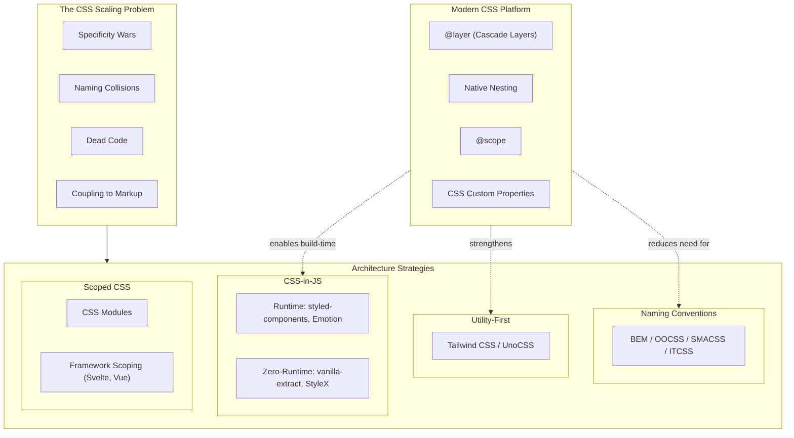

# CSS Architecture Strategies: BEM, Utility-First, and CSS-in-JS

Every CSS architecture answers the same question: how do you organize styles so that a growing team can ship changes without breaking existing UI? The answer involves tradeoffs between naming discipline, tooling overhead, runtime cost, and the dependency direction between markup and styles. This article dissects the three dominant paradigms—naming conventions (BEM and descendants), utility-first systems (Tailwind CSS, UnoCSS), and CSS-in-JS (runtime and zero-runtime variants)—then maps modern CSS platform features that are collapsing the gaps between them.

<figure>



<figcaption>CSS architecture strategies address specificity, naming, dead code, and coupling. Modern CSS platform features are shifting the calculus by solving problems that previously required tooling.</figcaption>
</figure>

## Abstract

CSS architecture is fundamentally about **dependency direction**: does CSS depend on HTML structure (semantic class names that mirror content), or does HTML depend on CSS (utility classes that compose pre-built style primitives)? This single axis—introduced by Adam Wathan and formalized by every methodology since OOCSS—determines your specificity management strategy, dead code elimination story, refactoring cost, and team onboarding friction.

The three paradigms form a spectrum:

| Strategy | Dependency Direction | Scope Mechanism | Dead Code Story | Runtime Cost |
| --- | --- | --- | --- | --- |
| **BEM / naming conventions** | CSS mirrors HTML structure | Convention (human discipline) | Manual auditing | None |
| **Utility-first** | HTML composes CSS primitives | Constraint (fixed token set) | Build-time tree-shaking | None |
| **CSS-in-JS (runtime)** | Co-located, JS generates CSS | Automatic (hashed classes) | Bundler tree-shaking | CSSOM injection per render |
| **CSS-in-JS (zero-runtime)** | Co-located, build extracts CSS | Automatic (hashed classes) | Bundler tree-shaking | None |
| **CSS Modules** | Co-located, build hashes names | Automatic (hashed classes) | Bundler tree-shaking | None |

Modern CSS features—Cascade Layers (`@layer`), native nesting, `@scope`, and `:has()`—do not replace these paradigms but shift where their boundaries fall. `@layer` solves specificity wars that BEM was invented to avoid. Native nesting reduces the preprocessor dependency that naming conventions relied on. Zero-runtime CSS-in-JS converges with utility-first at the output level: both produce static atomic CSS.

## The CSS Scaling Problem

Before comparing strategies, it helps to name the four problems every CSS architecture must solve at scale.

### Specificity Conflicts

The CSS cascade resolves conflicts by specificity, then source order. In a large codebase, uncoordinated selectors accumulate specificity that becomes unpredictable. The result: developers reach for `!important`, which escalates the arms race. GitHub's Primer team documented that before adopting utility classes, their codebase contained hundreds of `!important` declarations—each one a sign that the cascade had become adversarial.

The W3C CSS Cascading and Inheritance Level 5 specification introduced Cascade Layers (`@layer`) specifically to address this. Layers are evaluated *before* specificity in the cascade algorithm, giving authors deterministic ordering without specificity hacks.

### Naming Collisions

Global CSS means every class name shares a single namespace. Two developers writing `.card` in different files will collide. BEM solves this through convention (`.block__element--modifier`). CSS Modules and CSS-in-JS solve it through tooling (hashed class names). Utility-first sidesteps it entirely—there is nothing to name because you compose existing classes.

### Dead Code Accumulation

CSS is append-only in practice. Removing a class requires proving no template references it—a whole-codebase search that most teams skip. Over years, stylesheets accumulate unused rules. The HTTP Archive reports that the median page ships 80+ KB of CSS, with studies showing 35-50% is unused on first load. Utility-first and CSS-in-JS both tie style generation to template usage, making dead code elimination automatic.

### Coupling Between Markup and Styles

Semantic CSS couples styles to content structure: `.author-bio` only makes sense in one context. Refactoring the markup means refactoring the CSS. Utility classes invert this—styles are content-agnostic. CSS-in-JS co-locates them, making the coupling explicit and local rather than implicit and distant.

## Naming Conventions: BEM and Its Descendants

### BEM (Block Element Modifier)

BEM (Block Element Modifier), created by Yandex in 2005 and open-sourced in 2010, is a naming convention that encodes component structure into class names. The format `block__element--modifier` creates a flat specificity profile (single class selectors only) while communicating relationships.

```css title="BEM naming pattern"
/* Block: standalone component */
.search-form { }

/* Element: part of the block (double underscore) */
.search-form__input { }
.search-form__button { }

/* Modifier: variant or state (double hyphen) */
.search-form--dark { }
.search-form__button--disabled { }
```

**Design rationale:** BEM enforces single-class selectors, keeping specificity uniformly at `0,1,0`. No nesting, no combinators, no IDs. This means source order is the only tiebreaker—and since BEM components are self-contained, source order rarely matters within a component.

**Where BEM breaks down:**

- **Cross-component styling.** When a `.card` inside a `.sidebar` needs different spacing, BEM offers no clean mechanism. Teams resort to context-dependent modifiers (`.card--in-sidebar`) that violate the component isolation principle.
- **State management.** Interactive states like `.is-active` or `.is-open` require a separate convention that BEM does not prescribe, leading to inconsistent patterns across teams.
- **Verbose naming.** Deep component trees produce names like `.dashboard__sidebar__nav-item--active`, which is unwieldy. Harry Roberts (creator of ITCSS, prominent BEM advocate) recommends flattening: avoid nesting elements more than one level.
- **No enforcement.** BEM is pure convention. Nothing prevents a developer from writing `.search-form .input`—a nested selector that defeats the entire purpose. Linting rules (e.g., `stylelint-selector-bem-pattern`) help but require explicit adoption.

### OOCSS (Object-Oriented CSS)

Nicole Sullivan introduced OOCSS (Object-Oriented CSS) at Web Directions North in 2009 with two principles: **separate structure from skin** (layout vs. visual decoration) and **separate container from content** (a component should look the same regardless of where it appears). Sullivan demonstrated the approach by reducing Facebook's CSS by ~19% while working there.

OOCSS anticipated the utility-first movement. The `.media` object—a floated image beside text—was one of the first reusable CSS abstractions, appearing in Bootstrap's media component and countless design systems.

### SMACSS and ITCSS: Layered Organization

SMACSS (Scalable and Modular Architecture for CSS), created by Jonathan Snook in 2011, categorizes rules into five types: Base, Layout, Module, State, and Theme. ITCSS (Inverted Triangle CSS), created by Harry Roberts, orders CSS from generic to specific: Settings, Tools, Generic, Elements, Objects, Components, Utilities—a specificity pyramid where each layer has higher specificity than the one before it.

Both are organizational frameworks, not naming conventions. They prescribe *file structure and import order* to manage the cascade. ITCSS's insight is particularly relevant: by ordering imports from low to high specificity, later rules naturally override earlier ones without `!important`.

> **Modern equivalent:** Tailwind CSS v4 uses native CSS `@layer` directives (`theme`, `base`, `components`, `utilities`) to achieve the same specificity ordering that ITCSS prescribed through file conventions. The platform now provides what ITCSS simulated.

### CUBE CSS: Convention Meets Utility

Andy Bell's CUBE CSS (Composition Utility Block Exception) is a hybrid methodology that embraces utility classes for the common case and reserves BEM-style blocks for exceptions—specific overrides that break the general pattern. The "Composition" layer handles layout using flow and spacing primitives rather than component-specific positioning.

CUBE represents the philosophical middle ground: use utilities where they suffice, fall back to named classes for genuinely unique styling. It is notably the methodology behind the BBC's GEL design system rebuild.

### When Naming Conventions Still Make Sense

Naming conventions remain relevant when:

- **No build step is available** (static sites, CMS templates, email HTML)
- **Team has established BEM fluency** and the codebase is stable
- **Third-party CSS integration** requires predictable class names for overrides
- **Server-rendered content** where markup is generated by backend templates (Rails, Django, PHP) and component extraction is impractical

The cost is perpetual vigilance: no tool enforces the convention, dead code accumulates, and specificity discipline depends entirely on code review.

## Utility-First CSS

### The Dependency Direction Insight

Adam Wathan's 2017 essay "CSS Utility Classes and Separation of Concerns" reframed the architecture debate. The traditional model—semantic class names that describe content—creates CSS that depends on HTML structure. Renaming a component means renaming its CSS. Wathan inverted this: utility classes are content-agnostic primitives that HTML composes, making the CSS reusable across any context.

The practical observation: "For the project you are working on, what would be more valuable: restyleable HTML, or reusable CSS?" For most component-driven applications, the answer is reusable CSS.

### Tailwind CSS v4 Architecture

As of Tailwind CSS v4 (released January 2025), the framework underwent a foundational rewrite:

**Oxide engine.** The core was rewritten from JavaScript to Rust, integrating Lightning CSS for vendor prefixing and syntax transforms. Build performance improved 3.5-5x for full builds and 8-100x for incremental rebuilds. Cold starts are 30x faster.

**CSS-first configuration.** The JavaScript `tailwind.config.js` is replaced by CSS-native `@theme` directives:

```css title="tailwind-v4-config.css" collapse={1-2}
@import "tailwindcss";

@theme {
  --color-primary: #2563eb;
  --color-surface: #fefefe;
  --font-sans: "Inter", system-ui, sans-serif;
  --breakpoint-lg: 1024px;
}
```

Tokens declared in `@theme` serve dual purpose: they generate utility classes (`bg-primary`, `text-surface`) *and* are available as CSS custom properties at runtime, eliminating the dual-maintenance problem of v3.

**Native Cascade Layers.** v4 uses real CSS `@layer` for `theme`, `base`, `components`, and `utilities`. This gives deterministic specificity ordering: utilities always override components regardless of source order—the exact problem ITCSS solved through file conventions.

**Automatic content detection.** No `content` paths configuration. The Oxide engine scans the project automatically, eliminating a common source of "missing class" bugs.

> **Prior to v4:** Tailwind v3 used a JavaScript-based JIT compiler, required explicit `content` path configuration, and relied on PostCSS as its build pipeline. Configuration lived in `tailwind.config.js`, and design tokens had to be duplicated as CSS custom properties if runtime access was needed.

### Bundle Size and Tree-Shaking

Tailwind's Just-In-Time compiler (default since v2.1, enhanced in v4) generates CSS only for classes found in templates. Production output is typically under 10 KB compressed. Netflix's Top 10 site ships 6.5 KB of CSS using Tailwind.

A critical constraint: class names must be **statically extractable**. The JIT compiler scans files as strings—it does not evaluate JavaScript. Dynamic class construction like `` `text-${color}-500` `` breaks extraction. Complete class names must appear in source:

```ts title="dynamic-classes.ts"
// Breaks tree-shaking — class name is not statically extractable
const cls = `text-${color}-500`

// Works — complete class names are scannable
const colorMap = { red: "text-red-500", blue: "text-blue-500" }
const cls = colorMap[color]
```

### The @apply Tension

Tailwind provides `@apply` to extract utility patterns into named classes. The Tailwind team explicitly discourages heavy use. Wathan's position: using `@apply` for everything means "you are basically just writing CSS again and throwing away all of the workflow and maintainability advantages Tailwind gives you."

Valid `@apply` use cases are narrow:

- **CMS/WYSIWYG content** where you cannot control markup classes
- **Third-party library overrides** where you must target specific selectors
- **Template languages** (ERB, Twig, Jinja) where component extraction is impractical

For component frameworks (React, Vue, Svelte, Astro), the component itself is the abstraction. A `<Button>` component encapsulates its utility classes; there is no duplication to extract.

### UnoCSS: The Extensible Alternative

Anthony Fu's UnoCSS (Vue/Vite core team) takes a different approach: an "instant atomic CSS engine" with a fully extensible preset system. It ships Tailwind-compatible, WindiCSS-compatible, and Attributify presets (utilities as HTML attributes like `<div text="lg" p="4">`).

Performance claims are dramatic—up to 200x faster than Tailwind's v3 JIT—though the practical difference is negligible since both produce sub-second builds. The real differentiator is extensibility: UnoCSS lets teams define entirely custom utility systems, while Tailwind provides a fixed vocabulary with escape hatches.

### Utility-First Limitations

**HTML readability.** Utility-heavy markup is visually dense. A styled button can accumulate 10-15 classes. This is the most common criticism and the primary source of team resistance.

**Learning curve.** Developers must learn the utility vocabulary (Tailwind has ~500 core utilities). The payoff is speed after the learning curve—but the curve is real.

**Design drift without tokens.** Arbitrary value syntax (`w-[137px]`) bypasses the design token system. Without team discipline or linting, arbitrary values proliferate and consistency degrades. The `eslint-plugin-tailwindcss` and Tailwind's `--strict` mode help enforce token usage.

**Responsive and state complexity.** Variants stack: `sm:hover:dark:focus-visible:ring-2` is valid but difficult to parse visually. This compounds the readability issue for complex responsive designs.

## CSS-in-JS: Co-location with Tradeoffs

CSS-in-JS (CSS-in-JavaScript) emerged from the React ecosystem's desire to co-locate styles with component logic. The approach eliminates naming collisions through generated class names and enables dynamic styling through JavaScript expressions.

### Runtime CSS-in-JS: styled-components and Emotion

styled-components (released 2016 by Max Stoiber and Glen Maddern) and Emotion (released 2017 by Kye Hohenberger) dominate the runtime category. Both generate CSS at render time and inject it into the document via `<style>` tags or CSSOM (CSS Object Model) APIs.

```tsx title="styled-components-example.tsx" collapse={1-3}
import styled from "styled-components"

// CSS is generated at runtime and injected into <style> tags
const Button = styled.button<{ $primary?: boolean }>`
  padding: 0.5rem 1rem;
  border-radius: 0.375rem;
  background: ${(props) => (props.$primary ? "#2563eb" : "transparent")};
  color: ${(props) => (props.$primary ? "white" : "#2563eb")};
  border: 1px solid #2563eb;
`
```

**The runtime cost is real.** Every render that touches styled components triggers:

1. Template literal parsing (or object style evaluation)
2. CSS string generation with interpolated prop values
3. Class name hashing
4. Style injection into the CSSOM or `<style>` tags
5. Browser style recalculation and layout

Sam Magura's widely-cited 2022 analysis "Why We're Breaking Up with CSS-in-JS" (written as a maintainer of Emotion) measured the overhead directly: Emotion rendered a representative component in 54 ms on average, versus 27.7 ms with Sass Modules—nearly a 2x slowdown. The team migrated to CSS Modules with Sass. Airbnb ran a similar migration from `react-with-styles` to Linaria; A/B testing on ~10% of homepage components showed +1.6% Total Blocking Time (TBT) improvement, with internal benchmarks projecting +16% TBT improvement at full migration.

**Bundle size overhead.** Runtime libraries add non-trivial weight to the JavaScript bundle:

| Library | Gzipped Size | Runtime Cost |
| --- | --- | --- |
| styled-components | ~15-20 KB | Style serialization + injection per render |
| Emotion (@emotion/react + styled) | ~11-13 KB | Style serialization + injection per render |
| Linaria | < 1 KB | Class name utility only |
| vanilla-extract | 0 KB | Build-time extraction, no runtime |
| CSS Modules | 0 KB | Build-time extraction, no runtime |

**Server-Side Rendering (SSR) complications.** Runtime CSS-in-JS requires collecting generated styles during server rendering and injecting them into the HTML response to avoid a Flash of Unstyled Content (FOUC). styled-components' `ServerStyleSheet` and Emotion's `extractCritical` add complexity to the SSR pipeline. React 18's streaming SSR (`renderToPipeableStream`) compounds this: HTML is sent chunk by chunk, but runtime CSS-in-JS needs all styles resolved before the `<head>` is sent. React 18 introduced `useInsertionEffect` specifically for CSS-in-JS style injection, but styled-components never adopted it—one reason Sanity's fork (`@sanity/styled-components`) achieves ~40% faster renders.

**React Server Components (RSC) incompatibility.** RSC forbids client-side JavaScript, Context, and hooks in server components. Runtime CSS-in-JS depends on all three: JavaScript for style serialization, Context for theming (`<ThemeProvider>`), and `useInsertionEffect` for injection. This makes styled-components and Emotion incompatible with the RSC model—styles can only run in `"use client"` components, fundamentally limiting RSC adoption. styled-components entered maintenance mode in early 2025; no new features will be developed. MUI (Material UI) announced their next major version will move to Pigment CSS, a zero-runtime solution, and eventually drop Emotion support.

### Zero-Runtime CSS-in-JS: Build-Time Extraction

The "CSS-in-JS backlash" drove a new generation of tools that preserve co-location but eliminate runtime cost by extracting static CSS at build time.

**vanilla-extract** (Mark Dalgleish, co-creator of CSS Modules) uses TypeScript files (`.css.ts`) that compile to static CSS. Styles are type-safe, locally scoped, and produce zero runtime JavaScript:

```ts title="button.css.ts" collapse={1-2}
import { style } from "@vanilla-extract/css"

export const button = style({
  padding: "0.5rem 1rem",
  borderRadius: "0.375rem",
  background: "#2563eb",
  color: "white",
  ":hover": { background: "#1d4ed8" },
})
```

The build step compiles this to a `.css` file with hashed class names. The exported `button` is just a string containing the generated class name. Zero runtime, full type safety.

**StyleX** (Meta, open-sourced 2023) takes co-location further with atomic CSS generation. Styles defined in JavaScript compile to single-property atomic classes, identical in output to what Tailwind produces:

```tsx title="stylex-example.tsx" collapse={1-2}
import * as stylex from "@stylexjs/stylex"

const styles = stylex.create({
  button: {
    padding: "0.5rem 1rem",
    borderRadius: "0.375rem",
    backgroundColor: "#2563eb",
    color: "white",
  },
})

// Usage: <button {...stylex.props(styles.button)} />
```

Meta reports that StyleX reduced their CSS bundle size by ~80% across Facebook, Instagram, WhatsApp, and Threads. The key insight: atomic CSS growth is sub-linear. As the codebase grows, new components increasingly reuse existing atomic classes rather than generating new ones.

**Panda CSS** (Segun Adebayo, creator of Chakra UI) bridges the styled-components API with build-time extraction. It supports both the object syntax and a `styled` API but compiles to static atomic CSS. Panda also generates a type-safe token system from its configuration.

### CSS Modules: The Middle Ground

CSS Modules (Glen Maddern and Mark Dalgleish, 2015) provide local scoping through build-time class name hashing without requiring styles to be written in JavaScript. Styles stay in `.module.css` files; imports return an object mapping original class names to hashed versions.

```css title="button.module.css"
.primary {
  padding: 0.5rem 1rem;
  border-radius: 0.375rem;
  background: #2563eb;
  color: white;
}

.primary:hover {
  background: #1d4ed8;
}
```

```tsx title="button.tsx" collapse={1-2}
import styles from "./button.module.css"

// styles.primary → "button_primary_x7f2a" (hashed, unique)
export const Button = () => <button className={styles.primary}>Click</button>
```

**Why CSS Modules endure:** They solve scoping and dead code elimination without changing how you write CSS. No new syntax, no runtime, no framework lock-in. Vite, webpack, Next.js, and Astro all support them natively. When Spot migrated away from Emotion, they chose CSS Modules—not because it was the most innovative option, but because it had the lowest adoption cost.

**Limitations:** CSS Modules do not support dynamic styles based on props (you need conditional `className` logic or CSS custom properties). They do not produce atomic CSS, so bundle size scales linearly with the number of unique style declarations.

## Modern CSS Platform Features

Several CSS specifications, now supported across all major browsers, are changing the architecture calculus.

### Cascade Layers (@layer)

The CSS Cascading and Inheritance Level 5 specification (W3C) introduced `@layer`, supported in all major browsers since March 2022 (Chrome 99, Firefox 97, Safari 15.4).

Cascade Layers are evaluated *before* specificity in the cascade algorithm. A rule in a later-declared layer overrides a rule in an earlier layer, regardless of selector specificity:

```css title="cascade-layers.css"
@layer base, components, utilities;

@layer base {
  button { color: gray; }       /* specificity: 0,0,1 */
}

@layer utilities {
  .text-blue { color: blue; }   /* specificity: 0,1,0 — but layer order wins */
}

/* .text-blue overrides button's color, even though
   element selectors and class selectors have different specificity,
   because 'utilities' is declared after 'base' */
```

This eliminates the specificity wars that BEM and ITCSS were invented to manage. Tailwind CSS v4 uses `@layer` natively. Teams can now define explicit layer ordering for their CSS architecture without relying on file import order or naming discipline.

### Native CSS Nesting

CSS Nesting (W3C specification, supported since Chrome 120, Firefox 117, Safari 17.2 — late 2023) brings Sass-style nesting to native CSS:

```css title="native-nesting.css"
.card {
  padding: 1rem;
  border: 1px solid var(--color-border);

  & .title {
    font-weight: 600;
  }

  &:hover {
    border-color: var(--color-accent);
  }

  @media (width >= 768px) {
    padding: 1.5rem;
  }
}
```

Native nesting reduces the need for Sass/Less as preprocessors—the primary reason most teams adopted them. Combined with CSS custom properties for variables and `@layer` for organization, the preprocessor value proposition is narrowing to mixins and loops.

### @scope

The CSS `@scope` rule (Chrome 118+, Edge 118+; Firefox and Safari support still in progress as of 2025) provides proximity-based scoping—styles apply based on DOM proximity to a scope root, not just selector matching:

```css title="css-scope.css"
@scope (.card) to (.card-footer) {
  /* Styles apply inside .card but stop at .card-footer */
  p { color: var(--color-text); }
}
```

This is different from Shadow DOM encapsulation (which creates a hard boundary) and CSS Modules (which hashes names). `@scope` provides soft, proximity-based containment that respects the cascade. It is particularly useful for component libraries that need scoped defaults without blocking overrides.

### :has() — The Parent Selector

The `:has()` relational pseudo-class (Chrome 105+, Firefox 121+, Safari 15.4+) enables selection based on descendants—effectively the "parent selector" CSS lacked for decades:

```css title="has-selector.css"
/* Style the form when it contains an invalid input */
.form:has(:invalid) {
  border-color: var(--color-error);
}

/* Style a card differently when it contains an image */
.card:has(img) {
  grid-template-rows: auto 1fr;
}
```

`:has()` reduces the need for JavaScript-driven state classes and eliminates patterns like adding `.has-image` via JS during rendering.

### Impact on Architecture Choices

These platform features do not make existing strategies obsolete, but they shift the cost-benefit analysis:

| Problem | Old Solution | Platform Solution |
| --- | --- | --- |
| Specificity conflicts | BEM flat selectors, ITCSS import order | `@layer` (deterministic cascade ordering) |
| Preprocessor dependency | Sass nesting, variables, imports | Native nesting, CSS custom properties, `@import` |
| Component scoping | CSS Modules, Shadow DOM, CSS-in-JS | `@scope` (proximity-based, cascade-aware) |
| Parent selection | JS class toggling, data attributes | `:has()` pseudo-class |
| Design tokens | Sass variables, JS config | CSS custom properties (runtime-accessible) |

Teams starting new projects in 2025+ can rely on platform features that previously required tooling. The "no build step" option is more viable than it has been in a decade.

## Migration Strategies

### BEM to Utility-First

The most common migration path. Teams typically adopt an incremental approach:

1. **Introduce utilities alongside BEM.** Use `@layer` to ensure utilities override BEM styles. New components use utilities; existing components keep BEM until touched.
2. **Extract design tokens.** Map BEM variable values to CSS custom properties (or Tailwind `@theme` tokens). This ensures visual consistency during the transition.
3. **Convert on touch.** When a BEM component is modified for a feature or bug fix, convert it to utilities. This amortizes migration cost across feature work.
4. **Lint for convergence.** Add stylelint rules that warn on new BEM-style selectors in files outside a legacy directory. This prevents regression.

The risk: partial migration means two mental models coexist. Define a clear boundary (e.g., "all files in `src/components/` use utilities; legacy pages keep BEM") and enforce it.

### Runtime CSS-in-JS to Zero-Runtime or CSS Modules

This migration is driven by performance concerns, RSC compatibility, or both. The Spot team's migration from Emotion to CSS Modules followed this pattern:

1. **Audit dynamic style usage.** Categorize styled-component instances as static (no prop interpolation) or dynamic. Static components are straightforward to convert; dynamic ones require CSS custom properties or conditional class names.
2. **Introduce CSS Modules alongside CSS-in-JS.** Both can coexist in the same project. New components use CSS Modules; existing ones migrate on touch.
3. **Replace dynamic styles with CSS custom properties.** Instead of `background: ${props => props.color}`, use `style={{ '--btn-color': props.color }}` and `background: var(--btn-color)` in CSS. This preserves dynamic behavior without runtime CSS generation.
4. **Remove the runtime.** Once all components are migrated, remove styled-components/Emotion from dependencies. Verify SSR/hydration behavior—removing runtime CSS-in-JS often simplifies the SSR pipeline significantly.

### The Migration Anti-Pattern

Avoid "big bang" rewrites. CSS migrations that attempt to convert the entire codebase in one pass invariably introduce visual regressions that are difficult to catch without comprehensive visual regression testing (e.g., Chromatic, Percy, BackstopJS). Incremental migration with clear boundaries is always safer.

## Decision Framework

No CSS architecture is universally superior. The right choice depends on project constraints.

### Primary Decision Factors

**Team composition and scale.** Naming conventions (BEM) have the lowest tooling barrier but the highest coordination cost—they depend on every developer following the convention. Utility-first has a learning curve (~1-2 weeks for Tailwind vocabulary) but enforces consistency through constrained choices. CSS-in-JS has the highest tooling complexity but the lowest coordination cost—scoping is automatic.

**Build pipeline tolerance.** If you cannot add build tooling (static HTML, email templates, CMS embeds), naming conventions are the only option. If you have a modern bundler (Vite, webpack, Turbopack), all options are available.

**Dynamic styling requirements.** If components need styles driven by runtime data (user-configurable themes, data-driven visualizations, drag-and-drop positioning), CSS custom properties or CSS-in-JS are necessary. Utility classes handle responsive and state variants well but struggle with truly arbitrary runtime values.

**Framework alignment.** React projects align well with CSS-in-JS (co-location) or CSS Modules. Tailwind works across all frameworks but pairs especially well with component frameworks where the component is the deduplication mechanism. Server-first frameworks (Astro, 11ty) favor utility-first or CSS Modules since they avoid client-side runtime.

**Performance budget.** Runtime CSS-in-JS adds measurable overhead (8-17% render cost per Spot's measurements). If your performance budget is tight—especially on mobile—zero-runtime solutions (CSS Modules, vanilla-extract, Tailwind, StyleX) are preferable.

### Decision Matrix

| Factor | BEM / Convention | Utility-First | CSS Modules | CSS-in-JS (Zero-RT) | CSS-in-JS (Runtime) |
| --- | --- | --- | --- | --- | --- |
| **Build step required** | No | Yes | Yes | Yes | Yes |
| **Scoping mechanism** | Convention | N/A (no names) | Automatic | Automatic | Automatic |
| **Dead code elimination** | Manual | Automatic | Automatic | Automatic | Bundler-dependent |
| **Dynamic styles** | CSS variables | CSS variables | CSS variables | CSS variables | Native (JS) |
| **Type safety** | No | No | Partial | Full (vanilla-extract) | Partial |
| **Runtime cost** | None | None | None | None | Moderate |
| **RSC compatible** | Yes | Yes | Yes | Yes | No (client only) |
| **Team onboarding** | Low | Medium | Low | High | Medium |
| **Design system fit** | Good | Excellent | Good | Excellent | Good |

### The Convergence Trend

The boundaries between paradigms are blurring. StyleX generates atomic CSS from JavaScript—the same output as Tailwind, from a CSS-in-JS authoring model. Tailwind v4 uses CSS-native configuration—closer to "just CSS" than any previous version. CSS Modules with CSS custom properties handle most dynamic styling needs that once required CSS-in-JS. And `@layer` provides the cascade ordering that BEM and ITCSS achieved through convention.

The direction is clear: **static CSS extraction with build-time optimization**. Whether you write `bg-blue-500` in a template, `style({ background: 'blue' })` in TypeScript, or `.button { background: blue }` in a CSS Module, the compiled output converges toward small, scoped, cacheable CSS. The authoring model is a team preference; the output is increasingly the same.

## Conclusion

CSS architecture choices are ultimately about where you want to pay complexity costs. BEM pays at the convention layer—human discipline maintains order. Utility-first pays at the learning layer—developers internalize a vocabulary of constraints. CSS-in-JS pays at the tooling layer—build pipelines generate scoped, optimized output.

Modern CSS platform features (`@layer`, nesting, `@scope`, `:has()`, custom properties) are steadily reducing the problems that drove the adoption of each paradigm. The long-term trajectory favors approaches that produce static, atomic CSS—whether authored as utility classes, TypeScript style objects, or CSS Modules. Runtime style generation is the strategy under the most pressure, squeezed between zero-runtime alternatives that match its ergonomics and platform features that close its capability gaps.

For teams choosing today: start with your constraints (build step? framework? dynamic requirements?), filter the decision matrix, and optimize for the authoring model your team can sustain. The compiled CSS matters less than the development velocity and consistency your team achieves with the chosen approach.

## Appendix

### Prerequisites

- CSS specificity model (how the cascade resolves conflicts)
- CSS selectors (class, element, combinator, pseudo-class syntax)
- Component-based UI architecture (React, Vue, Svelte, or Astro components)
- Build tooling fundamentals (bundlers, PostCSS, or CSS preprocessors)

### Terminology

- **BEM** — Block Element Modifier; a CSS naming convention encoding component structure into class names
- **OOCSS** — Object-Oriented CSS; methodology separating structure from skin and container from content
- **SMACSS** — Scalable and Modular Architecture for CSS; categorizes rules into Base, Layout, Module, State, Theme
- **ITCSS** — Inverted Triangle CSS; orders CSS from generic to specific in a specificity pyramid
- **CUBE CSS** — Composition Utility Block Exception; hybrid methodology combining utilities with named blocks for exceptions
- **CSS-in-JS** — Authoring CSS within JavaScript files; styles are co-located with component logic
- **Atomic CSS** — Single-purpose utility classes mapping one class to one CSS property-value pair
- **Cascade Layers** — CSS `@layer` mechanism for deterministic cascade ordering independent of specificity
- **CSSOM** — CSS Object Model; browser API for programmatic style manipulation
- **RSC** — React Server Components; server-rendered components that forbid client-side JavaScript
- **JIT** — Just-In-Time compilation; generates CSS only for classes found in templates at build time
- **FOUC** — Flash of Unstyled Content; visible rendering before styles are applied

### Summary

- CSS architecture is fundamentally about dependency direction: does CSS mirror HTML structure, or does HTML compose CSS primitives?
- BEM and naming conventions solve specificity and naming through human discipline—effective when enforced, fragile when not
- Utility-first CSS (Tailwind v4, UnoCSS) inverts the dependency: HTML composes fixed-vocabulary classes, enabling automatic dead code elimination and design consistency
- Runtime CSS-in-JS (styled-components, Emotion) co-locates styles with components but adds measurable render overhead and is incompatible with React Server Components
- Zero-runtime CSS-in-JS (vanilla-extract, StyleX, Panda CSS) preserves co-location while compiling to static CSS—converging with utility-first at the output level
- Modern CSS features (`@layer`, nesting, `@scope`, `:has()`) are reducing the problems that drove adoption of each paradigm, making "platform CSS" increasingly viable

### References

- [W3C CSS Cascading and Inheritance Level 5](https://www.w3.org/TR/css-cascade-5/) — `@layer` specification
- [W3C CSS Nesting Module](https://www.w3.org/TR/css-nesting-1/) — Native nesting specification
- [W3C CSS Cascading and Inheritance Level 6](https://www.w3.org/TR/css-cascade-6/) — `@scope` specification
- [W3C Selectors Level 4](https://www.w3.org/TR/selectors-4/#relational) — `:has()` pseudo-class specification
- [Adam Wathan — CSS Utility Classes and Separation of Concerns (2017)](https://adamwathan.me/css-utility-classes-and-separation-of-concerns/) — Original utility-first argument
- [Tailwind CSS v4.0 Blog Post](https://tailwindcss.com/blog/tailwindcss-v4) — Oxide engine and CSS-first config
- [Tailwind CSS Documentation — Theme Configuration](https://tailwindcss.com/docs/theme) — `@theme` directive and design tokens
- [Sam Magura — Why We're Breaking Up with CSS-in-JS (2022)](https://dev.to/srmagura/why-were-breaking-up-wiht-css-in-js-4g9b) — Emotion maintainer's performance analysis
- [Airbnb Engineering — Airbnb's Trip to Linaria](https://medium.com/airbnb-engineering/airbnbs-trip-to-linaria-dc169230bd12) — Runtime to zero-runtime migration with A/B test data
- [Meta Engineering — Introducing StyleX](https://stylexjs.com/blog/introducing-stylex) — Atomic CSS-in-JS at Meta scale
- [vanilla-extract Documentation](https://vanilla-extract.style/) — Type-safe zero-runtime CSS-in-JS
- [Mark Dalgleish — CSS Modules (2015)](https://github.com/css-modules/css-modules) — Original CSS Modules specification
- [Andy Bell — CUBE CSS](https://cube.fyi/) — Composition Utility Block Exception methodology
- [Harry Roberts — ITCSS: Scalable and Maintainable CSS Architecture](https://www.creativebloq.com/web-design/manage-large-css-projects-itcss-101517528) — Inverted Triangle CSS
- [Nicole Sullivan — Object-Oriented CSS](https://github.com/stubbornella/oocss/wiki) — OOCSS principles
- [Anthony Fu — Reimagine Atomic CSS](https://antfu.me/posts/reimagine-atomic-css) — UnoCSS design rationale
- [Smashing Magazine — CSS Cascade Layers, BEM, and Utility Classes](https://www.smashingmagazine.com/2025/06/css-cascade-layers-bem-utility-classes-specificity-control/) — Practical comparison
