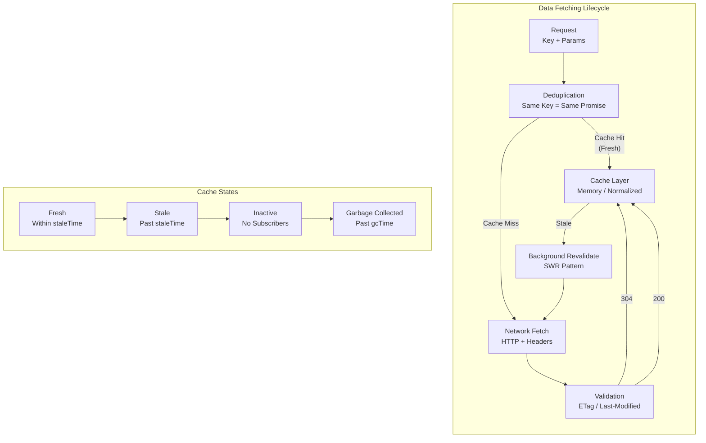
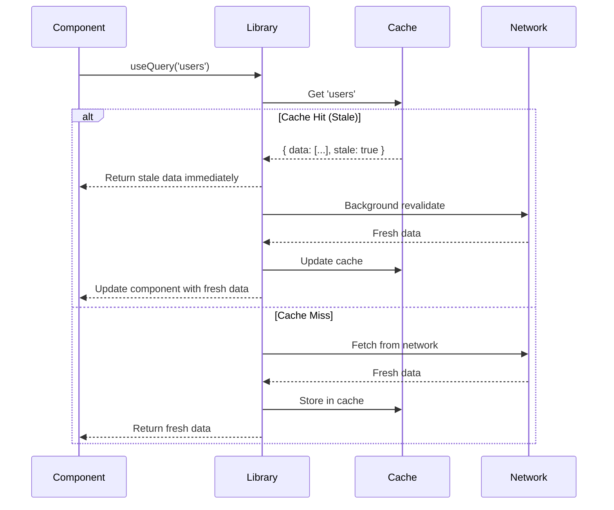

# Frontend Data Fetching Patterns and Caching

Patterns for fetching, caching, and synchronizing server state in frontend applications. Covers request deduplication, cache invalidation strategies, stale-while-revalidate mechanics, and library implementations.

<figure>



<figcaption>Data fetching lifecycle from request to cache management, showing deduplication, validation, and garbage collection states</figcaption>

</figure>

## Abstract

Frontend data fetching reduces to managing three tensions: **freshness vs latency** (serve stale data immediately or wait for network?), **correctness vs complexity** (normalize cache for consistency or accept duplication?), and **memory vs performance** (cache everything or evict aggressively?).

The core patterns:

- **Request deduplication**: Multiple components requesting the same data share one in-flight promise—prevents duplicate network calls and ensures consistency
- **Stale-while-revalidate**: Return cached data instantly, revalidate in background—users see content immediately, fresh data arrives silently
- **Cache normalization**: Store entities once by ID, reference everywhere—mutations update all views automatically, but adds complexity
- **Cache invalidation**: Tag-based or key-based invalidation after mutations—the hardest problem, usually solved by refetching
- **Garbage collection**: Inactive queries evicted after configurable timeout—prevents memory leaks without manual cleanup

Libraries differ in their defaults: TanStack Query uses `staleTime: 0` (always stale, always revalidate), SWR deduplicates within 1 second, Apollo normalizes by `__typename:id`, RTK Query uses tag-based invalidation without normalization.

## HTTP Caching Fundamentals

Understanding HTTP caching is foundational—application-level caching builds on top of (or bypasses) browser cache behavior defined in RFC 9111.

### Cache-Control Semantics

The `Cache-Control` header governs how browsers and intermediaries cache responses. Key directives from RFC 9111:

| Directive                  | Meaning                        | Use Case                                    |
| -------------------------- | ------------------------------ | ------------------------------------------- |
| `max-age=N`                | Response fresh for N seconds   | Static assets, API responses with known TTL |
| `no-cache`                 | Must revalidate before use     | Dynamic content that might change           |
| `no-store`                 | Never cache                    | Sensitive data, user-specific responses     |
| `private`                  | Only browser can cache         | User-specific data (not CDN-cacheable)      |
| `public`                   | Any cache can store            | Static assets, public API responses         |
| `s-maxage=N`               | Shared cache (CDN) TTL         | Different TTL for edge vs browser           |
| `stale-while-revalidate=N` | Serve stale while revalidating | RFC 5861 extension for async refresh        |

> **RFC 9111 replaced RFC 7234 in June 2022** with clarifications but no breaking changes. The stale-while-revalidate extension remains defined in RFC 5861.

### Conditional Requests and Validation

When cached content is stale, browsers send conditional requests to check if the cached version is still valid:

```
Client: GET /api/users/123
        If-None-Match: "abc123"

Server: 304 Not Modified
        (no body, use cached version)

-- or --

Server: 200 OK
        ETag: "def456"
        (new body, update cache)
```

**Validator types:**

- **Strong ETag** (`"abc123"`): Byte-for-byte identical. Required for range requests.
- **Weak ETag** (`W/"abc123"`): Semantically equivalent. Allows minor variations (whitespace, formatting).
- **Last-Modified**: Timestamp-based. Less precise, 1-second resolution.

**Design rationale**: ETags exist because Last-Modified has 1-second resolution—multiple changes within a second produce identical timestamps. ETags use content hashes or version numbers for exact change detection.

### Stale-While-Revalidate in HTTP

RFC 5861 defines the `stale-while-revalidate` Cache-Control extension:

```
Cache-Control: max-age=600, stale-while-revalidate=30
```

This means:

1. Response is fresh for 600 seconds
2. After 600s, serve stale content while revalidating in background
3. Stale serving allowed for up to 30 additional seconds
4. After 630s total, must wait for revalidation

**Why this matters**: The browser handles background revalidation automatically—no JavaScript required. However, application-level SWR (SWR library, TanStack Query) provides finer control and works with any response, not just those with proper headers.

## Request Deduplication

Request deduplication ensures multiple components requesting the same data produce exactly one network request. Without it, a page with 5 components using `useUser(123)` would fire 5 identical API calls.

### The Promise Memoization Pattern

The core pattern is simple: store the in-flight promise, return it to all callers:

```ts title="deduplication-pattern.ts" collapse={1-4, 20-25}
// Promise cache for in-flight requests
const inflightRequests = new Map<string, Promise<unknown>>()

// Deduplicated fetch function
async function fetchWithDeduplication<T>(key: string, fetcher: () => Promise<T>): Promise<T> {
  // Return existing promise if request in flight
  const existing = inflightRequests.get(key)
  if (existing) return existing as Promise<T>

  // Create new request and cache the promise
  const promise = fetcher().finally(() => {
    inflightRequests.delete(key) // Clean up after settlement
  })

  inflightRequests.set(key, promise)
  return promise
}
```

**Key insight**: The promise itself is cached, not the response. All callers await the same promise, so they all receive the result when it resolves—whether success or failure.

### Library Implementations

**TanStack Query (React Query v5)**:

- Deduplication is automatic and always-on for identical query keys
- Multiple hooks with the same key share one underlying promise
- No configurable deduplication window—requests dedupe while in-flight
- Option merging takes "most pessimistic" values when multiple components use different options (e.g., lowest `staleTime`)

**SWR (Vercel)**:

- Default 1-second deduplication window via `dedupingInterval`
- Requests within the window share the same promise
- Window is configurable per-hook or globally
- Focused on "eventual consistency" over strict deduplication

```ts title="swr-config.ts"
// SWR global configuration
<SWRConfig value={{ dedupingInterval: 2000 }}>
  {/* Requests within 2 seconds share the same promise */}
</SWRConfig>
```

**Apollo Client**:

- Request deduplication at the transport layer (HttpLink)
- Additionally, normalized cache means fetching the same entity from different queries returns the same object reference
- Deduplication is opt-out via `defaultOptions.watchQuery.fetchPolicy`

**RTK Query**:

- Deduplication per endpoint + argument combination
- Cache entry created on first subscription, shared by subsequent ones
- Reference counting: cache entry kept while ≥1 subscriber exists

### Edge Cases and Gotchas

**Race conditions with mutations**: If a mutation fires while a query is in-flight, the query result might be stale before it arrives. Libraries handle this differently:

- TanStack Query: `invalidateQueries` during mutation waits for in-flight queries to settle, then refetches
- SWR: `mutate(key)` cancels in-flight requests for that key
- Apollo: Mutation's `update` function runs after mutation completes, before query refetch

**Error propagation**: All callers receive the same error when a deduplicated request fails. This is usually desirable—if the API is down, all components should know. But it means one component's error boundary affects all components using the same data.

**Deduplication scope**: Most libraries deduplicate per-application instance. Server-side rendering creates a new query client per request to prevent data leaking between users.

## Application-Level Caching

Application caches store fetched data in memory, separate from the browser's HTTP cache. This enables instant UI updates, optimistic mutations, and fine-grained cache control.

### Cache Architecture Patterns

**Per-Query Cache (TanStack Query, SWR, RTK Query)**:

Each unique query key maps to one cache entry containing the response:

```
Cache Structure:
  ["users", 123] → { data: User, dataUpdatedAt: 1234567890 }
  ["users", 456] → { data: User, dataUpdatedAt: 1234567891 }
  ["posts", { authorId: 123 }] → { data: Post[], dataUpdatedAt: 1234567892 }
```

**Trade-off**: Simple to understand and implement. But if the same user appears in multiple queries, each query has its own copy. Updating user 123 in one query doesn't automatically update it in others.

**Normalized Cache (Apollo Client, Relay)**:

Entities stored once by ID, queries reference them:

```
Normalized Cache:
  User:123 → { id: 123, name: "Alice", email: "..." }
  User:456 → { id: 456, name: "Bob", email: "..." }
  ROOT_QUERY.users → [Reference(User:123), Reference(User:456)]
  ROOT_QUERY.posts({authorId:123}) → [Reference(Post:1), Reference(Post:2)]
```

**Trade-off**: Mutations automatically update all views of an entity—change `User:123` once, every query referencing it reflects the change. But normalization adds complexity: custom `keyFields` for unique identification, `merge` functions for pagination, handling of cache inconsistencies.

### Cache Invalidation Strategies

Cache invalidation is the hardest problem. The cache doesn't know when server data changes unless told.

**Time-based (TTL)**:

- Data considered stale after N seconds
- TanStack Query: `staleTime` (default 0—always stale)
- SWR: `refreshInterval` for polling
- Simple but imprecise—data might change immediately or not for hours

**Mutation-based**:

Invalidate related queries after mutations:

```ts title="tanstack-invalidation.ts" collapse={1-3, 12-15}
const queryClient = useQueryClient()

const mutation = useMutation({
  mutationFn: updateUser,
  onSuccess: () => {
    // Invalidate and refetch all user queries
    queryClient.invalidateQueries({ queryKey: ["users"] })
    // Or be specific
    queryClient.invalidateQueries({ queryKey: ["users", userId] })
  },
})
```

**Tag-based (RTK Query)**:

Queries declare what tags they provide; mutations declare what tags they invalidate:

```ts title="rtk-query-tags.ts" collapse={1-6, 22-30}
const api = createApi({
  baseQuery: fetchBaseQuery({ baseUrl: "/api" }),
  tagTypes: ["User", "Post"],
  endpoints: (builder) => ({
    getUsers: builder.query({
      query: () => "users",
      providesTags: (result) =>
        result ? [...result.map(({ id }) => ({ type: "User" as const, id })), "User"] : ["User"],
    }),
    updateUser: builder.mutation({
      query: ({ id, ...body }) => ({
        url: `users/${id}`,
        method: "PUT",
        body,
      }),
      invalidatesTags: (result, error, { id }) => [{ type: "User", id }],
    }),
  }),
})
```

**Design rationale for tags**: RTK Query chose tags over normalized cache because normalization is complex and error-prone. Tags provide explicit, predictable invalidation without the edge cases of automatic cache updates.

### Garbage Collection

Without garbage collection, caches grow unbounded. Libraries implement automatic cleanup:

**TanStack Query**:

- `gcTime` (formerly `cacheTime`): Time inactive query stays in memory (default 5 minutes)
- Query becomes "inactive" when no components subscribe
- After `gcTime`, entry removed and next request refetches from network
- `staleTime` and `gcTime` are independent—long `staleTime` doesn't extend `gcTime`

**SWR**:

- No explicit GC configuration
- Uses `dedupingInterval` and reference counting
- Cache entries cleaned when no active subscribers

**Apollo Client**:

- `gc()` method for manual garbage collection
- `cache.evict({ id: 'User:123' })` for specific entries
- `cache.gc()` removes unreachable objects after eviction

### Memory Limits and Constraints

Browser memory varies significantly:

| Device                    | Typical Heap Limit |
| ------------------------- | ------------------ |
| Desktop Chrome (64-bit)   | 4-16 GB            |
| Mobile Safari (iPhone 7+) | 1-2 GB             |
| Older mobile devices      | 645 MB - 1 GB      |

**Practical implications**:

- Large normalized caches can exhaust mobile memory
- Profile cache size in production with `performance.measureUserAgentSpecificMemory()`
- Consider LRU eviction for high-volume applications
- SSR requires request-scoped caches to prevent cross-user data leaks

## Stale-While-Revalidate Pattern

The stale-while-revalidate (SWR) pattern serves cached data immediately while fetching fresh data in the background. Users see content instantly; updates arrive silently.

### Pattern Mechanics



### Implementation Details

**TanStack Query's approach**:

```ts title="stale-time.ts" collapse={1-2}
const { data, isStale, isFetching } = useQuery({
  queryKey: ["users"],
  queryFn: fetchUsers,
  staleTime: 60_000, // Data fresh for 60 seconds
  refetchOnWindowFocus: true, // Revalidate when tab regains focus
  refetchOnMount: true, // Revalidate when component mounts
})

// isStale: true if past staleTime
// isFetching: true if background fetch in progress
// data: always the cached value (stale or fresh)
```

**Revalidation triggers**:

| Trigger           | TanStack Query         | SWR                     | Apollo         |
| ----------------- | ---------------------- | ----------------------- | -------------- |
| Mount             | `refetchOnMount`       | `revalidateOnMount`     | `fetchPolicy`  |
| Window focus      | `refetchOnWindowFocus` | `revalidateOnFocus`     | Manual         |
| Network reconnect | `refetchOnReconnect`   | `revalidateOnReconnect` | Manual         |
| Interval          | `refetchInterval`      | `refreshInterval`       | `pollInterval` |

**Why window focus matters**: Users frequently switch tabs. When they return, cached data might be minutes old. Focus-triggered revalidation ensures they see current data without explicit refresh.

### Optimistic Updates vs. SWR

SWR handles read consistency. Optimistic updates handle write latency:

```ts title="optimistic-update.ts" collapse={1-5, 30-35}
const queryClient = useQueryClient()

const mutation = useMutation({
  mutationFn: updateUser,
  // Optimistically update cache before mutation completes
  onMutate: async (newUser) => {
    // Cancel in-flight refetches
    await queryClient.cancelQueries({ queryKey: ["users", newUser.id] })

    // Snapshot current value for rollback
    const previousUser = queryClient.getQueryData(["users", newUser.id])

    // Optimistically update
    queryClient.setQueryData(["users", newUser.id], newUser)

    return { previousUser }
  },
  // Rollback on error
  onError: (err, newUser, context) => {
    queryClient.setQueryData(["users", newUser.id], context?.previousUser)
  },
  // Refetch after success to ensure consistency
  onSettled: () => {
    queryClient.invalidateQueries({ queryKey: ["users"] })
  },
})
```

**Design trade-off**: Optimistic updates make UI feel instant but require rollback logic. Some teams prefer waiting for mutation success—simpler code, slightly slower perceived performance.

## Pagination Patterns

Pagination affects both API design and cache structure. The choice between cursor and offset pagination has significant performance implications.

### Cursor vs. Offset Pagination

**Offset pagination**:

```
GET /api/posts?offset=100&limit=20
```

- Skip first N records, return next M
- Familiar UX: "Page 1, 2, 3..."
- **Performance degrades with offset**: Database must scan and discard first N rows
- **Consistency issues**: Insert/delete between pages causes duplicates or gaps

**Cursor pagination**:

```
GET /api/posts?cursor=eyJpZCI6MTIzfQ&limit=20
```

- Opaque pointer to position in dataset
- **O(1) performance**: Database seeks directly to cursor position
- **Consistent**: Insertions/deletions don't affect pagination
- **Trade-off**: No "jump to page 50" capability

**Performance comparison** (real-world benchmarks):

| Offset    | Query Time |
| --------- | ---------- |
| 0         | 5ms        |
| 10,000    | 50ms       |
| 100,000   | 500ms      |
| 1,000,000 | 5,000ms    |

Cursor pagination maintains ~5ms regardless of position.

### Infinite Scroll Implementation

```ts title="infinite-scroll.ts" collapse={1-5, 25-30}
import { useInfiniteQuery } from '@tanstack/react-query'

function useInfinitePosts() {
  return useInfiniteQuery({
    queryKey: ['posts'],
    queryFn: ({ pageParam }) => fetchPosts({ cursor: pageParam }),
    initialPageParam: undefined,
    getNextPageParam: (lastPage) => lastPage.nextCursor,
    getPreviousPageParam: (firstPage) => firstPage.prevCursor,
  })
}

// Usage with intersection observer for infinite scroll
function PostList() {
  const { data, fetchNextPage, hasNextPage, isFetchingNextPage } =
    useInfinitePosts()

  const loadMoreRef = useIntersectionObserver(() => {
    if (hasNextPage && !isFetchingNextPage) {
      fetchNextPage()
    }
  })

  return (
    <>
      {data?.pages.flatMap((page) => page.posts.map((post) => <Post key={post.id} post={post} />))}
      <div ref={loadMoreRef} />
    </>
  )
}
```

### Cache Structure for Paginated Data

**TanStack Query**: Pages stored as array in single cache entry:

```
["posts"] → {
  pages: [
    { posts: [...], nextCursor: "abc" },
    { posts: [...], nextCursor: "def" },
    { posts: [...], nextCursor: null }
  ],
  pageParams: [undefined, "abc", "def"]
}
```

**Apollo Client**: Requires custom `merge` function for pagination:

```ts title="apollo-pagination.ts" collapse={1-8, 20-25}
const cache = new InMemoryCache({
  typePolicies: {
    Query: {
      fields: {
        posts: {
          keyArgs: ["authorId"], // Different cache entries per author
          merge(existing = { edges: [] }, incoming) {
            return {
              ...incoming,
              edges: [...existing.edges, ...incoming.edges],
            }
          },
        },
      },
    },
  },
})
```

### Prefetching Next Page

Prefetch the next page before users reach the end:

```ts title="prefetch-next.ts" collapse={1-4}
const queryClient = useQueryClient()

// Prefetch when user is N items from the end
function usePrefetchNextPage(currentCursor: string, threshold = 5) {
  useEffect(() => {
    queryClient.prefetchInfiniteQuery({
      queryKey: ["posts"],
      queryFn: ({ pageParam }) => fetchPosts({ cursor: pageParam }),
      initialPageParam: currentCursor,
    })
  }, [currentCursor])
}
```

## Error Handling and Retries

Network requests fail. Robust data fetching requires systematic error handling and intelligent retry strategies.

### Retry Strategies

**Exponential backoff with jitter** (AWS recommended pattern):

```ts title="exponential-backoff.ts"
function calculateBackoff(attempt: number, baseDelay = 1000, maxDelay = 30000): number {
  // Exponential: 1s, 2s, 4s, 8s, 16s...
  const exponentialDelay = baseDelay * Math.pow(2, attempt)
  // Cap at maximum
  const cappedDelay = Math.min(exponentialDelay, maxDelay)
  // Add jitter (0-100% of delay) to prevent thundering herd
  const jitter = Math.random() * cappedDelay
  return cappedDelay + jitter
}
```

**Why jitter matters**: Without jitter, all clients retry at the same time after an outage, overwhelming the recovering server. Jitter spreads retries over time.

**Library defaults**:

| Library        | Default Retries        | Backoff                  |
| -------------- | ---------------------- | ------------------------ |
| TanStack Query | 3                      | Exponential (1s, 2s, 4s) |
| SWR            | 0 (no automatic retry) | N/A                      |
| Apollo         | 0 (link-level config)  | Configurable             |
| RTK Query      | 0                      | N/A                      |

### Retryable vs. Non-Retryable Errors

Not all errors should trigger retries:

| Status Code           | Retryable          | Reason                              |
| --------------------- | ------------------ | ----------------------------------- |
| 408 Request Timeout   | Yes                | Transient, likely succeeds on retry |
| 429 Too Many Requests | Yes (with backoff) | Rate limit, wait and retry          |
| 500-503 Server Error  | Yes                | Server issue, might recover         |
| 400 Bad Request       | No                 | Client error, won't change          |
| 401 Unauthorized      | No                 | Auth issue, retry won't help        |
| 403 Forbidden         | No                 | Permission denied                   |
| 404 Not Found         | No                 | Resource doesn't exist              |

```ts title="retry-condition.ts" collapse={1-3, 15-20}
const { data } = useQuery({
  queryKey: ["users"],
  queryFn: fetchUsers,
  retry: (failureCount, error) => {
    // Don't retry client errors
    if (error.status >= 400 && error.status < 500) {
      return false
    }
    // Retry server errors up to 3 times
    return failureCount < 3
  },
  retryDelay: (attemptIndex) => Math.min(1000 * 2 ** attemptIndex, 30000),
})
```

### Idempotency for Safe Retries

Retrying non-idempotent requests (POST, PATCH) risks duplicate side effects. The `Idempotency-Key` header (IETF draft) solves this:

```ts title="idempotency-key.ts" collapse={1-4, 15-20}
async function createPayment(amount: number) {
  const idempotencyKey = crypto.randomUUID()

  const response = await fetch("/api/payments", {
    method: "POST",
    headers: {
      "Content-Type": "application/json",
      "Idempotency-Key": idempotencyKey,
    },
    body: JSON.stringify({ amount }),
  })

  return response.json()
}
```

**How it works**:

1. Client generates unique key for each logical operation
2. Server stores key → response mapping
3. If request retried with same key, server returns stored response
4. Prevents duplicate charges, duplicate orders, etc.

**Widely supported**: Stripe, Adyen, and most payment gateways require idempotency keys for mutations.

### Circuit Breaker Pattern

Prevent cascading failures when a service is down:

```ts title="circuit-breaker.ts" collapse={1-5, 35-45}
class CircuitBreaker {
  private failures = 0
  private lastFailure: number | null = null
  private state: "closed" | "open" | "half-open" = "closed"

  constructor(
    private threshold = 5,
    private timeout = 30000,
  ) {}

  async execute<T>(fn: () => Promise<T>): Promise<T> {
    if (this.state === "open") {
      if (Date.now() - (this.lastFailure ?? 0) > this.timeout) {
        this.state = "half-open"
      } else {
        throw new Error("Circuit breaker is open")
      }
    }

    try {
      const result = await fn()
      this.onSuccess()
      return result
    } catch (error) {
      this.onFailure()
      throw error
    }
  }

  private onSuccess() {
    this.failures = 0
    this.state = "closed"
  }

  private onFailure() {
    this.failures++
    this.lastFailure = Date.now()
    if (this.failures >= this.threshold) {
      this.state = "open"
    }
  }
}
```

**States**:

- **Closed**: Normal operation, requests pass through
- **Open**: After N failures, fail immediately without network call
- **Half-Open**: After timeout, allow one test request

## Library Comparison

### TanStack Query (React Query v5)

**Architecture**: Per-query cache with automatic garbage collection.

**Key concepts**:

- `staleTime`: How long data considered fresh (default: 0)
- `gcTime`: How long inactive queries stay in cache (default: 5 minutes)
- Query keys: Array-based, supports complex objects
- Devtools: Excellent built-in debugging

**Strengths**: Intuitive API, great TypeScript support, framework-agnostic (React, Vue, Solid, Svelte).

**Limitations**: No normalized cache—same entity in different queries = different copies.

> **Version note**: v5 (released 2023) renamed `cacheTime` to `gcTime` for clarity. The v4 → v5 migration requires updating this option name.

### SWR (Vercel)

**Architecture**: Minimal, focused on stale-while-revalidate pattern.

**Key concepts**:

- `dedupingInterval`: Deduplication window (default: 2 seconds)
- `refreshInterval`: Polling interval
- Focus/reconnect revalidation by default
- Optimized for 60% fewer re-renders via selective state updates

**Strengths**: Tiny bundle (~4KB), simple API, good defaults for most cases.

**Limitations**: Less powerful than TanStack Query for complex scenarios (pagination, optimistic updates).

### Apollo Client

**Architecture**: Normalized cache with GraphQL-specific optimizations.

**Key concepts**:

- `InMemoryCache`: Flattened object store keyed by `__typename:id`
- `TypePolicies`: Custom cache behavior per type
- `fetchPolicy`: Controls cache vs. network priority
- Automatic cache updates after mutations

**Strengths**: Automatic consistency via normalization, powerful for GraphQL.

**Limitations**: GraphQL-specific, normalized cache complexity, larger bundle.

**Cache normalization example**:

```ts title="apollo-type-policy.ts" collapse={1-5, 20-25}
const cache = new InMemoryCache({
  typePolicies: {
    User: {
      // Use email as unique identifier instead of id
      keyFields: ["email"],
    },
    Product: {
      fields: {
        // Compute displayPrice from cached price
        displayPrice: {
          read(_, { readField }) {
            const price = readField<number>("price")
            return price ? `$${price.toFixed(2)}` : null
          },
        },
      },
    },
  },
})
```

### RTK Query

**Architecture**: Built on Redux Toolkit, tag-based cache invalidation.

**Key concepts**:

- `providesTags`: What data a query provides
- `invalidatesTags`: What tags a mutation invalidates
- Automatic refetch when tags invalidate
- Per-endpoint cache configuration

**Strengths**: Great for Redux apps, explicit invalidation logic, good TypeScript inference.

**Limitations**: Redux dependency, no normalized cache, more boilerplate than alternatives.

### Decision Matrix

| Factor            | TanStack Query            | SWR         | Apollo             | RTK Query     |
| ----------------- | ------------------------- | ----------- | ------------------ | ------------- |
| Bundle size       | ~13KB                     | ~4KB        | ~50KB              | ~15KB + Redux |
| Learning curve    | Low                       | Very low    | Medium             | Medium        |
| GraphQL           | Via plugin                | Via plugin  | Native             | Via plugin    |
| Normalization     | No                        | No          | Yes                | No            |
| DevTools          | Excellent                 | Good        | Excellent          | Good          |
| Framework support | React, Vue, Solid, Svelte | React       | React, iOS, Kotlin | React         |
| Best for          | Most REST/GraphQL apps    | Simple apps | GraphQL-heavy apps | Redux apps    |

## Conclusion

Frontend data fetching is a solved problem at the library level—TanStack Query, SWR, Apollo, and RTK Query handle the hard parts. The challenge is choosing the right tool and understanding its trade-offs.

**Key decisions**:

1. **Normalized vs. per-query cache**: Normalized (Apollo) guarantees consistency but adds complexity. Per-query (TanStack Query, SWR) is simpler but requires manual invalidation.

2. **Stale time configuration**: `staleTime: 0` (TanStack Query default) means constant background refetching. Increase it for data that changes rarely. Balance freshness against network cost.

3. **Pagination strategy**: Cursor pagination performs better at scale. Offset is acceptable for small datasets with jump-to-page requirements.

4. **Error handling**: Retry transient errors with exponential backoff and jitter. Use idempotency keys for mutations. Circuit breakers prevent cascading failures.

The common mistake is over-engineering: reaching for normalized caching when per-query suffices, implementing complex optimistic updates when showing a loading spinner is acceptable, or building custom solutions when libraries handle it better.

## Appendix

### Prerequisites

- Understanding of HTTP caching headers (`Cache-Control`, `ETag`)
- Familiarity with Promises and async/await
- Basic knowledge of React hooks (for library examples)
- Understanding of REST API pagination concepts

### Terminology

- **Stale data**: Cached data past its configured freshness time, still usable but should be revalidated
- **GC (Garbage Collection)**: Automatic removal of unused cache entries to free memory
- **Normalized cache**: Cache structure where entities are stored once by ID and referenced from multiple queries
- **Deduplication**: Combining multiple identical requests into a single network call
- **Idempotent**: Operation that produces the same result regardless of how many times it's executed
- **Circuit breaker**: Pattern that fails fast when a service is known to be down, preventing wasted requests

### Summary

- **HTTP caching** (RFC 9111, RFC 5861) provides browser-level caching with `Cache-Control`, conditional requests via ETags, and stale-while-revalidate for background refresh
- **Request deduplication** stores in-flight promises—multiple components with the same query key share one network request
- **Application caching** stores responses in memory; per-query cache is simpler, normalized cache ensures consistency
- **Cache invalidation** strategies: time-based (TTL), mutation-based (invalidate after write), tag-based (RTK Query's explicit dependency tracking)
- **Stale-while-revalidate** serves cached data immediately, revalidates in background—configurable via `staleTime` and revalidation triggers
- **Cursor pagination** outperforms offset at scale (O(1) vs O(N)); use offset only for small datasets with page-number requirements
- **Retry strategies**: exponential backoff with jitter for transient errors, idempotency keys for safe mutation retries, circuit breakers for cascading failure prevention

### References

**Specifications**

- [RFC 9111 - HTTP Caching](https://www.rfc-editor.org/rfc/rfc9111.html) - Authoritative HTTP cache semantics (replaced RFC 7234)
- [RFC 5861 - HTTP Cache-Control Extensions](https://datatracker.ietf.org/doc/html/rfc5861) - stale-while-revalidate and stale-if-error extensions
- [RFC 9110 - HTTP Semantics](https://datatracker.ietf.org/doc/html/rfc9110) - Idempotent method definitions (GET, PUT, DELETE)
- [IETF Draft - Idempotency-Key Header](https://datatracker.ietf.org/doc/draft-ietf-httpapi-idempotency-key-header/) - Standardized idempotency key format

**Official Documentation**

- [TanStack Query Documentation](https://tanstack.com/query/latest) - Query concepts, caching, and mutations
- [SWR Documentation](https://swr.vercel.app/) - Performance optimizations and configuration
- [Apollo Client Cache Configuration](https://www.apollographql.com/docs/react/caching/cache-configuration) - Normalized cache and type policies
- [RTK Query Overview](https://redux-toolkit.js.org/rtk-query/overview) - Tag-based invalidation and cache behavior

**Implementation References**

- [AWS Builders Library - Timeouts, Retries, and Backoff](https://aws.amazon.com/builders-library/timeouts-retries-and-backoff-with-jitter/) - Exponential backoff with jitter patterns
- [MDN - HTTP Caching](https://developer.mozilla.org/en-US/docs/Web/HTTP/Caching) - Browser caching behavior
- [MDN - HTTP Conditional Requests](https://developer.mozilla.org/en-US/docs/Web/HTTP/Conditional_requests) - ETag and Last-Modified validation
