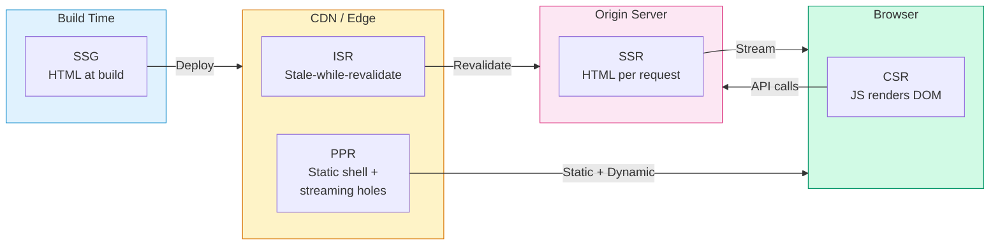

# Rendering Strategies: CSR, SSR, SSG, and ISR

Every page load is a sequence of decisions: where HTML is generated, when data is fetched, and how interactivity is attached. The four canonical rendering strategies — Client-Side Rendering (CSR), Server-Side Rendering (SSR), Static Site Generation (SSG), and Incremental Static Regeneration (ISR) — represent different trade-off points along axes of freshness, performance, cost, and complexity. Modern frameworks blur the boundaries further with per-route strategies, streaming, islands architecture, and Partial Prerendering (PPR). This article examines the mechanics, failure modes, and design reasoning behind each approach, then builds a decision framework for choosing between them.

<figure>



<figcaption>The rendering spectrum: where and when HTML is produced. Modern approaches like PPR and islands combine multiple strategies within a single page.</figcaption>
</figure>

## Abstract

Rendering strategies answer one question: **who generates the HTML, and when?**

- **CSR** ships a minimal HTML shell; the browser downloads JavaScript, fetches data, and builds the DOM. Fast Time to First Byte (TTFB), but First Contentful Paint (FCP) and Largest Contentful Paint (LCP) are blocked on JS execution. Ideal for authenticated, highly interactive applications where Search Engine Optimization (SEO) is irrelevant.
- **SSR** generates HTML on the server per request. FCP is fast (HTML arrives complete), but TTFB depends on server compute time. Streaming SSR (React 18's `renderToPipeableStream`) sends HTML in chunks, improving perceived performance. The hydration cost — re-executing component logic client-side to attach event handlers — is the central performance concern.
- **SSG** renders all pages at build time and deploys static files to a Content Delivery Network (CDN). Fastest TTFB and FCP of any strategy, but content is frozen until the next build. Build time scales linearly with page count, creating a practical ceiling.
- **ISR** applies stale-while-revalidate semantics to static pages: serve the cached version, trigger background regeneration after a configurable interval. It solves SSG's staleness without SSR's per-request compute, but introduces stale data windows and region-specific cache coherence challenges.

The real insight: modern production architectures rarely use a single strategy. Next.js App Router, Nuxt 3, and SvelteKit support per-route rendering selection. React Server Components (RSC), Partial Prerendering, and islands architecture (Astro, Fresh) compose static and dynamic rendering within a single page. The decision is no longer "which strategy" but "which strategy for which part of which page."

## The Rendering Timeline

Before comparing strategies, establish the sequence of events a browser performs on every navigation. Each rendering strategy optimizes different segments of this timeline.

| Event | What Happens | Key Metric |
| --- | --- | --- |
| DNS + TCP + TLS | Connection setup | — |
| First byte arrives | Server responds with initial data | TTFB |
| First paint | Browser renders first pixels (background, nav shell) | FCP |
| Largest element visible | Hero image, main heading, or primary content block renders | LCP |
| Page becomes interactive | Event handlers attached, input responsive | Time to Interactive (TTI) |
| Layout stabilizes | No more unexpected shifts | Cumulative Layout Shift (CLS) |

TTFB is a server-side concern. FCP and LCP depend on what the initial HTML contains. TTI depends on how much JavaScript must execute before the page responds to input. CLS depends on whether the rendered layout matches the final layout.

Each rendering strategy makes different bets on which metrics to prioritize.

## Client-Side Rendering

CSR defers all rendering to the browser. The server returns a minimal HTML document — typically an empty `<div id="root"></div>` — and one or more JavaScript bundles. The browser downloads and executes the JS, which fetches data from APIs and constructs the DOM.

### Mechanics

1. Browser receives a ~1 KB HTML shell with `<script>` tags
2. JS bundles download (often 200-500 KB gzipped for a production Single-Page Application (SPA))
3. Framework initializes, router resolves the current URL
4. Data fetching begins (API calls to backend services)
5. Components render into the DOM
6. Page becomes interactive

Steps 2-5 happen sequentially. The user sees a blank screen (or a loading spinner) until step 5 completes.

### Performance Characteristics

| Metric | CSR Impact | Why |
| --- | --- | --- |
| TTFB | Excellent (< 50ms) | Static HTML shell served from CDN |
| FCP | Poor (1-3s typical) | Blocked on JS download + parse + execute |
| LCP | Poor (2-5s typical) | Blocked on JS + API response + render |
| TTI | Poor to moderate | Same JS that renders also attaches handlers |
| CLS | Risk of high | Layout shifts when data arrives after initial render |

### The JS Bundle Problem

CSR performance is dominated by JavaScript payload size. Every dependency added to the bundle delays FCP linearly. Code splitting mitigates this: frameworks like React (via `React.lazy` and dynamic `import()`) and Vue (via async components) split the bundle by route, so only the code for the current page downloads initially.

```ts title="route-based-splitting.tsx" collapse={1-3, 11-20}
import { lazy, Suspense } from 'react';
import { Routes, Route } from 'react-router-dom';

// Each route loads its own chunk — only the active route's JS downloads
const Dashboard = lazy(() => import('./pages/Dashboard'));
const Settings = lazy(() => import('./pages/Settings'));

function App() {
  return (
    <Suspense fallback={<Skeleton />}>
      <Routes>
        <Route path="/dashboard" element={<Dashboard />} />
        <Route path="/settings" element={<Settings />} />
      </Routes>
    </Suspense>
  );
}
```

Even with splitting, the framework runtime itself (React ~45 KB, Vue ~33 KB, Angular ~130 KB gzipped) must download before anything renders.

### SEO Limitations

Googlebot executes JavaScript, but with caveats:

- **Two-phase indexing**: Google crawls HTML first, then queues pages for JS rendering in a separate "wave." The delay between waves can be hours to days.
- **Render budget**: Google allocates finite compute to render JS. Complex SPAs with heavy client-side logic may not render fully.
- **Other crawlers**: Bing, social media previets (Open Graph), and most bots do not execute JavaScript at all.

Workarounds exist — dynamic rendering (serving pre-rendered HTML to bots), prerendering services (Prerender.io, Rendertron) — but they add operational complexity and create divergence between what users and crawlers see.

### When CSR is the Right Choice

- **Authenticated applications**: Dashboards, admin panels, internal tools where SEO is irrelevant and every page requires user-specific data
- **Highly interactive UIs**: Real-time collaboration tools, design editors, trading terminals where the application is essentially a desktop app in a browser
- **Offline-capable PWAs**: Applications using Service Workers where the shell must cache independently of content

### When CSR Fails

- **Content-heavy sites** needing SEO (blogs, e-commerce, marketing pages)
- **Low-powered devices**: Phones with limited CPU budget stall on large JS bundles
- **Poor networks**: 3G connections turn a 500 KB bundle into a 10+ second blank screen

## Server-Side Rendering

SSR generates complete HTML on the server for each request. The browser receives a fully-formed page, renders it immediately, then "hydrates" it with JavaScript to make it interactive.

### Traditional SSR (Blocking)

In the traditional model, the server executes all component logic, resolves all data dependencies, and sends a complete HTML string. React's `renderToString()` and Vue's `renderToString()` follow this pattern.

The problem: `renderToString` is synchronous and blocking. If a component needs to fetch data from a database or API, the entire response waits. A single slow data source blocks the entire page.

```ts title="traditional-ssr.ts" collapse={1-4, 14-18}
import express from 'express';
import { renderToString } from 'react-dom/server';
import App from './App';

app.get('*', async (req, res) => {
  // All data must resolve before any HTML is sent
  const data = await fetchAllPageData(req.url); // Blocks here
  const html = renderToString(<App data={data} />);
  res.send(`
    <!DOCTYPE html>
    <html><body>
      <div id="root">${html}</div>
      <script src="/bundle.js"></script>
    </body></html>
  `);
});
```

### Streaming SSR

React 18 introduced `renderToPipeableStream` (Node.js) and `renderToReadableStream` (Web Streams API), fundamentally changing the SSR model. Instead of waiting for all data, the server streams HTML as components resolve.

Combined with `<Suspense>` boundaries, streaming SSR sends the static shell immediately, then streams in dynamic sections as their data arrives:

1. Server sends `<html>`, `<head>`, navigation, and static content immediately
2. Dynamic sections render a fallback (e.g., skeleton) wrapped in a Suspense boundary
3. As each data dependency resolves, the server streams the completed HTML with an inline `<script>` that swaps the fallback

```ts title="streaming-ssr.ts" collapse={1-5}
import { renderToPipeableStream } from 'react-dom/server';
import App from './App';

app.get('*', (req, res) => {
  const { pipe } = renderToPipeableStream(<App url={req.url} />, {
    // Shell is sent immediately — includes everything outside Suspense boundaries
    bootstrapScripts: ['/bundle.js'],
    onShellReady() {
      res.statusCode = 200;
      res.setHeader('Content-Type', 'text/html');
      pipe(res); // Starts streaming; Suspense fallbacks stream in as data resolves
    },
    onError(err) {
      console.error(err);
      res.statusCode = 500;
      res.end('Server error');
    },
  });
});
```

This approach decouples TTFB from the slowest data source. The browser can begin parsing and rendering the shell while dynamic content streams in.

> **Prior to React 18:** SSR was synchronous (`renderToString`). The entire page had to resolve before any HTML was sent. This made TTFB directly proportional to the slowest data dependency. Streaming SSR was available via `renderToNodeStream` (React 16), but without Suspense integration, it couldn't handle async data boundaries.

### The Hydration Problem

After the browser receives server-rendered HTML and displays it, the page looks complete but is inert — clicks, form inputs, and other interactions do nothing. Hydration is the process of re-executing component logic client-side to attach event handlers and reconcile the server-rendered DOM with the client-side component tree.

**Full hydration** (React's `hydrateRoot`) walks the entire component tree, executing every component function, re-running hooks, and attaching event listeners. The browser already has the correct DOM, so React doesn't create new elements — it "adopts" the existing ones. But the CPU cost of executing all component logic remains.

For a complex page with hundreds of components, hydration can take 500ms-2s on mobile devices. During this time, the page is visible but non-interactive — a problem known as the "uncanny valley."

**Selective hydration** (React 18) uses Suspense boundaries to hydrate sections independently. If a user clicks a section that hasn't hydrated yet, React prioritizes hydrating that section. This doesn't reduce total hydration work, but it prioritizes the parts the user cares about.

### Edge SSR

Running SSR at the edge (Cloudflare Workers, Vercel Edge Functions, Deno Deploy) reduces TTFB by generating HTML geographically close to the user. The trade-off: edge runtimes have constrained execution environments (no Node.js APIs, limited CPU time, restricted memory) and cannot access backend databases directly — they typically call origin APIs, which may negate the latency benefit.

Edge SSR works well when:
- The page depends only on request data (cookies, headers, URL params) and cached API responses
- The rendering logic is lightweight (no heavy computation)
- The origin API is fast or the data can be cached at the edge

Edge SSR struggles when:
- Pages need database queries (the edge-to-origin round trip can exceed the edge TTFB savings)
- Rendering is CPU-intensive (edge workers typically have 10-50ms CPU limits)

### Performance Characteristics

| Metric | SSR Impact | Why |
| --- | --- | --- |
| TTFB | Moderate (100-500ms) | Server must generate HTML; streaming mitigates |
| FCP | Good (fast after TTFB) | Complete HTML arrives; browser renders immediately |
| LCP | Good | Content is in the initial HTML |
| TTI | Moderate to poor | Hydration blocks interactivity |
| CLS | Low | Server-rendered layout matches final layout |

### Cost Model

SSR has per-request compute cost. A page that receives 1M requests/day needs a server (or serverless function) executing rendering logic 1M times. Caching SSR output (with `Cache-Control` or CDN caching) converts SSR into de-facto SSG for cacheable responses, but invalidation becomes the new challenge.

## Static Site Generation

SSG renders every page at build time. The output is plain HTML, CSS, and JavaScript files deployed to a CDN. No server-side computation happens at request time.

### Mechanics

1. At build time, the framework fetches all data (from CMS, database, APIs, filesystem)
2. Every page is rendered to a complete HTML file
3. The output directory is deployed to a CDN
4. Every request is served directly from the CDN edge — no origin computation

### Performance Characteristics

| Metric | SSG Impact | Why |
| --- | --- | --- |
| TTFB | Excellent (< 50ms) | CDN edge response, no compute |
| FCP | Excellent | Complete HTML served immediately |
| LCP | Excellent | Content in initial HTML, CDN-delivered |
| TTI | Depends on JS payload | Hydration still required for interactive components |
| CLS | Minimal | Layout determined at build time |

SSG delivers the best Core Web Vitals of any rendering strategy for content that doesn't change between requests.

### The Build Time Ceiling

Build time scales linearly with page count. A 10-page marketing site builds in seconds. A 100,000-page e-commerce catalog takes minutes to hours, depending on data fetching and rendering complexity.

Real-world examples:
- A documentation site with 5,000 pages: 2-5 minute builds
- An e-commerce site with 100,000 product pages: 30-60+ minute builds
- A news site rebuilding on every article update: builds become the bottleneck

This creates operational problems: deploy frequency is limited by build time, and content updates have high latency (change content → trigger build → wait → deploy).

### Deferred Static Generation

Several frameworks address the build time problem by generating only popular pages at build time and deferring the rest to the first request:

- **Next.js**: `dynamicParams: true` (App Router) or `fallback: true` / `fallback: 'blocking'` (Pages Router) generates pages on-demand
- **Astro**: All pages are built at build time by default; deferred generation isn't the primary model
- **Netlify DPR (Distributed Persistent Rendering)**: Build critical pages, generate the rest on first request, cache permanently

The first visitor to a deferred page experiences SSR-like latency. All subsequent visitors get CDN-cached static response.

### When SSG Fails

- **Personalized content**: User-specific data (recommendations, dashboards) can't be pre-rendered
- **High-frequency updates**: Content that changes every minute makes SSG impractical — rebuilds can't keep up
- **Large catalogs with frequent changes**: 100K pages where 1% change daily means rebuilding 1,000 pages per day at minimum
- **Real-time data**: Stock prices, live scores, inventory counts require request-time data

## Incremental Static Regeneration

ISR, introduced by Next.js, applies stale-while-revalidate (SWR) semantics to static pages. Pages are generated at build time (like SSG), but individual pages can be regenerated in the background after a configurable time interval.

### Mechanics

1. Page is pre-rendered at build time (like SSG)
2. A `revalidate` interval is set (e.g., 60 seconds)
3. Requests within the interval are served from cache (static response)
4. The first request after the interval triggers background regeneration
5. The requesting visitor still receives the stale page
6. Subsequent visitors get the freshly generated page

```ts title="isr-config.ts" collapse={1-2, 10-12}
// Next.js App Router — page.tsx
import { db } from '@/lib/db';

// This page is statically generated with a 60-second revalidation window
export const revalidate = 60;

export default async function ProductPage({ params }: { params: { id: string } }) {
  const product = await db.product.findUnique({ where: { id: params.id } });
  return <ProductDetail product={product} />;
}
```

### On-Demand Revalidation

Time-based ISR has an inherent staleness window: content can be up to `revalidate` seconds old. On-demand revalidation (introduced in Next.js 12.2) allows programmatic cache invalidation via API:

```ts title="on-demand-revalidation.ts" collapse={1-3}
// Next.js App Router — API route or Server Action
import { revalidatePath, revalidateTag } from 'next/cache';

// Revalidate a specific page
revalidatePath('/products/42');

// Revalidate all pages using a specific data tag
revalidateTag('products');
```

With on-demand ISR, the CMS webhook fires on content update → calls the revalidation API → the page regenerates immediately. Staleness drops from the `revalidate` interval to the time it takes to regenerate the page (typically < 1s).

### ISR vs. CDN Cache Invalidation

ISR is conceptually similar to CDN cache invalidation with `stale-while-revalidate`, but differs in critical ways:

| Aspect | ISR | CDN Cache + SWR |
| --- | --- | --- |
| What is cached | Pre-rendered HTML page | Any HTTP response |
| Who generates fresh content | Next.js server (re-executes page component) | Origin server (any backend) |
| Invalidation granularity | Per-page or per-tag | Per-URL or per-cache-tag |
| Cache coherence | Single-region regeneration, then CDN propagation | Depends on CDN (purge-all or targeted) |
| Framework coupling | Next.js specific | Framework-agnostic |

### Limitations

- **Stale data window**: With time-based ISR, the first visitor after expiry always gets stale content. On-demand ISR reduces but doesn't eliminate this — regeneration takes time.
- **Single-region regeneration**: In multi-region deployments, regeneration happens on one server. Other regions serve stale content until CDN cache propagates. This can mean 30-60 seconds of cross-region staleness.
- **No partial page regeneration**: ISR regenerates the entire page. If only a sidebar widget's data changes, the whole page rebuilds.
- **Framework lock-in**: ISR is a Next.js concept. Other frameworks implement similar patterns differently (Nuxt's `routeRules` with SWR, SvelteKit's `config.isr`).

### Performance Characteristics

| Metric | ISR Impact | Why |
| --- | --- | --- |
| TTFB | Excellent (CDN hit) or moderate (cache miss) | Cached pages served from edge; misses hit origin |
| FCP | Excellent (cache hit) | Same as SSG when served from cache |
| LCP | Excellent (cache hit) | Pre-rendered HTML with content |
| TTI | Depends on JS payload | Same hydration cost as SSG |
| CLS | Minimal | Static HTML, stable layout |

## Hybrid and Modern Approaches

The four canonical strategies are now building blocks, not exclusive choices. Modern frameworks compose them at the route level or even within a single page.

### Per-Route Rendering (Next.js App Router, Nuxt 3, SvelteKit)

Next.js 13+ (App Router) determines rendering strategy per route segment:

- **Static by default**: Routes with no dynamic data are automatically SSG
- **Dynamic when needed**: Using `cookies()`, `headers()`, `searchParams`, or `noStore()` opts a route into SSR
- **ISR via `revalidate`**: Setting `export const revalidate = N` enables time-based ISR

This means a single application can have static marketing pages, ISR product listings, and fully dynamic user dashboards — each using the optimal strategy.

Nuxt 3 offers similar granularity via `routeRules` in `nuxt.config.ts`:

```ts title="nuxt-route-rules.ts" collapse={1-2}
// nuxt.config.ts
export default defineNuxtConfig({
  routeRules: {
    '/': { prerender: true },               // SSG
    '/products/**': { swr: 3600 },           // ISR (1-hour revalidation)
    '/dashboard/**': { ssr: true },          // SSR per request
    '/api/**': { cors: true, swr: false },   // No caching
  },
});
```

### React Server Components

React Server Components (RSC), stable in Next.js 13+ App Router, introduce a component-level rendering boundary. Server Components execute only on the server — their code never ships to the browser.

**Key design decisions:**

- **Why server-only execution**: Eliminates JS bundle cost for components that don't need interactivity. A complex data-fetching component with heavy dependencies (date formatting, markdown parsing, database clients) contributes zero bytes to the client bundle.
- **What it optimizes**: Bundle size, data fetching latency (server-side data access is faster than client-side API calls), and security (sensitive logic stays on the server).
- **What it sacrifices**: Server Components cannot use `useState`, `useEffect`, event handlers, or browser APIs. Interactive portions must be Client Components (marked with `'use client'`).

RSC changes the rendering model from "render everything, hydrate everything" to "render data components on the server, only ship interactive components to the client."

> **Prior to RSC (React pre-18):** The entire component tree was shipped to the client as JavaScript, even components that only fetched and displayed data. This meant a product listing component that simply queried a database and rendered a table still contributed its full code — including all dependencies — to the client bundle.

### Partial Prerendering

Partial Prerendering (PPR), introduced experimentally in Next.js 14 and progressing in Next.js 15, combines SSG and SSR within a single page:

1. The static shell (header, footer, layout, static content) is pre-rendered at build time
2. Dynamic "holes" (user-specific content, real-time data) are marked with Suspense boundaries
3. At request time, the static shell is served instantly from the CDN
4. Dynamic holes stream in from the server as their data resolves

This eliminates the binary choice between static and dynamic. A product page can have a static product description (SSG) with a dynamic price, inventory count, and personalized recommendations (SSR streaming) — all in a single HTTP response.

```tsx title="ppr-page.tsx" collapse={1-4, 18-21}
import { Suspense } from 'react';
import { ProductInfo } from './ProductInfo';  // Static — pre-rendered at build
import { DynamicPrice } from './DynamicPrice'; // Dynamic — streams at request time
import { Recommendations } from './Recommendations';

export default function ProductPage({ params }: { params: { id: string } }) {
  return (
    <main>
      {/* Static shell — served from CDN */}
      <ProductInfo id={params.id} />

      {/* Dynamic holes — stream from server */}
      <Suspense fallback={<PriceSkeleton />}>
        <DynamicPrice id={params.id} />
      </Suspense>
      <Suspense fallback={<RecommendationsSkeleton />}>
        <Recommendations id={params.id} />
      </Suspense>
    </main>
  );
}
```

PPR's design reasoning: the static portions of most pages vastly outweigh the dynamic portions. By pre-rendering the majority and streaming the minority, PPR achieves SSG-like TTFB with SSR-like freshness for the parts that need it.

### Islands Architecture

Islands architecture, pioneered by Astro and implemented in Fresh (Deno), takes a different approach: the page is static HTML by default, and interactive components ("islands") are explicitly opted into client-side JavaScript.

**Key difference from React/Next.js**: In the React model, everything is a component that hydrates. You opt out of interactivity with Server Components. In the islands model, nothing hydrates by default. You opt into interactivity per component.

```astro title="astro-island.astro"
---
// This runs at build time only — no JS shipped
import StaticHeader from '../components/StaticHeader.astro';
import InteractiveSearch from '../components/InteractiveSearch.tsx';
---

<!-- Static HTML — zero JS -->
<StaticHeader />

<!-- Interactive island — only this component's JS ships to the browser -->
<InteractiveSearch client:visible />
```

Astro's `client:*` directives control when an island hydrates:
- `client:load` — hydrate immediately on page load
- `client:idle` — hydrate when the browser is idle (`requestIdleCallback`)
- `client:visible` — hydrate when the component enters the viewport (Intersection Observer)
- `client:media="(max-width: 768px)"` — hydrate when a media query matches

This granularity means a content-heavy page with one search widget ships only the search widget's JavaScript — not an entire framework runtime for hydrating a static header and footer.

### Edge-First Rendering

Edge computing platforms (Cloudflare Workers, Deno Deploy, Vercel Edge Runtime) shift rendering to CDN nodes closest to the user. The design reasoning: even with fast SSR, a 200ms round trip to a centralized origin server limits TTFB. Edge rendering reduces this to 10-30ms.

Constraints of edge environments:
- **Limited runtime**: No full Node.js — Web Standards APIs only (Fetch, Streams, Web Crypto)
- **CPU limits**: Typically 10-50ms CPU time per request (Cloudflare Workers default: 10ms on free plan, 30ms paid)
- **No persistent connections**: No long-lived database connections; use HTTP APIs or connection poolers
- **Cold starts**: Cloudflare Workers: < 5ms (V8 isolates). Lambda@Edge: 50-200ms.

Edge rendering is optimal for personalization based on request data (geolocation, cookies, A/B testing) combined with cached content.

## Decision Framework

No single rendering strategy is universally optimal. The choice depends on five factors:

### Factor Matrix

| Factor | CSR | SSR | SSG | ISR | PPR |
| --- | --- | --- | --- | --- | --- |
| **Content freshness** | Real-time | Real-time | Build-time | Near real-time | Real-time (dynamic holes) |
| **SEO** | Poor | Excellent | Excellent | Excellent | Excellent |
| **TTFB** | Excellent | Moderate | Excellent | Excellent (cache hit) | Excellent |
| **LCP** | Poor | Good | Excellent | Excellent (cache hit) | Excellent |
| **Server cost** | None (static host) | Per-request compute | Build-time only | Occasional revalidation | Static + streaming |
| **Personalization** | Full | Full | None | None (page-level) | Dynamic holes only |
| **Scaling** | CDN | Horizontal scaling | CDN | CDN + origin | CDN + origin (minimal) |
| **Complexity** | Low | Moderate | Low | Moderate | High |

### Decision by Use Case

**Marketing / content site** (blog, docs, landing pages):
→ **SSG** or **SSG + islands** (Astro). Content is known at build time, SEO is critical, interactivity is minimal. Build times are manageable for hundreds to low thousands of pages.

**E-commerce** (product catalog, search, checkout):
→ **ISR** for product pages (content changes infrequently but catalog is large), **SSR** for search results and checkout (personalized, real-time inventory), or **PPR** to combine static product info with dynamic pricing.

**SaaS dashboard** (analytics, admin panels):
→ **CSR** or **SSR**. Every page is personalized and requires authentication. SSR improves perceived performance; CSR is simpler if SEO doesn't matter.

**News / media site** (breaking news, frequently updated):
→ **ISR with on-demand revalidation** or **SSR with CDN caching**. Content changes frequently, SEO is critical, stale-while-revalidate keeps TTFB low while maintaining freshness.

**Hybrid application** (public pages + authenticated sections):
→ **Per-route strategy**. Static marketing pages (SSG), ISR for catalog, SSR for authenticated routes. Next.js App Router, Nuxt 3, and SvelteKit all support this pattern natively.

## Conclusion

The rendering strategy landscape has evolved from a binary choice (server vs. client) to a composable spectrum. The four canonical approaches — CSR, SSR, SSG, ISR — remain the foundational mental model, but production architectures increasingly compose them:

- **Per-route**: Different strategies for different URL patterns within one application
- **Per-component**: Server Components keep data-fetching logic off the client; Client Components provide interactivity
- **Per-section**: PPR and islands pre-render the static majority and stream or hydrate the dynamic minority

The practical decision framework is straightforward: start with the simplest strategy that meets your freshness, SEO, and performance requirements. Use SSG for anything that can be built ahead of time. Layer in ISR for content that changes periodically. Reserve SSR for truly dynamic, personalized responses. Apply CSR only for sections that need full client-side interactivity.

Avoid over-engineering the initial choice. Migration between strategies within modern frameworks is often a configuration change (adding `revalidate` to convert SSG to ISR, or wrapping a section in `<Suspense>` to enable streaming). The cost of starting simple and upgrading is almost always lower than the cost of premature complexity.

## Appendix

### Prerequisites

- HTTP caching model (`Cache-Control`, `stale-while-revalidate`)
- Browser rendering pipeline (parsing, layout, paint, compositing)
- Core Web Vitals (TTFB, FCP, LCP, TTI, CLS)
- React component model (for RSC and hydration sections)
- CDN architecture (edge nodes, origin server, cache purge)

### Terminology

| Term | Definition |
| --- | --- |
| **CSR** | Client-Side Rendering — browser downloads JS and constructs the DOM |
| **SSR** | Server-Side Rendering — server generates HTML per request |
| **SSG** | Static Site Generation — all pages rendered at build time |
| **ISR** | Incremental Static Regeneration — static pages with background revalidation |
| **PPR** | Partial Prerendering — static shell with streaming dynamic holes |
| **RSC** | React Server Components — components that execute only on the server |
| **Hydration** | Process of attaching event handlers and state to server-rendered HTML |
| **TTFB** | Time to First Byte — time from request to first byte of response |
| **FCP** | First Contentful Paint — time to first visible content |
| **LCP** | Largest Contentful Paint — time to largest visible element |
| **TTI** | Time to Interactive — time until page responds to input |
| **CLS** | Cumulative Layout Shift — measure of visual stability |
| **SWR** | Stale-While-Revalidate — caching pattern that serves stale data while refreshing |
| **DPR** | Distributed Persistent Rendering — Netlify's approach to deferred static generation |

### Summary

- **CSR** ships a JS-only shell; fast TTFB but poor FCP/LCP. Best for authenticated, interactive applications where SEO doesn't matter.
- **SSR** generates HTML per request; fast FCP but TTFB depends on server compute. Streaming SSR (React 18+) decouples TTFB from the slowest data source.
- **SSG** pre-renders at build time; best Core Web Vitals but content is frozen. Build time scales linearly with page count.
- **ISR** adds stale-while-revalidate semantics to SSG; near-real-time freshness without per-request cost. On-demand revalidation minimizes staleness.
- **Modern approaches** (PPR, islands, RSC) compose strategies within a single page, eliminating the binary choice between static and dynamic.
- **Start simple**: Use the least complex strategy that meets freshness and SEO needs. Migration between strategies is inexpensive in modern frameworks.

### References

- [HTML Living Standard — Parsing](https://html.spec.whatwg.org/multipage/parsing.html) — How browsers parse and render HTML documents
- [React 18 — renderToPipeableStream API](https://react.dev/reference/react-dom/server/renderToPipeableStream) — Streaming SSR API documentation
- [React — Server Components](https://react.dev/reference/rsc/server-components) — React Server Components specification and usage
- [Next.js — Rendering](https://nextjs.org/docs/app/building-your-application/rendering) — Per-route rendering strategies in App Router
- [Next.js — Incremental Static Regeneration](https://nextjs.org/docs/app/building-your-application/data-fetching/incremental-static-regeneration) — ISR mechanics and on-demand revalidation
- [Next.js — Partial Prerendering](https://nextjs.org/docs/app/building-your-application/rendering/partial-prerendering) — PPR architecture and usage
- [Astro — Islands Architecture](https://docs.astro.build/en/concepts/islands/) — Islands architecture and client directives
- [web.dev — Rendering on the Web](https://web.dev/articles/rendering-on-the-web) — Google's overview of rendering patterns and their performance characteristics
- [web.dev — Core Web Vitals](https://web.dev/articles/vitals) — Metrics definitions and measurement methodology
- [Nuxt 3 — Route Rules](https://nuxt.com/docs/guide/concepts/rendering#route-rules) — Nuxt's per-route rendering configuration
- [Vercel — Understanding SSR, SSG, ISR and RSC](https://vercel.com/blog/understanding-react-server-components) — Vercel's explanation of modern rendering approaches
- [Patterns.dev — Rendering Patterns](https://www.patterns.dev/react/rendering-patterns/) — Comprehensive catalog of rendering patterns with visual explanations
