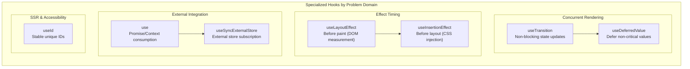

# React Hooks Advanced Patterns: Specialized Hooks and Composition

Advanced hook APIs, performance patterns, and composition techniques for concurrent React applications. Covers `useId`, `use`, `useLayoutEffect`, `useSyncExternalStore`, `useInsertionEffect`, `useDeferredValue`, and `useTransition`—hooks that solve specific problems the core hooks cannot.

<figure>



<figcaption>Specialized hooks grouped by the problem domain they address. Concurrent hooks optimize UI responsiveness; effect timing hooks control when code runs relative to browser paint; external integration hooks connect React to non-React state.</figcaption>
</figure>

## Abstract

These hooks exist because the core hooks (`useState`, `useEffect`, `useRef`) can't solve every problem. Each addresses a specific gap:

- **Concurrent rendering** (`useTransition`, `useDeferredValue`): React 18's concurrent features need APIs to mark updates as interruptible. Without them, expensive renders block user input.
- **Effect timing** (`useLayoutEffect`, `useInsertionEffect`): `useEffect` runs _after_ paint. Some code—DOM measurements, style injection—must run _before_ paint to avoid visual flicker.
- **External state** (`useSyncExternalStore`): Subscribing to external stores with `useEffect`/`useState` causes "tearing" in concurrent mode—different components see different store versions.
- **Async data** (`use`): React 19's `use` hook reads promises during render, integrating with Suspense without custom wrapper components.
- **Stable IDs** (`useId`): Server and client can generate IDs independently, causing hydration mismatches. `useId` uses component tree position to guarantee consistency.

The mental model: **core hooks are general-purpose; specialized hooks solve specific problems that arise from React's architecture (concurrent rendering, SSR, browser paint timing).**

## Concurrent Rendering Hooks

React 18 introduced concurrent rendering, where renders can be interrupted and resumed. Two hooks let you leverage this: `useTransition` marks state updates as non-blocking; `useDeferredValue` defers a value so expensive renders don't block urgent updates.

### useTransition: Non-Blocking State Updates

**Problem it solves**: Expensive state updates (tab switches, large list filtering) block user input. The UI becomes unresponsive while React renders.

**Design rationale**: Mark updates as "transitions"—low-priority work that can be interrupted if higher-priority updates (like typing) arrive. React keeps showing the old UI until the new one is ready.

```tsx title="useTransition-basic.tsx" collapse={1-3, 15-25}
import { useState, useTransition } from "react"

function TabContainer() {
  const [tab, setTab] = useState("about")
  const [isPending, startTransition] = useTransition()

  function selectTab(nextTab: string) {
    startTransition(() => {
      setTab(nextTab) // Low-priority update
    })
  }

  return (
    <div style={{ opacity: isPending ? 0.7 : 1 }}>
      <button onClick={() => selectTab("posts")}>Posts</button>
      <button onClick={() => selectTab("contact")}>Contact</button>
      {tab === "posts" && <SlowPostsTab />}
      {tab === "contact" && <ContactTab />}
    </div>
  )
}
```

**How it works**:

1. `startTransition(() => setState(...))` marks the update as non-blocking
2. React starts rendering with the new state in the background
3. If the user clicks elsewhere, React abandons the old render and starts fresh
4. `isPending` is `true` until all transition work completes

**React 19 async support**: Transitions can contain `await`:

```tsx title="useTransition-async.tsx" collapse={1-2}
// React 19+: async transitions
function SubmitButton({ onSubmit }: { onSubmit: () => Promise<void> }) {
  const [isPending, startTransition] = useTransition()

  return (
    <button
      disabled={isPending}
      onClick={() => {
        startTransition(async () => {
          await onSubmit()
          // State updates after await need another startTransition (current limitation)
        })
      }}
    >
      {isPending ? "Submitting..." : "Submit"}
    </button>
  )
}
```

**Edge cases and caveats**:

| Scenario                              | Behavior                                                                 |
| ------------------------------------- | ------------------------------------------------------------------------ |
| Multiple rapid transitions            | Batched together (may change in future React versions)                   |
| Text input in transition              | ❌ Breaks responsiveness—input value should update synchronously         |
| `setTimeout` inside `startTransition` | ❌ Doesn't work—the `setState` inside timeout isn't marked as transition |
| Error in transition                   | Triggers nearest Error Boundary                                          |
| `startTransition` identity            | Stable—safe to omit from `useEffect` dependencies                        |

**When to use vs. not use**:

| Use For                                 | Don't Use For                                               |
| --------------------------------------- | ----------------------------------------------------------- |
| Tab switches, route navigation          | Controlled text inputs                                      |
| Large list filtering                    | Updates that must be immediate                              |
| Form submission with async              | When you need exact timing control                          |
| Any update where stale UI is acceptable | Outside React components (use standalone `startTransition`) |

### useDeferredValue: Defer Non-Critical Values

**Problem it solves**: A value changes rapidly (typing), but rendering with the new value is expensive (filtering thousands of items). You want the input to stay responsive while the expensive render happens in the background.

**Design rationale**: "Lag" behind the actual value. React first renders with the old deferred value (fast), then re-renders in the background with the new value (can be interrupted).

```tsx title="useDeferredValue-search.tsx" collapse={1-4, 16-25}
import { useState, useDeferredValue, useMemo } from "react"

function SearchPage({ items }: { items: Item[] }) {
  const [query, setQuery] = useState("")
  const deferredQuery = useDeferredValue(query)
  const isStale = query !== deferredQuery

  const filteredItems = useMemo(() => items.filter((item) => item.name.includes(deferredQuery)), [items, deferredQuery])

  return (
    <>
      <input value={query} onChange={(e) => setQuery(e.target.value)} />
      <div style={{ opacity: isStale ? 0.5 : 1 }}>
        <ItemList items={filteredItems} />
      </div>
    </>
  )
}
```

**How the two-phase render works**:

1. User types "ab" (query = "ab", but deferredQuery = "a" from before)
2. React renders with deferredQuery = "a" (fast, uses cached filter result)
3. React starts background render with deferredQuery = "ab"
4. If user types "abc" before background completes, React abandons that render and starts fresh
5. When background render commits, both values match—`isStale` becomes `false`

**React 19 `initialValue` parameter**:

```tsx title="useDeferredValue-initial.tsx"
// React 19: provide initial value for first render
const deferredQuery = useDeferredValue(query, "") // "" on initial render
```

Without `initialValue`, the first render uses the actual value (no deferral possible—there's no "previous" value).

**Comparison with debouncing/throttling**:

| Aspect                 | useDeferredValue           | Debouncing       |
| ---------------------- | -------------------------- | ---------------- |
| Fixed delay            | No—adapts to device speed  | Yes              |
| Interruptible          | Yes—abandons stale renders | No               |
| Integration with React | Deep (concurrent features) | Manual           |
| Use case               | Rendering bottlenecks      | Network requests |

**Edge cases and caveats**:

- **Pass primitives or memoized objects**: `useDeferredValue({ x: 1 })` creates a new object each render, causing unnecessary background work
- **Inside `startTransition`**: Deferred value always equals actual value (update is already deferred)
- **No network request prevention**: Still fetches on every change—combine with caching/debouncing for network calls
- **Effects deferred**: `useEffect` in background render only runs after commit

**When to use vs. useTransition**:

| useDeferredValue                               | useTransition                   |
| ---------------------------------------------- | ------------------------------- |
| Value comes from props (no access to setter)   | You control the state update    |
| Automatic deferral                             | Explicit `startTransition` call |
| No `isPending` (compute from value comparison) | Provides `isPending` flag       |
| Defers a value                                 | Defers a state update           |

## Effect Timing Hooks

The three effect hooks run at different times relative to browser paint:

```
Component renders → DOM updated → useInsertionEffect → useLayoutEffect → Browser paints → useEffect
```

### useLayoutEffect: Synchronous DOM Measurement

**Problem it solves**: You need to measure a DOM element (its position, size) and use that measurement to position something else. With `useEffect`, the element renders in the wrong position first, then jumps—visual flicker.

**Design rationale**: Run _after_ DOM updates but _before_ browser paint. Measure and re-render; the user only sees the final result.

```tsx title="useLayoutEffect-tooltip.tsx" collapse={1-3, 20-30}
import { useLayoutEffect, useRef, useState } from "react"

function Tooltip({ children, targetRect }: { children: React.ReactNode; targetRect: DOMRect }) {
  const ref = useRef<HTMLDivElement>(null)
  const [position, setPosition] = useState({ x: 0, y: 0 })

  useLayoutEffect(() => {
    const tooltip = ref.current
    if (!tooltip) return

    const { width, height } = tooltip.getBoundingClientRect()
    // Position above target, centered
    setPosition({
      x: targetRect.left + targetRect.width / 2 - width / 2,
      y: targetRect.top - height - 8,
    })
  }, [targetRect])

  return (
    <div ref={ref} style={{ position: "fixed", left: position.x, top: position.y }}>
      {children}
    </div>
  )
}
```

**Flow for tooltip positioning**:

1. Initial render: tooltip at (0, 0)
2. DOM updated (tooltip element exists but wrong position)
3. `useLayoutEffect` runs: measures tooltip dimensions, calls `setPosition`
4. Re-render with correct position
5. Browser paints—user sees tooltip in correct position (no flicker)

**Edge cases and caveats**:

| Scenario                                   | Impact                                              |
| ------------------------------------------ | --------------------------------------------------- |
| Expensive calculation in `useLayoutEffect` | Blocks paint—causes jank                            |
| SSR                                        | Does nothing on server; logs warning in development |
| Strict Mode                                | Runs setup+cleanup twice (like all effects)         |

**SSR workarounds**:

```tsx title="useLayoutEffect-ssr.tsx" collapse={1-3}
// Option 1: Client-only rendering with Suspense
;<Suspense fallback={<Spinner />}>
  <TooltipComponent /> {/* Only renders on client */}
</Suspense>

// Option 2: Check for browser environment
const [mounted, setMounted] = useState(false)
useEffect(() => setMounted(true), [])
if (!mounted) return <Fallback />
```

**When to use vs. useEffect**:

| useLayoutEffect               | useEffect                    |
| ----------------------------- | ---------------------------- |
| DOM measurements before paint | Data fetching, subscriptions |
| Synchronous repositioning     | Non-visual side effects      |
| Avoiding visual flicker       | Everything else              |

### useInsertionEffect: CSS-in-JS Style Injection

**Problem it solves**: CSS-in-JS libraries need to inject `<style>` tags before `useLayoutEffect` runs, so layout measurements read the correct styles.

**Design rationale**: Run before _all_ other effects—even `useLayoutEffect`. This is the earliest point to inject styles.

```tsx title="useInsertionEffect-css.tsx" collapse={1-2}
import { useInsertionEffect } from "react"

function useCSS(rule: string) {
  useInsertionEffect(() => {
    const style = document.createElement("style")
    style.textContent = rule
    document.head.appendChild(style)
    return () => style.remove()
  }, [rule])
}
```

**Critical limitations** (unlike other effects):

| Limitation             | Reason                                   |
| ---------------------- | ---------------------------------------- |
| Cannot update state    | Would cause render during render         |
| Refs not attached yet  | DOM elements not connected to refs       |
| DOM may not be updated | Timing is uncertain—only styles are safe |
| Client-only            | No-op on server                          |

**This hook is for library authors only**. Application code should never use `useInsertionEffect` directly—use a CSS-in-JS library that handles this internally.

## External State Integration

### useSyncExternalStore: Subscribe to External Stores

**Problem it solves**: Subscribing to external stores (Redux, Zustand, browser APIs) with `useEffect` + `useState` causes "tearing" in concurrent mode—different parts of the UI render with different store versions.

**Design rationale**: Provide React with a `subscribe` function and a `getSnapshot` function. React guarantees all components see the same snapshot within a single render.

```tsx title="useSyncExternalStore-online.tsx" collapse={1-2}
import { useSyncExternalStore } from "react"

function useOnlineStatus() {
  return useSyncExternalStore(subscribe, getSnapshot, getServerSnapshot)
}

function subscribe(callback: () => void) {
  window.addEventListener("online", callback)
  window.addEventListener("offline", callback)
  return () => {
    window.removeEventListener("online", callback)
    window.removeEventListener("offline", callback)
  }
}

function getSnapshot() {
  return navigator.onLine
}

function getServerSnapshot() {
  return true // Assume online during SSR
}
```

**The tearing problem**: In concurrent mode, a render can pause. If an external store changes while paused, some components see the old value, others see the new value. `useSyncExternalStore` detects this and forces a synchronous re-render.

**API contract**:

| Function              | Requirement                                                        |
| --------------------- | ------------------------------------------------------------------ |
| `subscribe(callback)` | Must return unsubscribe function; call callback when store changes |
| `getSnapshot()`       | Must return **immutable** data; same reference if unchanged        |
| `getServerSnapshot()` | Optional; provides initial value for SSR/hydration                 |

**Common mistake—mutable snapshots**:

```tsx title="useSyncExternalStore-mutable.tsx"
// ❌ Creates new object each call → infinite re-renders
function getSnapshot() {
  return { count: store.count } // New object every time
}

// ✅ Return the same reference if data unchanged
function getSnapshot() {
  return store.state // Immutable; same reference when unchanged
}
```

**Memoization requirements**:

```tsx title="useSyncExternalStore-memo.tsx" collapse={1-3}
// ❌ subscribe recreated each render → resubscribes constantly
function Component({ userId }) {
  const data = useSyncExternalStore(
    (callback) => store.subscribe(userId, callback), // New function each render!
    () => store.get(userId),
  )
}

// ✅ Memoize or move outside component
const subscribe = (callback) => store.subscribe(callback)
function Component() {
  const data = useSyncExternalStore(subscribe, getSnapshot)
}

// ✅ Or use useCallback for dynamic subscriptions
function Component({ userId }) {
  const subscribe = useCallback((callback) => store.subscribe(userId, callback), [userId])
  const data = useSyncExternalStore(subscribe, () => store.get(userId))
}
```

**Edge cases and caveats**:

| Scenario                        | Behavior                                                          |
| ------------------------------- | ----------------------------------------------------------------- |
| Store changes during transition | React may restart render as blocking to prevent tearing           |
| Missing `getServerSnapshot`     | SSR throws; use `Suspense` boundary to defer to client            |
| Suspending on store values      | ❌ Discouraged—external mutations can't be marked as non-blocking |

**When to use**: State management libraries (Redux, Zustand), browser APIs (`localStorage`, `navigator.onLine`), any external data source.

**When not to use**: React-managed state. Prefer `useState`/`useReducer` when possible.

### use: Read Promises and Context

**Problem it solves**: Consuming promises required custom hooks or libraries that integrate with Suspense. Reading context conditionally was impossible with `useContext`.

**Design rationale (React 19)**: A single API that reads resources during render. Unlike other hooks, `use` can be called conditionally—it doesn't follow the "top-level only" rule.

```tsx title="use-promise.tsx" collapse={1-3, 14-22}
import { use, Suspense } from "react"

function UserProfile({ userPromise }: { userPromise: Promise<User> }) {
  const user = use(userPromise) // Suspends if promise pending

  return <h1>{user.name}</h1>
}

function App() {
  const userPromise = fetchUser(123) // Create promise once

  return (
    <Suspense fallback={<Loading />}>
      <UserProfile userPromise={userPromise} />
    </Suspense>
  )
}
```

**Promise consumption flow**:

1. Component calls `use(promise)`
2. If promise pending: component suspends, Suspense fallback shows
3. If promise resolved: returns resolved value
4. If promise rejected: throws to nearest Error Boundary

**Context consumption** (alternative to `useContext`):

```tsx title="use-context.tsx" collapse={1-2}
// use() can be called conditionally—useContext cannot
function HorizontalRule({ show }: { show: boolean }) {
  if (show) {
    const theme = use(ThemeContext) // Conditional read is allowed
    return <hr className={theme} />
  }
  return null
}
```

**Critical caveat—promise recreation**:

```tsx title="use-promise-recreation.tsx"
// ❌ Client Component: promise recreated every render → infinite suspense
function BadComponent({ userId }) {
  const user = use(fetchUser(userId)) // New promise each render!
}

// ✅ Pass promise from Server Component (stable across renders)
// Server Component
export default function Page({ userId }) {
  const userPromise = fetchUser(userId) // Created once
  return <UserProfile userPromise={userPromise} />
}
```

**Error handling**:

```tsx title="use-error-handling.tsx" collapse={1-3}
// Option 1: Error Boundary
;<ErrorBoundary fallback={<Error />}>
  <Suspense fallback={<Loading />}>
    <UserProfile userPromise={userPromise} />
  </Suspense>
</ErrorBoundary>

// Option 2: Handle before passing to use()
const safePromise = fetchUser(userId).catch(() => ({ name: "Unknown" }))
const user = use(safePromise) // Never rejects
```

**Constraints**:

| Constraint                                            | Workaround                                        |
| ----------------------------------------------------- | ------------------------------------------------- |
| Can't use in try-catch                                | Use Error Boundary or `.catch()`                  |
| Resolved value must be serializable (Server → Client) | Only pass JSON-compatible data                    |
| Promise in Client Component recreates on render       | Pass from Server Component or use caching library |

## SSR and Accessibility

### useId: Stable Unique IDs Across Server and Client

**Problem it solves**: Generating IDs with `Math.random()` or incrementing counters produces different values on server vs. client, causing hydration mismatches.

**Design rationale**: Generate IDs from the component's position in the tree ("parent path"). Same tree position = same ID, regardless of whether it's server or client.

```tsx title="useId-accessibility.tsx" collapse={1-2}
import { useId } from "react"

function PasswordField() {
  const hintId = useId()

  return (
    <>
      <input type="password" aria-describedby={hintId} />
      <p id={hintId}>Password must be 12+ characters</p>
    </>
  )
}
```

**Multiple related IDs** (single `useId` call):

```tsx title="useId-multiple.tsx" collapse={1-2}
function Form() {
  const id = useId()

  return (
    <form>
      <label htmlFor={`${id}-email`}>Email</label>
      <input id={`${id}-email`} type="email" />

      <label htmlFor={`${id}-password`}>Password</label>
      <input id={`${id}-password`} type="password" />
    </form>
  )
}
```

**Multiple React roots** (microfrontends):

```tsx title="useId-prefix.tsx"
// Prevent ID collisions between apps
const root1 = createRoot(container1, { identifierPrefix: "app1-" })
const root2 = createRoot(container2, { identifierPrefix: "app2-" })
```

**Critical constraints**:

| Constraint                       | Reason                                               |
| -------------------------------- | ---------------------------------------------------- |
| Don't use for list keys          | Keys should derive from data, not component position |
| Don't use for `use()` cache keys | ID may change during render; use data-derived keys   |
| Top-level only                   | Like all hooks (except `use`)                        |
| No async Server Components       | Can't use in `async function ServerComponent()`      |

## Advanced Composition Patterns

### Combining Deferred Value with Transition

When both the input and the derived computation are expensive:

```tsx title="combined-deferred-transition.tsx" collapse={1-5, 25-35}
import { useState, useDeferredValue, useTransition, useMemo } from "react"

function DataExplorer({ largeDataset }: { largeDataset: Item[] }) {
  const [filter, setFilter] = useState("")
  const [sortOrder, setSortOrder] = useState<"asc" | "desc">("asc")
  const [isPending, startTransition] = useTransition()

  // Defer filter so typing stays responsive
  const deferredFilter = useDeferredValue(filter)

  // Expensive computation uses deferred value
  const processedData = useMemo(() => {
    const filtered = largeDataset.filter((item) => item.name.includes(deferredFilter))
    return filtered.sort((a, b) => (sortOrder === "asc" ? a.value - b.value : b.value - a.value))
  }, [largeDataset, deferredFilter, sortOrder])

  // Sort change is a transition (can show stale sorted data briefly)
  const handleSortChange = (order: "asc" | "desc") => {
    startTransition(() => {
      setSortOrder(order)
    })
  }

  return (
    <div style={{ opacity: isPending || filter !== deferredFilter ? 0.7 : 1 }}>
      <input value={filter} onChange={(e) => setFilter(e.target.value)} />
      <button onClick={() => handleSortChange("asc")}>Sort Asc</button>
      <button onClick={() => handleSortChange("desc")}>Sort Desc</button>
      <DataTable data={processedData} />
    </div>
  )
}
```

### External Store with Selector (Avoiding Unnecessary Renders)

```tsx title="store-selector.tsx" collapse={1-5, 20-30}
import { useSyncExternalStore, useCallback } from "react"

// Only re-render when selected slice changes
function useStoreSelector<T, S>(store: Store<T>, selector: (state: T) => S): S {
  const subscribe = useCallback((callback: () => void) => store.subscribe(callback), [store])

  const getSnapshot = useCallback(() => selector(store.getState()), [store, selector])

  return useSyncExternalStore(subscribe, getSnapshot)
}

// Usage: component only re-renders when `user.name` changes
function UserName() {
  const name = useStoreSelector(userStore, (state) => state.user.name)
  return <span>{name}</span>
}
```

**Caution**: The selector must be stable (memoized or defined outside component). A new selector each render defeats the optimization.

## Conclusion

Specialized hooks solve problems that core hooks cannot address due to React's architecture:

- **Concurrent features** require marking updates as interruptible (`useTransition`) or deferring values (`useDeferredValue`)
- **Browser paint timing** requires effects that run before paint (`useLayoutEffect`) or before layout effects (`useInsertionEffect`)
- **External state** requires tearing prevention (`useSyncExternalStore`)
- **Async data** requires Suspense integration (`use`)
- **SSR** requires deterministic ID generation (`useId`)

The decision tree: use core hooks by default. Reach for specialized hooks when you encounter their specific problem—concurrent rendering blocking input, visual flicker from late measurements, hydration mismatches, or external store inconsistencies.

## Appendix

### Prerequisites

- [React Hooks Fundamentals](../react-hooks-fundamentals/README.md) - Core hooks and rules
- Understanding of React's render cycle
- Familiarity with SSR (Server-Side Rendering) concepts

### Terminology

| Term                     | Definition                                                                               |
| ------------------------ | ---------------------------------------------------------------------------------------- |
| **Concurrent rendering** | React 18+ feature where renders can be interrupted and resumed                           |
| **Transition**           | A non-blocking state update that can be abandoned if higher-priority work arrives        |
| **Tearing**              | Visual inconsistency where different components show different versions of the same data |
| **Hydration**            | Attaching event handlers to server-rendered HTML on the client                           |
| **Suspense**             | React feature that shows fallback UI while async content loads                           |

### Summary

- `useTransition` marks state updates as non-blocking; use for expensive renders that shouldn't block input
- `useDeferredValue` lags behind a value; use when you don't control the state update
- `useLayoutEffect` runs before paint; use for DOM measurements to avoid flicker
- `useInsertionEffect` runs before all effects; use only in CSS-in-JS libraries
- `useSyncExternalStore` subscribes to external stores safely; prevents tearing in concurrent mode
- `use` reads promises/context during render; can be called conditionally (React 19)
- `useId` generates stable IDs from tree position; prevents SSR hydration mismatches

### References

- [React Documentation: useTransition](https://react.dev/reference/react/useTransition) - Official API reference and examples
- [React Documentation: useDeferredValue](https://react.dev/reference/react/useDeferredValue) - Deferred value patterns
- [React Documentation: useLayoutEffect](https://react.dev/reference/react/useLayoutEffect) - Effect timing and SSR caveats
- [React Documentation: useInsertionEffect](https://react.dev/reference/react/useInsertionEffect) - CSS-in-JS use case
- [React Documentation: useSyncExternalStore](https://react.dev/reference/react/useSyncExternalStore) - External store subscription
- [React Documentation: use](https://react.dev/reference/react/use) - Promise and context consumption (React 19)
- [React Documentation: useId](https://react.dev/reference/react/useId) - Stable ID generation
- [React 18 Release: Concurrent Features](https://react.dev/blog/2022/03/29/react-v18) - Concurrent rendering introduction
- [React 19 Release](https://react.dev/blog/2024/04/25/react-19) - New hooks and async transitions
