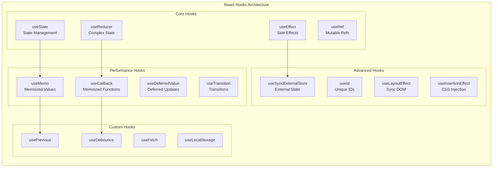

# React Hooks Fundamentals: Rules, Core Hooks, and Custom Hooks

Master React Hooks' architectural principles, design patterns, and implementation strategies for building scalable, maintainable applications with functional components.



## TLDR

**React Hooks** revolutionized React by enabling functional components to manage state and side effects, replacing class components with a more intuitive, composable architecture.

### Core Principles

- **Co-location of Logic**: Related functionality grouped together instead of scattered across lifecycle methods
- **Clean Reusability**: Logic extracted into custom hooks without altering component hierarchy
- **Simplified Mental Model**: Components become pure functions that map state to UI
- **Rules of Hooks**: Must be called at top level, only from React functions or custom hooks

### Essential Hooks

- **useState**: Foundation for state management with functional updates
- **useReducer**: Complex state logic with centralized updates and predictable patterns
- **useEffect**: Synchronization with external systems, side effects, and cleanup
- **useRef**: Imperative escape hatch for DOM references and mutable values
- **useMemo/useCallback**: Performance optimization through memoization

### Performance Optimization

- **Strategic Memoization**: Break render cascades, not optimize individual calculations
- **Referential Equality**: Preserve object/function references to prevent unnecessary re-renders
- **Dependency Arrays**: Proper dependency management to avoid stale closures and infinite loops

### Custom Hooks Architecture

- **Single Responsibility**: Each hook does one thing well
- **Composition Over Monoliths**: Compose smaller, focused hooks
- **Clear API**: Simple, predictable inputs and outputs
- **Production-Ready Patterns**: usePrevious, useDebounce, useFetch with proper error handling

### Advanced Patterns

- **State Machines**: Complex state transitions with useReducer
- **Effect Patterns**: Synchronization, cleanup, and dependency management
- **Performance Monitoring**: Profiling and optimization strategies
- **Testing Strategies**: Unit testing hooks in isolation

### Migration & Best Practices

- **Class to Function Migration**: Systematic approach to converting existing components
- **Error Boundaries**: Proper error handling for hooks-based applications
- **TypeScript Integration**: Full type safety for hooks and custom hooks
- **Performance Considerations**: When and how to optimize with memoization

## The Paradigm Shift: From Classes to Functions

### The Pre-Hooks Landscape

Before Hooks, React's class component model introduced several architectural challenges:

**Wrapper Hell**: Higher-Order Components (HOCs) and Render Props, while effective, created deeply nested component hierarchies that were difficult to debug and maintain.

**Fragmented Logic**: Related functionality was scattered across disparate lifecycle methods. A data subscription might be set up in `componentDidMount`, updated in `componentDidUpdate`, and cleaned up in `componentWillUnmount`.

**`this` Binding Complexity**: JavaScript's `this` keyword introduced cognitive overhead and boilerplate code that distracted from business logic.

### Hooks as Architectural Solution

Hooks solve these problems by enabling:

- **Co-location of Related Logic**: All code for a single concern can be grouped together
- **Clean Reusability**: Logic can be extracted into custom hooks without altering component hierarchy
- **Simplified Mental Model**: Components become pure functions that map state to UI

## The Rules of Hooks: A Contract with React's Renderer

Hooks operate under strict rules that are fundamental to React's internal state management mechanism ([Rules of Hooks](https://react.dev/reference/rules/rules-of-hooks)).

### Rule 1: Only Call Hooks at the Top Level

Hooks must be called in the same order on every render. React relies on call order to associate state with each hook call—internally, hooks are stored as a linked list, and React walks through this list sequentially on each render ([Why Do Hooks Rely on Call Order?](https://overreacted.io/why-do-hooks-rely-on-call-order/)).

```tsx title="hook-rules-example.tsx"
// ❌ Violates the rule
function BadComponent({ condition }) {
  const [count, setCount] = useState(0)

  if (condition) {
    useEffect(() => {
      console.log("Conditional effect")
    })
  }

  const [name, setName] = useState("")
  // State misalignment occurs here
}

// ✅ Correct approach
function GoodComponent({ condition }) {
  const [count, setCount] = useState(0)
  const [name, setName] = useState("")

  useEffect(() => {
    if (condition) {
      console.log("Conditional effect")
    }
  }, [condition])
}
```

### Rule 2: Only Call Hooks from React Functions

Hooks can only be called from:

- React function components
- Custom hooks (functions starting with `use`)

This ensures all stateful logic is encapsulated within component scope.

## Core Hooks: Understanding the Primitives

### useState: The Foundation of State Management

`useState` is the most fundamental hook for adding state to functional components ([useState Reference](https://react.dev/reference/react/useState)).

```tsx
const [state, setState] = useState(initialValue)
```

**Key Characteristics:**

- Returns current state and a setter function
- Triggers re-renders when state changes
- Supports functional updates for state-dependent changes

**Functional Updates Pattern:**

```tsx
// ❌ Potential stale closure
setCount(count + 1)

// ✅ Safe functional update
setCount((prevCount) => prevCount + 1)
```

### useReducer: Complex State Logic

`useReducer` provides a more structured approach to state management, inspired by Redux ([useReducer Reference](https://react.dev/reference/react/useReducer)).

```tsx
const [state, dispatch] = useReducer(reducer, initialState)
```

**When to Choose useReducer over useState:**

| Aspect         | useState                       | useReducer                      |
| -------------- | ------------------------------ | ------------------------------- |
| State Shape    | Simple, independent values     | Complex, interrelated objects   |
| Update Logic   | Co-located with event handlers | Centralized in reducer function |
| Predictability | Scattered across component     | Single source of truth          |
| Testability    | Tightly coupled to component   | Pure function, easily testable  |

**Example: Form State Management**

```tsx title="form-reducer.tsx" collapse={1-12}
type FormState = {
  email: string
  password: string
  errors: Record<string, string>
  isSubmitting: boolean
}

type FormAction =
  | { type: "SET_FIELD"; field: string; value: string }
  | { type: "SET_ERRORS"; errors: Record<string, string> }
  | { type: "SET_SUBMITTING"; isSubmitting: boolean }
  | { type: "RESET" }

function formReducer(state: FormState, action: FormAction): FormState {
  switch (action.type) {
    case "SET_FIELD":
      return { ...state, [action.field]: action.value }
    case "SET_ERRORS":
      return { ...state, errors: action.errors }
    case "SET_SUBMITTING":
      return { ...state, isSubmitting: action.isSubmitting }
    case "RESET":
      return initialState
    default:
      return state
  }
}
```

### useEffect: Synchronization with External Systems

`useEffect` is React's primary tool for managing side effects and synchronizing with external systems ([useEffect Reference](https://react.dev/reference/react/useEffect)).

**Mental Model: Synchronization, Not Lifecycle**

Think of `useEffect` as a synchronization primitive that keeps external systems in sync with your component's state ([Synchronizing with Effects](https://react.dev/learn/synchronizing-with-effects)).

```tsx
useEffect(() => {
  // Setup: Synchronize external system with component state
  const subscription = subscribeToData(userId)

  // Cleanup: Remove old synchronization before applying new one
  return () => {
    subscription.unsubscribe()
  }
}, [userId]) // Re-synchronize when userId changes
```

**Dependency Array Patterns:**

```tsx
// Run on every render (usually undesirable)
useEffect(() => {
  console.log("Every render")
})

// Run only on mount
useEffect(() => {
  console.log("Only on mount")
}, [])

// Run when dependencies change
useEffect(() => {
  console.log("When deps change")
}, [dep1, dep2])
```

**Common Pitfalls:**

1. **Stale Closures**: Forgetting dependencies
2. **Infinite Loops**: Including objects/functions that change on every render
3. **Missing Cleanup**: Not cleaning up subscriptions, timers, or event listeners

### useRef: The Imperative Escape Hatch

`useRef` provides a way to hold mutable values that don't trigger re-renders ([useRef Reference](https://react.dev/reference/react/useRef)).

**Two Primary Use Cases:**

1. **DOM References**: Accessing DOM nodes directly
2. **Mutable Values**: Storing values outside the render cycle

```tsx title="text-input-focus.tsx"
function TextInputWithFocus() {
  const inputRef = useRef<HTMLInputElement>(null)

  const focusInput = () => {
    inputRef.current?.focus()
  }

  return (
    <>
      <input ref={inputRef} type="text" />
      <button onClick={focusInput}>Focus Input</button>
    </>
  )
}
```

**Mutable Values Pattern:**

```tsx title="timer-component.tsx"
function TimerComponent() {
  const intervalRef = useRef<NodeJS.Timeout>()

  useEffect(() => {
    intervalRef.current = setInterval(() => {
      console.log("Tick")
    }, 1000)

    return () => {
      if (intervalRef.current) {
        clearInterval(intervalRef.current)
      }
    }
  }, [])
}
```

## Performance Optimization: Memoization Hooks

### The Problem: Referential Equality

JavaScript objects and functions are reference types, meaning they're recreated on every render.

```tsx title="referential-equality-problem.tsx"
function ParentComponent() {
  const [count, setCount] = useState(0)

  // New object on every render
  const style = { color: "blue", fontSize: 16 }

  // New function on every render
  const handleClick = () => console.log("clicked")

  return <ChildComponent style={style} onClick={handleClick} />
}
```

### useMemo: Memoizing Expensive Calculations

`useMemo` caches the result of expensive calculations ([useMemo Reference](https://react.dev/reference/react/useMemo)).

```tsx
const memoizedValue = useMemo(() => {
  return expensiveCalculation(a, b)
}, [a, b])
```

**When to Use useMemo:**

- Expensive computations (filtering large arrays, complex transformations)
- Preserving referential equality for objects passed as props
- Preventing unnecessary re-renders in optimized child components

### useCallback: Memoizing Functions

`useCallback` returns a memoized version of a function ([useCallback Reference](https://react.dev/reference/react/useCallback)).

```tsx
const memoizedCallback = useCallback(() => {
  doSomething(a, b)
}, [a, b])
```

**When to Use useCallback:**

- Functions passed as props to optimized child components
- Functions used as dependencies in other hooks
- Preventing unnecessary effect re-runs

### Strategic Memoization

Memoization should be used strategically, not indiscriminately. The goal is to break render cascades, not optimize individual calculations.

```tsx
// ❌ Unnecessary memoization
const simpleValue = useMemo(() => a + b, [a, b])

// ✅ Strategic memoization
const expensiveList = useMemo(() => {
  return largeArray.filter((item) => item.matches(criteria))
}, [largeArray, criteria])
```

## Custom Hooks: The Art of Abstraction

Custom hooks are the most powerful feature of the Hooks paradigm, enabling the creation of reusable logic abstractions ([Reusing Logic with Custom Hooks](https://react.dev/learn/reusing-logic-with-custom-hooks)).

### Design Principles

1. **Single Responsibility**: Each hook should do one thing well
2. **Clear API**: Simple, predictable inputs and outputs
3. **Descriptive Naming**: Names should clearly communicate purpose
4. **Comprehensive Documentation**: Clear usage examples and edge cases

### Composition Over Monoliths

Instead of creating monolithic hooks, compose smaller, focused hooks:

```tsx title="hook-composition.tsx"
// ❌ Monolithic hook
function useUserData(userId) {
  // Handles fetching, caching, real-time updates, error handling
  // 200+ lines of code
}

// ✅ Composed hooks
function useUserData(userId) {
  const { data, error, isLoading } = useFetch(`/api/users/${userId}`)
  const cachedData = useCache(data, `user-${userId}`)
  const realTimeUpdates = useSubscription(`user-${userId}`)

  return {
    user: realTimeUpdates || cachedData,
    error,
    isLoading,
  }
}
```

## Practical Implementations: Production-Ready Custom Hooks

This section presents comprehensive implementations of common custom hooks, each with detailed problem analysis, edge case handling, and architectural considerations.

### 1. usePrevious: Tracking State Transitions

**Problem Statement**: In React's functional components, there's no built-in way to access the previous value of a state or prop. This is needed for comparisons, animations, and detecting changes.

**Key Questions to Consider**:

- How do we handle the initial render when there's no previous value?
- What happens if the value is `undefined` or `null`?
- How do we ensure the hook works correctly with multiple state variables?
- Should we support deep equality comparison for objects?

**Edge Cases and Solutions**:

1. **Initial Render**: Return `undefined` to indicate no previous value
2. **Reference Equality**: Use `useRef` to store the previous value outside the render cycle
3. **Effect Timing**: Use `useEffect` to update the ref after render, ensuring we return the previous value during the current render
4. **Multiple States**: The hook remains stable regardless of other state variables due to dependency array scoping

**Production Implementation**:

````tsx
import { useEffect, useRef } from "react"

/**
 * Tracks the previous value of a state or prop.
 *
 * @param value - The current value to track
 * @returns The previous value, or undefined on first render
 *
 * @example
 * ```tsx
 * function Counter() {
 *   const [count, setCount] = useState(0);
 *   const previousCount = usePrevious(count);
 *
 *   return (
 *     <div>
 *       <p>Current: {count}</p>
 *       <p>Previous: {previousCount ?? 'None'}</p>
 *       <button onClick={() => setCount(c => c + 1)}>Increment</button>
 *     </div>
 *   );
 * }
 * ```
 */
export function usePrevious<T>(value: T): T | undefined {
  const ref = useRef<T>()

  useEffect(() => {
    ref.current = value
  }, [value])

  return ref.current
}
````

**Food for Thought**:

- **Performance**: Could we avoid the `useEffect` by updating the ref directly in the render function? What are the trade-offs?
- **Concurrent Mode**: How does this hook behave in React's concurrent features?
- **Alternative Patterns**: Could we implement this using a reducer pattern for more complex state tracking?
- **Type Safety**: How can we improve TypeScript inference for the return type?

**Advanced Variant with Deep Comparison**:

```tsx
import { useEffect, useRef, useMemo } from "react"

interface UsePreviousOptions {
  deep?: boolean
  compare?: (prev: any, current: any) => boolean
}

export function usePrevious<T>(value: T, options: UsePreviousOptions = {}): T | undefined {
  const { deep = false, compare } = options
  const ref = useRef<T>()

  const shouldUpdate = useMemo(() => {
    if (compare) return !compare(ref.current, value)
    if (deep) return JSON.stringify(ref.current) !== JSON.stringify(value)
    return ref.current !== value
  }, [value, deep, compare])

  useEffect(() => {
    if (shouldUpdate) {
      ref.current = value
    }
  }, [value, shouldUpdate])

  return ref.current
}
```

### 2. useDebounce: Stabilizing Rapid Updates

**Problem Statement**: User input events (like typing in a search box) can fire rapidly, causing performance issues and unnecessary API calls. We need to delay the processing until the user stops typing.

**Key Questions to Consider**:

- Should we support both leading and trailing edge execution?
- How do we handle rapid changes to the delay parameter?
- What happens if the component unmounts while a timer is pending?
- Should we provide a way to cancel or flush the debounced value?

**Edge Cases and Solutions**:

1. **Component Unmounting**: Clear the timer in the cleanup function to prevent memory leaks
2. **Delay Changes**: Include delay in the dependency array to restart the timer when it changes
3. **Rapid Value Changes**: Each new value cancels the previous timer and starts a new one
4. **Initial Value**: Start with the current value to avoid undefined states

**Production Implementation**:

````tsx collapse={1-31}
import { useState, useEffect, useRef } from "react"

/**
 * Debounces a value, updating it only after a specified delay has passed.
 *
 * @param value - The value to debounce
 * @param delay - The delay in milliseconds (default: 500ms)
 * @returns The debounced value
 *
 * @example
 * ```tsx
 * function SearchInput() {
 *   const [searchTerm, setSearchTerm] = useState('');
 *   const debouncedSearchTerm = useDebounce(searchTerm, 300);
 *
 *   useEffect(() => {
 *     if (debouncedSearchTerm) {
 *       performSearch(debouncedSearchTerm);
 *     }
 *   }, [debouncedSearchTerm]);
 *
 *   return (
 *     <input
 *       value={searchTerm}
 *       onChange={(e) => setSearchTerm(e.target.value)}
 *       placeholder="Search..."
 *     />
 *   );
 * }
 * ```
 */
export function useDebounce<T>(value: T, delay: number = 500): T {
  const [debouncedValue, setDebouncedValue] = useState<T>(value)
  const timeoutRef = useRef<NodeJS.Timeout>()

  useEffect(() => {
    // Clear the previous timeout
    if (timeoutRef.current) {
      clearTimeout(timeoutRef.current)
    }

    // Set a new timeout
    timeoutRef.current = setTimeout(() => {
      setDebouncedValue(value)
    }, delay)

    // Cleanup function
    return () => {
      if (timeoutRef.current) {
        clearTimeout(timeoutRef.current)
      }
    }
  }, [value, delay])

  return debouncedValue
}
````

**Food for Thought**:

- **Leading Edge**: Should we execute immediately on the first call? How would this affect UX?
- **Throttling vs Debouncing**: When would you choose one over the other?
- **Memory Management**: Are there any edge cases where timers might not be properly cleaned up?
- **Performance**: Could we optimize this further by avoiding the state update if the value hasn't changed?

**Advanced Variant with Callback Control**:

```tsx collapse={1-12,41-54}
import { useCallback, useRef } from "react"

interface UseDebounceCallbackOptions {
  leading?: boolean
  trailing?: boolean
}

export function useDebounceCallback<T extends (...args: any[]) => any>(
  callback: T,
  delay: number,
  options: UseDebounceCallbackOptions = {},
): [T, () => void, () => void] {
  const { leading = false, trailing = true } = options
  const timeoutRef = useRef<NodeJS.Timeout>()
  const lastCallTimeRef = useRef<number>()
  const lastArgsRef = useRef<Parameters<T>>()

  const debouncedCallback = useCallback(
    (...args: Parameters<T>) => {
      const now = Date.now()
      lastArgsRef.current = args

      if (leading && (!lastCallTimeRef.current || now - lastCallTimeRef.current >= delay)) {
        lastCallTimeRef.current = now
        callback(...args)
      }

      if (timeoutRef.current) {
        clearTimeout(timeoutRef.current)
      }

      if (trailing) {
        timeoutRef.current = setTimeout(() => {
          lastCallTimeRef.current = Date.now()
          callback(...lastArgsRef.current!)
        }, delay)
      }
    },
    [callback, delay, leading, trailing],
  )

  const cancel = useCallback(() => {
    if (timeoutRef.current) {
      clearTimeout(timeoutRef.current)
    }
  }, [])

  const flush = useCallback(() => {
    if (timeoutRef.current && lastArgsRef.current) {
      clearTimeout(timeoutRef.current)
      callback(...lastArgsRef.current)
    }
  }, [callback])

  return [debouncedCallback, cancel, flush]
}
```

### 3. useFetch: Robust Data Fetching with AbortController

**Problem Statement**: Data fetching in React components needs to handle loading states, errors, request cancellation, and race conditions. A naive implementation can lead to memory leaks and stale UI updates.

**Key Questions to Consider**:

- How do we prevent setting state on unmounted components?
- How do we handle race conditions when multiple requests are in flight?
- Should we implement caching to avoid duplicate requests?
- How do we handle different types of errors (network, HTTP, parsing)?

**Edge Cases and Solutions**:

1. **Component Unmounting**: Use AbortController to cancel in-flight requests
2. **Race Conditions**: Cancel previous requests when a new one starts
3. **Error Handling**: Distinguish between abort errors and genuine failures
4. **State Management**: Use reducer pattern for complex state transitions
5. **Request Deduplication**: Implement request caching to avoid duplicate calls

**Production Implementation**:

````tsx collapse={20-53,57-83}
import { useEffect, useReducer, useRef, useCallback } from "react"

// State interface
interface FetchState<T> {
  data: T | null
  error: Error | null
  isLoading: boolean
  isSuccess: boolean
}

// Action types
type FetchAction<T> =
  | { type: "FETCH_START" }
  | { type: "FETCH_SUCCESS"; payload: T }
  | { type: "FETCH_ERROR"; payload: Error }
  | { type: "FETCH_RESET" }

// Reducer function
function fetchReducer<T>(state: FetchState<T>, action: FetchAction<T>): FetchState<T> {
  switch (action.type) {
    case "FETCH_START":
      return {
        ...state,
        isLoading: true,
        error: null,
        isSuccess: false,
      }
    case "FETCH_SUCCESS":
      return {
        ...state,
        data: action.payload,
        isLoading: false,
        error: null,
        isSuccess: true,
      }
    case "FETCH_ERROR":
      return {
        ...state,
        error: action.payload,
        isLoading: false,
        isSuccess: false,
      }
    case "FETCH_RESET":
      return {
        data: null,
        error: null,
        isLoading: false,
        isSuccess: false,
      }
    default:
      return state
  }
}

// Request cache for deduplication
const requestCache = new Map<string, Promise<any>>()

/**
 * A robust data fetching hook with request cancellation and caching.
 *
 * @param url - The URL to fetch from
 * @param options - Fetch options and hook configuration
 * @returns Fetch state and control functions
 *
 * @example
 * ```tsx
 * function UserProfile({ userId }) {
 *   const { data, error, isLoading, refetch } = useFetch(
 *     `https://api.example.com/users/${userId}`,
 *     {
 *       enabled: !!userId,
 *       cacheTime: 5 * 1000 // 5 minutes
 *     }
 *   );
 *
 *   if (isLoading) return <Spinner />;
 *   if (error) return <ErrorMessage error={error} />;
 *   if (!data) return null;
 *
 *   return <UserCard user={data} />;
 * }
 * ```
 */
export function useFetch<T = any>(
  url: string | null,
  options: {
    enabled?: boolean
    cacheTime?: number
    headers?: Record<string, string>
    method?: string
    body?: any
  } = {},
): FetchState<T> & {
  refetch: () => void
  reset: () => void
} {
  const { enabled = true, cacheTime = 0, headers = {}, method = "GET", body } = options

  const [state, dispatch] = useReducer(fetchReducer<T>, {
    data: null,
    error: null,
    isLoading: false,
    isSuccess: false,
  })

  const abortControllerRef = useRef<AbortController>()
  const cacheKey = useRef<string>()

  const fetchData = useCallback(async () => {
    if (!url || !enabled) return

    // Create cache key
    const key = `${method}:${url}:${JSON.stringify(body)}`
    cacheKey.current = key

    // Check cache first
    if (requestCache.has(key)) {
      try {
        const cachedData = await requestCache.get(key)
        dispatch({ type: "FETCH_SUCCESS", payload: cachedData })
        return
      } catch (error) {
        // Cache hit but request failed, continue with fresh request
      }
    }

    // Abort previous request
    if (abortControllerRef.current) {
      abortControllerRef.current.abort()
    }

    // Create new abort controller
    const controller = new AbortController()
    abortControllerRef.current = controller

    dispatch({ type: "FETCH_START" })

    try {
      const fetchOptions: RequestInit = {
        method,
        headers: {
          "Content-Type": "application/json",
          ...headers,
        },
        signal: controller.signal,
      }

      if (body && method !== "GET") {
        fetchOptions.body = JSON.stringify(body)
      }

      const promise = fetch(url, fetchOptions).then(async (response) => {
        if (!response.ok) {
          throw new Error(`HTTP ${response.status}: ${response.statusText}`)
        }
        return response.json()
      })

      // Cache the promise
      requestCache.set(key, promise)

      const data = await promise

      // Only update state if this is still the current request
      if (cacheKey.current === key) {
        dispatch({ type: "FETCH_SUCCESS", payload: data })
      }

      // Remove from cache after cache time
      if (cacheTime > 0) {
        setTimeout(() => {
          requestCache.delete(key)
        }, cacheTime)
      }
    } catch (error) {
      // Only update state if this is still the current request and not an abort
      if (cacheKey.current === key && error.name !== "AbortError") {
        dispatch({ type: "FETCH_ERROR", payload: error as Error })
      }
    }
  }, [url, enabled, method, body, headers, cacheTime])

  const refetch = useCallback(() => {
    fetchData()
  }, [fetchData])

  const reset = useCallback(() => {
    dispatch({ type: "FETCH_RESET" })
  }, [])

  useEffect(() => {
    fetchData()

    return () => {
      if (abortControllerRef.current) {
        abortControllerRef.current.abort()
      }
    }
  }, [fetchData])

  return {
    ...state,
    refetch,
    reset,
  }
}
````

**Food for Thought**:

- **Cache Strategy**: Should we implement different caching strategies (LRU, TTL, etc.)?
- **Retry Logic**: How would you implement automatic retry with exponential backoff?
- **Request Deduplication**: Could we use a more sophisticated deduplication strategy?
- **Error Boundaries**: How does this hook integrate with React's error boundary system?
- **Suspense Integration**: Could we modify this to work with React Suspense for data fetching?

### 4. useLocalStorage: Persistent State Management

**Problem Statement**: We need to persist component state across browser sessions while handling storage errors, serialization, and synchronization between tabs.

**Key Questions to Consider**:

- How do we handle storage quota exceeded errors?
- Should we support custom serialization/deserialization?
- How do we handle storage events from other tabs?
- What happens if localStorage is not available (private browsing)?

**Edge Cases and Solutions**:

1. **Storage Unavailable**: Gracefully fall back to in-memory state
2. **Serialization Errors**: Handle JSON parsing errors and provide fallback values
3. **Storage Events**: Listen for changes from other tabs and update state accordingly
4. **Quota Exceeded**: Catch and handle storage quota errors
5. **Type Safety**: Ensure TypeScript types match the stored data

**Production Implementation**:

````tsx collapse={1-30,64-82}
import { useState, useEffect, useCallback, useRef } from "react"

interface UseLocalStorageOptions<T> {
  defaultValue?: T
  serializer?: (value: T) => string
  deserializer?: (value: string) => T
  onError?: (error: Error) => void
}

/**
 * Manages state that persists in localStorage with error handling and cross-tab synchronization.
 *
 * @param key - The localStorage key
 * @param initialValue - The initial value if no stored value exists
 * @param options - Configuration options
 * @returns [value, setValue, removeValue]
 *
 * @example
 * ```tsx
 * function ThemeToggle() {
 *   const [theme, setTheme] = useLocalStorage('theme', 'light');
 *
 *   return (
 *     <button onClick={() => setTheme(theme === 'light' ? 'dark' : 'light')}>
 *       Current theme: {theme}
 *     </button>
 *   );
 * }
 * ```
 */
export function useLocalStorage<T>(
  key: string,
  initialValue: T,
  options: UseLocalStorageOptions<T> = {},
): [T, (value: T | ((prev: T) => T)) => void, () => void] {
  const { defaultValue, serializer = JSON.stringify, deserializer = JSON.parse, onError = console.error } = options

  // Use ref to track if we're in the middle of a setState operation
  const isSettingRef = useRef(false)

  // Get stored value or fall back to initial value
  const getStoredValue = useCallback((): T => {
    try {
      if (typeof window === "undefined") {
        return initialValue
      }

      const item = window.localStorage.getItem(key)
      if (item === null) {
        return defaultValue ?? initialValue
      }

      return deserializer(item)
    } catch (error) {
      onError(error as Error)
      return defaultValue ?? initialValue
    }
  }, [key, initialValue, defaultValue, deserializer, onError])

  const [storedValue, setStoredValue] = useState<T>(getStoredValue)

  // Set value function
  const setValue = useCallback(
    (value: T | ((prev: T) => T)) => {
      try {
        isSettingRef.current = true

        // Allow value to be a function so we have the same API as useState
        const valueToStore = value instanceof Function ? value(storedValue) : value

        // Save to state
        setStoredValue(valueToStore)

        // Save to localStorage
        if (typeof window !== "undefined") {
          window.localStorage.setItem(key, serializer(valueToStore))
        }
      } catch (error) {
        onError(error as Error)
      } finally {
        isSettingRef.current = false
      }
    },
    [key, storedValue, serializer, onError],
  )

  // Remove value function
  const removeValue = useCallback(() => {
    try {
      setStoredValue(initialValue)
      if (typeof window !== "undefined") {
        window.localStorage.removeItem(key)
      }
    } catch (error) {
      onError(error as Error)
    }
  }, [key, initialValue, onError])

  // Listen for changes from other tabs
  useEffect(() => {
    const handleStorageChange = (e: StorageEvent) => {
      if (e.key === key && !isSettingRef.current) {
        try {
          const newValue = e.newValue === null ? (defaultValue ?? initialValue) : deserializer(e.newValue)
          setStoredValue(newValue)
        } catch (error) {
          onError(error as Error)
        }
      }
    }

    if (typeof window !== "undefined") {
      window.addEventListener("storage", handleStorageChange)
      return () => window.removeEventListener("storage", handleStorageChange)
    }
  }, [key, defaultValue, initialValue, deserializer, onError])

  return [storedValue, setValue, removeValue]
}
````

**Food for Thought**:

- **Encryption**: How would you implement encryption for sensitive data?
- **Compression**: Could we compress large objects before storing them?
- **Validation**: Should we add schema validation for stored data?
- **Migration**: How would you handle schema changes in stored data?
- **Performance**: Could we debounce storage writes for frequently changing values?

### 5. useIntersectionObserver: Efficient Element Visibility Detection

**Problem Statement**: We need to detect when elements enter or leave the viewport for lazy loading, infinite scrolling, and performance optimizations. Traditional scroll event listeners are inefficient and can cause performance issues.

**Key Questions to Consider**:

- How do we handle multiple elements with the same observer?
- Should we support different threshold values?
- How do we handle observer cleanup and memory management?
- What happens if the IntersectionObserver API is not supported?

**Edge Cases and Solutions**:

1. **Browser Support**: Provide fallback for older browsers
2. **Observer Reuse**: Use a single observer for multiple elements when possible
3. **Memory Leaks**: Properly disconnect observers when components unmount
4. **Threshold Variations**: Support different threshold values for different use cases
5. **Performance**: Avoid unnecessary re-renders when intersection state changes

**Production Implementation**:

````tsx collapse={1-40}
import { useEffect, useRef, useState, useCallback } from "react"

interface UseIntersectionObserverOptions {
  threshold?: number | number[]
  root?: Element | null
  rootMargin?: string
  freezeOnceVisible?: boolean
}

interface IntersectionObserverEntry {
  isIntersecting: boolean
  intersectionRatio: number
  target: Element
}

/**
 * Detects when an element enters or leaves the viewport using IntersectionObserver.
 *
 * @param options - IntersectionObserver configuration
 * @returns [ref, isIntersecting, entry]
 *
 * @example
 * ```tsx
 * function LazyImage({ src, alt }) {
 *   const [ref, isIntersecting] = useIntersectionObserver({
 *     threshold: 0.1,
 *     freezeOnceVisible: true
 *   });
 *
 *   return (
 *     
 *   );
 * }
 * ```
 */
export function useIntersectionObserver(
  options: UseIntersectionObserverOptions = {},
): [(node: Element | null) => void, boolean, IntersectionObserverEntry | null] {
  const { threshold = 0, root = null, rootMargin = "0px", freezeOnceVisible = false } = options

  const [entry, setEntry] = useState<IntersectionObserverEntry | null>(null)
  const [isIntersecting, setIsIntersecting] = useState(false)

  const elementRef = useRef<Element | null>(null)
  const observerRef = useRef<IntersectionObserver | null>(null)
  const frozenRef = useRef(false)

  const disconnect = useCallback(() => {
    if (observerRef.current) {
      observerRef.current.disconnect()
      observerRef.current = null
    }
  }, [])

  const setRef = useCallback(
    (node: Element | null) => {
      // Disconnect previous observer
      disconnect()

      elementRef.current = node

      if (!node) {
        setEntry(null)
        setIsIntersecting(false)
        return
      }

      // Check if IntersectionObserver is supported
      if (!("IntersectionObserver" in window)) {
        // Fallback: assume element is visible
        setEntry({
          isIntersecting: true,
          intersectionRatio: 1,
          target: node,
        })
        setIsIntersecting(true)
        return
      }

      // Create new observer
      observerRef.current = new IntersectionObserver(
        ([entry]) => {
          const isVisible = entry.isIntersecting

          // Freeze if requested and element becomes visible
          if (freezeOnceVisible && isVisible) {
            frozenRef.current = true
          }

          // Only update if not frozen
          if (!frozenRef.current) {
            setEntry(entry)
            setIsIntersecting(isVisible)
          }
        },
        {
          threshold,
          root,
          rootMargin,
        },
      )

      // Start observing
      observerRef.current.observe(node)
    },
    [threshold, root, rootMargin, freezeOnceVisible, disconnect],
  )

  // Cleanup on unmount
  useEffect(() => {
    return disconnect
  }, [disconnect])

  return [setRef, isIntersecting, entry]
}
````

**Food for Thought**:

- **Observer Pooling**: Could we implement a pool of observers to reduce memory usage?
- **Virtual Scrolling**: How would this integrate with virtual scrolling libraries?
- **Performance Monitoring**: Should we track intersection performance metrics?
- **Accessibility**: How does this affect screen reader behavior?
- **Mobile Optimization**: Should we use different thresholds for mobile devices?

### 6. useThrottle: Rate Limiting Function Calls

**Problem Statement**: We need to limit the rate at which a function can be called, ensuring it executes at most once per specified time interval. This is useful for scroll handlers, resize listeners, and other high-frequency events.

**Key Questions to Consider**:

- Should we support both leading and trailing execution?
- How do we handle the last call in a burst of calls?
- What happens if the throttled function returns a promise?
- Should we provide a way to cancel pending executions?

**Edge Cases and Solutions**:

1. **Leading vs Trailing**: Support both immediate and delayed execution patterns
2. **Last Call Handling**: Ensure the last call in a burst is executed
3. **Promise Support**: Handle async functions properly
4. **Cancellation**: Provide a way to cancel pending executions
5. **Memory Management**: Clean up timers and references properly

**Production Implementation**:

````tsx collapse={1-35}
import { useCallback, useRef } from "react"

interface UseThrottleOptions {
  leading?: boolean
  trailing?: boolean
}

/**
 * Throttles a function, ensuring it executes at most once per specified interval.
 *
 * @param callback - The function to throttle
 * @param delay - The throttle delay in milliseconds
 * @param options - Throttle configuration
 * @returns [throttledCallback, cancel, flush]
 *
 * @example
 * ```tsx
 * function ScrollTracker() {
 *   const [scrollY, setScrollY] = useState(0);
 *
 *   const throttledSetScrollY = useThrottle(setScrollY, 100);
 *
 *   useEffect(() => {
 *     const handleScroll = () => {
 *       throttledSetScrollY(window.scrollY);
 *     };
 *
 *     window.addEventListener('scroll', handleScroll);
 *     return () => window.removeEventListener('scroll', handleScroll);
 *   }, [throttledSetScrollY]);
 *
 *   return <div>Scroll position: {scrollY}</div>;
 * }
 * ```
 */
export function useThrottle<T extends (...args: any[]) => any>(
  callback: T,
  delay: number,
  options: UseThrottleOptions = {},
): [T, () => void, () => void] {
  const { leading = true, trailing = true } = options

  const lastCallTimeRef = useRef<number>(0)
  const lastCallArgsRef = useRef<Parameters<T>>()
  const timeoutRef = useRef<NodeJS.Timeout>()
  const lastExecTimeRef = useRef<number>(0)

  const throttledCallback = useCallback(
    (...args: Parameters<T>) => {
      const now = Date.now()
      lastCallArgsRef.current = args

      // Check if enough time has passed since last execution
      const timeSinceLastExec = now - lastExecTimeRef.current

      if (timeSinceLastExec >= delay) {
        // Execute immediately
        if (leading) {
          lastExecTimeRef.current = now
          callback(...args)
        }

        // Clear any pending timeout
        if (timeoutRef.current) {
          clearTimeout(timeoutRef.current)
          timeoutRef.current = undefined
        }
      } else if (trailing && !timeoutRef.current) {
        // Schedule execution for later
        const remainingTime = delay - timeSinceLastExec

        timeoutRef.current = setTimeout(() => {
          if (lastCallArgsRef.current) {
            lastExecTimeRef.current = Date.now()
            callback(...lastCallArgsRef.current)
          }
          timeoutRef.current = undefined
        }, remainingTime)
      }
    },
    [callback, delay, leading, trailing],
  )

  const cancel = useCallback(() => {
    if (timeoutRef.current) {
      clearTimeout(timeoutRef.current)
      timeoutRef.current = undefined
    }
    lastCallArgsRef.current = undefined
  }, [])

  const flush = useCallback(() => {
    if (timeoutRef.current && lastCallArgsRef.current) {
      clearTimeout(timeoutRef.current)
      lastExecTimeRef.current = Date.now()
      callback(...lastCallArgsRef.current)
      timeoutRef.current = undefined
    }
  }, [callback])

  return [throttledCallback, cancel, flush]
}
````

**Food for Thought**:

- **Debounce vs Throttle**: When would you choose one over the other?
- **Performance**: Could we optimize this further by avoiding function recreation?
- **Edge Cases**: What happens with very small delay values?
- **Testing**: How would you unit test this hook effectively?
- **Composition**: Could we combine this with other hooks for more complex patterns?

## Conclusion

Mastering hooks starts with the primitives: state, effects, memoization, and composition. With a solid foundation in rules and patterns, you can build reusable abstractions that stay predictable and testable.
