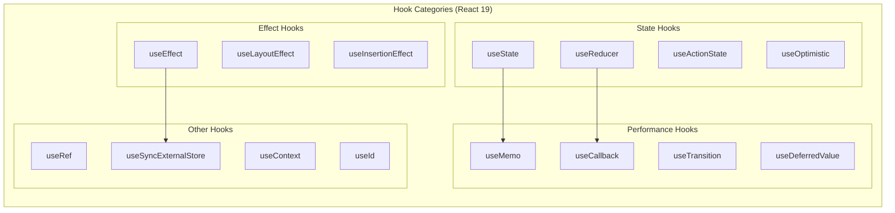

# React Hooks Fundamentals: Rules, Core Hooks, and Custom Hooks

React Hooks enable functional components to manage state and side effects. Introduced in React 16.8 (February 2019), hooks replaced class components as the recommended approach for most use cases. This article covers the architectural principles, core hooks, and patterns for building production applications.

<figure>



<figcaption>React 19 hook categories. State hooks manage component data; effect hooks synchronize with external systems; performance hooks optimize rendering.</figcaption>
</figure>

## Abstract

Hooks solve three problems that plagued class components: logic fragmentation across lifecycle methods, wrapper hell from HOCs (Higher-Order Components) and render props, and the cognitive overhead of JavaScript's `this` binding.

The core mental model:

- **Hooks are call-order dependent**: React stores hook state in a linked list, using call position (not names) to associate state with hooks. This enables custom hooks to have independent state without key collisions.
- **Effects are synchronization, not lifecycle**: `useEffect` keeps external systems in sync with React state. Think "synchronize chat connection with `roomId`" not "run code on mount."
- **Memoization breaks render cascades**: `useMemo` and `useCallback` preserve referential equality to prevent unnecessary re-renders of memoized children—not to optimize individual calculations.
- **Custom hooks compose without collision**: Because each hook call gets its own slot in the linked list, two hooks using the same internal hook don't conflict.

As of React 19 (December 2024), new hooks like `useActionState`, `useOptimistic`, and the `use` API extend hooks to handle async data and form actions natively.

## Why Hooks Exist: The Class Component Problems

Before React 16.8, class components had three architectural problems that hooks were designed to solve:

**1. Logic Fragmentation**: A single concern (like a data subscription) was scattered across `componentDidMount` (setup), `componentDidUpdate` (sync on prop change), and `componentWillUnmount` (cleanup). Hooks co-locate related logic in a single `useEffect` call.

**2. Wrapper Hell**: HOCs and render props solved reuse but created deeply nested hierarchies (the "pyramid of doom") that were hard to debug. Custom hooks extract logic without adding wrapper components.

**3. `this` Binding**: Class methods required explicit binding or arrow function class properties. Hooks eliminate `this` entirely—components are just functions.

> **Design rationale**: The React team considered alternatives like mixins (rejected due to the "diamond problem" of conflicting method names) and render props (rejected because they still add nesting). Hooks' call-order design naturally avoids these issues. See Dan Abramov's ["Why Do Hooks Rely on Call Order?"](https://overreacted.io/why-do-hooks-rely-on-call-order/) for the full reasoning.

## The Rules of Hooks: Why Call Order Matters

Hooks have two rules that stem from a single implementation decision: React tracks hook state in a **linked list indexed by call order**, not by name.

### Rule 1: Only Call Hooks at the Top Level

React associates `useState(0)` with "the first hook call" and `useState("")` with "the second hook call." If the order changes between renders, state gets misassigned.

```tsx title="hook-rules-violation.tsx" collapse={1-2}
// ❌ Conditional hook call: order changes when `condition` flips
function BadComponent({ condition }) {
  const [count, setCount] = useState(0)       // Always slot 0

  if (condition) {
    useEffect(() => console.log("effect"))    // Sometimes slot 1
  }

  const [name, setName] = useState("")        // Slot 1 or 2 depending on condition
}
```

When `condition` changes from `true` to `false`, React expects slot 1 to be `useEffect` but finds `useState`—state corruption occurs.

```tsx title="hook-rules-correct.tsx" collapse={1-2}
// ✅ Condition inside the hook, not around it
function GoodComponent({ condition }) {
  const [count, setCount] = useState(0)       // Always slot 0
  const [name, setName] = useState("")        // Always slot 1

  useEffect(() => {
    if (condition) console.log("effect")      // Always slot 2
  }, [condition])
}
```

**Why this design?** The React team evaluated alternatives:

- **String keys**: Name collisions when composing hooks (two hooks using the same internal state key)
- **Symbol keys**: Can't call the same hook twice (both calls share one Symbol)
- **Manual composition**: Forces developers to manage keys through all layers

Call order solves all three: each call gets its own slot, no keys needed, no collisions.

### Rule 2: Only Call Hooks from React Functions

Hooks can only be called from function components or custom hooks (functions starting with `use`). This ensures React is in the middle of rendering when hooks are called, so it can properly track state.

The `eslint-plugin-react-hooks` plugin enforces both rules statically.

## Core Hooks

### useState: State as a Snapshot

`useState` adds local state to a component. The setter triggers a re-render with the new value.

```tsx title="useState-basics.tsx"
const [count, setCount] = useState(0)    // Returns [currentValue, setter]
```

**Critical behavior**: State is a snapshot frozen at render time. The setter queues a re-render; it doesn't mutate immediately.

```tsx title="useState-snapshot.tsx" collapse={1-2}
// Each click only increments by 1, not 3
function Counter() {
  const [count, setCount] = useState(0)

  function handleClick() {
    setCount(count + 1)  // Queues: set to 0 + 1
    setCount(count + 1)  // Queues: set to 0 + 1 (count is still 0!)
    setCount(count + 1)  // Queues: set to 0 + 1
  }
}
```

**Functional updates** solve the stale closure problem by receiving the latest state:

```tsx title="useState-functional-update.tsx" collapse={1-2}
// Each call sees the updated value—increments by 3
function Counter() {
  const [count, setCount] = useState(0)

  function handleClick() {
    setCount(c => c + 1)  // 0 → 1
    setCount(c => c + 1)  // 1 → 2
    setCount(c => c + 1)  // 2 → 3
  }
}
```

**Object state**: React uses `Object.is` to detect changes. Mutating an object and calling the setter won't trigger a re-render because the reference hasn't changed.

```tsx title="useState-object-mutation.tsx"
// ❌ Mutation: React sees same reference, skips re-render
obj.x = 10
setObj(obj)

// ✅ Replacement: new reference triggers re-render
setObj({ ...obj, x: 10 })
```

**Lazy initialization**: Pass a function (not its result) when the initial value is expensive to compute. React only calls it on the first render.

```tsx title="useState-lazy-init.tsx"
// ❌ createTodos() runs every render (result ignored after first)
const [todos, setTodos] = useState(createTodos())

// ✅ createTodos only runs once
const [todos, setTodos] = useState(createTodos)
```

### useReducer: Centralized State Transitions

`useReducer` extracts state update logic into a pure function. Useful when state transitions are complex or interdependent.

```tsx title="useReducer-basics.tsx"
const [state, dispatch] = useReducer(reducer, initialState)
```

**When to choose useReducer over useState:**

| Scenario | useState | useReducer |
|----------|----------|------------|
| Independent values | ✅ Simpler | Overkill |
| Interdependent state (form with validation) | Scattered logic | ✅ Centralized |
| Complex transitions (state machine) | Hard to follow | ✅ Explicit actions |
| Testing state logic | Coupled to component | ✅ Pure function |

```tsx title="form-reducer.tsx" collapse={1-14, 26-30}
type FormState = {
  email: string
  password: string
  errors: Record<string, string>
  isSubmitting: boolean
}

type FormAction =
  | { type: "SET_FIELD"; field: string; value: string }
  | { type: "SET_ERRORS"; errors: Record<string, string> }
  | { type: "SUBMIT_START" }
  | { type: "SUBMIT_END" }
  | { type: "RESET" }

const initialState: FormState = {
  email: "", password: "", errors: {}, isSubmitting: false
}

function formReducer(state: FormState, action: FormAction): FormState {
  switch (action.type) {
    case "SET_FIELD":
      return { ...state, [action.field]: action.value, errors: {} }
    case "SET_ERRORS":
      return { ...state, errors: action.errors, isSubmitting: false }
    case "SUBMIT_START":
      return { ...state, isSubmitting: true, errors: {} }
    case "SUBMIT_END":
      return { ...state, isSubmitting: false }
    case "RESET":
      return initialState
  }
}
```

The reducer is a pure function—easy to unit test without rendering a component.

### useEffect: Synchronization, Not Lifecycle

**Mental model shift**: Don't think "run on mount/unmount." Think "synchronize external system X with React state Y."

```tsx title="useEffect-sync-model.tsx" collapse={1-2}
// "Keep chat connection in sync with roomId"
function ChatRoom({ roomId }) {
  useEffect(() => {
    const connection = createConnection(roomId)
    connection.connect()
    return () => connection.disconnect()  // Cleanup before re-sync
  }, [roomId])  // Re-sync when roomId changes
}
```

When `roomId` changes: cleanup runs (disconnect old room) → setup runs (connect new room). This is synchronization, not lifecycle.

**Dependency array behavior:**

```tsx title="useEffect-dependencies.tsx"
useEffect(() => { ... })           // Re-runs after every render (rare)
useEffect(() => { ... }, [])       // Runs once after initial render
useEffect(() => { ... }, [a, b])   // Re-runs when a or b changes (Object.is)
```

**Common bugs:**

| Bug | Cause | Fix |
|-----|-------|-----|
| Stale closure | Missing dependency | Add to array or use functional update |
| Infinite loop | Object/function in deps recreated each render | `useMemo`/`useCallback` or move inside effect |
| Memory leak | No cleanup for subscription/timer | Return cleanup function |
| Race condition | Async result applied after newer request | Use `ignore` flag pattern |

```tsx title="useEffect-race-condition.tsx" collapse={1-2}
// Race condition fix: ignore stale responses
function Profile({ userId }) {
  const [user, setUser] = useState(null)

  useEffect(() => {
    let ignore = false
    fetchUser(userId).then(data => {
      if (!ignore) setUser(data)  // Only apply if still current
    })
    return () => { ignore = true }
  }, [userId])
}
```

**Strict Mode double-invocation**: In development, React mounts → unmounts → mounts components to surface missing cleanup. If your effect breaks on remount, it's missing cleanup.

### useRef: Mutable Values Outside the Render Cycle

`useRef` returns a mutable object `{ current: value }` that persists across renders without triggering re-renders when mutated.

**Two use cases:**

1. **DOM access**: Get a reference to a DOM node
2. **Instance variables**: Store values that shouldn't trigger re-renders (timers, previous values, flags)

```tsx title="useRef-dom.tsx" collapse={1-2}
// DOM reference for imperative focus
function TextInput() {
  const inputRef = useRef<HTMLInputElement>(null)
  return (
    <>
      <input ref={inputRef} />
      <button onClick={() => inputRef.current?.focus()}>Focus</button>
    </>
  )
}
```

```tsx title="useRef-timer.tsx" collapse={1-2}
// Store interval ID without causing re-renders
function Timer() {
  const intervalRef = useRef<NodeJS.Timeout>()

  useEffect(() => {
    intervalRef.current = setInterval(() => console.log("tick"), 1000)
    return () => clearInterval(intervalRef.current)
  }, [])
}
```

**Key distinction from state**: Mutating `ref.current` doesn't schedule a re-render. Use state when the UI should reflect the value; use refs for values that don't affect rendering.

## Performance Hooks: Memoization

### The Referential Equality Problem

Objects and functions are recreated on every render. If passed to a `memo()`-wrapped child, the child re-renders because `{} !== {}`.

```tsx title="referential-equality.tsx" collapse={1-2}
// Child re-renders on every parent render, even if props are "the same"
function Parent() {
  const [count, setCount] = useState(0)
  const style = { color: "blue" }           // New object each render
  const onClick = () => console.log("hi")   // New function each render
  return <MemoizedChild style={style} onClick={onClick} />
}
```

### useMemo: Cache Expensive Values

`useMemo` caches a computed value until dependencies change.

```tsx title="useMemo-basics.tsx"
const filtered = useMemo(
  () => items.filter(item => item.matches(query)),
  [items, query]
)
```

**When to use:**

1. **Expensive calculations**: Filter/map over large arrays, complex transformations (>1ms)
2. **Referential equality for props**: Prevent re-renders of memoized children
3. **Dependencies of other hooks**: Stable object reference for `useEffect` deps

**When NOT to use:** Simple calculations like `a + b`. The overhead of memoization exceeds the cost.

### useCallback: Cache Functions

`useCallback` is `useMemo` for functions: `useCallback(fn, deps)` ≡ `useMemo(() => fn, deps)`.

```tsx title="useCallback-basics.tsx" collapse={1-2}
// Stable function reference for memoized child
function Parent() {
  const [count, setCount] = useState(0)

  const handleClick = useCallback(() => {
    setCount(c => c + 1)  // Updater function avoids `count` dependency
  }, [])

  return <MemoizedButton onClick={handleClick} />
}
```

**When to use:** Functions passed to `memo()`-wrapped children or used as `useEffect` dependencies.

### React Compiler (React 19+)

The React Compiler (currently opt-in) auto-memoizes values and functions at compile time. When widely adopted, manual `useMemo`/`useCallback` will be unnecessary in most cases.

## Custom Hooks

Custom hooks extract reusable stateful logic. A function starting with `use` that calls other hooks is a custom hook.

**Design principles:**

1. **Single responsibility**: One hook, one concern
2. **Composition**: Build complex hooks from simpler hooks
3. **Stable API**: Consistent return shape across versions

```tsx title="custom-hook-composition.tsx" collapse={1-2}
// Compose focused hooks rather than building monoliths
function useUserData(userId: string) {
  const { data, error, isLoading } = useFetch(`/api/users/${userId}`)
  const cached = useCache(data, `user-${userId}`)
  return { user: cached ?? data, error, isLoading }
}
```

Each hook call gets its own state slot—no conflicts even if two hooks internally use `useState`.

## Production Custom Hooks

### usePrevious: Track Previous Values

Returns the value from the previous render. Useful for comparisons, animations, and change detection.

```tsx title="usePrevious.tsx" collapse={1-2}
import { useEffect, useRef } from "react"

export function usePrevious<T>(value: T): T | undefined {
  const ref = useRef<T>()
  useEffect(() => { ref.current = value }, [value])
  return ref.current  // Returns previous value during render
}
```

**How it works**: `useRef` stores the value outside the render cycle. `useEffect` updates the ref *after* render, so during render we still see the old value.

**Edge cases:**
- First render: returns `undefined`
- Concurrent features: safe because refs are instance-specific

### useDebounce: Delay Rapid Updates

Delays updating a value until input stops for a specified duration. Common for search inputs.

```tsx title="useDebounce.tsx" collapse={1-2}
import { useState, useEffect } from "react"

export function useDebounce<T>(value: T, delay = 500): T {
  const [debouncedValue, setDebouncedValue] = useState(value)

  useEffect(() => {
    const timer = setTimeout(() => setDebouncedValue(value), delay)
    return () => clearTimeout(timer)
  }, [value, delay])

  return debouncedValue
}
```

**Usage:**

```tsx title="useDebounce-usage.tsx" collapse={1-2}
function Search() {
  const [query, setQuery] = useState("")
  const debouncedQuery = useDebounce(query, 300)

  useEffect(() => {
    if (debouncedQuery) fetchResults(debouncedQuery)
  }, [debouncedQuery])
}
```

**Edge cases:**
- Component unmount: cleanup clears pending timer
- Delay changes: timer resets with new duration

### useFetch: Data Fetching with Cancellation

Handles loading states, errors, and request cancellation via `AbortController`.

```tsx title="useFetch.tsx" collapse={1-4, 20-35}
import { useEffect, useReducer, useRef, useCallback } from "react"

type State<T> = { data: T | null; error: Error | null; isLoading: boolean }
type Action<T> = { type: "start" } | { type: "success"; data: T } | { type: "error"; error: Error }

function reducer<T>(state: State<T>, action: Action<T>): State<T> {
  switch (action.type) {
    case "start": return { ...state, isLoading: true, error: null }
    case "success": return { data: action.data, isLoading: false, error: null }
    case "error": return { ...state, isLoading: false, error: action.error }
  }
}

export function useFetch<T>(url: string | null) {
  const [state, dispatch] = useReducer(reducer<T>, { data: null, error: null, isLoading: false })
  const abortRef = useRef<AbortController>()

  useEffect(() => {
    if (!url) return

    abortRef.current?.abort()
    const controller = new AbortController()
    abortRef.current = controller

    dispatch({ type: "start" })

    fetch(url, { signal: controller.signal })
      .then(res => res.ok ? res.json() : Promise.reject(new Error(`HTTP ${res.status}`)))
      .then(data => dispatch({ type: "success", data }))
      .catch(err => {
        if (err.name !== "AbortError") dispatch({ type: "error", error: err })
      })

    return () => controller.abort()
  }, [url])

  return state
}
```

**Key behaviors:**
- Cancels in-flight request when URL changes or component unmounts
- Ignores `AbortError` to avoid spurious error states
- Uses reducer for atomic state transitions

### useLocalStorage: Persistent State

Syncs state with `localStorage`, handling SSR (Server-Side Rendering), serialization errors, and cross-tab updates.

```tsx title="useLocalStorage.tsx" collapse={1-3, 18-30}
import { useState, useEffect, useCallback } from "react"

export function useLocalStorage<T>(key: string, initialValue: T): [T, (v: T | ((p: T) => T)) => void] {
  const [value, setValue] = useState<T>(() => {
    if (typeof window === "undefined") return initialValue
    try {
      const item = localStorage.getItem(key)
      return item ? JSON.parse(item) : initialValue
    } catch { return initialValue }
  })

  const setStoredValue = useCallback((newValue: T | ((prev: T) => T)) => {
    setValue(prev => {
      const resolved = newValue instanceof Function ? newValue(prev) : newValue
      try { localStorage.setItem(key, JSON.stringify(resolved)) } catch {}
      return resolved
    })
  }, [key])

  // Sync across tabs
  useEffect(() => {
    const handler = (e: StorageEvent) => {
      if (e.key === key && e.newValue) {
        try { setValue(JSON.parse(e.newValue)) } catch {}
      }
    }
    window.addEventListener("storage", handler)
    return () => window.removeEventListener("storage", handler)
  }, [key])

  return [value, setStoredValue]
}
```

**Edge cases:**
- SSR: Returns `initialValue` when `window` is undefined
- JSON errors: Falls back to initial value
- Cross-tab sync: `storage` event fires when other tabs modify the same key

### useIntersectionObserver: Viewport Detection

Detects when elements enter/leave the viewport. Replaces inefficient scroll listeners.

```tsx title="useIntersectionObserver.tsx" collapse={1-5, 22-28}
import { useEffect, useRef, useState, useCallback } from "react"

interface Options {
  threshold?: number; rootMargin?: string; freezeOnceVisible?: boolean
}

export function useIntersectionObserver(options: Options = {}) {
  const { threshold = 0, rootMargin = "0px", freezeOnceVisible = false } = options
  const [isIntersecting, setIsIntersecting] = useState(false)
  const frozen = useRef(false)
  const ref = useRef<Element | null>(null)

  const setRef = useCallback((node: Element | null) => {
    if (ref.current) return  // Already observing
    ref.current = node
    if (!node) return

    const observer = new IntersectionObserver(([entry]) => {
      if (frozen.current) return
      if (freezeOnceVisible && entry.isIntersecting) frozen.current = true
      setIsIntersecting(entry.isIntersecting)
    }, { threshold, rootMargin })

    observer.observe(node)
    return () => observer.disconnect()
  }, [threshold, rootMargin, freezeOnceVisible])

  return [setRef, isIntersecting] as const
}
```

**Usage:** Lazy-load images when they enter viewport:

```tsx title="useIntersectionObserver-usage.tsx" collapse={1-2}
function LazyImage({ src }: { src: string }) {
  const [ref, isVisible] = useIntersectionObserver({ freezeOnceVisible: true })
  return 
}
```

## React 19 Hooks

React 19 (December 2024) introduces hooks for form handling and optimistic updates:

| Hook | Purpose |
|------|---------|
| `useActionState` | Manages form submission state, errors, and pending status |
| `useFormStatus` | Reads parent `<form>` status without prop drilling |
| `useOptimistic` | Shows optimistic UI while async request completes |
| `use` | Reads promises/context during render (can follow early returns) |

```tsx title="react-19-hooks.tsx" collapse={1-2}
// useActionState example
import { useActionState } from "react"

function Form() {
  const [error, submitAction, isPending] = useActionState(
    async (prevState, formData) => {
      const result = await saveData(formData)
      if (result.error) return result.error
      return null
    },
    null
  )

  return (
    <form action={submitAction}>
      <button disabled={isPending}>Submit</button>
      {error && <p>{error}</p>}
    </form>
  )
}
```

The React Compiler (opt-in in React 19) will auto-memoize values and functions, reducing the need for manual `useMemo`/`useCallback`.

## Conclusion

Hooks solve class component problems through a single mechanism: call-order-based state tracking. Master the core hooks (`useState`, `useEffect`, `useRef`), understand their mental models (snapshots, synchronization, mutable refs), and compose custom hooks for reusable logic.

## Appendix

### Prerequisites

- React functional components
- JavaScript closures and reference equality
- Basic TypeScript (for typed examples)

### Terminology

| Term | Definition |
|------|------------|
| **Hook** | Function starting with `use` that accesses React state or lifecycle |
| **Memoization** | Caching computed values to avoid recalculation |
| **Referential equality** | Two values are `===` (same reference in memory) |
| **Stale closure** | Closure capturing outdated variable values |
| **HOC** | Higher-Order Component—function that wraps a component to add behavior |

### Summary

- Hooks use **call-order** to track state—never call conditionally
- `useState` returns a **snapshot**; use functional updates for state-dependent changes
- `useEffect` is **synchronization**, not lifecycle; always return cleanup
- `useMemo`/`useCallback` preserve **referential equality** for memoized children
- Custom hooks compose without collision because each call gets its own state slot
- React 19 adds `useActionState`, `useOptimistic`, and the `use` API for forms and async data

### References

- [React Documentation: Hooks Reference](https://react.dev/reference/react/hooks) - Official API reference for all built-in hooks
- [React Documentation: Rules of Hooks](https://react.dev/reference/rules/rules-of-hooks) - Official rules and linting
- [Dan Abramov: Why Do Hooks Rely on Call Order?](https://overreacted.io/why-do-hooks-rely-on-call-order/) - Design rationale from React core team
- [React Documentation: Synchronizing with Effects](https://react.dev/learn/synchronizing-with-effects) - Mental model for useEffect
- [React Documentation: Reusing Logic with Custom Hooks](https://react.dev/learn/reusing-logic-with-custom-hooks) - Custom hooks patterns
- [React 19 Release Notes](https://react.dev/blog/2024/04/25/react-19) - New hooks and features
- [React Compiler Documentation](https://react.dev/learn/react-compiler) - Automatic memoization
