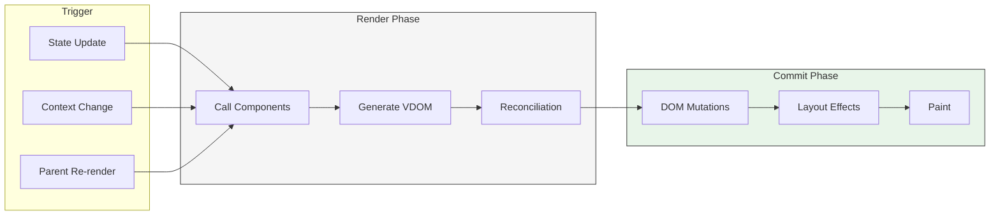

# React Performance Patterns: Rendering, Memoization, and Scheduling

Patterns for keeping React applications fast as they scale: understanding the render pipeline, applying memoization correctly, leveraging concurrent features, and profiling effectively. Covers React 18+ with notes on React 19 and the React Compiler.

<figure>



<figcaption>React's three-phase update cycle: trigger → render → commit. The render phase is interruptible in concurrent mode; the commit phase is synchronous.</figcaption>
</figure>

## Abstract

React performance optimization reduces to one question: **which components render, and how often?**

The render phase calls component functions and diffs the virtual DOM (VDOM). Memoization (`memo`, `useMemo`, `useCallback`) skips renders when inputs haven't changed—but only if those inputs are referentially stable. Object.is comparison means new object/function references break memoization.

React 18's concurrent rendering makes the render phase interruptible. Transitions (`useTransition`, `useDeferredValue`) let you mark updates as non-urgent so user interactions remain responsive during expensive renders.

For large lists, virtualization renders only visible items, keeping DOM size constant regardless of data size.

Profile with React DevTools Profiler to find actual bottlenecks—measure before optimizing.

## The Render Pipeline

### When Components Render

A component renders when:

1. **Its state changes** via a `set` function
2. **Its parent re-renders** (unless memoized with stable props)
3. **A context it consumes changes**

Rendering means React calls your component function. It does not necessarily mean DOM updates—that happens only if the reconciliation diff finds changes.

### Render vs. Commit

React separates work into two phases:

| Phase      | What Happens                                       | Interruptible (React 18+) |
| ---------- | -------------------------------------------------- | ------------------------- |
| **Render** | Call components, build VDOM, diff against previous | Yes                       |
| **Commit** | Apply DOM mutations, run effects                   | No                        |

The render phase is pure computation. React may call components multiple times, pause rendering, or discard work entirely. The commit phase applies changes to the DOM synchronously—once React starts committing, it runs to completion.

### Reconciliation: The O(n) Diff

Comparing arbitrary trees is O(n³). React uses two heuristics to achieve O(n):

1. **Different element types produce different trees.** Changing `<div>` to `<span>` unmounts the entire subtree and rebuilds from scratch.
2. **Keys identify stable children.** Without keys, React matches children by position—reordering causes unnecessary unmount/remount cycles.

```tsx title="Key behavior" {5}
// Without keys: inserting at index 0 remounts ALL items
<ul>
  {items.map(item => <li>{item.name}</li>)}
</ul>

// With keys: React matches by identity, only new items mount
<ul>
  {items.map(item => <li key={item.id}>{item.name}</li>)}
</ul>
```

**Key gotcha:** Using array index as key breaks when items reorder or filter. Component state stays with the index, not the data. Use stable IDs from your data.

### Fiber Architecture

React Fiber (introduced in React 16) represents components as a linked list of "fiber" nodes rather than a recursive call stack. Each fiber holds:

- Component type and props
- Corresponding DOM node
- Links to parent, child, and sibling fibers
- Pending work and priority

This structure enables **incremental rendering**: React can pause mid-render, handle a higher-priority update, then resume. It uses double-buffering—maintaining a "current" tree (on screen) and a "work-in-progress" tree (being built)—and swaps pointers on commit.

> **Prior to React 16:** Reconciliation was synchronous and recursive. Once a render started, it blocked the main thread until completion. Deep component trees caused frame drops.

## Memoization Patterns

### When Memoization Helps

Memoization skips work when inputs haven't changed. It helps when:

1. A component re-renders frequently with identical props
2. The component's render is expensive (complex calculations, many children)
3. You're passing callbacks to memoized children

It doesn't help when:

- Props always change (new objects/functions every render)
- Render cost is negligible
- The component rarely re-renders anyway

### `React.memo`: Skipping Re-renders

`memo` wraps a component to skip re-rendering when props are shallowly equal:

```tsx title="memo usage" collapse={1-3,15-20}
import { memo } from "react"

interface ChartProps {
  data: number[]
  color: string
}

// Only re-renders if data or color reference changes
const Chart = memo(function Chart({ data, color }: ChartProps) {
  // Expensive rendering logic
  return <canvas>{/* ... */}</canvas>
})

// Parent component
function Dashboard() {
  const [filter, setFilter] = useState("all")
  // ...
}
```

**How it works:** React compares each prop using `Object.is`. For primitives, this compares values. For objects and functions, it compares references—a new object `{}` is never equal to a previous `{}`.

**Custom comparison:** For deep comparisons, pass a second argument:

```tsx title="Custom comparison" {3-7}
const Chart = memo(
  function Chart({ dataPoints }: { dataPoints: Point[] }) {
    /* ... */
  },
  (prevProps, nextProps) => {
    // Return true to skip re-render, false to re-render
    return (
      prevProps.dataPoints.length === nextProps.dataPoints.length &&
      prevProps.dataPoints.every((p, i) => p.x === nextProps.dataPoints[i].x && p.y === nextProps.dataPoints[i].y)
    )
  },
)
```

**Danger:** Custom comparers must compare _all_ props. Skipping a callback prop causes stale closures—the component sees outdated state.

### `useMemo`: Caching Computed Values

`useMemo` caches a calculated value, recomputing only when dependencies change:

```tsx title="useMemo for expensive computation" collapse={1-5,17-20}
import { useMemo, useState } from "react"

interface Todo {
  id: string
  text: string
  completed: boolean
}

function TodoList({ todos, filter }: { todos: Todo[]; filter: string }) {
  // filterTodos only runs when todos or filter changes
  const visibleTodos = useMemo(() => filterTodos(todos, filter), [todos, filter])

  return <List items={visibleTodos} />
}
```

**Dependency comparison:** React uses `Object.is` on each dependency. If you create a new object in the component body and use it as a dependency, `useMemo` recalculates every render—defeating its purpose.

```tsx title="Dependency trap" {4-5,8-9}
function Search({ items }: { items: Item[] }) {
  const [query, setQuery] = useState("")

  // ❌ Bad: options object is new every render
  const options = { caseSensitive: false, query }

  const results = useMemo(
    // Recalculates every render because options changed
    () => searchItems(items, options),
    [items, options],
  )
}
```

**Fix:** Move the object creation inside `useMemo`, or memoize the options object separately:

```tsx title="Fixed dependency" {4-5}
function Search({ items }: { items: Item[] }) {
  const [query, setQuery] = useState("")

  // ✅ Object created inside useMemo, dependencies are primitives
  const results = useMemo(() => {
    const options = { caseSensitive: false, query }
    return searchItems(items, options)
  }, [items, query])
}
```

### `useCallback`: Stable Function References

`useCallback` returns the same function reference across renders when dependencies haven't changed:

```tsx title="useCallback for stable callbacks" collapse={1-3,13-15}
import { useCallback, useState } from "react"

const MemoizedChild = memo(function Child({ onClick }: { onClick: () => void }) {
  return <button onClick={onClick}>Click</button>
})

function Parent() {
  const [count, setCount] = useState(0)

  // Same function reference as long as count hasn't changed
  const handleClick = useCallback(() => {
    console.log("Count:", count)
  }, [count])

  return <MemoizedChild onClick={handleClick} />
}
```

**Relationship to `useMemo`:** `useCallback(fn, deps)` is equivalent to `useMemo(() => fn, deps)`. Both cache values; `useCallback` is specialized for functions.

**Common mistake—stale closures:**

```tsx title="Stale closure trap" {3-5,8-10}
function Counter() {
  const [count, setCount] = useState(0)

  // ❌ Bad: empty deps means count is always 0 in the closure
  const increment = useCallback(() => {
    setCount(count + 1) // Always sets to 1
  }, [])

  // ✅ Good: use updater function to avoid dependency
  const increment = useCallback(() => {
    setCount((c) => c + 1) // Works correctly
  }, [])
}
```

### When NOT to Memoize

Memoization has overhead: storing cached values, comparing dependencies. For cheap operations, the overhead exceeds the savings.

**Skip memoization when:**

- The operation is fast (most operations are)
- Props always change anyway
- You're optimizing without measuring
- The component rarely re-renders

**Rule of thumb:** If you're not passing the value to a memoized child or the calculation doesn't measurably impact performance (1ms+ in profiler), skip the memoization.

### React Compiler: Automatic Memoization

React Compiler (currently in beta) analyzes your code at build time and automatically inserts memoization. It makes manual `memo`, `useMemo`, and `useCallback` largely unnecessary:

```tsx title="With React Compiler"
// No manual memoization needed—compiler handles it
function TodoList({ todos, filter }) {
  const visibleTodos = filterTodos(todos, filter)
  return <List items={visibleTodos} />
}
```

The compiler applies memoization correctly based on data flow analysis, avoiding the pitfalls of manual dependency arrays. It requires code to follow React's rules (components are pure, hooks follow the rules of hooks). Codebases with impure components may need fixes before the compiler works correctly.

## Concurrent Rendering

### What Changed in React 18

React 18 introduced concurrent rendering—the render phase can be interrupted, paused, and resumed. This is opt-in: you only get concurrent behavior when using concurrent features (`useTransition`, `useDeferredValue`, Suspense for data).

| React 17                                               | React 18+                                                           |
| ------------------------------------------------------ | ------------------------------------------------------------------- |
| Synchronous rendering—once started, runs to completion | Interruptible rendering—can pause for urgent updates                |
| Updates processed in order                             | Updates have priority—urgent updates interrupt transitions          |
| Batching only in React event handlers                  | Automatic batching everywhere (promises, setTimeout, native events) |

### Transitions: Urgent vs. Non-Urgent Updates

`useTransition` marks state updates as non-urgent. React handles urgent updates (typing, clicking) first, then resumes transition updates:

```tsx title="useTransition for tab switching" collapse={1-4,24-30}
import { useState, useTransition } from "react"

function TabContainer() {
  const [tab, setTab] = useState("home")
  const [isPending, startTransition] = useTransition()

  function selectTab(nextTab: string) {
    startTransition(() => {
      // This update is non-urgent
      setTab(nextTab)
    })
  }

  return (
    <div>
      <TabButtons onSelect={selectTab} isPending={isPending} />
      <div style={{ opacity: isPending ? 0.7 : 1 }}>
        <TabContent tab={tab} />
      </div>
    </div>
  )
}
```

**How it works:**

1. User clicks a tab → `startTransition` called
2. `isPending` becomes `true` immediately
3. React starts rendering the new tab in the background
4. If user types in an input, React interrupts the tab render to handle the urgent input update
5. Once the tab render completes and no urgent updates are pending, React commits

**Critical limitation:** Don't use transitions for controlled input state. The input value must update synchronously for the input to feel responsive:

```tsx title="Transition limitation" {4-5,9-10}
function SearchForm() {
  const [query, setQuery] = useState("")

  // ❌ Bad: input feels laggy
  const handleChange = (e) => startTransition(() => setQuery(e.target.value))

  // ✅ Good: separate state for input vs. results
  const [inputValue, setInputValue] = useState("")
  const [searchQuery, setSearchQuery] = useState("")

  const handleChange = (e) => {
    setInputValue(e.target.value) // Urgent
    startTransition(() => setSearchQuery(e.target.value)) // Deferred
  }
}
```

### `useDeferredValue`: Deferring Derived State

`useDeferredValue` defers updating a value, showing stale content while fresh content renders in the background:

```tsx title="useDeferredValue for search" collapse={1-4,20-25}
import { useState, useDeferredValue, Suspense } from "react"

function SearchPage() {
  const [query, setQuery] = useState("")
  const deferredQuery = useDeferredValue(query)
  const isStale = query !== deferredQuery

  return (
    <>
      <input value={query} onChange={(e) => setQuery(e.target.value)} />
      <div style={{ opacity: isStale ? 0.5 : 1 }}>
        <Suspense fallback={<Spinner />}>
          <SearchResults query={deferredQuery} />
        </Suspense>
      </div>
    </>
  )
}
```

**Difference from `useTransition`:**

- `useTransition`: You control the state setter. Wrap the update in `startTransition`.
- `useDeferredValue`: You receive a prop/value you don't control. Defer the value itself.

**Difference from debouncing:**

| Debouncing                   | `useDeferredValue`                    |
| ---------------------------- | ------------------------------------- |
| Fixed delay (e.g., 300ms)    | No fixed delay—adapts to device speed |
| Blocks during delay          | Background render is interruptible    |
| Same behavior on all devices | Fast devices see less delay           |

### Suspense for Data Fetching

Suspense lets components "wait" for data, showing a fallback until ready:

```tsx title="Suspense boundaries" collapse={1-3,16-20}
import { Suspense } from "react"

function ProfilePage({ userId }: { userId: string }) {
  return (
    <Suspense fallback={<ProfileSkeleton />}>
      <ProfileDetails userId={userId} />
      <Suspense fallback={<PostsSkeleton />}>
        <ProfilePosts userId={userId} />
      </Suspense>
    </Suspense>
  )
}

// Components use Suspense-enabled data fetching
function ProfileDetails({ userId }) {
  const user = use(fetchUser(userId)) // Suspends until resolved
  return <h1>{user.name}</h1>
}
```

**Nested Suspense boundaries** create a reveal sequence:

1. Show `ProfileSkeleton` while `ProfileDetails` loads
2. Once `ProfileDetails` ready, show it + `PostsSkeleton` for posts
3. Once posts ready, show everything

**Transitions + Suspense:** Without a transition, suspending hides already-shown content and shows the fallback. With a transition, React keeps showing the current content until the new content is ready:

```tsx title="Transition preserves visible content" {4-6}
function Router() {
  const [page, setPage] = useState("/")

  function navigate(url: string) {
    startTransition(() => setPage(url)) // Keeps current page visible
  }
}
```

## List Virtualization

### The Problem with Large Lists

Rendering 10,000 list items creates 10,000 DOM nodes. Each node consumes memory, and the browser must calculate layout/styles for all of them. Scrolling triggers repaints across the entire tree.

Virtualization renders only visible items (plus a small buffer), maintaining a constant DOM size regardless of list length.

### react-window

`react-window` is a lightweight virtualization library. Two main components:

**`FixedSizeList`**: For items with uniform heights

```tsx title="FixedSizeList" collapse={1-6,23-28}
import { FixedSizeList } from "react-window"

interface RowProps {
  index: number
  style: React.CSSProperties
  data: string[]
}

function Row({ index, style, data }: RowProps) {
  return <div style={style}>{data[index]}</div>
}

function VirtualizedList({ items }: { items: string[] }) {
  return (
    <FixedSizeList
      height={400}
      width="100%"
      itemCount={items.length}
      itemSize={50} // Each row is 50px tall
      itemData={items}
      overscanCount={5} // Render 5 extra items above/below viewport
    >
      {Row}
    </FixedSizeList>
  )
}
```

**`VariableSizeList`**: For items with dynamic heights

```tsx title="VariableSizeList" collapse={1-4,15-20}
import { VariableSizeList } from "react-window"

function getItemSize(index: number): number {
  // Return height for item at index
  return items[index].isExpanded ? 200 : 50
}

function VirtualizedList({ items }) {
  return (
    <VariableSizeList height={400} width="100%" itemCount={items.length} itemSize={getItemSize}>
      {Row}
    </VariableSizeList>
  )
}
```

**The `style` prop is mandatory**—it positions items absolutely within the scroll container.

### Overscan

`overscanCount` renders items outside the visible window to prevent white flashes during fast scrolling. Higher values improve smoothness but reduce performance gains. Start with 2-5 and increase if you see flashing.

### Limitations

- **Browser search (Ctrl+F) doesn't find non-rendered items.** Implement custom search that calculates positions and scrolls to matches.
- **Accessibility:** Screen readers may not announce off-screen items. Test with assistive technology.
- **Dynamic heights:** Variable-size lists must know item heights upfront. For truly dynamic content, measure heights and cache them.

## Profiling

### React DevTools Profiler

The Profiler records component renders and timing:

1. Open React DevTools → Profiler tab
2. Click record, interact with your app, click stop
3. Review the flame graph

**Flame graph reading:**

- Each bar = one component render
- Width = time spent rendering (component + children)
- Color: blue (fast), yellow (medium), red (slow)
- Gray = component didn't render

**Ranked chart:** Shows components sorted by self-time (excluding children). Use this to find individual slow components.

### The `<Profiler>` Component

For programmatic measurement:

```tsx title="Profiler component" collapse={1-4,20-25}
import { Profiler, ProfilerOnRenderCallback } from "react"

const onRender: ProfilerOnRenderCallback = (id, phase, actualDuration, baseDuration, startTime, commitTime) => {
  console.log({
    id, // Profiler id prop
    phase, // "mount" | "update" | "nested-update"
    actualDuration, // Time spent rendering (with memoization)
    baseDuration, // Time without any memoization (worst case)
  })
}

function App() {
  return (
    <Profiler id="App" onRender={onRender}>
      <MainContent />
    </Profiler>
  )
}
```

Compare `actualDuration` to `baseDuration` to verify memoization effectiveness. If they're similar, memoization isn't helping.

### Profiling in Production

Development builds include extra checks that slow rendering. Production builds are 2-10x faster. For accurate measurements:

1. Use a **profiling build**: `react-dom/profiling` instead of `react-dom`
2. Measure in production-like conditions
3. Test on representative hardware (not just developer machines)

### "Why Did This Render?"

Enable "Record why each component rendered while profiling" in DevTools settings. After recording, select a component to see why it re-rendered:

- "Props changed" (lists which props)
- "State changed"
- "Context changed"
- "Parent re-rendered"

This pinpoints unnecessary renders immediately.

## Performance Checklist

### Rendering

- [ ] Use `key` with stable, unique IDs (not array index)
- [ ] Keep state as local as possible
- [ ] Split large components so state changes affect smaller subtrees

### Memoization

- [ ] Apply `memo` to components that re-render frequently with same props
- [ ] Ensure memoized components receive stable references (primitives or memoized objects/functions)
- [ ] Use `useMemo` for expensive calculations with stable dependencies
- [ ] Use `useCallback` for callbacks passed to memoized children

### Concurrent Features

- [ ] Wrap expensive, non-urgent updates in `startTransition`
- [ ] Use `useDeferredValue` for values that don't need immediate updates
- [ ] Show visual feedback (`isPending`, opacity reduction) during transitions

### Large Lists

- [ ] Virtualize lists with 100+ items using `react-window`
- [ ] Set appropriate `overscanCount` (2-5 typically)
- [ ] Implement custom search if users need Ctrl+F functionality

### Profiling

- [ ] Profile with React DevTools before optimizing
- [ ] Use production profiling builds for accurate measurements
- [ ] Enable "why did this render" to find unnecessary re-renders
- [ ] Verify memoization helps by comparing `actualDuration` vs `baseDuration`

## Conclusion

React performance follows a hierarchy:

1. **Minimize render frequency.** Keep state local, lift only what's necessary, use proper keys.
2. **Skip unnecessary renders.** Apply memoization where profiling shows benefit.
3. **Make renders interruptible.** Use transitions for non-urgent updates.
4. **Reduce DOM size.** Virtualize large lists.

Measure before optimizing. Most React apps don't need aggressive optimization—the framework is fast by default. When you do optimize, profile to find actual bottlenecks rather than guessing.

## Appendix

### Prerequisites

- React component model (props, state, effects)
- JSX and rendering basics
- JavaScript reference equality (`===`, `Object.is`)

### Terminology

- **VDOM (Virtual DOM):** In-memory representation of the UI that React diffs against the previous version to determine minimal DOM updates.
- **Reconciliation:** The process of diffing the old and new VDOM trees to compute the minimal set of changes.
- **Fiber:** React's unit of work representing a component instance; enables incremental rendering.
- **Commit:** The phase where React applies changes to the actual DOM.
- **Transition:** A non-urgent update that can be interrupted by urgent updates.

### Summary

- **Render frequency** is the primary performance lever—reduce unnecessary component calls
- **Memoization** (`memo`, `useMemo`, `useCallback`) works only with referentially stable inputs
- **Concurrent features** (`useTransition`, `useDeferredValue`) keep UI responsive during expensive updates
- **Virtualization** renders only visible items, maintaining constant DOM size
- **Profile first**, optimize second—React DevTools shows where time is actually spent

### References

- [React: Render and Commit](https://react.dev/learn/render-and-commit) - Official docs on the render pipeline
- [Reconciliation (Legacy Docs)](https://legacy.reactjs.org/docs/reconciliation.html) - O(n) diffing algorithm details
- [React.memo](https://react.dev/reference/react/memo) - Component memoization API
- [useMemo](https://react.dev/reference/react/useMemo) - Value memoization hook
- [useCallback](https://react.dev/reference/react/useCallback) - Callback memoization hook
- [useTransition](https://react.dev/reference/react/useTransition) - Transition hook API
- [useDeferredValue](https://react.dev/reference/react/useDeferredValue) - Deferred value hook API
- [Suspense](https://react.dev/reference/react/Suspense) - Suspense component API
- [React 18 Release Notes](https://react.dev/blog/2022/03/29/react-v18) - Concurrent features announcement
- [React Fiber Architecture](https://github.com/acdlite/react-fiber-architecture) - Andrew Clark's explanation of Fiber
- [react-window](https://github.com/bvaughn/react-window) - List virtualization library
- [Virtualize long lists with react-window](https://web.dev/articles/virtualize-long-lists-react-window) - web.dev guide
- [Profiler API](https://react.dev/reference/react/Profiler) - Programmatic profiling component
