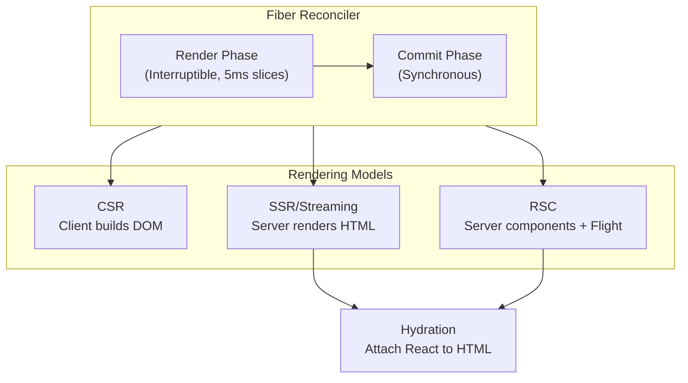
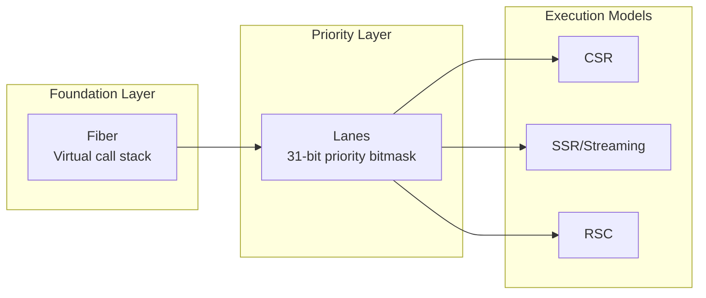

# React Rendering Architecture: Fiber, SSR, and RSC

React's rendering architecture has evolved from a synchronous stack-based reconciler to a sophisticated concurrent system built on Fiber's virtual call stack. This article examines the Fiber reconciliation engine, lane-based priority scheduling, streaming Server-Side Rendering (SSR), and React Server Components (RSC)—now stable as of React 19 (December 2024). Understanding these internals is essential for making informed architectural decisions about rendering strategies, performance optimization, and infrastructure requirements.

<figure>



<figcaption>All rendering models (CSR, SSR, RSC) use the Fiber reconciler. SSR and RSC require hydration on the client to become interactive.</figcaption>
</figure>

## Abstract

React's rendering architecture rests on three interdependent pillars:

<figure>



<figcaption>Fiber enables interruptible work; Lanes determine priority; execution models determine where rendering occurs.</figcaption>
</figure>

**Mental model:**

1. **Fiber as virtual stack**: Each component becomes a fiber node linked via `child`/`sibling`/`return` pointers. React can pause mid-tree, yield to the browser, and resume—impossible with the native call stack.

2. **Two-phase reconciliation**: The render phase builds a work-in-progress (WIP) tree and is interruptible (5ms time slices via `MessageChannel`). The commit phase applies DOM mutations synchronously—no interruption allowed.

3. **Lanes replace expiration times**: As of React 18, priority is a 31-bit bitmask. Each update gets a lane bit; the scheduler processes the highest-priority lane set first. User input lanes preempt transition lanes.

4. **Rendering location is orthogonal to Fiber**: CSR, SSR, and RSC all use Fiber for reconciliation. RSC differs by serializing the component tree into a streamable Flight protocol, sending only UI descriptions—never component code—to the client.

5. **RSC is stable in React 19**: Server Components ship zero JavaScript to the client, fetch data directly on the server, and integrate with Suspense for progressive streaming.

## 1. The Fiber Reconciliation Engine

### 1.1 From Stack to Fiber: The Paradigm Shift

React's original reconciliation algorithm (pre-React 16) operated synchronously, bound to the JavaScript call stack. A state update would recursively traverse the entire component tree in one uninterruptible pass—blocking the main thread for the duration. Complex trees could cause noticeable jank.

React Fiber (React 16, September 2017) reimplemented reconciliation by **replacing the native call stack with a controllable in-memory data structure**: a tree of fiber nodes linked via `child`/`sibling`/`return` pointers. This virtual stack allows React's scheduler to pause work, yield to the browser for user input or paint, and resume later.

> **Prior to React 16:** The "stack reconciler" processed the entire tree synchronously. Once a render started, it had to complete before the browser could respond to input—causing jank on complex updates.

### 1.2 Anatomy of a Fiber Node

Each fiber node is a "virtual stack frame" holding metadata about a component and its rendering state:

```javascript title="fiber-node-structure.js" collapse={1-2, 26-30}
// Simplified fiber node structure (React 19)
// See ReactFiberLane.js and ReactFiber.js in react-reconciler
const fiberNode = {
  // Identity
  tag: FunctionComponent,      // Component type (FunctionComponent, HostComponent, etc.)
  type: ComponentFunction,     // Reference to component function/class
  key: "unique-key",           // Stable identity for diffing

  // Tree pointers
  child: childFiber,           // First child
  sibling: siblingFiber,       // Next sibling
  return: parentFiber,         // Parent (named "return" as in call stack)

  // Props/state
  pendingProps: newProps,      // Props for this render
  memoizedProps: oldProps,     // Props from previous render
  memoizedState: hookList,     // Linked list of hooks (for function components)

  // Double buffering
  alternate: wipFiber,         // Links current ↔ work-in-progress

  // Effects (React 18+: flags instead of effectTag)
  flags: Update | Placement,   // Bitmask of side effects
  subtreeFlags: flags,         // Aggregated child flags

  // Scheduling (React 18+: lanes instead of expirationTime)
  lanes: SyncLane,             // Lane bits for this fiber's updates
  childLanes: lanes,           // Aggregated child lanes
}
```

**Double buffering**: React maintains two fiber trees—the **current tree** (displayed UI) and the **work-in-progress (WIP) tree** (being built). The `alternate` pointer links corresponding nodes. During reconciliation, React builds the WIP tree; at commit, a pointer swap makes WIP the new current. This technique—borrowed from video game rendering—ensures atomic UI updates without mutating the live interface.

### 1.3 Two-Phase Reconciliation

Fiber's reconciliation operates in two distinct phases—a design that directly enables concurrent rendering:

#### Render Phase (Interruptible)

The render phase determines what changes to apply. It is **asynchronous and interruptible**, safe to pause mid-tree:

1. **Work loop starts** at the root fiber, traversing depth-first
2. **`performUnitOfWork`** calls `beginWork()` on each fiber, diffing against the previous state
3. **WIP tree builds** progressively as new fibers are created and linked
4. **Time-slicing** pauses after 5ms, yielding to the browser via `MessageChannel`

```javascript title="work-loop-concept.js" collapse={1-2}
// Conceptual work loop (actual implementation in ReactFiberWorkLoop.js)
// React yields after 5ms to maintain 60fps (16.67ms per frame)
function workLoopConcurrent() {
  while (workInProgress !== null && !shouldYield()) {
    performUnitOfWork(workInProgress)
  }
}

function shouldYield() {
  return performance.now() >= deadline // deadline = startTime + 5ms
}
```

**Why MessageChannel, not requestIdleCallback?** `requestIdleCallback` only fires during idle periods—which may never happen on busy pages. `MessageChannel` posts to the macrotask queue, guaranteeing React gets CPU time in the next event loop iteration. The 5ms slice leaves ~11ms per frame for browser layout, paint, and user input.

#### Commit Phase (Synchronous)

Once render completes, React enters the **synchronous, non-interruptible commit phase**:

1. **Tree swap**: WIP becomes current via pointer manipulation
2. **DOM mutations**: React applies changes from the `flags` bitmask on each fiber
3. **Effects execution**: `useLayoutEffect` runs synchronously; `useEffect` schedules asynchronously

This two-phase architecture is the foundation for Suspense, concurrent transitions, and RSC streaming.

### 1.4 Lane-Based Priority System

As of React 18, the scheduler uses **lanes**—a 31-bit bitmask where each bit represents a priority level. This replaced the previous expiration time model.

| Lane | Priority | Use Case |
|------|----------|----------|
| `SyncLane` | Highest | Discrete user input (click, key press) |
| `InputContinuousLane` | High | Continuous input (drag, scroll) |
| `DefaultLane` | Normal | Regular `setState` calls |
| `TransitionLane` | Low | `startTransition` updates |
| `IdleLane` | Lowest | Background work |

**Why lanes?** Expiration times forced React to process updates in order of expiration. Lanes allow **batching updates of the same priority** (multiple `SyncLane` updates batch into one render) and **preemption** (a `SyncLane` update can interrupt a `TransitionLane` render).

```javascript title="lane-example.js"
// User clicks button → SyncLane
// startTransition → TransitionLane (won't block input)
function handleClick() {
  setCount(c => c + 1)                    // SyncLane - processed immediately
  startTransition(() => {
    setSearchResults(filterLargeList())   // TransitionLane - can be interrupted
  })
}
```

### 1.5 The Heuristic Diffing Algorithm

React implements an **O(n) heuristic diffing algorithm** based on two assumptions that hold for typical UI patterns:

1. **Different element types produce different trees**: Comparing `<div>` to `<span>` at the same position tears down the entire subtree and rebuilds—no attempt to diff children.

2. **`key` provides stable identity**: In lists, the `key` prop allows React to track insertions, deletions, and reordering. Without keys, React uses positional comparison—leading to performance degradation and state bugs when items reorder.

### 1.6 Hooks Integration with Fiber

Each function component's fiber stores its hooks as a linked list in `memoizedState`. A cursor tracks the current hook position during render:

```javascript title="hook-structure.js" collapse={1-2}
// Simplified hook object (see ReactFiberHooks.js)
// Each hook in a component forms a linked list
const hook = {
  memoizedState: value,       // Current value (state, ref, etc.)
  baseState: value,           // Base for update calculations
  queue: updateQueue,         // Pending updates
  next: nextHook,             // Next hook in list
}
```

**Why the Rules of Hooks exist**: Hooks rely on call order, not names. React walks the linked list position-by-position. If you call `useState` conditionally, the cursor misaligns—React reads the wrong hook's state. The lint rule `react-hooks/rules-of-hooks` enforces consistent ordering.

## 2. Client-Side Rendering Architectures

### 2.1 Pure Client-Side Rendering (CSR)

In CSR, the browser receives a minimal HTML shell; JavaScript constructs the entire DOM:

```javascript title="csr-init.js" collapse={1-2}
// CSR initialization (React 18+)
import { createRoot } from "react-dom/client"

const root = createRoot(document.getElementById("root"))
root.render(<App />)
```

`createRoot` establishes the fiber tree foundation:

1. Creates **FiberRootNode** (top-level container for React's internal state)
2. Creates **HostRoot fiber** (root fiber corresponding to the DOM container)
3. Links them bidirectionally

`root.render()` schedules an update on the HostRoot fiber, triggering two-phase reconciliation.

**CSR trade-offs**:

| Metric | CSR Performance | Why |
|--------|-----------------|-----|
| TTFB | Fast | Minimal HTML shell |
| FCP | Slow | Blank screen until JS executes |
| TTI | Slow | Full bundle must load and execute |
| SEO | Poor | Crawlers see empty shell (unless SSR fallback) |

CSR suits internal dashboards and SPAs (Single-Page Applications) where SEO is irrelevant and users expect a loading state.

### 2.2 Server-Side Rendering with Hydration

SSR addresses CSR's blank-screen problem by pre-rendering HTML on the server. **Hydration** is the process of attaching React to server-generated HTML—making it interactive.

#### The Hydration Process

Hydration is **not a full re-render**. React reconciles existing DOM with its virtual tree:

```javascript title="hydration.js" collapse={1-2}
// React 18+ hydration API
import { hydrateRoot } from "react-dom/client"

hydrateRoot(document.getElementById("root"), <App />)
```

Steps:

1. **DOM traversal**: React walks existing HTML alongside its virtual component tree
2. **Event attachment**: Handlers bind to existing DOM elements (no new elements created)
3. **State initialization**: Hooks initialize; effects schedule
4. **Consistency check**: React validates server/client output matches

#### Hydration Mismatches

Mismatches occur when server HTML differs from client render. Common causes:

| Cause | Example | Fix |
|-------|---------|-----|
| Date/time | `new Date().toISOString()` | Use consistent timezone or defer to client |
| Browser APIs | `window.innerWidth` | Check `typeof window !== 'undefined'` or use `useEffect` |
| Random values | `Math.random()` | Generate on server, pass as prop |
| Extension injection | Ad blockers modify DOM | Use `suppressHydrationWarning` sparingly |

React 18+ can **recover from some mismatches** by re-rendering the mismatched subtree, but recovery has costs: slower hydration and potential for event handlers attaching to wrong elements.

#### Selective Hydration

Suspense enables **selective hydration**—critical components hydrate immediately; others defer:

```javascript title="selective-hydration.jsx" collapse={1-3}
// Selective hydration with Suspense (React 18+)
import { lazy, Suspense } from "react"
const HeavyComponent = lazy(() => import("./HeavyComponent"))

function App() {
  return (
    <div>
      <CriticalHeader />
      <Suspense fallback={<Skeleton />}>
        <HeavyComponent />  {/* Hydrates when visible or interacted with */}
      </Suspense>
    </div>
  )
}
```

Components inside Suspense boundaries hydrate **on demand**—when scrolled into view or when the user attempts interaction. This reduces Time to Interactive (TTI) for complex pages.

### 2.3 Streaming SSR with Suspense

React 18 introduced **streaming SSR**—progressive HTML delivery through Suspense boundaries:

```javascript title="streaming-ssr.js" collapse={1-3}
// Server streaming (React 18+)
import { renderToPipeableStream } from "react-dom/server"
import { App } from "./App"

const stream = renderToPipeableStream(<App />, {
  onShellReady() {
    // Shell ready → send immediately
    response.statusCode = 200
    response.setHeader("content-type", "text/html")
    stream.pipe(response)
  },
  onAllReady() {
    // All Suspense boundaries resolved → useful for crawlers
  },
  onError(error) {
    console.error(error)
    response.statusCode = 500
  },
})
```

**How streaming works**:

1. React renders until it hits a suspended component (e.g., awaiting data)
2. It sends the shell HTML immediately with a `<template>` placeholder
3. As Promises resolve, React streams `<script>` tags containing the resolved HTML
4. Client-side React swaps placeholders with streamed content—no full page reload

**React 19 behavior change**: In React 19, sibling components inside the same Suspense boundary no longer render in parallel—they render sequentially. This was a deliberate performance optimization that caused controversy. To fetch in parallel, either:
- Use separate Suspense boundaries for each sibling
- Trigger fetches outside the render phase (route loaders, RSC data fetching)

## 3. Server-Side Rendering Strategies

### 3.1 Traditional SSR (Page Router Pattern)

In Next.js Pages Router (and similar frameworks), server rendering follows a page-centric data fetching model:

```javascript title="pages/products.js" collapse={1-2, 14-20}
// Next.js Pages Router pattern
// Data fetching happens before component renders
export async function getServerSideProps({ req, res }) {
  const products = await fetchProducts()

  res.setHeader("Cache-Control", "public, s-maxage=10, stale-while-revalidate=59")

  return { props: { products } }
}

export default function ProductsPage({ products }) {
  return (
    <div>
      {products.map((product) => (
        <ProductCard key={product.id} product={product} />
      ))}
    </div>
  )
}
```

This model couples data fetching to routing—server functions execute before rendering, props flow down the tree.

### 3.2 Static Site Generation (SSG)

SSG renders at **build time**, producing static HTML:

```javascript title="ssg-example.js"
export async function getStaticProps() {
  const posts = await fetchPosts()
  return {
    props: { posts },
    revalidate: 3600, // ISR: regenerate every hour
  }
}
```

| Benefit | Why |
|---------|-----|
| Optimal TTFB | Static files served from CDN edge |
| Cache-friendly | No server computation per request |
| Cost-efficient | No runtime infrastructure |
| Resilient | No server failures affect availability |

### 3.3 Incremental Static Regeneration (ISR)

ISR bridges SSG and SSR—static pages update **after** build:

1. First request serves stale static page
2. Background regeneration triggers if `revalidate` time exceeded
3. Next request serves updated content
4. On failure, stale content continues serving

**Limitation**: ISR is a Next.js-specific feature, not a React primitive. Other frameworks implement similar patterns differently.

## 4. React Server Components

### 4.1 The RSC Paradigm Shift

React Server Components (RSC), **stable as of React 19** (December 2024), address a different problem than SSR. SSR optimizes initial page load; RSC **eliminates client JavaScript for non-interactive components**.

| Aspect | SSR | RSC |
|--------|-----|-----|
| When code runs | Server (once), then client (hydration) | Server only (never reaches client) |
| Bundle size | Full bundle shipped | Only client components in bundle |
| Data access | Via API layer | Direct database/filesystem access |
| Interactivity | After hydration | Client components only |

**Key characteristics**:

- **Zero bundle impact**: Server component code never reaches the client
- **Direct backend access**: Query databases, read files, call internal services
- **Streaming-native**: Integrates with Suspense for progressive rendering
- **Composable**: Server components can render client components (not vice versa)

### 4.2 The Dual Component Model

RSC introduces a clear boundary between component types via module-level directives.

#### Server Components (Default in React 19)

```javascript title="ProductList.server.jsx" collapse={1-2}
// Server Component - runs only on server
// No directive needed - server is the default in RSC environments
export default async function ProductList() {
  // Direct database access - no API layer needed
  const products = await db.query("SELECT * FROM products WHERE active = true")

  return (
    <ul>
      {products.map((p) => (
        <li key={p.id}>{p.name}</li>
      ))}
    </ul>
  )
}
```

**Server component constraints**:

- No hooks that use client state (`useState`, `useReducer`, `useEffect`, `useLayoutEffect`)
- No browser APIs (`window`, `document`, event handlers)
- No client-only imports
- Can use: `async/await`, filesystem, database, environment variables

#### Client Components (Explicit Opt-in)

```javascript title="AddToCart.client.jsx"
"use client" // Module-level directive - marks client boundary

import { useState } from "react"

export function AddToCart({ productId }) {
  const [pending, setPending] = useState(false)

  return (
    <button onClick={() => addToCart(productId)} disabled={pending}>
      Add to Cart
    </button>
  )
}
```

**`"use client"` semantics**: This is a **module boundary**, not a component boundary. All imports from this module (and their transitive imports) become part of the client bundle. Place the directive at the top of the file, before imports.

### 4.3 The Flight Protocol (RSC Wire Format)

RSC serializes the component tree into a **streamable wire format** called Flight. Unlike JSON, Flight supports:

- Streaming (chunks arrive progressively)
- Promise references (resolved out-of-order)
- Module references (for client component loading)

#### Payload Structure

```text title="flight-payload-example.txt"
0:["$","div",null,{"children":["$","h1",null,{"children":"Store"}]}]
1:["$","$L2",null,{"productId":123}]
2:I["./AddToCart.js","AddToCart"]
3:["$","ul",null,{"children":"$@4"}]
4:["$","li",null,{"children":"Product A"}]
```

| Prefix | Meaning |
|--------|---------|
| `$` | React element (like Virtual DOM) |
| `$L` | Lazy client component reference |
| `I` | Module import (client component chunk) |
| `$@` | Promise reference (resolved later) |

#### Out-of-Order Resolution

Flight enables **streaming with out-of-order resolution**:

1. Server sends shell immediately: `["$","div",null,{"children":"$@1"}]`
2. `$@1` is a promise placeholder—client renders fallback
3. When data resolves, server streams: `1:["$","ul",null,{"children":[...]}]`
4. Client swaps placeholder with resolved content

This is how RSC achieves progressive rendering without multiple HTTP requests.

### 4.4 RSC Integration with Suspense

Suspense boundaries define streaming units. Each boundary can resolve independently:

```javascript title="page.server.jsx" collapse={1-2}
// RSC page with Suspense boundaries
import { Suspense } from "react"

export default async function Page() {
  return (
    <div>
      <Suspense fallback={<HeaderSkeleton />}>
        <AsyncHeader />
      </Suspense>

      <Suspense fallback={<ProductSkeleton />}>
        <AsyncProductList />
      </Suspense>

      <AddToCartSidebar /> {/* Client component */}
    </div>
  )
}

async function AsyncHeader() {
  const user = await fetchUserData()  // Suspends until resolved
  return <Header user={user} />
}
```

**Parallel vs. sequential fetching**: Each Suspense boundary fetches independently. If `AsyncHeader` and `AsyncProductList` are in separate boundaries, they fetch in parallel. If in the same boundary (React 19), they fetch sequentially.

### 4.5 React 19 RSC Enhancements

React 19 stabilized RSC and added:

| Feature | Description |
|---------|-------------|
| **Actions** | Async functions in `startTransition` with automatic pending/error state |
| **`use()` hook** | Read promises and context directly in render |
| **`useFormStatus`** | Access form pending state without prop drilling |
| **`useOptimistic`** | Optimistic UI updates while server confirms |
| **Ref as prop** | No more `forwardRef` wrapper needed |

```javascript title="server-action.js"
"use server"

export async function addToCart(productId) {
  await db.cart.add(productId)
  revalidatePath("/cart")
}
```

The `"use server"` directive marks a function as a **Server Action**—callable from client components, executed on the server.

### 4.6 RSC Performance Implications

| Aspect | Impact |
|--------|--------|
| Bundle size | Server components contribute 0 bytes to client bundle |
| TTI | Reduced—fewer bytes to parse and execute |
| TTFB | May increase slightly (server rendering time) |
| Network | Single streaming response vs. multiple API calls |
| Caching | Server output cacheable at component, route, or CDN level |

## 5. React Compiler

React 19 introduced the **React Compiler** (formerly "React Forget")—a build-time optimization tool that automatically memoizes components and values.

### What It Does

The compiler analyzes your code and inserts optimizations:

- Skips re-renders when props/state haven't changed
- Memoizes expensive calculations
- Stabilizes function references

**What it replaces**: Manual `useMemo`, `useCallback`, and `React.memo`. The compiler does this more efficiently through inlining rather than runtime checks.

```javascript title="before-after.js"
// Before: Manual memoization
const filteredList = useMemo(() => items.filter(predicate), [items, predicate])
const handleClick = useCallback(() => doSomething(id), [id])

// After: Compiler handles it automatically
const filteredList = items.filter(predicate)  // Compiler memoizes
const handleClick = () => doSomething(id)      // Compiler stabilizes
```

### Limitations

The compiler optimizes **how** components render, not **whether** they render. Architectural decisions remain your responsibility:

- Virtualization for long lists
- Code splitting
- Render strategy selection (CSR/SSR/RSC)

## 6. Architectural Synthesis and Trade-offs

| Architecture | Rendering | Bundle | Interactivity | SEO | Best For |
|--------------|-----------|--------|---------------|-----|----------|
| **CSR** | Client | Full | Immediate | Poor | Dashboards, internal tools |
| **SSR** | Server → Client | Full | After hydration | Excellent | Dynamic, SEO-critical |
| **SSG** | Build time | Full | After hydration | Excellent | Blogs, marketing |
| **RSC + SSR** | Hybrid | Minimal | Selective | Excellent | Complex apps |

### 6.1 The Dependency Chain

React's architecture forms a dependency chain:

```
Fiber → Lanes → Suspense → Concurrent Features → RSC Streaming
```

1. **Fiber** enables interruptible rendering
2. **Lanes** provide priority-based scheduling
3. **Suspense** provides the async primitive
4. **Concurrent features** (transitions, deferred values) build on Suspense
5. **RSC streaming** leverages all of the above

### 6.2 Decision Framework

**RSC + SSR** when:
- Optimal performance across all metrics required
- Team can manage server infrastructure
- Mix of static and interactive content

**Traditional SSR** when:
- Existing SSR infrastructure
- Page-level data fetching sufficient
- Full hydration acceptable

**SSG** when:
- Content changes infrequently
- Maximum performance required
- CDN-first architecture

**CSR** when:
- Internal tool / dashboard
- SEO irrelevant
- Simplest deployment

## Conclusion

React's architecture has evolved from a synchronous stack reconciler to a sophisticated concurrent system built on Fiber's virtual call stack. The lane-based priority system enables responsive UIs under load; Suspense provides the async primitive; RSC—now stable in React 19—eliminates unnecessary client JavaScript while enabling direct server-side data access.

Understanding these internals informs architectural decisions: when to use transitions, how Suspense boundaries affect streaming, why hydration mismatches occur, and when RSC provides meaningful bundle savings. The React Compiler further reduces the cognitive overhead of manual memoization, letting developers focus on architecture rather than micro-optimizations.

The dependency chain—Fiber → Lanes → Suspense → RSC—means each layer builds on the previous. Breaking changes at any level ripple upward. As React continues evolving, these foundational patterns will shape both the framework's future and the broader landscape of UI frameworks.

## Appendix

### Prerequisites

- JavaScript async/await and Promises
- React component model (props, state, hooks)
- HTTP request/response cycle
- Basic understanding of browser rendering (layout, paint, composite)

### Summary

- **Fiber** replaces the native call stack with a virtual stack of linked fiber nodes, enabling interruptible rendering
- **Lanes** (31-bit bitmask) replaced expiration times in React 18; higher-priority lanes preempt lower ones
- **Two-phase reconciliation**: interruptible render phase (5ms slices via MessageChannel), synchronous commit phase
- **Streaming SSR** sends HTML progressively through Suspense boundaries; React 19 changed sibling rendering to sequential
- **RSC** (stable in React 19) serializes UI via Flight protocol; server components ship zero client JavaScript
- **React Compiler** automates memoization at build time

### References

**Official Documentation**

- [React 19 Release Blog](https://react.dev/blog/2024/12/05/react-19) - Official release notes (December 2024)
- [React Server Components Reference](https://react.dev/reference/rsc/server-components) - Official RSC documentation
- [Suspense Reference](https://react.dev/reference/react/Suspense) - Official Suspense API docs
- [hydrateRoot API](https://react.dev/reference/react-dom/client/hydrateRoot) - Hydration documentation
- [React Compiler Introduction](https://react.dev/learn/react-compiler) - Official compiler docs

**Architecture & Design**

- [React Fiber Architecture](https://github.com/acdlite/react-fiber-architecture) - Andrew Clark's Fiber design explanation
- [React Server Components RFC](https://github.com/reactjs/rfcs/blob/main/text/0188-server-components.md) - Original RFC

**Implementation Details**

- [React GitHub Repository](https://github.com/facebook/react) - Source code (ReactFiberWorkLoop.js, ReactFiberLane.js)
- [Scheduling in React 16.x](https://adasq.github.io/scheduling-in-react-16-x/) - MessageChannel scheduler analysis
- [React Lanes Guide](https://dev.to/yorgie7/react-scheduler-lanes-the-ultimate-guide-to-smooth-ui-1gmk) - Lane system deep dive

**Ecosystem**

- [Next.js App Router](https://nextjs.org/docs/app) - RSC implementation in Next.js
- [Rendering on the Web](https://web.dev/articles/rendering-on-the-web) - Google's rendering strategy comparison
- [React 19 Suspense Analysis](https://tkdodo.eu/blog/react-19-and-suspense-a-drama-in-3-acts) - TkDodo on Suspense behavior changes
