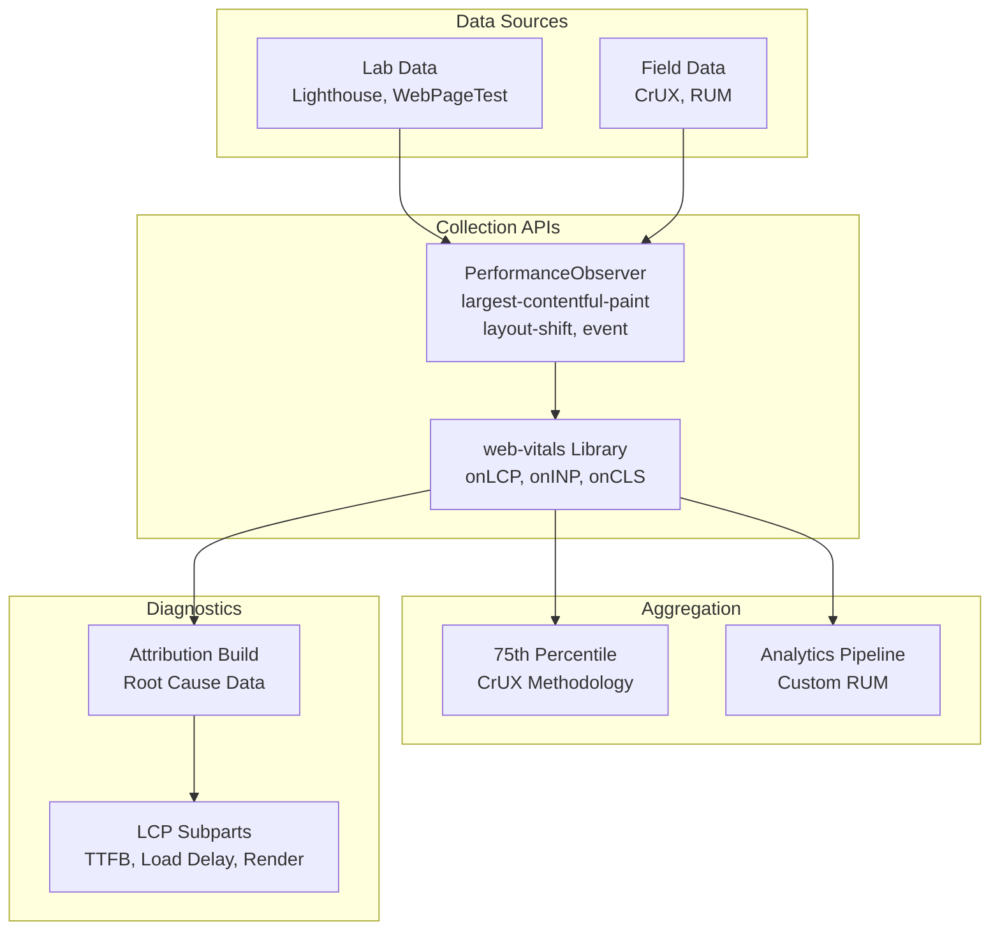

# Core Web Vitals Measurement: Lab vs Field Data

How to measure, interpret, and debug Core Web Vitals using lab tools, field data (Real User Monitoring), and the web-vitals library. Covers metric-specific diagnostics for LCP, INP, and CLS with implementation patterns for production RUM pipelines.

<figure>



<figcaption>Core Web Vitals measurement architecture: from browser APIs to analytics pipelines</figcaption>

</figure>

## Abstract

Core Web Vitals measurement splits into two fundamentally different contexts: **lab data** (synthetic, controlled) and **field data** (real users, variable conditions). Lab tools like Lighthouse provide reproducible diagnostics but cannot predict real-world performance—cache state, device diversity, and actual interaction patterns create systematic gaps. Field data from Chrome User Experience Report (CrUX) or custom Real User Monitoring (RUM) captures the 75th percentile experience that determines Google's ranking signals.

The mental model:

- **Lab data** answers "what's the best this page can do?" and "what changed in this deploy?"
- **Field data** answers "what are real users experiencing?" and "are we meeting Core Web Vitals thresholds?"
- **Attribution data** answers "why is this metric slow?" with element-level and timing-breakdown diagnostics

Each metric has distinct measurement nuances:

- **LCP** (Largest Contentful Paint): Four quantifiable subparts (Time to First Byte (TTFB), resource load delay, resource load time, element render delay)—median poor-LCP sites spend >50% of the 2.5s budget before the LCP resource even starts downloading
- **INP** (Interaction to Next Paint): Three-phase breakdown (input delay + processing time + presentation delay) with outlier filtering (ignores 1 per 50 interactions)
- **CLS** (Cumulative Layout Shift): Session windows with `hadRecentInput` exclusion—shifts within 500ms of user action are marked expected

The `web-vitals` library (v5.x) is the canonical implementation for RUM collection. Its attribution build adds ~1.5KB but provides root-cause data essential for debugging. For field data at scale, CrUX provides origin-level aggregates via BigQuery (monthly) and page-level data via the CrUX API (daily updates).

## Lab vs Field: Fundamental Differences

Lab and field data measure the same metrics but produce systematically different results. Understanding these differences is essential for interpreting measurements and prioritizing optimization work.

### Lab Data Characteristics

Lab tools (Lighthouse, WebPageTest, Chrome DevTools) run in controlled environments with predefined conditions:

| Parameter        | Typical Lab Setting                | Real-World Reality                     |
| ---------------- | ---------------------------------- | -------------------------------------- |
| **Network**      | 1.6 Mbps, 150ms RTT (simulated 4G) | Variable: 50 Mbps fiber to 100 Kbps 2G |
| **CPU**          | 4x throttling on fast desktop      | Low-end Android: actual 2-4 GFLOPS     |
| **Cache**        | Always cold (cleared before test)  | Often warm for returning visitors      |
| **Viewport**     | Fixed 412×823 (mobile) or 1350×940 | Diverse: 320px to 4K displays          |
| **Interactions** | None (or scripted clicks)          | Real user patterns, scroll depth       |

Lab data provides **reproducible baselines** and **regression detection** but cannot capture the diversity of real-world conditions. A Lighthouse score of 95 does not guarantee good field metrics.

### Field Data Characteristics

Field data from CrUX or custom RUM aggregates real user experiences:

- **28-day rolling average**: CrUX smooths daily variation but lags behind deploys
- **75th percentile**: The reported value means 75% of experiences were better—this is the threshold for "passing" Core Web Vitals
- **Traffic-weighted**: High-traffic pages dominate origin-level metrics
- **Cache-aware**: Returning visitors often have cached resources, improving LCP

> **Design rationale for 75th percentile**: Google chose p75 as a balance between capturing "most users" (median would miss the long tail) and being achievable (p95 would fail most sites on edge cases). The 75th percentile roughly corresponds to "the experience of users on slower connections or devices."

### When Lab and Field Diverge

Common scenarios where lab and field metrics differ significantly:

| Scenario                    | Lab Result                     | Field Result                 | Why                                         |
| --------------------------- | ------------------------------ | ---------------------------- | ------------------------------------------- |
| **Cached resources**        | Always misses cache            | Returning visitors hit cache | Field LCP can be much faster                |
| **Lazy-loaded images**      | Fixed viewport, limited scroll | Users scroll variably        | Field CLS includes shifts from lazy content |
| **Personalization**         | Static content                 | User-specific content        | Different LCP elements per user segment     |
| **Third-party scripts**     | May load fully                 | May be blocked (ad blockers) | Field may show better or worse performance  |
| **Geographic distribution** | Single origin location         | Global user base             | Latency varies dramatically by region       |

**Practical guidance**: If you have both lab and field data for a page, prioritize field data for understanding user experience. Use lab data for debugging specific issues and validating fixes before deploy.

## Measurement APIs and the web-vitals Library

### PerformanceObserver Entry Types

The browser exposes Core Web Vitals through `PerformanceObserver` with specific entry types:

| Metric  | Entry Type                 | Key Properties                                                        |
| ------- | -------------------------- | --------------------------------------------------------------------- |
| **LCP** | `largest-contentful-paint` | `element`, `renderTime`, `loadTime`, `size`, `url`                    |
| **CLS** | `layout-shift`             | `value`, `hadRecentInput`, `sources[]`                                |
| **INP** | `event`                    | `startTime`, `processingStart`, `processingEnd`, `duration`, `target` |

Critical configuration details:

```ts title="performance-observer-setup.ts" collapse={1-2, 17-20}
// Basic LCP observation
const lcpObserver = new PerformanceObserver((list) => {
  const entries = list.getEntries()
  const lastEntry = entries[entries.length - 1]
  console.log("LCP candidate:", lastEntry.startTime, lastEntry.element)
})

// IMPORTANT: Use `type` not `entryTypes` when using buffered or durationThreshold
lcpObserver.observe({
  type: "largest-contentful-paint",
  buffered: true, // Retrieve entries from before observer was created
})

// For event timing (INP), lower threshold captures more interactions
const eventObserver = new PerformanceObserver((list) => {
  /* ... */
})
eventObserver.observe({
  type: "event",
  durationThreshold: 16, // Default is 104ms; minimum is 16ms (one frame at 60fps)
  buffered: true,
})
```

**Why `type` instead of `entryTypes`?** The `buffered` and `durationThreshold` options only work with `type` (single entry type). Using `entryTypes` (array) silently ignores these options—a common source of bugs in RUM implementations.

**`durationThreshold` design**: The default 104ms threshold (first multiple of 8 above 100ms) filters out brief interactions that don't indicate responsiveness problems. The 8ms granularity exists for security (mitigates timing attacks). For comprehensive measurement, set `durationThreshold: 16` (minimum, one frame at 60fps).

### The web-vitals Library

Google's `web-vitals` library (v5.x, ~2KB brotli) provides the canonical implementation of metric collection:

```ts title="web-vitals-basic.ts" collapse={1-2, 15-20}
import { onLCP, onINP, onCLS, onTTFB, onFCP } from "web-vitals"

// Each callback receives a metric object with:
// - name: 'LCP' | 'INP' | 'CLS' | etc.
// - value: The metric value
// - delta: Change since last report (important for CLS)
// - id: Unique identifier for this page load
// - rating: 'good' | 'needs-improvement' | 'poor'
// - entries: Array of PerformanceEntry objects

onLCP((metric) => {
  sendToAnalytics({ name: metric.name, value: metric.value, rating: metric.rating })
})

onINP((metric) => {
  /* ... */
})
onCLS((metric) => {
  /* ... */
})
```

**The `delta` property is critical for analytics**: CLS accumulates over the session. If you send `metric.value` on every callback, your aggregate CLS will be inflated. Always use `metric.delta` for analytics systems that sum values.

### Attribution Build for Debugging

The attribution build (~3.5KB brotli) adds diagnostic data essential for root-cause analysis:

```ts title="web-vitals-attribution.ts" collapse={1-3, 20-25}
import { onLCP, onINP, onCLS } from "web-vitals/attribution"

onLCP((metric) => {
  const { attribution } = metric
  console.log("LCP Element:", attribution.element)
  console.log("LCP URL:", attribution.url) // Image/video source if applicable

  // LCP subpart breakdown (see next section)
  console.log("TTFB:", attribution.timeToFirstByte)
  console.log("Resource Load Delay:", attribution.resourceLoadDelay)
  console.log("Resource Load Time:", attribution.resourceLoadTime)
  console.log("Element Render Delay:", attribution.elementRenderDelay)
})

onINP((metric) => {
  const { attribution } = metric
  console.log("Interaction target:", attribution.interactionTarget)
  console.log("Input delay:", attribution.inputDelay)
  console.log("Processing time:", attribution.processingDuration)
  console.log("Presentation delay:", attribution.presentationDelay)
})

onCLS((metric) => {
  const { attribution } = metric
  console.log("Largest shift target:", attribution.largestShiftTarget)
  console.log("Largest shift value:", attribution.largestShiftValue)
  console.log("Largest shift time:", attribution.largestShiftTime)
})
```

## LCP Measurement and Diagnostics

### Qualifying Elements

The W3C Largest Contentful Paint specification defines which elements can be LCP candidates:

- `` elements (including `` inside `<picture>`)
- `<image>` elements inside SVG
- `<video>` elements (poster image)
- Elements with `background-image` via CSS
- Block-level elements containing text nodes

**Exclusions** (elements that cannot be LCP):

- Elements with `opacity: 0`
- Elements covering the full viewport (treated as background)
- Placeholder/low-quality images: images with file size < 0.004 bytes per pixel
- Elements that are scrolled out of the viewport before rendering completes

### LCP Subparts Breakdown

LCP can be decomposed into four measurable subparts, each pointing to different optimization strategies:

```
|← TTFB →|← Resource Load Delay →|← Resource Load Time →|← Element Render Delay →|
0        Server responds         Browser starts         Resource fully           LCP element
         with first byte         fetching LCP           downloaded               rendered
                                 resource
```

| Subpart                  | What It Measures                              | Optimization Target                     |
| ------------------------ | --------------------------------------------- | --------------------------------------- |
| **TTFB**                 | Server response time                          | Origin speed, CDN, caching              |
| **Resource Load Delay**  | Time from TTFB to starting LCP resource fetch | Resource discoverability, preload hints |
| **Resource Load Time**   | Download duration of LCP resource             | Image optimization, CDN                 |
| **Element Render Delay** | Time from download complete to paint          | Render-blocking JS/CSS, main thread     |

**Recommended distribution**: 40% TTFB, 40% Resource Load Time, 20% combined delays.

**Real-world finding**: Median poor-LCP sites have 1.3 seconds of Resource Load Delay—consuming over 50% of the 2.5s "good" budget before the LCP resource even starts downloading. This happens when the browser discovers the LCP image late (e.g., via JavaScript, CSS background, or deep in the DOM).

### LCP Measurement Code with Subparts

```ts title="lcp-diagnostics.ts" collapse={1-4, 25-30}
import { onLCP } from "web-vitals/attribution"

interface LCPDiagnostics {
  totalLCP: number
  ttfb: number
  resourceLoadDelay: number
  resourceLoadTime: number
  elementRenderDelay: number
  element: string
  url: string | null
}

onLCP((metric) => {
  const { attribution } = metric

  const diagnostics: LCPDiagnostics = {
    totalLCP: metric.value,
    ttfb: attribution.timeToFirstByte,
    resourceLoadDelay: attribution.resourceLoadDelay,
    resourceLoadTime: attribution.resourceLoadTime,
    elementRenderDelay: attribution.elementRenderDelay,
    element: attribution.element || "unknown",
    url: attribution.url || null,
  }

  // Identify which subpart is the bottleneck
  const subparts = [
    { name: "TTFB", value: diagnostics.ttfb },
    { name: "Resource Load Delay", value: diagnostics.resourceLoadDelay },
    { name: "Resource Load Time", value: diagnostics.resourceLoadTime },
    { name: "Element Render Delay", value: diagnostics.elementRenderDelay },
  ]

  const bottleneck = subparts.reduce((max, curr) => (curr.value > max.value ? curr : max))

  sendToAnalytics({
    ...diagnostics,
    bottleneck: bottleneck.name,
  })
})
```

## INP Measurement and Diagnostics

### The INP Processing Model

INP measures the latency of user interactions across the entire page session. Each interaction has three phases:

```
|← Input Delay →|← Processing Time →|← Presentation Delay →|
User action     Event handlers      Handlers complete,      Next frame
(click/key/     start running       browser computes        painted
 tap)                               layout/paint
```

| Phase                  | What It Measures                       | Common Causes of Slowness               |
| ---------------------- | -------------------------------------- | --------------------------------------- |
| **Input Delay**        | Time from user action to handler start | Main thread blocked by other tasks      |
| **Processing Time**    | Event handler execution duration       | Expensive handler logic, forced reflows |
| **Presentation Delay** | Time from handler end to visual update | Large DOM updates, layout thrashing     |

### Interaction Grouping

Multiple events from a single user action (e.g., `keydown`, `keypress`, `keyup` for a keystroke, or `pointerdown`, `pointerup`, `click` for a tap) are grouped into a single "interaction." The interaction's latency is the maximum duration among its events.

**Measured event types**: `click`, `keydown`, `keyup`, `pointerdown`, `pointerup`, `mousedown`, `mouseup`

**Excluded** (continuous events): `mousemove`, `pointermove`, `touchmove`, `scroll`, `wheel`

### Worst Interaction Selection with Outlier Handling

INP doesn't report the absolute worst interaction—it uses outlier filtering to prevent random hiccups from inflating the score:

- **<50 interactions**: INP = worst interaction latency
- **≥50 interactions**: INP ≈ 98th percentile (one outlier ignored per 50 interactions)

**Design rationale**: A generally responsive page with one 2-second interaction caused by a network glitch shouldn't fail INP. The outlier filtering approximates "typical worst-case" rather than "absolute worst-case."

**Implementation efficiency**: Browsers don't store all interactions. They maintain a small list (typically 10) of the worst-N interactions, sufficient for the p98 approximation without memory concerns on long sessions.

### INP Diagnostics Code

```ts title="inp-diagnostics.ts" collapse={1-4, 30-35}
import { onINP } from "web-vitals/attribution"

interface INPDiagnostics {
  totalINP: number
  inputDelay: number
  processingTime: number
  presentationDelay: number
  interactionTarget: string
  interactionType: string
}

onINP((metric) => {
  const { attribution } = metric

  const diagnostics: INPDiagnostics = {
    totalINP: metric.value,
    inputDelay: attribution.inputDelay,
    processingTime: attribution.processingDuration,
    presentationDelay: attribution.presentationDelay,
    interactionTarget: attribution.interactionTarget || "unknown",
    interactionType: attribution.interactionType || "unknown",
  }

  // Identify the dominant phase
  const phases = [
    { name: "inputDelay", value: diagnostics.inputDelay },
    { name: "processingTime", value: diagnostics.processingTime },
    { name: "presentationDelay", value: diagnostics.presentationDelay },
  ]

  const dominant = phases.reduce((max, curr) => (curr.value > max.value ? curr : max))

  // High input delay → main thread was blocked (long task)
  // High processing time → slow event handler
  // High presentation delay → expensive layout/paint after handler

  sendToAnalytics({
    ...diagnostics,
    dominantPhase: dominant.name,
    recommendation: getRecommendation(dominant.name),
  })
})

function getRecommendation(phase: string): string {
  switch (phase) {
    case "inputDelay":
      return "Break up long tasks with scheduler.yield()"
    case "processingTime":
      return "Optimize event handler or defer work"
    case "presentationDelay":
      return "Reduce DOM mutations, avoid forced reflows"
    default:
      return ""
  }
}
```

## CLS Measurement and Diagnostics

### Session Windows

CLS doesn't sum all layout shifts—it uses session windows to group related shifts:

- A **session window** starts with a layout shift and includes all shifts within 1 second of the previous shift
- Each window has a maximum duration of 5 seconds
- **CLS = maximum session window score** (not the sum of all windows)

**Design rationale**: Long-lived single-page applications (SPAs) would accumulate infinite CLS if all shifts were summed. Session windows capture "bursts" of instability while ignoring isolated, minor shifts spread across a long session.

### Expected vs Unexpected Shifts

The Layout Instability API marks shifts as "expected" (via `hadRecentInput: true`) when they occur within 500ms of discrete user input:

```ts title="cls-filtering.ts"
new PerformanceObserver((list) => {
  for (const entry of list.getEntries()) {
    // Skip shifts caused by user interaction
    if (entry.hadRecentInput) continue

    // Only count unexpected shifts
    reportCLSShift(entry.value, entry.sources)
  }
}).observe({ type: "layout-shift", buffered: true })
```

**Qualifying inputs for `hadRecentInput`**: `mousedown`, `keydown`, `pointerdown` (within 500ms before the shift)

**Why 500ms?** This window covers the typical delay between user action and resulting layout change (e.g., clicking an accordion). Shifts outside this window are considered "unexpected" and degrade user experience.

### Layout Shift Sources

Each `layout-shift` entry includes `sources[]` identifying which elements moved:

```ts title="cls-sources.ts" collapse={1-2}
interface LayoutShiftSource {
  node: Node | null // The element that shifted (may be null if removed)
  previousRect: DOMRectReadOnly // Position before shift
  currentRect: DOMRectReadOnly // Position after shift
}

// The shift value is calculated from the impact region:
// (intersection of viewport with union of previous and current rects)
// divided by viewport area, weighted by distance fraction
```

### CLS Diagnostics Code

```ts title="cls-diagnostics.ts" collapse={1-4, 25-30}
import { onCLS } from "web-vitals/attribution"

interface CLSDiagnostics {
  totalCLS: number
  largestShiftTarget: string
  largestShiftValue: number
  largestShiftTime: number
  shiftCount: number
}

onCLS((metric) => {
  const { attribution } = metric

  const diagnostics: CLSDiagnostics = {
    totalCLS: metric.value,
    largestShiftTarget: attribution.largestShiftTarget || "unknown",
    largestShiftValue: attribution.largestShiftValue,
    largestShiftTime: attribution.largestShiftTime,
    shiftCount: metric.entries.length,
  }

  // Common CLS culprits by element type
  const target = diagnostics.largestShiftTarget
  let cause = "unknown"

  if (target.includes("img")) cause = "Image without dimensions"
  else if (target.includes("iframe")) cause = "Embedded content resize"
  else if (target.includes("ad") || target.includes("banner")) cause = "Ad injection"
  else if (target.includes("font") || /^(p|h[1-6]|span)$/i.test(target)) cause = "Font swap"

  sendToAnalytics({ ...diagnostics, likelyCause: cause })
})
```

## Field Data: CrUX and RUM Pipelines

### Chrome User Experience Report (CrUX)

CrUX aggregates real Chrome user data and is the source of field metrics for Google Search ranking:

| Data Source            | Update Frequency                      | Data Granularity              | Use Case                                  |
| ---------------------- | ------------------------------------- | ----------------------------- | ----------------------------------------- |
| **CrUX API**           | Daily (~04:00 UTC)                    | Origin or page URL            | Real-time monitoring, CI/CD checks        |
| **CrUX History API**   | Weekly (Mondays)                      | Origin or page URL, 25+ weeks | Trend analysis, regression detection      |
| **BigQuery**           | Monthly (2nd Tuesday)                 | Origin only                   | Large-scale analysis, industry benchmarks |
| **PageSpeed Insights** | Daily (CrUX) + on-demand (Lighthouse) | Page URL                      | Combined lab + field, quick checks        |

### CrUX API Usage

```ts title="crux-api.ts" collapse={1-5, 30-40}
interface CrUXResponse {
  record: {
    key: { url?: string; origin?: string }
    metrics: {
      largest_contentful_paint: MetricData
      interaction_to_next_paint: MetricData
      cumulative_layout_shift: MetricData
    }
  }
}

interface MetricData {
  histogram: Array<{ start: number; end?: number; density: number }>
  percentiles: { p75: number }
}

async function queryCrUX(urlOrOrigin: string): Promise<CrUXResponse> {
  const isOrigin = !urlOrOrigin.includes("/", urlOrOrigin.indexOf("//") + 2)

  const response = await fetch(`https://chromeuxreport.googleapis.com/v1/records:queryRecord?key=${API_KEY}`, {
    method: "POST",
    headers: { "Content-Type": "application/json" },
    body: JSON.stringify({
      [isOrigin ? "origin" : "url"]: urlOrOrigin,
      formFactor: "PHONE", // Or 'DESKTOP', 'TABLET', or omit for all
    }),
  })

  return response.json()
}

// Rate limit: 150 queries/minute per Google Cloud project
// Data coverage: Requires sufficient traffic (anonymity threshold)
```

### Building a RUM Pipeline

Production RUM requires handling edge cases the web-vitals library doesn't solve:

```ts title="rum-pipeline.ts" collapse={1-8, 45-55}
import { onLCP, onINP, onCLS, onFCP, onTTFB } from "web-vitals/attribution"

interface RUMPayload {
  sessionId: string
  pageUrl: string
  timestamp: number
  metrics: Record<string, number>
  attribution: Record<string, unknown>
  metadata: {
    deviceType: string
    connectionType: string
    viewport: { width: number; height: number }
  }
}

// Generate stable session ID
const sessionId = crypto.randomUUID()

// Collect device/connection context
function getMetadata() {
  return {
    deviceType: /Mobi|Android/i.test(navigator.userAgent) ? "mobile" : "desktop",
    connectionType:
      (navigator as Navigator & { connection?: { effectiveType: string } }).connection?.effectiveType || "unknown",
    viewport: { width: window.innerWidth, height: window.innerHeight },
  }
}

// Batch and send metrics
const metricQueue: RUMPayload[] = []

function queueMetric(metric: { name: string; value: number; delta: number; attribution?: unknown }) {
  metricQueue.push({
    sessionId,
    pageUrl: window.location.href,
    timestamp: Date.now(),
    metrics: { [metric.name]: metric.delta }, // Use delta for CLS
    attribution: (metric.attribution as Record<string, unknown>) || {},
    metadata: getMetadata(),
  })
}

// Send on visibilitychange (page hide) for reliable delivery
document.addEventListener("visibilitychange", () => {
  if (document.visibilityState === "hidden" && metricQueue.length > 0) {
    navigator.sendBeacon("/analytics/rum", JSON.stringify(metricQueue))
    metricQueue.length = 0
  }
})

// Register metric callbacks
onLCP(queueMetric)
onINP(queueMetric)
onCLS(queueMetric)
onFCP(queueMetric)
onTTFB(queueMetric)
```

**Critical implementation details**:

1. **Use `delta` for CLS**: The value accumulates; sending full value inflates aggregates
2. **Send on `visibilitychange`**: Metrics finalize when the page is hidden; `beforeunload` is unreliable on mobile
3. **Use `sendBeacon`**: Survives page navigation, unlike `fetch`
4. **Include session/page context**: Enables segmentation by device, connection, page
5. **Batch requests**: Reduces beacon overhead, especially on mobile

### Aggregation and Alerting

For Core Web Vitals pass/fail determination, aggregate to the 75th percentile:

```ts title="aggregation.ts" collapse={1-3, 25-30}
interface MetricSample {
  value: number
  timestamp: number
}

function calculateP75(samples: MetricSample[]): number {
  if (samples.length === 0) return 0

  const sorted = [...samples].map((s) => s.value).sort((a, b) => a - b)
  const index = Math.ceil(sorted.length * 0.75) - 1
  return sorted[index]
}

// Thresholds for alerting
const CWV_THRESHOLDS = {
  LCP: { good: 2500, poor: 4000 },
  INP: { good: 200, poor: 500 },
  CLS: { good: 0.1, poor: 0.25 },
}

function getRating(metric: string, p75: number): "good" | "needs-improvement" | "poor" {
  const threshold = CWV_THRESHOLDS[metric as keyof typeof CWV_THRESHOLDS]
  if (p75 <= threshold.good) return "good"
  if (p75 <= threshold.poor) return "needs-improvement"
  return "poor"
}
```

## Debugging Workflow

### Step 1: Identify the Failing Metric

Start with PageSpeed Insights or CrUX API to identify which metric fails at p75:

```bash
# Quick check via PSI API
curl "https://www.googleapis.com/pagespeedonline/v5/runPagespeed?url=https://example.com&category=performance&key=YOUR_KEY"
```

### Step 2: Check Lab vs Field Gap

If lab passes but field fails, investigate:

| Symptom             | Likely Cause                                | Investigation                           |
| ------------------- | ------------------------------------------- | --------------------------------------- |
| **LCP lab < field** | Personalization, A/B tests, dynamic content | Check CrUX by device/connection segment |
| **INP not in lab**  | Lab doesn't capture real interactions       | Add RUM with attribution build          |
| **CLS lab < field** | Lazy-loaded content, ads, async widgets     | Test with populated cache and scroll    |

### Step 3: Use Attribution Data

For the failing metric, deploy the attribution build to RUM and identify:

- **LCP**: Which subpart dominates? (TTFB, load delay, load time, render delay)
- **INP**: Which phase dominates? (input delay, processing, presentation)
- **CLS**: Which element causes the largest shift? When in the page lifecycle?

### Step 4: Target Optimizations

| Metric  | Bottleneck                   | Optimization                                             |
| ------- | ---------------------------- | -------------------------------------------------------- |
| **LCP** | TTFB > 800ms                 | CDN, edge caching, server optimization                   |
| **LCP** | Resource Load Delay > 500ms  | Add `<link rel="preload">`, move image earlier in DOM    |
| **LCP** | Resource Load Time > 1s      | Image compression, responsive images, AVIF/WebP          |
| **LCP** | Element Render Delay > 200ms | Reduce render-blocking JS/CSS                            |
| **INP** | Input Delay > 100ms          | Break long tasks with `scheduler.yield()`                |
| **INP** | Processing Time > 100ms      | Optimize handler, defer non-critical work                |
| **INP** | Presentation Delay > 100ms   | Reduce DOM size, avoid layout thrashing                  |
| **CLS** | Font swap                    | Font metric overrides (`size-adjust`, `ascent-override`) |
| **CLS** | Images                       | Explicit `width`/`height` attributes, `aspect-ratio`     |
| **CLS** | Ads/embeds                   | Reserve space with CSS `min-height`                      |

## Conclusion

Core Web Vitals measurement requires understanding the fundamental difference between lab data (reproducible, diagnostic) and field data (real users, ranking signals). Lab tools cannot predict field performance due to cache state, device diversity, and actual user interaction patterns—but they're essential for debugging and regression testing.

The `web-vitals` library with attribution build provides the diagnostic detail needed to identify root causes. LCP breaks down into four subparts (TTFB, resource load delay, resource load time, element render delay), INP into three phases (input delay, processing time, presentation delay), and CLS into individual shifts with source elements.

For production monitoring, combine CrUX data (authoritative 75th percentile) with custom RUM (granular attribution data). Use CrUX for pass/fail status and trend analysis; use RUM attribution for debugging specific bottlenecks. The workflow is: identify failing metric → check lab/field gap → analyze attribution data → apply targeted optimization.

## Appendix

### Prerequisites

- Understanding of browser rendering pipeline (critical rendering path, paint, composite)
- Familiarity with PerformanceObserver API
- Basic knowledge of analytics data pipelines

### Terminology

- **CrUX**: Chrome User Experience Report—Google's public dataset of real user metrics from Chrome
- **RUM**: Real User Monitoring—collecting performance data from actual users in production
- **p75**: 75th percentile—the value below which 75% of samples fall
- **Attribution**: Diagnostic data identifying the root cause of a metric value

### Summary

- **Lab vs field**: Lab data answers "what's possible?"; field data answers "what are users experiencing?"—prioritize field data for Core Web Vitals assessment
- **web-vitals library v5.x**: Canonical implementation; use attribution build for debugging (~3.5KB)
- **LCP subparts**: TTFB, resource load delay, resource load time, element render delay—median poor-LCP sites have >50% of budget consumed before resource fetch starts
- **INP phases**: Input delay (main thread blocked), processing time (handler execution), presentation delay (layout/paint)—uses outlier filtering (1 per 50 interactions ignored)
- **CLS session windows**: Maximum 5 seconds, groups shifts within 1 second—`hadRecentInput` excludes user-initiated shifts within 500ms
- **CrUX data sources**: API (daily, page-level), History API (weekly, 25+ weeks), BigQuery (monthly, origin-only)

### References

**Specifications**

- [W3C Largest Contentful Paint](https://www.w3.org/TR/largest-contentful-paint/) - LCP definition, qualifying elements, timing
- [WICG Layout Instability](https://wicg.github.io/layout-instability/) - CLS calculation, session windows, hadRecentInput
- [W3C Event Timing](https://www.w3.org/TR/event-timing/) - Event duration measurement, INP basis
- [W3C Performance Timeline](https://w3c.github.io/performance-timeline/) - PerformanceObserver API

**Official Documentation**

- [web.dev Core Web Vitals](https://web.dev/articles/vitals) - Thresholds and measurement guidance
- [web.dev INP](https://web.dev/articles/inp) - INP definition, interaction model, thresholds
- [web.dev Lab vs Field Data](https://web.dev/articles/lab-and-field-data-differences) - When and why measurements differ
- [Chrome Developers CrUX API](https://developer.chrome.com/docs/crux/api/) - API usage, rate limits, data structure
- [Chrome Developers CrUX BigQuery](https://developer.chrome.com/docs/crux/bigquery/) - Dataset structure, query patterns
- [Chrome Developers CrUX History API](https://developer.chrome.com/docs/crux/history-api/) - Trend data access

**Implementation References**

- [GoogleChrome/web-vitals](https://github.com/GoogleChrome/web-vitals) - Official library, v5.x documentation
- [DebugBear LCP Subparts](https://www.debugbear.com/blog/lcp-subparts) - LCP timing breakdown methodology
- [web.dev Optimize INP](https://web.dev/articles/optimize-inp) - Phase-specific optimization strategies
