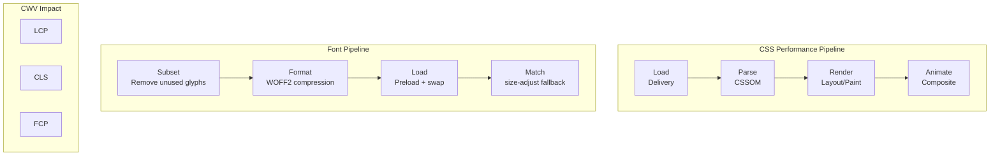

# CSS and Typography Performance Optimization

Master CSS delivery, critical CSS extraction, containment properties, and font optimization techniques including WOFF2, subsetting, variable fonts, and CLS-free loading strategies for optimal Core Web Vitals.

<figure>



<figcaption>CSS and typography optimization stages: delivery, parsing, rendering, and font loading</figcaption>

</figure>

## TLDR

**CSS and typography optimization** targets render-blocking resources, layout stability, and font loading. Proper optimization achieves sub-14KB critical CSS, zero-CLS font swaps, and 60fps animations.

### CSS Delivery

- **Critical CSS**: Inline above-the-fold styles (≤14KB compressed) to eliminate render-blocking request
- **Preload patterns**: `<link rel="preload" as="style">` with onload swap for non-critical CSS
- **Bundling strategy**: Global CSS + route-level chunks balances cache hits and payload size
- **Compression**: Gzip/Brotli achieves 70-95% reduction on CSS files

### CSS Runtime

- **CSS Containment**: `contain: layout paint style` isolates reflows to subtrees (20-40% savings)
- **content-visibility**: Skip rendering for off-screen content (up to 7× faster initial render)
- **will-change**: Hint browser to create compositor layer; use sparingly
- **Composite-only**: Only animate `transform` and `opacity` for GPU-accelerated 60fps

### Font Optimization

- **WOFF2 format**: 30% smaller than WOFF, 50% smaller than TTF; use for all modern browsers
- **Subsetting**: Remove unused glyphs with `pyftsubset`; typical 65-90% reduction
- **Variable fonts**: Single file with multiple weights; smaller than 3+ separate files
- **font-display**: `swap` for immediate text, `optional` for performance-first

### CLS Prevention

- **size-adjust**: Scale fallback font metrics to match custom font dimensions
- **ascent-override / descent-override**: Fine-tune vertical metrics alignment
- **Tools**: Fontaine, Capsize calculate override values automatically

## Part 1: CSS Delivery Optimization

### 1.1 Render-Blocking Fundamentals

Browsers block painting until all blocking stylesheets are fetched, parsed, and the CSSOM is built. This prevents flashes of unstyled content (FOUC) but adds to the critical rendering path.

| Technique               | Core Idea                     | Typical Win                      | Gotchas                             |
| ----------------------- | ----------------------------- | -------------------------------- | ----------------------------------- |
| Concatenate & Minify    | Merge files, strip whitespace | Fewer requests, ~20-40% byte cut | Cache-busting needed                |
| Gzip/Brotli Compression | Transfer-level reduction      | 70-95% smaller payloads          | Requires correct `Content-Encoding` |
| HTTP/2 Preload          | Supply CSS early              | Shorter first byte on slow RTT   | Risk of duplicate pushes            |

```html
<link rel="preload" href="/static/app.css" as="style" onload="this.onload=null;this.rel='stylesheet'" />
<noscript><link rel="stylesheet" href="/static/app.css" /></noscript>
```

### 1.2 Bundling Strategy

Bundling every style into one mega-file simplifies caching but couples cache busting for unrelated views. A hybrid approach balances cache hit rate and payload:

- **global.css**: Shared styles (layout, typography, components)
- **route-[name].css**: Route-specific styles loaded on demand

### 1.3 Critical CSS Extraction

Inlining just the above-the-fold rules eliminates a full round-trip, shrinking First Contentful Paint (FCP) by hundreds of milliseconds on 4G.

**Target**: ≤14KB compressed critical CSS

**Tooling Workflow:**

1. Crawl HTML at target viewports (`critical`, `Penthouse`, or Chrome Coverage)
2. Inline output into `<style>` in the document `<head>`
3. Defer the full sheet with `media="print"` swap pattern

```bash
npx critical index.html \
  --width 360 --height 640 \
  --inline --minify \
  --extract
```

**Generated output:**

```html
<style id="critical">
  /* minified critical rules */
  header {
    display: flex;
    align-items: center;
  }
  /* ... */
</style>

<link rel="stylesheet" href="/static/app.css" media="print" onload="this.media='all'" />
```

**Trade-offs:**

- **Pros**: Faster FCP/LCP, Lighthouse "Eliminate render-blocking" pass
- **Cons**: Inline styles increase HTML size and disable CSS caching for those bytes; multi-route apps need per-page extraction

## Part 2: CSS Runtime Optimization

### 2.1 CSS Containment

The `contain` property instructs the engine to scope layout, paint, style, and size computations to a subtree.

```css
.card {
  contain: layout paint style;
}
```

- **layout**: Changes inside `.card` won't trigger ancestor reflow
- **paint**: Off-screen subtrees are skipped, preventing unnecessary raster work
- **size**: Parent layout ignores intrinsic size of children until needed

**Benefits**: Large lists, dashboards, ad slots see 20-40% layout savings.

**Limitations**: Breaking out of containment for positioned elements or overflow requires additional rules; not supported in IE.

### 2.2 content-visibility

Extends containment with lazy rendering; `content-visibility: auto` skips layout/paint until the element nears viewport.

```css
.section {
  content-visibility: auto;
  contain-intrinsic-size: 0 1000px; /* reserve space */
}
```

- Gains up to 7× faster initial render on long documents
- Must specify `contain-intrinsic-size` to avoid layout shifts
- Now Baseline available (September 2025) across all major browsers

### 2.3 will-change

A hint for future property transitions so the engine can promote layers upfront.

```css
.modal {
  will-change: transform, opacity;
}
```

**Use carefully**: Over-using `will-change` burns memory; browsers ignore hints beyond a surface-area budget. Apply dynamically via JS just before animation and remove after.

### 2.4 Compositor-Friendly Animations

Animate only **opacity** and **transform** to stay on the compositor thread, avoiding reflow and paint. Layout-affecting properties (`top`, `left`, `width`, `height`, `margin`) force main-thread work.

```css
/* Good: Compositor-only */
.modal-enter {
  transform: translateY(100%);
  opacity: 0;
}

.modal-enter-active {
  transform: translateY(0);
  opacity: 1;
  transition:
    transform 300ms ease,
    opacity 300ms ease;
}

/* Bad: Triggers layout */
.modal-enter-bad {
  top: 100%;
}

.modal-enter-active-bad {
  top: 0;
  transition: top 300ms ease;
}
```

### 2.5 CSS Houdini Paint Worklet

Paint Worklets allow JS-generated backgrounds executed off-main-thread.

```javascript
// checkerboard.js
registerPaint(
  "checker",
  class {
    paint(ctx, geom) {
      const s = 16
      for (let y = 0; y < geom.height; y += s) for (let x = 0; x < geom.width; x += s) ctx.fillRect(x, y, s, s)
    }
  },
)
```

```html
<script>
  CSS.paintWorklet.addModule("/checkerboard.js")
</script>
```

```css
.widget {
  background: paint(checker);
}
```

**Performance**: Runs in dedicated worklet thread; Chrome 65+, FF/Safari via polyfill.

### 2.6 CSS Size & Selector Efficiency

| Optimization                     | How It Helps                             | Caveats                                               |
| -------------------------------- | ---------------------------------------- | ----------------------------------------------------- |
| Tree-shaking (PurgeCSS, @unocss) | Removes dead selectors; 60-90% reduction | Needs whitelisting for dynamic classes                |
| Selector simplicity              | Short selectors reduce matching time     | Micro-optimization rarely measurable until >10k nodes |
| Non-inheriting custom properties | Faster style recalculation (<5 µs)       | Unsupported in Firefox < 105                          |

```css
/* Efficient: simple, non-chained */
.card-title {
}

/* Inefficient: deeply nested */
.container > .content > .card > .header > .title {
}
```

## Part 3: Font Asset Optimization

### 3.1 The Modern Font Format: WOFF2

WOFF2 uses Brotli compression, achieving 30% smaller files than WOFF and 50% smaller than TTF.

| Format  | Compression | Size vs TTF    | Browser Support   | Recommendation |
| ------- | ----------- | -------------- | ----------------- | -------------- |
| WOFF2   | Brotli      | 50-60% smaller | All modern (>96%) | Primary choice |
| WOFF    | zlib/Flate  | ~40% smaller   | Wide legacy       | Fallback only  |
| TTF/OTF | None        | Baseline       | Legacy            | Avoid for web  |

**Modern declaration:**

```css
@font-face {
  font-family: "MyOptimizedFont";
  font-style: normal;
  font-weight: 400;
  font-display: swap;
  src: url("/fonts/my-optimized-font.woff2") format("woff2");
}
```

### 3.2 Font Subsetting

Subsetting removes unused glyphs, achieving 65-90% file size reduction.

**Strategies:**

**Language-based subsetting:**

```css
@font-face {
  font-family: "MyMultilingualFont";
  src: url("/fonts/my-font-latin.woff2") format("woff2");
  unicode-range:
    U+0000-00FF, U+0131, U+0152-0153, U+02BB-02BC, U+02C6, U+02DA, U+02DC, U+2000-206F, U+2074, U+20AC, U+2122;
}

@font-face {
  font-family: "MyMultilingualFont";
  src: url("/fonts/my-font-cyrillic.woff2") format("woff2");
  unicode-range: U+0400-045F, U+0490-0491, U+04B0-04B1, U+2116;
}
```

**Using pyftsubset:**

```bash
pyftsubset SourceSansPro.ttf \
  --output-file="SourceSansPro-subset.woff2" \
  --flavor=woff2 \
  --layout-features='*' \
  --unicodes="U+0020-007E,U+2018,U+2019,U+201C,U+201D,U+2026"
```

**Critical considerations:**

- Check font EULA permits subsetting (modification)
- Dynamic content may introduce missing glyphs (tofu boxes)
- Use `glyphhanger` for automated analysis

### 3.3 Variable Fonts

Variable fonts consolidate multiple weights/styles into a single file, reducing requests and often total bytes.

**Size comparison (Source Sans Pro):**

- All static weights (OTF): 1,170 KB
- Variable font (OTF): 405 KB
- Variable font (WOFF2): 112 KB

**Declaration:**

```css
@font-face {
  font-family: "MyVariableFont";
  src:
    url("MyVariableFont.woff2") format("woff2-variations"),
    url("MyVariableFont.woff2") format("woff2 supports variations");
  font-weight: 100 900;
  font-stretch: 75% 125%;
  font-style: normal;
}
```

**Usage:**

```css
h1 {
  font-family: "MyVariableFont", sans-serif;
  font-weight: 785; /* Any value in range */
}

.condensed {
  font-stretch: 85%;
}
```

**Browser fallback:**

```css title="variable-font-fallback.css" collapse={1-14}
/* Static fonts for legacy browsers */
@font-face {
  font-family: "MyStaticFallback";
  src: url("MyStatic-Regular.woff2") format("woff2");
  font-weight: 400;
}
@font-face {
  font-family: "MyStaticFallback";
  src: url("MyStatic-Bold.woff2") format("woff2");
  font-weight: 700;
}

body {
  font-family: "MyStaticFallback", sans-serif;
}

/* Variable font for modern browsers */
@supports (font-variation-settings: normal) {
  @font-face {
    font-family: "MyVariableFont";
    src: url("MyVariableFont.woff2") format("woff2-variations");
    font-weight: 100 900;
  }

  body {
    font-family: "MyVariableFont", sans-serif;
  }
}
```

## Part 4: Font Loading Strategies

### 4.1 Self-Hosting vs Third-Party

**The shared cache myth is dead**: Browser cache partitioning (Chrome, Safari) means Google Fonts no longer benefit from cross-site caching. Each site downloads fonts independently.

**Benefits of self-hosting:**

- Eliminates third-party connection overhead (DNS + TCP + TLS)
- Full control over caching headers
- GDPR/privacy compliance (no third-party requests)
- Ability to subset exactly as needed

### 4.2 Strategic Preloading

Preload critical fonts to discover them early:

```html
<head>
  <link rel="preload" href="/fonts/critical-heading-font.woff2" as="font" type="font/woff2" crossorigin="anonymous" />
</head>
```

**Critical attributes:**

- `as="font"`: Correct prioritization and caching
- `type="font/woff2"`: Skip preload if format unsupported
- `crossorigin`: **Required** even for same-origin fonts (CORS mode)

**Warning**: Only preload critical fonts. Preloading too many creates contention.

### 4.3 font-display Strategies

| Value      | Block Period     | Swap Period | Behavior          | CWV Impact         | Use Case                      |
| ---------- | ---------------- | ----------- | ----------------- | ------------------ | ----------------------------- |
| `block`    | Short (~3s)      | Infinite    | FOIT              | Bad FCP/LCP        | Icon fonts                    |
| `swap`     | Minimal (~100ms) | Infinite    | FOUT              | Good FCP, risk CLS | Headlines with CLS mitigation |
| `fallback` | ~100ms           | ~3s         | Compromise        | Balanced           | Body text                     |
| `optional` | ~100ms           | None        | Performance-first | Excellent CLS      | Non-critical text             |

**Strategy alignment:**

- Preloaded fonts → `font-display: swap` (with CLS mitigation)
- Non-preloaded fonts → `font-display: optional`

```css
/* Critical heading font - preloaded */
@font-face {
  font-family: "HeadingFont";
  font-display: swap;
  src: url("/fonts/heading.woff2") format("woff2");
}

/* Body font - not preloaded */
@font-face {
  font-family: "BodyFont";
  font-display: optional;
  src: url("/fonts/body.woff2") format("woff2");
}
```

### 4.4 Preconnect for Third-Party

If using Google Fonts or other CDNs:

```html
<head>
  <link rel="preconnect" href="https://fonts.googleapis.com" />
  <link rel="preconnect" href="https://fonts.gstatic.com" crossorigin />
</head>
```

## Part 5: Eliminating Font-Induced CLS

### 5.1 The Root Cause

CLS occurs when fallback and custom fonts have different dimensions. When `font-display: swap` triggers the swap, text reflows and content shifts.

### 5.2 Font Metric Overrides

Use CSS descriptors to force fallback fonts to match custom font dimensions:

- **size-adjust**: Scale overall glyph size
- **ascent-override**: Space above baseline
- **descent-override**: Space below baseline
- **line-gap-override**: Extra space between lines

### 5.3 Implementation

**Step 1: Define the web font:**

```css
@font-face {
  font-family: "Inter";
  font-style: normal;
  font-weight: 400;
  font-display: swap;
  src: url("/fonts/inter-regular.woff2") format("woff2");
}
```

**Step 2: Create metrics-adjusted fallback:**

```css
@font-face {
  font-family: "Inter-Fallback";
  src: local("Arial");
  ascent-override: 90.2%;
  descent-override: 22.48%;
  line-gap-override: 0%;
  size-adjust: 107.4%;
}
```

**Step 3: Use both in font stack:**

```css
body {
  font-family: "Inter", "Inter-Fallback", sans-serif;
}
```

**Result**: Arial renders with Inter's dimensions. When Inter loads, no layout shift occurs.

### 5.4 Automated Solutions

**Tools for calculating overrides:**

- [Fallback Font Generator](https://screenspan.net/fallback)
- [Capsize](https://seek-oss.github.io/capsize/)
- Fontaine (Node.js library)

**Framework integration:**

- **Next.js**: `@next/font` automatically calculates and injects fallback fonts
- **Nuxt.js**: `@nuxtjs/fontaine` module provides automatic fallback generation

## Part 6: Build-Time Processing

### 6.1 Pre- vs Post-Processing

- **Preprocessors (Sass, Less)**: Add variables/mixins but increase build complexity
- **PostCSS**: Autoprefixing, minification (`cssnano`), media query packing with negligible runtime cost

### 6.2 CSS-in-JS Considerations

Runtime CSS-in-JS (styled-components, Emotion) generates and parses CSS in JS bundles, adding 50-200ms scripting cost per route.

**Static extraction alternatives:**

- Linaria
- vanilla-extract
- Panda CSS

These compile to CSS at build time, regaining performance while retaining component-scoped authoring.

## Part 7: Measurement & Diagnostics

### 7.1 DevTools Analysis

- **Performance > Selector Stats**: Match attempts vs hits for slow selectors
- **Coverage tab**: Unused CSS per route for pruning
- **Network panel**: Font loading waterfall and timing

### 7.2 Lighthouse Audits

- Render-blocking resources
- Unused CSS
- Font display strategy
- CLS attribution (font-related shifts)

### 7.3 Custom Metrics

```javascript title="performance-monitoring.js"
// Monitor font loading
const fontObserver = new PerformanceObserver((list) => {
  list.getEntries().forEach((entry) => {
    if (entry.initiatorType === "css" && entry.name.includes("font")) {
      console.log(`Font loaded: ${entry.name}`)
      console.log(`Load time: ${entry.responseEnd - entry.startTime}ms`)
    }
  })
})
fontObserver.observe({ type: "resource" })

// Monitor layout shifts
const clsObserver = new PerformanceObserver((list) => {
  list.getEntries().forEach((entry) => {
    if (!entry.hadRecentInput) {
      console.log(`Layout shift: ${entry.value}`)
      // Log font-related shifts
      entry.sources?.forEach((source) => {
        if (source.node?.tagName === "P" || source.node?.tagName === "H1") {
          console.log("Possible font-induced CLS")
        }
      })
    }
  })
})
clsObserver.observe({ type: "layout-shift" })
```

## Implementation Checklist

### CSS Delivery

- [ ] Extract and inline critical CSS (≤14KB compressed)
- [ ] Defer non-critical CSS with media="print" swap
- [ ] Configure Gzip/Brotli compression
- [ ] Implement route-based CSS splitting

### CSS Runtime

- [ ] Apply `contain: layout paint style` to independent components
- [ ] Use `content-visibility: auto` for off-screen sections
- [ ] Animate only `transform` and `opacity`
- [ ] Use `will-change` sparingly and remove after animation

### Font Assets

- [ ] Convert to WOFF2 format
- [ ] Subset fonts for target languages
- [ ] Evaluate variable fonts for 3+ weight variants
- [ ] Target ≤100KB total font payload

### Font Loading

- [ ] Self-host fonts for control and privacy
- [ ] Preload critical fonts with crossorigin attribute
- [ ] Use appropriate font-display values
- [ ] Implement font metric overrides for zero-CLS

### Monitoring

- [ ] Track CSS coverage and remove unused rules
- [ ] Monitor font-related CLS in production
- [ ] Set up alerts for font loading regressions

## Performance Budget

| Resource          | Target | Notes                    |
| ----------------- | ------ | ------------------------ |
| Critical CSS      | ≤14KB  | Fits in first TCP packet |
| Total CSS         | ≤50KB  | After compression        |
| Total fonts       | ≤100KB | Critical fonts only      |
| Max font families | 2-3    | Variable fonts preferred |

## Summary

1. **Load fast**: Minify, compress, split, and inline critical CSS ≤14KB
2. **Render smart**: Apply `contain`/`content-visibility` to independent sections
3. **Animate on compositor**: Stick to `opacity`/`transform`, use Worklets for custom effects
4. **Optimize fonts**: WOFF2 + subsetting + variable fonts
5. **Eliminate CLS**: Font metric overrides for dimensionally identical fallbacks
6. **Ship less CSS**: Tree-shake frameworks, keep selectors flat

## References

- [CSS Containment - MDN](https://developer.mozilla.org/en-US/docs/Web/CSS/CSS_containment) - Containment and content-visibility
- [will-change - MDN](https://developer.mozilla.org/en-US/docs/Web/CSS/will-change) - Animation optimization hints
- [Critical CSS](https://web.dev/articles/extract-critical-css) - Extracting and inlining critical CSS
- [content-visibility](https://web.dev/articles/content-visibility) - Lazy rendering for better performance
- [Chrome DevTools Coverage](https://developer.chrome.com/docs/devtools/coverage) - Finding unused CSS
- [WOFF2 Specification](https://www.w3.org/TR/WOFF2/) - W3C Web Open Font Format 2.0
- [Variable Fonts - MDN](https://developer.mozilla.org/en-US/docs/Web/CSS/CSS_fonts/Variable_fonts_guide) - Variable fonts guide
- [font-display - MDN](https://developer.mozilla.org/en-US/docs/Web/CSS/@font-face/font-display) - Font loading behavior control
- [Font Metric Overrides - web.dev](https://web.dev/articles/css-size-adjust) - Preventing CLS with size-adjust
- [pyftsubset](https://fonttools.readthedocs.io/en/latest/subset/) - Font subsetting tool
- [Fallback Font Generator](https://screenspan.net/fallback) - Calculate font metric overrides
