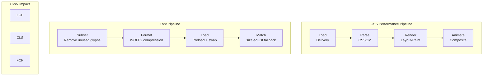
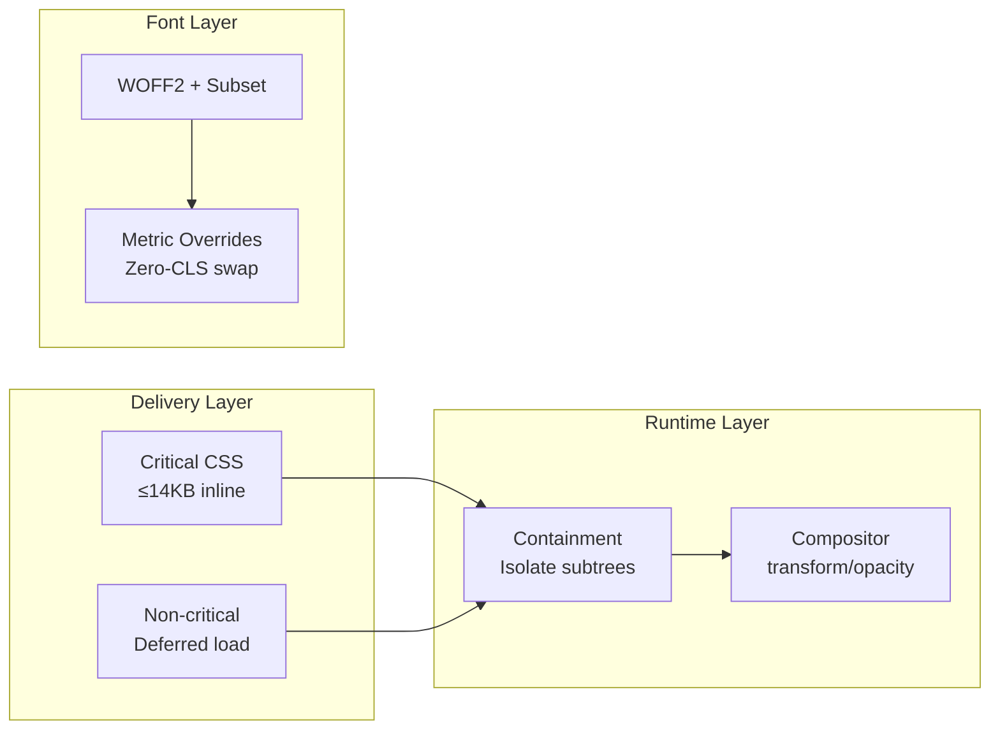

# CSS and Typography Performance Optimization

Master CSS delivery, critical CSS extraction, containment properties, and font optimization techniques including WOFF2, subsetting, variable fonts, and CLS-free loading strategies for optimal Core Web Vitals.

<figure>



<figcaption>CSS and typography optimization stages: delivery, parsing, rendering, and font loading</figcaption>

</figure>

## Abstract

CSS and typography performance follows a layered optimization model:

<figure>



<figcaption>Three optimization layers: delivery eliminates round-trips, runtime isolates layout work, fonts prevent layout shifts</figcaption>

</figure>

**Core mental model**: CSS is render-blocking by design—browsers must build the CSSOM before first paint. Every optimization either reduces blocking time (critical CSS, compression), reduces layout scope (containment), or prevents reflows (compositor animations, font metrics).

**The 14KB threshold** persists even with HTTP/2 and HTTP/3 because TCP slow start's initial congestion window remains ~10 packets (14,600 bytes). Critical CSS fitting this budget renders in the first round-trip.

**Font-induced CLS** occurs because fallback and custom fonts have different metrics. The solution isn't avoiding `font-display: swap`, but making the swap dimensionally identical through metric overrides (`size-adjust`, `ascent-override`).

**Browser support context (as of 2026)**: `content-visibility` is Baseline available (September 2025). Font metric overrides (`ascent-override`, `descent-override`, `line-gap-override`) are NOT Baseline—Safari lacks support. CSS Paint API (Houdini) remains experimental—Firefox has no native support.

## Part 1: CSS Delivery Optimization

### 1.1 Render-Blocking Fundamentals

Browsers block painting until all blocking stylesheets are fetched, parsed, and the CSS Object Model (CSSOM) is built. This prevents flashes of unstyled content (FOUC) but adds to the critical rendering path.

**Design rationale**: The browser intentionally blocks rendering rather than showing unstyled content because partial styling creates worse UX than a brief delay. This blocking behavior is the reason CSS delivery optimization matters—unlike scripts which can be `async`/`defer`, stylesheets are blocking by default.

| Technique               | Core Idea                     | Typical Win                      | Gotchas                             |
| ----------------------- | ----------------------------- | -------------------------------- | ----------------------------------- |
| Concatenate & Minify    | Merge files, strip whitespace | Fewer requests, ~20-40% byte cut | Cache-busting needed                |
| Gzip/Brotli Compression | Transfer-level reduction      | 70-95% smaller payloads          | Requires correct `Content-Encoding` |
| HTTP/2 Preload          | Supply CSS early              | Shorter first byte on slow RTT   | Risk of duplicate pushes            |

```html
<link rel="preload" href="/static/app.css" as="style" onload="this.onload=null;this.rel='stylesheet'" />
<noscript><link rel="stylesheet" href="/static/app.css" /></noscript>
```

### 1.2 Bundling Strategy

Bundling every style into one mega-file simplifies caching but couples cache busting for unrelated views. A hybrid approach balances cache hit rate and payload:

- **global.css**: Shared styles (layout, typography, components)
- **route-[name].css**: Route-specific styles loaded on demand

### 1.3 Critical CSS Extraction

Inlining just the above-the-fold rules eliminates a full round-trip, shrinking First Contentful Paint (FCP) by hundreds of milliseconds on 4G.

**Target**: ≤14KB compressed critical CSS (fits within TCP slow start's initial congestion window of ~10 packets)

**Why 14KB persists with HTTP/2 and HTTP/3**: Despite multiplexing improvements, TCP slow start still limits the initial congestion window. HTTP/3's QUIC uses the same 14KB recommendation. The first round-trip can only carry ~14,600 bytes, making this threshold transport-protocol agnostic.

**Tooling Workflow:**

1. Crawl HTML at target viewports (`critical`, `Penthouse`, or Chrome Coverage)
2. Inline output into `<style>` in the document `<head>`
3. Defer the full sheet with `media="print"` swap pattern

```bash
npx critical index.html \
  --width 360 --height 640 \
  --inline --minify \
  --extract
```

**Generated output:**

```html
<style id="critical">
  /* minified critical rules */
  header {
    display: flex;
    align-items: center;
  }
  /* ... */
</style>

<link rel="stylesheet" href="/static/app.css" media="print" onload="this.media='all'" />
```

**Trade-offs:**

- **Pros**: Faster FCP/LCP, Lighthouse "Eliminate render-blocking" pass
- **Cons**: Inline styles increase HTML size and disable CSS caching for those bytes; multi-route apps need per-page extraction

## Part 2: CSS Runtime Optimization

### 2.1 CSS Containment

The `contain` property instructs the engine to scope layout, paint, style, and size computations to a subtree.

```css
.card {
  contain: layout paint style;
}
```

- **layout**: Changes inside `.card` won't trigger ancestor reflow
- **paint**: Off-screen subtrees are skipped, preventing unnecessary raster work
- **size**: Parent layout ignores intrinsic size of children until needed

**Benefits**: Large lists, dashboards, ad slots see 20-40% layout savings.

**Limitations**: Breaking out of containment for positioned elements or overflow requires additional rules; not supported in IE.

### 2.2 content-visibility

Extends containment with lazy rendering; `content-visibility: auto` skips layout and paint until the element approaches the viewport.

```css
.section {
  content-visibility: auto;
  contain-intrinsic-size: auto 1000px; /* reserve space, remember actual size */
}
```

- Gains up to 7× faster initial render on long documents (tested: 232ms → 30ms)
- Must specify `contain-intrinsic-size` to reserve space and avoid layout shifts during scroll
- **Baseline available** (September 2025): Chrome 85+, Firefox 125+, Safari 18+

**The `auto` keyword in `contain-intrinsic-size`**: Using `auto 1000px` tells the browser to use the last-rendered size once known, falling back to 1000px initially. This provides better scroll behavior than a fixed placeholder.

**Design rationale**: The browser skips rendering for off-screen elements entirely—no layout calculation, no paint, no compositor layers. When the user scrolls near the element, rendering happens just-in-time. This trades scroll-time computation for faster initial paint.

> **Prior to September 2025**: Firefox had `content-visibility` disabled by default (versions 109-124). Safari lacked support entirely. Cross-browser use required feature detection or polyfills.

### 2.3 will-change

A hint for future property transitions so the engine can promote layers upfront.

```css
.modal {
  will-change: transform, opacity;
}
```

**Use carefully**: `will-change` is a **last resort** for existing performance problems, not a preventive measure. Over-using it:

- Burns GPU memory (each promoted layer consumes video memory)
- Can cause composition overhead that outweighs benefits
- Browsers ignore hints beyond a surface-area budget

**Recommended pattern**: Toggle via JavaScript, not static CSS:

```javascript title="will-change-toggle.js" collapse={1-2, 10-15}
const modal = document.querySelector(".modal")

// Apply before animation starts
modal.addEventListener("mouseenter", () => {
  modal.style.willChange = "transform, opacity"
})

// Remove after animation completes
modal.addEventListener("animationend", () => {
  modal.style.willChange = "auto"
})
```

**When static CSS is acceptable**: Predictable, frequent animations like slide decks or page-flip interfaces where the element will definitely animate on interaction.

### 2.4 Compositor-Friendly Animations

Animate only **opacity** and **transform** to stay on the compositor thread, avoiding reflow and paint. Layout-affecting properties (`top`, `left`, `width`, `height`, `margin`) force main-thread work.

```css
/* Good: Compositor-only */
.modal-enter {
  transform: translateY(100%);
  opacity: 0;
}

.modal-enter-active {
  transform: translateY(0);
  opacity: 1;
  transition:
    transform 300ms ease,
    opacity 300ms ease;
}

/* Bad: Triggers layout */
.modal-enter-bad {
  top: 100%;
}

.modal-enter-active-bad {
  top: 0;
  transition: top 300ms ease;
}
```

### 2.5 CSS Houdini Paint Worklet

Paint Worklets allow JavaScript-generated backgrounds executed off-main-thread. The CSS Paint API enables custom rendering without DOM overhead.

```javascript title="checkerboard.js" collapse={1-2}
// checkerboard.js - Paint Worklet module
registerPaint(
  "checker",
  class {
    paint(ctx, geom) {
      const s = 16
      for (let y = 0; y < geom.height; y += s) for (let x = 0; x < geom.width; x += s) ctx.fillRect(x, y, s, s)
    }
  },
)
```

```html
<script>
  CSS.paintWorklet.addModule("/checkerboard.js")
</script>
```

```css
.widget {
  background: paint(checker);
}
```

**Browser Support (NOT Baseline)**:

| Browser | Status            | Notes                              |
| ------- | ----------------- | ---------------------------------- |
| Chrome  | Full support      | 65+ (April 2018)                   |
| Edge    | Full support      | 79+                                |
| Firefox | **Not supported** | Under consideration (Bug #1302328) |
| Safari  | **Partial**       | Development stage, experimental    |

**Recommendation**: Treat CSS Paint API as experimental. Use the [CSS Paint Polyfill](https://github.com/GoogleChromeLabs/css-paint-polyfill) by Chrome DevRel for cross-browser support, but consider it progressive enhancement rather than core functionality. The polyfill leverages `-webkit-canvas()` and `-moz-element()` for optimized rendering in non-supporting browsers.

### 2.6 CSS Size & Selector Efficiency

| Optimization                     | How It Helps                             | Caveats                                               |
| -------------------------------- | ---------------------------------------- | ----------------------------------------------------- |
| Tree-shaking (PurgeCSS, @unocss) | Removes dead selectors; 60-90% reduction | Needs whitelisting for dynamic classes                |
| Selector simplicity              | Short selectors reduce matching time     | Micro-optimization rarely measurable until >10k nodes |
| Non-inheriting custom properties | Faster style recalculation (<5 µs)       | Unsupported in Firefox < 105                          |

```css
/* Efficient: simple, non-chained */
.card-title {
}

/* Inefficient: deeply nested */
.container > .content > .card > .header > .title {
}
```

## Part 3: Font Asset Optimization

### 3.1 The Modern Font Format: WOFF2

WOFF2 uses Brotli compression, achieving 30% smaller files than WOFF and 50% smaller than TTF.

| Format  | Compression | Size vs TTF    | Browser Support   | Recommendation |
| ------- | ----------- | -------------- | ----------------- | -------------- |
| WOFF2   | Brotli      | 50-60% smaller | All modern (>96%) | Primary choice |
| WOFF    | zlib/Flate  | ~40% smaller   | Wide legacy       | Fallback only  |
| TTF/OTF | None        | Baseline       | Legacy            | Avoid for web  |

**Modern declaration:**

```css
@font-face {
  font-family: "MyOptimizedFont";
  font-style: normal;
  font-weight: 400;
  font-display: swap;
  src: url("/fonts/my-optimized-font.woff2") format("woff2");
}
```

### 3.2 Font Subsetting

Subsetting removes unused glyphs, achieving 65-90% file size reduction.

**Strategies:**

**Language-based subsetting:**

```css
@font-face {
  font-family: "MyMultilingualFont";
  src: url("/fonts/my-font-latin.woff2") format("woff2");
  unicode-range:
    U+0000-00FF, U+0131, U+0152-0153, U+02BB-02BC, U+02C6, U+02DA, U+02DC, U+2000-206F, U+2074, U+20AC, U+2122;
}

@font-face {
  font-family: "MyMultilingualFont";
  src: url("/fonts/my-font-cyrillic.woff2") format("woff2");
  unicode-range: U+0400-045F, U+0490-0491, U+04B0-04B1, U+2116;
}
```

**Using pyftsubset:**

```bash
pyftsubset SourceSansPro.ttf \
  --output-file="SourceSansPro-subset.woff2" \
  --flavor=woff2 \
  --layout-features='*' \
  --unicodes="U+0020-007E,U+2018,U+2019,U+201C,U+201D,U+2026"
```

**Critical considerations:**

- Check font EULA permits subsetting (modification)
- Dynamic content may introduce missing glyphs (tofu boxes)
- Use `glyphhanger` for automated analysis

### 3.3 Variable Fonts

Variable fonts consolidate multiple weights/styles into a single file, reducing requests and often total bytes.

**Size comparison (Source Sans Pro):**

- All static weights (OTF): 1,170 KB
- Variable font (OTF): 405 KB
- Variable font (WOFF2): 112 KB

**Declaration (modern syntax)**:

```css
@font-face {
  font-family: "MyVariableFont";
  src: url("MyVariableFont.woff2") format("woff2");
  font-weight: 100 900;
  font-stretch: 75% 125%;
  font-style: normal;
}
```

**Format syntax evolution**:

| Syntax                                | Status                                                       |
| ------------------------------------- | ------------------------------------------------------------ |
| `format("woff2")`                     | **Recommended** - modern browsers auto-detect variable fonts |
| `format("woff2") tech("variations")`  | Current spec, gaining support                                |
| `format("woff2-variations")`          | Deprecated but still works                                   |
| `format("woff2 supports variations")` | Removed from spec, avoid                                     |

**Design rationale**: Variable fonts use OpenType 1.8+ variation tables. Modern browsers detect these automatically from the font binary, making explicit variation hints unnecessary. The `tech()` function exists for forward compatibility but adds no practical benefit today.

**Usage:**

```css
h1 {
  font-family: "MyVariableFont", sans-serif;
  font-weight: 785; /* Any value in range */
}

.condensed {
  font-stretch: 85%;
}
```

**Browser fallback:**

```css title="variable-font-fallback.css" collapse={1-14}
/* Static fonts for legacy browsers */
@font-face {
  font-family: "MyStaticFallback";
  src: url("MyStatic-Regular.woff2") format("woff2");
  font-weight: 400;
}
@font-face {
  font-family: "MyStaticFallback";
  src: url("MyStatic-Bold.woff2") format("woff2");
  font-weight: 700;
}

body {
  font-family: "MyStaticFallback", sans-serif;
}

/* Variable font for modern browsers */
@supports (font-variation-settings: normal) {
  @font-face {
    font-family: "MyVariableFont";
    src: url("MyVariableFont.woff2") format("woff2-variations");
    font-weight: 100 900;
  }

  body {
    font-family: "MyVariableFont", sans-serif;
  }
}
```

## Part 4: Font Loading Strategies

### 4.1 Self-Hosting vs Third-Party

**The shared cache myth is dead**: Browser cache partitioning (Chrome, Safari) means Google Fonts no longer benefit from cross-site caching. Each site downloads fonts independently.

**Benefits of self-hosting:**

- Eliminates third-party connection overhead (DNS + TCP + TLS)
- Full control over caching headers
- GDPR/privacy compliance (no third-party requests)
- Ability to subset exactly as needed

### 4.2 Strategic Preloading

Preload critical fonts to discover them early:

```html
<head>
  <link rel="preload" href="/fonts/critical-heading-font.woff2" as="font" type="font/woff2" crossorigin="anonymous" />
</head>
```

**Critical attributes:**

- `as="font"`: Correct prioritization and caching
- `type="font/woff2"`: Skip preload if format unsupported
- `crossorigin`: **Required** even for same-origin fonts (CORS mode)

**Warning**: Only preload critical fonts. Preloading too many creates contention.

### 4.3 font-display Strategies

| Value      | Block Period             | Swap Period | Behavior          | CWV Impact         | Use Case                      |
| ---------- | ------------------------ | ----------- | ----------------- | ------------------ | ----------------------------- |
| `block`    | Short (~3s recommended)  | Infinite    | FOIT              | Bad FCP/LCP        | Icon fonts                    |
| `swap`     | Extremely small (~0)     | Infinite    | FOUT              | Good FCP, risk CLS | Headlines with CLS mitigation |
| `fallback` | Extremely small (~100ms) | ~3s         | Compromise        | Balanced           | Body text                     |
| `optional` | Extremely small (~100ms) | None        | Performance-first | Excellent CLS      | Non-critical text             |

**Important**: The ~3s and ~100ms values are **recommendations**, not spec requirements. The CSS Fonts specification defines relative timing concepts ("extremely small", "short"), not exact milliseconds. Actual implementation varies by browser—Firefox exposes these as configurable preferences (`gfx.downloadable_fonts.fallback_delay`).

**Strategy alignment:**

- Preloaded fonts → `font-display: swap` (with CLS mitigation)
- Non-preloaded fonts → `font-display: optional`

```css
/* Critical heading font - preloaded */
@font-face {
  font-family: "HeadingFont";
  font-display: swap;
  src: url("/fonts/heading.woff2") format("woff2");
}

/* Body font - not preloaded */
@font-face {
  font-family: "BodyFont";
  font-display: optional;
  src: url("/fonts/body.woff2") format("woff2");
}
```

### 4.4 Preconnect for Third-Party

If using Google Fonts or other CDNs:

```html
<head>
  <link rel="preconnect" href="https://fonts.googleapis.com" />
  <link rel="preconnect" href="https://fonts.gstatic.com" crossorigin />
</head>
```

## Part 5: Eliminating Font-Induced CLS

### 5.1 The Root Cause

CLS occurs when fallback and custom fonts have different dimensions. When `font-display: swap` triggers the swap, text reflows and content shifts.

### 5.2 Font Metric Overrides

Use CSS descriptors to force fallback fonts to match custom font dimensions:

- **size-adjust**: Scale overall glyph size
- **ascent-override**: Space above baseline
- **descent-override**: Space below baseline
- **line-gap-override**: Extra space between lines

**Browser Support (NOT Baseline)**:

| Property            | Chrome | Firefox | Safari |
| ------------------- | ------ | ------- | ------ |
| `size-adjust`       | 92+    | 92+     | 17+    |
| `ascent-override`   | 87+    | 89+     | **No** |
| `descent-override`  | 87+    | 89+     | **No** |
| `line-gap-override` | 87+    | 89+     | **No** |

**Safari limitation**: Safari supports only `size-adjust`. Using `ascent-override` and `descent-override` without Safari support may produce worse results than no adjustment, since the size change without vertical metric correction can increase layout shift.

**Workaround for Safari**: Consider using `@supports` to exclude Safari from full metric overrides:

```css
@supports (ascent-override: 1%) {
  /* Chrome, Edge, Firefox only */
  @font-face {
    font-family: "Inter-Fallback";
    src: local("Arial");
    ascent-override: 90.2%;
    descent-override: 22.48%;
    size-adjust: 107.4%;
  }
}
```

### 5.3 Implementation

**Step 1: Define the web font:**

```css
@font-face {
  font-family: "Inter";
  font-style: normal;
  font-weight: 400;
  font-display: swap;
  src: url("/fonts/inter-regular.woff2") format("woff2");
}
```

**Step 2: Create metrics-adjusted fallback:**

```css
@font-face {
  font-family: "Inter-Fallback";
  src: local("Arial");
  ascent-override: 90.2%;
  descent-override: 22.48%;
  line-gap-override: 0%;
  size-adjust: 107.4%;
}
```

**Step 3: Use both in font stack:**

```css
body {
  font-family: "Inter", "Inter-Fallback", sans-serif;
}
```

**Result**: Arial renders with Inter's dimensions. When Inter loads, no layout shift occurs.

### 5.4 Automated Solutions

**Tools for calculating overrides:**

- [Fallback Font Generator](https://screenspan.net/fallback)
- [Capsize](https://seek-oss.github.io/capsize/)
- Fontaine (Node.js library)

**Framework integration:**

- **Next.js 13+**: `next/font` automatically calculates and injects fallback fonts with `size-adjust`. Self-hosts Google Fonts at build time for GDPR compliance and eliminates runtime network requests.
- **Nuxt.js**: `@nuxtjs/fontaine` module provides automatic fallback generation

> **Note on Next.js**: The `@next/font` package was renamed to `next/font` and completely removed in Next.js 14 (October 2023). Use `import { Inter } from 'next/font/google'` or `import localFont from 'next/font/local'`.

## Part 6: Build-Time Processing

### 6.1 Pre- vs Post-Processing

- **Preprocessors (Sass, Less)**: Add variables/mixins but increase build complexity
- **PostCSS**: Autoprefixing, minification (`cssnano`), media query packing with negligible runtime cost

### 6.2 CSS-in-JS Considerations

Runtime CSS-in-JS (styled-components, Emotion) generates and parses CSS in JS bundles, adding 50-200ms scripting cost per route. The cost comes from:

1. **JS parsing**: CSS strings embedded in JS bundles increase parse time
2. **Style injection**: Runtime style tag creation and CSSOM manipulation
3. **Hydration mismatch risk**: Server-rendered CSS must match client-generated CSS exactly

**Design trade-off**: Runtime CSS-in-JS offers developer experience (colocation, dynamic styles) at the cost of runtime performance. The question is whether your use case requires runtime dynamism.

**Static extraction alternatives:**

| Library         | Approach                           | Trade-off                          |
| --------------- | ---------------------------------- | ---------------------------------- |
| Linaria         | Zero-runtime, extracts to CSS      | No dynamic styles                  |
| vanilla-extract | TypeScript-first, type-safe tokens | Build-time only                    |
| Panda CSS       | Atomic CSS generation              | Learning curve for atomic approach |

These compile to static CSS at build time, achieving the same performance as hand-written CSS while retaining component-scoped authoring. Use runtime CSS-in-JS only when you need styles that depend on runtime values (user preferences, API responses).

## Part 7: Measurement & Diagnostics

### 7.1 DevTools Analysis

- **Performance > Selector Stats**: Match attempts vs hits for slow selectors
- **Coverage tab**: Unused CSS per route for pruning
- **Network panel**: Font loading waterfall and timing

### 7.2 Lighthouse Audits

- Render-blocking resources
- Unused CSS
- Font display strategy
- CLS attribution (font-related shifts)

### 7.3 Custom Metrics

```javascript title="performance-monitoring.js" collapse={1-2, 12-13}
// Monitor font loading with PerformanceObserver
const fontObserver = new PerformanceObserver((list) => {
  list.getEntries().forEach((entry) => {
    if (entry.initiatorType === "css" && entry.name.includes("font")) {
      console.log(`Font loaded: ${entry.name}`)
      console.log(`Load time: ${entry.responseEnd - entry.startTime}ms`)
    }
  })
})
fontObserver.observe({ type: "resource" })

// Monitor layout shifts for font-induced CLS
const clsObserver = new PerformanceObserver((list) => {
  list.getEntries().forEach((entry) => {
    if (!entry.hadRecentInput) {
      console.log(`Layout shift: ${entry.value}`)
      entry.sources?.forEach((source) => {
        // Text elements are likely font-related
        if (source.node?.tagName === "P" || source.node?.tagName === "H1") {
          console.log("Possible font-induced CLS")
        }
      })
    }
  })
})
clsObserver.observe({ type: "layout-shift" })
```

## Implementation Checklist

### CSS Delivery

- [ ] Extract and inline critical CSS (≤14KB compressed)
- [ ] Defer non-critical CSS with media="print" swap
- [ ] Configure Gzip/Brotli compression
- [ ] Implement route-based CSS splitting

### CSS Runtime

- [ ] Apply `contain: layout paint style` to independent components
- [ ] Use `content-visibility: auto` for off-screen sections
- [ ] Animate only `transform` and `opacity`
- [ ] Use `will-change` sparingly and remove after animation

### Font Assets

- [ ] Convert to WOFF2 format
- [ ] Subset fonts for target languages
- [ ] Evaluate variable fonts for 3+ weight variants
- [ ] Target ≤100KB total font payload

### Font Loading

- [ ] Self-host fonts for control and privacy
- [ ] Preload critical fonts with crossorigin attribute
- [ ] Use appropriate font-display values
- [ ] Implement font metric overrides for zero-CLS

### Monitoring

- [ ] Track CSS coverage and remove unused rules
- [ ] Monitor font-related CLS in production
- [ ] Set up alerts for font loading regressions

## Performance Budget

| Resource          | Target | Notes                    |
| ----------------- | ------ | ------------------------ |
| Critical CSS      | ≤14KB  | Fits in first TCP packet |
| Total CSS         | ≤50KB  | After compression        |
| Total fonts       | ≤100KB | Critical fonts only      |
| Max font families | 2-3    | Variable fonts preferred |

## Conclusion

CSS and typography performance optimization centers on understanding why browsers block rendering and what causes layout instability. CSS is render-blocking by design—the browser must build the complete CSSOM before painting. This makes delivery optimization (critical CSS, compression, deferral) fundamentally different from JavaScript optimization.

Font loading creates a tension between text visibility (FCP/LCP) and layout stability (CLS). The solution isn't choosing between `font-display: swap` or `block`, but making the swap invisible through metric overrides. However, Safari's lack of `ascent-override` and `descent-override` support means zero-CLS font swaps remain aspirational on Apple devices.

Runtime optimization through containment (`contain`, `content-visibility`) represents a shift from global to local layout scope. The browser still does the same work, just scoped to subtrees. This matters most for complex interfaces—dashboards, infinite lists, content-heavy pages—where a single change can cascade layout recalculations across thousands of nodes.

The 14KB critical CSS target persists because it's based on TCP physics, not HTTP versions. HTTP/2 and HTTP/3 improve multiplexing but don't change slow start behavior. Fitting critical CSS in the initial congestion window remains the fastest path to first paint.

## Appendix

### Prerequisites

- Understanding of the browser rendering pipeline (DOM → CSSOM → Render Tree → Layout → Paint → Composite)
- Familiarity with Core Web Vitals (LCP, CLS, INP)
- Basic knowledge of HTTP caching and compression

### Terminology

- **CSSOM**: CSS Object Model—the browser's parsed representation of stylesheets
- **FOUC**: Flash of Unstyled Content—visible unstyled HTML before CSS loads
- **FOIT**: Flash of Invisible Text—invisible text while fonts load (with `font-display: block`)
- **FOUT**: Flash of Unstyled Text—fallback font visible before custom font loads (with `font-display: swap`)
- **Compositor**: Browser thread that handles GPU-accelerated rendering of layers
- **initcwnd**: Initial congestion window—TCP's starting packet count (~10 packets ≈ 14KB)

### Summary

1. **Load fast**: Minify, compress, split, and inline critical CSS ≤14KB (fits initial congestion window)
2. **Render smart**: Apply `contain`/`content-visibility` to isolate subtrees from global layout
3. **Animate on compositor**: Stick to `opacity`/`transform`; use `will-change` sparingly and toggle via JS
4. **Optimize fonts**: WOFF2 + subsetting + variable fonts; target ≤100KB total
5. **Eliminate CLS**: Font metric overrides for dimensionally identical fallbacks (Safari lacks `ascent-override`)
6. **Ship less CSS**: Tree-shake frameworks, keep selectors flat, measure with Coverage tab

### References

**Specifications**:

- [W3C WOFF2 Specification](https://www.w3.org/TR/WOFF2/) - Web Open Font Format 2.0
- [CSS Containment Module Level 2](https://www.w3.org/TR/css-contain-2/) - Containment and content-visibility spec
- [CSS Fonts Module Level 4](https://www.w3.org/TR/css-fonts-4/) - font-display, font metric descriptors

**Official Documentation**:

- [CSS Containment - MDN](https://developer.mozilla.org/en-US/docs/Web/CSS/CSS_containment) - Containment and content-visibility
- [will-change - MDN](https://developer.mozilla.org/en-US/docs/Web/CSS/will-change) - Animation optimization hints
- [Variable Fonts - MDN](https://developer.mozilla.org/en-US/docs/Web/CSS/CSS_fonts/Variable_fonts_guide) - Variable fonts guide
- [font-display - MDN](https://developer.mozilla.org/en-US/docs/Web/CSS/@font-face/font-display) - Font loading behavior control
- [ascent-override - MDN](https://developer.mozilla.org/en-US/docs/Web/CSS/@font-face/ascent-override) - Font metric descriptors
- [Chrome DevTools Coverage](https://developer.chrome.com/docs/devtools/coverage) - Finding unused CSS
- [Next.js Font Optimization](https://nextjs.org/docs/pages/api-reference/components/font) - next/font API reference

**Industry Expert Content**:

- [Critical CSS - web.dev](https://web.dev/articles/extract-critical-css) - Extracting and inlining critical CSS
- [content-visibility - web.dev](https://web.dev/articles/content-visibility) - Lazy rendering for better performance
- [CSS content-visibility Baseline - web.dev](https://web.dev/blog/css-content-visibility-baseline) - September 2025 baseline announcement
- [Font Metric Overrides - web.dev](https://web.dev/articles/css-size-adjust) - Preventing CLS with size-adjust
- [Why 14KB - Tune The Web](https://www.tunetheweb.com/blog/critical-resources-and-the-first-14kb/) - TCP slow start and critical resources
- [Variable Fonts - Evil Martians](https://evilmartians.com/chronicles/the-joy-of-variable-fonts-getting-started-on-the-frontend) - Format syntax evolution

**Tools**:

- [pyftsubset](https://fonttools.readthedocs.io/en/latest/subset/) - Font subsetting tool
- [Fallback Font Generator](https://screenspan.net/fallback) - Calculate font metric overrides
- [Capsize](https://seek-oss.github.io/capsize/) - Font metrics calculation
- [CSS Paint Polyfill](https://github.com/GoogleChromeLabs/css-paint-polyfill) - Cross-browser Houdini support
