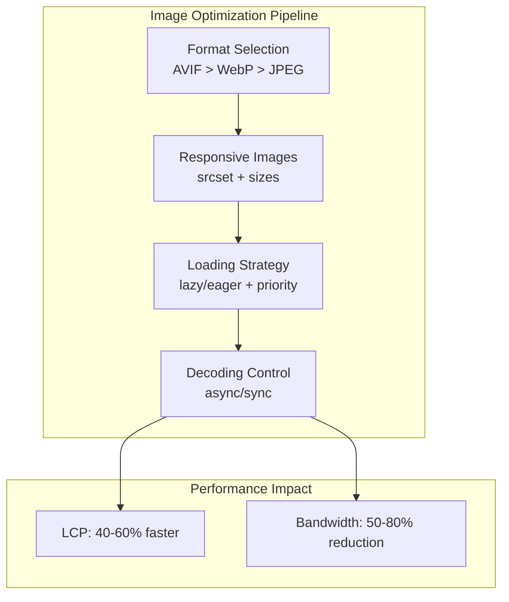

# Image Performance Optimization for the Web

Comprehensive guide to image optimization covering modern formats (AVIF, WebP, JPEG XL), responsive image implementation with `srcset` and `sizes`, loading strategies with `fetchpriority` and `decoding` attributes, and network-aware delivery. Targets 50-80% bandwidth reduction and significant Largest Contentful Paint (LCP) improvements.

<figure>



<figcaption>Image optimization pipeline showing format selection, responsive sizing, loading strategies, and their impact on Core Web Vitals</figcaption>

</figure>

## Abstract

Image optimization for the web follows a four-stage pipeline where each stage compounds savings:

1. **Format selection**: AVIF achieves 30-50% smaller files than JPEG; WebP achieves 25-34%—use `<picture>` for progressive enhancement with JPEG fallback
2. **Responsive sizing**: Serve images matching device viewport and Device Pixel Ratio (DPR) via `srcset` (width descriptors) and `sizes` (slot size hints)—prevents oversized images on mobile
3. **Loading strategy**: `loading="lazy"` defers off-screen images; `fetchpriority="high"` prioritizes LCP images in the HTTP/2 queue
4. **Decoding control**: `decoding="async"` keeps main thread free for non-critical images; `decoding="sync"` ensures LCP images decode immediately

The key insight: **LCP images require the opposite treatment from everything else**. Above-the-fold LCP images need `loading="eager"`, `fetchpriority="high"`, and `decoding="sync"`. Below-the-fold images need `loading="lazy"`, `fetchpriority="auto"`, and `decoding="async"`.

Always set explicit `width` and `height` attributes—without them, lazy-loaded images cause Cumulative Layout Shift (CLS) when they pop in.

## Image Formats

### Format Comparison

| Format      | Compression vs JPEG | Lossy/Lossless | Color Depth  | HDR Support    | Alpha | Browser Support                | Best Use Case          |
| ----------- | ------------------- | -------------- | ------------ | -------------- | ----- | ------------------------------ | ---------------------- |
| **AVIF**    | 30-50% smaller      | Both           | 8/10/12-bit  | PQ/HLG BT.2100 | Yes   | ~95%                           | HDR photos, rich media |
| **WebP**    | 25-34% smaller      | Both           | 8-bit        | No             | Yes   | ~96%                           | General web delivery   |
| **JPEG XL** | 20-50% smaller      | Both           | up to 32-bit | Full Rec.2100  | Yes   | Safari 17+, Chrome (returning) | Future-proof archival  |
| **JPEG**    | Baseline            | Lossy          | 8-bit        | No             | No    | 100%                           | Universal fallback     |
| **PNG**     | Lossless            | Lossless       | 1-16-bit     | No             | Yes   | 100%                           | Graphics, logos        |

### AVIF (AV1 Image File Format)

AVIF leverages the AV1 video codec for still images, achieving the highest compression efficiency available today.

**Technical architecture:**

- Container: ISOBMFF HEIF container (ISO/IEC 14496-12)
- Codec: AV1 intra-frame encoding with tiles, transforms, CDEF (Constrained Directional Enhancement Filter), loop restoration
- Entropy coding: CABAC (Context-Adaptive Binary Arithmetic Coding)

**Why AVIF achieves better compression:**

- Variable block sizes (4×4 to 128×128 SuperBlocks) adapt to image content
- Advanced prediction modes (65 intra-prediction angles vs JPEG's 9 DCT modes)
- Film grain synthesis preserves texture at lower bitrates without encoding grain detail

**Trade-offs:**

- Encoding is 8-10× slower than JPEG (acceptable for build-time optimization, not real-time)
- Decoding is multi-threaded but still slower than JPEG on low-end devices
- ~95% browser support as of 2025 (Chrome 85+, Firefox 93+, Safari 16.4+, Edge 121+)

> **AVIF 1.2.0 (2025)**: Added sample transforms, refined conformance testing, updated alignment with latest HEIF specifications.

### WebP

WebP provides excellent compression with near-universal support, making it the primary modern format for general web delivery.

**Technical architecture:**

- Lossy mode: VP8 codec with 16×16 macroblocks, intra-frame prediction, residual DCT (Discrete Cosine Transform)
- Lossless mode: VP8L with predictive coding, local palettes, Huffman entropy coding

**Why WebP works well:**

- 25-34% smaller than JPEG at equivalent SSIM (Structural Similarity Index)
- Full 8-bit alpha channel in lossy mode (unlike JPEG)
- Animation support via frame differencing (smaller than GIF)

**Trade-offs:**

- No HDR or wide color gamut support
- No progressive loading (renders frame-by-frame)
- ~96% browser support (missing only Internet Explorer)

### JPEG XL

JPEG XL is designed as the successor to JPEG with unique features for web migration.

**Technical architecture:**

- VarDCT mode: Variable block-size DCT (2-256 pixels) with XYB color quantization
- Modular mode: FLIF-inspired lossless with adaptive quantization

**Why JPEG XL matters:**

- Lossless JPEG transcoding: Re-encode existing JPEG files with 20% size reduction, fully reversible
- Progressive decoding with saliency-based priority (important regions first)
- Up to 32-bit color depth, full Rec.2100 HDR support

**Browser status (as of late 2025):**

- Safari 17+: Native support
- Chrome/Chromium: Re-adding support (reversed 2022 removal), Rust decoder complete with animation support
- Firefox: Behind flag, interest growing

> **Design rationale for Chrome reversal**: Developer demand (top pain point in State of HTML survey), Safari adoption, PDF specification adding JPEG XL support, and availability of a complete Rust decoder with animation support.

### Format Selection Strategy

```html
<picture>
  <!-- Format negotiation: browser takes first supported source -->
  <source srcset="image.avif" type="image/avif" />
  <source srcset="image.webp" type="image/webp" />
  
</picture>
```

**Selection order rationale:**

1. **AVIF first**: Highest compression, 30-50% savings
2. **WebP fallback**: Wide support, 25-34% savings
3. **JPEG/PNG baseline**: Universal compatibility

The browser evaluates sources top-to-bottom, taking the first it supports. This is a **hint, not negotiation**—the browser doesn't compare file sizes, it takes the first supported format.

## Responsive Images

### Width Descriptors and sizes

The `srcset` attribute with width descriptors (`w`) provides multiple image candidates. The `sizes` attribute tells the browser what slot size the image will occupy at different viewports.

```html

```

**How the browser selects:**

1. Parse `sizes` to determine slot size: first matching media condition wins
2. Calculate required pixels: slot size × DPR
3. Select smallest `srcset` candidate ≥ required pixels

**Example calculation:**

- Viewport: 400px, DPR: 2
- `sizes` matches `(max-width: 600px) 100vw` → slot = 400px
- Required: 400px × 2 = 800px
- Selected: `image-800.jpg 800w`

**Critical rules:**

- `sizes` uses fixed units (pixels, viewport units)—NOT percentages
- Last `sizes` entry must have no media condition (default)
- Always include `src` as fallback for older browsers
- Order `sizes` media conditions carefully—browser uses first match

### Density Descriptors

For images that don't change dimensions across viewports (icons, logos), use density descriptors:

```html

```

Simpler than width descriptors but only targets DPR, not viewport-based sizing.

### Art Direction with picture

When different viewports need different image crops (not just sizes), use `<picture>` with media queries:

```html
<picture>
  <!-- Mobile: portrait crop, full width -->
  <source media="(max-width: 768px)" srcset="hero-mobile-400.jpg 400w, hero-mobile-600.jpg 600w" sizes="100vw" />

  <!-- Desktop: landscape crop, half width -->
  <source media="(min-width: 769px)" srcset="hero-desktop-800.jpg 800w, hero-desktop-1200.jpg 1200w" sizes="50vw" />

  
</picture>
```

**Art direction vs resolution switching:**

- **Resolution switching** (`srcset` alone): Same image, different sizes for bandwidth optimization
- **Art direction** (`<picture>` with `media`): Different images/crops for design purposes

### Combined Format and Responsive

Full implementation combining format negotiation with responsive sizing:

```html
<picture>
  <!-- Mobile art direction + AVIF -->
  <source
    media="(max-width: 768px)"
    srcset="hero-mobile-400.avif 400w, hero-mobile-600.avif 600w"
    sizes="100vw"
    type="image/avif"
  />

  <!-- Mobile art direction + WebP fallback -->
  <source
    media="(max-width: 768px)"
    srcset="hero-mobile-400.webp 400w, hero-mobile-600.webp 600w"
    sizes="100vw"
    type="image/webp"
  />

  <!-- Desktop + AVIF -->
  <source srcset="hero-800.avif 800w, hero-1200.avif 1200w" sizes="(max-width: 1200px) 50vw, 600px" type="image/avif" />

  <!-- Desktop + WebP fallback -->
  <source srcset="hero-800.webp 800w, hero-1200.webp 1200w" sizes="(max-width: 1200px) 50vw, 600px" type="image/webp" />

  <!-- Final fallback: JPEG -->
  
</picture>
```

## Loading Strategies

### The LCP Image Pattern

LCP images require aggressive loading; all other images should defer:

```html
<!-- LCP image: maximize priority -->


<!-- Below-the-fold image: minimize impact -->

```

| Attribute       | LCP Image                                  | Below-the-fold                     |
| --------------- | ------------------------------------------ | ---------------------------------- |
| `loading`       | `eager` (default, immediate)               | `lazy` (defer until near viewport) |
| `fetchpriority` | `high` (prioritize in HTTP/2 queue)        | `auto` (browser decides)           |
| `decoding`      | `sync` (decode immediately on main thread) | `async` (decode off main thread)   |

### fetchpriority Explained

`fetchpriority` signals importance to the browser's resource scheduler:

- **`high`**: Fetch early, ahead of other resources at same priority level
- **`low`**: Deprioritize, fetch after higher-priority resources
- **`auto`** (default): Browser decides based on heuristics

**Why it matters for LCP:**

- HTTP/2 multiplexes requests but still has bandwidth constraints
- Without hints, browser may prioritize wrong images (e.g., a carousel image before the hero)
- Google Flights achieved LCP improvement from 2.6s to 1.9s with `fetchpriority="high"` on hero images

**Important limitation**: `fetchpriority` is a hint, not a directive. Browsers apply their own heuristics and may override.

### decoding Explained

The `decoding` attribute controls how the browser schedules image decoding relative to other content:

| Value   | Behavior                                           | Default In     |
| ------- | -------------------------------------------------- | -------------- |
| `sync`  | Block other content updates until decode completes | Chrome, Safari |
| `async` | Allow other content to render while decoding       | Firefox        |
| `auto`  | Browser decides                                    | —              |

**Trade-off:**

- `decoding="async"` keeps the main thread free but can cause visible "pop-in" if the image decodes after surrounding content renders
- `decoding="sync"` ensures the image appears with surrounding content but blocks rendering

**Design rationale:** For LCP images, the blocking behavior of `sync` is acceptable because you want the largest visible element to render as soon as possible. For gallery images below the fold, `async` prevents decode work from blocking other interactions.

### Native Lazy Loading

`loading="lazy"` defers fetching until the image is near the viewport:

```html

```

**Browser behavior:**

- Chrome: Starts loading when image is ~1250px from viewport (varies by connection speed)
- Images with no `width`/`height` may cause CLS when they pop in
- Only works when JavaScript is enabled (anti-tracking measure)

**Critical rule**: Never use `loading="lazy"` on LCP candidates. The browser doesn't know which image will be LCP until it's too late.

### Preloading LCP Images

For images discovered late (CSS backgrounds, JavaScript-loaded), use preload:

```html
<head>
  <!-- Preload LCP image with format negotiation -->
  <link rel="preload" as="image" href="hero.avif" type="image/avif" fetchpriority="high" />
  <link rel="preload" as="image" href="hero.webp" type="image/webp" fetchpriority="high" />
</head>
```

**When to preload:**

- CSS `background-image` (not in HTML, discovered after CSS parses)
- JavaScript-loaded images
- Images behind lazy-loaded components

**When NOT to preload:**

- Images in HTML `` tags above the fold—browser already discovers them early

## Programmatic Control

### Intersection Observer for Lazy Loading

For finer control than native `loading="lazy"`:

```ts title="intersection-observer-lazy.ts" collapse={1-3, 20-25}
const lazyImages = document.querySelectorAll<HTMLImageElement>("img[data-src]")

const observer = new IntersectionObserver(
  (entries) => {
    entries.forEach((entry) => {
      if (!entry.isIntersecting) return

      const img = entry.target as HTMLImageElement
      img.src = img.dataset.src!

      // Use decode() to avoid flash of unloaded image
      img
        .decode()
        .then(() => img.classList.add("loaded"))
        .catch(() => console.error("Decode failed:", img.src))

      observer.unobserve(img)
    })
  },
  {
    rootMargin: "200px", // Start loading 200px before entering viewport
    threshold: 0.1,
  },
)

lazyImages.forEach((img) => observer.observe(img))
```

**Why use `decode()`?** The `img.decode()` method returns a Promise that resolves when the image is fully decoded and ready to render. This prevents the "flash" where the image element appears but the pixels haven't loaded yet.

### Network-Aware Loading

Adapt image quality based on connection:

```ts title="network-aware-loading.ts" collapse={1-5, 25-35}
interface ConnectionInfo {
  effectiveType: "slow-2g" | "2g" | "3g" | "4g"
  downlink: number // Mbps
  saveData: boolean
}

function getImageQuality(): number {
  const connection = (navigator as Navigator & { connection?: ConnectionInfo }).connection

  if (!connection) return 80 // Default for unsupported browsers

  if (connection.saveData) return 50 // User explicitly requested data saving
  if (connection.effectiveType === "slow-2g") return 40
  if (connection.effectiveType === "2g") return 50
  if (connection.effectiveType === "3g") return 70
  return 85 // 4G or better
}

function buildImageUrl(basePath: string, width: number): string {
  const quality = getImageQuality()
  return `${basePath}?w=${width}&q=${quality}&f=auto`
}
```

**Effective connection types:**

- `slow-2g`: ~50 Kbps, RTT > 2000ms
- `2g`: ~70 Kbps, RTT ~1400ms
- `3g`: ~700 Kbps, RTT ~270ms
- `4g`: ≥700 Kbps, RTT < 100ms

The Network Information API has ~75% browser support. Always provide a sensible default for unsupported browsers.

## Server-Side Generation

### Build-Time Optimization with Sharp

```ts title="generate-responsive-images.ts" collapse={1-5, 35-45}
import sharp from "sharp"
import path from "path"

const WIDTHS = [400, 800, 1200, 1600]
const FORMATS = ["avif", "webp"] as const

interface OutputFile {
  path: string
  width: number
  format: string
  size: number
}

async function generateResponsiveImages(inputPath: string, outputDir: string): Promise<OutputFile[]> {
  const outputs: OutputFile[] = []
  const baseName = path.basename(inputPath, path.extname(inputPath))

  for (const width of WIDTHS) {
    for (const format of FORMATS) {
      const outputPath = path.join(outputDir, `${baseName}-${width}.${format}`)

      const info = await sharp(inputPath)
        .resize(width, null, { withoutEnlargement: true })
        .toFormat(format, {
          quality: format === "avif" ? 65 : 80, // AVIF needs lower quality number for equivalent visual quality
          effort: format === "avif" ? 4 : 6, // Encoding effort (higher = slower, better compression)
        })
        .toFile(outputPath)

      outputs.push({ path: outputPath, width, format, size: info.size })
    }
  }

  return outputs
}
```

**AVIF quality settings:**

- Quality 60-70 for photos typically matches JPEG quality 80-85
- `effort` 4-6 balances encoding time and compression (9 is maximum, very slow)

### Image CDN Integration

Modern image CDNs (Cloudinary, imgix, Cloudflare Images) handle format negotiation and resizing at the edge:

```html
<!-- Cloudflare Images: automatic format via Accept header -->

```

**Why use an image CDN?**

- Format negotiation based on `Accept` header (serves AVIF to supported browsers automatically)
- On-demand resizing without build-time generation
- Edge caching for global delivery
- Automatic quality optimization

**Trade-off:** Adds external dependency and per-request cost. Build-time optimization is free at runtime.

## Performance Monitoring

### Tracking Image Impact on LCP

```ts title="lcp-image-tracking.ts" collapse={1-3, 20-25}
const lcpObserver = new PerformanceObserver((list) => {
  const entries = list.getEntries()
  const lastEntry = entries[entries.length - 1] as PerformanceEntry & {
    element?: Element
    url?: string
    size?: number
    renderTime?: number
    loadTime?: number
  }

  if (lastEntry.element?.tagName === "IMG") {
    console.log("LCP element:", lastEntry.element)
    console.log("LCP time:", lastEntry.renderTime || lastEntry.loadTime)
    console.log("Image URL:", lastEntry.url)
    console.log("Image size (px²):", lastEntry.size)
  }
})

lcpObserver.observe({ type: "largest-contentful-paint", buffered: true })
```

### Tracking Image Resource Performance

```ts title="image-resource-tracking.ts" collapse={1-2, 18-22}
const resourceObserver = new PerformanceObserver((list) => {
  for (const entry of list.getEntries()) {
    const resource = entry as PerformanceResourceTiming

    if (resource.initiatorType !== "img") continue

    const metrics = {
      url: resource.name,
      transferSize: resource.transferSize,
      encodedBodySize: resource.encodedBodySize,
      decodedBodySize: resource.decodedBodySize,
      duration: resource.responseEnd - resource.startTime,
      ttfb: resource.responseStart - resource.startTime,
    }

    console.log("Image loaded:", metrics)
  }
})

resourceObserver.observe({ type: "resource", buffered: true })
```

## Conclusion

Image optimization requires treating LCP images differently from everything else. LCP images need aggressive loading (`eager`, `fetchpriority="high"`, `decoding="sync"`), while below-the-fold images should defer (`lazy`, `async`).

Format selection follows a clear priority: AVIF (30-50% smaller than JPEG, ~95% support) → WebP (25-34% smaller, ~96% support) → JPEG fallback. Use `<picture>` for format negotiation and art direction.

Responsive images prevent oversized downloads: `srcset` provides candidates, `sizes` tells the browser the slot size, and the browser calculates required pixels based on DPR. Always set explicit `width` and `height` to prevent CLS.

For production systems, build-time optimization (Sharp) works for static sites; image CDNs provide runtime flexibility with edge delivery. Monitor LCP element identification and image resource timing to verify optimizations are effective.

## Appendix

### Prerequisites

- Understanding of HTTP/2 resource prioritization
- Familiarity with browser rendering pipeline (when images block paint)
- Basic knowledge of Core Web Vitals (LCP, CLS)

### Terminology

- **AVIF**: AV1 Image File Format—image format based on AV1 video codec
- **CLS**: Cumulative Layout Shift—Core Web Vital measuring visual stability
- **DCT**: Discrete Cosine Transform—mathematical transformation used in JPEG compression
- **DPR**: Device Pixel Ratio—ratio of physical to CSS pixels (e.g., 2x for Retina)
- **LCP**: Largest Contentful Paint—Core Web Vital measuring perceived load time
- **SSIM**: Structural Similarity Index—metric comparing perceived image quality
- **WebP**: Image format developed by Google based on VP8 video codec

### Summary

- **Format priority**: AVIF (30-50% smaller) → WebP (25-34% smaller) → JPEG fallback; use `<picture>` for negotiation
- **Responsive images**: `srcset` with width descriptors + `sizes` for slot hints; browser calculates required pixels from slot × DPR
- **LCP images**: `loading="eager"`, `fetchpriority="high"`, `decoding="sync"`—opposite of below-fold images
- **Below-fold images**: `loading="lazy"`, `fetchpriority="auto"`, `decoding="async"` to minimize initial load impact
- **Always set dimensions**: `width` and `height` attributes prevent CLS on lazy-loaded images
- **JPEG XL**: Chrome re-adding support (2025); Safari 17+ native; potential future default format

### References

**Specifications**

- [AVIF Specification (AOM)](https://aomediacodec.github.io/av1-avif/) - AV1 Image File Format specification
- [JPEG XL (ISO/IEC 18181)](https://www.iso.org/standard/87633.html) - JPEG XL codec specification
- [WebP Container Specification (Google)](https://developers.google.com/speed/webp/docs/riff_container) - WebP RIFF container format
- [WHATWG HTML - img element](https://html.spec.whatwg.org/multipage/embedded-content.html#the-img-element) - Responsive images specification

**Official Documentation**

- [MDN - Responsive Images](https://developer.mozilla.org/en-US/docs/Learn/HTML/Multimedia_and_embedding/Responsive_images) - srcset, sizes, and picture element guide
- [MDN - HTMLImageElement.decoding](https://developer.mozilla.org/en-US/docs/Web/API/HTMLImageElement/decoding) - decoding attribute behavior
- [MDN - img element](https://developer.mozilla.org/en-US/docs/Web/HTML/Element/img) - loading, fetchpriority attributes
- [web.dev - Optimize LCP](https://web.dev/articles/optimize-lcp) - LCP image optimization strategies
- [web.dev - Fetch Priority](https://web.dev/articles/fetch-priority) - fetchpriority attribute usage

**Browser Support**

- [Can I Use - AVIF](https://caniuse.com/avif) - ~95% global support
- [Can I Use - WebP](https://caniuse.com/webp) - ~96% global support
- [Chrome JPEG XL Support (DevClass)](https://devclass.com/2025/11/24/googles-chromium-team-decides-it-will-add-jpeg-xl-support-reverses-obsolete-declaration/) - Chrome re-adding JPEG XL

**Tools**

- [Sharp (Node.js)](https://sharp.pixelplumbing.com/) - High-performance image processing library
- [Squoosh (Google)](https://squoosh.app/) - Browser-based image compression comparison
