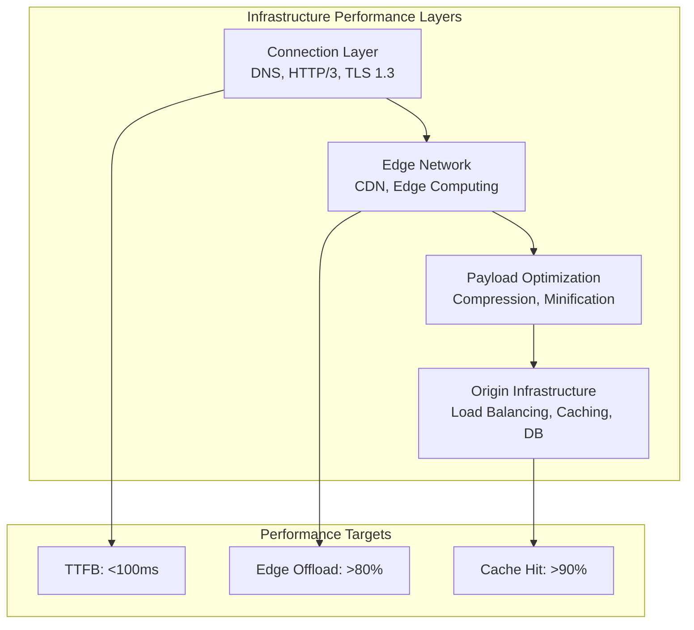
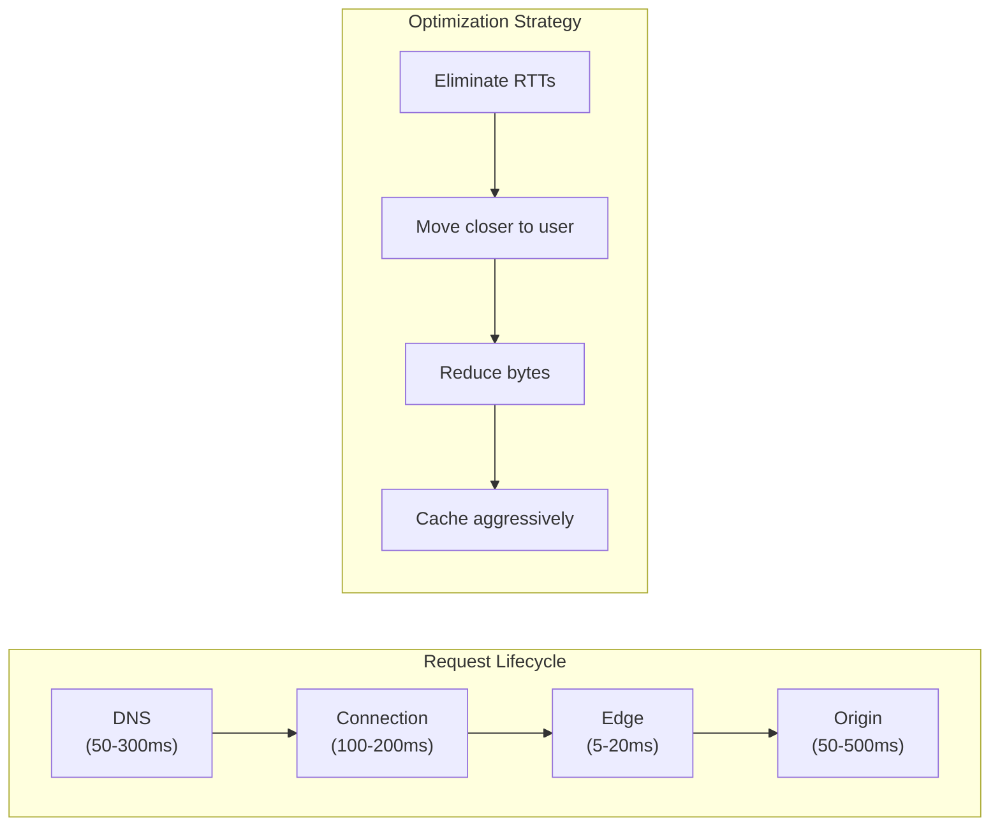
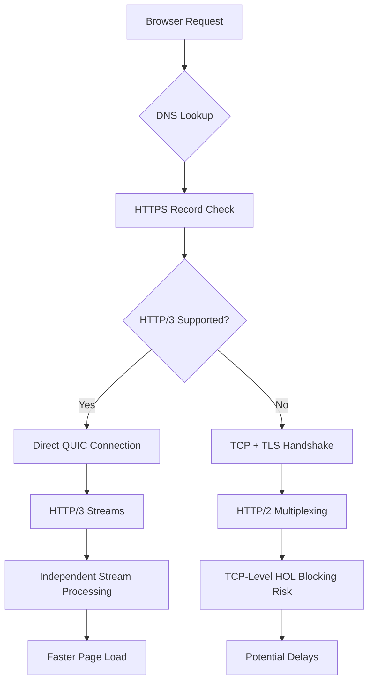
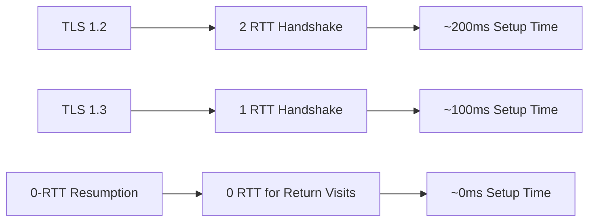

# Web Performance Infrastructure: DNS, CDN, Caching, and Edge

Infrastructure optimization addresses the foundation of web performance—the layers between a user's request and your application's response. This article covers DNS as a performance lever, HTTP/3 and QUIC for eliminating protocol-level bottlenecks, CDN and edge computing for geographic proximity, compression strategies for payload reduction, and caching patterns that can reduce Time to First Byte (TTFB) by 85-95% while offloading 80%+ of traffic from origin servers.

<figure>



<figcaption>Infrastructure optimization layers: connection, edge, payload, and origin working together for sub-100ms TTFB</figcaption>

</figure>

## Abstract

Infrastructure performance follows a layered model where each layer multiplies the impact of the one below it:



**Core mental model**: Every request traverses DNS → Connection → Edge → Origin. Optimization means either eliminating layers entirely (edge caching bypasses origin), reducing round trips within layers (HTTP/3 merges crypto and transport handshakes), or moving computation closer to the user (edge functions).

**Key trade-offs to understand**:

| Optimization                | What it buys                                           | What it costs                                                       |
| --------------------------- | ------------------------------------------------------ | ------------------------------------------------------------------- |
| HTTP/3 (QUIC over UDP)      | Eliminates TCP head-of-line blocking, 0-RTT resumption | UDP may be blocked/throttled, requires infrastructure changes       |
| Edge computing              | Sub-10ms latency to users, origin offload              | Limited runtime (no filesystem, constrained memory), vendor lock-in |
| Aggressive caching          | 90%+ origin offload, instant responses                 | Cache invalidation complexity, stale data risk                      |
| Pre-compression (Brotli 11) | 15-27% smaller than gzip                               | Build time cost, storage for multiple variants                      |

**Performance targets** (2025 benchmarks):

- DNS: <20ms excellent, <50ms acceptable
- Connection (HTTP/3): <100ms, with 0-RTT resumption for return visitors
- TTFB: <100ms excellent, <200ms good
- Origin offload: >80% of bytes from edge

## Part 1: The Connection Layer

The initial moments of a user's interaction with a website are defined by the speed and efficiency of the network connection. Latency introduced during DNS lookup, protocol negotiation, and security handshake can significantly delay TTFB.

### 1.1 DNS as a Performance Lever

Modern DNS has evolved from a simple directory into a sophisticated signaling mechanism through SVCB and HTTPS record types ([RFC 9460](https://datatracker.ietf.org/doc/html/rfc9460), published November 2023).

**Why HTTPS records exist**: Before RFC 9460, browsers discovered HTTP/3 support only after connecting via HTTP/2, receiving an `Alt-Svc` header, and then upgrading on subsequent requests. This added 1-2 RTTs to the first HTTP/3 connection. HTTPS records move protocol negotiation into DNS, enabling direct HTTP/3 connections on the first request.

**HTTPS Record Benefits:**

- **alpn parameter**: Advertises HTTP/3 support (`alpn="h3"`), allowing browsers to skip protocol upgrade negotiation
- **ipv4hint/ipv6hint**: Provides IP addresses, potentially saving additional DNS lookups
- **Saves 100-300ms**: By enabling direct HTTP/3 connection attempts

**Adoption (2025)**: ~15% of top 1M domains have HTTPS records, with Cloudflare's automatic deployment driving ~80% of that adoption. Browser support: Chrome 96+, Firefox 78+ (DoH only), Safari 14+ (most complete implementation).

```dns
; HTTPS record enabling HTTP/3 discovery
example.com. 300 IN HTTPS 1 . alpn="h3,h2" port="443" ipv4hint="192.0.2.1"

; SVCB record for service binding
_service.example.com. 300 IN SVCB 1 svc.example.net. alpn="h3" port="8443"
```

**Measurement:**

```javascript title="dns-timing.js"
const measureDNSTiming = () => {
  const navigation = performance.getEntriesByType("navigation")[0]
  const dnsTime = navigation.domainLookupEnd - navigation.domainLookupStart

  return {
    timing: dnsTime,
    status: dnsTime < 20 ? "excellent" : dnsTime < 50 ? "good" : "needs-improvement",
  }
}
```

### 1.2 HTTP/3 and QUIC

HTTP/3 ([RFC 9114](https://datatracker.ietf.org/doc/html/rfc9114), June 2022) abandons TCP for QUIC ([RFC 9000](https://datatracker.ietf.org/doc/html/rfc9000)), providing transformative benefits ([HTTP/3 Explained](https://http3-explained.haxx.se/)):

**Why QUIC exists**: TCP's design predates the modern web. Its head-of-line blocking (a single lost packet blocks all streams), 2-RTT handshake, and IP-bound connections create latency that can't be fixed at the application layer. QUIC redesigns the transport layer with web workloads in mind.

**Elimination of Head-of-Line Blocking**: QUIC implements streams as first-class citizens. Packet loss in one stream doesn't impact others—critical for complex web pages loading dozens of parallel resources. Research shows HTTP/3 can achieve up to 81.5% improvement in extreme loss scenarios.

**Faster Connection Establishment**: QUIC integrates cryptographic and transport handshakes into a single RTT. Combined with 0-RTT resumption for returning visitors, this can eliminate handshake latency entirely.

**Connection Migration**: Uses Connection ID (CID) instead of IP/port tuple, allowing seamless network switching (Wi-Fi to cellular) without reconnection. This addresses a pain point that TCP fundamentally cannot solve.

**Adoption (2025)**: 37% of websites globally support HTTP/3 (W3Techs), with 21% of actual requests using HTTP/3 (Cloudflare Radar). Browser support is mature: Chrome 87+, Firefox 88+, Safari 16+ (enabled by default September 2024), Edge 87+.



**Performance Impact (2025 benchmarks):**

| Scenario               | HTTP/3 vs HTTP/2       | Notes                            |
| ---------------------- | ---------------------- | -------------------------------- |
| TTFB (average)         | 12.4% faster           | 176ms vs 201ms                   |
| High packet loss (15%) | 55% faster             | QUIC's stream independence       |
| Extreme loss scenarios | 81-88% faster          | TCP completely stalls            |
| Small pages (15KB)     | ~3% faster             | Marginal gain                    |
| Large pages (1MB)      | HTTP/2 slightly faster | Congestion algorithm differences |

**Why HTTP/3 doesn't always win**: Current HTTP/3 implementations often use CUBIC congestion control while HTTP/2 uses BBR. Cloudflare's research shows HTTP/3 trails by 1-4% on average in stable network conditions due to these algorithm differences, not protocol overhead.

### 1.3 TLS 1.3 Optimization

TLS 1.3 ([RFC 8446](https://datatracker.ietf.org/doc/html/rfc8446), August 2018; revision draft-ietf-tls-rfc8446bis in AUTH48 as of September 2025) was redesigned with performance as a core feature.

**Why TLS 1.3 is faster**: TLS 1.2 required 2 RTTs because the client and server exchanged multiple messages sequentially (ClientHello → ServerHello → Certificate → KeyExchange → Finished). TLS 1.3 merges these into a single flight by using ephemeral Diffie-Hellman exclusively and sending encrypted data immediately after the first round trip.

**1-RTT Handshake**: Streamlined negotiation requires only a single round trip (vs 2 RTT for TLS 1.2), reducing latency by 30-50%.

**0-RTT Resumption**: Returning visitors can send encrypted data in the first packet, eliminating handshake latency for ~40% of connections that are resumptions.

**0-RTT Security Trade-off**: 0-RTT data is vulnerable to replay attacks—an attacker can capture and resend the encrypted request. Mitigations: use 0-RTT only for idempotent requests (GET), implement server-side replay detection, or disable 0-RTT for sensitive operations. Cloudflare keeps 0-RTT disabled by default for Business/Enterprise zones due to this risk.

**Adoption (2025)**: 62-70% of websites support TLS 1.3 (SSL Labs). Browser support: Chrome 70+, Firefox 63+, Safari 12.2+, Edge 79+. Post-quantum cryptography with TLS 1.3 is emerging: 43% of Cloudflare connections use hybrid post-quantum key exchange (September 2025).



### 1.4 Connection Layer Trade-offs

| Optimization           | Benefits                                         | Trade-offs                                                       | Adoption (2025)        |
| ---------------------- | ------------------------------------------------ | ---------------------------------------------------------------- | ---------------------- |
| **SVCB/HTTPS Records** | Faster protocol discovery, skip Alt-Svc upgrade  | DNS infrastructure changes, mixed browser implementation quality | ~15% of top 1M domains |
| **HTTP/3 Adoption**    | No TCP HOL blocking, 0-RTT, connection migration | UDP may be blocked/throttled, infrastructure changes             | 37% of websites        |
| **TLS 1.3 Migration**  | 1-RTT handshake (50% faster than TLS 1.2)        | Certificate/infrastructure updates                               | 62-70% of websites     |
| **0-RTT Resumption**   | Zero handshake latency for return visitors       | Replay attack vulnerability, requires idempotent operations      | Selectively enabled    |

## Part 2: The Edge Network

By bringing content and computation closer to end-users, edge networks dramatically reduce latency, absorb traffic spikes, and improve overall application performance.

### 2.1 CDN Architecture

A CDN's primary goal is to reduce latency by serving content from geographically proximate Points of Presence (PoPs).

**Why CDNs work**: Speed of light limits latency to ~1ms per 200km of fiber. A user in Sydney connecting to a San Francisco origin faces ~150ms minimum latency. A CDN PoP in Sydney reduces this to <10ms for cached content.

**Core Principles:**

- **Geographic Distribution**: Minimizes physical distance, reducing round-trip time
- **Static Asset Caching**: Delivers images, CSS, JS from edge cache—orders of magnitude faster than origin
- **DDoS Protection**: Distributed infrastructure absorbs attacks

**Origin Offload vs Cache-Hit Ratio:**

Cache-hit ratio treats all requests equally. **Origin offload** measures percentage of bytes from cache—a more meaningful Key Performance Indicator (KPI) that reflects actual infrastructure savings. A 95% cache-hit ratio with 5% of requests being large API responses could mean only 50% origin offload by bytes.

```javascript title="cdn-strategy.js"
const cdnStrategy = {
  static: {
    maxAge: 31536000, // 1 year
    types: ["images", "fonts", "css", "js"],
    headers: {
      "Cache-Control": "public, max-age=31536000, immutable",
    },
  },
  dynamic: {
    maxAge: 300, // 5 minutes
    types: ["api", "html"],
    headers: {
      "Cache-Control": "public, max-age=300, stale-while-revalidate=60",
    },
  },
  micro: {
    maxAge: 5, // 5 seconds
    types: ["inventory", "pricing", "news"],
    headers: {
      "Cache-Control": "public, max-age=5, stale-while-revalidate=30",
    },
  },
}
```

### 2.2 Edge Computing

Edge computing extends CDNs from content delivery to distributed application platforms.

**Why edge computing matters**: Traditional CDNs cache static content but still require origin round-trips for any dynamic logic. Edge computing runs code at the PoP, enabling personalization, authentication, and business logic at <10ms latency vs 100-300ms for origin requests.

**Platform landscape (2025)**:

| Platform               | Runtime        | Cold Start              | Key Strength                  |
| ---------------------- | -------------- | ----------------------- | ----------------------------- |
| Cloudflare Workers     | V8 isolates    | ~5ms (effectively zero) | 99.99% warm request rate      |
| Vercel Edge Functions  | V8 isolates    | 9x faster than Lambda   | Fluid Compute pricing         |
| Netlify Edge Functions | Deno           | Faster than Node.js     | Netlify ecosystem integration |
| Fastly Compute         | WebAssembly    | Microseconds            | Multi-language support        |
| AWS Lambda@Edge        | Node.js/Python | Seconds                 | AWS ecosystem                 |

**Key Use Cases:**

- **Dynamic Content Acceleration**: Perform personalization logic closer to users
- **A/B Testing**: Execute variant selection at edge without origin round-trip
- **Edge Authentication**: Block invalid requests immediately, protecting origin

```javascript title="edge-worker.js" collapse={1-3}
addEventListener("fetch", (event) => {
  event.respondWith(handleRequest(event.request))
})

async function handleRequest(request) {
  const url = new URL(request.url)

  // A/B testing at the edge
  if (url.pathname === "/homepage") {
    const variant = getABTestVariant(request)
    const content = await generatePersonalizedContent(request, variant)

    return new Response(content, {
      headers: {
        "content-type": "text/html",
        "cache-control": "public, max-age=300",
        "x-variant": variant,
      },
    })
  }

  // Geo-routing and localized caching
  const country = request.headers.get("cf-ipcountry")
  const localizedContent = await getLocalizedContent(country)

  return new Response(localizedContent, {
    headers: {
      "content-type": "text/html",
      "cache-control": "public, max-age=600",
    },
  })
}
```

**Architecture Shift**: The CDN evolves from cache to application perimeter. The question changes from "How do we make the origin faster?" to "How much can we prevent from ever hitting the origin?"

**Edge computing limitations**: No filesystem access, no TCP/UDP sockets (except Deno Deploy), constrained memory (2MB-3GB depending on platform), no dynamic code execution (eval/new Function), limited execution time (1ms-30s). These constraints exist because edge runtimes prioritize isolation and fast cold starts over flexibility.

## Part 3: Payload Optimization

### 3.1 Compression Strategy

The choice of algorithm involves a trade-off between compression ratio and speed, requiring different strategies for static and dynamic content.

**Why multiple algorithms exist**: Gzip (1992) optimized for the hardware of its era. Brotli (2015) was designed by Google specifically for web content, achieving 15-27% better compression than gzip by using a pre-defined dictionary of common web strings. Zstandard (2016) from Facebook prioritizes compression speed while matching Brotli's ratios.

**Static Content (Pre-compression):**
Use the most effective algorithm at highest quality since compression time doesn't affect users:

- Brotli level 11 produces smallest files (15-27% smaller than gzip)
- Pre-compress during build: `.js.br`, `.css.br`
- Server serves appropriate pre-compressed file based on Accept-Encoding

**Dynamic Content (On-the-fly):**
Compression happens in real-time, so speed matters ([compression benchmarks](https://paulcalvano.com/2024-03-19-choosing-between-gzip-brotli-and-zstandard-compression/)):

- Brotli level 4-5: Better than gzip at similar speed
- Zstandard level 3-12: 42% faster than Brotli at similar ratios

**Edge Compression:**
Offload compression to CDN to free origin CPU. CDNs can cache compressed variants and serve the appropriate one based on client support.

**Browser support (2025)**: Brotli has 96% global support (all modern browsers). Zstandard has 76% support (Chrome 123+, Firefox 126+, Edge 123+; Safari can decompress but doesn't request it).

### 3.2 Compression Algorithm Matrix

| Algorithm     | Static    | Dynamic    | Browser Support (2025) | Trade-off                                         |
| ------------- | --------- | ---------- | ---------------------- | ------------------------------------------------- |
| **Gzip**      | Level 6-9 | Level 6    | 99%+                   | Universal fallback, ~30% worse than Brotli        |
| **Brotli**    | Level 11  | Level 4-5  | 96%                    | Best ratio, slow at high levels                   |
| **Zstandard** | Level 19  | Level 3-12 | 76%                    | 42% faster compression than Brotli, similar ratio |

**CDN adoption (2025)**: CDN servers use Brotli (46%), gzip (42%), Zstandard (12%). Origin servers lag behind: gzip (61%), Brotli (39%), Zstandard minimal. ~30% of sites still use gzip level 1, leaving 25-30% compression gains on the table.

**Nginx Configuration:**

```nginx
http {
    # Brotli compression
    brotli on;
    brotli_comp_level 6;
    brotli_types
        application/javascript
        application/json
        text/css
        text/html;

    # Gzip fallback
    gzip on;
    gzip_vary on;
    gzip_types
        application/javascript
        text/css
        text/html;

    # Static pre-compressed files
    gzip_static on;
    brotli_static on;
}
```

## Part 4: Origin Infrastructure

### 4.1 Load Balancing Algorithms

**Why algorithm choice matters**: The wrong algorithm can create hot spots (overloaded servers while others idle) or break session state. The right choice depends on your traffic pattern and statefulness requirements.

**Static Algorithms:**

- **Round Robin**: Simple sequential distribution; best for homogeneous servers with stateless workloads
- **Weighted Round Robin**: Assigns weight based on server capacity; use when servers have different specs

**Dynamic Algorithms:**

- **Least Connections**: Routes to server with fewest active connections; better for long-lived connections (WebSocket, streaming)
- **Least Response Time**: Routes to fastest-responding server; best for latency optimization when backend performance varies

**Session Persistence:**

- **Source IP Hash**: Maps client IP to specific server for session continuity; breaks when users are behind NAT or proxies
- **Cookie-based**: More reliable than IP hash but requires cookie support

### 4.2 In-Memory Caching

An in-memory caching layer (Redis, Memcached) stores expensive query results, serving subsequent requests from RAM (Random Access Memory).

**Why in-memory caching works**: RAM access is ~100,000x faster than SSD (~100ns vs ~10ms). For read-heavy workloads, caching database query results in RAM can reduce p99 latency from 100ms to <1ms.

**Redis vs Memcached:**

| Aspect          | Memcached                          | Redis                                       |
| --------------- | ---------------------------------- | ------------------------------------------- |
| **Data model**  | Key-value only                     | Strings, hashes, lists, sets, sorted sets   |
| **Threading**   | Multi-threaded                     | Single-threaded (+ I/O threads in Redis 6+) |
| **Persistence** | None (volatile)                    | RDB snapshots, AOF logging                  |
| **Replication** | None built-in                      | Primary-replica, Redis Cluster              |
| **Use case**    | Simple caching, maximum throughput | Complex caching, data structures, pub/sub   |

**When to use Memcached**: Pure caching with simple key-value access, maximum multi-core utilization, no persistence requirements.

**When to use Redis**: Need data structures (leaderboards with sorted sets, rate limiting with atomic increments), persistence, replication, or pub/sub.

```javascript title="cache-helper.js"
const getCachedData = async (key, fetchFunction, ttl = 3600) => {
  try {
    const cached = await redis.get(key)
    if (cached) {
      return JSON.parse(cached)
    }

    const data = await fetchFunction()
    await redis.setex(key, ttl, JSON.stringify(data))
    return data
  } catch (error) {
    return await fetchFunction()
  }
}
```

### 4.3 Database Optimization

**Why database optimization matters**: Database queries are often the largest contributor to TTFB. A single unindexed query can take 100ms+ while the same query with proper indexing takes <1ms.

**Query Optimization:**

- Never use `SELECT *`; request only needed columns (reduces I/O and network transfer)
- Use `EXPLAIN` (PostgreSQL) or `EXPLAIN ANALYZE` to inspect execution plans
- Ensure JOIN columns are indexed; missing indexes on JOIN columns cause full table scans

**Strategic Indexing:**

- Index columns in WHERE, JOIN, ORDER BY clauses
- Avoid over-indexing: each index slows writes and consumes storage
- Consider partial indexes for filtered queries (e.g., `WHERE status = 'active'`)

**Read Replicas:**

- Direct writes to primary, distribute reads across replicas
- Replication lag trade-off: replicas may be milliseconds to seconds behind primary
- Use for read-heavy workloads where eventual consistency is acceptable

**Connection Pooling:**

- Maintain pool of connections for reuse; creating new connections takes 10-50ms
- Size pool appropriately: too small causes queueing, too large wastes memory
- Tools: PgBouncer (PostgreSQL), ProxySQL (MySQL)

## Part 5: Modern Architectural Patterns

### 5.1 Islands Architecture

Renders pages as static HTML by default, hydrating only interactive components (islands) on demand ([Astro Islands](https://docs.astro.build/en/concepts/islands/)).

**Why islands exist**: Traditional Single Page Applications (SPAs) ship the entire application as JavaScript, even for mostly-static content. Islands architecture recognizes that most content doesn't need interactivity—only specific "islands" (search boxes, comment sections, shopping carts) need JavaScript.

**Core Principles:**

- **Static by Default**: No JavaScript required for initial display
- **Selective Hydration**: Interactive components hydrate based on triggers (`client:load`, `client:visible`, `client:idle`)
- **Progressive Enhancement**: Functionality adds incrementally; content is accessible without JavaScript

```astro title="index.astro"
---
const posts = await getPosts()
---

<html>
  <body>
    <!-- Static HTML - no JavaScript -->
    <main>
      {
        posts.map((post) => (
          <article>
            <h2>{post.title}</h2>
            <p>{post.excerpt}</p>
          </article>
        ))
      }
    </main>

    <!-- Interactive islands - hydrated on demand -->
    <SearchComponent client:load />
    <NewsletterSignup client:visible />
    <CommentsSection client:idle />
  </body>
</html>
```

**Performance Benefits:**

- Initial bundle size: 50-80% reduction
- Near-instant TTI for static content
- Full SSR for SEO

### 5.2 Resumability (Qwik)

Zero-hydration approach: serializes execution state into HTML and resumes exactly where server left off on user interaction ([Qwik Resumability](https://qwik.dev/docs/concepts/resumable/)).

**Why resumability matters**: Hydration requires downloading, parsing, and executing JavaScript to rebuild the component tree—even for components the user never interacts with. Resumability skips this entirely by serializing the application state into the HTML, loading component code only when the user interacts with that specific component.

**Key Advantages:**

- Zero JavaScript execution on initial load
- Instant interactivity on first interaction (no hydration delay)
- Time to Interactive (TTI) doesn't degrade with application size

**Trade-off**: Serializing state increases HTML size. Works best for content-heavy sites with occasional interactivity; less suited for highly interactive applications where most components will be used.

### 5.3 Backend for Frontend (BFF)

Creates specialized backend services that aggregate data from multiple microservices into optimized responses.

**Why BFF exists**: In microservices architectures, a single page may require data from 5-10 services. Having the frontend make all these calls creates: (1) waterfall latency as calls often depend on each other, (2) over-fetching as each service returns its full response, (3) complexity in handling partial failures. A BFF aggregates these calls server-side, returning a single optimized payload.

**Performance Impact:**

| Metric             | Without BFF  | With BFF     | Improvement        |
| ------------------ | ------------ | ------------ | ------------------ |
| **Payload Size**   | 150-200KB    | 80-120KB     | 30-50% reduction   |
| **API Requests**   | 5-8 requests | 1-2 requests | 60-80% reduction   |
| **Response Time**  | 800-1200ms   | 200-400ms    | 60-75% faster      |
| **Cache Hit Rate** | 30-40%       | 70-85%       | 40-45% improvement |

```javascript title="product-bff.js"
class ProductPageBFF {
  async getProductPageData(productId, userId) {
    const [product, reviews, inventory, recommendations] = await Promise.all([
      this.productService.getProduct(productId),
      this.reviewService.getReviews(productId),
      this.inventoryService.getStock(productId),
      this.recommendationService.getRecommendations(productId, userId),
    ])

    return {
      product: this.transformProduct(product),
      reviews: this.optimizeReviews(reviews),
      availability: this.formatAvailability(inventory),
      recommendations: this.filterRecommendations(recommendations),
    }
  }
}
```

### 5.4 Private VPC Routing

Differentiate network paths for client-side and server-side data fetching.

**Why private routing matters**: Client-side API calls traverse the public internet (100-300ms latency, egress costs, exposure to attacks). Server-side calls within a Virtual Private Cloud (VPC) use internal networking (5-20ms latency, no egress costs, isolated from internet).

| Fetching Context | Network Path                   | Performance | Security |
| ---------------- | ------------------------------ | ----------- | -------- |
| **Client-Side**  | Public Internet → CDN → Origin | 100-300ms   | Standard |
| **Server-Side**  | Private VPC → Internal Network | 5-20ms      | Enhanced |

**Implementation:**

```javascript title="api-client.js"
class APIClient {
  constructor() {
    this.publicUrl = process.env.NEXT_PUBLIC_API_URL
    this.privateUrl = process.env.API_URL_PRIVATE
  }

  // Client-side API calls (public internet)
  async clientFetch(endpoint, options = {}) {
    return fetch(`${this.publicUrl}${endpoint}`, options)
  }

  // Server-side API calls (private VPC)
  async serverFetch(endpoint, options = {}) {
    return fetch(`${this.privateUrl}${endpoint}`, {
      ...options,
      headers: {
        "X-Internal-Request": "true",
        ...options.headers,
      },
    })
  }
}
```

**Performance Impact:**

- TTFB: 85-95% faster (5-20ms vs 150-300ms)
- Cost: 60-80% savings on egress
- Security: VPC isolation

## Part 6: Multi-Layer Caching

### 6.1 Service Worker Caching

```javascript title="service-worker.js" collapse={1-4}
import { registerRoute } from "workbox-routing"
import { CacheFirst, NetworkFirst, StaleWhileRevalidate } from "workbox-strategies"
import { ExpirationPlugin } from "workbox-expiration"

// Cache-first for static assets
registerRoute(
  ({ request }) => request.destination === "image" || request.destination === "font",
  new CacheFirst({
    cacheName: "static-assets",
    plugins: [
      new ExpirationPlugin({
        maxEntries: 100,
        maxAgeSeconds: 30 * 24 * 60 * 60, // 30 days
      }),
    ],
  }),
)

// Stale-while-revalidate for CSS/JS
registerRoute(
  ({ request }) => request.destination === "script" || request.destination === "style",
  new StaleWhileRevalidate({
    cacheName: "bundles",
  }),
)

// Network-first for API responses
registerRoute(
  ({ url }) => url.pathname.startsWith("/api/"),
  new NetworkFirst({
    cacheName: "api-cache",
    networkTimeoutSeconds: 3,
    plugins: [
      new ExpirationPlugin({
        maxEntries: 50,
        maxAgeSeconds: 5 * 60,
      }),
    ],
  }),
)
```

### 6.2 IndexedDB for Large Data

```javascript title="data-cache.js"
class DataCache {
  async cacheApiResponse(url, data, ttl = 300000) {
    const transaction = this.db.transaction(["apiResponses"], "readwrite")
    const store = transaction.objectStore("apiResponses")

    await store.put({
      url,
      data,
      timestamp: Date.now(),
      ttl,
    })
  }

  async getCachedApiResponse(url) {
    const result = await this.db.get("apiResponses", url)

    if (result && Date.now() - result.timestamp < result.ttl) {
      return result.data
    }
    return null
  }
}
```

## Part 7: Performance Monitoring

### 7.1 RUM-Based Monitoring

```javascript title="rum-monitor.js" collapse={1-14, 46-56}
class RUMBudgetMonitor {
  constructor() {
    this.budgets = {
      lcp: 2500,
      fcp: 1800,
      inp: 200,
      cls: 0.1,
      ttfb: 600,
    }

    this.violations = []
    this.initMonitoring()
  }

  initMonitoring() {
    if ("PerformanceObserver" in window) {
      // LCP monitoring
      const lcpObserver = new PerformanceObserver((list) => {
        const entries = list.getEntries()
        const lastEntry = entries[entries.length - 1]

        if (lastEntry.startTime > this.budgets.lcp) {
          this.recordViolation("LCP", lastEntry.startTime, this.budgets.lcp)
        }
      })
      lcpObserver.observe({ entryTypes: ["largest-contentful-paint"] })

      // INP monitoring
      const inpObserver = new PerformanceObserver((list) => {
        const entries = list.getEntries()
        const maxInp = Math.max(...entries.map((entry) => entry.value))

        if (maxInp > this.budgets.inp) {
          this.recordViolation("INP", maxInp, this.budgets.inp)
        }
      })
      inpObserver.observe({ entryTypes: ["interaction"] })

      // CLS monitoring
      const clsObserver = new PerformanceObserver((list) => {
        let clsValue = 0
        for (const entry of list.getEntries()) {
          if (!entry.hadRecentInput) {
            clsValue += entry.value
          }
        }

        if (clsValue > this.budgets.cls) {
          this.recordViolation("CLS", clsValue, this.budgets.cls)
        }
      })
      clsObserver.observe({ entryTypes: ["layout-shift"] })
    }
  }

  recordViolation(metric, actual, budget) {
    this.violations.push({
      metric,
      actual,
      budget,
      timestamp: Date.now(),
      url: window.location.href,
    })

    this.sendViolation({ metric, actual, budget })
  }
}
```

### 7.2 CI/CD Integration

**Lighthouse CI:**

```yaml
# .github/workflows/performance.yml
name: Performance Audit
on: [pull_request, push]

jobs:
  lighthouse:
    runs-on: ubuntu-latest
    steps:
      - uses: actions/checkout@v3

      - name: Run Lighthouse CI
        uses: treosh/lighthouse-ci-action@v10
        with:
          configPath: "./lighthouserc.json"
          uploadArtifacts: true
```

**Bundle Size Monitoring:**

```javascript
// .size-limit.js
module.exports = [
  {
    name: "Main Bundle",
    path: "dist/main.js",
    limit: "150 KB",
    gzip: true,
  },
  {
    name: "CSS Bundle",
    path: "dist/styles.css",
    limit: "50 KB",
    gzip: true,
  },
]
```

## Implementation Checklist

### Connection Layer

- [ ] Configure HTTPS DNS records with `alpn="h3"`
- [ ] Enable HTTP/3 on CDN/origin
- [ ] Upgrade to TLS 1.3 with 0-RTT resumption
- [ ] Implement DNS prefetching for third-party domains

### Edge Network

- [ ] Configure CDN with appropriate TTLs
- [ ] Implement edge functions for dynamic personalization
- [ ] Set up micro-caching for semi-dynamic content
- [ ] Monitor origin offload percentage

### Compression

- [ ] Pre-compress static assets with Brotli level 11
- [ ] Configure dynamic compression at level 4-5
- [ ] Offload compression to CDN where possible
- [ ] Verify compression headers in responses

### Origin Infrastructure

- [ ] Implement Redis/Memcached caching layer
- [ ] Configure read replicas for databases
- [ ] Set up connection pooling
- [ ] Optimize database queries and indexes

### Architecture

- [ ] Evaluate Islands Architecture for content sites
- [ ] Implement BFF pattern for microservices aggregation
- [ ] Configure private VPC routing for server-side fetches
- [ ] Set up multi-layer caching (SW + IndexedDB + CDN)

### Monitoring

- [ ] Deploy RUM for real-user metrics
- [ ] Integrate Lighthouse CI in pipelines
- [ ] Set up performance budgets with size-limit
- [ ] Configure automated alerting

## Appendix

### Prerequisites

- Understanding of HTTP request/response lifecycle
- Familiarity with DNS, TCP/IP, and TLS concepts
- Basic knowledge of caching principles (TTL, cache invalidation)
- Experience with CDN configuration

### Terminology

- **TTFB (Time to First Byte)**: Time from request initiation to receiving the first byte of response
- **RTT (Round-Trip Time)**: Time for a packet to travel to a destination and back
- **PoP (Point of Presence)**: CDN edge location that serves content to nearby users
- **QUIC**: UDP-based transport protocol designed by Google, now standardized as RFC 9000
- **HOL Blocking (Head-of-Line Blocking)**: When a single slow/lost packet delays all subsequent packets
- **0-RTT**: Zero round-trip time resumption, allowing encrypted data in the first packet for returning connections
- **BFF (Backend for Frontend)**: A specialized backend service that aggregates data for a specific frontend client
- **VPC (Virtual Private Cloud)**: Isolated cloud network with private IP addressing

### Summary

- **Connection layer**: HTTPS DNS records enable direct HTTP/3 connections (saving 100-300ms), HTTP/3 eliminates TCP head-of-line blocking (55-88% faster under packet loss), TLS 1.3 reduces handshake to 1-RTT (0-RTT for return visitors)
- **Edge network**: CDNs reduce latency via geographic proximity; measure origin offload (bytes) not just cache-hit ratio; edge computing runs code at PoPs with <10ms latency
- **Compression**: Pre-compress static assets with Brotli 11 (15-27% smaller than gzip); use Brotli 4-5 or Zstandard for dynamic content; 96% browser support for Brotli, 76% for Zstandard
- **Origin infrastructure**: In-memory caching (Redis/Memcached) reduces database load; read replicas scale read capacity; connection pooling eliminates connection overhead
- **Architectural patterns**: Islands architecture reduces JavaScript by 50-80%; BFF pattern cuts payload 30-50% and requests 60-80%; private VPC routing improves TTFB by 85-95%
- **Performance targets**: TTFB <100ms excellent, DNS <20ms excellent, origin offload >80%

### References

**Specifications (Primary Sources)**

- [RFC 9460 - SVCB and HTTPS Records](https://datatracker.ietf.org/doc/html/rfc9460) - DNS service binding specification (November 2023)
- [RFC 9114 - HTTP/3](https://datatracker.ietf.org/doc/html/rfc9114) - HTTP/3 specification (June 2022)
- [RFC 9000 - QUIC Transport Protocol](https://datatracker.ietf.org/doc/html/rfc9000) - QUIC specification (May 2021)
- [RFC 8446 - TLS 1.3](https://datatracker.ietf.org/doc/html/rfc8446) - TLS 1.3 specification (August 2018)

**Official Documentation**

- [HTTP/3 Explained](https://http3-explained.haxx.se/) - Comprehensive HTTP/3 and QUIC guide by Daniel Stenberg
- [Cloudflare Workers Documentation](https://developers.cloudflare.com/workers/) - Edge computing platform
- [Vercel Edge Functions](https://vercel.com/docs/functions/runtimes/edge) - Edge computing documentation
- [Astro Islands Architecture](https://docs.astro.build/en/concepts/islands/) - Partial hydration
- [Qwik Resumability](https://qwik.dev/docs/concepts/resumable/) - Zero-hydration approach
- [Redis Documentation](https://redis.io/docs/) - In-memory caching guide
- [Workbox](https://developer.chrome.com/docs/workbox) - Service worker caching library

**Core Maintainer Content**

- [Cloudflare: Eliminating Cold Starts](https://blog.cloudflare.com/eliminating-cold-starts-2-shard-and-conquer/) - V8 isolate architecture (October 2025)
- [Cloudflare: HTTP/3 vs HTTP/2](https://blog.cloudflare.com/http-3-vs-http-2/) - Performance benchmarks
- [Cloudflare: Introducing 0-RTT](https://blog.cloudflare.com/introducing-0-rtt/) - 0-RTT security considerations
- [Cloudflare Radar 2025 Year in Review](https://blog.cloudflare.com/radar-2025-year-in-review/) - Protocol adoption statistics

**Industry Expert Blogs**

- [Choosing Between gzip, Brotli and Zstandard](https://paulcalvano.com/2024-03-19-choosing-between-gzip-brotli-and-zstandard-compression/) - Compression algorithm benchmarks
- [HTTP Archive 2025 CDN Report](https://almanac.httparchive.org/en/2025/cdn) - CDN adoption statistics
- [Can I Use: HTTP/3](https://caniuse.com/http3) - Browser support data
- [Can I Use: Brotli](https://caniuse.com/brotli) - Compression browser support
- [SSL Labs SSL Pulse](https://www.ssllabs.com/ssl-pulse/) - TLS adoption statistics
