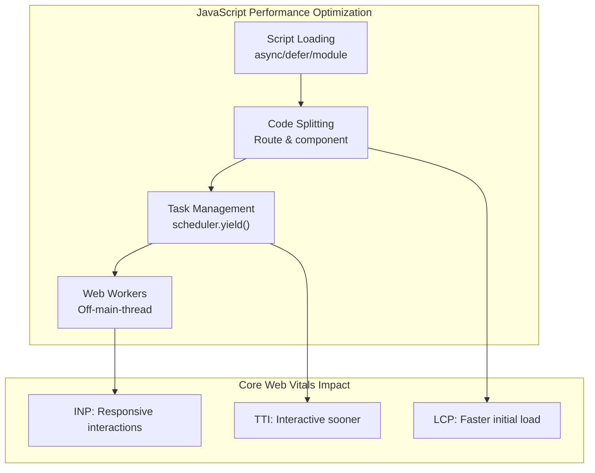
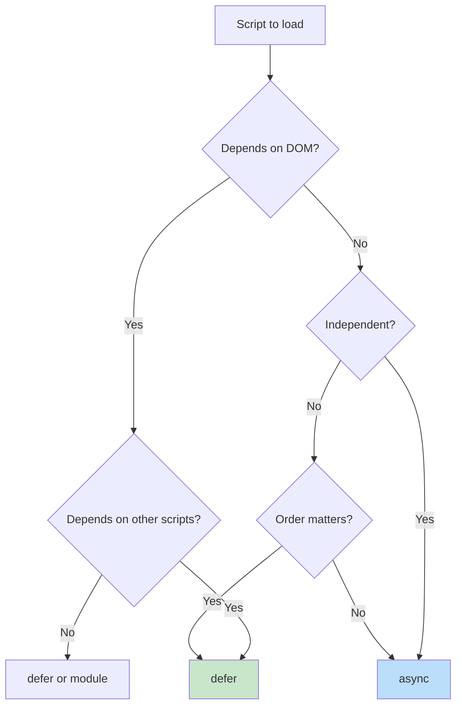

# JavaScript Performance Optimization for the Web

JavaScript execution is the primary source of main-thread blocking in modern web applications. This article covers the browser's script loading pipeline, task scheduling primitives, code splitting strategies, and Web Workers—with emphasis on design rationale and current API status as of 2025.

<figure>



<figcaption>JavaScript performance optimization techniques and their impact on Core Web Vitals metrics.</figcaption>

</figure>

## Abstract

JavaScript performance optimization addresses three distinct bottlenecks:

1. **Parse-time blocking**: Scripts block DOM construction during fetch and execution. The `async`, `defer`, and `type="module"` attributes control when scripts execute relative to parsing—`defer` guarantees document order after parsing completes, `async` executes on arrival (no order guarantee), and modules are deferred by default with dependency resolution.

2. **Run-time blocking**: Tasks exceeding 50ms (the RAIL-derived threshold for perceived responsiveness) block input handling. `scheduler.yield()` (Chrome 129+) yields to the browser while maintaining task priority through a continuation queue mechanism—unlike `setTimeout(0)` which sends work to the back of the queue.

3. **Bundle-size blocking**: Large initial bundles delay Time to Interactive (TTI). Code splitting via dynamic `import()` defers non-critical code; tree shaking eliminates dead exports statically. Both require ES modules—CommonJS is runtime-resolved and cannot be statically analyzed.

Web Workers move computation entirely off the main thread. Transferable objects enable zero-copy data transfer by detaching ownership from the sending context.

## Script Loading: Parser Interaction and Execution Order

The choice of script loading strategy determines when the browser's HTML parser yields control to JavaScript execution.

### Why Parser Blocking Matters

The HTML parser cannot construct DOM nodes while JavaScript executes—JavaScript may call `document.write()` or modify the DOM being built. This creates the fundamental tension: scripts need DOM access, but parsing must complete for DOM to exist.

> **WHATWG HTML spec**: "The classic script will be fetched in parallel and evaluated when the page has finished parsing."

This quote describes `defer` behavior—the spec's solution to the tension. The parser continues unblocked while scripts download, then scripts execute in document order after parsing.

### Execution Order Guarantees by Attribute

| Attribute       | Fetch    | Execute       | Order            | Use Case                                    |
| --------------- | -------- | ------------- | ---------------- | ------------------------------------------- |
| (none)          | Blocking | Immediate     | Document         | Legacy scripts requiring `document.write()` |
| `async`         | Parallel | On arrival    | **None**         | Independent analytics, ads                  |
| `defer`         | Parallel | After parsing | Document         | Application code with DOM dependencies      |
| `type="module"` | Parallel | After parsing | Dependency graph | Modern ESM applications                     |

### Why `defer` Executes After Parsing

The `defer` attribute was introduced in Internet Explorer 4 (1997) and standardized in HTML 4. The design rationale: hint to the browser that the script "does not create any content" via `document.write()`, so parsing can continue.

> **Prior to `defer`**: All scripts blocked parsing during both download and execution. Users saw nothing until scripts completed—a significant perceived performance problem on slow networks.

The parser maintains a "list of scripts that will execute when the document has finished parsing." Deferred scripts append to this list and execute sequentially, preserving document order.

### `async` vs `defer` Decision Matrix



<figcaption>Decision tree for selecting script loading attributes based on dependency requirements.</figcaption>

### Module Scripts: Deferred by Default

ES modules (`type="module"`) are deferred by default with additional semantics:

- **Strict mode**: Always enabled, `this` is `undefined` at top level
- **Dependency resolution**: The module graph is fetched before any execution
- **Top-level `await`**: Supported (blocks dependent modules, not the parser)

```html collapse={1-3}
<!-- Analytics: independent, no DOM dependency -->
<script src="analytics.js" async></script>

<!-- Polyfills → Framework → App: order-dependent -->
<script src="polyfills.js" defer></script>
<script src="framework.js" defer></script>
<script src="app.js" defer></script>

<!-- Modern entry: ESM with automatic deferral -->
<script type="module" src="main.js"></script>
```

**Trade-off**: Module scripts require `nomodule` fallback for legacy browsers (IE11, older Safari), adding bundle complexity.

## Long Task Management: The 50ms Threshold

Tasks exceeding 50ms are classified as "long tasks" and directly impact Interaction to Next Paint (INP).

### Why 50ms?

The threshold derives from the RAIL performance model's responsiveness target:

> **W3C Long Tasks spec**: "Any of the following occurrences whose duration exceeds 50ms."

The reasoning:

- Users perceive responses under 100ms as instantaneous
- A 50ms task budget leaves 50ms for the browser to process input and render
- This 50ms + 50ms = 100ms total maintains perceived responsiveness

> **W3C requestIdleCallback spec**: "The maximum deadline of 50ms is derived from studies which show that a response to user input within 100ms is generally perceived as instantaneous."

### `scheduler.yield()`: Priority-Preserving Yielding

As of Chrome 129 (September 2024), `scheduler.yield()` provides yielding with priority inheritance.

```javascript collapse={1-2}
async function processLargeDataset(items) {
  const results = []
  const BATCH_SIZE = 50

  for (let i = 0; i < items.length; i++) {
    results.push(await computeExpensiveOperation(items[i]))

    // Yield every 50 items, maintaining task priority
    if (i % BATCH_SIZE === 0 && i > 0) {
      await scheduler.yield()
    }
  }

  return results
}
```

### Why Not `setTimeout(0)`?

`setTimeout(0)` has critical limitations that `scheduler.yield()` addresses:

| Aspect                | `setTimeout(0)`                           | `scheduler.yield()`                  |
| --------------------- | ----------------------------------------- | ------------------------------------ |
| Queue position        | Back of task queue                        | Continuation queue (higher priority) |
| Minimum delay         | ~4ms (spec-mandated after 5 nested calls) | None                                 |
| Background throttling | 1000ms+ in background tabs                | Respects priority                    |
| Priority awareness    | None                                      | Inherits from parent task            |

> **WICG Scheduling spec**: "Continuations have a higher effective priority than tasks with the same TaskPriority."

The browser maintains separate continuation queues for each priority level. A `user-visible` continuation runs before `user-visible` regular tasks but after `user-blocking` tasks.

```javascript
// Priority inheritance demonstration
scheduler.postTask(
  async () => {
    // This runs at background priority
    await heavyComputation()

    // After yield, still at background priority
    // But ahead of OTHER background tasks
    await scheduler.yield()

    await moreComputation()
  },
  { priority: "background" },
)
```

### Adaptive Time-Slice Yielding

For variable-cost work items, yield based on elapsed time rather than iteration count:

```javascript collapse={1-3}
async function adaptiveProcessing(workQueue) {
  const TIME_SLICE_MS = 5

  while (workQueue.length > 0) {
    const sliceStart = performance.now()

    // Process until time slice exhausted
    while (workQueue.length > 0 && performance.now() - sliceStart < TIME_SLICE_MS) {
      processWorkItem(workQueue.shift())
    }

    if (workQueue.length > 0) {
      await scheduler.yield()
    }
  }
}
```

### Browser Support and Fallback

| API                    | Chrome          | Firefox        | Safari        |
| ---------------------- | --------------- | -------------- | ------------- |
| `scheduler.postTask()` | 94 (Sept 2021)  | 142 (Aug 2025) | Not supported |
| `scheduler.yield()`    | 129 (Sept 2024) | Not supported  | Not supported |

For browsers without support, fall back to `setTimeout(0)` with the understanding that priority is lost:

```javascript collapse={1-5}
const yieldToMain = () => {
  if ("scheduler" in globalThis && "yield" in scheduler) {
    return scheduler.yield()
  }
  return new Promise((resolve) => setTimeout(resolve, 0))
}
```

## Code Splitting: Reducing Initial Bundle Size

Code splitting defers loading non-critical code until needed, reducing Time to Interactive (TTI).

### Route-Based Splitting

Route-based splitting is the highest-impact strategy—each route loads only its required code:

```javascript collapse={1-4}
import { lazy, Suspense } from "react"
import { Routes, Route } from "react-router-dom"

const Home = lazy(() => import("./pages/Home"))
const Dashboard = lazy(() => import("./pages/Dashboard"))
const Settings = lazy(() => import("./pages/Settings"))

function App() {
  return (
    <Suspense fallback={<LoadingSpinner />}>
      <Routes>
        <Route path="/" element={<Home />} />
        <Route path="/dashboard" element={<Dashboard />} />
        <Route path="/settings" element={<Settings />} />
      </Routes>
    </Suspense>
  )
}
```

### The Chunk Loading Waterfall Problem

Sequential chunk loading creates waterfalls:

1. Download and parse `entry.js`
2. Router determines current route
3. Download route chunk
4. Parse and hydrate

**Solution**: Inject a preload script that runs before the main bundle:

```html
<script>
  const routeChunks = { "/": "home.js", "/dashboard": "dashboard.js" }
  const chunk = routeChunks[location.pathname]
  if (chunk) {
    const link = document.createElement("link")
    link.rel = "preload"
    link.as = "script"
    link.href = `/chunks/${chunk}`
    document.head.appendChild(link)
  }
</script>
```

### `webpackPrefetch` vs `webpackPreload`

| Directive         | Timing               | Priority | Use Case                            |
| ----------------- | -------------------- | -------- | ----------------------------------- |
| `webpackPreload`  | Parallel with parent | Medium   | Needed for current navigation       |
| `webpackPrefetch` | During browser idle  | Low      | Likely needed for future navigation |

```javascript
// Preload: needed NOW, loads in parallel
import(/* webpackPreload: true */ "ChartingLibrary")

// Prefetch: needed LATER, loads during idle
import(/* webpackPrefetch: true */ "./SettingsPage")
```

**Trade-off**: Overusing `preload` competes for bandwidth with critical resources. Prefetch is safer—it uses idle time but may not complete before needed.

### Component-Level Splitting

Split individual heavy components (>30KB) that aren't needed immediately:

```javascript collapse={1-2, 18-23}
import { lazy, Suspense, useState, startTransition } from "react"

const HeavyChart = lazy(() => import("./HeavyChart"))

function Dashboard() {
  const [showChart, setShowChart] = useState(false)

  const loadChart = () => {
    // Use transition to avoid blocking UI
    startTransition(() => setShowChart(true))
  }

  return (
    <div>
      <button onClick={loadChart}>Show Analytics</button>
      {showChart && (
        <Suspense fallback={<ChartSkeleton />}>
          <HeavyChart />
        </Suspense>
      )}
    </div>
  )
}
```

## Tree Shaking: Dead Code Elimination

Tree shaking removes unused exports from the bundle at build time.

### Why ES Modules Enable Tree Shaking

ES modules are **statically analyzable**—imports and exports can be determined at compile time without executing code.

> **ECMA-262 design**: Import/export declarations can only appear at module top level, and specifiers must be string literals.

```javascript
// ✅ Static - bundler knows exactly what's used
import { add, multiply } from "./math.js"

// ❌ Dynamic - cannot analyze at build time
const fn = condition ? "add" : "multiply"
import("./math.js").then((mod) => mod[fn]())
```

CommonJS cannot be tree-shaken because `require()` is a runtime function that can be called conditionally with computed paths.

### When Tree Shaking Fails

1. **Side effects present**: Code that runs on import (polyfills, CSS, prototype modifications)
2. **Dynamic property access**: `utils[methodName]`
3. **Dynamic imports**: The entire module is included
4. **Missing `sideEffects` field**: Bundler assumes all files have side effects

```json
// package.json - declare no side effects for aggressive tree shaking
{
  "sideEffects": false
}

// Or whitelist files with side effects
{
  "sideEffects": ["*.css", "./src/polyfills.js"]
}
```

**Critical pitfall**: `sideEffects: false` without whitelisting CSS files will remove all CSS imports.

### Bundler Differences

| Bundler | Analysis Level      | Trade-off                      |
| ------- | ------------------- | ------------------------------ |
| Rollup  | AST node level      | Best optimization, slower      |
| webpack | Module/export level | Relies on Terser for final DCE |
| esbuild | Top-level statement | Fastest, more conservative     |

esbuild interprets `sideEffects: false` narrowly—it removes entire unused modules but doesn't tree-shake individual statements within modules.

## Web Workers: Off-Main-Thread Computation

Web Workers run JavaScript in background threads, preventing long computations from blocking the main thread.

### When to Use Workers

Workers have overhead: message serialization, thread creation, no DOM access. Use them for:

- **CPU-intensive computation**: Image processing, encryption, compression
- **Large data processing**: Sorting, filtering, aggregation
- **Background sync**: Data transformation while UI remains responsive

> **WHATWG Workers spec**: "Workers are relatively heavy-weight, and are not intended to be used in large numbers."

### Basic Worker Pattern

```javascript title="main.js"
const worker = new Worker("worker.js")

worker.postMessage({ type: "PROCESS", data: largeDataset })

worker.onmessage = (event) => {
  if (event.data.type === "COMPLETE") {
    updateUI(event.data.result)
  }
}

worker.onerror = (error) => {
  console.error("Worker error:", error.message)
}
```

```javascript title="worker.js"
self.onmessage = (event) => {
  const { type, data } = event.data

  if (type === "PROCESS") {
    try {
      const result = expensiveComputation(data)
      self.postMessage({ type: "COMPLETE", result })
    } catch (error) {
      self.postMessage({ type: "ERROR", message: error.message })
    }
  }
}
```

### Transferable Objects: Zero-Copy Transfer

By default, `postMessage` uses the structured clone algorithm—deep copying data. For large `ArrayBuffer`s, use transfer instead:

```javascript
const buffer = new ArrayBuffer(1024 * 1024 * 100) // 100MB
console.log(buffer.byteLength) // 104857600

// Transfer ownership - zero copy
worker.postMessage({ buffer }, [buffer])

console.log(buffer.byteLength) // 0 (detached)
```

> **WHATWG spec**: "Transferring is an irreversible and non-idempotent operation. Once transferred, an object cannot be transferred or used again."

**Transferable types**: `ArrayBuffer`, `MessagePort`, `ImageBitmap`, `OffscreenCanvas`, `ReadableStream`, `WritableStream`, `TransformStream`, `VideoFrame`, `AudioData`.

**Common mistake**: `TypedArray`s (e.g., `Uint8Array`) are **not** transferable—only their underlying `ArrayBuffer` is.

### Error Handling Edge Cases

**Synchronous exceptions** propagate to the parent via `worker.onerror`:

```javascript
worker.onerror = (event) => {
  console.error(`Worker error: ${event.message} at ${event.filename}:${event.lineno}`)
  event.preventDefault() // Prevents default error logging
}
```

**Unhandled promise rejections do NOT propagate** to the parent—they only log to the worker's console. Implement explicit error messaging:

```javascript title="worker.js"
self.addEventListener("unhandledrejection", (event) => {
  self.postMessage({
    type: "ERROR",
    message: event.reason?.message || "Unhandled rejection",
  })
})
```

### Worker Pool for Parallel Processing

```javascript collapse={1-14, 29-50}
class WorkerPool {
  constructor(workerScript, poolSize = navigator.hardwareConcurrency) {
    this.workers = []
    this.queue = []
    this.available = []

    for (let i = 0; i < poolSize; i++) {
      const worker = new Worker(workerScript)
      worker.onmessage = (e) => this.handleMessage(worker, e)
      worker.onerror = (e) => this.handleError(worker, e)
      this.workers.push(worker)
      this.available.push(worker)
    }
  }

  execute(task) {
    return new Promise((resolve, reject) => {
      const wrapper = { task, resolve, reject }

      if (this.available.length > 0) {
        this.dispatch(this.available.pop(), wrapper)
      } else {
        this.queue.push(wrapper)
      }
    })
  }

  dispatch(worker, wrapper) {
    worker.currentTask = wrapper
    worker.postMessage(wrapper.task)
  }

  handleMessage(worker, event) {
    const { resolve, reject } = worker.currentTask

    if (event.data.error) {
      reject(new Error(event.data.error))
    } else {
      resolve(event.data.result)
    }

    // Return to pool or process queue
    if (this.queue.length > 0) {
      this.dispatch(worker, this.queue.shift())
    } else {
      this.available.push(worker)
    }
  }

  handleError(worker, event) {
    worker.currentTask?.reject(new Error(event.message))
    // Worker may be unusable - consider recreating
  }

  terminate() {
    this.workers.forEach((w) => w.terminate())
  }
}
```

### SharedArrayBuffer and Cross-Origin Isolation

`SharedArrayBuffer` enables shared memory between workers but requires cross-origin isolation due to Spectre/Meltdown mitigations:

```http
Cross-Origin-Opener-Policy: same-origin
Cross-Origin-Embedder-Policy: require-corp
```

**Why the restriction**: `SharedArrayBuffer` enables construction of nanosecond-resolution timers that can be used for cache timing attacks to extract cross-origin data.

```javascript
// Verify cross-origin isolation
if (crossOriginIsolated) {
  const shared = new SharedArrayBuffer(1024)
  // Can use Atomics for synchronization
} else {
  console.warn("SharedArrayBuffer unavailable - not cross-origin isolated")
}
```

**Safari limitation**: Safari does not support `COEP: credentialless`, requiring the stricter `require-corp` mode where all cross-origin resources must explicitly opt-in with CORS or CORP headers.

## React Optimization Patterns

React applications have framework-specific optimization opportunities.

### React.memo: Preventing Unnecessary Re-renders

`React.memo` creates a higher-order component that skips re-rendering when props are shallowly equal:

```javascript collapse={12-18}
const ExpensiveList = React.memo(function ExpensiveList({ items, onSelect }) {
  return (
    <ul>
      {items.map((item) => (
        <li key={item.id} onClick={() => onSelect(item.id)}>
          {item.name}
        </li>
      ))}
    </ul>
  )
})

// Custom comparison for complex props
const MemoizedChart = React.memo(
  function Chart({ data, config }) {
    return <ChartImpl data={data} config={config} />
  },
  (prev, next) => {
    return prev.data.length === next.data.length && prev.config.type === next.config.type
  },
)
```

**When to use**: Components that receive the same props frequently, expensive render logic, components deep in the tree that re-render due to parent updates.

**When NOT to use**: Components that always receive new props (breaks memoization), simple components (memo overhead exceeds render cost).

### useMemo and useCallback: Stabilizing References

```javascript collapse={1-2, 16-20}
function DataGrid({ data, filters, onRowClick }) {
  const [sortConfig, setSortConfig] = useState({ key: "id", direction: "asc" })

  // Memoize expensive computation
  const filteredData = useMemo(() => {
    return data.filter((item) => matchesFilters(item, filters)).sort((a, b) => compareBy(a, b, sortConfig))
  }, [data, filters, sortConfig])

  // Stabilize callback reference for memoized children
  const handleRowClick = useCallback(
    (rowId) => {
      onRowClick(rowId)
    },
    [onRowClick],
  )

  return <MemoizedTable data={filteredData} onRowClick={handleRowClick} />
}
```

### React Server Components

As of React 18, Server Components run on the server with zero client bundle impact:

```javascript title="ServerComponent.jsx"
// No 'use client' - runs on server only
import { db } from "./database" // Server-only module
import ClientChart from "./ClientChart"

export default async function Dashboard({ userId }) {
  // Direct database access - no API needed
  const metrics = await db.query("SELECT * FROM metrics WHERE user_id = ?", [userId])

  return (
    <div>
      <h1>Dashboard</h1>
      {/* ClientChart creates a split point */}
      <ClientChart data={metrics} />
    </div>
  )
}
```

```javascript title="ClientChart.jsx"
"use client"

import { useState } from "react"

export default function ClientChart({ data }) {
  const [zoom, setZoom] = useState(1)
  return <canvas data-zoom={zoom} />
}
```

**Key insight**: The `'use client'` directive creates an automatic code split point. Server-side dependencies (database clients, large processing libraries) never ship to the client.

### Virtualization for Large Lists

For lists with thousands of items, render only visible items:

```javascript collapse={1-3}
import { useVirtualizer } from "@tanstack/react-virtual"

function VirtualList({ items }) {
  const parentRef = useRef(null)

  const virtualizer = useVirtualizer({
    count: items.length,
    getScrollElement: () => parentRef.current,
    estimateSize: () => 50, // Estimated row height
    overscan: 5, // Render 5 extra items above/below viewport
  })

  return (
    <div ref={parentRef} style={{ height: "400px", overflow: "auto" }}>
      <div style={{ height: virtualizer.getTotalSize() }}>
        {virtualizer.getVirtualItems().map((virtualRow) => (
          <div
            key={virtualRow.key}
            style={{
              position: "absolute",
              top: virtualRow.start,
              height: virtualRow.size,
            }}
          >
            {items[virtualRow.index].name}
          </div>
        ))}
      </div>
    </div>
  )
}
```

## Performance Measurement

Effective optimization requires continuous measurement.

### Core Web Vitals Monitoring

```javascript collapse={1-7, 35-45}
class PerformanceMonitor {
  constructor() {
    this.metrics = {}
    this.setupObservers()
  }

  setupObservers() {
    // Largest Contentful Paint
    new PerformanceObserver((list) => {
      const entries = list.getEntries()
      this.metrics.lcp = entries[entries.length - 1].startTime
    }).observe({ type: "largest-contentful-paint" })

    // Interaction to Next Paint (replaced FID March 2024)
    new PerformanceObserver((list) => {
      for (const entry of list.getEntries()) {
        if (!this.metrics.inp || entry.duration > this.metrics.inp) {
          this.metrics.inp = entry.duration
        }
      }
    }).observe({ type: "event", buffered: true, durationThreshold: 16 })

    // Cumulative Layout Shift
    let clsValue = 0
    new PerformanceObserver((list) => {
      for (const entry of list.getEntries()) {
        if (!entry.hadRecentInput) {
          clsValue += entry.value
          this.metrics.cls = clsValue
        }
      }
    }).observe({ type: "layout-shift" })
  }

  report() {
    navigator.sendBeacon("/api/metrics", JSON.stringify(this.metrics))
  }
}
```

### Long Task Detection

```javascript
const longTaskObserver = new PerformanceObserver((list) => {
  for (const entry of list.getEntries()) {
    if (entry.duration > 100) {
      console.warn(`Long task: ${entry.duration.toFixed(0)}ms`, {
        attribution: entry.attribution,
      })
    }
  }
})

longTaskObserver.observe({ type: "longtask" })
```

## Conclusion

JavaScript performance optimization requires understanding browser internals:

- **Script loading** trades off parser blocking against execution timing—use `defer` for order-dependent application code, `async` for independent scripts
- **Task scheduling** with `scheduler.yield()` maintains priority while yielding, unlike `setTimeout` which loses queue position
- **Code splitting** reduces initial load but creates chunk waterfalls—mitigate with preload hints
- **Tree shaking** requires ES modules and explicit side-effect declarations
- **Web Workers** move computation off-thread but add message serialization overhead—use transfer for large buffers

Measure before optimizing. INP, LCP, and Long Task observers provide visibility into actual user experience, not just synthetic benchmarks.

## Appendix

### Prerequisites

- Familiarity with JavaScript event loop and task queue model
- Understanding of browser rendering pipeline (parse, style, layout, paint)
- Basic React knowledge for framework-specific sections

### Summary

- **Script loading**: `defer` = order-preserved after parsing; `async` = executes on arrival (no order); `module` = deferred with dependency resolution
- **50ms threshold**: RAIL model target—100ms perceived instant, 50ms task budget leaves room for input handling
- **`scheduler.yield()`**: Chrome 129+, maintains priority via continuation queues; falls back to `setTimeout(0)` elsewhere
- **Tree shaking**: Requires ES modules (static structure); fails with side effects, dynamic imports, missing `sideEffects` field
- **Web Workers**: Off-thread computation; use transfer for large `ArrayBuffer`s; promise rejections don't propagate
- **INP replaced FID**: March 2024, measures full interaction latency not just input delay

### References

#### Specifications

- [WHATWG HTML - Scripting](https://html.spec.whatwg.org/multipage/scripting.html) - Script loading attributes and execution order
- [W3C Long Tasks API](https://w3c.github.io/longtasks/) - 50ms threshold definition
- [WICG Prioritized Task Scheduling](https://wicg.github.io/scheduling-apis/) - scheduler.yield() and scheduler.postTask()
- [W3C requestIdleCallback](https://w3c.github.io/requestidlecallback/) - 50ms deadline rationale
- [WHATWG HTML - Web Workers](https://html.spec.whatwg.org/multipage/workers.html) - Worker lifecycle and messaging
- [WHATWG - Structured Clone](https://html.spec.whatwg.org/multipage/structured-data.html) - Serialization algorithm and transferables
- [ECMA-262](https://262.ecma-international.org/) - ES module static structure

#### Official Documentation

- [MDN - Script Element](https://developer.mozilla.org/en-US/docs/Web/HTML/Element/script) - async, defer, module
- [MDN - scheduler.yield()](https://developer.mozilla.org/en-US/docs/Web/API/Scheduler/yield) - API reference and browser support
- [MDN - Web Workers API](https://developer.mozilla.org/en-US/docs/Web/API/Web_Workers_API) - Worker patterns
- [MDN - Transferable Objects](https://developer.mozilla.org/en-US/docs/Web/API/Web_Workers_API/Transferable_objects) - Zero-copy transfer
- [webpack - Code Splitting](https://webpack.js.org/guides/code-splitting/) - Dynamic imports and chunk configuration
- [webpack - Tree Shaking](https://webpack.js.org/guides/tree-shaking/) - sideEffects field
- [React - lazy](https://react.dev/reference/react/lazy) - Component-level code splitting
- [React - Server Components](https://react.dev/reference/rsc/server-components) - Server/client boundary

#### Core Maintainer Content

- [WICG Yield Explainer](https://github.com/WICG/scheduling-apis/blob/main/explainers/yield-and-continuation.md) - Priority inheritance mechanism
- [Chrome Developers - scheduler.yield()](https://developer.chrome.com/blog/use-scheduler-yield) - setTimeout limitations
- [V8 Blog - Spectre](https://v8.dev/blog/spectre) - SharedArrayBuffer security restrictions
- [React 18 Suspense SSR Architecture](https://github.com/reactwg/react-18/discussions/37) - Streaming and selective hydration

#### Industry Expert Content

- [web.dev - Optimize Long Tasks](https://web.dev/articles/optimize-long-tasks) - Task scheduling strategies
- [web.dev - INP](https://web.dev/articles/inp) - Interaction to Next Paint metric
- [web.dev - CommonJS Bundles](https://web.dev/articles/commonjs-larger-bundles) - Why CommonJS prevents tree shaking
