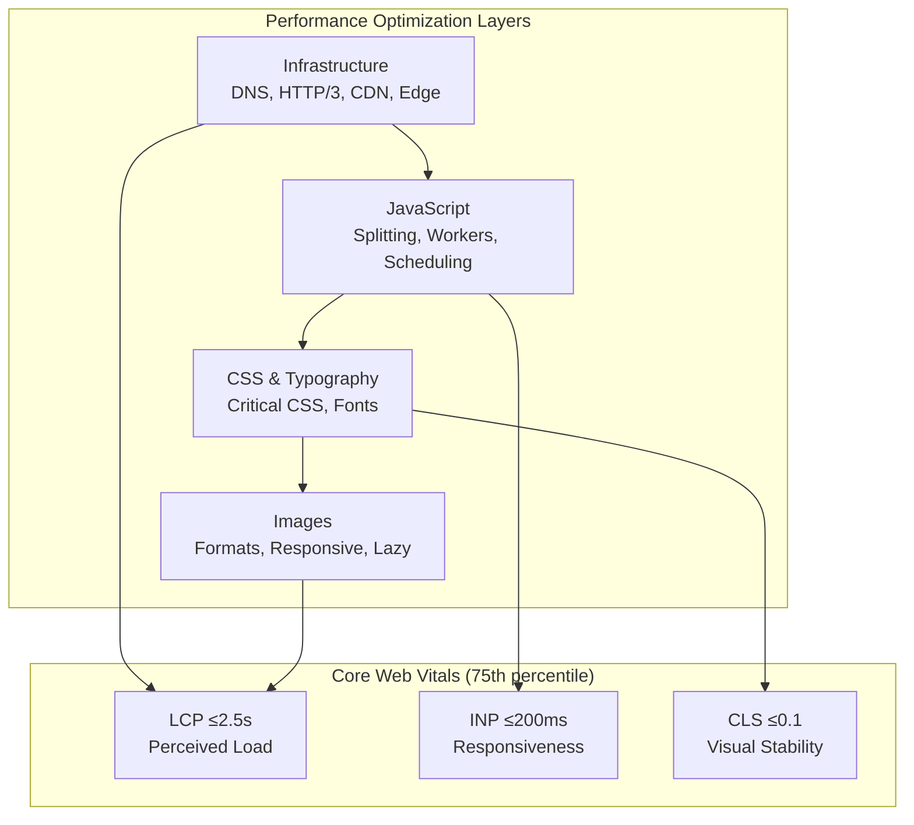

# Web Performance Optimization: Overview and Playbook

Overview of web performance optimization covering infrastructure, JavaScript, CSS, images, and fonts. Provides quick reference tables and links to detailed articles in the series.

<figure>



<figcaption>Web performance optimization layers and their impact on Core Web Vitals</figcaption>

</figure>

## Abstract

Web performance optimization reduces to three user-centric questions: **How fast does content appear?** (Largest Contentful Paint, or LCP), **How quickly does the page respond?** (Interaction to Next Paint, or INP), and **Does the layout stay stable?** (Cumulative Layout Shift, or CLS). These Core Web Vitals (CWV) are Google's ranking signals measured at the 75th percentile—a page passes only when 75% of real user visits meet the "good" threshold for all three metrics.

The optimization stack follows a dependency chain:

1. **Infrastructure** (DNS, HTTP/3, CDN, caching) determines the floor for all metrics—you cannot optimize your way out of a slow origin or missing edge cache
2. **JavaScript** (bundle size, long tasks, workers) directly gates INP—a 200ms task budget means breaking work into chunks and offloading computation
3. **CSS & Typography** (critical path, containment, font loading) affects both CLS and LCP—inlined critical CSS and font metric overrides eliminate layout shifts
4. **Images** (formats, responsive sizing, loading priority) dominate LCP on media-heavy pages—AVIF/WebP and `fetchpriority` target the largest element

Each layer has diminishing returns without the previous layer being sound. A perfectly code-split bundle won't help if TTFB is 2 seconds. Zero-CLS font loading won't matter if JavaScript blocks the main thread for 500ms.

## Core Web Vitals Thresholds

As of March 2024, Core Web Vitals consist of three metrics that capture the user experience dimensions Google considers most critical: loading, interactivity, and visual stability.

| Metric                              | Good   | Needs Improvement | Poor   | What It Measures                          |
| ----------------------------------- | ------ | ----------------- | ------ | ----------------------------------------- |
| **LCP** (Largest Contentful Paint)  | ≤2.5s  | 2.5s–4.0s         | >4.0s  | When the main content becomes visible     |
| **INP** (Interaction to Next Paint) | ≤200ms | 200ms–500ms       | >500ms | Responsiveness to all user interactions   |
| **CLS** (Cumulative Layout Shift)   | ≤0.1   | 0.1–0.25          | >0.25  | Unexpected layout movement during session |

**Supporting metric (not a Core Web Vital):**

| Metric                        | Good   | Needs Improvement | Poor   | Why It Matters                            |
| ----------------------------- | ------ | ----------------- | ------ | ----------------------------------------- |
| **TTFB** (Time to First Byte) | ≤200ms | 200ms–500ms       | >500ms | Sets the floor for all downstream metrics |

TTFB is excluded from CWV because fast server response doesn't guarantee good user experience—a page can have 100ms TTFB but 5 seconds of JavaScript blocking LCP. However, slow TTFB makes good LCP nearly impossible.

### Why These Metrics?

Google's threshold methodology targets the 75th percentile with a balance between achievability (most sites can reach "good") and meaningfulness (users perceive the difference). The 2.5s LCP threshold corresponds to research showing users begin abandoning pages after 3 seconds; 200ms INP aligns with the 100-200ms window where interactions feel instant; 0.1 CLS represents shifts users barely notice.

> **INP replaced FID in March 2024:** First Input Delay (FID) measured only the _first_ interaction's input delay. INP measures _every_ interaction throughout the session, including input delay + processing time + presentation delay. Most sites that passed FID failed INP initially because FID ignored subsequent interactions and processing time entirely.

## 1. Infrastructure & Architecture

Infrastructure determines the performance floor. Network round trips, server processing, and cache misses create latency that no amount of frontend optimization can overcome. A 2-second TTFB leaves only 500ms for everything else if targeting 2.5s LCP.

**Detailed coverage**: [Infrastructure Optimization for Web Performance](../web-performance-infrastructure-stack/README.md)

### Quick Reference

| Layer            | Key Technologies           | Target Metrics      |
| ---------------- | -------------------------- | ------------------- |
| **DNS**          | SVCB/HTTPS records         | <50ms resolution    |
| **Protocol**     | HTTP/3, TLS 1.3, QUIC      | <100ms connection   |
| **Edge**         | CDN, Edge Functions        | >80% origin offload |
| **Origin**       | Load balancing, Redis      | <100ms TTFB         |
| **Architecture** | Islands, BFF, Resumability | 50-80% JS reduction |

### Key Techniques

- **DNS Protocol Discovery**: HTTPS records enable HTTP/3 discovery, saving 100-300ms on connection establishment
- **HTTP/3 and QUIC**: Eliminates TCP head-of-line blocking; up to 55% faster page loads in high packet loss scenarios ([Cloudflare HTTP/3 benchmarks](https://blog.cloudflare.com/http-3-vs-http-2/))
- **Edge Computing**: Run logic at CDN edge for personalization, A/B testing, auth
- **BFF Pattern**: 30-50% payload reduction, 60-80% fewer API requests
- **Multi-layer Caching**: Service Worker + IndexedDB + CDN for comprehensive caching

## 2. JavaScript Optimization

JavaScript directly gates INP. Every millisecond of main thread blocking is a millisecond added to interaction latency. The 200ms INP budget means: receive input, run handlers, let browser paint—all within 200ms. Long tasks (>50ms) risk exceeding this budget on slower devices.

**Detailed coverage**: [JavaScript Performance Optimization](../web-performance-javascript-optimization/README.md)

### Quick Reference

| Technique             | Use Case          | Impact                         |
| --------------------- | ----------------- | ------------------------------ |
| **async/defer**       | Script loading    | Unblock HTML parsing           |
| **Code splitting**    | Large bundles     | 50-80% initial reduction       |
| **scheduler.yield()** | Long tasks >50ms  | Better INP, no jank            |
| **Web Workers**       | Heavy computation | Off main thread                |
| **React.memo**        | Component updates | Prevent unnecessary re-renders |

### Key Techniques

- **Script Loading**: Use `defer` for app code (preserves order), `async` for independent scripts
- **Code Splitting**: Route-based with `React.lazy()` + `Suspense`, component-level for heavy widgets
- **Task Scheduling**: `scheduler.yield()` every 50 items or 5ms to maintain responsiveness
- **Worker Pools**: Manage multiple workers for parallel computation with task queuing
- **Tree Shaking**: Mark packages `sideEffects: false`, use ES modules for dead code elimination

## 3. CSS & Typography

CSS blocks rendering until parsed; fonts cause layout shifts when they swap. The critical rendering path requires CSS before first paint, but only the CSS needed for above-the-fold content. Font loading is a common CLS culprit—fallback fonts have different metrics than web fonts, causing text to reflow on swap.

**Detailed coverage**: [CSS and Typography Optimization](../web-performance-css-typography/README.md)

### Quick Reference

| Technique            | Use Case              | Impact                    |
| -------------------- | --------------------- | ------------------------- |
| **Critical CSS**     | Above-the-fold styles | Eliminate render-blocking |
| **CSS Containment**  | Layout isolation      | 20-40% layout savings     |
| **WOFF2 + subset**   | Font delivery         | 65-90% smaller fonts      |
| **font-display**     | Loading strategy      | Control FOIT/FOUT         |
| **Metric overrides** | Fallback matching     | Zero-CLS font swap        |

### Key Techniques

- **Critical CSS**: Inline ≤14KB above-the-fold styles, defer rest with media="print" swap
- **CSS Containment**: `contain: layout paint style` isolates reflows to subtrees
- **Compositor Animations**: Only animate `transform` and `opacity` for 60fps
- **Font Subsetting**: Remove unused glyphs with pyftsubset for 65-90% reduction
- **Variable Fonts**: Single file for all weights, smaller than 3+ static files combined
- **Font Metric Overrides**: `size-adjust`, `ascent-override` for zero-CLS fallback fonts

## 4. Image Optimization

Images are typically the LCP element on content-heavy pages. A hero image that's 2MB and served in JPEG when AVIF would be 400KB directly delays LCP. Beyond format, loading strategy matters: the browser must discover, request, download, and decode the image before it can paint.

**Detailed coverage**: [Image Optimization for Web Performance](../web-performance-image-optimization/README.md)

### Quick Reference

| Technique            | Use Case            | Impact                    |
| -------------------- | ------------------- | ------------------------- |
| **AVIF/WebP**        | Modern browsers     | 30-50% smaller than JPEG  |
| **srcset + sizes**   | Responsive images   | Right size per device     |
| **loading="lazy"**   | Below fold images   | Reduce initial payload    |
| **fetchpriority**    | LCP images          | 10-25% faster LCP         |
| **decoding="async"** | Non-blocking decode | Up to 20% LCP improvement |

### Format Selection

| Format   | Compression vs JPEG | Browser Support | Best Use Case           |
| -------- | ------------------- | --------------- | ----------------------- |
| **AVIF** | 1.5-2× smaller      | ~94%            | HDR photos, rich media  |
| **WebP** | 1.25-1.34× smaller  | ~97%            | General web photos & UI |
| **JPEG** | 1× (baseline)       | 100%            | Universal fallback      |
| **PNG**  | Lossless            | 100%            | Graphics, transparency  |

### Key Techniques

- **Picture Element**: Format negotiation with AVIF → WebP → JPEG fallback chain
- **Responsive Images**: `srcset` with width descriptors, `sizes` for layout hints
- **LCP Images**: `loading="eager"` + `fetchpriority="high"` + `decoding="async"`
- **Below-fold Images**: `loading="lazy"` with 200px rootMargin for prefetching
- **Network-aware Loading**: Adjust quality based on `navigator.connection.effectiveType`

## 5. Performance Monitoring

Continuous monitoring ensures optimizations remain effective and regressions are caught early.

### Key Metrics to Track

- **Core Web Vitals**: LCP, INP, CLS via PerformanceObserver
- **TTFB and Server Response**: Backend and infrastructure health
- **Bundle Sizes**: Track with size-limit, fail builds on regression
- **Cache Hit Rates**: CDN and service worker effectiveness

### Monitoring Tools

| Tool                    | Purpose                     | Integration    |
| ----------------------- | --------------------------- | -------------- |
| **Lighthouse CI**       | Synthetic monitoring        | GitHub Actions |
| **size-limit**          | Bundle size budgets         | CI/CD pipeline |
| **PerformanceObserver** | Real User Monitoring        | Analytics      |
| **WebPageTest**         | Detailed waterfall analysis | Manual testing |

## Implementation Checklist

### Infrastructure

- [ ] Enable HTTP/3 with HTTPS DNS records
- [ ] Configure TLS 1.3 with 0-RTT resumption
- [ ] Set up CDN with edge computing capabilities
- [ ] Implement multi-layer caching (CDN + Service Worker + Redis)
- [ ] Configure Brotli compression (level 11 static, level 4-5 dynamic)

### JavaScript

- [ ] Implement route-based code splitting
- [ ] Use `scheduler.yield()` for tasks >50ms
- [ ] Offload heavy computation to Web Workers
- [ ] Configure tree shaking with ES modules
- [ ] Set up bundle size budgets in CI

### CSS & Typography

- [ ] Extract and inline critical CSS (≤14KB)
- [ ] Apply CSS containment to independent sections
- [ ] Use WOFF2 format with subsetting
- [ ] Implement font metric overrides for zero-CLS
- [ ] Preload critical fonts with crossorigin attribute

### Images

- [ ] Serve AVIF/WebP with JPEG fallback via `<picture>`
- [ ] Implement responsive images with srcset and sizes
- [ ] Use `fetchpriority="high"` for LCP images
- [ ] Apply `loading="lazy"` to below-fold images
- [ ] Set explicit width/height to prevent CLS

### Monitoring

- [ ] Set up Lighthouse CI in GitHub Actions
- [ ] Configure bundle size budgets with size-limit
- [ ] Implement RUM with PerformanceObserver
- [ ] Create performance dashboards and alerts

## Performance Budget Reference

```json
{
  "resourceSizes": {
    "total": "500KB",
    "javascript": "150KB",
    "css": "50KB",
    "images": "200KB",
    "fonts": "75KB"
  },
  "metrics": {
    "lcp": "2.5s",
    "fcp": "1.8s",
    "ttfb": "200ms",
    "inp": "200ms",
    "cls": "0.1"
  }
}
```

## Series Articles

| Article                                                                          | Focus Area              | Key Topics                                 |
| -------------------------------------------------------------------------------- | ----------------------- | ------------------------------------------ |
| [Infrastructure Optimization](../web-performance-infrastructure-stack/README.md) | Network & Architecture  | DNS, HTTP/3, CDN, Edge, BFF, Caching       |
| [JavaScript Optimization](../web-performance-javascript-optimization/README.md)  | Client-side Performance | Code splitting, Workers, React, Scheduling |
| [CSS & Typography](../web-performance-css-typography/README.md)                  | Rendering & Fonts       | Critical CSS, Containment, Font loading    |
| [Image Optimization](../web-performance-image-optimization/README.md)            | Media Delivery          | Formats, Responsive, Lazy loading          |

## Conclusion

Web performance optimization follows a layered dependency model where each layer sets constraints for the next. Infrastructure determines the floor (TTFB), JavaScript controls interactivity (INP), CSS/fonts affect stability and render timing (CLS, LCP), and images often dominate the critical path for LCP.

The Core Web Vitals framework—LCP, INP, CLS measured at the 75th percentile—provides a user-centric success criterion. Optimization work should be prioritized by which metric is failing and which layer is the bottleneck. A site with good infrastructure but poor INP needs JavaScript work, not more CDN tuning.

Start with measurement (RUM and synthetic), identify the weakest metric, trace it to the responsible layer, and apply targeted fixes. The detailed articles in this series cover each layer's implementation specifics.

## Appendix

### Prerequisites

- Understanding of browser rendering pipeline (parsing, layout, paint, composite)
- Familiarity with HTTP protocol basics
- Basic knowledge of JavaScript execution model and event loop

### Summary

- **Core Web Vitals** (as of March 2024): LCP ≤2.5s, INP ≤200ms, CLS ≤0.1—measured at the 75th percentile
- **Optimization layers**: Infrastructure → JavaScript → CSS/Typography → Images, each constraining the next
- **Infrastructure**: HTTP/3, CDN edge computing, multi-layer caching target TTFB <200ms
- **JavaScript**: Code splitting, task scheduling with `scheduler.yield()`, Web Workers maintain INP <200ms
- **CSS & Fonts**: Critical CSS inlining, font metric overrides eliminate CLS from font loading
- **Images**: AVIF/WebP formats, responsive delivery, `fetchpriority` for LCP images

### References

**Specifications and Standards**

- [Web Vitals](https://web.dev/articles/vitals) - Google's Core Web Vitals specification and thresholds
- [Interaction to Next Paint (INP)](https://web.dev/articles/inp) - INP metric definition and measurement
- [Largest Contentful Paint (LCP)](https://web.dev/articles/lcp) - LCP specification
- [Cumulative Layout Shift (CLS)](https://web.dev/articles/cls) - CLS calculation methodology
- [Defining Core Web Vitals Thresholds](https://web.dev/articles/defining-core-web-vitals-thresholds) - Rationale behind threshold values

**Official Documentation**

- [INP Becomes a Core Web Vital (March 2024)](https://web.dev/blog/inp-cwv-march-12) - INP replacing FID announcement
- [HTTP/3 Explained](https://http3-explained.haxx.se/) - QUIC and HTTP/3 protocol guide
- [Time to First Byte (TTFB)](https://web.dev/articles/ttfb) - Why TTFB is not a Core Web Vital
- [Lighthouse CI](https://github.com/GoogleChrome/lighthouse-ci) - Synthetic performance testing

**Implementation References**

- [Web Workers API - MDN](https://developer.mozilla.org/en-US/docs/Web/API/Web_Workers_API) - Background thread processing
- [CSS Containment - MDN](https://developer.mozilla.org/en-US/docs/Web/CSS/CSS_containment) - Layout isolation
- [Responsive Images - MDN](https://developer.mozilla.org/en-US/docs/Learn/HTML/Multimedia_and_embedding/Responsive_images) - srcset and sizes
- [Variable Fonts - MDN](https://developer.mozilla.org/en-US/docs/Web/CSS/CSS_fonts/Variable_fonts_guide) - Font optimization
