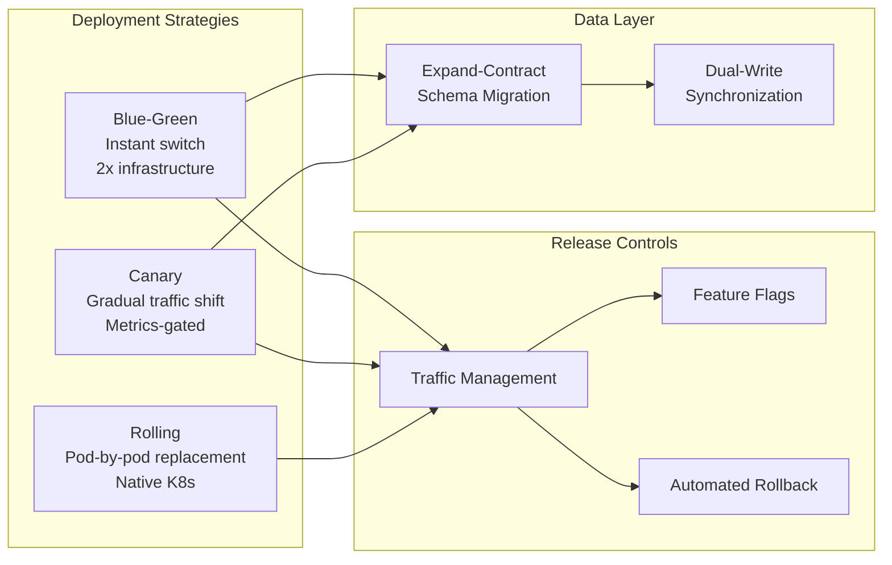
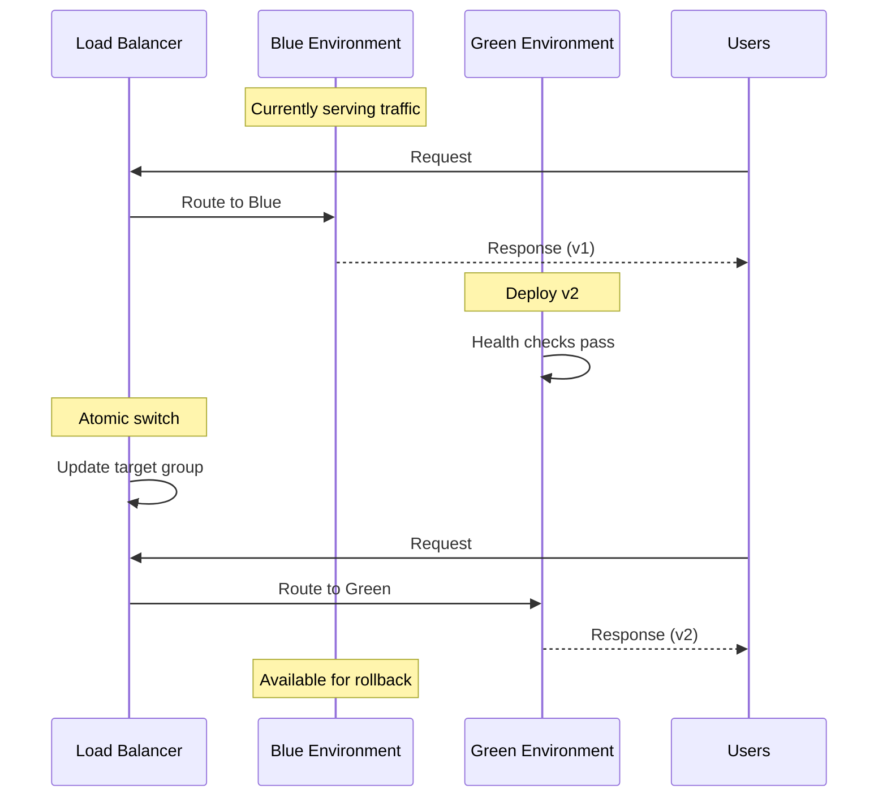
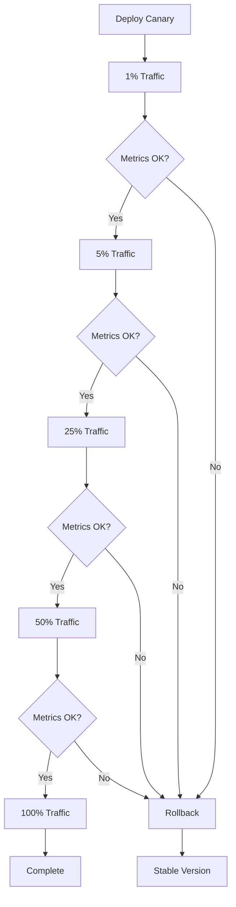
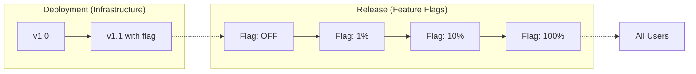
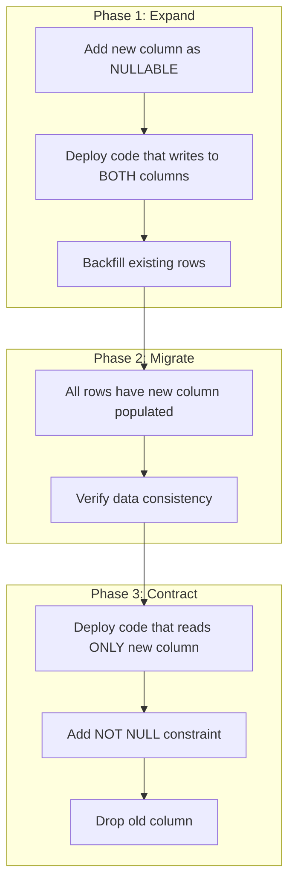

# Deployment Strategies: Blue-Green, Canary, and Rolling

Production deployment strategies for balancing release velocity against blast radius. Covers the architectural trade-offs between blue-green, canary, and rolling deployments—with specific focus on traffic shifting mechanics, database migration coordination, automated rollback criteria, and operational failure modes that senior engineers encounter during incident response.

<figure>



<figcaption>Deployment strategy landscape: each strategy connects to traffic management and data layer concerns. Blue-green and canary require explicit schema migration coordination; rolling updates assume backward compatibility.</figcaption>

</figure>

## Abstract

Deployment strategy selection reduces to three variables: **blast radius** (percentage of users exposed to failures), **rollback speed** (time to restore previous behavior), and **infrastructure cost** (resource overhead during deployment).

| Strategy       | Blast Radius             | Rollback Speed            | Infrastructure Cost          | Complexity |
| -------------- | ------------------------ | ------------------------- | ---------------------------- | ---------- |
| **Blue-Green** | 100% (all at once)       | Instant (traffic switch)  | 2x (parallel environments)   | Moderate   |
| **Canary**     | Configurable (1-100%)    | Fast (stop traffic shift) | Minimal (small canary fleet) | High       |
| **Rolling**    | Growing (during rollout) | Slow (reverse rollout)    | Minimal (surge capacity)     | Low        |

**Key architectural insight**: The choice isn't which strategy is "best"—it's which failure mode is acceptable. Blue-green trades cost for instant rollback. Canary trades complexity for controlled exposure. Rolling trades rollback speed for simplicity.

**Feature flags** decouple deployment from release: code reaches production with features disabled, then gradually enabled independent of infrastructure changes. This shifts blast radius control from infrastructure to application layer.

**Database migrations** constrain all strategies: schema changes must be backward-compatible during the transition window, or you lose the ability to rollback without data loss.

## Blue-Green Deployments

Blue-green deployment maintains two identical production environments. At any time, one ("blue") serves traffic while the other ("green") is idle or receiving the new release. Deployment completes with an atomic traffic switch.

### Architecture and Traffic Switching

The core requirement: a routing layer that can instantly redirect 100% of traffic between environments. Implementation options:

| Routing Method    | Switch Speed                 | Complexity | Use Case                      |
| ----------------- | ---------------------------- | ---------- | ----------------------------- |
| **Load balancer** | Seconds                      | Low        | AWS ALB/NLB target group swap |
| **DNS**           | Minutes (TTL-dependent)      | Low        | Global traffic management     |
| **Service mesh**  | Seconds                      | High       | Kubernetes with Istio/Linkerd |
| **CDN origin**    | Minutes (cache invalidation) | Moderate   | Static sites, CloudFront      |

**Why atomic switching matters**: Partial deployments create version skew—users might receive HTML from v2 but JavaScript from v1. Blue-green eliminates this by ensuring all requests hit one environment or the other, never both simultaneously.

<figure>



<figcaption>Blue-green deployment sequence: traffic switches atomically after health checks pass on the green environment. Blue remains available for instant rollback.</figcaption>

</figure>

### AWS Implementation

AWS CodeDeploy with ECS supports blue-green natively. Traffic shifting options from the [AWS ECS deployment documentation](https://docs.aws.amazon.com/AmazonECS/latest/developerguide/deployment-type-bluegreen.html):

| Configuration                                       | Behavior                     |
| --------------------------------------------------- | ---------------------------- |
| `CodeDeployDefault.ECSAllAtOnce`                    | Immediate 100% switch        |
| `CodeDeployDefault.ECSLinear10PercentEvery1Minutes` | 10% increments every minute  |
| `CodeDeployDefault.ECSCanary10Percent5Minutes`      | 10% for 5 minutes, then 100% |

**Requirements**: Application Load Balancer (ALB) or Network Load Balancer (NLB) with two target groups. CodeDeploy manages the target group weights.

```yaml title="appspec.yml" collapse={1-3}
# AWS CodeDeploy AppSpec for ECS blue-green deployment
# Defines task definition, container, and traffic routing configuration

version: 0.0
Resources:
  - TargetService:
      Type: AWS::ECS::Service
      Properties:
        TaskDefinition: "arn:aws:ecs:us-east-1:111122223333:task-definition/my-task:2"
        LoadBalancerInfo:
          ContainerName: "my-container"
          ContainerPort: 8080
```

### Kubernetes Implementation

Kubernetes doesn't provide native blue-green. Implementation requires managing two Deployments and switching Service selectors:

```yaml title="blue-green-service.yaml" collapse={1-5}
# Service selector determines which Deployment receives traffic
# Switch between blue and green by updating the 'version' label
# Requires manual or scripted selector update for traffic switch

apiVersion: v1
kind: Service
metadata:
  name: my-app
spec:
  selector:
    app: my-app
    version: blue # Change to 'green' for switch
  ports:
    - port: 80
      targetPort: 8080
```

**Operational pattern**:

1. Deploy green Deployment with `version: green` label
2. Verify green pods pass readiness probes
3. Update Service selector from `version: blue` to `version: green`
4. Keep blue Deployment for rollback window
5. Delete blue Deployment after confidence period

### Trade-offs and Failure Modes

**Cost**: 2x infrastructure during deployment window. For stateless services, this is the primary overhead. For stateful services with dedicated databases, costs compound.

**Session handling**: In-flight requests during switch may fail. Mitigations:

- Connection draining: ALB waits for existing connections to complete (configurable timeout)
- Session affinity: Sticky sessions prevent mid-session switches (but complicate rollback)
- Stateless design: Store session state externally (Redis, DynamoDB)

**Database schema compatibility**: The critical constraint. If green requires schema changes incompatible with blue, rollback becomes impossible without data loss. See [Database Migration Coordination](#database-migration-coordination).

**Failure detection gap**: Blue-green exposes 100% of users immediately. If monitoring doesn't detect issues within minutes, all users experience the failure. Canary addresses this by limiting initial exposure.

## Canary Deployments

Canary deployment routes a small percentage of traffic to the new version while the majority continues hitting the stable version. Traffic shifts gradually based on metrics thresholds, with automatic rollback if metrics degrade.

The term originates from coal mining: canaries detected toxic gases before miners were affected. In deployment, the canary cohort detects issues before full rollout.

### Progressive Traffic Shifting

Traffic progression follows predefined stages with metric evaluation at each gate:

```
1% → [evaluate 10min] → 5% → [evaluate 10min] → 25% → [evaluate 10min] → 100%
```

**Stage duration** balances detection speed against deployment velocity. Too short: insufficient data for statistical significance. Too long: slow releases.

From [Google SRE Workbook Chapter 16](https://sre.google/workbook/canarying-releases/): manual graph inspection is insufficient for detecting canary issues. Automated analysis comparing canary metrics against baseline is required for reliable detection.

<figure>



<figcaption>Canary progression with metric gates: each stage evaluates success criteria before advancing. Any failure triggers immediate rollback to stable.</figcaption>

</figure>

### Metrics-Driven Release Gates

Effective canary analysis requires comparing canary cohort metrics against baseline (stable version) metrics, not absolute thresholds.

**Core metrics** (RED method):

- **Rate**: Request throughput—anomalies indicate routing issues or capacity problems
- **Errors**: Error rate comparison—canary error rate > baseline + threshold triggers rollback
- **Duration**: Latency percentiles (p50, p90, p99)—degradation indicates performance regression

**Threshold configuration example**:

| Metric      | Baseline | Canary Threshold | Action             |
| ----------- | -------- | ---------------- | ------------------ |
| Error rate  | 0.1%     | > 0.5%           | Rollback           |
| p99 latency | 200ms    | > 300ms          | Rollback           |
| p50 latency | 50ms     | > 75ms           | Pause, investigate |

**Statistical significance**: Google's canary analysis guidance recommends minimum 50 data points per metric before drawing conclusions. At 10 requests/second to canary, this requires at least 5 seconds of observation—but metrics like memory leaks require hours to manifest.

From [Google Cloud's canary analysis best practices](https://cloud.google.com/blog/products/devops-sre/canary-analysis-lessons-learned-and-best-practices-from-google-and-waze): defining acceptable thresholds is iterative. Being too strict causes false positives (unnecessary rollbacks); too loose misses real issues. When uncertain, err on the conservative side.

### Kubernetes Implementation with Argo Rollouts

[Argo Rollouts](https://argo-rollouts.readthedocs.io/en/stable/) extends Kubernetes Deployments with canary and blue-green strategies, including automated analysis.

```yaml title="canary-rollout.yaml" collapse={1-5}
# Argo Rollouts canary configuration with progressive traffic shifting
# Analysis runs starting at step 2 to evaluate metrics before each promotion
# Requires AnalysisTemplate for Prometheus metric evaluation

apiVersion: argoproj.io/v1alpha1
kind: Rollout
metadata:
  name: my-app
spec:
  replicas: 10
  strategy:
    canary:
      steps:
        - setWeight: 5
        - pause: { duration: 10m }
        - setWeight: 20
        - pause: { duration: 10m }
        - setWeight: 50
        - pause: { duration: 10m }
        - setWeight: 80
        - pause: { duration: 10m }
      analysis:
        templates:
          - templateName: success-rate
        startingStep: 2
        args:
          - name: service-name
            value: my-app
```

**AnalysisTemplate** with Prometheus:

```yaml title="analysis-template.yaml" collapse={1-4}
# Prometheus-based analysis template for canary success rate
# Queries error rate and compares against threshold
# failureLimit: 3 allows transient failures before rollback

apiVersion: argoproj.io/v1alpha1
kind: AnalysisTemplate
metadata:
  name: success-rate
spec:
  args:
    - name: service-name
  metrics:
    - name: success-rate
      successCondition: result[0] >= 0.95
      failureLimit: 3
      interval: 60s
      provider:
        prometheus:
          address: http://prometheus:9090
          query: |
            sum(rate(http_requests_total{status!~"5.*",app="{{args.service-name}}"}[5m])) /
            sum(rate(http_requests_total{app="{{args.service-name}}"}[5m]))
```

### Service Mesh Traffic Splitting

Istio provides fine-grained traffic control via VirtualService:

```yaml title="istio-canary.yaml" collapse={1-4}
# Istio VirtualService for canary traffic splitting
# Routes 90% to stable, 10% to canary based on subset labels
# Requires DestinationRule defining stable/canary subsets

apiVersion: networking.istio.io/v1beta1
kind: VirtualService
metadata:
  name: my-app
spec:
  hosts:
    - my-app
  http:
    - route:
        - destination:
            host: my-app
            subset: stable
          weight: 90
        - destination:
            host: my-app
            subset: canary
          weight: 10
```

**Flagger** automates canary progression with Istio, Linkerd, or NGINX:

- Creates canary Deployment from primary
- Manages VirtualService weights automatically
- Monitors Prometheus metrics for promotion/rollback decisions
- Supports webhooks for custom validation

### Trade-offs and Failure Modes

**Complexity**: Canary requires traffic splitting infrastructure (service mesh, ingress controller with weighted routing), metrics collection, and analysis automation. Blue-green is simpler.

**Consistent user experience**: Without session affinity, a user might hit canary on one request and stable on the next. For stateless APIs, this is acceptable. For stateful interactions (multi-step forms, shopping carts), implement sticky routing based on user ID hash.

**Metric lag**: Some issues (memory leaks, connection pool exhaustion) take hours to manifest. Fast canary progression may promote before slow-burn issues appear. Mitigation: extend observation windows for critical releases, monitor resource metrics alongside request metrics.

**Insufficient traffic**: Low-traffic services may not generate enough requests during canary stages for statistical significance. Solutions:

- Extend stage durations
- Use synthetic traffic for baseline
- Accept higher uncertainty with manual review gates

## Rolling Updates

Rolling updates replace pods incrementally: terminate old pods and start new pods in controlled batches. Kubernetes Deployments use rolling updates by default.

### Kubernetes Rolling Update Mechanics

Two parameters control rollout pace:

| Parameter        | Description                      | Default | Effect                                    |
| ---------------- | -------------------------------- | ------- | ----------------------------------------- |
| `maxSurge`       | Max pods above desired count     | 25%     | Higher = faster rollout, more resources   |
| `maxUnavailable` | Max pods that can be unavailable | 25%     | Higher = faster rollout, reduced capacity |

**Configuration examples**:

```yaml title="rolling-update-configs.yaml"
# Conservative: no capacity loss, requires surge resources
spec:
  strategy:
    rollingUpdate:
      maxSurge: 1
      maxUnavailable: 0

# Aggressive: faster rollout, temporary capacity reduction
spec:
  strategy:
    rollingUpdate:
      maxSurge: 50%
      maxUnavailable: 25%
```

**Rollout sequence** with `maxSurge: 1, maxUnavailable: 0` (10 replicas):

1. Create 1 new pod (11 total)
2. Wait for new pod readiness
3. Terminate 1 old pod (10 total)
4. Repeat until all pods updated

### Readiness Probes and Failure Detection

Kubernetes uses probes to determine pod health:

| Probe Type    | Purpose                    | Failure Action                     |
| ------------- | -------------------------- | ---------------------------------- |
| **Readiness** | Can pod receive traffic?   | Remove from Service endpoints      |
| **Liveness**  | Should pod be restarted?   | Kill and restart container         |
| **Startup**   | Has pod finished starting? | Disable other probes until success |

**Critical for rolling updates**: Readiness probe failures prevent traffic routing to unhealthy new pods, but the rollout continues. A pod that passes readiness but has application-level issues (returning errors, slow responses) will receive traffic.

```yaml title="probe-config.yaml" collapse={1-3}
# Readiness probe configuration for rolling update safety
# Pod must respond successfully for 10 seconds before receiving traffic

spec:
  containers:
    - name: app
      readinessProbe:
        httpGet:
          path: /health
          port: 8080
        initialDelaySeconds: 5
        periodSeconds: 5
        successThreshold: 1
        failureThreshold: 3
      livenessProbe:
        httpGet:
          path: /health
          port: 8080
        initialDelaySeconds: 15
        periodSeconds: 10
        failureThreshold: 3
```

### Manual Rollback

Kubernetes maintains revision history for Deployments:

```bash
# Check rollout status
kubectl rollout status deployment/my-app

# View revision history
kubectl rollout history deployment/my-app

# Rollback to previous revision
kubectl rollout undo deployment/my-app

# Rollback to specific revision
kubectl rollout undo deployment/my-app --to-revision=2

# Pause rollout mid-progress
kubectl rollout pause deployment/my-app
```

**Limitation**: Native Kubernetes does not support automated metric-based rollback. If pods pass probes, rollout continues regardless of application metrics. Use Argo Rollouts or Flagger for automated rollback.

### Trade-offs and Failure Modes

**Version coexistence**: During rollout, both old and new versions serve traffic simultaneously. This requires:

- Backward-compatible APIs (new version must handle old client requests)
- Forward-compatible APIs (old version must handle new client requests during rollback)
- Schema compatibility for shared databases

**Rollback speed**: Reversing a rolling update requires another rolling update. For a 100-pod Deployment with conservative settings, full rollback may take 10+ minutes. Compare to blue-green's instant switch.

**Blast radius growth**: Unlike canary's controlled percentage, rolling update exposure grows linearly. With 10 replicas, updating 1 pod exposes 10% of traffic immediately. No pause for metric evaluation unless manually configured with `pause` in Argo Rollouts.

**No traffic control**: Rolling updates don't support routing specific users to new version. All traffic is distributed across available pods. Use canary or feature flags for targeted exposure.

## Feature Flags and Deployment Decoupling

Feature flags separate **deployment** (code reaching production) from **release** (users experiencing features). This enables deploying code with features disabled, then enabling gradually—independent of infrastructure changes.

### Architectural Pattern



**Key insight**: Rollback becomes a flag toggle (milliseconds) rather than a deployment (minutes to hours). Even if the underlying deployment strategy is rolling update, feature flags provide instant rollback for the specific feature.

### Implementation Considerations

**Flag evaluation location**:

- **Server-side**: Flag service called per-request. Higher latency, always current.
- **Client-side SDK**: Flags cached locally, synced periodically. Lower latency, eventual consistency.
- **Edge**: Flags evaluated at CDN/load balancer. Zero application latency, limited context.

**Consistent assignment**: Users must receive the same flag value across requests for coherent experience. Implementation: hash user ID to bucket (0-100,000), compare against percentage threshold.

```javascript title="flag-evaluation.js" collapse={1-4}
// Simplified percentage rollout evaluation
// Hash provides consistent assignment for same user across requests
// Production SDKs handle edge cases, caching, and fallbacks

function shouldEnableFeature(userId, percentage) {
  const hash = hashUserId(userId) // Returns 0-99999
  const bucket = hash % 100000
  return bucket < percentage * 1000 // percentage as 0-100
}
```

**Flag lifecycle management**: Technical debt accumulates if flags aren't cleaned up. Establish policy:

1. Feature fully rolled out → remove flag within 2 weeks
2. Feature abandoned → remove flag and code immediately
3. Long-lived flags (A/B tests, entitlements) → document and review quarterly

### Integration with Deployment Strategies

| Strategy       | Feature Flag Role                                                              |
| -------------- | ------------------------------------------------------------------------------ |
| **Blue-Green** | Instant rollback for specific features without environment switch              |
| **Canary**     | Additional blast radius control within canary cohort                           |
| **Rolling**    | Compensates for lack of traffic control—enable feature for percentage of users |

**LaunchDarkly progressive rollouts** from [their documentation](https://launchdarkly.com/docs/home/releases/progressive-rollouts): automatic percentage increase over time with metric monitoring. Similar to canary, but at application layer rather than infrastructure.

## Database Migration Coordination

Database schema changes constrain all deployment strategies. If the new code version requires schema changes incompatible with the old version, rollback becomes impossible without data loss.

### The Compatibility Problem

Consider adding a required column:

```sql
ALTER TABLE users ADD COLUMN email_verified BOOLEAN NOT NULL DEFAULT false;
```

**Timeline during blue-green deployment**:

1. Green code expects `email_verified` column
2. Switch traffic to green
3. Issue detected, switch back to blue
4. **Problem**: Blue code doesn't know about `email_verified`, may fail or ignore it

**Worse**: If green code wrote rows with `email_verified = true`, blue code can't interpret them correctly.

### Expand-Contract Pattern

The expand-contract pattern (also called parallel change) from [Martin Fowler](https://martinfowler.com/bliki/ParallelChange.html) solves this by splitting migrations into backward-compatible phases:

<figure>



<figcaption>Expand-contract migration phases: each phase is independently deployable and rollback-safe. The contract phase only executes after confirming the expand phase is complete.</figcaption>

</figure>

**Phase 1 - Expand**:

1. Add new column as nullable (no constraint)
2. Deploy code that writes to both old and new columns (dual-write)
3. Backfill existing rows

```sql
-- Expand: Add nullable column
ALTER TABLE users ADD COLUMN email_verified BOOLEAN;

-- Application dual-write pseudocode
INSERT INTO users (name, is_verified, email_verified)
VALUES ('Alice', true, true);  -- Write both columns
```

**Phase 2 - Migrate**:

1. Verify all rows have new column populated
2. Monitor for any rows missing new column data

**Phase 3 - Contract**:

1. Deploy code that reads only from new column
2. Stop writing to old column
3. Add NOT NULL constraint
4. Drop old column

```sql
-- Contract: Add constraint after all rows populated
ALTER TABLE users ALTER COLUMN email_verified SET NOT NULL;

-- Later: Drop old column
ALTER TABLE users DROP COLUMN is_verified;
```

**Rollback safety**: At any phase, the previous code version works because old columns remain valid until the final contract phase.

### Online Schema Migration Tools

Large tables can't be altered with `ALTER TABLE`—the operation locks the table for the duration, causing downtime. Online schema migration tools solve this.

#### gh-ost (MySQL)

[gh-ost](https://github.com/github/gh-ost) from GitHub creates a "ghost" table, applies changes, then performs atomic swap:

1. Create ghost table with new schema
2. Stream binary log changes to ghost table
3. Copy existing rows in batches
4. Atomic table rename when caught up

**Key advantages over trigger-based tools**:

- No triggers on original table (triggers add write latency)
- Pausable and resumable
- Controllable cut-over timing

```bash
gh-ost \
  --host=db.example.com \
  --database=mydb \
  --table=users \
  --alter="ADD COLUMN email_verified BOOLEAN" \
  --execute
```

**Requirement**: Row-Based Replication (RBR) format in MySQL.

#### pt-online-schema-change (MySQL)

[Percona Toolkit](https://docs.percona.com/percona-toolkit/pt-online-schema-change.html) uses triggers to capture changes:

1. Create new table with desired schema
2. Create triggers on original to capture INSERT/UPDATE/DELETE
3. Copy rows in chunks
4. Swap tables atomically

```bash
pt-online-schema-change \
  --alter "ADD COLUMN email_verified BOOLEAN" \
  D=mydb,t=users \
  --execute
```

**Limitation**: Foreign keys require special handling (`--alter-foreign-keys-method`).

#### PostgreSQL: pgroll

[pgroll](https://github.com/xataio/pgroll) provides zero-downtime PostgreSQL migrations following expand-contract natively:

- Serves multiple schema versions simultaneously
- Automatic dual-write via triggers
- Versioned schema views for each application version

### Migration Timing and Deployment Coordination

**Rule**: Schema migration must complete before deploying code that depends on it.

**Deployment sequence**:

1. Run expand migration (add column, create table)
2. Deploy new code (dual-write enabled)
3. Run backfill (populate new column for existing rows)
4. Verify data consistency
5. Deploy contract code (read from new column only)
6. Run contract migration (add constraints, drop old columns)

**Rollback windows**: Each phase should allow rollback for at least 24 hours before proceeding to the next phase. This catches issues that appear under production load patterns.

## Automated Rollback Systems

Automated rollback reduces Mean Time to Recovery (MTTR) by eliminating human decision latency. The system monitors metrics and triggers rollback when thresholds are breached.

### Metric Selection and Thresholds

Effective automated rollback requires metrics that:

1. Correlate strongly with user-visible issues
2. Change quickly when problems occur
3. Have low false-positive rates

**Recommended metrics**:

| Metric      | Threshold Type    | Example                      |
| ----------- | ----------------- | ---------------------------- |
| Error rate  | Absolute increase | > 1% increase over baseline  |
| p99 latency | Relative increase | > 50% increase over baseline |
| p50 latency | Absolute value    | > 200ms                      |
| Apdex score | Absolute value    | < 0.9                        |

**Baseline comparison**: Compare canary/new version metrics against stable version, not absolute thresholds. A service with 0.5% baseline error rate triggering on > 1% error rate will fire immediately; triggering on > 0.5% increase is appropriate.

### Argo Rollouts Analysis

Argo Rollouts integrates with Prometheus, Datadog, New Relic, and Wavefront for automated analysis:

```yaml title="analysis-run.yaml" collapse={1-5}
# AnalysisTemplate comparing canary error rate against stable baseline
# Uses Prometheus queries with args substitution
# successCondition evaluates query result against threshold

apiVersion: argoproj.io/v1alpha1
kind: AnalysisTemplate
metadata:
  name: error-rate-comparison
spec:
  args:
    - name: canary-hash
    - name: stable-hash
  metrics:
    - name: error-rate-comparison
      successCondition: result[0] <= 0.01 # Canary error rate <= 1% higher
      failureLimit: 3
      interval: 60s
      provider:
        prometheus:
          address: http://prometheus:9090
          query: |
            (
              sum(rate(http_requests_total{status=~"5.*",rollout-pod-template-hash="{{args.canary-hash}}"}[5m]))
              /
              sum(rate(http_requests_total{rollout-pod-template-hash="{{args.canary-hash}}"}[5m]))
            )
            -
            (
              sum(rate(http_requests_total{status=~"5.*",rollout-pod-template-hash="{{args.stable-hash}}"}[5m]))
              /
              sum(rate(http_requests_total{rollout-pod-template-hash="{{args.stable-hash}}"}[5m]))
            )
```

### Observability Integration

**Datadog deployment tracking** from [their documentation](https://www.datadoghq.com/blog/datadog-deployment-tracking/):

- Correlates deployments with metric changes
- Watchdog AI detects faulty deployments within minutes
- Compares new version against historical baselines

**Prometheus alerting** for deployment health:

```yaml title="prometheus-alert.yaml" collapse={1-3}
# Prometheus alerting rule for deployment error rate spike
# Fires when error rate increases significantly after deployment

groups:
  - name: deployment-health
    rules:
      - alert: DeploymentErrorRateSpike
        expr: |
          (
            sum(rate(http_requests_total{status=~"5.*"}[5m]))
            /
            sum(rate(http_requests_total[5m]))
          ) > 0.05
        for: 2m
        labels:
          severity: critical
        annotations:
          summary: "Error rate exceeded 5% for 2 minutes"
```

### Rollback Trigger Design

**Avoid single-metric triggers**: Combine multiple signals to reduce false positives.

```yaml
# Rollback when ANY of these conditions is true:
conditions:
  - error_rate_increase > 1%
  - p99_latency_increase > 100ms
  - apdex < 0.85

# But NOT if:
exceptions:
  - traffic_volume < 100_requests_per_minute # Insufficient data
  - baseline_error_rate > 5% # Already unhealthy
```

**Cooldown periods**: After rollback, wait before allowing re-promotion. Prevents flip-flopping between versions during transient issues.

**Notification and audit**: Log all automated rollback decisions with:

- Timestamp
- Triggering metric values
- Baseline comparison values
- Affected deployment/revision

## Operational Playbooks

### Pre-Deployment Checklist

| Check                         | Purpose                      | Automation                 |
| ----------------------------- | ---------------------------- | -------------------------- |
| Schema migration completed    | Prevent code/schema mismatch | CI pipeline gate           |
| Feature flags configured      | Enable targeted rollback     | Flag service API check     |
| Rollback procedure documented | Reduce MTTR                  | PR template requirement    |
| Monitoring dashboards ready   | Detect issues quickly        | Link in deployment ticket  |
| On-call engineer notified     | Human oversight              | PagerDuty/Slack automation |

### Deployment Monitoring

**First 5 minutes** (critical window):

- Error rate by endpoint
- Latency percentiles (p50, p90, p99)
- Throughput anomalies
- Pod restart count

**First hour**:

- Memory usage trends (leak detection)
- Connection pool utilization
- Downstream service error rates
- Business metrics (conversion, orders)

**First 24 hours**:

- Full traffic pattern coverage (peak hours)
- Long-running job completion
- Background worker health
- Cache hit rates

### Incident Response: Deployment-Related

**Symptoms suggesting bad deployment**:

- Metrics degraded immediately after deployment
- Only new pods showing errors (pod-specific issues)
- Errors correlate with traffic to new version (canary analysis)

**Immediate actions**:

1. **Pause rollout** (if in progress): `kubectl rollout pause deployment/my-app`
2. **Check recent deployments**: `kubectl rollout history deployment/my-app`
3. **Compare error rates** between old and new pods
4. **Rollback if confident**: `kubectl rollout undo deployment/my-app`

**Rollback decision tree**:

```
Is the issue definitely caused by the deployment?
├── Yes → Rollback immediately
├── Unsure, but deployment was recent → Rollback (safe default)
└── No (unrelated issue) → Continue troubleshooting
```

**Post-incident**:

- Document what metrics detected the issue
- Determine if automated rollback should have triggered
- Adjust thresholds if false negative occurred
- Add regression test for the specific failure mode

## Conclusion

Deployment strategy selection isn't about finding the "best" approach—it's about choosing which failure mode your organization can tolerate.

**Blue-green** provides instant rollback at 2x infrastructure cost. Choose when rollback speed is paramount and budget allows parallel environments.

**Canary** provides controlled blast radius at operational complexity cost. Choose when you need gradual exposure with automated metric gates, and have service mesh or traffic splitting infrastructure.

**Rolling** provides simplicity at rollback speed cost. Choose for straightforward deployments where version coexistence is acceptable and instant rollback isn't critical.

**Feature flags** complement all strategies by moving release control to the application layer. Even with rolling deployments, flags provide instant feature-level rollback.

**Database migrations** constrain all strategies. The expand-contract pattern enables backward-compatible changes that preserve rollback capability throughout the deployment lifecycle.

The mature approach: combine strategies based on change risk. Routine dependency updates use rolling. New features with uncertain impact use canary. Critical infrastructure changes use blue-green with extended observation.

## Appendix

### Prerequisites

- Kubernetes Deployments, Services, and Ingress concepts
- Load balancer target group configuration (AWS ALB/NLB)
- Prometheus metric queries and alerting
- Database schema migration fundamentals
- Service mesh concepts (Istio VirtualService, DestinationRule)

### Terminology

- **Blast radius**: Percentage of users affected by a deployment issue
- **MTTR (Mean Time to Recovery)**: Average time from incident detection to resolution
- **Expand-contract**: Migration pattern that adds new structures before removing old ones
- **Dual-write**: Writing to both old and new data structures during migration
- **Apdex**: Application Performance Index—ratio of satisfactory response times
- **Readiness probe**: Kubernetes health check determining if a pod can receive traffic
- **Rollout**: Kubernetes term for a deployment's update progression

### Summary

- Blue-green offers instant rollback at 2x infrastructure cost—atomic traffic switching between parallel environments
- Canary enables metric-driven progressive exposure (1% → 100%)—requires service mesh or weighted routing
- Rolling updates are Kubernetes-native with `maxSurge`/`maxUnavailable` control—no automated metric-based rollback without Argo Rollouts
- Feature flags decouple deployment from release—enable instant feature rollback without infrastructure changes
- Expand-contract pattern enables backward-compatible schema migrations—preserves rollback capability
- Automated rollback requires baseline comparison, not absolute thresholds—minimum 50 data points for statistical significance

### References

**Foundational Articles**

- [Martin Fowler - Blue Green Deployment](https://martinfowler.com/bliki/BlueGreenDeployment.html) - Original definition and architecture
- [Martin Fowler - Canary Release](https://martinfowler.com/bliki/CanaryRelease.html) - Progressive traffic shifting concept
- [Martin Fowler - Parallel Change](https://martinfowler.com/bliki/ParallelChange.html) - Expand-contract migration pattern
- [Google SRE Workbook - Canarying Releases](https://sre.google/workbook/canarying-releases/) - Automated canary analysis requirements

**Kubernetes Documentation**

- [Kubernetes Deployments](https://kubernetes.io/docs/concepts/workloads/controllers/deployment/) - Rolling update parameters
- [Kubernetes Probes](https://kubernetes.io/docs/tasks/configure-pod-container/configure-liveness-readiness-startup-probes/) - Liveness, readiness, startup configuration
- [kubectl rollout](https://kubernetes.io/docs/reference/kubectl/generated/kubectl_rollout/) - Rollout management commands

**Progressive Delivery Tools**

- [Argo Rollouts Canary](https://argo-rollouts.readthedocs.io/en/stable/features/canary/) - Kubernetes canary implementation
- [Argo Rollouts Analysis](https://argo-rollouts.readthedocs.io/en/stable/analysis/prometheus/) - Prometheus integration
- [Flagger](https://docs.flagger.app/) - Automated canary with service mesh integration
- [Istio Traffic Management](https://istio.io/latest/docs/concepts/traffic-management/) - VirtualService and DestinationRule

**AWS Documentation**

- [AWS ECS Blue/Green Deployments](https://docs.aws.amazon.com/AmazonECS/latest/developerguide/deployment-type-bluegreen.html) - CodeDeploy integration
- [AWS Blue/Green Whitepaper](https://d1.awsstatic.com/whitepapers/AWS_Blue_Green_Deployments.pdf) - Architecture patterns

**Database Migration Tools**

- [gh-ost](https://github.com/github/gh-ost) - GitHub's online schema migration for MySQL
- [pt-online-schema-change](https://docs.percona.com/percona-toolkit/pt-online-schema-change.html) - Percona Toolkit
- [pgroll](https://github.com/xataio/pgroll) - Zero-downtime PostgreSQL migrations

**Feature Flags**

- [LaunchDarkly Progressive Rollouts](https://launchdarkly.com/docs/home/releases/progressive-rollouts) - Automated percentage increase
- [LaunchDarkly Deployment Strategies](https://launchdarkly.com/docs/guides/infrastructure/deployment-strategies) - Integration patterns

**Observability**

- [Datadog Deployment Tracking](https://www.datadoghq.com/blog/datadog-deployment-tracking/) - Correlation and analysis
- [Google Cloud Canary Analysis](https://cloud.google.com/blog/products/devops-sre/canary-analysis-lessons-learned-and-best-practices-from-google-and-waze) - Threshold tuning guidance
