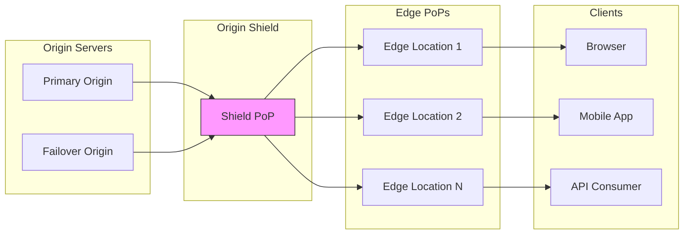
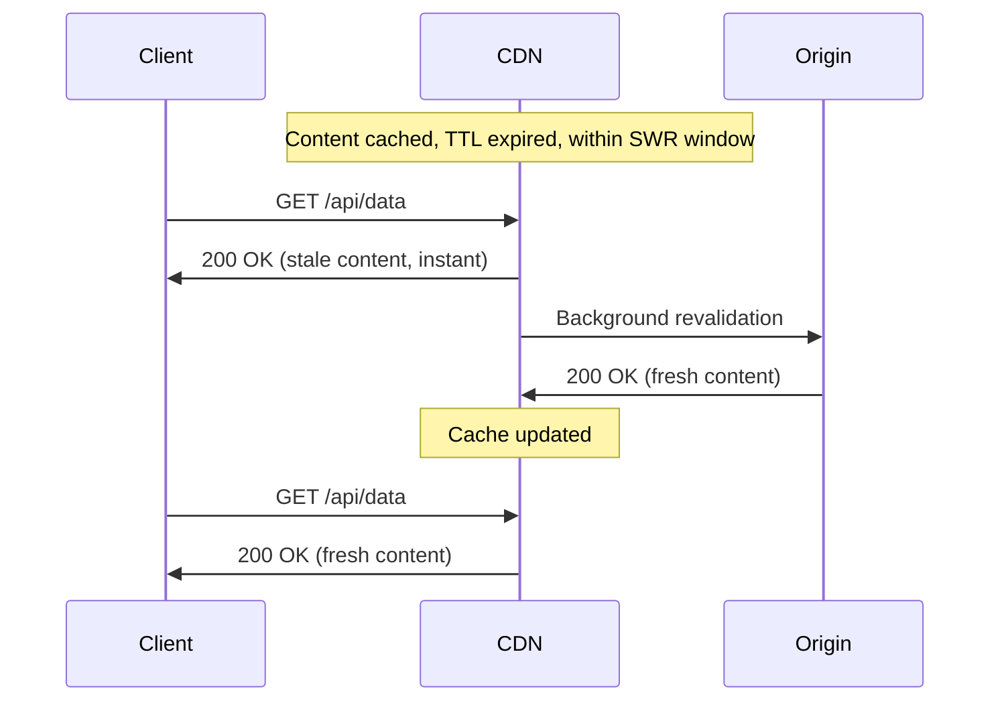
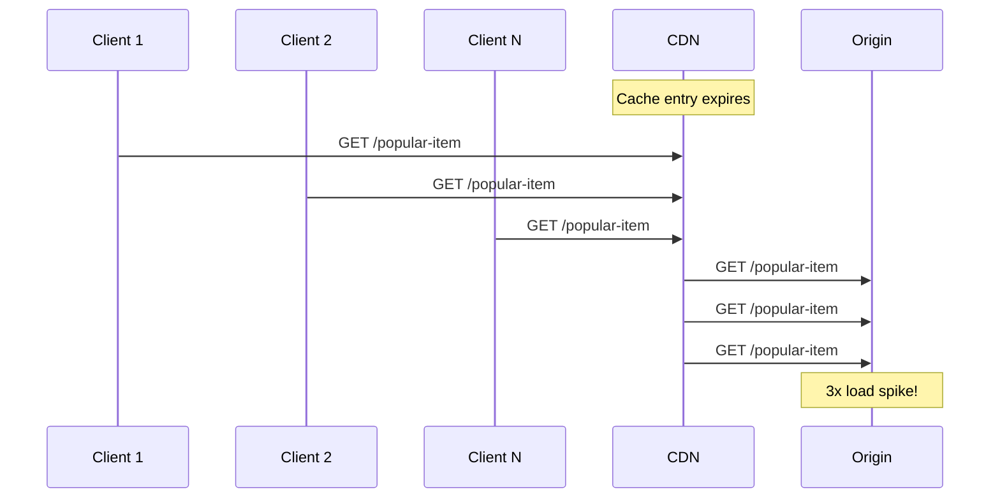

# Edge Delivery and Cache Invalidation

Production CDN caching architecture for balancing content freshness against cache efficiency. Covers cache key design, invalidation strategies (path-based, tag-based, versioned URLs), stale-while-revalidate patterns, and edge compute use cases—with specific focus on design tradeoffs, operational failure modes, and the thundering herd problem that senior engineers encounter during cache-related incidents.

<figure>



<figcaption>CDN topology: clients hit edge PoPs, misses route through origin shield (single cache layer) before reaching origin. This architecture reduces origin load and enables request coalescing.</figcaption>

</figure>

## Abstract

CDN caching reduces to three interconnected decisions: **what to cache** (cache key design), **how long to cache** (TTL strategy), and **when to invalidate** (freshness vs availability tradeoff).

| Decision                                | Optimizes For                   | Sacrifices                   |
| --------------------------------------- | ------------------------------- | ---------------------------- |
| Aggressive caching (long TTL)           | Origin load reduction, latency  | Content freshness            |
| Conservative caching (short TTL)        | Content freshness               | Cache hit ratio, origin load |
| Cache key expansion (more Vary headers) | Content correctness per variant | Cache fragmentation          |
| Versioned URLs                          | Eliminates invalidation need    | URL management complexity    |
| Tag-based purge                         | Granular invalidation           | Operational complexity       |

**Key architectural insight**: The cache key determines correctness; the TTL determines performance. A misconfigured cache key serves wrong content to users. A misconfigured TTL either hammers your origin or serves stale content.

**Invalidation hierarchy** (prefer higher):

1. **Versioned/fingerprinted URLs** (e.g., `main.abc123.js`)—no invalidation needed
2. **Stale-while-revalidate**—async refresh, no user-visible staleness
3. **Tag-based purge**—granular, handles complex dependencies
4. **Path-based purge**—simple but coarse-grained
5. **Full cache clear**—last resort, triggers thundering herd

**Edge compute** shifts personalization from origin to edge—decisions made in <1ms at 225+ locations vs 200ms+ round-trip to origin.

## Cache Fundamentals

HTTP caching behavior is defined by RFC 9111 (June 2022), which obsoletes RFC 7234. The specification distinguishes between **private caches** (browser) and **shared caches** (CDN, proxy). This distinction is critical: directives like `private` and `s-maxage` exist specifically to control behavior differences between these cache types.

### Cache-Control Directives

The `Cache-Control` header is the primary mechanism for controlling caching behavior. Key directives and their design rationale:

| Directive         | Target             | Behavior                                  | Design Rationale                                    |
| ----------------- | ------------------ | ----------------------------------------- | --------------------------------------------------- |
| `max-age=N`       | All caches         | Response fresh for N seconds              | Simple TTL control                                  |
| `s-maxage=N`      | Shared caches only | Overrides `max-age` for CDN/proxy         | CDN often needs different TTL than browser          |
| `no-cache`        | All caches         | Must revalidate before serving            | Freshness guarantee (not "don't cache")             |
| `no-store`        | All caches         | Never store in any cache                  | Sensitive data protection                           |
| `private`         | Browser only       | Exclude from shared caches                | User-specific content                               |
| `public`          | All caches         | Cacheable even for authenticated requests | Override default behavior                           |
| `must-revalidate` | All caches         | Cannot serve stale after TTL              | Strict freshness requirement                        |
| `immutable`       | All caches         | Content won't change during freshness     | Avoid conditional requests for fingerprinted assets |

**Common misconception**: `no-cache` does NOT mean "don't cache." It means "cache, but always revalidate before serving." Use `no-store` to prevent caching entirely.

**Example for versioned assets**:

```http
Cache-Control: public, max-age=31536000, immutable
```

This tells caches: cache for 1 year, any cache can store it, and don't bother revalidating (the fingerprinted URL guarantees immutability).

**Example for HTML documents**:

```http
Cache-Control: no-cache, must-revalidate
```

Cache the document, but always check with origin before serving. If origin is unreachable, return error rather than stale content.

### Cache Key Design

The cache key uniquely identifies cached objects. A poorly designed cache key either:

- **Fragments the cache** (too many keys) → low hit ratio, high origin load
- **Serves wrong content** (insufficient keys) → users see incorrect responses

**Default cache key components** (most CDNs):

- HTTP method (GET, HEAD)
- Host header
- URL path
- Query string

**The cache key correctness rule**: If any request header affects the response content, that header must be part of the cache key (or handled via `Vary`).

**Example: Language-based content**

If `/products` returns different content based on `Accept-Language`:

```http
# Response header
Vary: Accept-Language
```

The CDN now caches separate responses for `Accept-Language: en-US`, `Accept-Language: de-DE`, etc.

**Cache fragmentation problem**: `Accept-Language` has thousands of variations (`en-US`, `en-GB`, `en`, `en-US,en;q=0.9`). Each variation creates a separate cache entry. Solutions:

1. Normalize headers at edge (collapse `en-US`, `en-GB` → `en`)
2. Use URL-based routing (`/en/products`, `/de/products`)
3. Limit supported languages and serve default for others

**Best practices for cache key design**:

| Do                                        | Don't                                                      |
| ----------------------------------------- | ---------------------------------------------------------- |
| Include only headers that affect response | Include `User-Agent` (thousands of variations)             |
| Normalize headers at edge before caching  | Pass raw headers to cache key                              |
| Use URL-based variants when possible      | Rely on `Vary` for high-cardinality headers                |
| Whitelist query parameters                | Include all query parameters (tracking IDs fragment cache) |

### TTL Strategies by Content Type

TTL selection balances freshness against hit ratio. The right TTL depends on content volatility and staleness tolerance:

| Content Type                                     | Recommended TTL         | Cache-Control Example                                  |
| ------------------------------------------------ | ----------------------- | ------------------------------------------------------ |
| Fingerprinted assets (JS, CSS, images with hash) | 1 year                  | `max-age=31536000, immutable`                          |
| Static images without fingerprint                | 1 day to 1 week         | `max-age=86400`                                        |
| HTML documents                                   | Revalidate or short TTL | `no-cache` or `max-age=300, stale-while-revalidate=60` |
| API responses (read-heavy)                       | Minutes to hours        | `s-maxage=300, stale-while-revalidate=60`              |
| User-specific content                            | Don't cache at CDN      | `private, no-store`                                    |
| Real-time data                                   | Don't cache             | `no-store`                                             |

**Design rationale for fingerprinted assets**: Content-addressed URLs (e.g., `main.abc123.js`) guarantee immutability—the URL changes when content changes. This enables maximum caching without staleness risk. The `immutable` directive tells browsers not to revalidate even on reload.

**The HTML document problem**: HTML references other assets by URL. If you cache HTML for 1 hour and deploy new CSS, users get old HTML pointing to old CSS URL, then CSS fingerprint changes, causing broken styles until HTML cache expires. Solutions:

1. Use `no-cache` for HTML (always revalidate)
2. Use very short TTL with `stale-while-revalidate`
3. Purge HTML on every deployment

## Cache Invalidation Strategies

Cache invalidation is one of the two hard problems in computer science (along with naming things and off-by-one errors). The challenge: how do you tell globally distributed caches that content has changed?

### Versioned URLs: Avoiding Invalidation Entirely

The best invalidation strategy is avoiding invalidation. Fingerprinted URLs make cache entries naturally obsolete:

```
# Old version
/assets/main.abc123.js

# New deployment
/assets/main.def456.js
```

**Why this works**: The URL is the cache key. A new URL is a cache miss, fetched fresh from origin. Old URLs can stay cached forever—they'll naturally expire or be evicted under memory pressure.

**Implementation with build tools**:

```javascript title="vite.config.js" collapse={1-3}
// Vite configuration for content-hashed filenames
// Produces: main.abc123.js (hash changes when content changes)

export default {
  build: {
    rollupOptions: {
      output: {
        entryFileNames: "[name].[hash].js",
        chunkFileNames: "[name].[hash].js",
        assetFileNames: "[name].[hash][extname]",
      },
    },
  },
}
```

**Limitation**: Only works for assets referenced by other files. HTML documents at fixed URLs (`/`, `/products/123`) cannot use this pattern—they need explicit invalidation.

### Path-Based Purge

The simplest invalidation: tell the CDN to remove specific URLs.

**Exact path purge**:

```bash
# Purge single URL
aws cloudfront create-invalidation \
  --distribution-id E1234567890AB \
  --paths "/products/123"
```

**Wildcard purge**:

```bash
# Purge all products
aws cloudfront create-invalidation \
  --distribution-id E1234567890AB \
  --paths "/products/*"
```

**Limitations**:

- **No relationship awareness**: Purging `/products/123` doesn't purge `/categories/electronics` even if it displays product 123
- **Rate limits**: Google Cloud CDN limits to 500 invalidations/minute
- **Propagation delay**: CloudFront takes 30s-3min; Google Cloud CDN takes 5-10min

**When to use**: Simple sites with direct URL-to-content mapping. Emergency removal of specific content.

### Tag-Based Purge (Surrogate Keys)

Tag-based purging enables many-to-many relationships between content and cache entries. When content changes, purge by tag—all entries with that tag are invalidated regardless of URL.

**How it works**:

1. Origin adds tags to response headers:

```http
Surrogate-Key: product-123 category-electronics homepage
```

2. CDN indexes entries by tags

3. On product update, purge by tag:

```bash
curl -X POST "https://api.fastly.com/service/{id}/purge/product-123" \
  -H "Fastly-Key: {api_key}"
```

4. All URLs tagged with `product-123` are invalidated:
   - `/products/123`
   - `/categories/electronics` (if it displays product 123)
   - `/homepage` (if product 123 is featured)

**Fastly implementation** (from [Fastly documentation](https://docs.fastly.com/en/guides/purging-with-surrogate-keys)):

```http
# Response headers
Surrogate-Key: post/1234 category/news author/jane
Surrogate-Control: max-age=86400
```

Limits: Individual keys max 1024 bytes, total header max 16,384 bytes.

**CloudFront implementation**: CloudFront doesn't support surrogate keys natively. Workaround: use Lambda@Edge to manage a DynamoDB index mapping tags to URLs, then purge URLs programmatically.

**Akamai implementation** (Cache Tags):

```http
Edge-Cache-Tag: product-123, category-electronics
```

Purge via API or Property Manager rules.

**Design tradeoff**: Tag-based purging requires:

1. Application code to generate tags
2. CDN that supports the feature (Fastly, Akamai, Cloudflare with Enterprise)
3. Operational tooling to trigger purges

The complexity is justified when content relationships are complex (CMS, e-commerce with product listings).

### Invalidation Propagation Timing

Purge is not instant. Time from purge request to global effect:

| CDN Provider     | Typical Propagation | Notes                                        |
| ---------------- | ------------------- | -------------------------------------------- |
| Cloudflare       | <150ms (P50)        | "Instant Purge" via distributed invalidation |
| Fastly           | ~150ms global       | Sub-second for most requests                 |
| AWS CloudFront   | 30s - 3min          | Varies by distribution size                  |
| Google Cloud CDN | 5-10 min            | Rate limited (500/min)                       |
| Akamai           | Seconds to minutes  | Depends on product tier                      |

**Operational implication**: Don't assume purge is instant. If you purge and immediately test, you may see cached content. Build delays into deployment pipelines or use cache-busting query params for verification.

**Cost**:

- CloudFront: First 1,000 paths/month free, $0.005/path beyond
- Wildcard `/*` counts as one path but invalidates everything

## Stale-While-Revalidate and Stale-If-Error

RFC 5861 defines two Cache-Control extensions that fundamentally change the freshness vs availability tradeoff.

### Stale-While-Revalidate (SWR)

```http
Cache-Control: max-age=600, stale-while-revalidate=30
```

**Behavior**:

1. **0-600s**: Content fresh, serve from cache
2. **600-630s**: Content stale, serve from cache immediately, trigger async revalidation
3. **>630s**: Content truly stale, synchronous fetch required

**Design rationale**: Hides revalidation latency from users. The first request after TTL expires gets served instantly from cache while triggering background refresh. Subsequent requests get fresh content.

<figure>



<figcaption>Stale-while-revalidate flow: first request after TTL expires serves stale content instantly while triggering async revalidation. Next request gets fresh content.</figcaption>

</figure>

**Browser support**: Chrome 75+, Firefox 68+, Safari 13+, Edge 79+.

**CDN support**: Cloudflare, Fastly, KeyCDN, Varnish. CloudFront requires Lambda@Edge for full implementation.

**Edge case**: If no traffic arrives during the SWR window, content becomes truly stale. High-traffic endpoints benefit most; low-traffic endpoints may still experience synchronous fetches.

### Stale-If-Error (SIE)

```http
Cache-Control: max-age=600, stale-if-error=86400
```

**Behavior**: If origin returns 5xx error or is unreachable, serve stale content for the specified duration instead of propagating the error.

**Design rationale**: Availability over freshness. Users see slightly old content rather than error pages during origin outages.

**Combined pattern for production APIs**:

```http
Cache-Control: max-age=300, stale-while-revalidate=60, stale-if-error=86400
```

- Fresh for 5 minutes
- Serve stale + async revalidate for 1 minute after
- Serve stale on error for 24 hours

**Operational benefit**: Origin deployments become safer. If a bad deploy causes 500 errors, users continue seeing cached content while you fix the issue.

### Varnish Grace Mode

Varnish implements similar functionality with more control via VCL (Varnish Configuration Language):

```vcl title="grace.vcl" collapse={1-4}
# Varnish grace mode configuration
# beresp.grace: how long to serve stale while revalidating
# req.grace: how long client accepts stale content

sub vcl_backend_response {
    set beresp.ttl = 300s;       # Fresh for 5 minutes
    set beresp.grace = 1h;       # Serve stale for 1 hour while revalidating
}

sub vcl_recv {
    # Extend grace period when backend is unhealthy
    if (std.healthy(req.backend_hint)) {
        set req.grace = 10s;
    } else {
        set req.grace = 24h;     # Extended grace during outages
    }
}
```

**Key insight**: Varnish separates object grace (how long to keep stale content) from request grace (how long a specific request accepts stale content). This enables dynamic behavior based on backend health.

## Edge Compute Use Cases

Edge compute moves logic from origin to CDN edge locations, reducing latency from 200ms+ (origin round-trip) to <1ms (edge execution).

### Platform Comparison

| Platform             | Runtime             | Cold Start | Max Execution | Use Case                     |
| -------------------- | ------------------- | ---------- | ------------- | ---------------------------- |
| CloudFront Functions | JavaScript          | <1ms       | <1ms CPU      | Simple transforms, redirects |
| Lambda@Edge          | Node.js, Python     | 50-100ms   | 5-30s         | Complex logic, API calls     |
| Cloudflare Workers   | JavaScript/WASM     | <1ms       | 10-30ms CPU   | Full applications            |
| Fastly Compute       | WASM (Rust, Go, JS) | 35μs       | No hard limit | High-performance compute     |

**Cost comparison** (per 1M invocations):

- CloudFront Functions: $0.10
- Lambda@Edge: $0.60 + execution time
- Cloudflare Workers: $0.50 (included in paid plans)

### Personalization Without Origin Load

Traditional personalization requires origin processing per request. Edge compute enables personalization at cache layer:

**Pattern: Cookie-based variant selection**

```javascript title="personalization.js" collapse={1-5}
// CloudFront Function for cookie-based personalization
// Routes to different cached content based on user segment
// Cache key includes the segment, so variants are cached separately

function handler(event) {
  var request = event.request
  var cookies = request.cookies

  // Determine user segment from cookie
  var segment = "default"
  if (cookies.user_segment) {
    segment = cookies.user_segment.value
  }

  // Add segment to cache key via custom header
  request.headers["x-user-segment"] = { value: segment }

  return request
}
```

**CloudFront configuration**: Include `x-user-segment` header in cache key policy. Each segment gets its own cached variant.

**Result**: 3 user segments × 1000 pages = 3000 cache entries, all served from edge without origin involvement.

### A/B Testing at Edge

Edge-based A/B testing eliminates the latency and complexity of client-side testing libraries.

**Pattern: Consistent assignment via cookie**

```javascript title="ab-testing.js" collapse={1-6}
// Cloudflare Worker for A/B testing
// Assigns users to variants consistently via cookie
// Routes to variant-specific origin path

export default {
  async fetch(request) {
    const url = new URL(request.url)
    let variant = getCookie(request, "ab_variant")

    if (!variant) {
      // New user: randomly assign variant
      variant = Math.random() < 0.5 ? "a" : "b"
    }

    // Route to variant-specific origin
    url.pathname = `/${variant}${url.pathname}`

    const response = await fetch(url.toString(), request)

    // Set cookie for consistent future assignments
    const newResponse = new Response(response.body, response)
    if (!getCookie(request, "ab_variant")) {
      newResponse.headers.set("Set-Cookie", `ab_variant=${variant}; Path=/; Max-Age=86400`)
    }

    return newResponse
  },
}
```

**Why edge beats client-side**:

- No layout shift (content decided before HTML sent)
- No JavaScript dependency
- Consistent assignment across page loads
- Works for users with JS disabled

### Geo-Routing and Compliance

Edge compute enables geographic routing for latency optimization or compliance:

```javascript title="geo-routing.js" collapse={1-4}
// Lambda@Edge geo-routing for GDPR compliance
// Routes EU users to EU-based origin

exports.handler = async (event) => {
  const request = event.Records[0].cf.request
  const country = request.headers["cloudfront-viewer-country"][0].value

  const euCountries = ["DE", "FR", "IT", "ES", "NL", "BE", "AT", "PL"]

  if (euCountries.includes(country)) {
    request.origin.custom.domainName = "eu-origin.example.com"
  } else {
    request.origin.custom.domainName = "us-origin.example.com"
  }

  return request
}
```

**Compliance use case**: GDPR requires certain data to stay within EU. Route EU users to EU origins; their requests never touch US infrastructure.

## Operational Guardrails

### Cache Hit Ratio Monitoring

Cache hit ratio (CHR) is the primary health metric for CDN effectiveness:

**Formula**: `CHR = Cache Hits / (Cache Hits + Cache Misses) × 100`

**Target thresholds**:

- **Static assets**: >95%
- **Overall site**: >85%
- **Alert threshold**: <80% (investigate cache key issues or TTL misconfiguration)

**Segmented monitoring is critical**: A global 90% CHR can mask a 50% CHR for a specific content type or region. Monitor by:

- Content type (HTML, JS, CSS, images, API)
- Geographic region
- URL pattern

**Common CHR killers**:

- High-cardinality `Vary` headers (cache fragmentation)
- Query parameters in cache key (tracking IDs create unique keys)
- Short TTLs on high-traffic content
- Origin returning `Cache-Control: no-store` unexpectedly

### Cache Stampede (Thundering Herd)

**Problem**: When a popular cache entry expires, all concurrent requests miss cache and hit origin simultaneously.

<figure>



<figcaption>Cache stampede: multiple concurrent requests after cache expiry all hit origin, causing load spike proportional to concurrency.</figcaption>

</figure>

**Real-world impact**: A cache entry with 98% hit ratio expiring means 50x origin load spike (2% misses become 100% misses during revalidation window).

**Mitigation strategies**:

1. **Request coalescing** (CDN feature): CDN holds duplicate requests while one fetches from origin
   - Fastly: Enabled by default
   - CloudFront: Limited support via Origin Shield
   - Cloudflare: "Tiered Cache" provides similar behavior

2. **Stale-while-revalidate**: First request serves stale, triggers async refresh—no stampede because subsequent requests still hit cache

3. **Probabilistic early expiration**: Refresh before TTL expires:

   ```
   actual_ttl = ttl - (random() * jitter_factor)
   ```

   Spreads revalidation across time window instead of thundering at exact TTL

4. **Origin Shield**: Centralized cache layer between edge PoPs and origin. Misses from multiple edges coalesce at shield.

### Origin Shield Architecture

Origin Shield adds a single cache layer between globally distributed edge PoPs and origin:

**Without shield**:

```
Edge NYC miss → Origin
Edge London miss → Origin
Edge Tokyo miss → Origin
= 3 origin requests
```

**With shield**:

```
Edge NYC miss → Shield (Virginia) miss → Origin
Edge London miss → Shield (Virginia) hit
Edge Tokyo miss → Shield (Virginia) hit
= 1 origin request
```

**When to enable**:

- High traffic with moderate cache hit ratio (<95%)
- Origin cannot handle traffic spikes
- Global audience (many edge PoPs)

**Cost tradeoff**: Additional per-request charge at shield. Justified when origin protection value exceeds shield cost.

### Graceful Degradation Patterns

Design for origin failure:

1. **Extended stale-if-error**: Serve stale content for 24-48 hours during outages

   ```http
   Cache-Control: max-age=300, stale-if-error=172800
   ```

2. **Static fallback at edge**: If origin returns 5xx, serve static fallback page from edge storage

3. **Health check integration**: CDN monitors origin health, extends grace period when origin is unhealthy (Varnish pattern shown earlier)

4. **Circuit breaker at edge**: After N consecutive origin errors, stop sending traffic for cooldown period

## Conclusion

Edge delivery and cache invalidation is fundamentally about managing the tension between content freshness and system performance. The mature approach:

1. **Prefer versioned URLs** for assets—eliminates invalidation entirely
2. **Use stale-while-revalidate** for HTML/API responses—hides latency, prevents stampedes
3. **Implement tag-based purging** for complex content relationships—surgical invalidation without full cache clear
4. **Monitor cache hit ratio by segment**—global metrics hide localized problems
5. **Design for origin failure**—extended grace periods turn partial outages into non-events

**The cache key determines correctness; the TTL determines performance.** Get the cache key wrong, and users see incorrect content. Get the TTL wrong, and you either hammer your origin or serve stale content.

Edge compute shifts the personalization boundary from origin to edge—decisions that previously required 200ms origin round-trips now execute in <1ms at the nearest edge location. This isn't just an optimization; it fundamentally changes what's architecturally possible for latency-sensitive applications.

## Appendix

### Prerequisites

- HTTP caching model (request/response headers, freshness, validation)
- CDN concepts (edge PoPs, origin, cache keys)
- Basic understanding of distributed systems failure modes

### Terminology

- **Cache key**: Unique identifier for cached content (typically URL + selected headers)
- **TTL (Time to Live)**: Duration content is considered fresh
- **CHR (Cache Hit Ratio)**: Percentage of requests served from cache
- **PoP (Point of Presence)**: Edge location where CDN serves content
- **Origin Shield**: Intermediate cache layer between edge PoPs and origin
- **Surrogate key**: Tag associated with cached content for grouped invalidation
- **Thundering herd**: Multiple simultaneous requests overwhelming origin after cache expiry
- **SWR (Stale-While-Revalidate)**: Serve stale content while asynchronously fetching fresh
- **SIE (Stale-If-Error)**: Serve stale content when origin returns error

### Summary

- Cache key design determines correctness; TTL determines performance—both can cause production incidents if misconfigured
- Versioned/fingerprinted URLs eliminate invalidation need for assets—use `immutable` directive for 1-year TTL
- Tag-based purging (surrogate keys) handles complex content relationships—supported by Fastly, Akamai, Cloudflare Enterprise
- Stale-while-revalidate hides revalidation latency and prevents cache stampedes—combine with stale-if-error for origin failure protection
- Origin Shield collapses multi-PoP misses into single origin request—essential for stampede protection
- Edge compute enables <1ms personalization decisions vs 200ms+ origin round-trip

### References

**Specifications**

- [RFC 9111 - HTTP Caching](https://datatracker.ietf.org/doc/rfc9111/) - Authoritative HTTP caching specification (June 2022)
- [RFC 9110 - HTTP Semantics](https://datatracker.ietf.org/doc/html/rfc9110/) - HTTP methods, status codes, headers
- [RFC 5861 - HTTP Cache-Control Extensions for Stale Content](https://datatracker.ietf.org/doc/html/rfc5861) - stale-while-revalidate, stale-if-error

**CDN Provider Documentation**

- [AWS CloudFront - Understanding the Cache Key](https://docs.aws.amazon.com/AmazonCloudFront/latest/DeveloperGuide/understanding-the-cache-key.html) - Cache key design best practices
- [AWS CloudFront - Edge Functions](https://docs.aws.amazon.com/AmazonCloudFront/latest/DeveloperGuide/edge-functions-choosing.html) - CloudFront Functions vs Lambda@Edge
- [Fastly - Purging with Surrogate Keys](https://docs.fastly.com/en/guides/purging-with-surrogate-keys) - Tag-based invalidation
- [Fastly - Serving Stale Content](https://www.fastly.com/documentation/guides/full-site-delivery/performance/serving-stale-content/) - SWR implementation
- [Cloudflare - Instant Purge Architecture](https://blog.cloudflare.com/instant-purge/) - Sub-150ms global purge
- [Cloudflare Workers Documentation](https://developers.cloudflare.com/workers/) - Edge compute platform
- [Google Cloud CDN - Cache Invalidation](https://cloud.google.com/cdn/docs/cache-invalidation-overview) - Invalidation patterns and limits
- [Akamai - Purge Cache by Tag](https://techdocs.akamai.com/purge-cache/reference/post-invalidate-tag) - Cache tag implementation

**Educational Resources**

- [MDN - HTTP Caching](https://developer.mozilla.org/en-US/docs/Web/HTTP/Guides/Caching) - Comprehensive caching overview
- [MDN - Cache-Control](https://developer.mozilla.org/en-US/docs/Web/HTTP/Reference/Headers/Cache-Control) - Directive reference
- [Varnish - Grace Mode](https://varnish-cache.org/docs/7.3/users-guide/vcl-grace.html) - Stale content serving

**Engineering Blogs**

- [Cloudflare - Rethinking Cache Purge](https://blog.cloudflare.com/part1-coreless-purge/) - Distributed invalidation architecture
- [Philip Walton - Performant A/B Testing with Cloudflare Workers](https://philipwalton.com/articles/performant-a-b-testing-with-cloudflare-workers/) - Edge-based testing patterns
