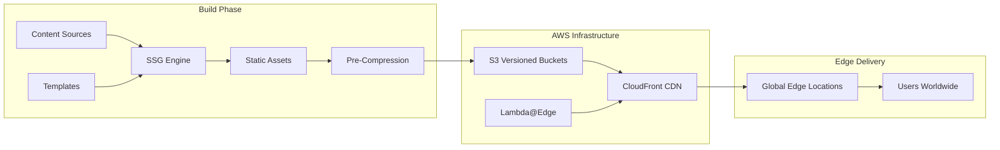
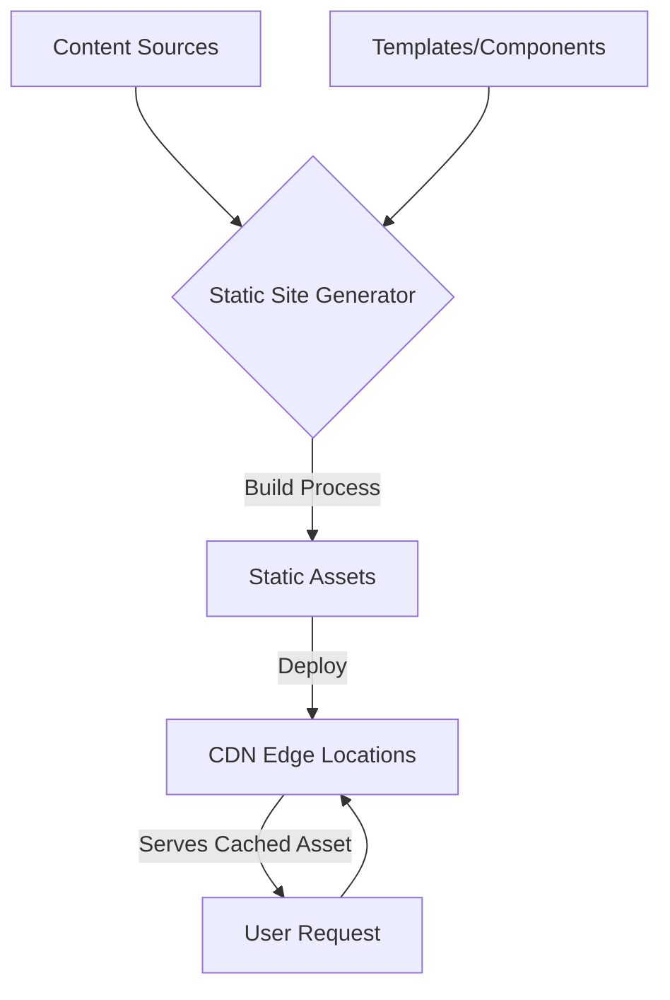
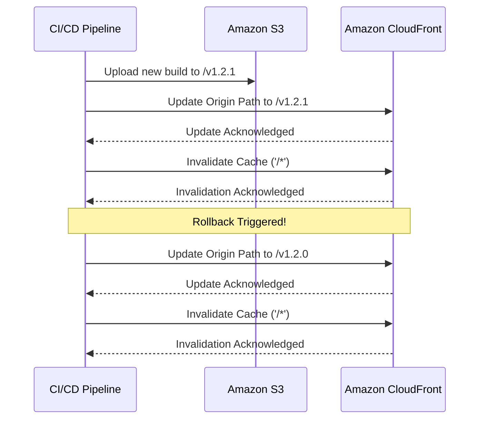
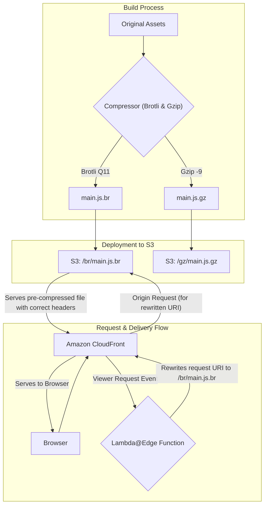

# SSG Performance Optimizations: Build, Cache, and Delivery

Production-grade Static Site Generation (SSG) architecture for AWS CloudFront delivery. Covers atomic deployments, pre-compression strategies, Lambda@Edge routing patterns, and Core Web Vitals optimization—with specific focus on design tradeoffs and operational failure modes that senior engineers encounter in production.

<figure>



<figcaption>High-level architecture showing the build-time rendering, AWS deployment, and edge delivery flow for SSG sites</figcaption>

</figure>

## Abstract

SSG performance hinges on three architectural decisions that compound:

1. **Where computation happens**: Build-time rendering eliminates request-time processing—Time to First Byte (TTFB) drops from 200-500ms (Server-Side Rendering) to <50ms (CDN edge)
2. **How deployments are structured**: Atomic, versioned directories in S3 (`/build_001/`, `/build_002/`) enable instant rollbacks via CloudFront origin path updates—no partial deployments, no corrupted states
3. **Where intelligence lives**: Lambda@Edge vs CloudFront Functions determines routing flexibility vs cost—CloudFront Functions at $0.10/1M invocations for simple rewrites, Lambda@Edge at $0.60/1M for complex logic requiring network access

**Critical tradeoffs**:

| Decision | Optimizes For | Sacrifices |
|----------|---------------|------------|
| Pre-compression (Brotli Q11) | 15-20% smaller files vs Gzip | Build time (seconds vs milliseconds per file) |
| Lambda@Edge routing | Network access, body manipulation, 30s timeout | Cost (6x CloudFront Functions), cold starts |
| Atomic deployments | Instant rollback, no partial failures | S3 storage (retain N versions) |
| Origin Shield | Cache hit ratio, origin load reduction | Additional cost per request |

**Core Web Vitals targets** (75th percentile): CLS < 0.1, LCP (Largest Contentful Paint) < 2.5s, INP (Interaction to Next Paint) < 200ms

## Static Site Generation Fundamentals

SSG shifts computation from request-time to build-time. The architectural implication: servers become stateless file delivery mechanisms, enabling CDN-first architectures where edge locations serve pre-built assets without origin round-trips.

### Build-Time Rendering Model

SSG pre-renders all pages during a build phase, producing static HTML, CSS, and JavaScript files. This contrasts with database-driven systems (WordPress, Drupal) that generate HTML per-request.

**Why build-time?** Request-time rendering introduces latency per request (database queries, template rendering, API calls). Build-time amortizes this cost across all future requests—compute once, serve millions of times.

The process:

1. **Content ingestion**: Markdown files, headless CMS APIs, or structured data
2. **Template application**: React, Vue, Astro components, or templating languages (Liquid, Nunjucks)
3. **Asset generation**: Optimized HTML, CSS, JS bundles
4. **Deployment**: Upload to S3, configure CloudFront origin

<figure>



<figcaption>SSG workflow: content and templates compile to static assets deployed to CDN edge locations.</figcaption>

</figure>

### Framework Comparison and Build Performance

Modern SSG frameworks evolved from simple generators (Jekyll) to sophisticated meta-frameworks supporting hybrid rendering. The key architectural differentiator: how much JavaScript ships to the client.

| Generator  | Language/Framework | Key Architectural Feature                                                                           | Build Performance | Ideal Use Case                                                              |
| ---------- | ------------------ | --------------------------------------------------------------------------------------------------- | ----------------- | --------------------------------------------------------------------------- |
| Next.js 15 | JavaScript/React   | Hybrid rendering (SSG, SSR, ISR) with per-page `isrCacheTime` revalidation                          | Moderate to Fast  | Complex web applications, e-commerce sites, enterprise applications         |
| Hugo       | Go                 | Single-binary Go implementation; processes thousands of pages in seconds                            | Fastest           | Large content-heavy sites, blogs, and documentation with thousands of pages |
| Astro 5.x  | JavaScript/Astro   | Islands Architecture—ships zero JS by default; up to 127 pages/second with optimization             | Fast              | Content-rich marketing sites, portfolios, and blogs focused on performance  |
| Eleventy   | JavaScript         | Highly flexible; supports 10+ templating languages                                                  | Fast              | Custom websites where developers want maximum control                       |
| Jekyll     | Ruby               | Mature, blog-aware, deeply integrated with GitHub Pages                                             | Slower            | Personal blogs, simple project websites, GitHub Pages deployments           |
| Docusaurus | JavaScript/React   | Documentation-optimized with versioning, search, and sidebar navigation                             | Fast              | Technical documentation, knowledge bases, and open-source project sites     |

**Build performance insight**: Astro 5.x benchmarks show optimization potential from 35 pages/second to 127 pages/second (3.6x improvement). Key bottleneck: API calls in child components cause per-page build slowdowns—solution is passing data as props from parent or marking components as client-only.

### Why SSG: Architectural Tradeoffs

SSG adoption stems from specific tradeoffs that favor read-heavy, infrequently-updated content:

**Performance**: TTFB drops from 200-500ms (SSR with database queries) to <50ms (CDN edge). The 4-10x improvement compounds with geographic distribution—users in Sydney get the same latency as users in Virginia when assets are cached at edge locations.

**Security**: Attack surface reduction is structural, not configurational. No database connection at request time eliminates SQL injection. No server-side code execution eliminates RCE (Remote Code Execution) vectors. The security model becomes: "secure your build pipeline and S3 bucket permissions."

**Scalability**: CDN cost model is per-request data transfer, not compute. A traffic spike from 1K to 1M requests doesn't require provisioning servers—CloudFront handles distribution across 225+ edge locations automatically. Cost scales linearly with bandwidth, not exponentially with compute.

**Developer experience**: Git-based workflows enable PR previews, rollback via commit revert, and content versioning. The tradeoff: dynamic content requires either client-side fetching (slower perceived performance) or incremental static regeneration (ISR, increased complexity).

## Rendering Strategy Selection

Rendering strategy is a per-page (or per-component) decision, not a global architecture choice. The deciding factors: data freshness requirements, SEO needs, and infrastructure cost tolerance.

### Pattern Definitions

**SSG**: All pages generated at build time. Server delivers pre-built files. Ideal when content is identical for all users and changes infrequently (blogs, docs, marketing pages).

**SSR**: HTML generated per-request. Server fetches data, renders HTML, sends to client. Required when content must reflect current state (user dashboards, real-time data).

**CSR (Client-Side Rendering)**: Server sends minimal HTML with JavaScript bundle. Browser fetches data and renders. Foundation of SPAs (Single Page Applications). Tradeoff: poor initial SEO, slower First Contentful Paint (FCP).

### Comparative Analysis

| Metric                       | SSG                                      | SSR                                             | CSR                                                   |
| ---------------------------- | ---------------------------------------- | ----------------------------------------------- | ----------------------------------------------------- |
| TTFB                         | <50ms (CDN edge)                         | 200-500ms (server processing)                   | Fast initial, slow meaningful content                 |
| First Contentful Paint       | Fast (immediate HTML render)             | Slower (wait for server HTML)                   | Slowest (blank until JS executes)                     |
| Time to Interactive          | Fast (minimal hydration JS)              | Slower (full-page hydration)                    | Slowest (full app render on client)                   |
| SEO                          | Excellent (crawlable HTML)               | Excellent (crawlable HTML)                      | Poor without SSR fallback                             |
| Data Freshness               | Stale (last build timestamp)             | Real-time                                       | Real-time                                             |
| Infrastructure               | S3 + CloudFront only                     | Node.js servers + scaling                       | Static hosting + API backend                          |
| Cost at Scale                | Linear (bandwidth)                       | Exponential (compute)                           | Linear (bandwidth) + API costs                        |

### Hybrid Rendering

Modern frameworks (Next.js 15, Astro 5.x) enable per-page rendering decisions:

- **Marketing pages**: SSG for performance
- **User dashboards**: SSR for real-time data
- **Interactive widgets**: CSR with client-side hydration (Islands Architecture in Astro)

Next.js 15 adds per-page `isrCacheTime` for fine-grained ISR (Incremental Static Regeneration) control—revalidate pricing pages every hour, blog posts every day.

## AWS Deployment Architecture

Production SSG deployments require atomic releases, instant rollbacks, and cost-aware cache invalidation. The architecture decisions here determine your Mean Time to Recovery (MTTR) during incidents.

### Atomic and Immutable Deployments

**Why atomic?** Partial deployments create inconsistent states—users might receive `index.html` from v2 but `main.js` from v1 if uploads are interrupted. Atomic deployments guarantee all-or-nothing transitions.

**Implementation**: Each build uploads to a unique, versioned directory:

```
s3://my-bucket/deployments/v1.2.0/
s3://my-bucket/deployments/v1.2.1/
s3://my-bucket/deployments/a8c3e5f/  # Git commit hash
```

**Design rationale**:

1. **Immutability**: Once deployed, a version is never modified—debugging production issues means examining a frozen artifact
2. **Instant rollback**: Change CloudFront origin path from `/v1.2.1/` to `/v1.2.0/`—no re-upload, no rebuild
3. **Parallel testing**: QA can verify `/v1.2.1/` while `/v1.2.0/` serves production traffic

**Storage cost tradeoff**: Retaining N versions costs N × build size. Implement lifecycle rules to delete versions older than 30-90 days, keeping the last 5-10 for rollback.

### S3 Versioning: Anti-Pattern for Deployments

S3 Object Versioning tracks individual file history, not deployment snapshots. A deployment touching 500 files requires 500 individual restore operations for rollback—operationally infeasible during incidents.

**When S3 versioning helps**: Disaster recovery for accidental deletions, compliance requirements for audit trails.

**When it fails**: Application rollbacks requiring atomic state transitions across hundreds of files.

### CloudFront Origin Path Rollbacks

The preferred strategy: single CloudFront distribution with origin path pointing to versioned S3 directories.

**Deployment flow**:

1. CI/CD builds site, uploads to `s3://my-bucket/deployments/v1.2.1/`
2. Update CloudFront origin path to `/deployments/v1.2.1`
3. Invalidate cache (`/*`) to purge old content

**Rollback flow**: Update origin path to `/deployments/v1.2.0`, invalidate cache. No rebuild required.

**Cache invalidation cost**: First 1,000 paths/month are free. Beyond: $0.005/path. Wildcard `/*` counts as one path but invalidates all objects. For a 500-page site deploying 3x/day, monthly cost: ~$0 (within free tier) to $4.50 (90 invalidations × $0.05 average).

**Propagation timing**: Invalidations complete within seconds to minutes across 225+ edge locations. Not instant—plan for 1-2 minute visibility delay during deployments.

<figure>



<figcaption>Deployment and rollback sequence showing the interaction between CI/CD pipeline, S3, and CloudFront for atomic deployments</figcaption>

</figure>

### Lambda@Edge Build Version Routing

For sophisticated rollback and A/B testing scenarios, Lambda@Edge functions route requests based on headers, cookies, or percentage-based rules.

**Why Lambda@Edge over CloudFront Functions?** This pattern requires modifying the origin request after cache miss—CloudFront Functions can only modify viewer request/response and cannot change origin domain or path dynamically.

<figure>


<figcaption>Architecture diagram showing SSG deployment with CloudFront and build version management for zero-downtime deployments</figcaption>

</figure>

**S3 Bucket Structure:**

```asciidoc
S3 Bucket
├── build_001
│   ├── index.html
│   ├── assets/
│   └── ...
├── build_002
│   ├── index.html
│   ├── assets/
│   └── ...
├── build_003
│   ├── index.html
│   ├── assets/
│   └── ...
└── build_004
    ├── index.html
    ├── assets/
    └── ...
```

**CloudFront Configuration:**
Add a custom origin header in CloudFront's origin configuration that is always updated with the new release post syncing all files to S3. This header contains the current build version.

<figure>


<figcaption>Screenshot showing CloudFront configuration for adding build version headers to enable dynamic routing</figcaption>

</figure>

**Lambda@Edge Function:**

```javascript title="build-version-router.js" collapse={1-5}
// Lambda@Edge function for build version routing
// Reads x-build-version header set in CloudFront origin configuration
// and routes requests to the appropriate versioned S3 directory

exports.handler = (event, context, callback) => {
  const request = event.Records[0].cf.request
  const headers = request.headers
  const buildVersion = headers["x-build-version"] ? headers["x-build-version"][0].value : "build_004"

  // Add the build version prefix to the request URI
  if (request.uri === "/") {
    request.uri = `/${buildVersion}/index.html`
  } else {
    request.uri = `/${buildVersion}${request.uri}`
  }

  callback(null, request)
}
```

**Rollback Script:**

```bash title="version-deployment.sh" collapse={1-6}
#!/bin/bash
# Deployment script for updating CloudFront build version
# Updates the origin custom header and invalidates cache
# Usage: ./version-deployment.sh build_003 E1234567890ABCD

update_build_version() {
    local version=$1
    local distribution_id=$2

    # Update the origin custom header with new build version
    aws cloudfront update-distribution \
        --id $distribution_id \
        --distribution-config file://dist-config.json \
        --if-match $(aws cloudfront get-distribution-config --id $distribution_id --query 'ETag' --output text)

    # Invalidate cache to ensure new version is served
    aws cloudfront create-invalidation \
        --distribution-id $distribution_id \
        --paths "/*"
}

update_build_version $1 $2
```

**Advantages**:

- **Instant rollbacks**: Header update + cache invalidation
- **A/B testing**: Route users to different builds via cookies
- **Gradual rollouts**: Percentage-based traffic shifting
- **Zero downtime**: No service interruption

**Cost tradeoff**: Lambda@Edge at $0.60/1M requests vs CloudFront Functions at $0.10/1M. For 10M requests/month, the difference is $5/month—marginal for the flexibility gained.

### CloudFront Functions vs Lambda@Edge Decision Matrix

This is a critical architectural decision affecting cost, latency, and capabilities:

| Capability | CloudFront Functions | Lambda@Edge |
|------------|---------------------|-------------|
| Execution locations | 225+ edge locations | 13 regional edge caches |
| Max execution time | <1ms | 5s (viewer), 30s (origin) |
| Scaling | 10M+ req/sec | 10K req/sec per region |
| Languages | JavaScript only | Node.js, Python |
| Network access | No | Yes |
| Body manipulation | No | Yes |
| Pricing | $0.10/1M invocations | $0.60/1M + execution time |

**Use CloudFront Functions for**: URL normalization, simple header manipulation, A/B test cookie reading, cache key manipulation.

**Use Lambda@Edge for**: Origin routing, third-party API calls, image transformation, request body manipulation, complex routing logic.

### Origin Shield: Cache Hit Optimization

Origin Shield adds a centralized caching layer between edge locations and S3, collapsing simultaneous requests for the same object.

**When to enable**: Sites with global traffic where multiple edge locations request the same uncached object simultaneously. Origin Shield serves one request to S3, caches the response, and serves all waiting edges.

**Cost tradeoff**: Additional per-request charge. Justified when S3 request costs exceed Origin Shield costs—typically at high traffic volumes with cache miss rates >10%.

## Core Web Vitals Optimization

Raw speed (TTFB, FCP) is necessary but insufficient. Visual stability—measured by CLS—determines perceived quality. A page that loads fast but shifts content during load frustrates users more than a slightly slower, stable page.

**Current thresholds** (75th percentile, as of 2025):

- **CLS**: <0.1 (Good), 0.1-0.25 (Needs Improvement), >0.25 (Poor)
- **LCP**: <2.5s (Good), 2.5-4.0s (Needs Improvement), >4.0s (Poor)
- **INP**: <200ms (Good), 200-500ms (Needs Improvement), >500ms (Poor)

### Diagnosing CLS

Common CLS causes on static sites:

**Images without dimensions**: Browser reserves zero space initially. Image download triggers reflow, shifting all subsequent content.

**Asynchronous embeds**: Third-party ads, YouTube iframes, social widgets arrive after initial render. No reserved space = layout shift.

**Web fonts**: Fallback font renders first, web font swap causes text reflow due to different character metrics.

**Client-side injections**: Announcement banners, cookie consent dialogs injected after initial paint push content down.

**Layout Shift Attribution API**: Debug CLS by accessing `LayoutShift.sources`—returns up to 5 DOM elements causing shifts, sorted by impact area. `sources[0]` is the largest contributor.

### CLS Mitigation Patterns

**Image dimension reservation**:

Always include `width` and `height` attributes. Modern browsers calculate aspect ratio and reserve space before download.

```html

```

**Async content placeholders**:

Reserve space for embeds with explicit dimensions. Variable-height content: use `min-height` matching the most common size.

```html
<div style="width: 300px; height: 250px; background-color: #f0f0f0;">
  <!-- Ad unit injected here -->
</div>
```

**Font optimization**:

Preload critical fonts and match fallback metrics to minimize swap shift.

```html
<head>
  <link rel="preload" href="/fonts/my-critical-font.woff2" as="font" type="font/woff2" crossorigin />
  <style>
    @font-face {
      font-family: "My Critical Font";
      src: url("/fonts/my-critical-font.woff2") format("woff2");
      font-display: swap; /* Show fallback immediately, swap when loaded */
    }
    body {
      font-family: "My Critical Font", Arial, sans-serif; /* Match fallback metrics */
    }
  </style>
</head>
```

**Font-display tradeoff**: `swap` shows content immediately (better FCP) but risks CLS. `optional` avoids CLS but may show fallback font if web font loads slowly. Choose based on font metric similarity to fallback.

### Dual Build Strategy for Responsive CLS

**Problem**: Mobile and desktop layouts have different component dimensions. Static generation at build time must choose one—rendering both causes CLS on one device type; rendering neither requires client-side hydration (slow).

**Solution**: Generate separate builds for mobile and desktop, route via user agent detection.

S3 structure:
```
s3://my-bucket/
├── mobile/
│   ├── index.html
│   └── ...
└── desktop/
    ├── index.html
    └── ...
```

**Implementation with Lambda@Edge**:

```javascript title="device-router.js" collapse={1-4}
// Lambda@Edge function for device-based routing
// Routes to mobile/ or desktop/ prefixed paths based on user agent
// Configure CloudFront cache key to include CloudFront-Is-Mobile-Viewer header

exports.handler = (event, context, callback) => {
  const request = event.Records[0].cf.request
  const headers = request.headers
  const userAgent = headers["user-agent"] ? headers["user-agent"][0].value : ""
  const isMobile = /Mobile|Android|iPhone|iPad/.test(userAgent)
  const devicePrefix = isMobile ? "/mobile" : "/desktop"

  if (request.uri === "/") {
    request.uri = `${devicePrefix}/index.html`
  } else {
    request.uri = `${devicePrefix}${request.uri}`
  }

  callback(null, request)
}
```

**CloudFront cache key configuration**:

- Include `CloudFront-Is-Mobile-Viewer` header in cache key
- Mobile and desktop versions cache separately
- Lambda@Edge triggers on origin request (after cache miss)

**Tradeoff**: Build time doubles (2 builds), storage doubles. Justified when mobile/desktop layouts differ significantly and CLS impact is measurable.

## Pre-Compression Architecture

Compression determines bandwidth and load time. The architectural decision: compress at build time (maximum compression, zero runtime cost) or at edge (simpler, lower compression ratio).

### Edge vs Build-Time Compression

**CloudFront edge compression**:

- Enable via cache policy: `EnableAcceptEncodingGzip`, `EnableAcceptEncodingBrotli`
- CloudFront compresses on first request, caches result
- Uses lower compression levels to minimize latency
- **Size limits**: Only compresses objects 1KB–10MB

**Build-time pre-compression**:

- Compress during CI/CD with maximum quality (Brotli Q11, Gzip -9)
- Upload `.br` and `.gz` variants to S3
- Content negotiation via Lambda@Edge or CloudFront Functions
- Zero runtime compression cost

**Compression ratio comparison**:

| Content Type | Brotli Q11 vs Gzip -9 |
|--------------|----------------------|
| JavaScript   | 15% smaller          |
| HTML         | 20% smaller          |
| CSS          | 16% smaller          |

**Build time tradeoff**: Brotli Q11 encoding takes ~1.8s for a 1.6MB JavaScript file vs ~0.05s for Gzip. Amortized across deployments, this is negligible. Decompression speed is identical—clients see no penalty.

### CloudFront Compression Limitations

**Edge compression constraints** ([CloudFront docs](https://docs.aws.amazon.com/AmazonCloudFront/latest/DeveloperGuide/ServingCompressedFiles.html)):

- **Size range**: Only compresses objects 1KB–10MB
- **Cache race condition**: If uncompressed copy is cached first, CloudFront serves uncompressed until TTL expires
- **Best-effort**: CloudFront may skip compression under load
- **HTTPS requirement for Brotli**: Browsers only request `br` encoding over HTTPS (95.9% browser support as of 2025)
- **TTL dependency**: Cache policy TTL must be >0 for compression to apply

### Pre-Compression Implementation

Coordinates build process, S3 metadata, edge function content negotiation, and cache policy configuration.

<figure>



<figcaption>Pre-compression architecture showing the build process, S3 deployment, and Lambda@Edge content negotiation flow</figcaption>

</figure>

**Build step**: After bundling, generate Gzip and Brotli variants:

```bash
# Brotli (quality 11, maximum compression)
brotli -q 11 -o main.js.br main.js

# Gzip (level 9, maximum compression)
gzip -9 -k main.js
```

**S3 upload with metadata**: Critical—set `Content-Encoding` header on compressed files:

```bash
aws s3 cp main.js.br s3://bucket/assets/main.js \
  --content-encoding br \
  --content-type application/javascript
```

**Content negotiation function**: Inspects `Accept-Encoding` header, rewrites URI to serve optimal variant.

```javascript title="compression-negotiator.js" collapse={1-4}
// Lambda@Edge content negotiation function
// Inspects Accept-Encoding header and rewrites URI to serve pre-compressed files
// Requires pre-compressed .br and .gz files in S3 with correct Content-Encoding metadata

exports.handler = (event, context, callback) => {
  const request = event.Records[0].cf.request
  const headers = request.headers
  const acceptEncoding = headers["accept-encoding"] ? headers["accept-encoding"][0].value.toLowerCase() : ""

  // Determine the best compression format (prefer Brotli over Gzip)
  let compressionSuffix = ""
  if (acceptEncoding.includes("br")) {
    compressionSuffix = ".br"
  } else if (acceptEncoding.includes("gzip")) {
    compressionSuffix = ".gz"
  }

  // Rewrite the request URI to include the compression suffix
  if (compressionSuffix && request.uri.match(/\.(js|css|html|svg)$/)) {
    request.uri = request.uri + compressionSuffix
  }

  callback(null, request)
}
```

**CloudFront configuration**:

- Cache policy: Include `Accept-Encoding` header in cache key (ensures separate cache entries per encoding)
- Disable automatic compression: Set "Compress Objects Automatically" to No
- Origin request policy: Forward `Accept-Encoding` to S3

### Production Impact

E-commerce site benchmark (production deployment):

- **Uncompressed size**: 3.7MB
- **Brotli Q11**: ~247KB (15:1 ratio)
- **Gzip -9**: ~463KB (8:1 ratio)
- **Bandwidth savings**: 85-90%
- **Load time improvement**: 40-60% faster

The pattern shifts content negotiation from web server to CDN edge—serverless architecture serving optimal assets per-client capability.

## Edge Redirect Strategies

URL redirects preserve SEO equity, fix broken links, and enable site restructuring. The architectural decision: where does redirect logic execute?

### Client-Side Redirects (Meta Refresh)

Suitable for simple cases but incurs full page download before redirect.

```html
<!doctype html>
<html>
  <head>
    <title>Redirecting to https://path/to/redirect</title>
    <meta http-equiv="refresh" content="0;url=https://path/to/redirect" />
    <meta name="robots" content="noindex" />
    <link rel="canonical" href="https://path/to/redirect" />
  </head>
  <body>
    <a href="https://path/to/redirect">Redirect to https://path/to/redirect</a>
  </body>
</html>
```

**SEO consideration**: Search engines follow meta refresh but prefer server-side 301 redirects for link equity transfer.

### S3 Routing Rules

**Critical limitation**: S3 routing rules only work with **public website endpoints**, not private buckets with Origin Access Control (OAC). For production SSG architectures using private S3 + CloudFront, this method is unavailable.

Additionally:

- Limited to 50 rules per bucket
- Redirect executes at origin, not edge (full round-trip: Browser → CloudFront → S3 → redirect)
- No programmatic logic—pattern matching only

```json
{
  "RoutingRules": [
    {
      "Condition": { "KeyPrefixEquals": "docs/" },
      "Redirect": { "ReplaceKeyPrefixWith": "documents/" }
    }
  ]
}
```

**Recommendation**: Use CloudFront Functions or Lambda@Edge instead—faster, more flexible, works with private buckets.

### Lambda@Edge Edge Redirects

Redirects execute at edge location before cache lookup—minimal latency (Browser → CloudFront → Browser).

```javascript collapse={1-10}
// A Lambda@Edge function for managing redirects at the edge.
"use strict"

// Redirect rules can be managed within the function or loaded from an external source
const redirectMap = {
  "/old-product-page": { destination: "/new-product-page", httpStatus: 301 },
  "/promo": { destination: "/current-sale", httpStatus: 302 },
  "/legacy-docs": { destination: "https://docs.example.com", httpStatus: 301 },
}

exports.handler = (event, context, callback) => {
  const request = event.Records[0].cf.request
  const uri = request.uri

  if (redirectMap[uri]) {
    const redirect = redirectMap[uri]
    const response = {
      status: redirect.httpStatus.toString(),
      statusDescription: redirect.httpStatus === 301 ? "Moved Permanently" : "Found",
      headers: {
        location: [
          {
            key: "Location",
            value: redirect.destination,
          },
        ],
        "cache-control": [
          {
            key: "Cache-Control",
            value: "max-age=3600", // Cache the redirect response for 1 hour
          },
        ],
      },
    }
    // Return the redirect response immediately
    callback(null, response)
  } else {
    // No redirect rule matched, allow the request to proceed
    callback(null, request)
  }
}
```

**Advantages over S3 routing**:

- **Latency**: Single hop vs origin round-trip
- **Scalability**: Redirect map in DynamoDB supports thousands of rules, updated without function redeployment
- **Flexibility**: Programmatic logic (geo-redirects, device detection, A/B routing)
- **Private bucket compatible**: Works with OAC-protected S3 origins

**Alternative: CloudFront Functions**: For simple redirect maps (no network access needed), CloudFront Functions at $0.10/1M invocations is more cost-effective than Lambda@Edge at $0.60/1M. Use Lambda@Edge only when you need DynamoDB lookups or complex logic.

## Advanced Deployment Patterns

For business-critical applications requiring gradual rollouts and instant rollback capabilities.

### Blue-Green Deployments

Maintain two parallel production environments (Blue, Green). Traffic switches atomically between them.

**Why Lambda@Edge for blue-green?** Cookie-based routing requires reading request headers and modifying origin—capabilities only available in Lambda@Edge, not CloudFront Functions.

**Architecture**: Single CloudFront distribution, Lambda@Edge routes based on cookie or header:

```javascript title="blue-green-router.js" collapse={1-5}
// This function routes traffic to a 'blue' or 'green' S3 origin
// based on a cookie. This allows for targeted testing and instant switching.
const blueOriginDomain = "my-site-blue.s3.amazonaws.com"
const greenOriginDomain = "my-site-green.s3.amazonaws.com"

exports.handler = async (event) => {
  const request = event.Records[0].cf.request
  const headers = request.headers

  // Default to the stable 'blue' origin
  let targetOriginDomain = blueOriginDomain

  // Check for a routing cookie to direct traffic to 'green'
  if (headers.cookie) {
    for (const cookie of headers.cookie) {
      // A cookie 'routing=green' will switch the user to the green environment
      if (cookie.value.includes("routing=green")) {
        targetOriginDomain = greenOriginDomain
        break
      }
    }
  }

  // Update the origin domain in the request that CloudFront will send to S3
  request.origin.s3.domainName = targetOriginDomain

  // Also update the Host header to match the S3 origin domain
  headers["host"] = [
    {
      key: "Host",
      value: targetOriginDomain,
    },
  ]

  return request
}
```

### Canary Releases

Shift traffic gradually (1% → 5% → 25% → 100%) while monitoring error rates and performance metrics.

**IP-based consistent routing**: Hash client IP to ensure same user sees same version across requests (session stability):

```javascript title="canary-router.js" collapse={1-4}
// Lambda@Edge canary release router
// Routes a percentage of traffic to canary origin based on IP hash
// Provides consistent routing per user for session stability

exports.handler = async (event) => {
  const request = event.Records[0].cf.request
  const headers = request.headers

  // Get user identifier (IP, user agent hash, etc.)
  const userIP = headers["x-forwarded-for"] ? headers["x-forwarded-for"][0].value : "unknown"

  // Simple hash function to determine canary percentage
  const hash = userIP.split(".").reduce((a, b) => a + parseInt(b), 0)
  const canaryPercentage = 10 // 10% of traffic

  // Route to canary if user falls within the percentage
  const shouldUseCanary = hash % 100 < canaryPercentage

  const targetOrigin = shouldUseCanary ? "canary-bucket.s3.amazonaws.com" : "production-bucket.s3.amazonaws.com"

  request.origin.s3.domainName = targetOrigin

  return request
}
```

**Monitoring during canary**: Track error rates, latency percentiles, and Core Web Vitals for canary cohort vs production. Automated rollback triggers when metrics degrade beyond threshold.

## Conclusion

SSG performance optimization is an exercise in shifting complexity: from request-time to build-time (pre-rendering, pre-compression), from origin to edge (Lambda@Edge routing, CloudFront caching), from runtime to deploy-time (atomic deployments, versioned rollbacks).

**Key architectural principles**:

1. **Build-time is free, request-time is expensive**: Pre-render, pre-compress, pre-compute. Every millisecond saved at build time compounds across millions of requests.

2. **Atomic deployments enable instant rollback**: Versioned S3 directories + CloudFront origin path updates. No partial failures, no corrupted states.

3. **Edge intelligence reduces latency**: Lambda@Edge for complex routing, CloudFront Functions for simple transformations. Choose based on capability requirements, not defaults.

4. **Core Web Vitals are architectural constraints**: CLS <0.1, LCP <2.5s, INP <200ms aren't just metrics—they're design requirements that influence dual-build strategies, font loading, and image dimension handling.

5. **Cost awareness at scale**: CloudFront Functions at $0.10/1M vs Lambda@Edge at $0.60/1M. Origin Shield adds cost but reduces S3 requests. Cache invalidations free for first 1,000/month.

The future of high-performance delivery isn't choosing between static and dynamic—it's per-component rendering decisions orchestrated at the edge.

## Appendix

### Prerequisites

- AWS fundamentals: S3, CloudFront, Lambda
- CDN caching concepts: TTL, cache keys, invalidation
- HTTP compression: Gzip, Brotli, Accept-Encoding header
- Core Web Vitals metrics and measurement

### Terminology

- **TTFB (Time to First Byte)**: Time from request initiation to first byte of response
- **FCP (First Contentful Paint)**: Time until first content renders on screen
- **LCP (Largest Contentful Paint)**: Time until largest content element renders
- **CLS (Cumulative Layout Shift)**: Sum of unexpected layout shifts during page lifecycle
- **INP (Interaction to Next Paint)**: Latency of user interactions (replaces FID)
- **ISR (Incremental Static Regeneration)**: Re-generating static pages on-demand after initial build
- **OAC (Origin Access Control)**: CloudFront mechanism to restrict S3 access
- **Origin Shield**: CloudFront caching layer between edge locations and origin

### Summary

- SSG shifts computation from request-time to build-time, reducing TTFB from 200-500ms to <50ms
- Atomic deployments via versioned S3 directories enable instant rollback
- Lambda@Edge ($0.60/1M) for complex routing, CloudFront Functions ($0.10/1M) for simple transformations
- Pre-compression with Brotli Q11 achieves 15-20% smaller files than Gzip
- Core Web Vitals targets: CLS <0.1, LCP <2.5s, INP <200ms
- Cache invalidation: 1,000 paths/month free, $0.005/path beyond

### References

**AWS Documentation (Primary)**

- [CloudFront Serving Compressed Files](https://docs.aws.amazon.com/AmazonCloudFront/latest/DeveloperGuide/ServingCompressedFiles.html) - Compression limits, Brotli requirements
- [CloudFront Functions vs Lambda@Edge](https://docs.aws.amazon.com/AmazonCloudFront/latest/DeveloperGuide/edge-functions-choosing.html) - Capability comparison, pricing
- [CloudFront Origin Shield](https://docs.aws.amazon.com/AmazonCloudFront/latest/DeveloperGuide/origin-shield.html) - Architecture, benefits
- [CloudFront Cache Policy Best Practices](https://docs.aws.amazon.com/AmazonCloudFront/latest/DeveloperGuide/DownloadDistValuesCacheBehavior.html) - Cache key configuration
- [S3 Website Routing Rules](https://docs.aws.amazon.com/AmazonS3/latest/userguide/how-to-page-redirect.html) - 50 rule limit, limitations
- [CloudFront Invalidation Pricing](https://docs.aws.amazon.com/AmazonCloudFront/latest/DeveloperGuide/PayingForInvalidation.html) - Free tier, cost structure
- [Zero-downtime Deployments with CloudFront](https://aws.amazon.com/blogs/networking-and-content-delivery/achieving-zero-downtime-deployments-with-amazon-cloudfront-using-blue-green-continuous-deployments/) - Blue-green architecture

**Web Vitals (Google)**

- [Core Web Vitals Thresholds](https://web.dev/articles/defining-core-web-vitals-thresholds) - CLS, LCP, INP thresholds
- [Cumulative Layout Shift (CLS)](https://web.dev/articles/cls) - Measurement, optimization
- [CLS Optimization Guide](https://web.dev/articles/optimize-cls) - Mitigation patterns

**Compression**

- [Brotli Browser Support](https://caniuse.com/brotli) - 95.9% as of 2025
- [Brotli Compression Research (Cloudflare)](https://blog.cloudflare.com/results-experimenting-brotli/) - Compression ratio benchmarks
- [Squash Compression Benchmark](https://quixdb.github.io/squash-benchmark/#results) - Algorithm comparison

**Framework Documentation**

- [Next.js Static Export](https://nextjs.org/docs/pages/guides/static-exports) - SSG, ISR configuration
- [Astro Performance](https://docs.astro.build/en/concepts/why-astro/) - Islands architecture, build optimization

**Web Standards**

- [LayoutShiftAttribution API (MDN)](https://developer.mozilla.org/en-US/docs/Web/API/LayoutShiftAttribution) - CLS debugging
- [HTTP Redirections (MDN)](https://developer.mozilla.org/en-US/docs/Web/HTTP/Redirections) - 301 vs 302 semantics
