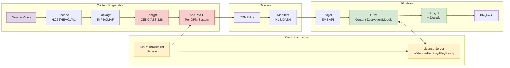
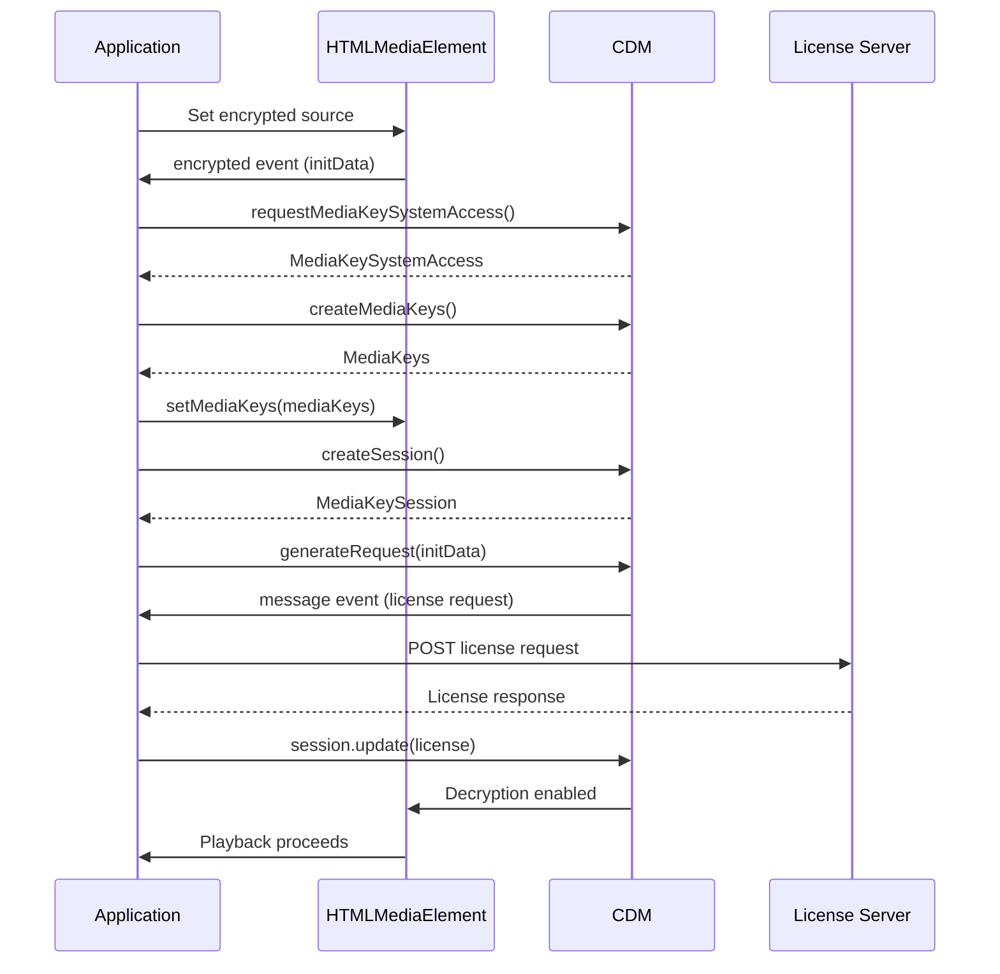

# DRM Fundamentals for Streaming Media

Digital Rights Management (DRM) for streaming media combines encryption, license management, and platform-specific security to control content playback. This article covers the encryption architecture (CENC, AES modes), the three dominant DRM systems (Widevine, FairPlay, PlayReady), license server design, client integration via EME (Encrypted Media Extensions), and operational considerations including key rotation, security levels, and the threat model that DRM addresses.

<figure>



<figcaption>DRM pipeline: content encryption with CENC, key management through license servers, and client-side decryption via platform CDMs</figcaption>

</figure>

## Abstract

DRM protects streaming content by combining two mechanisms: **encryption** (scrambling content so it's unplayable without keys) and **license enforcement** (controlling who gets keys and under what conditions). The challenge is that this must work across a fragmented device ecosystem where each platform (Apple, Google, Microsoft) controls its own security hardware.

**The core mental model:**

1. **CENC separates encryption from DRM.** Common Encryption (ISO/IEC 23001-7) standardizes how content is encrypted using AES-128. The same encrypted file works with any DRM system—Widevine, FairPlay, or PlayReady. What differs is how keys are delivered.

2. **Three DRM systems, one reason: hardware trust.** Each platform vendor controls the Trusted Execution Environment (TEE) on their devices. DRM requires keys to be protected by hardware—no vendor trusts another vendor's implementation. Hence: Widevine for Android/Chrome, FairPlay for Apple, PlayReady for Windows/Xbox.

3. **Security levels determine content quality.** DRM systems define tiers: L1/SL3000 (hardware TEE) enables 4K/HDR; L3/SL2000 (software-only) is capped at SD/720p. Premium services enforce hardware DRM for premium content.

4. **License servers are the policy engine.** The server doesn't just deliver keys—it enforces business rules: rental expiration, device limits, offline playback duration, output restrictions. Keys are wrapped in licenses containing these policies.

5. **EME bridges JavaScript to the CDM.** Encrypted Media Extensions (W3C) provides a standardized browser API. The actual decryption happens in the platform's Content Decryption Module (CDM), which is a black box to JavaScript—the app never sees the content key.

6. **DRM prevents casual copying, not determined piracy.** Hardware DRM (L1) prevents screen recording on supported devices. Software DRM (L3) can be bypassed. The "analog hole" (camera pointing at screen) is addressed by forensic watermarking, not DRM.

**DRM system coverage:**

| DRM | Ecosystem | Hardware Security | Software Fallback |
|-----|-----------|-------------------|-------------------|
| **Widevine** | Chrome, Android, Android TV, Chromecast | L1 (TEE) | L3 (browser CDM) |
| **FairPlay** | Safari, iOS, macOS, Apple TV | Secure Enclave | — |
| **PlayReady** | Edge, Windows, Xbox, Smart TVs | SL3000 (TEE) | SL2000 (software) |

## Common Encryption (CENC)

CENC (ISO/IEC 23001-7:2023) is the foundation that makes multi-DRM practical. It standardizes the encryption format so content can be encrypted once and decrypted by any supported DRM system.

### Why CENC Exists

Before CENC, each DRM system required its own encrypted file. Supporting Widevine and FairPlay meant storing two complete copies of every video—doubling storage costs and halving CDN cache efficiency.

CENC defines:
- **Encryption algorithm:** AES-128 (same algorithm, same encrypted bytes for all DRM systems)
- **Key mapping:** How content keys are identified and applied to media samples
- **Subsample encryption:** Which parts of video NAL units are encrypted (preserving headers for codec parsing)

What CENC does *not* define: license acquisition, key delivery protocols, or security requirements. Each DRM system handles these independently.

### CENC Protection Schemes

CENC defines four encryption modes. The choice affects compatibility:

| Scheme | Algorithm | Pattern | Primary Use |
|--------|-----------|---------|-------------|
| `cenc` | AES-CTR | Full sample | Widevine, PlayReady (DASH) |
| `cbc1` | AES-CBC | Full sample | Rare |
| `cens` | AES-CTR | Partial (pattern) | Rare |
| `cbcs` | AES-CBC | Partial (1:9 pattern) | FairPlay, HLS, CMAF |

**Design trade-off—CTR vs. CBC:**

- **AES-CTR (`cenc`):** Counter mode. Parallelizable—hardware decoders can decrypt multiple blocks simultaneously. No padding required. Historically the default for DASH/Widevine/PlayReady.

- **AES-CBC (`cbcs`):** Cipher Block Chaining with pattern encryption. Each block depends on the previous, limiting parallelization. FairPlay requires CBC mode; Apple never supported CTR.

**The CMAF convergence:** When CMAF unified HLS and DASH containers, the industry needed a common encryption mode. Apple's FairPlay only supports `cbcs`. Starting around 2019-2020, Widevine and PlayReady added `cbcs` support, making it the de facto standard for CMAF content. As of 2024, `cbcs` is recommended for new deployments targeting both Apple and non-Apple devices.

> **Prior to CMAF:** Content providers maintained separate encrypted packages—DASH with `cenc` for Widevine/PlayReady, and HLS with `cbcs` for FairPlay. CMAF with `cbcs` enables single-file multi-DRM.

### Pattern Encryption

`cbcs` uses pattern encryption: encrypt some bytes, skip others. The standard pattern is **1:9**—encrypt 1 block (16 bytes), skip 9 blocks (144 bytes), repeat.

**Why pattern encryption?** Video codecs (H.264, HEVC) have NAL unit structures where headers must remain readable for the decoder to parse frame boundaries without decryption. Pattern encryption leaves sufficient plaintext for parsing while protecting the actual coded video data.

**FairPlay-specific behavior:** FairPlay leaves the first 32 bytes of each VCL (Video Coding Layer) NAL unit unencrypted (1 byte NAL type + 31 bytes), then applies 1:9 pattern. This exceeds the CENC minimum (NAL type + slice header) but simplifies implementation by avoiding slice header parsing.

### Subsample Encryption

For NAL-structured video (H.264, HEVC, AV1), CENC specifies **subsample encryption**: only the coded slice data is encrypted, leaving NAL headers in plaintext.

Structure of an encrypted sample:

```
NAL Unit:
┌────────────┬───────────────────────────────┐
│ NAL Header │ Coded Slice Data              │
│ (clear)    │ (encrypted, pattern applied)  │
└────────────┴───────────────────────────────┘
```

The `senc` (Sample Encryption) box in fMP4 contains auxiliary information describing which byte ranges are clear vs. encrypted for each sample. This enables:
- Decoder inspection of frame types without decryption
- Seeking to keyframes without license acquisition
- Partial decryption for trick play modes

## The DRM Ecosystem

Three DRM systems dominate streaming: Google Widevine, Apple FairPlay, and Microsoft PlayReady. Understanding each system's architecture is essential for multi-DRM deployment.

### Widevine

Widevine is Google's DRM, integrated into Chrome, Android, Chromecast, and Android TV. It's the most widely deployed DRM for non-Apple streaming.

**Security Levels:**

| Level | Implementation | Content Quality | Use Case |
|-------|----------------|-----------------|----------|
| **L1** | Decryption in TEE; keys never exposed to main CPU | 4K, HDR, Dolby Vision | Premium streaming (Netflix, Disney+) |
| **L2** | Crypto in TEE, video processing in main CPU | Limited (rarely used) | Transitional devices |
| **L3** | Software CDM; no hardware protection | SD or 720p max | Desktop browsers, dev testing |

**L1 requirement:** Netflix, Amazon Prime Video, and Disney+ enforce L1 for HD and above. A Chrome browser on macOS—despite running on capable hardware—gets L3 because there's no TEE integration, capping quality at 720p.

**Android implementation:** Widevine on Android uses a Hardware Abstraction Layer (HAL) module. For L1, the `liboemcrypto.so` library communicates with a Widevine trustlet running in the TEE (e.g., Qualcomm QSEE, ARM TrustZone). The trustlet handles key decryption and content decryption without exposing keys to the Android OS.

**Known vulnerabilities:** In 2021, researchers demonstrated L3 bypass on Android by extracting keys from the obfuscated CDM. L1 attacks (recovering the device keybox) have also been demonstrated but require physical access or privileged software. These attacks led to improved keybox protection and server-side device attestation.

### FairPlay Streaming (FPS)

FairPlay is Apple's DRM, required for encrypted HLS on Safari, iOS, macOS, and Apple TV. There is no software-only fallback—FairPlay always uses Apple's Secure Enclave.

**Key Exchange Flow:**

1. Player detects `EXT-X-KEY` tag in HLS manifest with FairPlay URI
2. Player requests Server Playback Context (SPC) from FairPlay framework
3. SPC (encrypted blob containing device identity and key request) is sent to license server
4. License server validates SPC, generates Content Key Context (CKC) containing the content key
5. CKC is returned to player; FairPlay framework decrypts and loads key into Secure Enclave
6. Playback proceeds with hardware-protected decryption

**Deployment requirements:** FairPlay requires enrollment in Apple's program. Content providers must implement a Key Security Module (KSM) or use a managed DRM service. Apple provides the D Function (a cryptographic component) after approval.

**Offline playback:** Since iOS 10, FairPlay supports persistent licenses for offline viewing. The license includes expiration metadata; the Secure Enclave enforces playback duration limits without network access.

### PlayReady

PlayReady is Microsoft's DRM, integrated into Edge, Windows, Xbox, and many smart TVs. It's particularly strong in the set-top box and smart TV market.

**Security Levels:**

| Level | Implementation | Content Quality |
|-------|----------------|-----------------|
| **SL3000** | TEE-based (introduced with PlayReady 3.0) | 4K, HDR |
| **SL2000** | Software-based protection | HD and below |
| **SL150** | No protection (testing only) | — |

**License flexibility:** PlayReady licenses support granular policies:
- Output restrictions (HDCP version requirements, analog output disable)
- License expiration (rental periods, subscription windows)
- Domain binding (sharing across registered devices)
- Secure stop (server confirmation when playback ends)

**SL3000 audio requirement:** When using SL3000 for video, the audio track must use SL2000 or lower, or be unencrypted. This is because audio TEE processing adds latency without significant security benefit—audio piracy via recording is trivial regardless.

**Azure Media Services note:** Azure Media Services (retired June 2024) provided integrated PlayReady licensing. Post-retirement, providers typically use BuyDRM, EZDRM, Axinom, or self-hosted PlayReady servers.

### Multi-DRM Strategy

Supporting all major platforms requires all three DRM systems. CENC makes the media files common; only license acquisition differs.

**Typical multi-DRM architecture:**

```
                    ┌─────────────┐
                    │   Content   │
                    │  (CMAF +    │
                    │   cbcs)     │
                    └──────┬──────┘
                           │
           ┌───────────────┼───────────────┐
           │               │               │
           ▼               ▼               ▼
    ┌────────────┐  ┌────────────┐  ┌────────────┐
    │  Widevine  │  │  FairPlay  │  │  PlayReady │
    │   PSSH     │  │   PSSH     │  │   PSSH     │
    └──────┬─────┘  └──────┬─────┘  └──────┬─────┘
           │               │               │
           ▼               ▼               ▼
    ┌────────────┐  ┌────────────┐  ┌────────────┐
    │  Widevine  │  │  FairPlay  │  │  PlayReady │
    │  License   │  │  License   │  │  License   │
    │  Server    │  │  Server    │  │  Server    │
    └────────────┘  └────────────┘  └────────────┘
```

**Managed vs. self-hosted:** Multi-DRM service providers (BuyDRM, EZDRM, Axinom, PallyCon) handle license server operation, key management, and DRM system certifications. Self-hosting requires separate agreements with Google, Apple, and Microsoft, plus TEE hardware for L1/SL3000.

## PSSH and DRM Signaling

The Protection System Specific Header (PSSH) box contains metadata that the CDM needs to acquire a license. Each DRM system has its own PSSH box; multiple PSSH boxes can coexist in the same file.

### PSSH Box Structure

```
PSSH Box (ISO 23001-7):
┌────────────────────────────────────────┐
│ Box Header (size, type='pssh')         │
├────────────────────────────────────────┤
│ Version (0 or 1)                       │
│ Flags                                  │
│ SystemID (16 bytes, identifies DRM)    │
│ KID Count (v1 only)                    │
│ KID List (v1 only, key IDs)            │
│ Data Size                              │
│ Data (DRM-specific payload)            │
└────────────────────────────────────────┘
```

**SystemID values:**

| DRM | SystemID (UUID) |
|-----|-----------------|
| Widevine | `edef8ba9-79d6-4ace-a3c8-27dcd51d21ed` |
| FairPlay | `94ce86fb-07ff-4f43-adb8-93d2fa968ca2` |
| PlayReady | `9a04f079-9840-4286-ab92-e65be0885f95` |

**PSSH Data contents vary by DRM:**
- **Widevine:** Content ID, key IDs, optional provider/policy info
- **PlayReady:** PlayReady Object (PRO) containing license acquisition URL and key IDs
- **FairPlay:** Typically minimal; key acquisition info is in the HLS `EXT-X-KEY` tag

### Signaling in DASH

DASH uses `ContentProtection` elements in the MPD to signal DRM:

```xml
<AdaptationSet>
  <!-- Signal encryption scheme -->
  <ContentProtection
    schemeIdUri="urn:mpeg:dash:mp4protection:2011"
    value="cenc" />

  <!-- Widevine-specific -->
  <ContentProtection
    schemeIdUri="urn:uuid:edef8ba9-79d6-4ace-a3c8-27dcd51d21ed">
    <cenc:pssh>AAAANHBzc2gBAAAA7e+LqXnW...</cenc:pssh>
  </ContentProtection>

  <!-- PlayReady-specific -->
  <ContentProtection
    schemeIdUri="urn:uuid:9a04f079-9840-4286-ab92-e65be0885f95">
    <cenc:pssh>AAADfnBzc2gAAAAAmgTweZh...</cenc:pssh>
    <mspr:pro>...</mspr:pro>
  </ContentProtection>
</AdaptationSet>
```

**PSSH placement—MPD vs. init segment:**

The PSSH can appear in the MPD (as base64-encoded `cenc:pssh` element) or in the initialization segment's `moov/pssh` box. Best practice for live streaming: include PSSH in the MPD. This enables license acquisition before fetching media segments, reducing startup latency.

> **DASH-IF recommendation:** "PSSH boxes required for DRM system initialization SHOULD be placed in the MPD as cenc:pssh elements." Updating the MPD is operationally simpler than regenerating init segments.

### Signaling in HLS

HLS uses the `EXT-X-KEY` tag in media playlists:

```m3u8
#EXTM3U
#EXT-X-VERSION:5
#EXT-X-KEY:METHOD=SAMPLE-AES,URI="skd://content-id-here",KEYFORMAT="com.apple.streamingkeydelivery",KEYFORMATVERSIONS="1"
#EXTINF:6.0,
segment001.m4s
```

**Key parameters:**
- `METHOD=SAMPLE-AES`: Indicates `cbcs` encryption
- `URI`: FairPlay uses `skd://` scheme; the value is passed to the license server
- `KEYFORMAT`: Identifies FairPlay (`com.apple.streamingkeydelivery`)

For Widevine/PlayReady with HLS (fMP4/CMAF), the PSSH is embedded in the init segment's `moov` box. Some players also support `EXT-X-SESSION-KEY` in master playlists for early license acquisition.

## License Server Architecture

The license server is the policy engine of DRM. It doesn't just deliver keys—it wraps them in licenses that encode business rules.

### Core Components

```
┌────────────────────────────────────────────────────────────┐
│                    License Server                          │
│                                                            │
│  ┌──────────────┐  ┌──────────────┐  ┌──────────────┐    │
│  │ Entitlement  │  │     Key      │  │   License    │    │
│  │   Service    │  │   Service    │  │  Generator   │    │
│  │              │  │              │  │              │    │
│  │ - Auth       │  │ - Key store  │  │ - DRM-       │    │
│  │ - Subscript. │  │ - Derivation │  │   specific   │    │
│  │ - Policies   │  │ - Rotation   │  │   wrapping   │    │
│  └──────┬───────┘  └──────┬───────┘  └──────┬───────┘    │
│         │                 │                 │             │
│         └─────────────────┴─────────────────┘             │
│                           │                               │
└───────────────────────────┼───────────────────────────────┘
                            ▼
                    ┌───────────────┐
                    │    Client     │
                    │  (CDM/EME)    │
                    └───────────────┘
```

**Entitlement Service:** Authorizes the license request. Checks user authentication, subscription status, device limits, geo-restrictions. Returns an entitlement token (often JWT) that the license generator trusts.

**Key Service:** Stores and retrieves content encryption keys. For large catalogs, keys may be derived from a master key using the content ID (hierarchical key derivation). Must be highly secure—compromise here means all content is compromised.

**License Generator:** Takes the entitlement token and content key, generates a DRM-specific license. Each DRM has its own license format and signing requirements.

### License Policies

Licenses contain policies that the CDM enforces locally:

| Policy | Description | Example |
|--------|-------------|---------|
| **License duration** | How long the license is valid | 48 hours (rental) |
| **Playback duration** | How long playback can continue after first play | 24 hours |
| **Persistence** | Whether license survives app restart | Offline viewing |
| **Output restrictions** | Required HDCP version, analog output control | HDCP 2.2 for 4K |
| **Security level** | Minimum client security level | L1 for HD+ |
| **Device binding** | License tied to specific device | Non-transferable |

**Rental example:** A 48-hour rental might have:
- License duration: 30 days (time to start watching)
- Playback duration: 48 hours (once playback begins)
- Persistence: Enabled (for offline viewing)

### Key Rotation

For live streaming, key rotation changes encryption keys periodically, limiting the exposure window if a key is compromised.

**Implementation:**
1. Encoder generates new key at rotation interval (e.g., every hour)
2. Key Service stores new key with associated time period
3. MPD/playlist signals upcoming key change via PSSH update
4. Player acquires new license before key change takes effect
5. CDM seamlessly transitions to new key

**Timing is critical:** The new key must be signaled 2-3 segment periods before activation. If the player doesn't acquire the new license in time, playback stalls.

**CPIX for key exchange:** The Content Protection Information Exchange (CPIX) format, standardized by DASH-IF, provides a vendor-neutral way to exchange key information between encoders, packagers, and DRM servers. CPIX supports key periods for rotation and filtering by track type (video, audio, SD, HD).

### Entitlement Tokens

Rather than embedding business logic in the license server, the common pattern is token-based entitlement:

1. User's app authenticates with backend
2. Backend validates subscription, generates signed entitlement token
3. Token includes: user ID, content ID, allowed policies, expiration
4. Player includes token in license request
5. License server validates token signature, applies policies

**Token format example (JWT-style):**

```json
{
  "sub": "user-12345",
  "content_id": "movie-abc",
  "policies": {
    "license_duration": 172800,
    "playback_duration": 86400,
    "min_security_level": "L1"
  },
  "exp": 1704067200,
  "iss": "streaming-service.com"
}
```

This separates concerns: the backend handles business logic, the license server handles DRM cryptography.

## Client Integration: EME

Encrypted Media Extensions (EME) is the W3C API that connects web applications to Content Decryption Modules. EME standardizes the interface; the security properties depend entirely on the underlying CDM.

### EME Flow



### Key API Components

**`navigator.requestMediaKeySystemAccess(keySystem, config)`**

Checks if a DRM system is available and supports the requested configuration.

```javascript
const config = [{
  initDataTypes: ['cenc'],
  videoCapabilities: [{
    contentType: 'video/mp4; codecs="avc1.640028"',
    robustness: 'HW_SECURE_ALL'  // Request L1
  }],
  audioCapabilities: [{
    contentType: 'audio/mp4; codecs="mp4a.40.2"'
  }],
  persistentState: 'required',  // For offline
  sessionTypes: ['persistent-license']
}];

const access = await navigator.requestMediaKeySystemAccess(
  'com.widevine.alpha',
  config
);
```

**Robustness levels (Widevine):**
- `HW_SECURE_ALL`: L1 (hardware path for crypto and decode)
- `HW_SECURE_CRYPTO`: L2 (hardware crypto, software decode)
- `SW_SECURE_CRYPTO`: L3 (software only)

**`MediaKeys` and `MediaKeySession`**

MediaKeys represents the keying material for a media element. MediaKeySession handles the license exchange for a specific set of keys.

```javascript
const mediaKeys = await access.createMediaKeys();
await videoElement.setMediaKeys(mediaKeys);

// When encrypted event fires
videoElement.addEventListener('encrypted', async (event) => {
  const session = mediaKeys.createSession('temporary');

  session.addEventListener('message', async (messageEvent) => {
    // messageEvent.message contains the license request
    const response = await fetch('/license', {
      method: 'POST',
      body: messageEvent.message
    });
    const license = await response.arrayBuffer();
    await session.update(license);
  });

  await session.generateRequest(event.initDataType, event.initData);
});
```

### Session Types

| Type | Persistence | Use Case |
|------|-------------|----------|
| `temporary` | Memory only; lost on page close | Streaming |
| `persistent-license` | Stored; survives restart | Offline viewing |
| `persistent-usage-record` | Records playback for secure stop | Rental tracking |

**Persistent license flow:** For offline playback, the app stores the session ID. On reconnect, it calls `mediaKeys.createSession('persistent-license')` followed by `session.load(storedSessionId)` to restore the license without network access.

### Common Failure Modes

| Error | Symptom | Cause |
|-------|---------|-------|
| `NotSupportedError` | `requestMediaKeySystemAccess` rejects | DRM system unavailable or config unsupported |
| `QuotaExceededError` | `createSession` fails | Too many concurrent sessions |
| `InvalidStateError` | `update` fails | License response malformed or session closed |
| `SecurityError` | Playback fails after license | Security level mismatch or HDCP missing |

**Debugging tip:** Enable chrome://media-internals in Chrome to see detailed EME events, license requests, and CDM status.

## Content Packaging

Packaging transforms encoded video into DRM-protected segments ready for delivery. Tools like Shaka Packager and Bento4 handle encryption and PSSH generation.

### Shaka Packager Multi-DRM Example

```bash title="package-multi-drm.sh" collapse={1-3, 20-30}
#!/bin/bash
# Package content for Widevine, PlayReady, and FairPlay
# using CMAF with cbcs encryption

packager \
  'in=video.mp4,stream=video,output=video.mp4,drm_label=HD' \
  'in=video.mp4,stream=audio,output=audio.mp4,drm_label=AUDIO' \
  --protection_scheme cbcs \
  --enable_raw_key_encryption \
  --keys label=HD:key_id=<key-id>:key=<key>,label=AUDIO:key_id=<key-id>:key=<key> \
  --protection_systems Widevine,PlayReady,FairPlay \
  --hls_master_playlist_output master.m3u8 \
  --mpd_output manifest.mpd

# Output:
# - video.mp4, audio.mp4 (CMAF, cbcs encrypted)
# - master.m3u8 (HLS)
# - manifest.mpd (DASH)
# - init segments with PSSH boxes for all three DRM systems
```

**Key parameters:**

| Parameter | Purpose |
|-----------|---------|
| `--protection_scheme cbcs` | Use cbcs encryption for Apple compatibility |
| `--protection_systems` | Generate PSSH for specified DRM systems |
| `--enable_raw_key_encryption` | Use provided keys (vs. Widevine server) |
| `--drm_label` | Associate different keys with different tracks |

### CPIX Integration

For production workflows, keys come from a DRM service via CPIX rather than command-line arguments:

```bash
packager \
  'in=video.mp4,stream=video,output=video.mp4' \
  'in=video.mp4,stream=audio,output=audio.mp4' \
  --protection_scheme cbcs \
  --enable_raw_key_encryption \
  --keys_file keys.cpix
```

The CPIX document contains keys, key IDs, PSSH data, and any track-specific filtering rules.

### Output Structure

A packaged CMAF asset typically contains:

```
output/
├── master.m3u8          # HLS master playlist
├── manifest.mpd         # DASH manifest
├── video/
│   ├── init.mp4         # Init segment (moov + PSSH boxes)
│   └── segment_*.m4s    # Media segments (encrypted)
├── audio/
│   ├── init.mp4
│   └── segment_*.m4s
└── subtitles/
    └── en.vtt
```

The init segment's `moov` box contains PSSH boxes for each DRM system. Players extract the appropriate PSSH based on the detected DRM.

## Threat Model and Limitations

DRM addresses specific threats in the content distribution chain. Understanding what it protects against—and what it doesn't—is essential for setting realistic expectations.

### What DRM Protects Against

| Threat | DRM Mitigation |
|--------|----------------|
| **Casual sharing** | Content requires license; can't just copy files |
| **Network capture** | Encrypted stream is useless without keys |
| **Screen recording (L1/SL3000)** | Hardware path prevents capture APIs |
| **Playback manipulation** | License policies (expiration, device binding) |
| **Credential sharing** | Concurrent stream limits enforced server-side |

### What DRM Doesn't Protect Against

**Software DRM bypass (L3):** Widevine L3 has been reverse-engineered; keys can be extracted from the software CDM. Services limit L3 to SD quality for this reason.

**Hardware attacks:** With physical access and resources, attackers can extract L1 keyboxes (device certificates). Revocation lists address known compromises, but the attacker has typically already extracted content.

**The analog hole:** A camera recording a screen cannot be prevented by any technology. This is where forensic watermarking becomes relevant—it doesn't prevent the recording but enables identification of the source.

**Re-streaming:** Once decrypted for playback, content can be captured and re-distributed. HDCP protects the link from player to display, but HDCP has been compromised multiple times.

### Forensic Watermarking

Watermarking complements DRM by enabling leak tracing. Unlike DRM (prevention), watermarking enables identification after a leak.

**Types:**

| Type | Application | Visibility |
|------|-------------|------------|
| **Visible** | Applied at encode time | User sees overlay |
| **Server-side forensic** | Applied during packaging/delivery | Invisible; per-user ID embedded |
| **Client-side forensic** | Applied by player at render | Invisible; session-specific |

**Session-based watermarking:** Each playback session embeds unique identifiers (user ID, session ID, timestamp) into the video signal. If leaked content is discovered, extraction tools can recover the session information and identify the source account.

**Limitations:**
- Watermarks must survive re-encoding attacks (quality degradation, cropping, scaling)
- Robust watermarks may introduce visible artifacts
- Extraction from low-quality re-recordings is unreliable
- Processing pirated content at scale to extract watermarks is resource-intensive

### HDCP

High-bandwidth Digital Content Protection (HDCP) encrypts the link between a player device and display, preventing HDMI capture.

**Versions:**
- **HDCP 1.x:** Broken; master key leaked in 2010
- **HDCP 2.2:** Required for 4K content; no public breaks as of 2024
- **HDCP 2.3:** Latest version, additional robustness

**Output restriction policies:** DRM licenses can require specific HDCP versions. PlayReady and Widevine L1 can enforce "HDCP 2.2 or fail playback," blocking output to non-compliant displays.

**Gotcha:** HDCP compliance is device-path specific. A 4K TV may support HDCP 2.2, but if connected through an older HDMI switch, the path fails HDCP handshake.

## Operational Considerations

### Monitoring and Alerting

**Key metrics:**

| Metric | Target | Alert Threshold |
|--------|--------|-----------------|
| License acquisition success rate | > 99.5% | < 99% |
| License acquisition p95 latency | < 500ms | > 1s |
| CDM initialization failures | < 0.1% | > 0.5% |
| Key rotation success rate | 100% | < 100% |
| Entitlement validation latency | < 100ms | > 250ms |

**Error categorization:**

| Error Category | Examples | Action |
|----------------|----------|--------|
| **Client error** | Unsupported DRM, invalid request | Log, don't alert |
| **Auth error** | Expired subscription, geo-block | Expected; monitor rate |
| **Server error** | License server down, key service unavailable | Page immediately |
| **Timeout** | Network issues, overloaded server | Scale or investigate |

### High Availability

License servers are critical path—playback fails without them. Design considerations:

- **Multi-region deployment:** License acquisition should complete within 500ms; deploy near users
- **Caching entitlements:** Cache entitlement decisions (not keys!) with appropriate TTL
- **Graceful degradation:** Return cached license if key service is temporarily unavailable (for previously authorized content)
- **Rate limiting:** Protect against license acquisition storms (reconnect thundering herd)

### Key Management Security

Content keys are crown jewels. Compromise means permanent content exposure.

**Best practices:**
- Keys stored in HSMs (Hardware Security Modules) or cloud KMS
- Separate key service from license service (different security domains)
- Audit logging for all key access
- Key derivation from master keys (limits exposure if individual keys leak)
- Regular key rotation for live content

### Device Management

**Device limits:** Most services cap concurrent streams (e.g., 4 simultaneous). Implemented via:
- License server tracks active sessions per account
- Heartbeat from players confirms continued playback
- Secure stop signals when playback ends

**Device registration:** Premium features (offline viewing, 4K) may require device registration. The license server tracks device certificates (keybox IDs) and enforces limits.

**Revocation:** Compromised device certificates can be revoked. The CDM checks a revocation list; revoked devices cannot acquire new licenses. This is reactive—content already cached remains accessible until license expires.

## Conclusion

DRM for streaming is a pragmatic compromise: it raises the bar for content piracy without providing absolute protection. The system works because it makes casual copying inconvenient while acknowledging that determined attackers will always find workarounds.

**Key architectural insights:**

1. **CENC enables multi-DRM efficiency.** Encrypt once, deliver everywhere. The shift to `cbcs` unified Apple and non-Apple workflows under CMAF.

2. **Hardware DRM (L1/SL3000) is the real protection.** Software DRM deters casual users; hardware DRM prevents screen recording on compliant devices. Premium services gate quality on security level.

3. **License servers are the policy engine.** Business rules (rentals, subscriptions, device limits) are encoded in licenses. The CDM is a cryptographic agent enforcing those policies locally.

4. **EME standardizes the client interface.** JavaScript applications interact with DRM through a common API. The actual security comes from the platform's CDM, which varies dramatically (Chrome L3 vs. Android L1).

5. **DRM + watermarking is the complete strategy.** DRM prevents; watermarking traces. Neither alone addresses all threats. The combination provides both deterrence and accountability.

The operational complexity is significant: supporting three DRM systems, managing keys securely, handling license acquisition at scale, and monitoring for failures across a fragmented device ecosystem. Managed multi-DRM services exist precisely because this operational burden is substantial.

For new deployments: CMAF with `cbcs` encryption, all three DRM systems (Widevine, FairPlay, PlayReady), and a managed DRM provider unless scale justifies self-hosting. The goal is seamless playback across devices—users should never know DRM exists until they try to screenshot a movie.

## Appendix

### Prerequisites

- Familiarity with video streaming concepts (HLS, DASH, manifests, segments)
- Understanding of symmetric encryption (AES modes)
- Basic knowledge of browser APIs (especially Promises, ArrayBuffer)
- Familiarity with HTTP-based media delivery and CDN caching

### Terminology

| Term | Definition |
|------|------------|
| **AES-128** | Advanced Encryption Standard with 128-bit keys—the encryption algorithm used by all DRM systems |
| **cbcs** | CENC protection scheme using AES-CBC with pattern encryption—required for FairPlay and CMAF |
| **CDM** | Content Decryption Module—platform component that handles DRM decryption (Widevine, FairPlay, PlayReady implementations) |
| **CENC** | Common Encryption (ISO/IEC 23001-7)—standard for multi-DRM compatible encryption |
| **CKC** | Content Key Context—FairPlay's license response containing the encrypted content key |
| **CMAF** | Common Media Application Format—unified fMP4 container for HLS and DASH |
| **CPIX** | Content Protection Information Exchange—DASH-IF standard for key exchange between services |
| **EME** | Encrypted Media Extensions—W3C API connecting JavaScript to CDMs |
| **HDCP** | High-bandwidth Digital Content Protection—encryption for HDMI/DisplayPort links |
| **HSM** | Hardware Security Module—tamper-resistant device for cryptographic key storage |
| **KSM** | Key Security Module—Apple's term for the FairPlay license server component |
| **L1/L3** | Widevine security levels—L1 is hardware TEE, L3 is software-only |
| **NAL** | Network Abstraction Layer—framing structure in H.264/HEVC bitstreams |
| **PSSH** | Protection System Specific Header—DRM metadata box in fMP4 containing key IDs and system-specific data |
| **SL2000/SL3000** | PlayReady security levels—SL3000 is hardware TEE, SL2000 is software |
| **SPC** | Server Playback Context—FairPlay's license request blob |
| **SPEKE** | Secure Packager and Encoder Key Exchange—AWS protocol built on CPIX |
| **TEE** | Trusted Execution Environment—hardware-isolated secure processing area |

### Summary

- **CENC standardizes encryption** for multi-DRM. Single encrypted file works with Widevine, FairPlay, and PlayReady. Use `cbcs` mode for CMAF compatibility.
- **Three DRM systems exist because of hardware trust.** Each platform vendor controls their TEE. Widevine (Google), FairPlay (Apple), PlayReady (Microsoft) cannot be consolidated.
- **Security levels determine content quality.** L1/SL3000 (hardware) enables 4K; L3/SL2000 (software) is capped at SD/720p. Premium services enforce hardware DRM.
- **License servers enforce policy, not just keys.** Rental expiration, device limits, output restrictions—all encoded in licenses that CDMs enforce locally.
- **EME is the browser API, not the security.** EME provides a standard interface; actual protection comes from the CDM, which varies by platform.
- **DRM prevents casual copying; watermarking traces leaks.** No DRM stops determined attackers. The practical goal is making piracy inconvenient and traceable.

### References

**Specifications:**

- [ISO/IEC 23001-7:2023 - Common Encryption](https://www.iso.org/standard/84637.html) - CENC specification defining encryption modes and subsample encryption
- [W3C Encrypted Media Extensions](https://www.w3.org/TR/encrypted-media-2/) - EME API specification for browser DRM integration
- [W3C "cenc" Initialization Data Format](https://w3c.github.io/encrypted-media/format-registry/initdata/cenc.html) - PSSH format for EME
- [DASH-IF Content Protection Guidelines](https://dashif-documents.azurewebsites.net/Guidelines-Security/master/Guidelines-Security.html) - Interoperability guidelines for DASH DRM
- [DASH-IF CPIX Specification](https://dashif.org/guidelines/) - Content Protection Information Exchange format

**Official Documentation:**

- [Apple FairPlay Streaming](https://developer.apple.com/streaming/fps/) - FairPlay implementation guide and requirements
- [Apple FairPlay Streaming Overview (PDF)](https://developer.apple.com/streaming/fps/FairPlayStreamingOverview.pdf) - Technical overview of SPC/CKC flow
- [Microsoft PlayReady Security Level](https://learn.microsoft.com/en-us/playready/overview/security-level) - SL2000/SL3000 definitions
- [Microsoft PlayReady Content Encryption Modes](https://learn.microsoft.com/en-us/playready/packaging/content-encryption-modes) - cenc vs cbcs support
- [Widevine DRM](https://www.widevine.com/) - Google's DRM system overview

**Tools:**

- [Shaka Packager](https://github.com/shaka-project/shaka-packager) - Open-source packager with multi-DRM support
- [Shaka Packager DRM Documentation](https://shaka-project.github.io/shaka-packager/html/tutorials/drm.html) - Encryption and PSSH generation

**Technical Resources:**

- [Axinom DRM Documentation](https://docs.axinom.com/services/drm/general/what-is-drm/) - Comprehensive DRM architecture explanations
- [PSSH Box Structure (Axinom)](https://docs.axinom.com/services/drm/technical-articles/pssh/) - Detailed PSSH format documentation
- [Unified Streaming CENC Documentation](https://docs.unified-streaming.com/documentation/drm/common-encryption.html) - Practical CENC implementation guidance
- [web.dev EME Basics](https://web.dev/articles/eme-basics) - EME tutorial and flow explanation
- [Bitmovin Widevine Security Levels](https://developer.bitmovin.com/playback/docs/widevine-security-levels-in-web-video-playback) - L1/L2/L3 technical details
- [Bitmovin FairPlay Overview](https://developer.bitmovin.com/playback/docs/how-does-fairplay-work) - FairPlay key exchange flow
