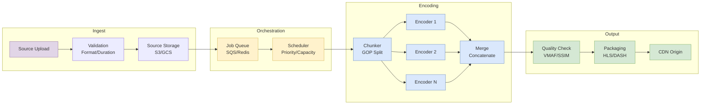
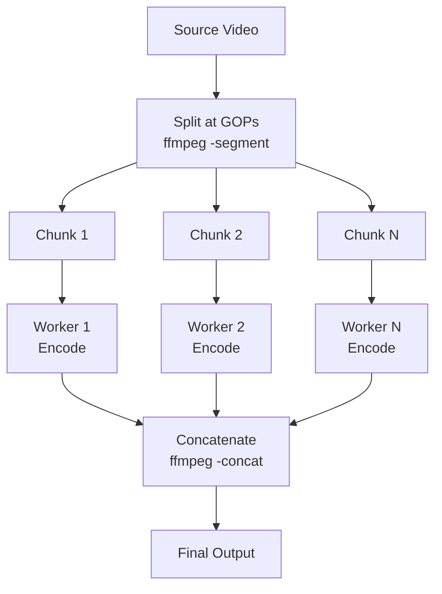
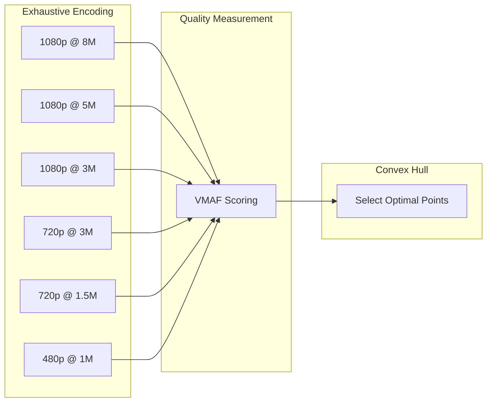

# Video Transcoding Pipeline Design

Building scalable video transcoding pipelines requires orchestrating CPU/GPU-intensive encoding jobs across distributed infrastructure while optimizing for quality, cost, and throughput. This article covers pipeline architecture patterns, codec selection, rate control strategies, job orchestration with chunked parallel processing, quality validation, and failure handling for production video platforms.

<figure>



<figcaption>End-to-end transcoding pipeline: source ingestion through job orchestration, distributed encoding with chunked parallelization, quality validation, and CDN delivery</figcaption>

</figure>

## Abstract

A video transcoding pipeline transforms source video into multiple renditions optimized for adaptive streaming. The core challenge: encoding is computationally expensive (a 4K video can take 10-100x real-time on CPU), yet platforms need to process thousands of hours daily with predictable latency.

**The mental model:**

1. **Encoding is the bottleneck.** Everything else (upload, packaging, CDN propagation) takes seconds; encoding takes minutes to hours. Pipeline design optimizes encoding throughput.

2. **Parallelization happens at two levels:** across videos (horizontal scaling via job queues) and within a video (chunked encoding). The first scales linearly with workers; the second reduces wall-clock time for individual jobs.

3. **Rate control determines quality-to-size trade-off.** CRF (Constant Rate Factor) targets quality, CBR (Constant Bitrate) targets file size. Streaming uses constrained VBR (Variable Bitrate)—CRF with bitrate caps—to balance quality consistency with bandwidth predictability.

4. **The bitrate ladder maps quality to network conditions.** Static ladders (one-size-fits-all) waste bits on simple content and starve complex content. Per-title encoding builds content-specific ladders via convex hull optimization, achieving 20-30% bandwidth savings.

5. **Quality validation closes the loop.** VMAF (Video Multi-Method Assessment Fusion) correlates with human perception better than PSNR/SSIM (Peak Signal-to-Noise Ratio / Structural Similarity Index). Automated quality gates prevent shipping degraded encodes.

6. **Cost splits three ways:** compute (encoding), storage (renditions × retention), egress (CDN delivery). At scale, egress dominates—efficient codecs (AV1, HEVC) reduce storage and egress at the cost of higher compute.

**Cost trade-off summary:**

| Cost Factor | Optimization Lever                 | Trade-off               |
| ----------- | ---------------------------------- | ----------------------- |
| Compute     | GPU encoding, parallel chunking    | Higher infra complexity |
| Storage     | Fewer renditions, efficient codecs | Playback compatibility  |
| Egress      | Better compression, regional CDN   | Compute cost increase   |

## Pipeline Stages

A transcoding pipeline processes videos through distinct stages, each with specific failure modes and scaling characteristics.

### Stage 1: Ingestion and Validation

Before encoding begins, the pipeline validates source files to fail fast on corrupt or unsupported content.

**Validation checks:**

| Check            | Purpose                     | Failure Mode           |
| ---------------- | --------------------------- | ---------------------- |
| Container format | Ensure demuxable            | Corrupt file header    |
| Codec probe      | Verify decoder availability | Unsupported codec      |
| Duration         | Detect truncation           | Incomplete upload      |
| Resolution/FPS   | Enforce limits              | Exceeds max (e.g., 8K) |
| Audio streams    | Map language tracks         | Missing audio          |

**Design decision: Probe vs. full decode.** FFprobe reads metadata in milliseconds; full decode verification takes minutes. Production pipelines typically probe only, accepting that rare corrupt files will fail during encoding. The trade-off: faster validation vs. later failures requiring reprocessing.

```bash title="validation.sh" collapse={1-2, 8-20}
#!/bin/bash
# Probe source file for validation

ffprobe -v error \
  -show_entries format=duration,size,bit_rate \
  -show_entries stream=codec_type,codec_name,width,height,r_frame_rate \
  -of json \
  "$INPUT_FILE"

# Output example:
# {
#   "format": {
#     "duration": "3600.123",
#     "size": "4294967296",
#     "bit_rate": "9534567"
#   },
#   "streams": [
#     {"codec_type": "video", "codec_name": "h264", "width": 1920, "height": 1080, "r_frame_rate": "30000/1001"},
#     {"codec_type": "audio", "codec_name": "aac"}
#   ]
# }
```

**Gotcha: Variable frame rate (VFR).** Some sources (screen recordings, phone videos) have variable frame rates. FFprobe reports average FPS, masking the issue. VFR causes A/V sync drift in HLS/DASH. Mitigation: force constant frame rate during encoding with `-vsync cfr`.

### Stage 2: Job Queue and Scheduling

Encoding jobs enter a queue for processing by worker pools. The queue provides decoupling (producers and consumers scale independently), persistence (jobs survive worker crashes), and prioritization (premium content before UGC).

**Queue architecture patterns:**

| Pattern                | Technology                   | Best For                         |
| ---------------------- | ---------------------------- | -------------------------------- |
| Simple FIFO            | SQS, Redis Lists             | Uniform priority, moderate scale |
| Priority queues        | Redis Sorted Sets, RabbitMQ  | Mixed content tiers              |
| Workflow orchestration | AWS Step Functions, Temporal | Complex multi-stage pipelines    |
| Event-driven           | SQS + Lambda/ECS             | Serverless, bursty workloads     |

**Design rationale for SQS:** SQS provides at-least-once delivery with automatic retries, visibility timeout for in-flight job protection, and dead-letter queues (DLQ) for failed jobs. The trade-off: no strict ordering (which transcoding doesn't need) in exchange for high availability.

**Job message structure:**

```json title="job-message.json"
{
  "jobId": "uuid-v4",
  "sourceUrl": "s3://input-bucket/source.mp4",
  "outputPrefix": "s3://output-bucket/encoded/",
  "profile": "hls-h264-ladder",
  "priority": 1,
  "metadata": {
    "title": "Example Video",
    "contentId": "12345"
  },
  "createdAt": "2025-01-15T10:30:00Z"
}
```

**Visibility timeout tuning:** Set visibility timeout to expected encoding time + buffer. If a 1-hour video typically encodes in 30 minutes, set 45 minutes. Too short: jobs become visible again mid-encoding, causing duplicate work. Too long: failed jobs wait unnecessarily before retry.

### Stage 3: Chunked Parallel Encoding

The key to reducing wall-clock time for individual videos: split the source into chunks, encode in parallel, then merge. This is distinct from multi-bitrate encoding (which parallelizes across renditions).

**Why chunking works:**

```
Sequential encoding (1 worker):
[======================================] 60 min

Parallel chunked (6 workers, 10 chunks):
[====] [====] [====] [====] [====] [====] [====] [====] [====] [====]
  W1     W2     W3     W4     W5     W6     W1     W2     W3     W4
└─────────────────────────────────────────────────────────────────┘
                            ~12 min total
```

**Chunking constraints:**

1. **Chunks must start at keyframes (I-frames).** Video codecs use inter-frame compression; P/B-frames reference previous frames. Cutting mid-GOP (Group of Pictures) produces undecodable output.

2. **GOP alignment must be consistent.** If source has irregular keyframe intervals, re-encode to fixed GOP first, or accept variable chunk sizes.

3. **Audio requires independent chunking.** Audio frames don't align with video GOPs. Either:
   - Encode audio once, full-file (audio encoding is fast)
   - Split at packet boundaries and accept minor gaps at chunk joins

**Distributed chunking workflow (fan-out/fan-in):**



**Splitting at keyframes:**

```bash title="split-chunks.sh" collapse={1-2}
#!/bin/bash
# Split video into chunks at keyframe boundaries

ffmpeg -i source.mp4 \
  -c copy \
  -f segment \
  -segment_time 60 \
  -reset_timestamps 1 \
  -map 0:v:0 \
  chunk_%03d.mp4
```

**Concatenating encoded chunks:**

```bash title="concat-chunks.sh" collapse={1-5}
#!/bin/bash
# Concatenate encoded chunks back together

# Create file list
echo "file 'encoded_chunk_000.mp4'" > chunks.txt
echo "file 'encoded_chunk_001.mp4'" >> chunks.txt
# ... repeat for all chunks

ffmpeg -f concat -safe 0 -i chunks.txt -c copy output.mp4
```

**Gotcha: Timestamp discontinuities.** Concatenated chunks may have timestamp gaps. Use `-reset_timestamps 1` during split and verify PTS (Presentation Timestamp) continuity after merge. Players handle small gaps (<100ms) but larger discontinuities cause seeks or stalls.

**Production implementation pattern (AWS):**

1. Upload triggers S3 event → Lambda
2. Lambda splits source into chunks, uploads to S3
3. Lambda enqueues N encoding jobs (one per chunk) to SQS
4. ECS Fargate workers pull jobs, encode, upload results
5. DynamoDB tracks chunk completion status
6. When all chunks complete, Step Functions triggers concatenation
7. Final output uploaded to CDN origin

This pattern—pioneered by projects like Bento—achieves 90%+ faster encoding than single-instance approaches and 50% faster than AWS MediaConvert for large files.

## Codec Selection and Rate Control

Codec choice determines compression efficiency, hardware compatibility, and compute cost. Rate control determines quality consistency and file size predictability.

### Codec Comparison for Transcoding

| Codec         | Encode Speed  | Compression   | Hardware Support | Use Case         |
| ------------- | ------------- | ------------- | ---------------- | ---------------- |
| H.264 (x264)  | Fast          | Baseline      | Universal        | Default, live    |
| H.265 (x265)  | 5-10x slower  | +50% vs H.264 | ~92% browsers    | 4K/HDR VOD       |
| AV1 (SVT-AV1) | 10-20x slower | +30% vs H.265 | ~88% Netflix TVs | High-volume VOD  |
| VP9           | 5x slower     | ~H.265        | Chrome, Android  | YouTube fallback |

**Design rationale for codec ladder:** Start with H.264 for universal reach. Add HEVC/AV1 for bandwidth savings on compatible devices. The player negotiates codec via manifest `CODECS` attribute.

**SVT-AV1 adoption note (2024-2025):** Netflix reports AV1 powers 30% of streaming, making it their second most-used codec. SVT-AV1 2.0.0 (March 2024) brought significant performance improvements. Intel and Netflix collaboration produced a production-ready encoder with multi-dimensional parallelism.

### Rate Control Strategies

**CRF (Constant Rate Factor):** Targets perceptual quality. Higher CRF = lower quality, smaller file. The encoder varies bitrate to maintain quality.

| Codec   | CRF Range | Default | "Visually Lossless" |
| ------- | --------- | ------- | ------------------- |
| x264    | 0-51      | 23      | ~18                 |
| x265    | 0-51      | 28      | ~24                 |
| SVT-AV1 | 0-63      | —       | ~23                 |

**Gotcha: CRF produces unpredictable file sizes.** A static scene might encode at 1 Mbps; an action sequence at 15 Mbps. For streaming with bandwidth constraints, use constrained CRF.

**Constrained CRF (Capped VBR):** Combines quality targeting with bitrate limits. Essential for streaming where buffer underruns must be avoided.

```bash title="constrained-crf.sh" collapse={1-2}
#!/bin/bash
# H.264 encoding with capped CRF for streaming

ffmpeg -i source.mp4 \
  -c:v libx264 \
  -preset slow \
  -crf 23 \
  -maxrate 5M \
  -bufsize 10M \
  -profile:v high \
  -level 4.1 \
  output.mp4
```

**Parameter explanation:**

| Parameter         | Purpose                                   |
| ----------------- | ----------------------------------------- |
| `-crf 23`         | Target quality (lower = better)           |
| `-maxrate 5M`     | Peak bitrate cap                          |
| `-bufsize 10M`    | VBV buffer (2x maxrate typical)           |
| `-profile:v high` | H.264 profile (compression features)      |
| `-level 4.1`      | Compatibility level (decoder constraints) |

**CBR (Constant Bitrate):** Forces exact bitrate, padding if necessary. Required only for broadcast/satellite where fixed bitrate is mandated. Wastes bits on simple scenes.

**2-Pass VBR:** First pass analyzes content complexity; second pass allocates bits optimally. Produces best quality-per-bit but doubles encoding time. Use for premium VOD where encoding cost amortizes across millions of views.

```bash title="two-pass.sh" collapse={1-2}
#!/bin/bash
# 2-pass encoding for optimal bitrate distribution

# Pass 1: Analysis (no output file)
ffmpeg -i source.mp4 \
  -c:v libx264 -preset slow -b:v 5M \
  -pass 1 -f null /dev/null

# Pass 2: Encode with analysis data
ffmpeg -i source.mp4 \
  -c:v libx264 -preset slow -b:v 5M \
  -pass 2 output.mp4
```

### Preset Trade-offs

Encoder presets trade encoding time for compression efficiency. Slower presets try more encoding options, finding better compression.

| Preset    | x264 Speed | File Size | Use Case       |
| --------- | ---------- | --------- | -------------- |
| ultrafast | 1x         | +50-100%  | Testing only   |
| veryfast  | 2x         | +20-30%   | Live streaming |
| medium    | 4x         | Baseline  | Default        |
| slow      | 8x         | -5-10%    | VOD            |
| veryslow  | 16x        | -10-15%   | Premium VOD    |

**Production recommendation:** Use `-preset slow` for VOD. The quality improvement from `veryslow` is marginal (<0.5% file size reduction) but encoding time doubles. The sweet spot is `slow` for quality-sensitive content, `medium` for high-volume UGC.

## Bitrate Ladder Design

The bitrate ladder defines which resolution/bitrate combinations are offered for adaptive streaming. Poor ladder design causes wasted bandwidth or quality oscillations.

### Static vs. Per-Title Encoding

**Static ladder (one-size-fits-all):** Same renditions for all content. Simple to implement but inefficient.

```
Example static ladder (H.264):
1920x1080 @ 8 Mbps
1920x1080 @ 5 Mbps
1280x720  @ 3 Mbps
1280x720  @ 1.8 Mbps
854x480   @ 1.1 Mbps
640x360   @ 600 kbps
426x240   @ 300 kbps
```

**Problem:** A static talking-head video achieves excellent quality at 1.5 Mbps 1080p. An action sequence needs 8 Mbps. Static ladders either waste bandwidth on simple content or under-serve complex content.

**Per-title encoding:** Analyze each video's complexity and generate a custom ladder. Netflix pioneered this approach, reporting 20% bandwidth reduction without quality loss.

**Convex hull optimization:** Encode at many bitrate/resolution combinations, measure quality (VMAF), plot rate-distortion curve. Select the Pareto-optimal points (convex hull) where quality improvements justify bitrate increases.



**Per-shot encoding (advanced):** Netflix's current approach varies encoding parameters per shot within a video, not just per title. Scene cuts trigger re-evaluation of optimal settings. This exploits the observation that complexity varies dramatically within a single video.

**Implementation cost:** Per-title encoding requires encoding many variants to find the optimal ladder—typically 50-100 encodes per video. This is practical only when:

1. Content will be viewed millions of times (VOD catalog)
2. Bandwidth savings exceed additional compute cost
3. Pipeline can tolerate longer encoding latency

For UGC (User-Generated Content) with limited views, static ladders remain cost-effective.

### Resolution Capping

**Insight:** Below certain bitrates, lower resolution at higher quality beats higher resolution at lower quality. A crisp 720p image looks better than a blocky 1080p image.

**Resolution cap guidelines:**

| Bitrate  | Max Resolution     |
| -------- | ------------------ |
| < 1 Mbps | 480p               |
| 1-2 Mbps | 720p               |
| 2-5 Mbps | 1080p              |
| > 5 Mbps | 4K (with HEVC/AV1) |

These thresholds vary by content type. Animation tolerates lower bitrates than live action; sports require higher bitrates than drama.

## Quality Validation

Quality validation ensures encoded output meets standards before publishing. Manual QC doesn't scale; automated metrics enable continuous validation.

### Quality Metrics

**VMAF (Video Multi-Method Assessment Fusion):** Machine learning model trained on human perception scores. Developed by Netflix with USC, University of Nantes, and UT Austin. Correlates better with human judgment than traditional metrics.

| VMAF Score | Interpretation                |
| ---------- | ----------------------------- |
| 93+        | Excellent (reference quality) |
| 80-93      | Good (broadcast quality)      |
| 70-80      | Fair (acceptable mobile)      |
| < 70       | Poor (visible artifacts)      |

**PSNR (Peak Signal-to-Noise Ratio):** Classic metric measuring pixel-level differences. Fast to compute but poorly correlates with perception. A PSNR of 40 dB is generally considered good, but the same PSNR can look different depending on content.

**SSIM (Structural Similarity Index):** Measures structural similarity, luminance, and contrast. Better than PSNR but still limited. Values range 0-1; above 0.95 is typically acceptable.

**Production recommendation:** Use VMAF as primary metric with PSNR/SSIM as supplementary. VMAF requires reference video (full-reference metric), making it suitable for VOD but not live.

### Automated Quality Gates

```bash title="quality-check.sh" collapse={1-2}
#!/bin/bash
# Calculate VMAF score using FFmpeg's libvmaf

ffmpeg -i encoded.mp4 -i source.mp4 \
  -lavfi "libvmaf=model=version=vmaf_v0.6.1:log_path=vmaf.json:log_fmt=json" \
  -f null -

# Parse VMAF score from JSON output
VMAF_SCORE=$(jq '.pooled_metrics.vmaf.mean' vmaf.json)

# Quality gate
if (( $(echo "$VMAF_SCORE < 80" | bc -l) )); then
  echo "VMAF score $VMAF_SCORE below threshold, failing job"
  exit 1
fi
```

**VMAF model selection:**

| Model          | Use Case                             |
| -------------- | ------------------------------------ |
| vmaf_v0.6.1    | Default, trained on 1080p TV viewing |
| vmaf_4k_v0.6.1 | 4K content                           |
| vmaf_v0.6.1neg | Includes negative quality scores     |

**GPU-accelerated VMAF:** NVIDIA's VMAF-CUDA (FFmpeg 6.1+) achieves ~6x speedup for 1080p/4K. Use when quality validation becomes a bottleneck.

### A/B Testing Quality Configurations

Quality metrics don't capture all perceptual effects. Production systems A/B test encoding configurations:

1. Encode subset with configuration A and B
2. Serve randomly to user cohorts
3. Measure engagement metrics (rebuffer rate, abandonment, watch time)
4. Statistical significance determines winner

This closed-loop approach catches issues metrics miss, such as encoding artifacts that correlate with content type.

## Failure Handling and Resilience

Transcoding pipelines face failures at every stage: corrupt inputs, encoder crashes, resource exhaustion, network errors. Robust error handling is essential.

### Failure Taxonomy

| Failure Type    | Example           | Recovery Strategy         |
| --------------- | ----------------- | ------------------------- |
| Transient       | Network timeout   | Retry with backoff        |
| Idempotent      | Encoder OOM       | Retry with more resources |
| Non-idempotent  | Partial upload    | Fail, don't retry         |
| Permanent       | Unsupported codec | Dead-letter queue         |
| Data corruption | Truncated source  | Fail, alert               |

**Critical rule:** Never retry non-idempotent operations. If a job partially completed (uploaded some chunks), retrying may produce duplicate or corrupt output. Mark as failed and investigate.

### Retry with Exponential Backoff

```typescript title="retry.ts" collapse={1-4, 20-30}
// Retry with exponential backoff and jitter
interface RetryConfig {
  maxRetries: number
  baseDelayMs: number
  maxDelayMs: number
}

async function withRetry<T>(operation: () => Promise<T>, config: RetryConfig): Promise<T> {
  let lastError: Error

  for (let attempt = 0; attempt < config.maxRetries; attempt++) {
    try {
      return await operation()
    } catch (error) {
      lastError = error as Error

      // Don't retry client errors (4xx equivalent)
      if (isClientError(error)) {
        throw error
      }

      // Exponential backoff with jitter
      const delay = Math.min(config.maxDelayMs, config.baseDelayMs * Math.pow(2, attempt) * (0.5 + Math.random()))

      await sleep(delay)
    }
  }

  throw lastError
}
```

**Backoff parameters for encoding:**

| Parameter   | Value | Rationale                             |
| ----------- | ----- | ------------------------------------- |
| maxRetries  | 3     | Encoding is expensive; limit attempts |
| baseDelayMs | 5000  | Allow transient issues to resolve     |
| maxDelayMs  | 60000 | Cap wait time at 1 minute             |

### Circuit Breaker Pattern

When a downstream dependency (encoder service, storage) fails repeatedly, stop calling it. This prevents cascading failures and allows recovery.

**Circuit breaker states:**

1. **Closed:** Normal operation, requests pass through
2. **Open:** Failure threshold exceeded, requests fail immediately
3. **Half-open:** After timeout, allow test requests to check recovery

**Thresholds for encoding pipelines:**

| Metric      | Threshold           | Action          |
| ----------- | ------------------- | --------------- |
| Error rate  | > 50% in 10s window | Open circuit    |
| Latency p99 | > 3x baseline       | Shed load       |
| Queue depth | > 10x capacity      | Reject new jobs |

### Dead-Letter Queues

Jobs that fail all retries go to a DLQ for investigation. DLQ messages include:

- Original job payload
- Failure reason and stack trace
- Attempt count and timestamps
- Worker instance ID

**DLQ processing:**

1. Alert on DLQ depth (any message is abnormal)
2. Manual investigation for patterns
3. Fix root cause, reprocess if possible
4. Purge after resolution

### Monitoring and Alerting

**Key metrics:**

| Metric                | Target   | Alert Threshold |
| --------------------- | -------- | --------------- |
| Encoding success rate | > 99.5%  | < 99%           |
| Queue depth           | < 1000   | > 5000          |
| p50 encoding time     | Baseline | > 2x baseline   |
| p99 encoding time     | Baseline | > 5x baseline   |
| VMAF score mean       | > 85     | < 80            |
| DLQ depth             | 0        | > 0             |

**Structured logging:**

```json title="log-entry.json"
{
  "timestamp": "2025-01-15T10:35:42Z",
  "level": "info",
  "jobId": "abc-123",
  "stage": "encoding",
  "codec": "h264",
  "resolution": "1080p",
  "duration_ms": 183000,
  "vmaf_score": 87.3,
  "output_size_bytes": 524288000
}
```

Structured logs enable querying: "Show all jobs with VMAF < 80 in the last hour" or "Average encoding time by codec."

## Cost Optimization

Video transcoding costs split across compute, storage, and egress. At scale, the distribution shifts—what seems negligible at prototype scale dominates at production scale.

### Cost Components

**Compute costs:**

| Instance Type     | Cost/hr | Encode Speed (1080p H.264) | Cost/hr of video |
| ----------------- | ------- | -------------------------- | ---------------- |
| c6i.4xlarge (CPU) | $0.68   | ~1x real-time              | $0.68            |
| g4dn.xlarge (GPU) | $0.526  | ~4x real-time              | $0.13            |
| vt1.3xlarge (VPU) | $0.65   | ~8x real-time              | $0.08            |

**Storage costs (S3 standard):**

| Retention             | Cost/TB/month |
| --------------------- | ------------- |
| 1 year                | $276          |
| Source + 7 renditions | $2,208        |

**Egress costs (AWS to internet):**

| Volume/month | Cost/GB |
| ------------ | ------- |
| First 10 TB  | $0.09   |
| Next 40 TB   | $0.085  |
| 100+ TB      | $0.07   |

At 1 PB/month egress, AWS costs ~$1M/year. Alternative providers (OCI, Linode) offer 10-18x lower egress rates.

### Optimization Strategies

**1. Right-size compute:** GPU encoding (NVENC) is 73% more cost-effective than CPU for H.264, 82% for H.265. Trade-off: GPU encoders produce slightly larger files at same quality (lower compression efficiency). Use GPU for volume, CPU for quality-critical content.

**2. Reduce rendition count:** Each rendition multiplies storage. Analyze actual device distribution—if 95% of views are 1080p or below, don't encode 4K. Per-title encoding naturally reduces renditions by selecting only necessary quality steps.

**3. Aggressive codec migration:** AV1 at same quality uses 30% less bitrate than HEVC, 50% less than H.264. Each percentage point of bitrate reduction directly reduces egress cost. The higher encoding cost amortizes across views.

**4. CDN cache efficiency:** CMAF enables single-file storage for HLS and DASH, halving storage. Higher cache hit ratio reduces origin egress. Monitor cache hit rate; <90% indicates TTL or segmentation issues.

**5. Regional encoding:** Encode near where content will be consumed. Uploading source to US, encoding, then delivering to Asia doubles egress. Regional encoding pipelines keep data in-region.

### Cost Modeling Example

**Scenario:** 1,000 hours of video/month, 100M views, average 30 minutes watch time

| Component        | Calculation          | Monthly Cost |
| ---------------- | -------------------- | ------------ |
| Encoding (GPU)   | 1,000 hrs × $0.13/hr | $130         |
| Storage (1 year) | 8 TB × $23/TB        | $184         |
| Egress           | 50 PB × $0.07/GB     | $3,500,000   |

**Insight:** Egress dominates. A 10% compression improvement saves $350,000/month—far exceeding any encoding cost increase from using slower presets or better codecs.

## Security and Content Protection

Video transcoding pipelines handle valuable content and must protect against theft, tampering, and unauthorized distribution.

### Encryption at Rest and Transit

**Storage encryption:** Enable server-side encryption (SSE-S3, SSE-KMS) for all buckets. Source files, intermediates, and outputs should all be encrypted.

**Transit encryption:** All API calls and data transfers over HTTPS/TLS. Inter-service communication within VPC can use internal TLS or rely on VPC isolation.

**Key management:** Use AWS KMS or equivalent for encryption keys. Rotate keys periodically. Separate keys by content classification if required by content agreements.

### DRM Integration

DRM encryption happens during packaging, not encoding. However, the transcoding pipeline must:

1. Maintain chain of custody from source to packager
2. Pass content keys securely to packaging stage
3. Ensure no unencrypted intermediates persist

**CENC (Common Encryption)** allows single encrypted output to work with Widevine, FairPlay, and PlayReady. Encryption uses AES-128; each DRM system provides its own license acquisition.

### Forensic Watermarking

Forensic watermarks embed invisible identifiers to trace leaks. Unlike DRM (which prevents copying), watermarking enables identification after a leak.

**Watermark parameters:**

- User ID (obfuscated)
- Session ID
- Timestamp
- Device fingerprint

**Implementation approaches:**

| Approach      | When Applied        | Scalability                           |
| ------------- | ------------------- | ------------------------------------- |
| Pre-encode    | During transcoding  | One variant per user (impractical)    |
| Session-based | During CDN delivery | Requires real-time watermarking infra |
| Client-side   | In player           | Can be stripped; less secure          |

**Production pattern:** Embed watermark during encoding for high-value content (screener copies). Use session-based watermarking for general distribution.

**Gotcha:** Watermarking must survive transcoding attacks (re-encoding, cropping, scaling). Robust watermarks add visible artifacts; invisible watermarks may not survive aggressive re-encoding.

### Access Control

**Least privilege:** Encoding workers need read access to source bucket, write access to output bucket. No access to other buckets, no admin permissions.

**Network isolation:** Encoding workers in private subnet. No public IP. All external communication through NAT gateway or VPC endpoints.

**Audit logging:** CloudTrail for all S3 and API operations. Alert on unusual patterns (bulk downloads, access from unexpected regions).

## Conclusion

Building a video transcoding pipeline requires balancing competing concerns: encoding quality vs. speed, compute cost vs. egress cost, simplicity vs. optimization depth.

**Key architectural decisions:**

1. **Chunked parallel encoding** reduces wall-clock time for individual jobs. Essential for user-facing latency requirements (e.g., VOD available within hours of upload).

2. **Per-title encoding** with convex hull optimization delivers 20-30% bandwidth savings. Worth the complexity for high-view content; overkill for UGC.

3. **Constrained CRF rate control** balances quality consistency with bandwidth predictability. The right choice for streaming; pure CRF for archival.

4. **VMAF-based quality gates** catch encoding issues before they reach users. Automate quality validation; manual QC doesn't scale.

5. **Egress dominates cost at scale.** Efficient codecs (AV1, HEVC) trade higher encoding cost for lower storage and delivery cost—a trade-off that improves with view count.

The future: AI-driven encoding decisions (per-shot optimization, learned rate control), hardware acceleration (VPUs, NPUs), and royalty-free codecs (AV1 ecosystem maturation). The pipeline architecture remains stable; the encoding intelligence improves.

## Appendix

### Prerequisites

- Familiarity with video compression concepts (codecs, containers, bitrate)
- Understanding of distributed systems patterns (queues, workers, retries)
- Knowledge of cloud infrastructure (S3, SQS, EC2/ECS)
- Basic FFmpeg command-line usage

### Terminology

| Term            | Definition                                                                             |
| --------------- | -------------------------------------------------------------------------------------- |
| **ABR**         | Adaptive Bitrate—streaming technique that switches quality based on network conditions |
| **CBR**         | Constant Bitrate—rate control that maintains fixed bitrate throughout video            |
| **CMAF**        | Common Media Application Format—unified fMP4 container for HLS and DASH                |
| **Convex hull** | Set of Pareto-optimal bitrate/quality points for a video                               |
| **CRF**         | Constant Rate Factor—rate control targeting perceptual quality                         |
| **DLQ**         | Dead Letter Queue—holding area for failed messages                                     |
| **GOP**         | Group of Pictures—sequence from one I-frame to the next                                |
| **HLS**         | HTTP Live Streaming—Apple's adaptive streaming protocol                                |
| **I-frame**     | Intra-frame—independently decodable keyframe                                           |
| **NVENC**       | NVIDIA Video Encoder—hardware encoder on NVIDIA GPUs                                   |
| **Per-title**   | Content-aware encoding that customizes parameters per video                            |
| **PSNR**        | Peak Signal-to-Noise Ratio—pixel-level quality metric                                  |
| **PTS**         | Presentation Timestamp—when a frame should be displayed                                |
| **SSIM**        | Structural Similarity Index—perceptual quality metric                                  |
| **SVT-AV1**     | Scalable Video Technology for AV1—Intel/Netflix encoder                                |
| **VBR**         | Variable Bitrate—rate control allowing bitrate to vary                                 |
| **VBV**         | Video Buffering Verifier—model for constraining bitrate peaks                          |
| **VMAF**        | Video Multi-Method Assessment Fusion—ML-based quality metric                           |
| **VOD**         | Video on Demand—pre-recorded content (vs. live)                                        |
| **VPU**         | Video Processing Unit—specialized video encoding hardware                              |

### Summary

- **Chunked parallel encoding** reduces wall-clock time by splitting videos at GOP boundaries and encoding in parallel. Fan-out/fan-in pattern with distributed workers.
- **Rate control matters:** CRF for quality, CBR for fixed bitrate (rare), constrained CRF (capped VBR) for streaming. 2-pass VBR for premium VOD.
- **Per-title encoding** builds content-specific bitrate ladders via convex hull optimization. Netflix reports 20% bandwidth savings. Cost-effective only for high-view content.
- **VMAF correlates with human perception** better than PSNR/SSIM. Use as primary quality metric with automated gates (reject < 80 VMAF).
- **Egress dominates cost at scale.** A 10% compression improvement can save millions annually. Invest in better codecs (AV1) and encoding quality.
- **Resilience patterns:** Retry with exponential backoff for transient errors, circuit breakers for cascading failures, DLQ for investigation.

### References

**Specifications:**

- [ITU-T H.264](https://www.itu.int/rec/T-REC-H.264) - Advanced Video Coding specification
- [ITU-T H.265](https://www.itu.int/rec/T-REC-H.265) - High Efficiency Video Coding specification
- [ISO/IEC 23000-19 CMAF](https://www.iso.org/standard/85623.html) - Common Media Application Format
- [RFC 8216 - HTTP Live Streaming](https://datatracker.ietf.org/doc/html/rfc8216) - HLS protocol specification

**Official Documentation:**

- [FFmpeg Documentation](https://ffmpeg.org/documentation.html) - Video processing toolkit
- [x264 Documentation](https://www.videolan.org/developers/x264.html) - H.264 encoder
- [SVT-AV1 GitHub](https://github.com/AOMediaCodec/SVT-AV1) - AV1 encoder by Intel/Netflix
- [AWS MediaConvert](https://aws.amazon.com/mediaconvert/) - Managed transcoding service
- [VMAF GitHub](https://github.com/Netflix/vmaf) - Netflix's quality metric

**Technical References:**

- [Netflix: AV1 Now Powering 30% of Streaming](https://netflixtechblog.com/av1-now-powering-30-of-netflix-streaming-02f592242d80) - AV1 adoption and per-title encoding
- [Netflix: SVT-AV1 Open Source Encoder](https://netflixtechblog.com/svt-av1-an-open-source-av1-encoder-and-decoder-ad295d9b5ca2) - Encoder architecture
- [Understanding Rate Control Modes](https://slhck.info/video/2017/03/01/rate-control.html) - CRF, CBR, VBR explained
- [Convex Hull Prediction for Bitrate Ladder Construction](https://dl.acm.org/doi/10.1145/3723006) - Academic paper on per-title encoding
- [AWS: Optimizing Video Encoding with FFmpeg on GPU](https://aws.amazon.com/blogs/compute/optimizing-video-encoding-with-ffmpeg-using-nvidia-gpu-based-amazon-ec2-instances/) - GPU encoding cost analysis
- [Temporal: Error Handling in Distributed Systems](https://temporal.io/blog/error-handling-in-distributed-systems) - Retry and circuit breaker patterns
