# Web Video Playback Architecture: HLS, DASH, and Low Latency

The complete video delivery pipeline from codecs and compression to adaptive streaming protocols, DRM systems, and ultra-low latency technologies. Covers protocol internals, design trade-offs, and production failure modes for building resilient video applications.

```mermaid
flowchart LR
    subgraph "Content Preparation"
        SRC[Source Video] --> ENC[Encoding<br/>H.264/H.265/AV1]
        ENC --> PKG[Packaging<br/>fMP4/CMAF]
        PKG --> DRM[DRM Encryption<br/>CENC]
    end

    subgraph "Delivery"
        DRM --> CDN[CDN Edge<br/>Global PoPs]
        CDN --> MAN[Manifest<br/>HLS/DASH]
    end

    subgraph "Playback"
        MAN --> ABR[ABR Selection]
        ABR --> DEC[Decryption<br/>+ Decoding]
        DEC --> PLAY[Playback]
    end

    style SRC fill:#e1d5e7,stroke:#9673a6
    style ENC fill:#dae8fc,stroke:#6c8ebf
    style PKG fill:#dae8fc,stroke:#6c8ebf
    style DRM fill:#f8cecc,stroke:#b85450
    style CDN fill:#fff2cc,stroke:#d6b656
    style MAN fill:#fff2cc,stroke:#d6b656
    style ABR fill:#d5e8d4,stroke:#82b366
    style DEC fill:#d5e8d4,stroke:#82b366
    style PLAY fill:#d5e8d4,stroke:#82b366
```

<figure>



<figcaption>End-to-end video playback pipeline from source encoding through CDN delivery to adaptive client playback</figcaption>

</figure>

## Abstract

Video streaming solves a fundamental tension: high-quality video requires high bitrates, but network conditions are unpredictable and heterogeneous. The solution is **Adaptive Bitrate (ABR) streaming**—pre-encode multiple quality variants, segment them into small chunks, and let the client dynamically select based on real-time conditions.

**The core mental model:**

1. **Codecs compress** by removing spatial/temporal redundancy. The trade-off is compression efficiency vs. decode complexity and hardware support. H.264 is universal but inefficient; AV1 achieves 30% better compression than HEVC (High Efficiency Video Coding) but requires modern hardware.

2. **Containers package** compressed streams into addressable segments. CMAF (Common Media Application Format) unifies HLS and DASH delivery by standardizing fragmented MP4 (fMP4) structure, eliminating the need for duplicate storage.

3. **Manifests map** available segments and quality levels. HLS uses text-based `.m3u8` playlists; DASH uses XML-based MPD (Media Presentation Description) files. Both describe the same underlying content differently.

4. **The client drives** quality selection. The player monitors buffer levels, network throughput, and device capabilities, then requests appropriate segments. The server is stateless—it serves whatever is requested.

5. **Latency is a spectrum.** Traditional HLS/DASH: 6-15 seconds (segment duration × buffer depth). Low-Latency HLS/DASH: 2-4 seconds (partial segments + preload hints). WebRTC: <500ms (UDP + no buffering). Each step down in latency trades scalability and error resilience.

6. **DRM (Digital Rights Management) is ecosystem-fragmented.** Widevine (Chrome/Android), FairPlay (Apple), PlayReady (Windows). CENC (Common Encryption) allows a single encrypted file to work with multiple DRM systems, but license acquisition remains platform-specific.

**Latency trade-off summary:**

| Approach | Latency | Why |
|----------|---------|-----|
| Traditional HLS/DASH | 6-15s | Segment duration (4-6s) × buffer depth (2-3 segments) |
| LL-HLS/LL-DASH | 2-4s | Partial segments (~200ms) + HTTP long-polling |
| WebRTC | <500ms | UDP transport + minimal buffering + no HTTP overhead |

## Introduction

Initial attempts at web video playback were straightforward but deeply flawed. The most basic method involved serving a complete video file, such as an MP4, directly from a server. While modern browsers can begin playback before the entire file is downloaded (progressive download), this approach is brittle. It offers no robust mechanism for seeking to un-downloaded portions of the video, fails completely upon network interruption, and locks the user into a single, fixed quality.

A slightly more advanced method, employing HTTP Range Requests, addressed the issues of seekability and resumability by allowing the client to request specific byte ranges of the file. This enabled a player to jump to a specific timestamp or resume a download after an interruption.

However, both of these early models shared a fatal flaw: they were built around a single, monolithic file with a fixed bitrate. This "one-size-fits-all" paradigm was economically and experientially unsustainable. Serving a high-quality, high-bitrate file to a user on a low-speed mobile network resulted in constant buffering and a poor experience, while simultaneously incurring high bandwidth costs for the provider.

This pressure gave rise to ABR streaming, the foundational technology of all modern video platforms. ABR inverted the delivery model. Instead of the server pushing a single file, the video is pre-processed into multiple versions at different quality levels. Each version is then broken into small, discrete segments. The client player is given a manifest file—a map to all available segments—and is empowered to dynamically request the most appropriate segment based on its real-time assessment of network conditions, screen size, and CPU capabilities.

**Design rationale for segmentation:** Small segments (typically 2-10 seconds) enable several critical capabilities:
- **Fast quality switching**: Client can change bitrate at segment boundaries without seeking
- **Parallel CDN caching**: Each segment is independently cacheable with unique URLs
- **Error recovery**: A corrupted segment affects only a few seconds of playback
- **HTTP compatibility**: Standard web servers and CDNs handle segments as regular files

The trade-off is manifest overhead and increased request count. For a 2-hour movie with 6-second segments, the player must fetch ~1,200 segments plus periodic manifest updates.

## The Foundation - Codecs and Compression

At the most fundamental layer of the video stack lies the codec (coder-decoder), the compression algorithm that makes transmission of high-resolution video over bandwidth-constrained networks possible. Codecs work by removing spatial and temporal redundancy from video data, dramatically reducing file size.

**How codecs achieve compression:**
- **Intra-frame (I-frames)**: Compress individual frames independently using spatial redundancy (similar adjacent pixels)
- **Inter-frame (P/B-frames)**: Encode only the differences between frames using temporal redundancy (motion vectors)
- **Transform coding**: Convert pixel blocks to frequency domain (DCT/Discrete Cosine Transform), quantize, and entropy-code

A typical 1080p raw video at 30fps requires ~1.5 Gbps. H.264 compresses this to 5-10 Mbps (150-300x reduction). HEVC achieves similar quality at 3-5 Mbps; AV1 at 2-3 Mbps.

### Video Codecs: A Comparative Analysis

#### H.264 (AVC - Advanced Video Coding)

Standardized in 2003 by ITU-T/ISO (ITU-T H.264 | ISO/IEC 14496-10), H.264 remains the most widely deployed video codec. Its dominance is not due to superior compression but to unparalleled compatibility. For two decades, hardware manufacturers have built dedicated H.264 decoding chips into virtually every device.

**Key Characteristics:**

| Attribute | Value |
|-----------|-------|
| Compression Efficiency | Baseline (reference point) |
| Ideal Use Case | Universal compatibility, live streaming, ads |
| Licensing | MPEG LA patent pool (reasonable rates) |
| Hardware Support | Ubiquitous (100% of devices) |
| Typical Bitrate (1080p30) | 5-10 Mbps |

**Design trade-off:** H.264 prioritized decode simplicity over compression efficiency. The spec defines multiple profiles (Baseline, Main, High) with increasing complexity. Baseline profile can be decoded on the most constrained hardware; High profile enables better compression but requires more capable decoders.

**Gotcha:** The `avc1` codec string in manifests encodes the profile and level (e.g., `avc1.640028` = High profile, level 4.0). Mismatched codec strings cause playback failures even when the container is valid.

#### H.265 (HEVC - High Efficiency Video Coding)

Standardized in 2013 (ITU-T H.265 | ISO/IEC 23008-2), HEVC was designed for 4K and HDR (High Dynamic Range) content. Version 10 was approved in July 2024. As of late 2024, 92% of browsers support HEVC hardware decode.

**Key Characteristics:**

| Attribute | Value |
|-----------|-------|
| Compression Efficiency | ~50% better than H.264 |
| Ideal Use Case | 4K/UHD & HDR streaming |
| Licensing | Multiple patent pools (MPEG LA, HEVC Advance, Velos Media) |
| Hardware Support | Widespread (NVIDIA, AMD, Intel, Apple Silicon, Qualcomm) |
| Typical Bitrate (1080p30) | 3-5 Mbps |

**Design trade-off:** HEVC achieves better compression through larger coding tree units (CTU, up to 64×64 vs. H.264's 16×16 macroblocks) and more sophisticated prediction modes. This increases encoder complexity by 5-10x, making real-time encoding expensive.

**Licensing complexity:** Three separate patent pools with inconsistent terms drove the industry toward AV1. A single 4K stream may owe royalties to all three pools, making cost calculation non-trivial.

#### AV1 (AOMedia Video 1)

Released in 2018 by the Alliance for Open Media (AOM)—Google, Netflix, Amazon, Microsoft, Meta, and others—AV1 was a direct response to HEVC's licensing fragmentation.

**Key Characteristics:**

| Attribute | Value |
|-----------|-------|
| Compression Efficiency | ~30% better than HEVC |
| Ideal Use Case | High-volume VOD, bandwidth savings |
| Licensing | Royalty-free (AOM patent commitment) |
| Hardware Support | ~10% of smartphones (Q2 2024), 88% of Netflix-certified TVs |
| Typical Bitrate (1080p30) | 2-3 Mbps |

**Adoption status (2024-2025):**
- YouTube: 75%+ of videos encoded in AV1
- Netflix: 30% of streams
- Hardware decode: iPhone 15 Pro (A17 chip), Snapdragon 8 Gen 2+, Intel Arc, NVIDIA RTX 40-series

**Design trade-off:** AV1's superior compression comes from computationally expensive encoding. Software encoding is 10-20x slower than H.264. Hardware encoders (NVIDIA NVENC, Intel QuickSync) are now available but still slower than HEVC hardware encoding.

**When to use AV1:** High-volume VOD where encoding cost amortizes across many views. Not yet practical for low-latency live streaming without hardware acceleration.

### Audio Codecs

#### AAC (Advanced Audio Coding)

AAC is the de facto standard for audio in video streaming. Standardized in MPEG-2 Part 7 and MPEG-4 Part 3, it's the default audio codec for MP4 containers and supported by nearly every device.

| Attribute | Value |
|-----------|-------|
| Primary Use Case | VOD, music streaming |
| Low Bitrate (<96kbps) | Fair; quality degrades noticeably |
| High Bitrate (>128kbps) | Excellent; industry standard |
| Latency | ~100-200ms (not ideal for real-time) |
| Compatibility | Near-universal |
| Licensing | MPEG LA patent pool |

**Profile variants:** AAC-LC (Low Complexity) is most common. HE-AAC (High Efficiency) adds spectral band replication for better low-bitrate performance. HE-AACv2 adds parametric stereo.

#### Opus

Opus (IETF RFC 6716) is a royalty-free codec developed for real-time communication. Its standout feature is exceptional performance at low bitrates while maintaining sub-20ms algorithmic latency.

| Attribute | Value |
|-----------|-------|
| Primary Use Case | WebRTC, VoIP, low-latency streaming |
| Low Bitrate (<96kbps) | Excellent; maintains intelligibility |
| High Bitrate (>128kbps) | Competitive with AAC |
| Latency | 2.5-60ms (configurable) |
| Compatibility | All modern browsers, limited hardware support |
| Licensing | Royalty-free, BSD-licensed |

**Design rationale:** Opus combines two compression technologies—SILK (speech-optimized, from Skype) and CELT (music-optimized). The encoder dynamically switches based on content characteristics, achieving good quality across voice, music, and mixed content.

## Packaging and Segmentation

Once the audio and video have been compressed by their respective codecs, they must be packaged into a container format and segmented into small, deliverable chunks. This intermediate stage is critical for enabling adaptive bitrate streaming.

### Container Formats

#### MPEG Transport Stream (.ts)

MPEG-TS is the traditional container for HLS. Its origins lie in digital broadcast (DVB), where its structure of small, fixed-size 188-byte packets was designed for resilience against transmission errors over unreliable networks.

**Design characteristics:**
- Fixed packet size enables recovery from partial data loss
- Self-synchronizing (sync byte 0x47 every 188 bytes)
- Designed for continuous streams, not random access

**Limitation:** MPEG-TS has significant overhead (~8-15%) compared to fMP4, and each segment requires redundant metadata. This is why modern deployments prefer fMP4/CMAF.

#### Fragmented MP4 (fMP4)

Fragmented MP4 is the modern, preferred container for both HLS (since 2016) and DASH. It's a variant of the ISO Base Media File Format (ISOBMFF, ISO/IEC 14496-12).

**Box structure for streaming:**

```
fMP4 File Structure:
├── ftyp (file type)
├── moov (movie metadata)
│   ├── mvhd (movie header)
│   └── trak (track info, codec config)
├── moof (movie fragment header) ─┐
│   └── traf (track fragment)     │ Repeats for
└── mdat (media data)            ─┘ each segment
```

The `moov` box must appear before any `mdat` for playback to begin without full download ("fast start"). For live streaming, the `moov` contains initialization data, and each segment is a `moof` + `mdat` pair.

**Initialization segment:** Contains `ftyp` + `moov` with codec configuration but no media samples. Must be fetched before any media segments. Typically 1-5 KB.

#### CMAF (Common Media Application Format)

CMAF (ISO/IEC 23000-19:2024) is not a new container but a standardization of fMP4 for streaming. Its introduction was a watershed moment for the industry.

**The problem CMAF solves:** Before CMAF, supporting both Apple devices (HLS with .ts) and other devices (DASH with .mp4) required encoding, packaging, and storing two complete sets of video files. This doubled storage costs and reduced CDN cache efficiency.

**CMAF architecture:**

```
Single Source → CMAF Segments (fMP4) → [HLS Manifest (.m3u8)]
                                     → [DASH Manifest (.mpd)]
```

A provider creates one set of CMAF segments and serves them with two different manifest files. Storage cost: 1x instead of 2x.

**CMAF chunks for low-latency:** CMAF defines "chunks"—the smallest addressable unit containing a `moof` + `mdat` pair. For low-latency streaming, each chunk can be independently transferred via HTTP chunked encoding as soon as it's encoded, without waiting for the full segment.

Example: A 4-second segment at 30fps contains 120 frames. With one frame per CMAF chunk, the first chunk is available ~33ms after encoding starts, versus waiting 3.97 seconds for the full segment.

### The Segmentation Process

ffmpeg is the workhorse of video processing. Here's a multi-bitrate HLS encoding pipeline:

```bash file=./hls.bash collapse={1-4}

```

**Key parameters explained:**

| Parameter | Purpose |
|-----------|---------|
| `split=7` | Creates 7 parallel encoding pipelines from one input |
| `scale=WxH` | Resizes to target resolution |
| `-c:v:N h264 -b:v:N Xk` | Sets codec and target bitrate for variant N |
| `-hls_time 6` | Target segment duration (actual duration varies by keyframe) |
| `-var_stream_map` | Groups video/audio variants for ABR playlist generation |
| `-master_pl_name` | Generates master playlist referencing all variants |

**Gotcha: Keyframe alignment.** Segments can only split at keyframes (I-frames). If your source has keyframes every 10 seconds but you request 6-second segments, actual segment duration will be 10 seconds. Always set keyframe interval at encode time: `-g 180` for 6-second GOP (Group of Pictures) at 30fps.

**Gotcha: Segment duration consistency.** The HLS spec requires segment duration to match `EXT-X-TARGETDURATION` ±0.5 seconds. Variable segment durations (common with scene-change keyframes) can cause buffer underruns if the player's buffer model assumes consistent duration.

## The Protocols of Power - HLS and MPEG-DASH

The protocols for adaptive bitrate streaming define the rules of communication between the client and server. They specify the manifest format and segment addressing scheme.

### HLS (HTTP Live Streaming)

Created by Apple and documented in RFC 8216 (with draft RFC8216bis describing protocol version 13), HLS is the most widely deployed streaming protocol. Its dominance stems from mandatory support on Apple's ecosystem—Safari will only play HLS natively.

**Design philosophy:** HLS was designed to work with standard HTTP infrastructure. Segments are regular files; playlists are text files. Any HTTP server or CDN can serve HLS content without modification.

#### Playlist Hierarchy

HLS uses a two-level playlist structure:

**Master Playlist** (entry point, lists all variants):

```m3u8 file=./master.m3u8

```

**Key tags explained:**

| Tag | Purpose |
|-----|---------|
| `EXT-X-VERSION` | HLS protocol version (3 is widely compatible; 7+ for fMP4) |
| `EXT-X-STREAM-INF` | Describes a variant stream |
| `BANDWIDTH` | Peak bitrate in bits/second (used for ABR selection) |
| `AVERAGE-BANDWIDTH` | Average bitrate (more accurate for buffer estimation) |
| `CODECS` | RFC 6381 codec string (critical for playback capability check) |

**Media Playlist** (lists segments for one variant):

```m3u8 file=./playlist.m3u8

```

**Critical tags for playback:**

| Tag | Purpose |
|-----|---------|
| `EXT-X-TARGETDURATION` | Maximum segment duration (player uses for buffer calculations) |
| `EXT-X-MEDIA-SEQUENCE` | Sequence number of first segment (critical for live edge tracking) |
| `EXTINF` | Actual segment duration |
| `EXT-X-ENDLIST` | Indicates VOD content (no more segments will be added) |

**Live streaming behavior:** For live streams, `EXT-X-ENDLIST` is absent. The player periodically re-fetches the playlist to discover new segments. The refresh interval is typically `target duration / 2` per the spec.

**Gotcha: Sequence number discontinuities.** If the origin server restarts and resets `EXT-X-MEDIA-SEQUENCE` to 0, players may incorrectly seek to the wrong position or refuse to play. Production systems must persist sequence numbers across restarts.

### MPEG-DASH

Dynamic Adaptive Streaming over HTTP (DASH) is standardized as ISO/IEC 23009-1 (5th edition: 2022). Unlike HLS, which was created by Apple, DASH was developed through an open, international standardization process.

**Key differentiator:** DASH is codec-agnostic. The spec defines manifest structure and segment addressing but makes no assumptions about codecs. This enables delivery of any format: H.264, HEVC, AV1, VP9, and future codecs.

**Design philosophy:** DASH prioritizes flexibility and expressiveness. The XML-based MPD can describe complex presentations (multiple periods, dynamic ad insertion, multiple audio languages, accessibility tracks) more precisely than HLS's text-based format.

#### MPD (Media Presentation Description) Structure

```xml
<MPD type="static" mediaPresentationDuration="PT600S"
     profiles="urn:mpeg:dash:profile:isoff-on-demand:2011">
  <Period duration="PT600S">
    <AdaptationSet contentType="video" mimeType="video/mp4" codecs="avc1.640028">
      <Representation id="video-1080p" bandwidth="5000000" width="1920" height="1080">
        <BaseURL>video/1080p/</BaseURL>
        <SegmentTemplate media="segment-$Number$.m4s" initialization="init.mp4" startNumber="1" />
      </Representation>
      <Representation id="video-720p" bandwidth="2800000" width="1280" height="720">
        <BaseURL>video/720p/</BaseURL>
        <SegmentTemplate media="segment-$Number$.m4s" initialization="init.mp4" startNumber="1" />
      </Representation>
    </AdaptationSet>
    <AdaptationSet contentType="audio" mimeType="audio/mp4" codecs="mp4a.40.2" lang="en">
      <Representation id="audio-en" bandwidth="128000">
        <BaseURL>audio/en/</BaseURL>
        <SegmentTemplate media="segment-$Number$.m4s" initialization="init.mp4" startNumber="1" />
      </Representation>
    </AdaptationSet>
  </Period>
</MPD>
```

**Hierarchy:** `MPD` → `Period` → `AdaptationSet` → `Representation`

- **Period:** Content divisions (pre-roll ad, main content, mid-roll ad). Enables seamless ad insertion.
- **AdaptationSet:** Groups switchable representations (all 1080p variants, or all audio languages).
- **Representation:** One specific variant (1080p at 5Mbps H.264).

**Segment addressing methods:**

1. **SegmentTemplate:** Constructs URLs from templates with variable substitution (`$Number$`, `$Time$`). Most common.
2. **SegmentList:** Explicit enumeration of segment URLs. Useful for variable-duration segments.
3. **SegmentBase:** Single segment with byte-range addressing via `sidx` box. Used for VOD with in-file index.

**Gotcha: Period transitions.** Playback can stutter at period boundaries if the transition isn't handled correctly. The `periodContinuity` signaling in DASH-IF guidelines enables seamless appends, but short periods (<5 seconds) with network latency can still cause stalls.

### HLS vs. DASH: Technical Comparison

| Feature | HLS | MPEG-DASH |
|---------|-----|-----------|
| **Spec Owner** | Apple (RFC 8216) | ISO/IEC 23009-1 |
| **Manifest Format** | Text-based (.m3u8) | XML-based (.mpd) |
| **Manifest Size** | Smaller (10-50 KB live) | Larger (20-100 KB complex) |
| **Codec Support** | H.264, HEVC, limited others | Any codec (agnostic) |
| **Container Support** | MPEG-TS, fMP4/CMAF | fMP4/CMAF, WebM |
| **Native DRM** | FairPlay | Widevine, PlayReady |
| **Safari/iOS** | Native | Not supported |
| **Manifest Expressiveness** | Limited (extensions for advanced features) | Rich (periods, segment timelines, etc.) |
| **Low-Latency Extension** | LL-HLS | LL-DASH |
| **Industry Adoption** | Dominant (Apple ecosystem requirement) | Strong (Android, smart TVs, web) |

**Practical implication:** Most production systems support both. CMAF enables shared media segments; only the manifest differs. The choice often comes down to DRM requirements and target platform mix.

## Securing the Stream: Digital Rights Management

For premium content, preventing unauthorized copying and distribution is a business necessity. DRM provides content protection through encryption and controlled license issuance.

### The Multi-DRM Landscape

Three major DRM systems dominate, each tied to a specific ecosystem:

| DRM System | Ecosystem | Browser | Mobile | TV/STB |
|------------|-----------|---------|--------|--------|
| **Widevine** (Google) | Chrome, Android | Chrome, Firefox, Edge | Android | Android TV, Chromecast |
| **FairPlay** (Apple) | Apple | Safari | iOS | Apple TV |
| **PlayReady** (Microsoft) | Windows | Edge | — | Xbox, Smart TVs |

**Why three systems?** Each platform vendor controls the secure execution environment (TEE/Trusted Execution Environment) on their hardware. DRM requires hardware-backed security for premium content (4K, HDR). No vendor will trust another vendor's TEE implementation.

### Security Levels

DRM systems define security levels based on where decryption occurs:

**Widevine Levels:**
- **L1 (Hardware):** Decryption in TEE; keys never exposed to main CPU. Required for HD/4K on most services.
- **L2 (Hybrid):** Partial hardware protection. Uncommon in practice.
- **L3 (Software):** Decryption in browser process. No hardware protection. Limited to SD resolution on premium services.

**FairPlay:** Leverages Apple's Secure Enclave for hardware-backed security on all modern devices.

**PlayReady Levels:**
- **SL3000:** TEE-based, hardware protection (introduced with PlayReady 3.0 in 2015)
- **SL2000:** Software-based protection

**Content policy implication:** Netflix, Disney+, and other premium services enforce L1/SL3000 for 4K content. A Chrome user on Linux typically gets L3 Widevine and is limited to 720p.

### Common Encryption (CENC)

CENC (ISO/IEC 23001-7:2023) enables a single encrypted file to work with multiple DRM systems. This is the key technology making multi-DRM practical.

**How CENC works:**
1. Content is encrypted once with AES-128 (same encrypted bytes for all DRM systems)
2. Each DRM system's metadata (PSSH box) is embedded in the init segment
3. At playback, the player detects available DRM systems, requests a license from the appropriate server, and decrypts using the returned key

**Encryption modes:**
- **cenc (CTR mode):** Default. Parallelizable, suitable for streaming. No padding required.
- **cbcs (CBC mode with subsample patterns):** Required by FairPlay. Encrypts only a subset of bytes, leaving NAL headers in plaintext for codec inspection.

**Subsample encryption:** For NAL-structured video (H.264, HEVC), only the coded slice data is encrypted. NAL headers remain in plaintext, allowing the player to parse codec configuration without decryption.

### EME: The Browser API

Encrypted Media Extensions (EME) is the W3C API that connects JavaScript to the platform's Content Decryption Module (CDM).

**Flow:**
1. Player detects encrypted content (via `encrypted` event)
2. Calls `navigator.requestMediaKeySystemAccess()` to check DRM availability
3. Creates `MediaKeys` and `MediaKeySession`
4. Sends license request to server (challenge from CDM)
5. Passes license response to CDM
6. CDM decrypts content; HTMLMediaElement plays

**Gotcha: EME is not DRM.** EME is the API; Widevine/FairPlay/PlayReady are the DRM systems. EME standardizes the interface but doesn't define the security properties. A browser can implement EME with a software CDM (low security) or hardware TEE (high security).

## The New Frontier: Ultra-Low Latency

Traditional HLS/DASH has 6-15+ seconds of latency (segment duration × buffer depth). For live sports, auctions, and interactive content, this is unacceptable. Two approaches address this: Low-Latency HLS/DASH (HTTP-based, 2-4 seconds) and WebRTC (UDP-based, <500ms).

### Understanding Latency Sources

| Component | Traditional | Low-Latency | WebRTC |
|-----------|-------------|-------------|--------|
| Encoding | 1-2s (segment duration) | 200-500ms (partial segment) | 20-100ms (per-frame) |
| Packaging | ~1s | <100ms | N/A |
| CDN Edge | 1-2s | 500ms-1s | N/A (SFU direct) |
| Manifest Update | 2-3s | 200-500ms (blocking reload) | N/A |
| Player Buffer | 6-12s (2-3 segments) | 1-3s (parts + safety) | 50-200ms (jitter buffer) |
| **Total** | **10-20s** | **2-5s** | **100-500ms** |

### Low-Latency HLS (LL-HLS)

Apple introduced LL-HLS in 2019 (WWDC 2019) to reduce latency while preserving HTTP scalability. It achieves 2-4 second latency through three mechanisms:

#### 1. Partial Segments (Parts)

Instead of waiting for a full 6-second segment, LL-HLS publishes smaller "parts" (200ms-2s) as soon as they're encoded.

```m3u8
#EXTM3U
#EXT-X-TARGETDURATION:4
#EXT-X-PART-INF:PART-TARGET=0.5
#EXT-X-MEDIA-SEQUENCE:100

#EXT-X-PART:DURATION=0.5,URI="segment100_part0.m4s"
#EXT-X-PART:DURATION=0.5,URI="segment100_part1.m4s"
#EXT-X-PART:DURATION=0.5,URI="segment100_part2.m4s"
#EXTINF:2.0,
segment100.m4s
```

**Design rationale:** Parts are published incrementally but roll up into full segments. Legacy players ignore `EXT-X-PART` tags and fetch full segments. LL-HLS-aware players fetch parts for lower latency.

#### 2. Blocking Playlist Reload

Traditional HLS requires the player to poll for playlist updates (every `target duration / 2`). This polling introduces latency—the player might check just after an update and wait until the next poll.

LL-HLS uses HTTP long-polling: the player requests the playlist with a query parameter indicating the last seen media sequence. The server holds the connection until new content is available, then responds immediately.

```
GET /playlist.m3u8?_HLS_msn=100&_HLS_part=3
```

The server blocks until segment 100, part 3 (or later) exists, then responds with the updated playlist.

#### 3. Preload Hints

The server tells the player the URI of the next part before it exists:

```m3u8
#EXT-X-PRELOAD-HINT:TYPE=PART,URI="segment100_part4.m4s"
```

The player can issue a request immediately. The server holds the request open until the part is ready. This eliminates the round-trip between playlist update and segment request.

**Latency budget:**
- Part generation: ~500ms
- CDN propagation: ~200ms
- Blocking playlist: ~0ms (pre-positioned)
- Player buffer: ~1-2 seconds (safety margin)
- **Total: 2-3 seconds**

### Low-Latency DASH (LL-DASH)

LL-DASH achieves similar latency through different mechanisms:

1. **CMAF Chunked Transfer:** Each CMAF chunk is transferred via HTTP chunked encoding as it's generated. The client receives data before the segment is complete.

2. **Service Description:** The MPD includes `ServiceDescription` with target latency and playback rate adjustments:

```xml
<ServiceDescription>
  <Latency target="3500" min="2000" max="6000" />
  <PlaybackRate min="0.96" max="1.04" />
</ServiceDescription>
```

3. **CMSD (Common Media Server Data):** Server-to-client signaling of real-time latency targets, enabling dynamic adjustment.

**L3D Profile (2024):** The 6th edition of DASH introduces Low Latency, Low Delay DASH with discretely addressable partial segments, aligning more closely with LL-HLS's partial segment model.

### WebRTC (Web Real-Time Communication)

WebRTC is fundamentally different from HTTP streaming. It's designed for true real-time, bidirectional communication with sub-second latency.

**Key architectural differences:**

| Aspect | HLS/DASH | WebRTC |
|--------|----------|--------|
| Transport | TCP (HTTP) | UDP (SRTP) |
| Connection Model | Stateless request/response | Stateful peer connections |
| Error Handling | Retransmit on loss | Skip or interpolate lost data |
| Buffering | Seconds of buffer | Milliseconds (jitter buffer) |
| Scaling | CDN (millions of viewers) | SFU/MCU (hundreds per server) |

**Why UDP for low latency?** TCP's reliability (retransmission, ordering) introduces head-of-line blocking. A lost packet blocks all subsequent packets until retransmitted. For live video, it's better to skip a frame than delay the entire stream.

**SFU (Selective Forwarding Unit) architecture:** For group calls and broadcasting, WebRTC uses SFUs. Each participant sends once to the SFU; the SFU forwards streams to all receivers without transcoding. This scales better than mesh (N² connections) or MCU (transcoding bottleneck).

### Latency Technology Selection

| Use Case | Technology | Latency | Trade-off |
|----------|------------|---------|-----------|
| VOD | Traditional HLS/DASH | 6-15s | Maximum compatibility, CDN caching |
| Live Sports | LL-HLS/LL-DASH | 2-5s | Scalable, some latency |
| Live Auctions | LL-HLS/LL-DASH | 2-3s | HTTP infrastructure |
| Video Conferencing | WebRTC | <500ms | Requires SFU infrastructure |
| Gaming/Interactive | WebRTC | <200ms | Limited scale per server |

**Hybrid approaches are emerging:** Some systems use WebRTC for the first hop (ingest) and LL-HLS for distribution. This combines low-latency capture with CDN scalability.

## Client-Side Playback: Media Source Extensions

The browser's native `<video>` element can only handle progressive download or a single HLS/DASH stream (limited browser support). For adaptive streaming with quality switching, players use Media Source Extensions (MSE).

### MSE Architecture

MSE (W3C Recommendation, actively updated through 2024) provides a JavaScript API to feed media data to `<video>`:

```javascript
const mediaSource = new MediaSource();
video.src = URL.createObjectURL(mediaSource);

mediaSource.addEventListener('sourceopen', () => {
  const sourceBuffer = mediaSource.addSourceBuffer('video/mp4; codecs="avc1.640028"');

  // Append segments as they're fetched
  fetch('segment.m4s').then(r => r.arrayBuffer()).then(data => {
    sourceBuffer.appendBuffer(data);
  });
});
```

**Key components:**
- **MediaSource:** Container that connects to HTMLMediaElement
- **SourceBuffer:** Buffer for a single track (video, audio, or text). Handles segment parsing and decode.
- **SourceBufferList:** Collection of active buffers

### Buffer Management

The player must balance competing concerns:

1. **Sufficient buffer for smooth playback** (2-30 seconds depending on use case)
2. **Responsive quality switching** (smaller buffer = faster adaptation)
3. **Memory constraints** (5-20 MB typical; mobile is more constrained)

**ManagedMediaSource (2024):** A new addition where the browser manages buffer eviction automatically. The player receives `bufferedchange` events when the browser evicts data, enabling simpler player implementations.

**Gotcha: Buffer eviction timing.** If the player doesn't track eviction, it may request already-evicted segments, causing playback stalls. Production players must handle the `bufferedchange` event or implement their own eviction tracking.

### Codec Switching

MSE's `changeType()` method enables mid-stream codec changes without replacing the SourceBuffer:

```javascript
sourceBuffer.changeType('video/mp4; codecs="hev1.1.6.L93.B0"');
```

**Use case:** Start with H.264 for immediate playback (universal decode), then switch to HEVC for bandwidth savings once the player confirms hardware support.

### Common Failure Modes

| Failure | Symptom | Cause |
|---------|---------|-------|
| **QuotaExceededError** | appendBuffer fails | Buffer full; implement eviction |
| **Decode error** | Video freezes | Corrupted segment or codec mismatch |
| **Gap in timeline** | Audio/video desync | Discontinuity not handled |
| **Infinite buffering** | Never starts | Init segment missing or codec string wrong |

## Architecting a Resilient Video Pipeline

Building a production-grade video streaming service requires robust system design. A modern video pipeline should be viewed as a high-throughput, real-time data pipeline with strict latency and availability requirements.

### CDN: The Critical Infrastructure

A CDN is non-negotiable for any streaming service at scale:

**Origin offload:** Without a CDN, a live stream to 1 million concurrent viewers at 5 Mbps requires 5 Pbps from origin. With a CDN, each edge PoP (Point of Presence) fetches once, caches, and serves thousands locally. Origin load: ~100 Mbps (PoPs × bitrate variants).

**Latency reduction:** Physical distance determines minimum latency (~1ms per 200km for fiber). A global CDN with 100+ PoPs ensures most users are within 50ms of an edge server.

**Manifest caching considerations:** Live manifests change every few seconds. CDN TTL must be shorter than update frequency, or viewers see stale playlists. Common pattern: TTL = 1 second for live manifests, origin-controlled cache-control headers.

### ABR Ladder Design

The bitrate ladder determines which quality levels are available. Poor ladder design causes:
- **Wasted bandwidth:** Steps too small for perceptible quality difference
- **Unnecessary buffering:** Steps too large, causing oscillation
- **Poor mobile experience:** No low-bitrate option for constrained networks

**Example production ladder (1080p max):**

| Resolution | Bitrate | Use Case |
|------------|---------|----------|
| 1920×1080 | 8 Mbps | High-quality fixed connections |
| 1920×1080 | 5 Mbps | Good broadband |
| 1280×720 | 3 Mbps | Average broadband |
| 1280×720 | 1.8 Mbps | Mobile on good LTE |
| 854×480 | 1.1 Mbps | Mobile on average LTE |
| 640×360 | 600 kbps | Constrained mobile |
| 426×240 | 300 kbps | Edge case fallback |

**Per-title encoding:** Advanced platforms analyze each video's complexity and generate custom ladders. A static talking-head video needs lower bitrates than an action scene. Netflix's per-title encoding reduced bandwidth by 20% without quality loss.

### Monitoring and Observability

**Player-side metrics (client telemetry):**
- Startup time (time to first frame)
- Rebuffering ratio (time buffering / time playing)
- Average bitrate
- Quality switches per minute
- Error rate by type

**Server-side metrics:**
- Origin request rate and latency
- CDN cache hit ratio
- Manifest generation latency
- Segment availability latency (time from encode to CDN edge)

**Alerting thresholds (example):**
- Rebuffering ratio > 1%: Investigate
- Startup time p95 > 3 seconds: Investigate
- CDN cache hit ratio < 90%: Check TTL configuration
- Origin 5xx rate > 0.1%: Incident

## Common Production Failure Modes

### Subtitle Synchronization Drift

**Problem:** WebVTT captions drift out of sync during playback.

**Cause:** `X-TIMESTAMP-MAP` header maps WebVTT cue times to media timestamps. Different calculation bases for offset (PTS vs. wall clock) cause drift. Works correctly with MPEG-TS but problematic with fMP4.

**Mitigation:** Use `EXT-X-PROGRAM-DATE-TIME` for wall-clock synchronization instead of direct PTS mapping.

### Manifest Update Race Conditions

**Problem:** Player requests a segment that doesn't exist yet.

**Cause:** Aggressive manifest caching (CDN TTL too long) or clock skew between origin and player.

**Mitigation:**
- Set manifest TTL shorter than segment duration
- Include `EXT-X-PROGRAM-DATE-TIME` for clock synchronization
- Implement retry with exponential backoff for 404s on expected segments

### DRM License Renewal Failures

**Problem:** Playback stops mid-stream when license expires.

**Cause:** License expiration not handled, or renewal request blocked by ad blocker.

**Mitigation:**
- Request license renewal before expiration (typically at 80% of license duration)
- Implement graceful degradation (continue playing cached content while renewing)
- Monitor license acquisition failures as a key metric

### Multi-Device Synchronization Drift

**Problem:** Multiple devices watching the same "live" stream diverge over time.

**Cause:** Clock drift, variable network latency, different buffer depths.

**Mitigation:**
- Use `EXT-X-PROGRAM-DATE-TIME` as sync anchor
- Implement periodic re-sync (every 30 seconds) with allowed drift tolerance
- Consider server-side time signaling (CMSD in DASH)

## Conclusion

Video streaming architecture is a study in layered abstractions, each solving a specific problem:

1. **Codecs** solve compression (H.264 for compatibility, AV1 for efficiency)
2. **Containers** solve addressability (CMAF unifies HLS/DASH delivery)
3. **Manifests** solve discovery (client-driven quality selection)
4. **DRM** solves content protection (CENC enables multi-platform encryption)
5. **Low-latency extensions** solve real-time delivery (LL-HLS/LL-DASH for HTTP, WebRTC for UDP)

The key architectural insight: **the client drives everything.** The server provides options (quality variants, segments, licenses); the client makes decisions based on local conditions (bandwidth, buffer, capability). This stateless server model enables CDN scaling—every request is independent.

Production systems must support the full matrix: multiple codecs × multiple protocols × multiple DRM systems × multiple latency profiles. CMAF and CENC make this tractable by sharing the encoded content and encryption. Only manifests and license servers differ per platform.

The future is hybrid: AV1 for bandwidth efficiency where hardware supports it, H.264 as universal fallback; LL-HLS for scalable low-latency, WebRTC for interactive applications; hardware DRM for premium content, software for broader reach. The winning architecture is the one that dynamically selects the right tool for each user's context.

## Appendix

### Prerequisites

- Understanding of HTTP request/response model
- Familiarity with video concepts (resolution, bitrate, frame rate)
- Basic knowledge of encryption (symmetric encryption, key exchange)
- Understanding of CDN caching principles

### Terminology

| Term | Definition |
|------|------------|
| **ABR** | Adaptive Bitrate Streaming—dynamically selecting quality based on conditions |
| **CDM** | Content Decryption Module—browser component that handles DRM decryption |
| **CMAF** | Common Media Application Format—standardized fMP4 for HLS/DASH |
| **CENC** | Common Encryption—standard for multi-DRM file encryption |
| **CTU** | Coding Tree Unit—basic processing unit in HEVC (up to 64×64 pixels) |
| **EME** | Encrypted Media Extensions—W3C API connecting JavaScript to CDM |
| **fMP4** | Fragmented MP4—streaming-optimized MP4 with separate init and media segments |
| **GOP** | Group of Pictures—sequence of frames from one I-frame to the next |
| **I-frame** | Intra-frame—independently decodable frame (keyframe) |
| **ISOBMFF** | ISO Base Media File Format—foundation for MP4/fMP4 containers |
| **LL-HLS** | Low-Latency HLS—Apple's extension for 2-4 second latency |
| **MPD** | Media Presentation Description—DASH's XML manifest format |
| **MSE** | Media Source Extensions—W3C API for feeding media to HTMLMediaElement |
| **NAL** | Network Abstraction Layer—framing structure in H.264/HEVC bitstreams |
| **PoP** | Point of Presence—CDN edge location |
| **PSSH** | Protection System Specific Header—DRM metadata in MP4 files |
| **PTS** | Presentation Timestamp—when a frame should be displayed |
| **SFU** | Selective Forwarding Unit—WebRTC server that routes without transcoding |
| **TEE** | Trusted Execution Environment—hardware-secured processing area |

### Summary

- **Codecs trade compression efficiency vs. hardware support.** H.264 is universal; AV1 offers 30% better compression but requires modern hardware (10% smartphone coverage as of 2024).
- **CMAF unifies HLS and DASH delivery.** Single encoded segments, different manifests. Reduces storage and improves CDN cache efficiency.
- **HLS dominates due to Apple ecosystem.** Safari/iOS require HLS; most services support both HLS and DASH.
- **DRM is platform-fragmented.** Widevine (Google), FairPlay (Apple), PlayReady (Microsoft). CENC enables single encryption for all three.
- **Low-latency is achievable with HTTP.** LL-HLS/LL-DASH achieve 2-4 seconds via partial segments and blocking playlist reload.
- **WebRTC is for true real-time.** Sub-500ms latency via UDP transport, but requires SFU infrastructure and doesn't scale like CDNs.

### References

**Specifications:**

- [RFC 8216 - HTTP Live Streaming](https://datatracker.ietf.org/doc/html/rfc8216) - HLS protocol specification
- [draft-pantos-hls-rfc8216bis](https://datatracker.ietf.org/doc/html/draft-pantos-hls-rfc8216bis) - HLS protocol version 13 (in progress)
- [ISO/IEC 23009-1:2022 - MPEG-DASH](https://www.iso.org/standard/83314.html) - DASH specification (5th edition)
- [ISO/IEC 23000-19:2024 - CMAF](https://www.iso.org/standard/85623.html) - Common Media Application Format
- [ISO/IEC 23001-7:2023 - CENC](https://www.iso.org/standard/84637.html) - Common Encryption standard
- [ITU-T H.264](https://www.itu.int/rec/T-REC-H.264) - Advanced Video Coding specification
- [ITU-T H.265](https://www.itu.int/rec/T-REC-H.265) - High Efficiency Video Coding specification
- [AV1 Bitstream & Decoding Process Specification](https://aomedia.org/av1/specification/) - AV1 codec specification
- [RFC 6716 - Opus Audio Codec](https://datatracker.ietf.org/doc/html/rfc6716) - Opus codec specification
- [W3C Media Source Extensions](https://www.w3.org/TR/media-source-2/) - MSE API specification
- [W3C Encrypted Media Extensions](https://www.w3.org/TR/encrypted-media/) - EME API specification
- [W3C WebRTC](https://www.w3.org/TR/webrtc/) - WebRTC API specification

**Official Documentation:**

- [Apple HLS Authoring Specification](https://developer.apple.com/documentation/http-live-streaming/hls-authoring-specification-for-apple-devices) - Apple's HLS requirements
- [Apple Low-Latency HLS](https://developer.apple.com/documentation/http-live-streaming/enabling-low-latency-http-live-streaming-hls) - LL-HLS implementation guide
- [DASH-IF Implementation Guidelines](https://dashif.org/guidelines/) - DASH interoperability guidelines
- [DASH-IF Timing Model](https://dashif.org/Guidelines-TimingModel/) - DASH timing and synchronization
- [Widevine DRM](https://www.widevine.com/) - Google's DRM documentation
- [FairPlay Streaming](https://developer.apple.com/streaming/fps/) - Apple's DRM documentation
- [MDN Media Source Extensions API](https://developer.mozilla.org/en-US/docs/Web/API/Media_Source_Extensions_API) - MSE developer reference

**Tools:**

- [FFmpeg Documentation](https://ffmpeg.org/documentation.html) - Video processing toolkit
- [Shaka Player](https://github.com/shaka-project/shaka-player) - Open-source DASH/HLS player
- [hls.js](https://github.com/video-dev/hls.js) - Open-source HLS player for MSE
- [dash.js](https://github.com/Dash-Industry-Forum/dash.js) - Reference DASH player
