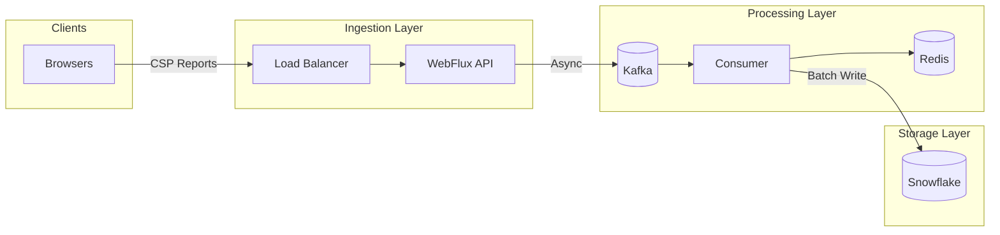
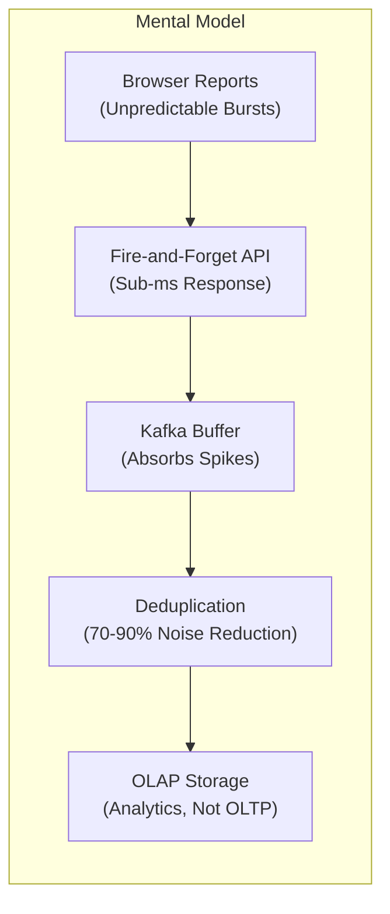
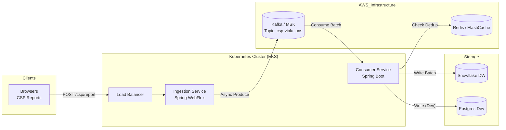

# CSP Violation Reporting Pipeline at Scale

CSP-Sentinel is a centralized system designed to collect, process, and analyze Content Security Policy (CSP) violation reports from web browsers at scale. The system handles baseline 50k RPS with burst capacity to 500k+ RPS while maintaining sub-millisecond response times and near-zero impact on client browsers.

<figure>



<figcaption>CSP-Sentinel high-level architecture: browsers send violation reports through a non-blocking API to Kafka, where consumers deduplicate and batch-write to Snowflake</figcaption>

</figure>

## Abstract

CSP violation reporting presents a specific scaling challenge: browsers generate reports unpredictably, often in bursts during incidents, and the data is high-volume but low-value per individual event. The core insight is to treat reports as a **streaming analytics problem**, not a transactional one.

<figure>



<figcaption>Mental model: CSP reports flow through a pipeline optimized for eventual consistency and noise reduction, not transactional guarantees</figcaption>

</figure>

**Key design trade-offs:**

| Decision | Optimizes For | Sacrifices |
| :------- | :------------ | :--------- |
| `acks=1` (leader only) | Latency (~1ms vs ~10ms) | Durability (rare message loss on leader failure) |
| 10-minute dedup window | Storage cost, query noise | Precision (identical violations merged) |
| 24-hour Kafka retention | Cost | Replay capability beyond 24h |
| Stateless API | Horizontal scaling | Session-based rate limiting |

**When this design fits:** High-volume telemetry where individual events are expendable, eventual consistency is acceptable, and the goal is aggregate insights rather than per-event guarantees.

**When it doesn't:** Audit logs requiring strict durability, real-time alerting on individual violations, or compliance scenarios requiring guaranteed delivery.

## 1. Project Goals & Background

Modern browsers send CSP violation reports as JSON payloads when a webpage violates defined security policies. Aggregating these reports allows our security and development teams to:

- Identify misconfigurations and false positives.
- Detect malicious activity (XSS attempts).
- Monitor policy rollout health across all properties.

**Key Objectives:**

- **High Throughput:** Handle massive bursts of report traffic during incidents.
- **Low Latency:** Return `204 No Content` immediately to clients.
- **Noise Reduction:** Deduplicate repetitive reports from the same user/browser.
- **Actionable Insights:** Provide dashboards and alerts for developers.
- **Future-Proof:** Built on the latest LTS technologies available for Q1 2026.

## 2. Requirements

### 2.1 Functional Requirements

- **Ingestion API:** Expose a `POST /csp/report` endpoint accepting both CSP report formats:
  - **Legacy format** (`report-uri`): `Content-Type: application/csp-report` with `csp-report` wrapper object
  - **Modern format** (`report-to` + Reporting API): `Content-Type: application/reports+json` with array of report objects

> **Browser support note:** Firefox does not support `report-to` as of early 2026. Safari has partial support. Chromium-based browsers fully support both. Accept both formats to maximize coverage.

- **Immediate Response:** Always respond with HTTP 204 without waiting for processing.
- **Deduplication:** Suppress identical violations from the same browser within a short window (e.g., 10 minutes) using Redis.
- **Storage:** Store detailed violation records (timestamp, directive, blocked URI, etc.) for querying.
- **Analytics:** Support querying by directive, blocked host, and full-text search on resource URLs.
- **Visualization:** Integration with Grafana for trends, top violators, and alerting.
- **Retention:** Retain production data for 90 days.

### 2.2 Non-Functional Requirements

- **Scalability:** Horizontal scaling from 50k RPS to 1M+ RPS.
- **Reliability:** "Fire-and-forget" ingestion with durable buffering in Kafka. At-least-once delivery.
- **Flexibility:** Plug-and-play storage layer (Snowflake for Prod, Postgres for Dev).
- **Security:** Stateless API, standardized TLS, secure access to dashboards.

## 3. Technology Stack (Q1 2026 Strategy)

We have selected the latest Long-Term Support (LTS) and stable versions projected for the build timeframe.

| Component           | Choice         | Version (Target)      | Justification                                                                                                                                                                                 |
| :------------------ | :------------- | :-------------------- | :-------------------------------------------------------------------------------------------------------------------------------------------------------------------------------------------- |
| **Language**        | Java           | **25 LTS**            | Latest LTS as of late 2025. Performance & feature set.                                                                                                                                        |
| **Framework**       | Spring Boot    | **4.0** (Framework 7) | Built for Java 25. Native support for Virtual Threads & Reactive.                                                                                                                             |
| **API Style**       | Spring WebFlux | --                    | Non-blocking I/O essential for high-concurrency ingestion.                                                                                                                                    |
| **Messaging**       | Apache Kafka   | **3.8+** (AWS MSK)    | Durable buffer, high throughput, decoupling.                                                                                                                                                  |
| **Caching**         | Valkey         | **8.x** (ElastiCache) | Redis-compatible, low-latency deduplication ([AWS migrated to Valkey](https://docs.aws.amazon.com/AmazonElastiCache/latest/dg/supported-engine-versions.html) after Redis licensing changes). |
| **Primary Storage** | Snowflake      | SaaS                  | Cloud-native OLAP, separates storage/compute, handles massive datasets.                                                                                                                       |
| **Dev Storage**     | PostgreSQL     | **18.x**              | Easy local setup, sufficient for dev/test volumes.                                                                                                                                            |
| **Visualization**   | Grafana        | **12.x**              | Rich ecosystem, native Snowflake plugin.                                                                                                                                                      |

## 4. System Architecture

### 4.1 High-Level Architecture (HLD)

The system follows a Streaming Data Pipeline pattern.



### 4.2 Component Breakdown

#### 4.2.1 Ingestion Service (API)

- **Role:** Entry point for all reports.
- **Implementation:** Spring WebFlux (Netty).
- **Behavior:**
  - Validates JSON format.
  - Asynchronously sends to Kafka (`csp-violations`).
  - Returns `204` immediately.
  - **No** DB interaction to ensure sub-millisecond response time.

#### 4.2.2 Kafka Layer

- **Topic:** `csp-violations`.
- **Partitions:** Scaled per throughput (e.g., 48 partitions for 50k RPS).
- **Role:** Buffers spikes. If DB is slow, Kafka holds data, preventing data loss or API latency.

#### 4.2.3 Consumer Service

- **Role:** Processor.
- **Implementation:** Spring Boot (Reactor Kafka).
- **Logic:**
  1.  Polls batch from Kafka.
  2.  Computes Dedup Hash (e.g., `SHA1(document + directive + blocked_uri + ua)`).
  3.  Checks Redis: If exists, skip. If new, set in Redis (EXPIRE 10m).
  4.  Buffers unique records.
  5.  Batch writes to Storage (Snowflake/Postgres).
  6.  Commits Kafka offsets.

#### 4.2.4 Data Storage

- **Production (Snowflake):** Optimized for OLAP query patterns. Table clustered by Date/Directive.
- **Development (Postgres):** Standard relational table with GIN indexes for text search simulation.

## 5. Data Model

### 5.1 CSP Report Formats (Input)

The ingestion API must parse two distinct JSON formats. Per [W3C CSP3](https://www.w3.org/TR/CSP3/), the `report-uri` directive is deprecated but remains widely used due to Firefox's lack of `report-to` support.

**Legacy format** (`Content-Type: application/csp-report`):

```json title="legacy-csp-report.json" collapse={1, 10-12}
{
  "csp-report": {
    "document-uri": "https://example.com/page",
    "blocked-uri": "https://evil.com/script.js",
    "violated-directive": "script-src 'self'",
    "effective-directive": "script-src",
    "original-policy": "script-src 'self'; report-uri /csp",
    "disposition": "enforce",
    "status-code": 200
  }
}
```

**Modern format** (`Content-Type: application/reports+json`):

```json title="modern-reporting-api.json" collapse={1, 15-18}
[
  {
    "type": "csp-violation",
    "age": 53531,
    "url": "https://example.com/page",
    "user_agent": "Mozilla/5.0 ...",
    "body": {
      "documentURL": "https://example.com/page",
      "blockedURL": "https://evil.com/script.js",
      "effectiveDirective": "script-src-elem",
      "originalPolicy": "script-src 'self'; report-to csp-endpoint",
      "disposition": "enforce",
      "statusCode": 200,
      "sample": "console.log(\"ma"
    }
  }
]
```

**Key differences:**

| Aspect | Legacy (`report-uri`) | Modern (Reporting API) |
| :----- | :-------------------- | :--------------------- |
| Wrapper | `csp-report` object | Array of report objects |
| Field naming | `kebab-case` | `camelCase` |
| Directive field | `violated-directive` | `effectiveDirective` |
| Code sample | Not included | `sample` (first 40 chars, requires `'report-sample'`) |
| Batching | Single report per POST | May batch multiple reports |

The consumer normalizes both formats to a unified internal schema before deduplication.

### 5.2 Internal Schema (Normalized)

| Field                | Type      | Description                          |
| :------------------- | :-------- | :----------------------------------- |
| `EVENT_ID`           | UUID      | Unique Event ID                      |
| `EVENT_TS`           | TIMESTAMP | Time of violation                    |
| `DOCUMENT_URI`       | STRING    | Page where violation occurred        |
| `VIOLATED_DIRECTIVE` | STRING    | e.g., `script-src`                   |
| `BLOCKED_URI`        | STRING    | The resource blocked                 |
| `BLOCKED_HOST`       | STRING    | Domain of blocked resource (derived) |
| `USER_AGENT`         | STRING    | Browser UA                           |
| `ORIGINAL_POLICY`    | STRING    | Full CSP string                      |
| `VIOLATION_HASH`     | STRING    | Deduplication key                    |

### 5.3 Snowflake DDL (Production)

```sql title="snowflake/csp_violations.sql" collapse={4-8}
CREATE TABLE CSP_VIOLATIONS (
  EVENT_ID            STRING DEFAULT UUID_STRING(),
  EVENT_TS            TIMESTAMP_LTZ NOT NULL,
  EVENT_DATE          DATE AS (CAST(EVENT_TS AS DATE)) STORED,
  DOCUMENT_URI        STRING,
  VIOLATED_DIRECTIVE  STRING,
  BLOCKED_URI         STRING,
  BLOCKED_HOST        STRING,
  USER_AGENT          STRING,
  -- ... other fields
  VIOLATION_HASH      STRING
)
CLUSTER BY (EVENT_DATE, VIOLATED_DIRECTIVE);
```

### 5.4 Postgres DDL (Development)

```sql title="postgres/csp_violations.sql" collapse={2-6}
CREATE TABLE csp_violations (
  event_id UUID PRIMARY KEY,
  event_ts TIMESTAMPTZ NOT NULL,
  -- ... same fields as Snowflake
  blocked_uri TEXT
);

-- Trigram index for text search on blocked URIs
CREATE INDEX idx_blocked_uri_trgm ON csp_violations USING gin (blocked_uri gin_trgm_ops);
```

## 6. Scaling & Capacity Planning

The system is designed to scale horizontally. We use specific formulas to determine the required infrastructure based on our target throughput.

### 6.1 Sizing Formulas

We use the following [industry-standard formulas](https://www.confluent.io/blog/how-choose-number-topics-partitions-kafka-cluster/) to estimate resources for strict SLAs.

#### 6.1.1 Kafka Partitions

To avoid bottlenecks, partition count ($P$) is calculated based on the slower of the producer ($T_p$) or consumer ($T_c$) throughput per partition.

$$
P = \max \left( \frac{T_{target}}{T_p}, \frac{T_{target}}{T_c} \right) \times \text{GrowthFactor}
$$

- **Target ($T_{target}$):** 50 MB/s (50k RPS $\times$ 1KB avg message size).
- **Producer Limit ($T_p$):** ~10 MB/s (standard Kafka producer on commodity hardware).
- **Consumer Limit ($T_c$):** ~5 MB/s (assuming deserialization + dedup logic).
- **Growth Factor:** 1.5x - 2x.

**Calculation for 50k RPS:**
$$ P = \max(5, 10) \times 1.5 = 15 \text{ partitions (min)} $$
_Recommendation:_ We will provision **48 partitions** to allow for massive burst capacity (up to ~240k RPS without resizing) and to match the parallelism of our consumer pod fleet.

#### 6.1.2 Consumer Pods

$$
N_{pods} = \frac{RPS_{target}}{RPS_{per\_pod}} \times \text{Headroom}
$$

- **50k RPS Target:** $\lceil \frac{50,000}{5,000} \times 1.3 \rceil = 13$ Pods.

### 6.2 Throughput Tiers

| Tier           | RPS  | Throughput | API Pods | Consumer Pods | Kafka Partitions |
| :------------- | :--- | :--------- | :------- | :------------ | :--------------- |
| **Baseline**   | 50k  | ~50 MB/s   | 4        | 12-14         | 48               |
| **Growth**     | 100k | ~100 MB/s  | 8        | 24-28         | 96               |
| **High Scale** | 500k | ~500 MB/s  | 36       | 130+          | 512              |

### 6.3 Scaling Strategies

- **API:** CPU-bound (JSON parsing) and Network I/O bound. Scale HPA based on CPU usage (Target 60%).
- **Consumers:** Bound by DB write latency and processing depth. Scale HPA based on **Kafka Consumer Lag**.
- **Storage:**
  - **Continuous Loading:** Use **Snowpipe** for steady streams.
  - **Batch Loading:** Use `COPY INTO` with file sizes between **100MB - 250MB** (compressed) for optimal warehouse utilization.

## 7. Observability

- **Dashboards (Grafana):**
  - **Overview:** Total violations/min, Breakdown by Directive.
  - **Top Offenders:** Top Blocked Hosts, Top Violating Pages.
  - **System Health:** Kafka Lag, API 5xx rates, End-to-end latency.
- **Alerting:**
  - **Spike Alert:** > 50% increase in violations over 5m moving average.
  - **Lag Alert:** Consumer lag > 1 million messages (indication of stalled consumers).

## 8. Infrastructure Optimization & Tuning

### 8.1 Kafka Configuration (AWS MSK)

To ensure durability while maintaining high throughput:

- **Replication Factor:** 3 (Survives 2 broker failures).
- **Min In-Sync Replicas (`min.insync.replicas`):** 2 (Ensures at least 2 writes before ack).
- **Producer Acks:** `acks=1` (Leader only) for lowest latency (Fire-and-forget), or `acks=all` for strict durability. _Recommended: `acks=1` for CSP reports to minimize browser impact._
- **Compression:** `lz4` or `zstd` (Low CPU overhead, high compression ratio for JSON).
- **Log Retention:** 24 Hours (Cost optimization; strictly a buffer).

### 8.2 Spring Boot WebFlux Tuning

Optimizing the Netty engine for 50k+ RPS:

- **Memory Allocation:** Enable Pooled Direct ByteBufs to reduce GC pressure.
  - `-Dio.netty.leakDetection.level=DISABLED` (Production only)
  - `-Dio.netty.allocator.type=pooled`
- **Threads:** limiting the Event Loop threads to `CPU Core Count` prevents context switching.
- **Garbage Collection:** Use **[Generational ZGC](https://openjdk.org/jeps/439)** which is optimized for sub-millisecond pauses on large heaps (available in Java 21+, production-ready).
  - `-XX:+UseZGC -XX:+ZGenerational`

### 8.3 Snowflake Ingestion Optimization

- **File Sizing:** [Snowflake micro-partitions](https://docs.snowflake.com/en/user-guide/data-load-considerations-prepare) are most efficient when loaded from files sized **100MB - 250MB** (compressed).
- **Batch Buffering:** Consumers should buffer writes to S3 until this size is reached OR a time window (e.g., 60s) passes.
- **Snowpipe vs COPY:**
  - For < 50k RPS: Direct Batch Inserts (JDBC) or small batch `COPY`.
  - For > 50k RPS: Write to S3 -> Trigger **[Snowpipe](https://docs.snowflake.com/en/user-guide/data-load-snowpipe-intro)**. This decouples consumer logic from warehouse loading latency.

## 9. Edge Cases and Failure Modes

### 9.1 Report Format Variations

Browsers implement CSP reporting with subtle differences. The pipeline must handle:

| Variation | Source | Handling |
| :-------- | :----- | :------- |
| Missing `blocked-uri` | Some inline violations | Default to `"inline"` |
| Truncated `sample` | Reporting API limit | Accept up to 40 chars per spec |
| Extension violations | `blocked-uri` starts with `moz-extension://`, `chrome-extension://` | Filter out (not actionable) |
| Empty `referrer` | Privacy settings | Normalize to `null` |
| Query strings in URIs | Standard behavior | Strip for deduplication, preserve for storage |

### 9.2 Failure Scenarios

**Kafka unavailable:** The WebFlux API returns `204` regardless—reports are dropped silently. This is acceptable for CSP telemetry but would need circuit breakers and local buffering for stricter guarantees.

**Redis unavailable:** Consumer continues without deduplication. All reports flow to storage, increasing costs but preserving data. Alert on Redis connection failures.

**Snowflake ingestion lag:** Kafka acts as a buffer (24-hour retention). If lag exceeds retention, oldest messages are lost. Monitor consumer lag as primary SLI.

**Dedup hash collisions:** SHA-1 collisions are theoretically possible but practically irrelevant at this scale (~10^-18 probability). If strict deduplication is required, use SHA-256.

### 9.3 Known Limitations

- **No per-user rate limiting:** Stateless API cannot throttle abusive clients without external infrastructure (e.g., WAF)
- **No replay capability:** Once Kafka retention expires, data cannot be reprocessed from source
- **Browser timing variability:** Reporting API does not guarantee batch delivery—expect single-report POSTs in many cases
- **Cross-origin restrictions:** Report endpoints must be HTTPS and cannot redirect to different origins

## Conclusion

CSP-Sentinel balances throughput, cost, and operational simplicity through three key design decisions:

1. **Fire-and-forget ingestion** - WebFlux returns `204` without database interaction, ensuring sub-millisecond response times regardless of downstream load
2. **Kafka as a buffer** - Decouples ingestion from processing, allowing the system to absorb 10x traffic spikes without backpressure reaching browsers
3. **Redis deduplication** - Reduces storage costs and noise by 70-90% in typical scenarios where browsers retry identical violations

The technology choices (Java 25 with ZGC, Valkey for Redis compatibility, Snowflake for OLAP) prioritize operational simplicity over marginal performance gains. The system handles 50k-500k+ RPS with infrastructure that a single engineer can maintain.

The design explicitly trades durability for latency—acceptable for telemetry where aggregate trends matter more than individual events. For audit-grade reporting, add `acks=all`, increase Kafka retention, and implement client-side retry with idempotency keys.

## Appendix

### Prerequisites

- Familiarity with streaming data pipelines (Kafka producer/consumer model)
- Understanding of CSP headers and browser security policies
- Basic knowledge of OLAP vs OLTP workloads
- Experience with Kubernetes horizontal pod autoscaling

### Terminology

| Term | Definition |
| :--- | :--------- |
| **CSP** | Content Security Policy - browser security mechanism that restricts resource loading |
| **Fire-and-forget** | Pattern where the sender does not wait for acknowledgment |
| **HPA** | Horizontal Pod Autoscaler - Kubernetes component for scaling based on metrics |
| **OLAP** | Online Analytical Processing - optimized for aggregate queries over large datasets |
| **Snowpipe** | Snowflake's continuous data ingestion service |
| **ZGC** | Z Garbage Collector - low-latency GC for JVM with sub-millisecond pauses |

### Summary

- CSP violation reports are high-volume, low-value telemetry best handled as a streaming analytics problem
- Fire-and-forget ingestion (`204` immediate response) isolates browser impact from backend performance
- Kafka buffers absorb traffic spikes and decouple ingestion from processing
- Redis-based deduplication reduces storage by 70-90% using hash keys with TTL
- Snowflake clustering by date/directive optimizes the dominant query pattern
- Scale consumers on Kafka lag, not CPU—processing depth is the bottleneck

### References

#### Specifications

- [W3C Content Security Policy Level 3](https://www.w3.org/TR/CSP3/) - Authoritative CSP specification; `report-uri` deprecated in favor of `report-to`
- [W3C Reporting API](https://www.w3.org/TR/reporting-1/) - Modern reporting infrastructure used by `report-to` directive
- [MDN: CSPViolationReportBody](https://developer.mozilla.org/en-US/docs/Web/API/CSPViolationReportBody) - Report body schema for modern Reporting API

#### CSP Implementation

- [MDN: Content-Security-Policy report-uri](https://developer.mozilla.org/en-US/docs/Web/HTTP/Reference/Headers/Content-Security-Policy/report-uri) - Legacy reporting format (`application/csp-report`)
- [MDN: Content-Security-Policy report-to](https://developer.mozilla.org/en-US/docs/Web/HTTP/Reference/Headers/Content-Security-Policy/report-to) - Modern Reporting API integration
- [MDN: Reporting-Endpoints header](https://developer.mozilla.org/en-US/docs/Web/HTTP/Reference/Headers/Reporting-Endpoints) - Endpoint configuration for modern reporting

#### Technology Stack

- [Oracle Java 25 LTS Announcement](https://www.oracle.com/news/announcement/oracle-releases-java-25-2025-09-16/) - Released September 16, 2025
- [Spring Boot 4.0.0 Release](https://spring.io/blog/2025/11/20/spring-boot-4-0-0-available-now/) - Released November 20, 2025
- [Spring Framework 7.0 GA](https://spring.io/blog/2025/11/13/spring-framework-7-0-general-availability/) - Released November 13, 2025
- [AWS MSK Kafka 3.8 Support](https://aws.amazon.com/about-aws/whats-new/2025/02/amazon-msk-apache-kafka-version-3-8/) - February 2025
- [AWS ElastiCache Supported Versions](https://docs.aws.amazon.com/AmazonElastiCache/latest/dg/supported-engine-versions.html) - Valkey 8.x documentation
- [PostgreSQL 18 Release](https://www.postgresql.org/about/news/postgresql-18-released-3142/) - Released September 25, 2025

#### Performance & Scaling

- [Confluent: How to Choose Kafka Partition Count](https://www.confluent.io/blog/how-choose-number-topics-partitions-kafka-cluster/) - Partition sizing formula: `max(t/p, t/c)`
- [Snowflake: Preparing Data Files](https://docs.snowflake.com/en/user-guide/data-load-considerations-prepare) - 100-250MB compressed file sizing recommendation
- [Snowflake: Snowpipe Overview](https://docs.snowflake.com/en/user-guide/data-load-snowpipe-intro) - Continuous data ingestion best practices
- [OpenJDK: Generational ZGC (JEP 439)](https://openjdk.org/jeps/439) - Sub-millisecond GC pauses, available in JDK 21+
