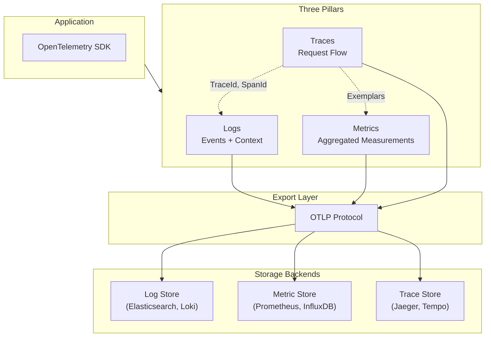

# Logging, Metrics, and Tracing Fundamentals

Observability in distributed systems rests on three complementary signals: logs capture discrete events with full context, metrics quantify system behavior over time, and traces reconstruct request paths across service boundaries. Each signal answers different questions, and choosing wrong defaults for cardinality, sampling, or retention can render your observability pipeline either useless or prohibitively expensive. This article covers the design reasoning behind each signal type, OpenTelemetry's unified data model, and the operational trade-offs that determine whether your system remains debuggable at scale.

<figure>



<figcaption>OpenTelemetry's unified instrumentation model: three signals exported via OTLP, with trace context linking them together.</figcaption>
</figure>

## Abstract

Observability signals differ fundamentally in what they optimize:

- **Logs** preserve full event context at the cost of storage; use them for debugging specific incidents
- **Metrics** sacrifice detail for efficient aggregation; use them for alerting and dashboards
- **Traces** reconstruct causality across services; use them to understand distributed request flow

The critical design decisions:

1. **Cardinality** determines cost: metrics with unbounded label values (user IDs, request IDs) will crash your time-series database
2. **Sampling** trades completeness for cost: head sampling is predictable but blind to errors; tail sampling captures interesting traces but requires buffering
3. **Context propagation** (W3C Trace Context) links all three signals—without consistent TraceId propagation, correlation is manual and error-prone

OpenTelemetry (OTel) provides the current standard for instrumentation, unifying all signals under a single SDK with vendor-neutral export via OTLP (OpenTelemetry Protocol).

## Observability Signal Taxonomy

The three observability signals answer fundamentally different questions:

| Signal  | Question Answered                | Cardinality | Storage Cost | Query Pattern            |
| ------- | -------------------------------- | ----------- | ------------ | ------------------------ |
| Logs    | "What happened in this request?" | Unbounded   | Highest      | Full-text search, filter |
| Metrics | "How is the system behaving?"    | Bounded     | Lowest       | Aggregation, rate        |
| Traces  | "How did this request flow?"     | Sampled     | Medium       | Trace ID lookup, DAG     |

### Why Three Signals?

Each signal represents a different trade-off between detail and scalability:

**Logs** preserve everything—the full request body, stack traces, variable values—but this completeness makes them expensive to store and slow to query. You cannot aggregate logs efficiently; searching requires scanning text.

**Metrics** discard detail to enable aggregation. A counter tracking `http_requests_total` can be summed across instances, compared over time windows, and stored in constant space per label combination. But you cannot reconstruct individual requests from metrics.

**Traces** bridge the gap by preserving request structure (which services were called, in what order, how long each took) while sampling to control cost. A trace lets you understand causality—why a request was slow—but sampling means you might miss the specific request causing a user complaint.

### OpenTelemetry Data Model

As of OpenTelemetry 1.x (stable since 2023), all three signals share common context:

**Traces** consist of Spans organized into a directed acyclic graph (DAG). Each Span contains:

- `TraceId` (16 bytes): Unique identifier for the entire trace
- `SpanId` (8 bytes): Unique identifier for this span
- `ParentSpanId`: Links to parent span (empty for root)
- `Name`: Operation name (e.g., `HTTP GET /users`)
- `StartTime`, `EndTime`: Microsecond timestamps
- `Status`: OK, Error, or Unset
- `Attributes`: Key-value metadata (bounded cardinality)
- `Events`: Timestamped annotations within the span
- `Links`: References to related spans (e.g., batch job linking to triggering requests)

**Metrics** use a temporal data model with three primary types:

- **Counter**: Monotonically increasing value (requests, bytes, errors)
- **Gauge**: Point-in-time measurement (CPU%, queue depth, active connections)
- **Histogram**: Distribution across buckets (latency percentiles)

**Logs** in OpenTelemetry include:

- `Timestamp`: When the event occurred
- `SeverityNumber`/`SeverityText`: Log level
- `Body`: The log message (string or structured)
- `Attributes`: Additional context
- `TraceId`, `SpanId`: Links to active trace (automatic correlation)

The critical design choice: logs automatically inherit `TraceId` and `SpanId` from the active span context. This enables trace-log correlation without manual instrumentation.

## Structured Logging Practices

Structured logging replaces free-form text with machine-parseable records, typically JSON. The design reasoning: logs must be queryable at scale, and structured formats enable indexing, filtering, and aggregation that text logs cannot support.

### Log Schema Design

A well-designed log schema includes:

```json collapse={1-2, 14-15}
// Example structured log entry
{
  "timestamp": "2024-01-15T10:23:45.123Z",
  "level": "ERROR",
  "service": "payment-service",
  "trace_id": "abc123def456",
  "span_id": "789xyz",
  "message": "Payment processing failed",
  "error.type": "TimeoutException",
  "error.message": "Gateway timeout after 30s",
  "http.method": "POST",
  "http.url": "/api/v1/payments",
  "payment.amount": 99.99,
  "payment.currency": "USD"
}
```

**Schema principles:**

1. **Flat structure**: Nested JSON (more than 2-3 levels) degrades query performance in most log backends
2. **Consistent naming**: Use OpenTelemetry Semantic Conventions (`http.method`, `error.type`) for cross-service correlation
3. **Bounded values**: Fields like `http.status_code` have finite cardinality; fields like `user_id` do not

### Log Levels and Semantics

Log levels communicate actionability, not importance:

| Level   | Semantics                                             | Production Use                   |
| ------- | ----------------------------------------------------- | -------------------------------- |
| `ERROR` | Actionable failure requiring investigation            | Alert, page on-call              |
| `WARN`  | Degraded condition, retry succeeded, missing config   | Monitor, investigate if frequent |
| `INFO`  | Business events, state transitions, request lifecycle | Normal operations                |
| `DEBUG` | Diagnostic detail, variable values                    | Disabled in production           |
| `TRACE` | Extremely verbose diagnostics                         | Never in production              |

**Design reasoning**: If every `ERROR` log does not warrant investigation, your log levels are miscalibrated. Teams that log expected conditions as `ERROR` (e.g., user validation failures) train themselves to ignore errors.

### Cardinality in Logs

Log cardinality matters less than metric cardinality for storage—logs are already unbounded by nature—but it critically affects query performance and indexing costs.

**High-cardinality fields** (user IDs, request IDs, session tokens):

- Store but do not index by default
- Use full-text search for ad-hoc queries
- Index only if frequently filtered

**Indexing strategy**:

```
Index: timestamp, level, service, trace_id, http.status_code
No index: user_id, request_body, stack_trace
```

### Performance Implications

Logging overhead in production applications:

- **Synchronous logging**: 0.5-2ms per entry (disk I/O bound)
- **Asynchronous buffered logging**: 0.01-0.1ms per entry (memory buffer, batch flush)
- **Network logging**: 0.1-0.5ms per entry (depends on batching)

For high-throughput services (>10K requests/second), synchronous logging is not viable. Use async logging with:

- Ring buffer for backpressure (drop oldest on overflow)
- Batch size of 100-1000 entries
- Flush interval of 100-500ms

## Metrics Design and Aggregation

Metrics enable the aggregation that logs cannot support. The fundamental constraint: metrics work because they have bounded cardinality. Each unique label combination creates a new time series, and time-series databases (TSDBs) store each series independently.

### Metric Types

**Counter**: Cumulative value that only increases (or resets to zero on restart).

```
http_requests_total{method="GET", status="200"} 150432
http_requests_total{method="GET", status="500"} 42
http_requests_total{method="POST", status="201"} 8923
```

Query pattern: `rate(http_requests_total[5m])` gives requests per second.

**Gauge**: Point-in-time measurement that can increase or decrease.

```
active_connections{pool="primary"} 47
cpu_usage_percent{core="0"} 72.3
queue_depth{queue="orders"} 128
```

Query pattern: instant value or average over time window.

**Histogram**: Distribution of observations across predefined buckets.

```
http_request_duration_seconds_bucket{le="0.1"} 24054
http_request_duration_seconds_bucket{le="0.25"} 32847
http_request_duration_seconds_bucket{le="0.5"} 34012
http_request_duration_seconds_bucket{le="1.0"} 34500
http_request_duration_seconds_bucket{le="+Inf"} 34567
http_request_duration_seconds_count 34567
http_request_duration_seconds_sum 8234.56
```

Query pattern: `histogram_quantile(0.95, rate(http_request_duration_seconds_bucket[5m]))` gives p95 latency.

**Design reasoning for histograms**: Buckets are cumulative (`le` = "less than or equal") because cumulative buckets enable accurate percentile calculation during aggregation. Non-cumulative buckets lose information when summed across instances.

### Bucket Configuration

Histogram bucket boundaries should align with your SLOs (Service Level Objectives):

```
# Latency histogram for API with 200ms p99 SLO
buckets: [0.01, 0.025, 0.05, 0.1, 0.2, 0.5, 1.0, 2.5, 5.0, 10.0]
         ^^^^^          ^^^^^^^^^^^^  ^^^^^^^^^^^^^^^
         fine-grained   SLO region    tail latency
```

**Trade-off**: More buckets = better resolution but more time series (one per bucket per label combination). For a metric with 5 labels averaging 10 values each: `5 labels × 10 values × 15 buckets = 7,500 time series` per metric.

### Cardinality Explosion

The most common operational failure in metrics systems: unbounded label values crash your TSDB.

**Example of cardinality explosion**:

```
# DANGEROUS: user_id has unbounded cardinality
http_requests_total{user_id="u123", endpoint="/api/orders"}

# With 1M users and 50 endpoints:
# 1,000,000 × 50 = 50,000,000 time series
```

Prometheus holds time series in memory. At ~3KB per series, 50M series requires 150GB RAM—exceeding most deployments.

**Symptoms of cardinality problems**:

- Prometheus memory usage grows unboundedly
- Query latency increases from seconds to minutes
- Scrape targets timeout
- Alerting rules fail to evaluate

**Mitigation strategies**:

1. **Never use IDs as labels**: User IDs, request IDs, transaction IDs belong in logs and traces, not metrics
2. **Pre-aggregate in application**: Count users per tier (`premium`, `standard`) rather than per user
3. **Cardinality budgets**: Set limits per metric (e.g., max 1000 series per metric)
4. **Metric relabeling**: Drop high-cardinality labels at scrape time

### RED and USE Methods

**RED Method** (for services): Request-oriented metrics aligned with user experience.

- **Rate**: Requests per second (`rate(http_requests_total[5m])`)
- **Errors**: Error rate (`rate(http_requests_total{status=~"5.."}[5m]) / rate(http_requests_total[5m])`)
- **Duration**: Latency distribution (`histogram_quantile(0.99, rate(http_request_duration_seconds_bucket[5m]))`)

**USE Method** (for resources): Resource-oriented metrics for infrastructure.

- **Utilization**: Percent time resource is busy (`avg(cpu_usage_percent)`)
- **Saturation**: Queue depth, waiting work (`avg(runnable_tasks_count)`)
- **Errors**: Hardware errors, I/O failures (`rate(disk_errors_total[5m])`)

**Design reasoning**: RED tells you when users are impacted; USE tells you why. A latency spike (RED) might be caused by CPU saturation (USE). Use both methods together.

### Google's Four Golden Signals

The SRE book's monitoring framework:

1. **Latency**: Time to service a request (distinguish success vs error latency)
2. **Traffic**: Demand on the system (requests/sec, transactions/sec)
3. **Errors**: Rate of failed requests (explicit 5xx, implicit timeouts)
4. **Saturation**: How "full" the system is (CPU, memory, queue depth)

Golden Signals overlap with RED+USE but emphasize saturation as a leading indicator. A system at 95% CPU is not yet failing (RED looks fine) but cannot absorb traffic spikes.

## Distributed Tracing and Context

Tracing reconstructs request flow across service boundaries. The core abstraction: a **Span** represents a unit of work with defined start/end times, and **Traces** are directed acyclic graphs of spans sharing a `TraceId`.

### Span Anatomy

```
Trace: abc123
├── Span: 001 (root) "HTTP GET /checkout" [0ms - 250ms]
│   ├── Span: 002 "Query user" [10ms - 30ms]
│   ├── Span: 003 "HTTP POST /payment-service" [35ms - 200ms]
│   │   └── Span: 004 "Process payment" [40ms - 195ms]
│   │       ├── Span: 005 "Validate card" [45ms - 60ms]
│   │       └── Span: 006 "Charge gateway" [65ms - 190ms]
│   └── Span: 007 "Update inventory" [205ms - 245ms]
```

Each span includes:

- **Operation name**: What work this span represents
- **Timing**: Start and end timestamps (microsecond precision)
- **Attributes**: Key-value metadata (e.g., `http.status_code: 200`)
- **Events**: Timestamped annotations within the span (e.g., "Retry attempt 2")
- **Status**: Success, error, or unset

### Context Propagation

Trace context must cross process boundaries (HTTP calls, message queues, RPC). The W3C Trace Context standard defines two headers:

**traceparent**: `00-{trace-id}-{span-id}-{flags}`

```
traceparent: 00-0af7651916cd43dd8448eb211c80319c-b7ad6b7169203331-01
             ^^ ^^^^^^^^^^^^^^^^^^^^^^^^^^^^^^^^ ^^^^^^^^^^^^^^^^ ^^
             |  trace-id (16 bytes)               span-id (8 bytes) flags
             version                                                (01 = sampled)
```

**tracestate**: Vendor-specific extensions

```
tracestate: congo=t61rcWkgMzE,rojo=00f067aa0ba902b7
```

**Design reasoning**: W3C Trace Context separates trace identity (`traceparent`) from vendor extensions (`tracestate`). This enables multi-vendor environments—your Datadog instrumentation can coexist with New Relic.

> **Prior to W3C Trace Context (standardized 2020)**: Multiple incompatible formats existed. Zipkin used B3 headers (`X-B3-TraceId`, `X-B3-SpanId`), Jaeger used `uber-trace-id`, and AWS X-Ray used `X-Amzn-Trace-Id`. Cross-vendor correlation required custom bridging.

### Baggage vs Span Attributes

**Span Attributes** attach to a single span and are not propagated:

```typescript
span.setAttribute("user.tier", "premium")
span.setAttribute("feature.flag.checkout_v2", true)
```

**Baggage** propagates across service boundaries:

```typescript
// Service A: Set baggage
baggage.setEntry("user.tier", "premium")

// Service B: Read baggage (automatically propagated)
const tier = baggage.getEntry("user.tier")
// Must explicitly add to span if needed for querying
span.setAttribute("user.tier", tier)
```

**Design reasoning**: Baggage is a transport mechanism, not storage. It travels with requests but does not automatically appear in trace backends. You must explicitly copy baggage entries to span attributes if you want them queryable.

**Use cases for baggage**:

- User ID for downstream services to log/trace
- Feature flags affecting request handling
- Deployment version for canary analysis
- Tenant ID in multi-tenant systems

**Warning**: Baggage is sent in HTTP headers. Keep it small (<8KB total) and never include sensitive data.

## Sampling and Cost Control

At scale, 100% trace collection is economically infeasible. A service handling 100K requests/second with 5 spans per request generates 43 billion spans per day. At typical trace storage costs ($1-5 per million spans), that's $43K-$215K per day.

Sampling reduces cost but trades off completeness.

### Head-Based Sampling

Decision made at trace start, before any spans are generated:

```typescript
// Probabilistic head sampler: 10% of traces
const sampler = new TraceIdRatioBasedSampler(0.1)

// All downstream services respect the sampling decision
// via the sampled flag in traceparent header
```

**Characteristics**:

- Low overhead: decision before span generation
- Predictable cost: fixed percentage of traces
- Blind to content: cannot sample based on errors or latency (unknown at decision time)
- Efficient: non-sampled requests generate no spans

**When to use**: High-volume systems where cost predictability matters more than capturing every error.

### Tail-Based Sampling

Decision made after trace completion, based on trace content:

```typescript
// Tail sampling policy: keep errors and slow traces
const policies = [
  { name: "errors", type: "status_code", status_codes: ["ERROR"] },
  { name: "slow", type: "latency", threshold_ms: 1000 },
  { name: "baseline", type: "probabilistic", sampling_percentage: 5 },
]
```

**Characteristics**:

- Higher overhead: all spans buffered until trace completes
- Variable cost: depends on how many traces match policies
- Content-aware: can sample based on errors, latency, attributes
- Complex infrastructure: requires centralized collector with buffering

**When to use**: When capturing all errors is more important than cost predictability.

### Hybrid Sampling Strategy

Production systems typically combine both:

1. **Head sampling at 10%**: Reduces span generation by 90%
2. **Tail sampling on remaining 10%**: Keeps errors, slow traces, and 50% random sample

Effective rate: ~5% of normal traces, ~10% of errors/slow traces.

```
100% requests
    │
    ▼ Head sampling (10%)
   10% span generation
    │
    ▼ Tail sampling
   ~5% normal traces stored
  ~10% error traces stored (boosted)
```

### Sampling and Correlation

Sampling breaks trace-log-metric correlation when inconsistent:

**Problem**: If traces are sampled at 10% but logs are 100%, 90% of logs have no corresponding trace.

**Solutions**:

1. **Always log TraceId**: Even non-sampled traces have valid TraceIds
2. **Sample logs with traces**: Use the sampled flag to gate verbose logging
3. **Exemplars**: Attach trace IDs to metric samples for drill-down

**Exemplars** bridge metrics and traces:

```
http_request_duration_seconds_bucket{le="0.5"} 1234 # {trace_id="abc123"} 0.32
```

This metric sample includes a reference to trace `abc123`, enabling drill-down from an aggregated metric to a specific trace.

## Dashboards and Alerts

Observability is only useful if it drives action. Dashboards visualize system state; alerts trigger investigation.

### Dashboard Design Principles

**Level-of-detail hierarchy**:

1. **Overview dashboard**: SLO status, error budget, traffic. 5-10 panels max.
2. **Service dashboard**: RED metrics per service. Drill-down from overview.
3. **Infrastructure dashboard**: USE metrics per resource. Linked from service dashboard.
4. **Debug dashboard**: Detailed metrics for incident investigation. Not for routine monitoring.

**Anti-pattern**: Wall of graphs that no one looks at. If a panel does not drive action, remove it.

### Alert Design Principles

**Alert on symptoms, not causes**:

- **Good**: Error rate > 1% for 5 minutes (user impact)
- **Bad**: CPU > 80% (might be normal, might not affect users)

**Multi-window alerting** (SLO-based):

```yaml
# Alert when burning error budget too fast
# 2% of monthly budget consumed in 1 hour = 36x burn rate
- alert: HighErrorBudgetBurn
  expr: |
    (
      sum(rate(http_requests_total{status=~"5.."}[1h]))
      / sum(rate(http_requests_total[1h]))
    ) > (0.02 / 720)  # 2% budget in 1/720th of month
  for: 5m
```

**Alert fatigue mitigation**:

- Require sustained condition (`for: 5m`) to avoid flapping
- Page only on user-impacting symptoms
- Ticket/warning for leading indicators (saturation)
- Review and prune alerts quarterly

### Runbooks

Every alert should link to a runbook covering:

1. **What this alert means**: Symptom description
2. **Impact assessment**: User-facing? Which users?
3. **Investigation steps**: Which dashboards? What queries?
4. **Remediation options**: Scaling? Rollback? Restart?
5. **Escalation path**: Who to contact if stuck

## Conclusion

Effective observability requires understanding the fundamental trade-offs:

**Logs** provide complete context but are expensive and slow to query. Use them for debugging specific incidents, not routine monitoring. Structure them for queryability and keep high-cardinality fields out of indexes.

**Metrics** enable aggregation and alerting but require bounded cardinality. Never use unbounded values (IDs, emails) as metric labels. Design histograms with SLO-aligned buckets.

**Traces** reconstruct distributed request flow but require sampling. Choose sampling strategy based on whether you prioritize cost predictability (head) or error capture (tail). Hybrid approaches offer balance.

**Context propagation** (W3C Trace Context) links all three signals. Without consistent `TraceId` propagation, correlation is manual and unreliable.

The cost hierarchy—metrics cheapest, traces middle, logs expensive—should guide your instrumentation strategy. Capture metrics for everything, sample traces for request flow, and log detailed context only when investigating.

## Appendix

### Prerequisites

- Familiarity with distributed systems concepts (services, RPC, message queues)
- Basic understanding of time-series data and aggregation
- Experience with at least one monitoring tool (Prometheus, Datadog, etc.)

### Terminology

- **Cardinality**: Number of unique values a field can take; in metrics, number of unique label combinations
- **OTLP**: OpenTelemetry Protocol, the wire format for exporting telemetry
- **SLO**: Service Level Objective, a target for service reliability (e.g., 99.9% availability)
- **TSDB**: Time-Series Database, optimized for timestamped data (e.g., Prometheus, InfluxDB)
- **Exemplar**: A sample metric data point with trace ID attached for drill-down

### Summary

- Logs, metrics, and traces answer different questions: logs for "what happened," metrics for "how is it behaving," traces for "how did the request flow"
- Cardinality is the critical constraint for metrics; unbounded labels crash TSDBs
- Head sampling is predictable but blind; tail sampling captures errors but costs more
- W3C Trace Context (`traceparent`, `tracestate`) is the standard for context propagation
- RED (Rate, Errors, Duration) measures user experience; USE (Utilization, Saturation, Errors) diagnoses infrastructure
- Alert on symptoms (error rate) not causes (CPU usage)

### References

- [OpenTelemetry Specification](https://opentelemetry.io/docs/specs/otel/) - Authoritative specification for traces, metrics, logs, and baggage
- [W3C Trace Context](https://www.w3.org/TR/trace-context/) - Standard for distributed trace context propagation
- [Prometheus Documentation: Histograms and Summaries](https://prometheus.io/docs/practices/histograms/) - Histogram design and query patterns
- [Google SRE Book: Monitoring Distributed Systems](https://sre.google/sre-book/monitoring-distributed-systems/) - Four Golden Signals and monitoring philosophy
- [OpenTelemetry Semantic Conventions](https://opentelemetry.io/docs/concepts/semantic-conventions/) - Standardized attribute names for telemetry
- [The RED Method](https://grafana.com/blog/2018/08/02/the-red-method-how-to-instrument-your-services/) - Tom Wilkie's service-oriented monitoring framework
- [USE Method](http://www.brendangregg.com/usemethod.html) - Brendan Gregg's resource-oriented analysis method
- [OpenTelemetry Sampling](https://opentelemetry.io/docs/concepts/sampling/) - Head and tail sampling strategies
