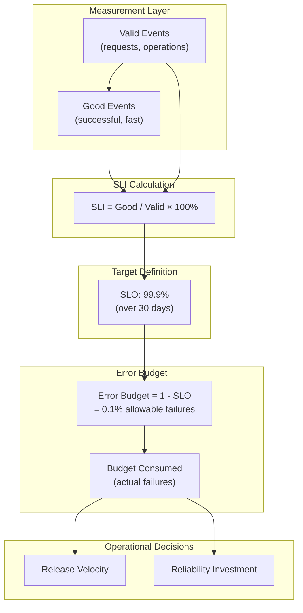

# SLOs, SLIs, and Error Budgets

Service Level Objectives (SLOs), Service Level Indicators (SLIs), and error budgets form a framework for quantifying reliability and balancing it against development velocity. This is not just monitoring—it is a business tool that aligns engineering effort with user experience. SLIs measure what users care about, SLOs set explicit targets, and error budgets convert those targets into actionable resource constraints. The framework originated at Google's SRE practice and has become the industry standard for reliability management. This article covers the design reasoning behind each concept, the mathematics of error budget consumption and burn rate alerting, and the operational practices that make SLOs effective in production.

<figure>



<figcaption>SLO framework: SLIs measure reliability, SLOs set targets, error budgets balance velocity and reliability investment.</figcaption>
</figure>

## Abstract

The SLO framework rests on three interdependent concepts:

- **SLIs** quantify user-centric reliability as a ratio of good events to valid events—measuring what users experience, not what systems report
- **SLOs** commit to explicit targets (e.g., "99.9% of requests succeed") over defined compliance periods, creating accountability
- **Error budgets** quantify acceptable unreliability (1 - SLO), converting abstract targets into concrete decision-making constraints

The critical insight: **100% reliability is neither achievable nor desirable**. Each additional "nine" costs exponentially more while providing diminishing user benefit. Error budgets make this trade-off explicit—when budget is exhausted, prioritize reliability; when budget remains, ship features.

Key operational decisions:

1. **Window selection**: Rolling windows (30 days) provide continuous feedback; calendar windows (monthly) reset favorably for reporting but mask user experience
2. **Burn rate alerting**: Multi-window, multi-burn-rate alerting detects both acute incidents (fast burn) and sustained degradation (slow burn) while reducing alert fatigue
3. **Error budget policies**: Automated release gates and mandatory postmortems tie SLO violations to concrete organizational responses

## Defining SLIs: User-Centric Reliability Measurement

An SLI is a quantitative measure of service behavior from the user's perspective. The fundamental formula:

$$
\text{SLI} = \frac{\text{Good Events}}{\text{Valid Events}} \times 100\%
$$

Where:

- **Good events**: Outcomes that satisfy user requirements (successful responses, responses under latency threshold)
- **Valid events**: All countable transactions in scope (excludes health checks, internal traffic)

### Why User-Centric, Not System-Centric

Traditional monitoring tracks system metrics: CPU utilization, memory pressure, network throughput. These metrics do not capture user experience:

| System Metric         | User Reality                                                     |
| --------------------- | ---------------------------------------------------------------- |
| 99.99% server uptime  | Users experiencing 100% error rate (load balancer misconfigured) |
| 50ms average latency  | P99 users waiting 30 seconds (outliers invisible in averages)    |
| All processes healthy | Users unable to complete transactions (upstream dependency down) |

The design principle from Google's SRE practice: "Start with what your users care about, not what's easy to measure." SLIs should reflect the user journey, not the infrastructure topology.

### SLI Types by Service Category

Different services require different SLI types:

| Service Type                   | Primary SLIs                       | Example                                                                          |
| ------------------------------ | ---------------------------------- | -------------------------------------------------------------------------------- |
| **Request-driven** (APIs, web) | Availability, latency, throughput  | 99.9% requests return 2xx in < 200ms                                             |
| **Storage systems**            | Durability, availability, latency  | 99.999999999% (11 nines) of objects retrievable                                  |
| **Data pipelines**             | Freshness, correctness, throughput | Data arrives within 5 minutes of ingestion, 99.9% of records processed correctly |
| **Scheduled jobs**             | Success rate, completion time      | 99% of daily jobs complete within SLA window                                     |

### Latency SLIs: Percentiles, Not Averages

Averages hide the user experience of the worst-affected users:

```
Average latency: 100ms
P50 (median): 50ms
P95: 200ms
P99: 2,000ms  ← 1% of users waiting 20x longer than average
```

For latency SLIs, use percentile thresholds:

$$
\text{Latency SLI} = \frac{\text{Requests with latency} \leq \text{threshold}}{\text{Total requests}} \times 100\%
$$

**Recommended percentile selection**:

- **P50**: Typical user experience; track for regressions but not for SLOs
- **P95**: Standard SLO target; represents "typical worst-case"
- **P99**: Critical for high-value transactions; catches tail latency
- **P99.9**: Used in latency-sensitive systems (trading, real-time bidding)

**Gotcha**: P99 requires statistical significance. With 100 requests/day, P99 is a single data point. For low-traffic services, use P90 or longer aggregation windows.

### SLI Measurement Points

Where you measure determines what you measure:

```
User → CDN → Load Balancer → Service → Database
  ^      ^         ^            ^
  |      |         |            └── Backend SLI (partial view)
  |      |         └────────────── Service SLI (misses network issues)
  |      └──────────────────────── Edge SLI (closer to user)
  └─────────────────────────────── Real User Monitoring (gold standard)
```

**Design trade-off**: Measuring closer to the user captures more failure modes but introduces measurement complexity (client-side instrumentation, data collection reliability). Most organizations start with service-side SLIs and add RUM (Real User Monitoring) for critical paths.

## Defining SLOs: Targets with Commitment

An SLO combines an SLI with a target and a compliance period:

```
SLO = SLI ≥ target over compliance_period

Example: 99.9% of HTTP requests return 2xx in < 200ms over a rolling 30-day window
```

### Choosing Targets: The "Nines" Trade-off

Each additional "nine" of reliability has exponential cost:

| Target  | Error Budget | Downtime/30 days | Engineering Implications                              |
| ------- | ------------ | ---------------- | ----------------------------------------------------- |
| 99%     | 1%           | 7.2 hours        | Standard deployments, basic redundancy                |
| 99.9%   | 0.1%         | 43 minutes       | Blue-green deployments, automated rollback            |
| 99.99%  | 0.01%        | 4.3 minutes      | Multi-region active-active, chaos engineering         |
| 99.999% | 0.001%       | 26 seconds       | Custom hardware, dedicated SRE team, limited releases |

**Design reasoning**: Users cannot distinguish 99.99% from 99.999%—both feel "always available." But achieving the extra nine requires fundamentally different architecture, operations, and organizational investment.

**Target selection heuristics**:

1. **Examine historical data**: What is your current reliability? Setting targets below historical performance guarantees constant violation
2. **Consider dependencies**: Your SLO cannot exceed your dependencies' reliability (if database is 99.9%, service cannot be 99.99%)
3. **Align with business value**: Premium features may warrant higher targets; experimental features may tolerate lower
4. **Start conservative**: It is easier to tighten targets than to relax them after users build expectations

### Compliance Periods: Rolling vs. Calendar Windows

**Rolling windows** (e.g., last 30 days):

- Update continuously as new data enters and old data exits
- Provide daily compliance measurements
- Align with user experience (failures do not "reset" on arbitrary dates)
- Better for operational decision-making

**Calendar windows** (e.g., monthly):

- Reset at period boundaries
- Full error budget restoration on first of month
- Better for external SLA reporting
- Favor service providers (incidents on day 30 are "forgotten" on day 1)

**Mathematical impact**:

For a 99% SLO:

- 24-hour window: Maximum 14.4 minutes continuous downtime
- 30-day window: Maximum 7.2 hours continuous downtime

Shorter windows force distributed failures; longer windows permit concentrated incidents.

**Recommendation**: Use rolling windows for internal SLOs (operational decisions) and calendar windows for external SLAs (contractual reporting).

## Error Budgets: Quantifying Acceptable Unreliability

The error budget is the mathematical complement of the SLO target:

$$
\text{Error Budget} = 1 - \text{SLO Target}
$$

For a 99.9% SLO, the error budget is 0.1%—permission for 0.1% of events to fail without violating the objective.

### Error Budget as Resource

Convert percentage to concrete numbers:

```
SLO: 99.9%
Compliance period: 30 days
Request volume: 10,000,000 requests/day × 30 days = 300,000,000 requests

Error budget = 0.001 × 300,000,000 = 300,000 allowable failed requests
```

This budget is a finite resource to be **spent** on:

- **Planned risk**: Deployments, migrations, experiments
- **Unplanned incidents**: Outages, bugs, dependency failures
- **Maintenance**: Upgrades, configuration changes

### Budget Consumption Tracking

Track budget consumption continuously:

$$
\text{Budget Consumed \%} = \frac{\text{Failed Events}}{\text{Error Budget}} \times 100\%
$$

Example consumption tracking over a 30-day period:

| Day | Daily Failures    | Cumulative Failures | Budget Consumed |
| --- | ----------------- | ------------------- | --------------- |
| 1   | 500               | 500                 | 0.17%           |
| 5   | 200               | 1,500               | 0.50%           |
| 10  | 50,000 (incident) | 52,000              | 17.3%           |
| 15  | 300               | 54,000              | 18.0%           |
| 30  | 400               | 75,000              | 25.0%           |

At 25% consumption, 75% of budget remains—the team can continue feature development.

### Budget Exhaustion Consequences

When error budget is exhausted (100% consumed), the SLO is violated. Typical organizational responses:

1. **Halt non-critical changes**: Only ship P0 bug fixes, security patches
2. **Mandatory postmortems**: All incidents consuming >20% of budget require documented analysis
3. **Reliability focus**: Engineering time redirects from features to reliability improvements
4. **Stakeholder notification**: Product, leadership informed of velocity constraints

This is the core trade-off mechanism: **error budgets give permission to focus on reliability when data indicates reliability is more important**.

## Burn Rate: The Velocity of Failure

Burn rate measures how quickly error budget is being consumed relative to the expected rate:

$$
\text{Burn Rate} = \frac{\text{Observed Error Rate}}{\text{Tolerable Error Rate}}
$$

Where:

$$
\text{Tolerable Error Rate} = 1 - \text{SLO Target}
$$

### Burn Rate Interpretation

| Burn Rate | Meaning                                                                  |
| --------- | ------------------------------------------------------------------------ |
| 1.0       | Consuming budget at exactly the planned rate; will exhaust at window end |
| < 1.0     | Under-consuming; budget will remain at window end                        |
| > 1.0     | Over-consuming; budget will exhaust before window end                    |
| 10.0      | 10× the acceptable error rate; severe incident                           |

**Example calculation**:

```
SLO: 99.9% (tolerable error rate = 0.1%)
Current error rate: 0.5%
Burn rate = 0.5% / 0.1% = 5.0

At burn rate 5.0:
- 30-day budget exhausts in 6 days
- Immediate investigation required
```

### Why Burn Rate, Not Raw Error Rate

Burn rate normalizes across services with different SLO targets:

| Service     | SLO    | Current Error Rate | Burn Rate       |
| ----------- | ------ | ------------------ | --------------- |
| Payment API | 99.99% | 0.01%              | 1.0 (on target) |
| Search      | 99.9%  | 0.01%              | 0.1 (excellent) |
| Analytics   | 99%    | 0.5%               | 0.5 (healthy)   |

Raw error rate would suggest Payment API and Search are equally healthy. Burn rate reveals Payment API is at its limit while Search has headroom.

## Multi-Window, Multi-Burn-Rate Alerting

Naive alerting on burn rate creates problems:

- **Single short window**: Temporary spikes trigger false alarms
- **Single long window**: Slow degradation detected too late
- **Static threshold**: Either too sensitive (alert fatigue) or too lenient (missed incidents)

The solution: combine multiple windows with correlated thresholds.

### Two-Alert Strategy

**Fast-burn alert (page)**:

- Window: 1 hour (with 5-minute correlation)
- Burn rate threshold: 14.4× (2% of monthly budget consumed in 1 hour)
- Purpose: Detect acute incidents requiring immediate response

**Slow-burn alert (ticket)**:

- Window: 6 hours (with 30-minute correlation)
- Burn rate threshold: 6× (5% of monthly budget consumed in 6 hours)
- Purpose: Detect sustained degradation requiring investigation

### Multi-Window Logic

Alerts require **both** windows to exceed thresholds:

```
Fast-burn fires IF:
  (Burn Rate over 1 hour > 14.4)
  AND
  (Burn Rate over 5 minutes > 14.4)

Slow-burn fires IF:
  (Burn Rate over 6 hours > 6)
  AND
  (Burn Rate over 30 minutes > 6)
```

**Design reasoning**: The short window (5 minutes, 30 minutes) provides fast recovery. When an incident resolves, the short window drops below threshold quickly, auto-resolving the alert. The long window (1 hour, 6 hours) prevents noise from temporary spikes.

### Alert Configuration Example

For a 99.9% SLO over 30 days:

```yaml
# Fast-burn: 2% of budget in 1 hour
- alert: HighErrorBudgetBurnFast
  expr: |
    (
      sum(rate(http_errors_total[1h])) / sum(rate(http_requests_total[1h]))
    ) > 0.001 * 14.4  # 14.4x burn rate
    and
    (
      sum(rate(http_errors_total[5m])) / sum(rate(http_requests_total[5m]))
    ) > 0.001 * 14.4
  for: 2m
  labels:
    severity: page
  annotations:
    summary: "High error budget burn rate (fast)"
    description: "Consuming error budget at 14x expected rate"

# Slow-burn: 5% of budget in 6 hours
- alert: HighErrorBudgetBurnSlow
  expr: |
    (
      sum(rate(http_errors_total[6h])) / sum(rate(http_requests_total[6h]))
    ) > 0.001 * 6
    and
    (
      sum(rate(http_errors_total[30m])) / sum(rate(http_requests_total[30m]))
    ) > 0.001 * 6
  for: 5m
  labels:
    severity: ticket
  annotations:
    summary: "Elevated error budget burn rate (slow)"
    description: "Sustained budget consumption at 6x expected rate"
```

## Error Budget Policies

Error budget policies codify organizational responses to budget consumption. Without explicit policies, SLOs become reporting metrics rather than decision-making instruments.

### Standard Policy Framework

```
IF budget consumed > 100% in trailing window:
  - HALT all non-critical deployments
  - Continue only: P0 bug fixes, security patches, reliability improvements
  - Resume feature development when budget is restored

IF single incident consumed > 20% of budget:
  - MANDATORY postmortem within 5 business days
  - Postmortem must include action items with owners and deadlines

IF recurring pattern of similar incidents:
  - Escalate to quarterly planning as P0 reliability investment
  - Product and engineering leadership review required
```

### Policy Flexibility

Not all budget consumption is equal:

**External causes** (dependency outages, cloud provider incidents):

- May exempt from deployment freeze
- Still count toward SLO for user experience tracking
- Document for stakeholder communication

**Internal causes** (bugs, configuration errors, capacity):

- Full policy application
- Focus engineering effort on root cause

**Gray areas** (partial dependency responsibility, shared infrastructure):

- Case-by-case evaluation
- Escalate disagreements to technical leadership

### Policy Governance

Policies require agreement from three parties:

1. **Product**: Acceptable reliability level for user experience
2. **Development**: Commitment to reliability work when budget exhausted
3. **SRE/Operations**: Feasibility of target given current infrastructure

Without three-party agreement, policies become contentious during incidents.

## SLO Review and Evolution

SLOs are not static. Review regularly and adjust based on evidence.

### Review Cadence

**Quarterly**: Assess SLO targets against actual performance

- Is the target achievable? (Constant violation suggests target too aggressive)
- Is the target meaningful? (Never violated suggests target too lenient)
- Has user expectation changed?

**Annually**: Business alignment review

- Do SLOs reflect current product priorities?
- Have competitive pressures changed requirements?
- Is reliability investment proportional to business value?

### Adjustment Criteria

**Tighten target** when:

- Team consistently exceeds target with margin
- User feedback indicates higher expectations
- Business criticality has increased

**Relax target** when:

- Target is unachievable with current architecture (requires significant investment)
- Dependency reliability constrains achievable level
- Cost of additional nines exceeds business value

**Change measurement** when:

- SLI no longer reflects user experience
- Measurement point has changed (new architecture)
- New failure modes need coverage

### Audit Trail

Document all SLO changes:

```markdown
## SLO Change Log

### 2024-03-15: Payment API Availability

- **Previous**: 99.9% over 30-day rolling
- **New**: 99.95% over 30-day rolling
- **Justification**: 12 months of 99.97% actual performance; payment criticality warrants tighter target
- **Approved by**: [Product Owner], [Engineering Lead], [SRE Lead]
```

This prevents "gaming" (adjusting targets to avoid violations) and enables organizational learning.

## Gotchas and Anti-Patterns

### SLO Target Selection Pitfalls

**The "number nines" problem**: Setting 99.999% without historical data or architectural support. Each nine costs exponentially more; unsupported targets create constant violation and cynicism.

**Measuring what's easy, not what matters**: Starting with available metrics rather than user experience. CPU utilization is easy to measure but does not capture user-facing failures.

**Too many SLOs**: More than 5-6 SLOs per service dilutes focus. Teams cannot prioritize when everything is an SLO.

**Misaligned incentives**: SLOs created without product involvement become engineering metrics disconnected from business value.

### Low-Traffic Service Challenges

Statistical reliability requires sample size:

| Traffic Level | P99 Reliability       | Minimum Window     |
| ------------- | --------------------- | ------------------ |
| 1,000/day     | 10 samples at P99     | Weekly aggregation |
| 10,000/day    | 100 samples at P99    | Daily viable       |
| 1,000,000/day | 10,000 samples at P99 | Hourly viable      |

**Solutions for low-traffic services**:

1. **Synthetic monitoring**: Supplement real traffic with synthetic probes
2. **Longer aggregation windows**: Weekly or monthly compliance periods
3. **Minimum failure thresholds**: Require minimum error count before alerting (e.g., at least 10 failures)
4. **Service consolidation**: Combine metrics from related services

### Gaming SLOs

Common manipulation tactics:

- Adjusting targets during difficult periods
- Narrowly scoping SLIs to exclude problematic components
- Manipulating measurement to inflate compliance

**Prevention**:

- Require stakeholder approval with audit trail for all changes
- External review by cross-functional teams
- Tie SLO performance to organizational outcomes (not individual performance reviews)

## Conclusion

The SLO framework transforms reliability from an abstract goal into a measurable, actionable resource. SLIs quantify what users experience; SLOs commit to explicit targets; error budgets convert targets into decision-making constraints.

The framework's power lies in making trade-offs explicit:

- **When budget is healthy**: Ship features, take risks, move fast
- **When budget is depleted**: Stop, fix reliability, earn back trust

This is not just monitoring—it is organizational alignment. Product, engineering, and operations share a common language for reliability decisions.

The mathematics matter: burn rate alerting prevents both alert fatigue and missed incidents; multi-window correlation reduces noise while enabling rapid response; rolling windows align with user experience while calendar windows support contractual reporting.

Start with what users care about, set achievable targets, measure continuously, and let the data drive decisions. The goal is not maximum reliability—it is **appropriate reliability** that balances user experience with development velocity.

## Appendix

### Prerequisites

- Familiarity with distributed systems operations (deployments, incidents, on-call)
- Basic understanding of percentiles and statistical sampling
- Experience with monitoring systems (Prometheus, Datadog, or similar)

### Terminology

- **SLI (Service Level Indicator)**: A quantitative measure of service behavior, typically a ratio of good events to valid events
- **SLO (Service Level Objective)**: A target value for an SLI over a compliance period
- **SLA (Service Level Agreement)**: A contractual commitment with consequences for violation (distinct from SLO, which is internal)
- **Error Budget**: The allowable amount of unreliability (1 - SLO target)
- **Burn Rate**: The rate at which error budget is being consumed relative to the expected rate
- **Compliance Period**: The time window over which SLO compliance is measured (rolling or calendar)

### Summary

- SLIs measure user-centric reliability as good events / valid events; use percentiles for latency, not averages
- SLOs combine SLIs with targets and compliance periods; each additional "nine" costs exponentially more
- Error budgets (1 - SLO) quantify acceptable unreliability and balance reliability against development velocity
- Burn rate normalizes error rates across services; > 1.0 means budget will exhaust before window end
- Multi-window, multi-burn-rate alerting prevents both alert fatigue and missed incidents
- Error budget policies codify organizational responses; require product, dev, and SRE agreement
- Rolling windows align with operations; calendar windows suit contractual reporting

### References

- [Google SRE Book: Service Level Objectives](https://sre.google/sre-book/service-level-objectives/) - Foundational definitions and philosophy
- [Google SRE Workbook: Implementing SLOs](https://sre.google/workbook/implementing-slos/) - Practical implementation guidance
- [Google SRE Workbook: Alerting on SLOs](https://sre.google/workbook/alerting-on-slos/) - Multi-window burn rate alerting mathematics
- [Google SRE Workbook: Error Budget Policy](https://sre.google/workbook/error-budget-policy/) - Policy framework and governance
- [W3C Trace Context](https://www.w3.org/TR/trace-context/) - Context propagation for distributed tracing (relevant for SLI measurement)
- [SLO Adoption and Usage in Site Reliability Engineering (O'Reilly)](https://www.oreilly.com/library/view/slo-adoption-and/9781492075370/) - Advanced SLI construction patterns
- [Google Cloud: SLO Monitoring](https://cloud.google.com/stackdriver/docs/solutions/slo-monitoring) - Cloud-native SLO implementation
- [Datadog: Burn Rate is Better Error Rate](https://www.datadoghq.com/blog/burn-rate-is-better-error-rate/) - Burn rate vs. error rate comparison
