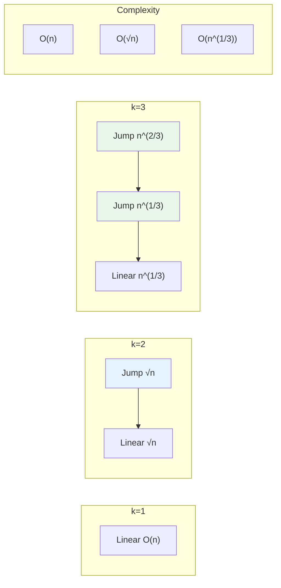

# K-Crystal Balls Problem: Jump Search Pattern

This note explains how to derive the optimal jump size of `n^(1/k)` for the k-crystal-balls problem.

<figure>



<figcaption>K crystal balls problem: more balls enable larger jumps, reducing worst-case complexity from O(n) to O(n^(1/k))</figcaption>

</figure>

## TLDR

**K Crystal Balls** is an optimization problem demonstrating how additional resources (balls) enable more aggressive search strategies.

### Core Formula

- **Jump size**: n^(1/k) where k = number of balls
- **Worst-case drops**: k × n^(1/k)
- **Complexity**: O(n^(1/k)) for fixed k

### Key Cases

- **k=1**: Linear search only, O(n) drops (can't risk breaking the single ball)
- **k=2**: Jump by √n, then linear search; 2√n drops worst case
- **k=3**: Two jump phases then linear; 3 × ∛n drops worst case
- **k=∞**: Binary search, O(log n) drops

### The Insight

- Balance work across all k phases by making each phase do equal work
- If phases are unequal, redistribute effort to minimize the maximum
- Setting all terms equal gives n/j₁ = j₁/j₂ = ... = j\_{k-1} = x, solving to x = n^(1/k)

## Problem Recap

Given `k` identical crystal balls and a building with `n` floors, find the exact floor where balls start breaking using the minimum number of drops in the **worst case**.

- Floors are represented as a sorted boolean array: all `false` (safe) followed by all `true` (breaks)
- Once a ball breaks, it's gone
- Goal: Minimize the worst-case number of drops

## Building Intuition: Start with k = 1, 2, 3

### Case k = 1 (One Ball)

With only one ball, we can't risk breaking it early. We must check floors sequentially.

**Strategy**: Linear search from floor 1 to n

**Worst case**: `n` drops

**Complexity**: O(n)

---

### Case k = 2 (Two Balls)

With two balls, we can afford one "exploratory" break.

**Strategy**:

1. Jump by some interval `j` with the first ball
2. When it breaks, linear search the previous `j` floors with the second ball

**Analysis**:

- Number of jumps: `n/j`
- Linear search after break: `j` (worst case)
- Total drops: `n/j + j`

**Optimization**: Minimize `f(j) = n/j + j`

Take derivative: `f'(j) = -n/j² + 1 = 0`

Solve: `j² = n` → `j = √n = n^(1/2)`

**Worst case**: `n/√n + √n = 2√n`

**Complexity**: O(n^(1/2)) = O(√n)

---

### Case k = 3 (Three Balls)

With three balls, we have two "exploratory" breaks before falling back to linear search.

**Strategy**:

1. Jump by interval `j₁` with the first ball
2. When it breaks, jump by interval `j₂` within that segment with the second ball
3. When it breaks, linear search with the third ball

**Analysis**:

- First phase jumps: `n/j₁`
- Second phase jumps: `j₁/j₂`
- Linear search: `j₂`
- Total: `n/j₁ + j₁/j₂ + j₂`

**Optimization**: To minimize, all three terms should be equal.

Set `n/j₁ = j₁/j₂ = j₂ = x`

- From `j₂ = x`: j₂ = x
- From `j₁/j₂ = x`: j₁ = x · j₂ = x²
- From `n/j₁ = x`: n = x · j₁ = x · x² = x³

Therefore: `x = n^(1/3)`

**Jump sizes**:

- j₁ = x² = n^(2/3)
- j₂ = x = n^(1/3)

**Worst case**: `3 · n^(1/3)`

**Complexity**: O(n^(1/3))

---

## General Pattern: k Balls

### The Strategy

With `k` balls, we create `k` phases:

1. Phase 1: Jump by `j₁` until first ball breaks
2. Phase 2: Within that segment, jump by `j₂` until second ball breaks
3. ...
4. Phase k: Linear search (jump by 1)

### Total Drops Formula

```
Total = n/j₁ + j₁/j₂ + j₂/j₃ + ... + j_{k-1}
```

Where `j_k = 1` (linear search in final phase).

### Optimization Approach

To minimize the maximum (worst case), we want all terms to be equal. Let each term equal `x`:

```
n/j₁ = j₁/j₂ = j₂/j₃ = ... = j_{k-1} = x
```

### Solving the Recurrence

Working backwards from the last phase:

```
j_{k-1} = x                    (linear search segment size)
j_{k-2} = x · j_{k-1} = x²
j_{k-3} = x · j_{k-2} = x³
...
j₁ = x^(k-1)
```

From the first equation:

```
n/j₁ = x
n = x · j₁ = x · x^(k-1) = x^k
```

Therefore:

```
x = n^(1/k)
```

### Jump Sizes

```
j₁ = n^((k-1)/k)
j₂ = n^((k-2)/k)
j₃ = n^((k-3)/k)
...
j_{k-1} = n^(1/k)
```

### Worst-Case Drops

Total drops = `k · x = k · n^(1/k)`

**Complexity**: O(k · n^(1/k))

For fixed k, this simplifies to **O(n^(1/k))**

---

## Summary Table

| Balls (k) | Jump Size    | Worst Case Drops | Complexity |
| --------- | ------------ | ---------------- | ---------- |
| 1         | 1            | n                | O(n)       |
| 2         | n^(1/2) = √n | 2√n              | O(√n)      |
| 3         | n^(1/3) = ∛n | 3·∛n             | O(n^(1/3)) |
| 4         | n^(1/4) = ∜n | 4·∜n             | O(n^(1/4)) |
| k         | n^(1/k)      | k·n^(1/k)        | O(n^(1/k)) |
| log(n)    | 2            | log(n)·2         | O(log n)   |
| ∞         | n/2 (binary) | log₂(n)          | O(log n)   |

---

## Key Insights

### 1. Balancing Phases

The optimal solution balances the work across all phases. If any phase does more work than others, we can improve by redistributing.

### 2. Why Equal Terms?

Consider the total: `T = a₁ + a₂ + ... + aₖ`

If terms are unequal, we can reduce the maximum by:

- Decreasing the largest term
- Increasing smaller terms to compensate

The minimum maximum occurs when all terms are equal.

### 3. The Trade-off

More balls = more phases = each phase does less work

```
k=1:  [─────────────────────────────────] n drops
k=2:  [──────√n──────][──────√n──────]   2√n drops
k=3:  [───∛n───][───∛n───][───∛n───]     3∛n drops
```

### 4. Diminishing Returns

Each additional ball helps less:

| Balls | n = 1,000,000 | Improvement |
| ----- | ------------- | ----------- |
| 1     | 1,000,000     | -           |
| 2     | 2,000         | 500x        |
| 3     | 300           | 6.7x        |
| 4     | 126           | 2.4x        |
| 5     | 79            | 1.6x        |

### 5. Connection to Binary Search

When k = log₂(n), the jump size becomes approximately 2, and we approach binary search behavior.

With unlimited balls (k → ∞), we get pure binary search: O(log n).

---

## Mathematical Proof (Calculus)

For those who prefer a rigorous derivation:

### Lagrange Multiplier Approach

Minimize `max(n/j₁, j₁/j₂, ..., j_{k-1})` subject to the constraint that we use exactly k phases.

At the optimum, all terms must be equal (otherwise we could improve by adjusting).

### Direct Calculus (k = 2 case)

Minimize `f(j) = n/j + j`

```
f'(j) = -n/j² + 1 = 0
j² = n
j = √n
```

Second derivative test: `f''(j) = 2n/j³ > 0` (confirms minimum)

### Generalization

For k balls with function:

```
f(j₁, j₂, ..., j_{k-1}) = n/j₁ + j₁/j₂ + ... + j_{k-1}
```

Setting partial derivatives to zero and solving the system yields:

```
j_i = n^((k-i)/k)
```

---

## Interview Application

When explaining this in an interview:

1. **Start simple**: "With 2 balls, I want to balance jump size and fallback search"

2. **Show the trade-off**: "Jumping by j means n/j jumps, but j linear searches if it breaks"

3. **Minimize**: "To minimize n/j + j, I set them equal: n/j = j, so j = √n"

4. **Generalize**: "With k balls, I have k phases. Balancing them equally gives jump size n^(1/k)"

5. **Verify with example**: "For n=1000000 and k=2: √1000000 = 1000, so about 2000 drops worst case"

---

## References

- [Egg Dropping - Brilliant Math & Science Wiki](https://brilliant.org/wiki/egg-dropping/) - Comprehensive mathematical derivation with binomial approach
- [Egg Dropping Puzzle | DP-11 - GeeksforGeeks](https://www.geeksforgeeks.org/dsa/egg-dropping-puzzle-dp-11/) - DP-based solution approaches and complexity analysis
- [The Egg-Drop Numbers - Michael Boardman (PDF)](https://users.math.msu.edu/users/magyarp/math481/Egg-Drop-Recurrence.pdf) - Academic treatment with binomial coefficient proofs
- [887. Super Egg Drop - LeetCode](https://leetcode.com/problems/super-egg-drop/) - The classic DP formulation
- [1884. Egg Drop With 2 Eggs and N Floors - LeetCode](https://leetcode.com/problems/egg-drop-with-2-eggs-and-n-floors/) - Simplified k=2 variant
