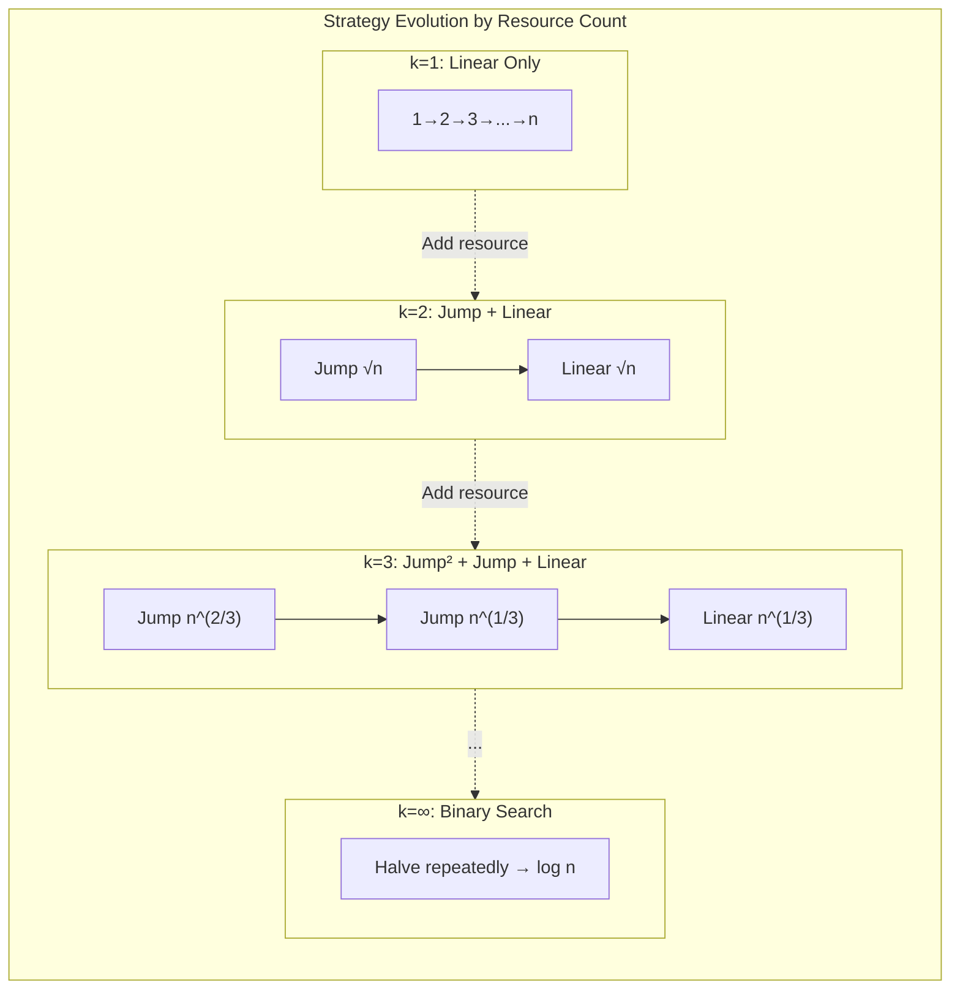

# K-Crystal Balls Problem: Jump Search Pattern

The K-crystal balls (or K-egg drop) problem demonstrates how constrained resources fundamentally change optimal search strategy. With unlimited test resources, binary search achieves O(log n). With exactly k resources that are consumed on failure, the optimal worst-case complexity becomes O(n^(1/k))—a jump search pattern where each resource enables one level of hierarchical partitioning.

<figure>



<figcaption>Resource count determines search depth: each additional resource enables one more level of hierarchical partitioning, reducing worst-case from O(n) toward O(log n).</figcaption>

</figure>

## Abstract

The K-crystal balls problem models **threshold detection with consumable test resources**—a pattern appearing in software version bisection, network MTU discovery, and reliability testing.

**Core insight**: When resources are limited, balance work across all phases by making each phase contribute equally to worst-case cost. For k resources and n positions:

- **Jump size at phase i**: $n^{(k-i)/k}$
- **Worst-case operations**: $k \cdot n^{1/k}$
- **Complexity**: $O(n^{1/k})$ for fixed k

The formula emerges from setting all phase costs equal and solving the resulting geometric sequence. This isn't arbitrary—it's the unique configuration where no phase can be improved without making another worse.

| Resources (k) | Jump Pattern                    | Worst Case | Complexity |
| ------------- | ------------------------------- | ---------- | ---------- |
| 1             | Linear only                     | n          | O(n)       |
| 2             | √n → linear                     | 2√n        | O(√n)      |
| 3             | n^(2/3) → n^(1/3) → linear      | 3·∛n       | O(∛n)      |
| k             | n^((k-1)/k) → ... → n^(1/k) → 1 | k·n^(1/k)  | O(n^(1/k)) |
| log n         | 2 → 2 → ...                     | 2·log n    | O(log n)   |

## Problem Definition

Given k identical crystal balls and a structure with n floors, find the exact threshold floor where balls start breaking using minimum drops in the **worst case**.

**Formal model**:

- Floors form a sorted boolean array: `[false, false, ..., false, true, true, ..., true]`
- All floors below threshold are safe (false); threshold and above break (true)
- A broken ball is permanently consumed
- **Objective**: Minimize maximum drops across all possible threshold positions

**Why worst-case matters**: In production systems, you often can't afford to rely on average-case luck. The worst-case bound guarantees performance regardless of where the threshold lies.

## Why Binary Search Fails

Binary search seems natural—it's optimal for searching sorted data. With k=2 balls and n=100 floors:

1. Drop from floor 50
2. If it breaks, you have 1 ball left and must linear search floors 1-49
3. Worst case: 1 + 49 = 50 drops

The problem: **binary search assumes tests are non-destructive**. When a test consumes the resource on failure, the search space constraints change asymmetrically. After a break, you lose both the ball and the ability to take risks.

This asymmetry is why the optimal strategy for k=2 isn't "binary then linear" (worst case ~n/2) but "jump √n then linear" (worst case 2√n). The sqrt improvement comes from properly accounting for resource consumption.

## Building the Solution: k=1, k=2, k=3

### Case k=1: No Risk Tolerance

With one ball, any break ends the search without finding the threshold. The only safe strategy is linear search.

**Strategy**: Test floors 1, 2, 3, ..., n sequentially

**Worst case**: n drops (threshold is at floor n)

**Complexity**: O(n)

This establishes the baseline—with zero tolerance for resource loss, you cannot exploit structure.

### Case k=2: One Exploratory Break Allowed

With two balls, you can afford one "exploratory" break before falling back to linear search.

**Strategy**:

1. Jump by interval j with the first ball
2. When it breaks at some floor, linear search the previous j floors with the second ball

**Analysis**:

- Number of jumps before break: at most ⌈n/j⌉
- Linear search after break: at most j-1 steps
- Total worst case: n/j + j (approximately)

**Optimization**: Minimize f(j) = n/j + j

Taking the derivative:
$$f'(j) = -\frac{n}{j^2} + 1 = 0$$

Solving:
$$j^2 = n \implies j = \sqrt{n}$$

Second derivative confirms minimum: $f''(j) = \frac{2n}{j^3} > 0$

**Worst case**: $\frac{n}{\sqrt{n}} + \sqrt{n} = 2\sqrt{n}$

**Complexity**: O(√n)

### Case k=3: Two Exploratory Breaks

With three balls, you can partition twice before linear search.

**Strategy**:

1. Jump by j₁ with the first ball
2. Within the broken segment, jump by j₂ with the second ball
3. Linear search the final segment with the third ball

**Analysis**:

- Phase 1: n/j₁ jumps
- Phase 2: j₁/j₂ jumps
- Phase 3: j₂ linear steps
- Total: n/j₁ + j₁/j₂ + j₂

**Optimization**: To minimize the maximum of these terms (worst case), make them equal.

Set $\frac{n}{j_1} = \frac{j_1}{j_2} = j_2 = x$

Working backwards:

- $j_2 = x$
- $j_1 = x \cdot j_2 = x^2$
- $n = x \cdot j_1 = x \cdot x^2 = x^3$

Therefore: $x = n^{1/3}$

**Jump sizes**:

- $j_1 = x^2 = n^{2/3}$
- $j_2 = x = n^{1/3}$

**Worst case**: $3 \cdot n^{1/3}$

**Complexity**: O(n^(1/3))

## General Pattern: k Resources

### The Hierarchical Jump Strategy

With k resources, create k phases of decreasing granularity:

1. **Phase 1**: Jump by $j_1$ until first resource consumed
2. **Phase 2**: Within that segment, jump by $j_2$ until second consumed
3. ...
4. **Phase k**: Linear search (jump by 1)

### Total Operations Formula

$$\text{Total} = \frac{n}{j_1} + \frac{j_1}{j_2} + \frac{j_2}{j_3} + \cdots + j_{k-1}$$

Where $j_k = 1$ (linear search in final phase).

### Why Equal Terms Minimize Worst Case

Consider any configuration where terms are unequal. The largest term determines the worst case. By reducing the largest term (larger jumps) and increasing smaller terms (smaller jumps), we can improve overall worst case until all terms equalize.

Formally: for a fixed product of terms (constrained by n), the sum is minimized when all terms are equal (AM-GM inequality application).

### Solving the Recurrence

Set each term equal to x:
$$\frac{n}{j_1} = \frac{j_1}{j_2} = \frac{j_2}{j_3} = \cdots = j_{k-1} = x$$

Working backwards from $j_{k-1} = x$:

$$j_{k-1} = x$$
$$j_{k-2} = x \cdot j_{k-1} = x^2$$
$$j_{k-3} = x \cdot j_{k-2} = x^3$$
$$\vdots$$
$$j_1 = x^{k-1}$$

From the first equation:
$$\frac{n}{j_1} = x \implies n = x \cdot j_1 = x \cdot x^{k-1} = x^k$$

**Solution**: $x = n^{1/k}$

### Jump Size Formula

For phase i (1 ≤ i ≤ k-1):
$$j_i = n^{(k-i)/k}$$

This creates a geometric sequence of jump sizes, each smaller than the previous by factor $n^{1/k}$.

### Complexity Result

**Worst-case operations**: $k \cdot n^{1/k}$

**Time complexity**: O(k · n^(1/k))

For fixed k, this simplifies to **O(n^(1/k))**.

## Design Reasoning: Why This Structure?

### The Balancing Principle

The solution emerges from a single insight: **balance work across phases**. Any imbalance means one phase dominates worst-case cost, and that phase could be improved by stealing resources from cheaper phases.

This is the **minimax principle** in action—minimizing the maximum cost across all phases.

### Why Not Variable Jump Sizes?

An alternative approach uses decreasing jumps (x, x-1, x-2, ...) to account for "wasted" successful drops. This yields slightly better constants:

For k=2 and n=100:

- Fixed √n jumps: worst case ≈ 20 drops
- Decreasing jumps (14, 13, 12, ...): worst case = 14 drops

The decreasing approach satisfies $\frac{x(x+1)}{2} \geq n$, giving $x = \lceil\frac{-1 + \sqrt{1+8n}}{2}\rceil$.

However, the fixed jump approach is simpler, has the same asymptotic complexity, and generalizes cleanly to k > 2.

### Diminishing Returns of Additional Resources

Each additional resource reduces the exponent by 1/k(k+1):

| Resources | n = 1,000,000 | Improvement Factor |
| --------- | ------------- | ------------------ |
| 1         | 1,000,000     | —                  |
| 2         | 2,000         | 500×               |
| 3         | 300           | 6.7×               |
| 4         | 126           | 2.4×               |
| 5         | 79            | 1.6×               |

The first few resources provide massive gains; subsequent ones help less. This matches intuition—once you can partition sufficiently, additional partitioning levels add diminishing value.

### Connection to Binary Search

When k = log₂(n), the jump size becomes approximately 2, and you get near-binary-search behavior.

With unlimited resources (k → ∞), pure binary search is optimal: O(log n).

The K-crystal balls problem thus interpolates between:

- **k=1**: Linear search, no structure exploitation
- **k=∞**: Binary search, maximum structure exploitation

## Implementation

```ts title="k-crystal-balls.ts" collapse={1-5, 39-50}
/**
 * K-Crystal Balls: Jump search with limited test resources
 * Time: O(k * n^(1/k)) where k = number of balls
 * Space: O(1)
 */

function findBreakingFloor(floors: boolean[], k: number): number {
  const n = floors.length
  if (n === 0) return -1
  if (k === 0) return -1 // No resources to test

  // k=1: Must use linear search
  if (k === 1) {
    for (let i = 0; i < n; i++) {
      if (floors[i]) return i
    }
    return -1
  }

  // General case: Jump by n^(1/k), recurse with k-1 resources
  const jumpSize = Math.max(1, Math.floor(Math.pow(n, (k - 1) / k)))

  let lastSafe = 0
  let position = jumpSize

  // Phase 1: Jump search with first resource
  while (position < n && !floors[position]) {
    lastSafe = position
    position += jumpSize
  }

  // Found segment [lastSafe, min(position, n-1)] containing threshold
  // Recursively search with k-1 resources
  const segmentStart = lastSafe
  const segmentEnd = Math.min(position, n - 1)
  const segment = floors.slice(segmentStart, segmentEnd + 1)

  const relativeIndex = findBreakingFloor(segment, k - 1)
  return relativeIndex === -1 ? -1 : segmentStart + relativeIndex
}

// Iterative version for k=2 (most common case)
function twoEggDrop(floors: boolean[]): number {
  const n = floors.length
  const jump = Math.floor(Math.sqrt(n))

  let lastSafe = 0
  let pos = 0

  // Jump phase
  while (pos < n && !floors[pos]) {
    lastSafe = pos
    pos += jump
  }

  // Linear phase
  for (let i = lastSafe; i < Math.min(pos + 1, n); i++) {
    if (floors[i]) return i
  }
  return -1
}
```

## Edge Cases and Failure Modes

### Edge Cases

| Condition            | Behavior                                       |
| -------------------- | ---------------------------------------------- |
| k = 0                | Cannot determine threshold (no test resources) |
| k > log₂(n)          | Binary search suffices; extra resources unused |
| n = 0                | No floors to test; return -1                   |
| n = 1                | Single test determines threshold               |
| All false            | No breaking floor exists; return -1            |
| All true             | Threshold at floor 0                           |
| Threshold at floor 1 | First jump overshoots; linear search finds it  |

### Numerical Precision

For very large n, $n^{1/k}$ may have floating-point errors. Use integer-safe computation:

```ts
// Avoid: Math.pow(n, 1/k) has precision issues for large n
// Prefer: Newton's method or integer nth-root algorithms
```

### Off-by-One Boundaries

The jump search must handle:

- Jumping past the array bounds (clamp to n-1)
- Segment boundaries (inclusive vs exclusive)
- The case where threshold is exactly at a jump position

## Real-World Applications

### Software Version Bisection

**Problem**: A bug exists in version V but not version V-100. Find the introducing commit with minimal builds.

This is k-crystal-balls with k = number of parallel build machines. With 2 machines, jump by √100 ≈ 10 versions, then linear search the breaking segment.

### Network MTU Discovery

**Problem**: Find the maximum transmission unit (MTU) for a network path without excessive packet loss.

Packets that exceed MTU are dropped (the "ball breaks"). With limited retransmission budget, jump search finds optimal MTU faster than linear probing.

### Reliability Testing

**Problem**: Find the load threshold where a system fails, using limited destructive test runs.

Each test that causes failure consumes resources (hardware, time, budget). The K-crystal balls strategy minimizes tests needed to bracket the threshold.

### Database Index Tuning

**Problem**: Find the selectivity threshold where an index becomes beneficial, with limited benchmark runs.

Each benchmark consumes time. Jump search with k benchmark "resources" finds the crossover point efficiently.

## Appendix

### Prerequisites

- Basic calculus (derivatives for optimization)
- Understanding of time complexity notation
- Familiarity with binary search and its assumptions

### Terminology

- **Threshold floor**: The lowest floor where balls break (the target to find)
- **Worst case**: Maximum operations across all possible threshold positions
- **Jump search**: Search strategy using fixed-size jumps followed by linear scan
- **Consumable resource**: A test resource that is destroyed on certain outcomes

### Summary

- K-crystal balls models threshold detection with limited destructive tests
- Optimal jump size at phase i is $n^{(k-i)/k}$, derived from equalizing phase costs
- Worst-case complexity is O(n^(1/k)) for fixed k
- k=1 gives O(n); k=∞ gives O(log n); intermediate k interpolates between these
- Applications include version bisection, MTU discovery, and reliability testing
- The solution demonstrates the minimax principle: balance work to minimize maximum cost

### References

- [Egg Dropping - Brilliant Math & Science Wiki](https://brilliant.org/wiki/egg-dropping/) - Comprehensive mathematical derivation with recurrence relations and binomial coefficient approach
- [Egg Drop Problems: They Are All They Are Cracked Up To Be](https://arxiv.org/html/2511.18330) - Academic treatment with multidimensional generalizations and induction proofs (2025)
- [The Egg Problem - Spencer Mortensen](https://spencermortensen.com/articles/egg-problem/) - Clear derivation of recurrence relation $D(k,t) = 1 + D(k-1,t-1) + D(k,t-1)$
- [887. Super Egg Drop - LeetCode](https://leetcode.com/problems/super-egg-drop/) - The classic DP formulation with O(k·n·log n) solution
- [1884. Egg Drop With 2 Eggs and N Floors - LeetCode](https://leetcode.com/problems/egg-drop-with-2-eggs-and-n-floors/) - Simplified k=2 variant
- [Two Crystal Balls Problem - Frontend Masters](https://frontendmasters.com/courses/algorithms/two-crystal-balls-problem/) - ThePrimeagen's algorithmic treatment
- [MIT OCW: Please Do Break the Crystal](https://ocw.mit.edu/courses/6-s095-programming-for-the-puzzled-january-iap-2018/pages/puzzle-4-please-do-break-the-crystal/) - Programming for the Puzzled course material
- [Egg Drop Problem Applications - AlgoCademy](https://algocademy.com/blog/egg-drop-problem-a-comprehensive-guide-to-this-classic-algorithmic-challenge/) - Real-world applications including version bisection and MTU discovery
