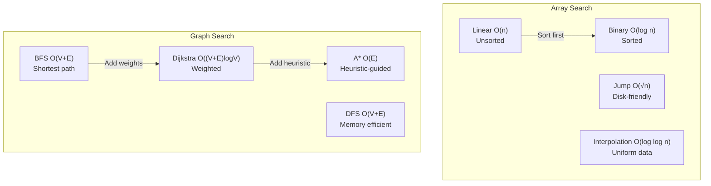
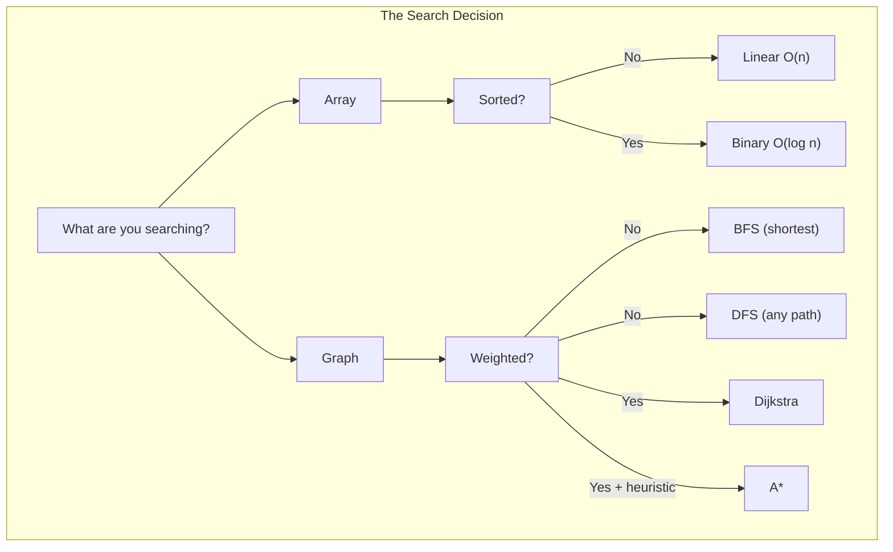

# Search Algorithms: Linear, Binary, and Graph Traversal

A comprehensive guide to search algorithms covering fundamental concepts, implementation details, performance characteristics, and real-world applications. Learn when to use each algorithm and understand the engineering trade-offs behind production search implementations.

<figure>



<figcaption>Search algorithm taxonomy showing array and graph search strategies with their complexity characteristics</figcaption>

</figure>

## Abstract

Search algorithms answer a fundamental question: _how do I find what I'm looking for?_ The answer depends on two factors: **data organization** and **search goal**.

<figure>



<figcaption>The core mental model: data structure and goal determine algorithm choice</figcaption>

</figure>

**Core trade-offs to internalize:**

| Trade-off                    | Left Choice              | Right Choice                  | When to pick right        |
| ---------------------------- | ------------------------ | ----------------------------- | ------------------------- |
| Preprocessing vs Query       | Linear (no prep, O(n))   | Binary (O(n log n) prep, O(log n)) | Multiple queries          |
| Space vs Optimality          | DFS (O(depth) space)     | BFS (O(width) space)          | Need shortest path        |
| Guaranteed vs Average        | Binary (O(log n) always) | Interpolation (O(log log n) avg) | Uniform data distribution |
| Uninformed vs Informed       | Dijkstra (explores all)  | A* (guided by heuristic)      | Good heuristic available  |

**Key insight:** The "best" algorithm is the one that exploits your data's structure. Sorted data enables binary search. Known goals enable heuristic guidance. Uniform distribution enables interpolation. The worst case is searching unstructured data for an unknown target—that's always O(n).

## Core Concepts

### Why These Trade-offs Exist

Every search algorithm makes a fundamental bargain. Understanding _why_ these trade-offs exist helps you choose correctly.

**Time vs Space:** Binary search achieves O(log n) by eliminating half the search space each step—but this only works if elements are sorted, meaning either O(n log n) preprocessing or maintaining a sorted structure on insert. Hash tables achieve O(1) average by trading O(n) space for direct addressing. The trade-off exists because faster access requires either more memory or more upfront organization.

**Preprocessing vs Query Time:** This trade-off optimizes for different access patterns. Linear search's O(n) query with zero preprocessing beats binary search for single queries (sorting costs O(n log n)). But for k queries, binary search wins when k × O(log n) + O(n log n) < k × O(n), which holds for roughly k > log n queries. Real systems make this choice constantly—databases build indexes (preprocessing) to speed queries.

**Completeness vs Optimality:** BFS (Breadth-First Search) explores level-by-level, guaranteeing the shortest path in unweighted graphs. DFS (Depth-First Search) explores depth-first, using O(depth) space vs BFS's O(width). BFS is _complete_ (finds a solution if one exists) and _optimal_ (finds shortest). DFS is complete but not optimal. The trade-off exists because shortest-path guarantees require tracking all paths at each distance level.

**Guaranteed vs Average Performance:** Binary search's O(log n) is _worst-case_—it never degrades. Interpolation search achieves O(log log n) _average_ on uniformly distributed data by guessing where the target likely is, but degrades to O(n) when the guess is wrong (skewed data). Average-case algorithms bet on data properties; worst-case algorithms make no assumptions.

### The Search Problem Taxonomy

Search problems vary along two axes: **data structure** and **search goal**.

| Data Structure | Algorithms                        | Key Constraint        |
| -------------- | --------------------------------- | --------------------- |
| Unsorted Array | Linear Search                     | No random access      |
| Sorted Array   | Binary, Jump, Interpolation, Exp. | Requires sorted order |
| Graph          | BFS, DFS, Dijkstra, A*            | Edge relationships    |
| Hash Table     | Direct lookup                     | O(n) extra space      |
| String         | KMP, Boyer-Moore, Rabin-Karp      | Pattern matching      |

| Search Goal         | Best Algorithm(s)       | Why                                       |
| ------------------- | ----------------------- | ----------------------------------------- |
| Exact element       | Binary (sorted), Hash   | O(log n) or O(1)                          |
| All matches         | Linear + collect        | Must scan all                             |
| Shortest path (unw) | BFS                     | Level-order guarantees minimum hops       |
| Shortest path (w)   | Dijkstra, A*            | Priority queue processes minimum distance |
| Any path            | DFS                     | Memory efficient, finds first path        |
| Cycle detection     | DFS + recursion stack   | Back edge indicates cycle                 |

---

## Linear Search Algorithms

### 1. Linear Search (Sequential Search)

**Philosophy**: Check every element one by one until you find the target or reach the end.

```typescript collapse={10-33}
function linearSearch<T>(arr: T[], target: T): number {
  for (let i = 0; i < arr.length; i++) {
    if (arr[i] === target) {
      return i
    }
  }
  return -1 // Not found
}

// Variant: Find all occurrences
function linearSearchAll<T>(arr: T[], target: T): number[] {
  const indices: number[] = []
  for (let i = 0; i < arr.length; i++) {
    if (arr[i] === target) {
      indices.push(i)
    }
  }
  return indices
}

// Variant: With custom comparator
function linearSearchCustom<T>(arr: T[], predicate: (item: T) => boolean): number {
  for (let i = 0; i < arr.length; i++) {
    if (predicate(arr[i])) {
      return i
    }
  }
  return -1
}
```

| Property     | Value                       |
| ------------ | --------------------------- |
| Time         | O(n) worst/avg, O(1) best   |
| Space        | O(1)                        |
| Prerequisite | None (works on unsorted)    |
| Use case     | Small arrays, unsorted data |

**Optimizations**:

1. **Sentinel search**: Add target at the end to eliminate bounds checking
2. **Move-to-front**: Move found element to front for better subsequent searches
3. **Early termination**: For sorted arrays, stop when element > target

```typescript
// Sentinel optimization
function sentinelLinearSearch(arr: number[], target: number): number {
  const n = arr.length
  const last = arr[n - 1]
  arr[n - 1] = target // Place sentinel

  let i = 0
  while (arr[i] !== target) {
    i++
  }

  arr[n - 1] = last // Restore last element

  if (i < n - 1 || arr[n - 1] === target) {
    return i
  }
  return -1
}
```

**Practical applications**:

- **Small datasets**: When n < 100, the simplicity outweighs binary search overhead
- **Unsorted data**: When sorting cost (O(n log n)) exceeds search cost
- **Single search**: When you search once, sorting isn't worth it
- **Custom predicates**: Finding first element matching complex conditions
- **Linked lists**: No random access available, making binary search impossible
- **Database table scans**: When no index exists (full table scan)
- **Log file searching**: Searching through unsorted log entries
- **Configuration validation**: Checking for specific settings in config files

---

### 2. Jump Search (Block Search)

**Philosophy**: Jump ahead by fixed steps, then linear search within the block.

```typescript
function jumpSearch(arr: number[], target: number): number {
  const n = arr.length
  const blockSize = Math.floor(Math.sqrt(n))
  let step = blockSize
  let prev = 0

  // Jump to find the block
  while (arr[Math.min(step, n) - 1] < target) {
    prev = step
    step += blockSize
    if (prev >= n) return -1
  }

  // Linear search within the block
  while (arr[prev] < target) {
    prev++
    if (prev === Math.min(step, n)) return -1
  }

  if (arr[prev] === target) return prev
  return -1
}
```

| Property     | Value                                        |
| ------------ | -------------------------------------------- |
| Time         | O(√n)                                        |
| Space        | O(1)                                         |
| Prerequisite | Sorted array                                 |
| Use case     | When binary search is expensive (disk seeks) |

**Key insight**: Optimal jump size is √n. Fewer jumps than binary search, useful when backward jumps are costly.

**Practical applications**:

- **Disk-based searches**: Minimizing expensive disk seeks (sequential reads are cheaper than random access)
- **Large sorted files**: Log files, sorted database dumps where random access is slow
- **Embedded systems**: When division operations (required for binary search) are expensive
- **Cache-optimized searching**: Better cache locality than binary search for certain hardware
- **Network packet inspection**: Searching through ordered packet streams
- **Time-series data**: Searching through chronologically sorted sensor data

---

## Binary Search and Variations

### 3. Binary Search (Classic)

**Philosophy**: Divide the search space in half by comparing the middle element. Repeat on the appropriate half.

```typescript collapse={21-38}
// Iterative implementation
function binarySearch(arr: number[], target: number): number {
  let left = 0
  let right = arr.length - 1

  while (left <= right) {
    const mid = left + Math.floor((right - left) / 2)

    if (arr[mid] === target) {
      return mid
    } else if (arr[mid] < target) {
      left = mid + 1
    } else {
      right = mid - 1
    }
  }

  return -1 // Not found
}

// Recursive implementation
function binarySearchRecursive(
  arr: number[],
  target: number,
  left: number = 0,
  right: number = arr.length - 1,
): number {
  if (left > right) return -1

  const mid = left + Math.floor((right - left) / 2)

  if (arr[mid] === target) return mid
  if (arr[mid] < target) {
    return binarySearchRecursive(arr, target, mid + 1, right)
  }
  return binarySearchRecursive(arr, target, left, mid - 1)
}
```

| Property     | Value                              |
| ------------ | ---------------------------------- |
| Time         | O(log n)                           |
| Space        | O(1) iterative, O(log n) recursive |
| Prerequisite | Sorted array                       |
| Use case     | Large sorted datasets              |

**Critical implementation details**:

1. **Avoid integer overflow**: Use `left + (right - left) / 2` instead of `(left + right) / 2`
2. **Bounds**: Use `left <= right` not `left < right`
3. **Update carefully**: `left = mid + 1` and `right = mid - 1` (not `mid`)

**Common binary search bugs**:

```typescript
// ❌ WRONG: Integer overflow (in languages with fixed-size integers)
const mid = Math.floor((left + right) / 2)

// ✅ CORRECT
const mid = left + Math.floor((right - left) / 2)

// ❌ WRONG: Infinite loop when target not found
while (left < right) {
  // ...
  left = mid // or right = mid
}

// ✅ CORRECT
while (left <= right) {
  // ...
  left = mid + 1 // or right = mid - 1
}
```

**Practical applications**:

- **Database indexes**: B-tree and B+ tree searches in SQL databases
- **System libraries**: `bsearch()` in C stdlib, `Arrays.binarySearch()` in Java
- **Version control**: Finding the commit that introduced a bug ([git bisect](https://git-scm.com/docs/git-bisect))
- **Dictionary/spell checkers**: Looking up words in sorted dictionaries
- **File systems**: Searching directory entries in sorted file systems
- **Network routing tables**: IP address lookup in routing tables
- **E-commerce**: Price range searches in sorted product catalogs
- **Auto-complete**: Prefix matching in sorted suggestion lists

---

### 4. Binary Search Variations

#### A. Lower Bound (First Occurrence)

Find the first position where target can be inserted to maintain sorted order (or first occurrence).

```typescript
function lowerBound(arr: number[], target: number): number {
  let left = 0
  let right = arr.length

  while (left < right) {
    const mid = left + Math.floor((right - left) / 2)
    if (arr[mid] < target) {
      left = mid + 1
    } else {
      right = mid // Don't eliminate mid, it could be the answer
    }
  }

  return left
}

// Find first occurrence
function findFirstOccurrence(arr: number[], target: number): number {
  const idx = lowerBound(arr, target)
  if (idx < arr.length && arr[idx] === target) {
    return idx
  }
  return -1
}
```

#### B. Upper Bound (Last Occurrence + 1)

Find the first position where element is greater than target.

```typescript
function upperBound(arr: number[], target: number): number {
  let left = 0
  let right = arr.length

  while (left < right) {
    const mid = left + Math.floor((right - left) / 2)
    if (arr[mid] <= target) {
      left = mid + 1
    } else {
      right = mid
    }
  }

  return left
}

// Find last occurrence
function findLastOccurrence(arr: number[], target: number): number {
  const idx = upperBound(arr, target) - 1
  if (idx >= 0 && arr[idx] === target) {
    return idx
  }
  return -1
}

// Count occurrences in O(log n)
function countOccurrences(arr: number[], target: number): number {
  const first = lowerBound(arr, target)
  const last = upperBound(arr, target)
  return last - first
}
```

#### C. Search in Rotated Sorted Array

Handle arrays that are sorted but rotated at some pivot.

```typescript
function searchRotated(arr: number[], target: number): number {
  let left = 0
  let right = arr.length - 1

  while (left <= right) {
    const mid = left + Math.floor((right - left) / 2)

    if (arr[mid] === target) return mid

    // Determine which half is sorted
    if (arr[left] <= arr[mid]) {
      // Left half is sorted
      if (target >= arr[left] && target < arr[mid]) {
        right = mid - 1
      } else {
        left = mid + 1
      }
    } else {
      // Right half is sorted
      if (target > arr[mid] && target <= arr[right]) {
        left = mid + 1
      } else {
        right = mid - 1
      }
    }
  }

  return -1
}
```

**Practical applications**:

- **Range queries**: Finding all elements in [a, b] using lower and upper bounds
- **Database queries**: `WHERE value >= x AND value < y` in indexed columns
- **Time-series data**: Finding all events in a time range
- **Log analysis**: Finding log entries in a timestamp range
- **Load balancers**: Consistent hashing ring lookups (rotated array searches)
- **Circular buffers**: Searching in ring buffers with wrap-around

---

### 5. Interpolation Search

**Philosophy**: Like binary search, but guess the position based on value distribution (interpolation). Under the assumption of uniformly distributed data, interpolation search achieves [O(log log n) average-case performance](https://en.wikipedia.org/wiki/Interpolation_search).

```typescript
function interpolationSearch(arr: number[], target: number): number {
  let left = 0
  let right = arr.length - 1

  while (left <= right && target >= arr[left] && target <= arr[right]) {
    if (left === right) {
      return arr[left] === target ? left : -1
    }

    // Interpolate position
    const pos = left + Math.floor(((target - arr[left]) * (right - left)) / (arr[right] - arr[left]))

    if (arr[pos] === target) {
      return pos
    } else if (arr[pos] < target) {
      left = pos + 1
    } else {
      right = pos - 1
    }
  }

  return -1
}
```

| Property     | Value                                   |
| ------------ | --------------------------------------- |
| Time         | O(log log n) avg, O(n) worst            |
| Space        | O(1)                                    |
| Prerequisite | Sorted array, uniform distribution      |
| Use case     | Large uniformly distributed sorted data |

**When to use**: Data is uniformly distributed (phone book, dictionary). Can be much faster than binary search.

**Practical applications**:

- **Phone directories**: Uniformly distributed names (know 'M' is near the middle)
- **Dictionary lookups**: Word lookups where distribution is relatively uniform
- **Large numeric databases**: Evenly distributed numeric keys (employee IDs, timestamps)
- **IP address routing**: Searching through sorted IP ranges
- **Scientific datasets**: Uniformly sampled measurements
- **Geographic data**: Searching coordinates or uniformly distributed location codes

---

### 6. Exponential Search

**Philosophy**: Find the range where the element exists by exponentially increasing the bound, then binary search.

```typescript
function exponentialSearch(arr: number[], target: number): number {
  const n = arr.length

  // If target is at first position
  if (arr[0] === target) return 0

  // Find range for binary search by repeated doubling
  let bound = 1
  while (bound < n && arr[bound] < target) {
    bound *= 2
  }

  // Binary search in the found range [bound/2, min(bound, n-1)]
  const left = Math.floor(bound / 2)
  const right = Math.min(bound, n - 1)
  return binarySearchRange(arr, target, left, right)
}

function binarySearchRange(arr: number[], target: number, left: number, right: number): number {
  while (left <= right) {
    const mid = left + Math.floor((right - left) / 2)
    if (arr[mid] === target) return mid
    if (arr[mid] < target) left = mid + 1
    else right = mid - 1
  }
  return -1
}
```

| Property     | Value                           |
| ------------ | ------------------------------- |
| Time         | O(log n)                        |
| Space        | O(1)                            |
| Prerequisite | Sorted unbounded/infinite array |
| Use case     | Unbounded searches              |

**Key advantage**: Better than binary search when target is near the beginning (finds range in O(log k) where k is position).

**Practical applications**:

- **Infinite/unbounded lists**: Searching in streams or very large arrays where size is unknown
- **Version searches**: Finding the right version in a version control system
- **Cache hierarchies**: Searching through cache levels (L1, L2, L3, RAM, disk)
- **Network packet buffers**: Searching in dynamically growing buffers
- **Log files**: Searching recent logs where target is likely near the end
- **Pagination APIs**: Finding data in APIs with infinite scroll/pagination

---

## Graph Search Algorithms

Graphs represent relationships between entities. Search algorithms explore these relationships to find paths, connected components, or specific nodes.

### Graph Representation

```typescript
// Adjacency List (most common)
type Graph = Map<number, number[]>

function createGraph(edges: [number, number][]): Graph {
  const graph = new Map<number, number[]>()
  for (const [u, v] of edges) {
    if (!graph.has(u)) graph.set(u, [])
    if (!graph.has(v)) graph.set(v, [])
    graph.get(u)!.push(v)
    // For undirected graph, also add: graph.get(v)!.push(u)
  }
  return graph
}

// Example: Social network, web pages, road networks
```

---

### 7. Breadth-First Search (BFS)

**Philosophy**: Explore level by level - visit all neighbors before moving to the next level. Uses a queue (FIFO).

```typescript collapse={19-67}
function bfs(graph: Graph, start: number): void {
  const visited = new Set<number>()
  const queue: number[] = [start]
  visited.add(start)

  while (queue.length > 0) {
    const node = queue.shift()! // Dequeue
    console.log(node) // Process node

    for (const neighbor of graph.get(node) || []) {
      if (!visited.has(neighbor)) {
        visited.add(neighbor)
        queue.push(neighbor) // Enqueue
      }
    }
  }
}

// Find shortest path in unweighted graph
function bfsShortestPath(graph: Graph, start: number, end: number): number[] | null {
  const visited = new Set<number>()
  const queue: [number, number[]][] = [[start, [start]]]
  visited.add(start)

  while (queue.length > 0) {
    const [node, path] = queue.shift()!

    if (node === end) return path

    for (const neighbor of graph.get(node) || []) {
      if (!visited.has(neighbor)) {
        visited.add(neighbor)
        queue.push([neighbor, [...path, neighbor]])
      }
    }
  }

  return null // No path found
}

// Level-order traversal with distance tracking
function bfsWithDistance(graph: Graph, start: number): Map<number, number> {
  const distances = new Map<number, number>()
  const queue: [number, number][] = [[start, 0]]
  distances.set(start, 0)

  while (queue.length > 0) {
    const [node, dist] = queue.shift()!

    for (const neighbor of graph.get(node) || []) {
      if (!distances.has(neighbor)) {
        distances.set(neighbor, dist + 1)
        queue.push([neighbor, dist + 1])
      }
    }
  }

  return distances
}
```

| Property     | Value                              |
| ------------ | ---------------------------------- |
| Time         | O(V + E) where V=vertices, E=edges |
| Space        | O(V) for visited set + queue       |
| Completeness | Yes (finds solution if exists)     |
| Optimality   | Yes (shortest path in unweighted)  |
| Use case     | Shortest path, level-order         |

**Key characteristics**:

- **Guaranteed shortest path** in unweighted graphs
- **Level-by-level** exploration
- **Memory intensive** (stores entire frontier)
- **FIFO queue** data structure

**Practical applications**:

- **Social networks**: Finding friends within N degrees of separation (LinkedIn connections)
- **Web crawlers**: Crawling websites level by level (Google's PageRank)
- **GPS navigation**: Shortest path in unweighted road networks (equal segment lengths)
- **Network broadcasting**: Packet routing to all nodes (flooding algorithms)
- **Puzzle solving**: Shortest solution in games (Rubik's cube, sliding puzzles)
- **Garbage collection**: Tracing reachable objects in memory
- **Peer-to-peer networks**: Finding nodes in DHT (Distributed Hash Tables)
- **Recommendation systems**: Finding similar users/items within distance k
- **Image processing**: Flood fill algorithm (paint bucket tool)
- **Network analysis**: Finding connected components

---

### 8. Depth-First Search (DFS)

**Philosophy**: Explore as deep as possible before backtracking. Uses a stack (LIFO) or recursion.

```typescript collapse={17-39, 62-119}
// Recursive DFS
function dfsRecursive(graph: Graph, node: number, visited: Set<number> = new Set()): void {
  if (visited.has(node)) return

  visited.add(node)
  console.log(node) // Process node

  for (const neighbor of graph.get(node) || []) {
    dfsRecursive(graph, neighbor, visited)
  }
}

// Iterative DFS using explicit stack
function dfsIterative(graph: Graph, start: number): void {
  const visited = new Set<number>()
  const stack: number[] = [start]

  while (stack.length > 0) {
    const node = stack.pop()!

    if (visited.has(node)) continue

    visited.add(node)
    console.log(node) // Process node

    // Add neighbors in reverse order for same order as recursive
    const neighbors = graph.get(node) || []
    for (let i = neighbors.length - 1; i >= 0; i--) {
      if (!visited.has(neighbors[i])) {
        stack.push(neighbors[i])
      }
    }
  }
}

// Find path using DFS
function dfsPath(
  graph: Graph,
  start: number,
  end: number,
  visited: Set<number> = new Set(),
  path: number[] = [],
): number[] | null {
  visited.add(start)
  path.push(start)

  if (start === end) return path

  for (const neighbor of graph.get(start) || []) {
    if (!visited.has(neighbor)) {
      const result = dfsPath(graph, neighbor, end, visited, path)
      if (result) return result
    }
  }

  path.pop() // Backtrack
  return null
}

// Detect cycle in directed graph
function hasCycleDFS(graph: Graph): boolean {
  const visited = new Set<number>()
  const recStack = new Set<number>() // Nodes in current path

  function dfs(node: number): boolean {
    visited.add(node)
    recStack.add(node)

    for (const neighbor of graph.get(node) || []) {
      if (!visited.has(neighbor)) {
        if (dfs(neighbor)) return true
      } else if (recStack.has(neighbor)) {
        return true // Back edge found - cycle detected
      }
    }

    recStack.delete(node) // Remove from recursion stack
    return false
  }

  for (const node of graph.keys()) {
    if (!visited.has(node)) {
      if (dfs(node)) return true
    }
  }

  return false
}

// Topological sort using DFS
function topologicalSort(graph: Graph): number[] {
  const visited = new Set<number>()
  const stack: number[] = []

  function dfs(node: number): void {
    visited.add(node)

    for (const neighbor of graph.get(node) || []) {
      if (!visited.has(neighbor)) {
        dfs(neighbor)
      }
    }

    stack.push(node) // Add after visiting all descendants
  }

  for (const node of graph.keys()) {
    if (!visited.has(node)) {
      dfs(node)
    }
  }

  return stack.reverse()
}
```

| Property     | Value                                           |
| ------------ | ----------------------------------------------- |
| Time         | O(V + E)                                        |
| Space        | O(V) for visited + O(h) stack depth             |
| Completeness | Yes (in finite graphs)                          |
| Optimality   | No (may not find shortest)                      |
| Use case     | Cycle detection, topological sort, maze solving |

**Key characteristics**:

- **Memory efficient** compared to BFS (only stores path)
- **LIFO stack** data structure (or call stack with recursion)
- **Does not guarantee shortest path**
- **Better for decision trees** (backtracking problems)

**DFS vs BFS comparison**:

```
Tree structure:
        1
       / \
      2   3
     / \   \
    4   5   6

BFS order: 1, 2, 3, 4, 5, 6  (level by level)
DFS order: 1, 2, 4, 5, 3, 6  (deep first)

Memory at peak:
BFS: [1], [2,3], [3,4,5], [4,5,6], ... (width of tree)
DFS: [1,2,4], [1,2,5], [1,3,6], ...   (height of tree)
```

**Practical applications**:

- **Maze solving**: Finding any path through a maze (not necessarily shortest)
- **Cycle detection**: Detecting deadlocks in resource allocation graphs
- **Topological sorting**: Task scheduling with dependencies (build systems, course prerequisites)
- **Connected components**: Finding isolated subgraphs in social networks
- **Path finding**: Finding any valid path (not shortest) in games
- **Sudoku solvers**: Backtracking through possible solutions
- **Web crawling**: Deep crawling of website hierarchies
- **File system traversal**: Recursively listing all files in directories
- **Dependency resolution**: Package managers (npm, pip) resolving dependencies
- **Syntax analysis**: Compiler parsers traversing abstract syntax trees
- **Game AI**: Exploring game trees (minimax algorithm)

---

### 9. Bidirectional Search

**Philosophy**: Run BFS from both start and end simultaneously until they meet. Reduces search space.

```typescript
function bidirectionalSearch(graph: Graph, start: number, end: number): number[] | null {
  if (start === end) return [start]

  // BFS from start
  const visitedStart = new Map<number, number>([[start, -1]])
  const queueStart: number[] = [start]

  // BFS from end (for undirected graph or if we have reverse edges)
  const visitedEnd = new Map<number, number>([[end, -1]])
  const queueEnd: number[] = [end]

  while (queueStart.length > 0 || queueEnd.length > 0) {
    // Expand from start
    if (queueStart.length > 0) {
      const intersect = bfsStep(graph, queueStart, visitedStart, visitedEnd)
      if (intersect !== null) {
        return reconstructPath(visitedStart, visitedEnd, intersect)
      }
    }

    // Expand from end
    if (queueEnd.length > 0) {
      const intersect = bfsStep(graph, queueEnd, visitedEnd, visitedStart)
      if (intersect !== null) {
        return reconstructPath(visitedStart, visitedEnd, intersect)
      }
    }
  }

  return null // No path found
}

function bfsStep(
  graph: Graph,
  queue: number[],
  visited: Map<number, number>,
  otherVisited: Map<number, number>,
): number | null {
  const node = queue.shift()!

  for (const neighbor of graph.get(node) || []) {
    // Found intersection
    if (otherVisited.has(neighbor)) {
      return neighbor
    }

    if (!visited.has(neighbor)) {
      visited.set(neighbor, node)
      queue.push(neighbor)
    }
  }

  return null
}

function reconstructPath(
  visitedStart: Map<number, number>,
  visitedEnd: Map<number, number>,
  intersect: number,
): number[] {
  // Build path from start to intersect
  const pathStart: number[] = []
  let node: number | undefined = intersect
  while (node !== undefined) {
    pathStart.unshift(node)
    node = visitedStart.get(node)
    if (node === -1) break
  }

  // Build path from intersect to end
  const pathEnd: number[] = []
  node = visitedEnd.get(intersect)
  while (node !== undefined && node !== -1) {
    pathEnd.push(node)
    node = visitedEnd.get(node)
  }

  return [...pathStart, ...pathEnd]
}
```

| Property   | Value                                        |
| ---------- | -------------------------------------------- |
| Time       | O(b^(d/2)) where b=branching factor, d=depth |
| Space      | O(b^(d/2))                                   |
| Optimality | Yes (for unweighted graphs)                  |
| Use case   | When both start and end are known            |

**Key insight**: Reduces search space from O(b^d) to O(b^(d/2)). For b=10, d=6: reduces from 1,000,000 to 2,000 nodes.

**Practical applications**:

- **Social networks**: Finding connection path between two specific people
- **Route planning**: Finding shortest path when destination is known (GPS navigation)
- **Puzzle solving**: Solving from both initial and goal states
- **Word ladders**: Finding transformation path between two words (e.g., "COLD" → "WARM")
- **Wikipedia game**: Finding shortest link path between two articles

---

### 10. Dijkstra's Algorithm (Weighted Graph Search)

**Philosophy**: Find shortest path in weighted graph using a priority queue (greedy approach).

```typescript
interface Edge {
  to: number
  weight: number
}

type WeightedGraph = Map<number, Edge[]>

function dijkstra(graph: WeightedGraph, start: number): Map<number, number> {
  const distances = new Map<number, number>()
  const visited = new Set<number>()

  // Min-heap priority queue: [distance, node]
  const pq: [number, number][] = [[0, start]]
  distances.set(start, 0)

  while (pq.length > 0) {
    // Get node with minimum distance
    pq.sort((a, b) => a[0] - b[0])
    const [currentDist, node] = pq.shift()!

    if (visited.has(node)) continue
    visited.add(node)

    for (const { to: neighbor, weight } of graph.get(node) || []) {
      const newDist = currentDist + weight
      const oldDist = distances.get(neighbor) ?? Infinity

      if (newDist < oldDist) {
        distances.set(neighbor, newDist)
        pq.push([newDist, neighbor])
      }
    }
  }

  return distances
}

// Dijkstra with path reconstruction
function dijkstraWithPath(
  graph: WeightedGraph,
  start: number,
  end: number,
): { distance: number; path: number[] } | null {
  const distances = new Map<number, number>()
  const previous = new Map<number, number>()
  const visited = new Set<number>()
  const pq: [number, number][] = [[0, start]]

  distances.set(start, 0)

  while (pq.length > 0) {
    pq.sort((a, b) => a[0] - b[0])
    const [currentDist, node] = pq.shift()!

    if (node === end) {
      // Reconstruct path
      const path: number[] = []
      let current: number | undefined = end
      while (current !== undefined) {
        path.unshift(current)
        current = previous.get(current)
      }
      return { distance: currentDist, path }
    }

    if (visited.has(node)) continue
    visited.add(node)

    for (const { to: neighbor, weight } of graph.get(node) || []) {
      const newDist = currentDist + weight
      const oldDist = distances.get(neighbor) ?? Infinity

      if (newDist < oldDist) {
        distances.set(neighbor, newDist)
        previous.set(neighbor, node)
        pq.push([newDist, neighbor])
      }
    }
  }

  return null // No path found
}
```

| Property   | Value                            |
| ---------- | -------------------------------- |
| Time       | O((V + E) log V) with min-heap   |
| Space      | O(V)                             |
| Optimality | Yes (for non-negative weights)   |
| Use case   | Shortest path in weighted graphs |

**Critical constraint**: Does NOT work with negative edge weights (use Bellman-Ford instead). With a binary heap implementation, Dijkstra achieves [O((V + E) log V) time complexity](https://en.wikipedia.org/wiki/Dijkstra%27s_algorithm).

**Practical applications**:

- **GPS navigation**: Finding shortest route considering road lengths, traffic
- **Network routing**: [OSPF protocol](https://datatracker.ietf.org/doc/html/rfc2328) uses Dijkstra for shortest path routing
- **Flight planning**: Cheapest flights considering prices as weights
- **Telecommunications**: Optimal routing in communication networks
- **Robot motion planning**: Finding shortest path with movement costs
- **Game pathfinding**: Weighted terrain (walking through mud = higher cost)
- **Supply chain optimization**: Minimizing shipping costs
- **Resource allocation**: Optimal resource distribution in networks

---

### 11. A\* Search Algorithm (Heuristic Search)

**Philosophy**: Like Dijkstra, but uses a heuristic to guide search toward the goal. More efficient than Dijkstra when a good heuristic is available.

```typescript collapse={1-14, 68-155}
interface Point {
  x: number
  y: number
}

// Manhattan distance heuristic (for grid-based maps)
function manhattanDistance(a: Point, b: Point): number {
  return Math.abs(a.x - b.x) + Math.abs(a.y - b.y)
}

// Euclidean distance heuristic
function euclideanDistance(a: Point, b: Point): number {
  return Math.sqrt((a.x - b.x) ** 2 + (a.y - b.y) ** 2)
}

function astar(
  graph: WeightedGraph,
  start: number,
  end: number,
  heuristic: (node: number) => number,
): { distance: number; path: number[] } | null {
  const gScore = new Map<number, number>() // Actual cost from start
  const fScore = new Map<number, number>() // gScore + heuristic
  const previous = new Map<number, number>()
  const visited = new Set<number>()

  // Priority queue: [fScore, node]
  const pq: [number, number][] = [[heuristic(start), start]]

  gScore.set(start, 0)
  fScore.set(start, heuristic(start))

  while (pq.length > 0) {
    // Get node with lowest fScore
    pq.sort((a, b) => a[0] - b[0])
    const [, current] = pq.shift()!

    if (current === end) {
      // Reconstruct path
      const path: number[] = []
      let node: number | undefined = end
      while (node !== undefined) {
        path.unshift(node)
        node = previous.get(node)
      }
      return { distance: gScore.get(end)!, path }
    }

    if (visited.has(current)) continue
    visited.add(current)

    for (const { to: neighbor, weight } of graph.get(current) || []) {
      const tentativeG = gScore.get(current)! + weight

      if (tentativeG < (gScore.get(neighbor) ?? Infinity)) {
        previous.set(neighbor, current)
        gScore.set(neighbor, tentativeG)
        const f = tentativeG + heuristic(neighbor)
        fScore.set(neighbor, f)
        pq.push([f, neighbor])
      }
    }
  }

  return null
}

// Grid-based A* (common for games)
function astarGrid(
  grid: number[][], // 0 = walkable, 1 = obstacle
  start: Point,
  end: Point,
): Point[] | null {
  const rows = grid.length
  const cols = grid[0].length

  const toKey = (p: Point) => `${p.x},${p.y}`
  const fromKey = (key: string): Point => {
    const [x, y] = key.split(",").map(Number)
    return { x, y }
  }

  const gScore = new Map<string, number>()
  const fScore = new Map<string, number>()
  const previous = new Map<string, string>()
  const visited = new Set<string>()

  const startKey = toKey(start)
  const endKey = toKey(end)

  const pq: [number, string][] = [[manhattanDistance(start, end), startKey]]

  gScore.set(startKey, 0)
  fScore.set(startKey, manhattanDistance(start, end))

  const directions = [
    [0, 1],
    [1, 0],
    [0, -1],
    [-1, 0],
  ] // Right, Down, Left, Up

  while (pq.length > 0) {
    pq.sort((a, b) => a[0] - b[0])
    const [, currentKey] = pq.shift()!

    if (currentKey === endKey) {
      // Reconstruct path
      const path: Point[] = []
      let key: string | undefined = endKey
      while (key !== undefined) {
        path.unshift(fromKey(key))
        key = previous.get(key)
      }
      return path
    }

    if (visited.has(currentKey)) continue
    visited.add(currentKey)

    const current = fromKey(currentKey)

    for (const [dx, dy] of directions) {
      const neighbor = { x: current.x + dx, y: current.y + dy }

      // Check bounds and obstacles
      if (
        neighbor.x < 0 ||
        neighbor.x >= rows ||
        neighbor.y < 0 ||
        neighbor.y >= cols ||
        grid[neighbor.x][neighbor.y] === 1
      ) {
        continue
      }

      const neighborKey = toKey(neighbor)
      const tentativeG = gScore.get(currentKey)! + 1 // Assume weight 1

      if (tentativeG < (gScore.get(neighborKey) ?? Infinity)) {
        previous.set(neighborKey, currentKey)
        gScore.set(neighborKey, tentativeG)
        const h = manhattanDistance(neighbor, end)
        const f = tentativeG + h
        fScore.set(neighborKey, f)
        pq.push([f, neighborKey])
      }
    }
  }

  return null
}
```

| Property   | Value                             |
| ---------- | --------------------------------- |
| Time       | O(E) best case, exponential worst |
| Space      | O(V)                              |
| Optimality | Yes (with admissible heuristic)   |
| Use case   | Pathfinding with known goal       |

**Heuristic requirements** ([A\* optimality conditions](https://en.wikipedia.org/wiki/A*_search_algorithm)):

- **Admissible**: Never overestimates actual cost (h(n) ≤ actual cost)
- **Consistent**: h(n) ≤ cost(n, n') + h(n') (triangle inequality)

**A\* vs Dijkstra**:

```
Dijkstra explores in all directions:
        ○
      ○ ○ ○
    ○ ○ S ○ ○
      ○ ○ ○
        ○

A* with good heuristic focuses toward goal:
          G
        ○ ○
      ○ ○
    ○ S
```

**Practical applications**:

- **Video game pathfinding**: NPC movement, RTS unit pathfinding (StarCraft, Age of Empires)
- **Robotics**: Motion planning for autonomous robots, drones
- **Google Maps**: Route planning with traffic predictions (heuristic = straight-line distance)
- **Puzzle solving**: 15-puzzle, 8-puzzle (heuristic = Manhattan distance)
- **AI planning**: Optimal action sequences in state spaces
- **Network routing**: QoS routing with latency predictions
- **Warehouse automation**: Robot navigation in warehouses (Amazon fulfillment centers)
- **Game AI**: Chess engines (heuristic = board evaluation), pathfinding in open worlds

---

## Specialized Search Algorithms

### 12. Ternary Search (for Unimodal Functions)

**Philosophy**: Find maximum/minimum of unimodal function by dividing into three parts.

```typescript
// Find maximum of unimodal function
function ternarySearchMax(f: (x: number) => number, left: number, right: number, epsilon: number = 1e-9): number {
  while (right - left > epsilon) {
    const mid1 = left + (right - left) / 3
    const mid2 = right - (right - left) / 3

    if (f(mid1) < f(mid2)) {
      left = mid1
    } else {
      right = mid2
    }
  }

  return (left + right) / 2
}

// For discrete arrays (unimodal peak finding)
function findPeakElement(arr: number[]): number {
  let left = 0
  let right = arr.length - 1

  while (left < right) {
    const mid = left + Math.floor((right - left) / 2)

    if (arr[mid] < arr[mid + 1]) {
      left = mid + 1 // Peak is on the right
    } else {
      right = mid // Peak is on the left or at mid
    }
  }

  return left
}
```

| Property     | Value                                  |
| ------------ | -------------------------------------- |
| Time         | O(log n)                               |
| Space        | O(1)                                   |
| Prerequisite | Unimodal function (single peak/valley) |
| Use case     | Optimization problems                  |

**Practical applications**:

- **Mathematical optimization**: Finding maximum profit, minimum cost in convex/concave functions
- **Machine learning**: Finding optimal learning rate, hyperparameter tuning
- **Signal processing**: Finding peak frequency in unimodal distributions
- **Physics simulations**: Finding equilibrium points
- **Resource allocation**: Finding optimal allocation in convex cost functions

---

### 13. Binary Search on Answer

**Philosophy**: Binary search on the solution space rather than the array itself.

```typescript
// Example: Find minimum capacity to ship packages in D days
function shipWithinDays(weights: number[], days: number): number {
  // Can we ship with given capacity?
  function canShip(capacity: number): boolean {
    let daysNeeded = 1
    let currentLoad = 0

    for (const weight of weights) {
      if (currentLoad + weight > capacity) {
        daysNeeded++
        currentLoad = weight
        if (daysNeeded > days) return false
      } else {
        currentLoad += weight
      }
    }

    return true
  }

  // Binary search on capacity
  let left = Math.max(...weights) // Minimum possible
  let right = weights.reduce((a, b) => a + b, 0) // Maximum possible

  while (left < right) {
    const mid = left + Math.floor((right - left) / 2)
    if (canShip(mid)) {
      right = mid // Try smaller capacity
    } else {
      left = mid + 1 // Need larger capacity
    }
  }

  return left
}

// Example: Find square root
function sqrt(x: number, precision: number = 1e-6): number {
  let left = 0
  let right = x

  while (right - left > precision) {
    const mid = (left + right) / 2
    if (mid * mid <= x) {
      left = mid
    } else {
      right = mid
    }
  }

  return left
}
```

**Practical applications**:

- **Capacity planning**: Server capacity, bandwidth allocation
- **Resource optimization**: Minimum resources to complete tasks
- **Rate limiting**: Finding optimal rate limits
- **Competitive programming**: Common technique for optimization problems

---

## Search Algorithm Comparison

### Quick Reference Table

| Algorithm            | Data Structure | Time           | Space      | Prerequisite         | Optimal Path       |
| -------------------- | -------------- | -------------- | ---------- | -------------------- | ------------------ |
| Linear Search        | Array          | O(n)           | O(1)       | None                 | N/A                |
| Binary Search        | Sorted Array   | O(log n)       | O(1)       | Sorted               | N/A                |
| Jump Search          | Sorted Array   | O(√n)          | O(1)       | Sorted               | N/A                |
| Interpolation Search | Sorted Array   | O(log log n)   | O(1)       | Sorted + uniform     | N/A                |
| Exponential Search   | Sorted Array   | O(log n)       | O(1)       | Sorted               | N/A                |
| BFS                  | Graph          | O(V + E)       | O(V)       | None                 | Yes (unweighted)   |
| DFS                  | Graph          | O(V + E)       | O(h)       | None                 | No                 |
| Bidirectional BFS    | Graph          | O(b^(d/2))     | O(b^(d/2)) | None                 | Yes (unweighted)   |
| Dijkstra             | Weighted Graph | O((V+E) log V) | O(V)       | Non-negative weights | Yes                |
| A\*                  | Weighted Graph | O(E)           | O(V)       | Good heuristic       | Yes (admissible h) |
| Ternary Search       | Function       | O(log n)       | O(1)       | Unimodal             | N/A                |

### Decision Tree: Which Search to Use?

```
What are you searching?
│
├─ Array/List
│  │
│  ├─ Unsorted → Linear Search
│  │
│  └─ Sorted
│     │
│     ├─ Small (n < 100) → Linear Search
│     ├─ Large, uniformly distributed → Interpolation Search
│     ├─ Unbounded/infinite → Exponential Search
│     ├─ Expensive random access (disk) → Jump Search
│     └─ General case → Binary Search
│
└─ Graph
   │
   ├─ Unweighted
   │  │
   │  ├─ Find any path → DFS
   │  ├─ Shortest path → BFS
   │  └─ Both start & end known → Bidirectional BFS
   │
   └─ Weighted
      │
      ├─ No heuristic available → Dijkstra
      ├─ Goal known + good heuristic → A*
      └─ Negative weights → Bellman-Ford (not covered)
```

---

## Practical Usage Guide: When to Use Each Algorithm

### Linear Search: The Universal Fallback

**Use when:**

- Array is unsorted and sorting is too expensive
- Very small datasets (n < 100)
- Single search query (sorting overhead not justified)
- Need custom predicate (not simple equality)
- Working with linked lists (no random access)

**Real-world examples:**

```typescript
// 1. Finding first user matching complex criteria
function findUser(users: User[], predicate: (u: User) => boolean): User | undefined {
  return users.find(predicate) // Linear search with custom predicate
}

// 2. Configuration file search
const setting = configLines.find((line) => line.startsWith("DEBUG="))

// 3. Form validation
const hasError = formFields.some((field) => !field.isValid())
```

---

### Binary Search: The Sorted Array Champion

**Use when:**

- Array is sorted or can be sorted once
- Multiple search queries justify sorting cost
- Need O(log n) guarantees
- Working with large sorted datasets

**Real-world examples:**

```typescript
// 1. Finding user by sorted ID
function findUserById(users: User[], id: number): User | undefined {
  // Assumes users are sorted by id
  const idx = binarySearch(
    users.map((u) => u.id),
    id,
  )
  return idx >= 0 ? users[idx] : undefined
}

// 2. Finding version compatibility
function findCompatibleVersion(versions: string[], targetVersion: string): string {
  // Binary search through sorted semantic versions
}

// 3. Range queries on sorted data
function findUsersInAgeRange(users: User[], minAge: number, maxAge: number): User[] {
  const startIdx = lowerBound(
    users.map((u) => u.age),
    minAge,
  )
  const endIdx = upperBound(
    users.map((u) => u.age),
    maxAge,
  )
  return users.slice(startIdx, endIdx)
}

// 4. Git bisect (finding bug-introducing commit)
// Binary search through commit history to find where bug was introduced
```

**Avoid when:**

- Data is unsorted and won't be searched multiple times
- Array changes frequently (sorting overhead on every change)

---

### BFS: The Shortest Path Finder

**Use when:**

- Need shortest path in unweighted graph
- Level-order traversal needed
- All solutions at same depth should be found
- Memory is not severely constrained

**Real-world examples:**

```typescript
// 1. Social network degrees of separation
function degreesOfSeparation(userId1: string, userId2: string, friends: Map<string, string[]>): number {
  const distances = bfsWithDistance(friends, userId1)
  return distances.get(userId2) ?? -1
}

// 2. Web crawler (respecting depth limits)
function crawlWebsite(startUrl: string, maxDepth: number): Set<string> {
  const visited = new Set<string>()
  const queue: [string, number][] = [[startUrl, 0]]

  while (queue.length > 0) {
    const [url, depth] = queue.shift()!
    if (depth > maxDepth || visited.has(url)) continue

    visited.add(url)
    const links = extractLinks(url)
    links.forEach((link) => queue.push([link, depth + 1]))
  }

  return visited
}

// 3. Finding minimum moves in puzzle
function minMovesToSolve(initialState: PuzzleState, goalState: PuzzleState): number {
  // BFS to find shortest solution
}

// 4. Network broadcasting
function broadcastMessage(startNode: number, network: Graph): void {
  // BFS ensures message reaches all nodes in minimum hops
}
```

---

### DFS: The Explorer and Detector

**Use when:**

- Finding any path (not necessarily shortest)
- Memory is constrained (prefer stack depth over queue width)
- Detecting cycles
- Topological sorting
- Backtracking problems

**Real-world examples:**

```typescript
// 1. Detecting circular dependencies
function hasCircularDependency(packages: Map<string, string[]>): boolean {
  return hasCycleDFS(packages)
}

// 2. Build order determination
function determineBuildOrder(dependencies: Map<string, string[]>): string[] {
  return topologicalSort(dependencies)
}

// 3. Maze generation
function generateMaze(width: number, height: number): Maze {
  // DFS to create maze with single solution path
}

// 4. File system traversal
function findAllFiles(dirPath: string): string[] {
  const files: string[] = []

  function dfs(path: string): void {
    const entries = fs.readdirSync(path)
    for (const entry of entries) {
      const fullPath = path + "/" + entry
      if (fs.statSync(fullPath).isDirectory()) {
        dfs(fullPath) // Recurse into directory
      } else {
        files.push(fullPath)
      }
    }
  }

  dfs(dirPath)
  return files
}

// 5. Decision tree exploration
function evaluateDecisionTree(node: DecisionNode): Result {
  // DFS through possible decisions, backtracking when needed
}
```

---

### Dijkstra: The Weighted Pathfinder

**Use when:**

- Need shortest path in weighted graph
- All edge weights are non-negative
- Want shortest path from source to all nodes
- No good heuristic available for A\*

**Real-world examples:**

```typescript
// 1. Route planning with traffic
function findFastestRoute(
  start: Location,
  end: Location,
  roadNetwork: WeightedGraph, // Weight = travel time
): Route {
  const result = dijkstraWithPath(roadNetwork, start, end)
  return result?.path ?? []
}

// 2. Network packet routing (OSPF protocol)
function computeRoutingTable(router: number, network: WeightedGraph): Map<number, number> {
  return dijkstra(network, router) // Shortest path to all destinations
}

// 3. Cheapest flight itinerary
function findCheapestFlights(
  origin: string,
  destination: string,
  flights: WeightedGraph, // Weight = price
): number {
  const distances = dijkstra(flights, origin)
  return distances.get(destination) ?? Infinity
}
```

---

### A\*: The Guided Pathfinder

**Use when:**

- Need shortest path AND have a good heuristic
- Want faster search than Dijkstra
- Goal is known in advance
- Can estimate remaining cost accurately

**Real-world examples:**

```typescript
// 1. Game pathfinding (RTS, RPG)
function findPathForUnit(unit: Unit, target: Point, gameMap: Grid): Point[] {
  const heuristic = (node: Point) => manhattanDistance(node, target)
  return astarGrid(gameMap, unit.position, target) ?? []
}

// 2. GPS navigation with straight-line heuristic
function findRoute(start: Point, end: Point, roadMap: WeightedGraph): Point[] {
  const heuristic = (node: number) => {
    const nodePos = getPosition(node)
    return euclideanDistance(nodePos, end)
  }
  return astar(roadMap, start, end, heuristic)?.path ?? []
}

// 3. Puzzle solvers (15-puzzle, Rubik's cube)
function solvePuzzle(initial: PuzzleState, goal: PuzzleState): Move[] {
  const heuristic = (state: PuzzleState) => manhattanDistanceHeuristic(state, goal)
  // A* finds optimal solution efficiently
}

// 4. Robot motion planning
function planRobotPath(robot: Robot, target: Point, obstacles: Obstacle[]): Path {
  // A* with heuristic considering both distance and obstacle avoidance
}
```

---

## Advanced Topics

### Hash-Based Search (O(1) Average)

While not traditionally classified as a "search algorithm," hash tables provide the fastest average-case search:

```typescript
// Hash table for O(1) lookup
const userMap = new Map<string, User>()

// O(1) search
const user = userMap.get(userId)

// When to use:
// - Exact key lookup needed
// - No range queries needed
// - Memory for hash table available
// - Fast average case more important than worst-case guarantee
```

**Trade-offs**:

- **Pros**: O(1) average case, simple to use
- **Cons**: O(n) worst case, no ordered traversal, extra memory

---

### Informed vs Uninformed Search

**Uninformed (blind) search**: No knowledge of goal location

- Linear Search, Binary Search, BFS, DFS, Dijkstra

**Informed search**: Uses heuristics/domain knowledge

- A\*, Greedy Best-First Search, Beam Search

**Key insight**: Informed search can be exponentially faster with good heuristics, but requires domain knowledge.

---

### Parallel Graph Search

```typescript
// Parallel BFS (conceptual)
async function parallelBFS(graph: Graph, start: number): Promise<void> {
  const visited = new Set<number>([start])
  let frontier = [start]

  while (frontier.length > 0) {
    // Process current level in parallel
    const nextFrontier = await Promise.all(
      frontier.map(async (node) => {
        const neighbors = graph.get(node) || []
        return neighbors.filter((n) => !visited.has(n))
      }),
    )

    // Flatten and deduplicate
    frontier = [...new Set(nextFrontier.flat())]
    frontier.forEach((node) => visited.add(node))
  }
}
```

**Practical use**: Large-scale graph processing (Google's Pregel, Apache Giraph)

---

### Memory-Efficient Graph Search

**Iterative Deepening DFS (IDDFS)**:

- Combines DFS space efficiency with BFS completeness
- Runs DFS with increasing depth limits
- Time: O(V + E), Space: O(d) where d is depth

```typescript
function iddfs(graph: Graph, start: number, target: number): boolean {
  for (let maxDepth = 0; maxDepth < Infinity; maxDepth++) {
    const visited = new Set<number>()
    if (dfsLimited(graph, start, target, maxDepth, visited)) {
      return true
    }
  }
  return false
}

function dfsLimited(graph: Graph, node: number, target: number, depth: number, visited: Set<number>): boolean {
  if (node === target) return true
  if (depth === 0) return false

  visited.add(node)

  for (const neighbor of graph.get(node) || []) {
    if (!visited.has(neighbor)) {
      if (dfsLimited(graph, neighbor, target, depth - 1, visited)) {
        return true
      }
    }
  }

  return false
}
```

**Use case**: Large graphs where BFS queue won't fit in memory.

---

## Conclusion

Search algorithms are fundamentally about exploiting structure. The more you know about your data, the faster you can find what you're looking for.

**For arrays:** Sorted data unlocks logarithmic search. If you only search once, sorting isn't worth it. If you search repeatedly, build an index (sort, hash, or tree).

**For graphs:** The choice between BFS and DFS depends on what you're optimizing. BFS guarantees shortest paths but uses O(width) memory. DFS uses O(depth) memory but may not find optimal paths. When edges have weights, Dijkstra extends BFS; when you have a good heuristic, A* focuses the search.

**In practice:** Theoretical complexity is a starting point, not the final answer. Cache effects, branch prediction, and constant factors matter. Profile with real data. And remember: hash tables exist—O(1) average lookup often beats clever algorithms for point queries.

## Appendix

### Prerequisites

- **Big-O notation**: Familiarity with time and space complexity analysis
- **Basic data structures**: Arrays, linked lists, stacks, queues, hash tables
- **Graph fundamentals**: Vertices, edges, adjacency lists, directed vs undirected graphs
- **Recursion**: Understanding of recursive function calls and the call stack

### Terminology

| Term                | Definition                                                                                  |
| ------------------- | ------------------------------------------------------------------------------------------- |
| **Admissible**      | A heuristic that never overestimates the cost to reach the goal (A* requirement)            |
| **BFS**             | Breadth-First Search—explores all neighbors before moving to the next level                 |
| **Branching factor**| Average number of successors per node (b)                                                   |
| **Complete**        | An algorithm that is guaranteed to find a solution if one exists                            |
| **Consistent**      | A heuristic where h(n) ≤ cost(n,n') + h(n') for every edge (triangle inequality)            |
| **DFS**             | Depth-First Search—explores as deep as possible before backtracking                         |
| **IDDFS**           | Iterative Deepening DFS—combines DFS space efficiency with BFS completeness                 |
| **Lower bound**     | First position where an element can be inserted while maintaining sorted order              |
| **Optimal**         | An algorithm that is guaranteed to find the best (e.g., shortest) solution                  |
| **Upper bound**     | First position where an element is strictly greater than the target                         |

### Summary

- **Linear search O(n)**: Only option for unsorted data; optimal for small arrays or single queries
- **Binary search O(log n)**: Standard for sorted arrays; watch for integer overflow in mid calculation
- **BFS O(V+E)**: Guarantees shortest path in unweighted graphs; level-order exploration
- **DFS O(V+E)**: Memory efficient (O(depth) vs O(width)); use for cycle detection, topological sort
- **Dijkstra O((V+E) log V)**: Shortest path for non-negative weighted graphs; greedy with priority queue
- **A\* O(E) best case**: Dijkstra + heuristic; exponentially faster with good heuristic, optimal if admissible

### References

**Foundational Texts:**

- [Introduction to Algorithms (CLRS), 4th Edition](https://mitpress.mit.edu/9780262046305/introduction-to-algorithms/) - Cormen, Leiserson, Rivest, Stein. Chapters 22-24 cover graph algorithms; Chapter 12 covers binary search trees.

**Algorithm-Specific Sources:**

- [A\* Search Algorithm - Wikipedia](https://en.wikipedia.org/wiki/A*_search_algorithm) - History, optimality proofs, and variants. Originally published by Hart, Nilsson, Raphael (1968).
- [Dijkstra's Algorithm - Wikipedia](https://en.wikipedia.org/wiki/Dijkstra%27s_algorithm) - Original 1959 paper reference, complexity analysis with different heap implementations.
- [Interpolation Search - Wikipedia](https://en.wikipedia.org/wiki/Interpolation_search) - Average-case O(log log n) proof for uniformly distributed data.

**Standards and RFCs:**

- [RFC 2328: OSPF Version 2](https://datatracker.ietf.org/doc/html/rfc2328) - Section 16 details Dijkstra's algorithm in network routing context.

**Practical Implementations:**

- [Git Bisect Documentation](https://git-scm.com/docs/git-bisect) - Binary search applied to version control for bug finding.
- [Amit's A\* Pages](http://theory.stanford.edu/~amitp/GameProgramming/) - Comprehensive guide to pathfinding in games, heuristic design, and optimization techniques.
- [Red Blob Games: Introduction to A\*](https://www.redblobgames.com/pathfinding/a-star/introduction.html) - Interactive visualizations of BFS, Dijkstra, and A*.
