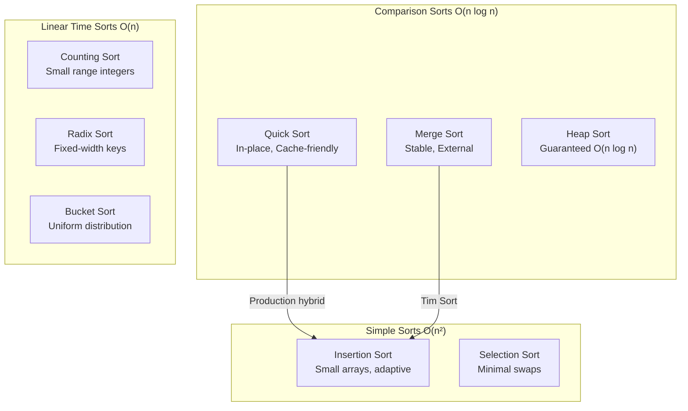
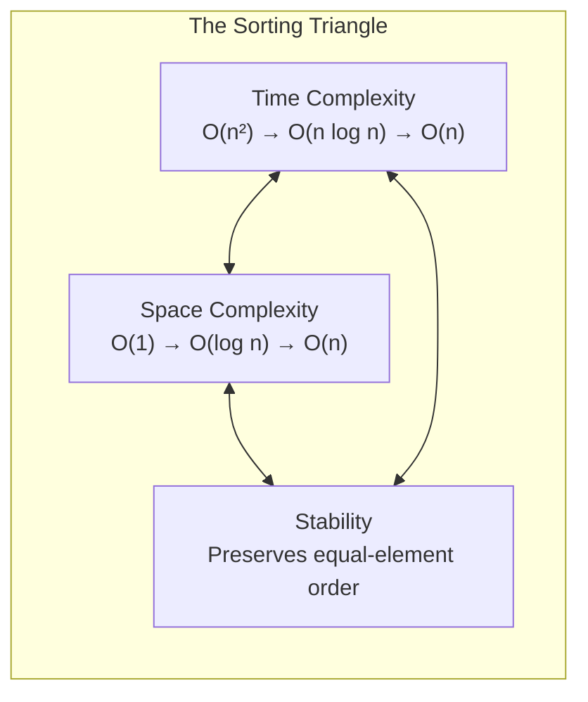
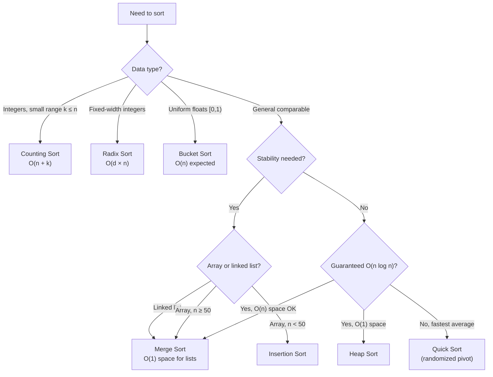

# Sorting Algorithms: Complexity, Stability, and Use Cases

A comprehensive guide to sorting algorithms covering fundamental concepts, implementation details, performance characteristics, and real-world applications. Learn when to use each algorithm and understand the engineering trade-offs behind production sorting implementations.

<figure>



<figcaption>Sorting algorithm taxonomy showing complexity classes and key characteristics</figcaption>

</figure>

## Abstract

Sorting algorithms exist on a spectrum defined by three fundamental constraints:

<figure>



<figcaption>Every sorting algorithm makes trade-offs between time, space, and stability—optimizing one often sacrifices another.</figcaption>
</figure>

**Core mental model:**

- **Comparison sorts** (Quick Sort, Merge Sort, Heap Sort) are bounded by Ω(n log n)—a mathematical limit proven via decision trees. You cannot comparison-sort faster without exploiting input structure.
- **Non-comparison sorts** (Counting, Radix, Bucket) achieve O(n) by trading generality for constraints on input type (integers, fixed-width keys, uniform distribution).
- **Production sorts** (Tim Sort, Introsort, pdqsort) are hybrids that detect patterns and switch strategies—they exploit the gap between theoretical bounds and real-world data characteristics.

**The practical insight**: Cache locality and branch prediction often matter more than asymptotic complexity. Quick Sort's 2-3× speedup over Heap Sort comes from sequential memory access, not Big-O.

## Core Concepts

### The Fundamental Trade-offs

1. **Time vs Space**: Merge Sort uses O(n) extra space for O(n log n) guaranteed time. Quick Sort uses O(log n) stack space but has O(n²) worst case. This trade-off exists because maintaining sorted subarrays during merge requires temporary storage.

2. **Stability vs Performance**: Stable sorts preserve relative order of equal elements—critical for multi-key sorting (sort by department, then by salary within department). Quick Sort sacrifices stability for in-place partitioning; Merge Sort maintains stability but needs auxiliary arrays.

3. **Adaptivity**: Some algorithms (Insertion Sort, Tim Sort) detect existing order and exploit it. Tim Sort achieves O(n) on already-sorted data by identifying "runs" of ordered elements. Non-adaptive algorithms (Heap Sort, standard Quick Sort) perform the same regardless of input order.

4. **In-place vs Out-of-place**: In-place algorithms modify the original array using O(1) or O(log n) extra space; out-of-place algorithms need O(n) auxiliary memory. The choice affects memory pressure in constrained environments.

### The Ω(n log n) Comparison Sort Lower Bound

Comparison-based sorting cannot do better than Ω(n log n) in the worst case. This is a mathematical limit, not a practical limitation.

**The decision tree argument**: Any comparison-based algorithm can be modeled as a binary decision tree where each node represents a comparison. With n elements, there are n! possible permutations. The tree must have at least n! leaves (one per permutation). A binary tree of height h has at most 2^h leaves, so:

$$
2^h \geq n! \implies h \geq \log_2(n!) \approx n \log n
$$

Using Stirling's approximation: $n! \approx \sqrt{2\pi n}(n/e)^n$, giving $\log(n!) = \Theta(n \log n)$.

**Information-theoretic interpretation**: Each comparison yields one bit of information. To distinguish among n! possibilities, you need at least log₂(n!) bits—roughly n log n comparisons.

**Breaking the barrier**: Non-comparison sorts (Counting, Radix, Bucket) achieve O(n) by exploiting input structure—they don't compare elements, they examine digits or values directly. This requires constraints: bounded integer range, fixed-width keys, or uniform distribution.

## Comparison-Based Sorting

### Bubble Sort

**Design rationale**: Bubble Sort repeatedly swaps adjacent elements if they're in wrong order. Largest elements "bubble up" to the end with each pass. The algorithm exists primarily for educational purposes—its simplicity makes it ideal for teaching sorting concepts, but its O(n²) time makes it impractical for production use.

```typescript collapse={1-4, 14-16}
function bubbleSort(arr: number[]): number[] {
  const n = arr.length
  for (let i = 0; i < n - 1; i++) {
    let swapped = false
    // Inner loop: compare adjacent pairs
    for (let j = 0; j < n - i - 1; j++) {
      if (arr[j] > arr[j + 1]) {
        ;[arr[j], arr[j + 1]] = [arr[j + 1], arr[j]]
        swapped = true
      }
    }
    if (!swapped) break // Optimization: early exit if sorted
  }
  return arr
}
```

| Property | Value                                |
| -------- | ------------------------------------ |
| Time     | O(n²) worst/avg, O(n) best (sorted)  |
| Space    | O(1)                                 |
| Stable   | Yes                                  |
| In-place | Yes                                  |
| Use case | Educational, detecting sorted arrays |

**Why the `swapped` flag exists**: Without it, Bubble Sort always runs O(n²) even on sorted input. The flag enables O(n) detection of already-sorted arrays—one of Bubble Sort's few practical uses.

**When to actually use it**: Almost never in production. The only legitimate scenarios are: (1) teaching sorting fundamentals, (2) checking if an array is already sorted (though a simple linear scan is clearer), or (3) extremely memory-constrained embedded systems with n < 10 where code size matters more than performance.

### Selection Sort

**Design rationale**: Selection Sort finds the minimum element and places it at the beginning, repeating for the remaining array. The key insight is that it performs exactly n-1 swaps regardless of input—making it optimal when write operations are expensive relative to comparisons.

```typescript collapse={1-3, 15-17}
function selectionSort(arr: number[]): number[] {
  const n = arr.length
  for (let i = 0; i < n - 1; i++) {
    let minIdx = i
    // Find minimum in unsorted portion
    for (let j = i + 1; j < n; j++) {
      if (arr[j] < arr[minIdx]) {
        minIdx = j
      }
    }
    // Single swap per iteration
    if (minIdx !== i) {
      ;[arr[i], arr[minIdx]] = [arr[minIdx], arr[i]]
    }
  }
  return arr
}
```

| Property | Value                            |
| -------- | -------------------------------- |
| Time     | O(n²) always                     |
| Space    | O(1)                             |
| Stable   | No (swapping breaks stability)   |
| In-place | Yes                              |
| Use case | Minimizing swaps (memory writes) |

**Why it's unstable**: When swapping the minimum with the current position, equal elements can change relative order. For example, sorting `[2a, 2b, 1]` swaps `2a` with `1`, producing `[1, 2b, 2a]`—the two 2s reversed.

**When to use it**: Flash memory (EEPROM, NAND) with limited write cycles—Selection Sort's exactly n-1 writes can extend device lifespan. Also valuable in robotics or warehouse automation where physically moving objects is expensive. Database systems sometimes use it when updating index pointers costs more than comparisons.

### Insertion Sort

**Design rationale**: Insertion Sort builds a sorted array one element at a time, inserting each element into its correct position within the already-sorted prefix. Its power lies in adaptivity—it does O(k) work where k is the number of inversions (out-of-order pairs). For nearly-sorted data, k ≈ n, giving O(n) performance.

```typescript collapse={1-3, 14-16}
function insertionSort(arr: number[]): number[] {
  const n = arr.length
  for (let i = 1; i < n; i++) {
    const key = arr[i]
    let j = i - 1
    // Shift elements right until correct position found
    while (j >= 0 && arr[j] > key) {
      arr[j + 1] = arr[j]
      j--
    }
    arr[j + 1] = key
  }
  return arr
}
```

| Property | Value                                    |
| -------- | ---------------------------------------- |
| Time     | O(n²) worst/avg, O(n) best               |
| Space    | O(1)                                     |
| Stable   | Yes                                      |
| In-place | Yes                                      |
| Adaptive | Yes - O(n + k) where k = inversions      |
| Use case | Small arrays, nearly sorted data, online |

**Why hybrid sorts use Insertion Sort for small subarrays**: For n < 20-50 elements, Insertion Sort's low overhead (no recursion, no function calls, tight inner loop) beats Quick Sort and Merge Sort despite worse asymptotic complexity. The crossover point depends on hardware but typically falls in the 16-64 element range.

**Online sorting**: Insertion Sort processes elements as they arrive—each new element is inserted into the sorted portion in O(n) worst case. This makes it suitable for real-time systems where data streams continuously and you need a sorted view at any moment.

**Cache behavior**: The inner loop shifts elements sequentially through memory, maximizing L1 cache hits. Combined with branch predictability (the while condition becomes consistent after a few iterations), this makes Insertion Sort remarkably fast on small arrays.

### Merge Sort

**Design rationale**: Merge Sort uses divide-and-conquer: split the array in half, recursively sort each half, then merge the sorted halves. The key insight is that merging two sorted arrays takes O(n) time with O(n) space—trading memory for guaranteed O(n log n) worst-case performance and stability.

```typescript collapse={1-10, 18-27}
function mergeSort(arr: number[]): number[] {
  if (arr.length <= 1) return arr

  const mid = Math.floor(arr.length / 2)
  const left = mergeSort(arr.slice(0, mid))
  const right = mergeSort(arr.slice(mid))

  return merge(left, right)
}

function merge(left: number[], right: number[]): number[] {
  const result: number[] = []
  let i = 0,
    j = 0

  // Key: use <= for stability (equal elements from left come first)
  while (i < left.length && j < right.length) {
    if (left[i] <= right[j]) {
      result.push(left[i++])
    } else {
      result.push(right[j++])
    }
  }

  return result.concat(left.slice(i)).concat(right.slice(j))
}
```

| Property       | Value                                            |
| -------------- | ------------------------------------------------ |
| Time           | O(n log n) always                                |
| Space          | O(n)                                             |
| Stable         | Yes                                              |
| In-place       | No                                               |
| Parallelizable | Yes - independent subproblems                    |
| Use case       | Linked lists, external sorting, stability needed |

**Why O(n) space is unavoidable for array-based stable sorting**: To maintain stability while merging, you must preserve the relative order of equal elements. This requires comparing elements from both halves without modifying either until the comparison is complete—necessitating auxiliary storage.

**Linked list optimization**: For linked lists, merge requires only O(1) extra space—you just rewire node pointers rather than copying elements. This makes Merge Sort optimal for linked list sorting.

**External sorting**: When data exceeds RAM, Merge Sort's sequential access pattern (read chunks, sort in memory, write sorted chunks, k-way merge) minimizes disk seeks. Database systems (PostgreSQL, MySQL) use merge-based algorithms for large result sets.

**Bottom-up variant**: Iterative Merge Sort avoids recursion overhead by starting with size-1 subarrays and doubling the merge size each pass. Same O(n log n) time, but eliminates O(log n) stack frames.

### Quick Sort

**Design rationale**: Quick Sort picks a pivot element, partitions the array so smaller elements are left of the pivot and larger elements are right, then recursively sorts the partitions. Its power comes from in-place partitioning with excellent cache locality—sequential memory access during partition makes it 2-3× faster than Heap Sort in practice despite similar Big-O.

```typescript collapse={1-10}
function quickSort(arr: number[], low: number = 0, high: number = arr.length - 1): number[] {
  if (low < high) {
    const pivotIdx = partition(arr, low, high)
    quickSort(arr, low, pivotIdx - 1)
    quickSort(arr, pivotIdx + 1, high)
  }
  return arr
}

// Lomuto partition scheme - simpler but ~3× more swaps than Hoare
function partition(arr: number[], low: number, high: number): number {
  const pivot = arr[high]
  let i = low - 1

  for (let j = low; j < high; j++) {
    if (arr[j] < pivot) {
      i++
      ;[arr[i], arr[j]] = [arr[j], arr[i]]
    }
  }
  ;[arr[i + 1], arr[high]] = [arr[high], arr[i + 1]]
  return i + 1
}
```

| Property | Value                           |
| -------- | ------------------------------- |
| Time     | O(n log n) avg, O(n²) worst     |
| Space    | O(log n) stack space            |
| Stable   | No                              |
| In-place | Yes                             |
| Use case | General purpose, cache-friendly |

**Pivot selection strategies and their trade-offs**:

| Strategy          | Worst Case Trigger       | Overhead | Use When                    |
| ----------------- | ------------------------ | -------- | --------------------------- |
| First/Last        | Sorted/reverse input     | O(1)     | Never in production         |
| Random            | Astronomically unlikely  | O(1)     | Default choice              |
| Median-of-three   | Crafted adversarial      | O(1)     | Known random input          |
| Median-of-medians | None (guaranteed O(n lg n)) | O(n)     | Adversarial input possible  |

**3-Way Partition (Dutch National Flag Problem)**: Essential for arrays with many duplicates. Standard 2-way partition degrades to O(n²) when all elements are equal; 3-way partition handles this in O(n) by grouping equal elements in the middle.

```typescript collapse={1-6, 22-25}
function quickSort3Way(arr: number[], low: number, high: number): void {
  if (low >= high) return

  let lt = low    // arr[low..lt-1] < pivot
  let gt = high   // arr[gt+1..high] > pivot
  let i = low + 1
  const pivot = arr[low]

  // Partition into: <pivot | ==pivot | >pivot
  while (i <= gt) {
    if (arr[i] < pivot) {
      ;[arr[lt], arr[i]] = [arr[i], arr[lt]]
      lt++
      i++
    } else if (arr[i] > pivot) {
      ;[arr[i], arr[gt]] = [arr[gt], arr[i]]
      gt--
    } else {
      i++
    }
  }

  quickSort3Way(arr, low, lt - 1)
  quickSort3Way(arr, gt + 1, high)
}
```

**Why Quick Sort dominates production sorting**: C++ `std::sort()` (Introsort), Go's `sort.Sort()` (pdqsort since Go 1.19), and Rust's `sort_unstable` all use Quick Sort variants. The combination of in-place sorting, cache-friendly access, and predictable branch behavior makes it 2-3× faster than alternatives on random data.

### Heap Sort

**Design rationale**: Heap Sort builds a max-heap from the array, then repeatedly extracts the maximum to build the sorted array from the end. It's the only comparison sort that's both in-place (O(1) space) and guaranteed O(n log n)—no pathological inputs exist. The trade-off is poor cache locality: parent-child relationships (i, 2i+1, 2i+2) cause random memory access patterns.

```typescript collapse={1-6, 18-31}
function heapSort(arr: number[]): number[] {
  const n = arr.length

  // Build max-heap bottom-up in O(n) time
  for (let i = Math.floor(n / 2) - 1; i >= 0; i--) {
    heapify(arr, n, i)
  }

  // Extract max n times: O(n log n)
  for (let i = n - 1; i > 0; i--) {
    ;[arr[0], arr[i]] = [arr[i], arr[0]]
    heapify(arr, i, 0)
  }

  return arr
}

function heapify(arr: number[], n: number, i: number): void {
  let largest = i
  const left = 2 * i + 1
  const right = 2 * i + 2

  if (left < n && arr[left] > arr[largest]) largest = left
  if (right < n && arr[right] > arr[largest]) largest = right

  if (largest !== i) {
    ;[arr[i], arr[largest]] = [arr[largest], arr[i]]
    heapify(arr, n, largest)
  }
}
```

| Property       | Value                          |
| -------------- | ------------------------------ |
| Time           | O(n log n) always              |
| Space          | O(1)                           |
| Stable         | No                             |
| In-place       | Yes                            |
| Cache-friendly | No - random access pattern     |
| Use case       | Guaranteed O(n log n) in-place |

**Why build-heap is O(n), not O(n log n)**: Intuition suggests n insertions at O(log n) each = O(n log n). But bottom-up heapify does less work: most nodes are near the bottom (height 0-1), few are at the top. Summing the work: $\sum_{h=0}^{\log n} \frac{n}{2^{h+1}} \cdot O(h) = O(n)$.

**Why Heap Sort loses to Quick Sort in practice**: The parent-child index relationships (i → 2i+1, 2i+2) cause cache misses. For a 10M element array, parent and children are ~5M indices apart—far beyond any cache line. Branch prediction also suffers: the comparison `arr[left] > arr[largest]` vs `arr[right] > arr[largest]` is essentially random.

**When to use Heap Sort**: (1) Real-time systems where O(n²) worst-case is unacceptable and you can't afford O(n) auxiliary space. (2) Partial sorting—finding top-k elements in O(n + k log n). (3) Priority queue operations where you need repeated extract-min/max.

## Non-Comparison Sorting

Non-comparison sorts break the Ω(n log n) barrier by examining element values directly rather than comparing pairs. The trade-off: they require constraints on input type (integers, fixed-width keys, uniform distribution).

### Counting Sort

**Design rationale**: Counting Sort counts occurrences of each distinct value, then uses cumulative counts to place elements in their final positions. It achieves O(n + k) time where k is the value range—faster than comparison sorts when k = O(n). The trade-off is O(k) space for the count array, making it impractical when k >> n.

```typescript collapse={1-10}
function countingSort(arr: number[]): number[] {
  if (arr.length === 0) return arr

  const max = Math.max(...arr)
  const min = Math.min(...arr)
  const range = max - min + 1
  const count = new Array(range).fill(0)
  const output = new Array(arr.length)

  // Phase 1: Count occurrences - O(n)
  for (const num of arr) {
    count[num - min]++
  }

  // Phase 2: Cumulative counts give final positions - O(k)
  for (let i = 1; i < range; i++) {
    count[i] += count[i - 1]
  }

  // Phase 3: Build output (backwards for stability) - O(n)
  for (let i = arr.length - 1; i >= 0; i--) {
    output[count[arr[i] - min] - 1] = arr[i]
    count[arr[i] - min]--
  }

  return output
}
```

| Property | Value                          |
| -------- | ------------------------------ |
| Time     | O(n + k) where k is range      |
| Space    | O(n + k)                       |
| Stable   | Yes (if implemented correctly) |
| Use case | Small range of integers        |

**Why iterate backwards for stability**: When placing elements, going backwards ensures that among equal values, the last one encountered (rightmost in original) goes to the highest index position. This preserves relative order.

**When k makes sense**: Counting Sort is optimal when k ≤ n. For exam scores (0-100) with 1000 students: O(1100) beats O(1000 × 10). For 32-bit integers (k = 4 billion): use Radix Sort instead.

**Real-world applications**: Image processing (8-bit pixels, k=256), grading systems (0-100), character frequency counting (k=26 for lowercase English), histogram generation.

### Radix Sort

**Design rationale**: Radix Sort processes elements digit-by-digit, using a stable sort (typically Counting Sort) as a subroutine. LSD (Least Significant Digit) Radix Sort processes from rightmost digit to leftmost; stability ensures earlier digits remain sorted when processing later digits. Time is O(d × (n + k)) where d is digit count and k is the radix (base)—effectively O(n) when d is constant.

```typescript collapse={1-5, 14-37}
function radixSort(arr: number[]): number[] {
  if (arr.length === 0) return arr

  const max = Math.max(...arr)

  // LSD: sort by each digit position, least significant first
  for (let exp = 1; Math.floor(max / exp) > 0; exp *= 10) {
    countingSortByDigit(arr, exp)
  }

  return arr
}

function countingSortByDigit(arr: number[], exp: number): void {
  const n = arr.length
  const output = new Array(n)
  const count = new Array(10).fill(0)

  for (const num of arr) {
    const digit = Math.floor(num / exp) % 10
    count[digit]++
  }

  for (let i = 1; i < 10; i++) {
    count[i] += count[i - 1]
  }

  for (let i = n - 1; i >= 0; i--) {
    const digit = Math.floor(arr[i] / exp) % 10
    output[count[digit] - 1] = arr[i]
    count[digit]--
  }

  for (let i = 0; i < n; i++) {
    arr[i] = output[i]
  }
}
```

| Property | Value                            |
| -------- | -------------------------------- |
| Time     | O(d × (n + k)) where d = digits  |
| Space    | O(n + k)                         |
| Stable   | Yes                              |
| Use case | Fixed-length integers, strings   |

**LSD vs MSD (Most Significant Digit)**:

| Variant | Process Order     | Stability Required | Best For              |
| ------- | ----------------- | ------------------ | --------------------- |
| LSD     | Right → Left      | Yes (critical)     | Fixed-width integers  |
| MSD     | Left → Right      | Not required       | Variable-length strings, early termination |

**Why LSD needs stability**: After sorting by units digit, `[170, 45, 75, 90]` becomes `[170, 90, 45, 75]`. When sorting by tens digit, 170 and 75 both have tens digit 7. Stability ensures 170 stays before 75 (preserving the units-digit order).

**Choosing the radix**: Base 10 is intuitive but not optimal. Base 256 (byte-based) reduces passes for 32-bit integers from 10 to 4, at the cost of larger count arrays. For 64-bit integers, 8 passes with base 256 is typically faster than 20 passes with base 10.

**Real-world applications**: IP address sorting (4 passes, base 256), suffix array construction in bioinformatics (DNA alphabet k=4), timestamp sorting (8 passes for 64-bit Unix timestamps).

### Bucket Sort

**Design rationale**: Bucket Sort distributes elements into buckets based on their value, sorts each bucket (typically with Insertion Sort), then concatenates results. It achieves O(n) expected time when elements are uniformly distributed—each bucket contains O(1) elements on average, making per-bucket sorting O(1). The trade-off: skewed distributions degrade to O(n²) when many elements land in one bucket.

```typescript collapse={1-5, 17-18}
function bucketSort(arr: number[], bucketCount: number = 10): number[] {
  if (arr.length === 0) return arr

  const min = Math.min(...arr)
  const max = Math.max(...arr)
  const bucketSize = (max - min) / bucketCount + 1
  const buckets: number[][] = Array.from({ length: bucketCount }, () => [])

  // Distribute: O(n)
  for (const num of arr) {
    const idx = Math.floor((num - min) / bucketSize)
    buckets[Math.min(idx, bucketCount - 1)].push(num)
  }

  // Sort + concatenate: O(n) expected if uniform
  return buckets.flatMap((bucket) => insertionSort(bucket))
}
```

| Property | Value                                |
| -------- | ------------------------------------ |
| Time     | O(n) expected, O(n²) worst           |
| Space    | O(n + k) where k = bucket count      |
| Stable   | Depends on bucket sorting algorithm  |
| Use case | Uniformly distributed floating point |

**Why uniform distribution matters**: With n elements and n buckets, uniform distribution means each bucket gets ~1 element (expected). Insertion Sort on 1-element arrays is O(1). Total: O(n) distribution + O(n × 1) sorting = O(n). Skewed distribution (all elements in one bucket) degrades to O(n²) Insertion Sort.

**Choosing bucket count**: Too few buckets → many elements per bucket → slower sorting. Too many buckets → wasted space + overhead. Rule of thumb: use n buckets for n elements when distribution is uniform.

**Stability**: Bucket Sort is stable if the per-bucket sort is stable and elements are placed in buckets in order. Using stable Insertion Sort and processing buckets left-to-right preserves stability.

**Real-world applications**: Sorting uniformly distributed floats in [0,1) (graphics, random samples), sensor data with known ranges, geographic coordinates within bounded regions.

## Algorithm Comparison

### Quick Reference Table

| Algorithm      | Best       | Average    | Worst      | Space    | Stable | Adaptive |
| -------------- | ---------- | ---------- | ---------- | -------- | ------ | -------- |
| Bubble Sort    | O(n)       | O(n²)      | O(n²)      | O(1)     | Yes    | Yes      |
| Selection Sort | O(n²)      | O(n²)      | O(n²)      | O(1)     | No     | No       |
| Insertion Sort | O(n)       | O(n²)      | O(n²)      | O(1)     | Yes    | Yes      |
| Merge Sort     | O(n log n) | O(n log n) | O(n log n) | O(n)     | Yes    | No       |
| Quick Sort     | O(n log n) | O(n log n) | O(n²)      | O(log n) | No     | No       |
| Heap Sort      | O(n log n) | O(n log n) | O(n log n) | O(1)     | No     | No       |
| Counting Sort  | O(n + k)   | O(n + k)   | O(n + k)   | O(n + k) | Yes    | N/A      |
| Radix Sort     | O(dn)      | O(dn)      | O(dn)      | O(n + k) | Yes    | N/A      |
| Bucket Sort    | O(n)       | O(n)       | O(n²)      | O(n + k) | Yes*   | N/A      |

*Bucket Sort stability depends on the per-bucket sorting algorithm used.

### Decision Flowchart

<figure>



<figcaption>Algorithm selection based on data constraints and requirements</figcaption>
</figure>

## Why Quick Sort Beats Heap Sort in Practice

Both Quick Sort and Heap Sort are in-place, unstable, O(n log n) average-case algorithms. On paper, Heap Sort looks better with its O(n log n) **guaranteed** worst case. Yet Quick Sort is the preferred choice in most standard libraries. Here's why:

### 1. Cache Locality

**Quick Sort wins decisively here.**

```
Quick Sort: Sequential memory access during partition
┌───┬───┬───┬───┬───┬───┬───┬───┐
│ 3 │ 1 │ 4 │ 1 │ 5 │ 9 │ 2 │ 6 │  ← Scans left-to-right
└───┴───┴───┴───┴───┴───┴───┴───┘
  →   →   →   →   →   →   →   →

Heap Sort: Jumps between parent and children (2i+1, 2i+2)
┌───┬───┬───┬───┬───┬───┬───┬───┐
│ 0 │ 1 │ 2 │ 3 │ 4 │ 5 │ 6 │ 7 │  ← Index
└───┴───┴───┴───┴───┴───┴───┴───┘
  ↓───────↘───────↘
      ↓───────↘───────↘
          (Parent-child jumps cause cache misses)
```

- **Quick Sort**: The partition step scans the array sequentially. Adjacent elements are accessed together, maximizing L1/L2 cache hits.
- **Heap Sort**: Heapify jumps between index `i` and indices `2i+1`, `2i+2`. For large arrays, parent and children are far apart in memory, causing frequent cache misses.

**Real impact**: On modern CPUs, a cache miss costs 100-300 cycles ([Intel Optimization Manual](https://www.intel.com/content/www/us/en/developer/articles/technical/intel-sdm.html)). Quick Sort's sequential access pattern can be 2-3x faster than Heap Sort for large arrays purely due to cache behavior.

### 2. Lower Constant Factors

Quick Sort does less work per element ([Sedgewick & Wayne, Algorithms 4th Ed](https://algs4.cs.princeton.edu/)):

| Operation          | Quick Sort        | Heap Sort            |
| ------------------ | ----------------- | -------------------- |
| Comparisons        | ~1.4n log n       | ~2n log n            |
| Swaps              | ~0.3n log n       | ~n log n             |
| Pointer arithmetic | Simple (i++, j--) | Complex (2i+1, 2i+2) |

```typescript
// Quick Sort partition - simple operations
while (arr[i] < pivot) i++    // Simple increment
while (arr[j] > pivot) j--    // Simple decrement

// Heap Sort heapify - more complex
left = 2 * i + 1              // Multiplication + addition
right = 2 * i + 2             // Multiplication + addition
if (left < n && arr[left] > arr[largest]) ...
if (right < n && arr[right] > arr[largest]) ...
```

### 3. Branch Prediction

Modern CPUs predict which way branches (if statements) will go. Mispredictions are costly (~15-20 cycles).

**Quick Sort**: After a few iterations, the CPU learns the pattern. Elements mostly go one way based on their relation to the pivot.

**Heap Sort**: The comparison `arr[left] > arr[largest]` vs `arr[right] > arr[largest]` is essentially random - the CPU can't predict which child is larger, causing frequent mispredictions.

```
Branch prediction success rate (approximate):
- Quick Sort partition: 90-95%
- Heap Sort heapify:    50-60%
```

### 4. Practical Worst Case is Avoidable

Quick Sort's O(n²) worst case sounds scary, but it's easily prevented:

```typescript
// Randomized pivot - O(n²) becomes astronomically unlikely
function partition(arr: number[], low: number, high: number): number {
  // Random pivot selection
  const randomIdx = low + Math.floor(Math.random() * (high - low + 1))
  ;[arr[randomIdx], arr[high]] = [arr[high], arr[randomIdx]]

  // ... rest of partition
}
```

**Probability analysis**:

- For O(n²) to occur, you need to consistently pick the worst pivot
- With random pivots, probability of O(n²) is approximately `1/n!`
- For n = 1000: probability ≈ 1 in 10^2567 (effectively impossible)

**Median-of-three** is another practical defense:

```typescript
// Pick median of first, middle, last
const mid = Math.floor((low + high) / 2)
if (arr[low] > arr[mid]) swap(arr, low, mid)
if (arr[low] > arr[high]) swap(arr, low, high)
if (arr[mid] > arr[high]) swap(arr, mid, high)
// Use arr[mid] as pivot
```

### 5. Space Complexity: O(1) vs O(log n) is Negligible

Theoretically, Heap Sort uses O(1) space while Quick Sort uses O(log n) for the recursion stack. In practice, this difference is meaningless:

| Array Size    | Quick Sort Stack Space | Actual Memory |
| ------------- | ---------------------- | ------------- |
| 1,000         | log₂(1000) ≈ 10 frames | ~200 bytes    |
| 1,000,000     | log₂(10⁶) ≈ 20 frames  | ~400 bytes    |
| 10,000,000    | log₂(10⁷) ≈ 24 frames  | ~480 bytes    |
| 1,000,000,000 | log₂(10⁹) ≈ 30 frames  | ~600 bytes    |

**Key insight**: Even for a billion elements, Quick Sort uses only ~600 bytes of stack space. When you're sorting gigabytes of data, 600 bytes is nothing.

For comparison, the array itself for 10 million 64-bit integers takes **80 MB**. The 400 bytes of stack space is 0.0005% of that.

### 6. Benchmark Reality

Typical benchmarks show Quick Sort 2-3x faster than Heap Sort:

```
Sorting 10,000,000 random integers (typical results):
┌─────────────┬──────────────┬─────────┐
│ Algorithm   │ Time (ms)    │ Ratio   │
├─────────────┼──────────────┼─────────┤
│ Quick Sort  │ ~800         │ 1.0x    │
│ Heap Sort   │ ~2000        │ 2.5x    │
│ Merge Sort  │ ~1200        │ 1.5x    │
└─────────────┴──────────────┴─────────┘
```

### When to Actually Use Heap Sort

Despite Quick Sort's advantages, Heap Sort has its place:

1. **Hard real-time systems**: When O(n²) worst case is absolutely unacceptable and you can't use extra space for Merge Sort
2. **Embedded systems**: When stack space is truly constrained (unusual today)
3. **Security-critical code**: When adversarial input could trigger Quick Sort's worst case (though randomized pivot largely solves this)
4. **Partial sorting**: Finding top-k elements with a heap is O(n log k)

### Summary: Quick Sort vs Heap Sort

| Factor            | Quick Sort        | Heap Sort    | Winner     |
| ----------------- | ----------------- | ------------ | ---------- |
| Cache locality    | Sequential access | Random jumps | Quick Sort |
| Comparisons       | ~1.4n log n       | ~2n log n    | Quick Sort |
| Swaps             | ~0.3n log n       | ~n log n     | Quick Sort |
| Branch prediction | Predictable       | Random       | Quick Sort |
| Worst case        | O(n²) (avoidable) | O(n log n)   | Heap Sort  |
| Space             | O(log n)          | O(1)         | Tie\*      |
| Practical speed   | Fast              | 2-3x slower  | Quick Sort |

\*The space difference is negligible in practice

**Bottom line**: Use Quick Sort (with randomized pivot) as your default. The theoretical worst case is a non-issue in practice, and the real-world performance gains from cache efficiency and lower constant factors are substantial.

## Production Hybrid Algorithms

Modern language runtimes don't use any single algorithm—they combine multiple approaches to exploit each algorithm's strengths while avoiding its weaknesses.

### Tim Sort (Python, Java Objects, JavaScript)

Tim Sort, developed by Tim Peters for Python in 2002, combines Merge Sort and Insertion Sort. It exploits a key observation: real-world data often contains pre-existing order ("runs").

**How it works**:

1. Scan the array for natural runs (already sorted sequences, including reversed ones which are flipped)
2. Ensure minimum run length (typically 32-64) by extending short runs with Insertion Sort
3. Merge runs using an optimized merge that includes "galloping mode" when one run dominates

**Why it's effective**: On random data, Tim Sort performs like Merge Sort. On partially sorted data (common in practice—appending to sorted lists, nearly-sorted databases), it approaches O(n) because natural runs require minimal merging.

### Introsort (C++ STL)

Introsort (introspective sort), invented by David Musser in 1997, starts with Quick Sort but monitors recursion depth. If depth exceeds 2 × log₂(n), it switches to Heap Sort to guarantee O(n log n) worst case. For small subarrays (typically n < 16), it uses Insertion Sort.

**Design insight**: Introsort gets Quick Sort's average-case speed (cache locality, low constant factors) with Heap Sort's worst-case guarantee—the best of both worlds.

### Pattern-Defeating Quicksort (pdqsort) (Go, Rust unstable)

pdqsort, created by Orson Peters, extends Introsort with pattern detection. It recognizes sorted, reverse-sorted, and equal-element sequences, handling them in O(n) time. It also uses BlockQuicksort's branchless partitioning for better branch prediction on random data.

**Adoption**: Go switched to pdqsort in Go 1.19 (via `slices.Sort` in Go 1.22+). Rust uses pdqsort for `sort_unstable`. Benchmarks show 2-60× speedup over traditional Quick Sort on patterned data.

### Language Standard Library Implementations

| Language   | Stable Sort           | Unstable Sort      | Notes                                                                 |
| ---------- | --------------------- | ------------------ | --------------------------------------------------------------------- |
| JavaScript | Tim Sort              | —                  | Stable required since ES2019 ([V8 blog](https://v8.dev/features/stable-sort)) |
| Python     | Tim Sort              | —                  | `list.sort()` and `sorted()` both stable                              |
| Java       | Tim Sort (Objects)    | Dual-pivot Quick Sort (primitives) | Objects need stability; primitives prioritize speed |
| C++        | —                     | Introsort          | `std::stable_sort` uses Merge Sort; `std::sort` uses Introsort        |
| Go         | —                     | pdqsort            | Since Go 1.19; `slices.Sort` in Go 1.22+                              |
| Rust       | Tim Sort              | pdqsort            | `sort()` vs `sort_unstable()`                                         |

**Key insight**: Every production implementation is a hybrid. The choice reflects trade-offs: stability (Tim Sort for objects), raw speed (pdqsort for unstable), or guaranteed worst-case (Introsort).

### Parallel Sorting

For multi-core systems, parallelization can significantly reduce wall-clock time:

- **Merge Sort**: Natural parallelism—each recursive subproblem is independent. Split work across cores, then merge results.
- **Quick Sort**: Parallelize left and right partitions after each pivot selection. Less balanced than Merge Sort due to pivot variance.
- **Sample Sort**: Extension of Quick Sort for distributed systems. Sample elements to choose good splitters, distribute to processors, sort locally, merge.
- **Bitonic Sort**: O(n log² n) comparisons but highly parallel (O(log² n) parallel steps). Used in GPU sorting where massive parallelism compensates for extra work.

## Conclusion

Sorting algorithm selection depends on three factors: **data characteristics**, **system constraints**, and **requirements**.

For general-purpose sorting on comparable data, use your language's default—modern implementations (Tim Sort, Introsort, pdqsort) are highly optimized hybrids. For integers with bounded range, Counting Sort or Radix Sort achieve O(n). For stability, Merge Sort or Tim Sort. For guaranteed O(n log n) in O(1) space, Heap Sort.

The Ω(n log n) lower bound for comparison sorts is mathematical—you cannot do better without exploiting input structure. Non-comparison sorts (Counting, Radix, Bucket) trade generality for speed by examining values directly.

In practice, cache locality and branch prediction often matter more than asymptotic complexity. Quick Sort's 2-3× advantage over Heap Sort comes from sequential memory access, not Big-O. Profile before optimizing.

## Appendix

### Prerequisites

- Big-O notation and complexity analysis
- Basic data structures (arrays, linked lists, heaps)
- Understanding of recursion and divide-and-conquer strategies

### Terminology

- **Stable sort**: A sort that preserves the relative order of elements with equal keys
- **In-place sort**: A sort that uses O(1) or O(log n) auxiliary space (not counting the input array)
- **Adaptive sort**: A sort whose performance improves when input is partially sorted
- **Comparison sort**: A sort that only examines elements through pairwise comparisons
- **Non-comparison sort**: A sort that examines element values directly (digits, ranges)
- **Inversion**: A pair of elements (i, j) where i < j but arr[i] > arr[j]
- **Run**: A maximal sequence of consecutive elements that is already sorted

### Summary

- **Comparison sorts** are bounded by Ω(n log n)—proven via decision tree argument
- **Quick Sort** dominates general-purpose sorting due to cache locality and low constants, despite O(n²) worst case
- **Merge Sort** is preferred when stability or guaranteed O(n log n) is required
- **Heap Sort** is the only comparison sort that's both in-place and guaranteed O(n log n)
- **Non-comparison sorts** (Counting, Radix, Bucket) achieve O(n) with input constraints
- **Production sorts** (Tim Sort, Introsort, pdqsort) are hybrids that detect patterns and switch strategies

### References

**Specifications and Foundational Texts:**

- [Introduction to Algorithms (CLRS), 4th Edition](https://mitpress.mit.edu/9780262046305/introduction-to-algorithms/) - Chapter 8.1: Comparison sort lower bound proofs; Chapter 7: Quicksort; Chapter 6: Heapsort
- [Algorithms, 4th Edition (Sedgewick & Wayne)](https://algs4.cs.princeton.edu/) - Chapters 2.1-2.4: Sorting implementations with empirical analysis
- [The Art of Computer Programming, Vol. 3: Sorting and Searching](https://www-cs-faculty.stanford.edu/~knuth/taocp.html) - Knuth's definitive reference

**Algorithm Papers and Design Documents:**

- [Pattern-defeating Quicksort (pdqsort)](https://arxiv.org/abs/2106.05123) - Orson Peters' algorithm combining Quick Sort, Heap Sort, and pattern detection
- [Introsort (Wikipedia)](https://en.wikipedia.org/wiki/Introsort) - David Musser's 1997 introspective sort combining Quick Sort and Heap Sort
- [Tim Sort (Wikipedia)](https://en.wikipedia.org/wiki/Timsort) - Tim Peters' 2002 hybrid Merge Sort + Insertion Sort

**Implementation References:**

- [V8 Array.sort() Implementation](https://v8.dev/blog/array-sort) - JavaScript engine Tim Sort implementation details
- [V8 Stable Sort](https://v8.dev/features/stable-sort) - ECMAScript 2019 stable sort requirement
- [Go pdqsort Issue #50154](https://github.com/golang/go/issues/50154) - Go 1.19 pdqsort adoption discussion
- [pdqsort GitHub Repository](https://github.com/orlp/pdqsort) - Reference implementation

**Performance Analysis:**

- [Intel 64 and IA-32 Architectures Optimization Reference Manual](https://www.intel.com/content/www/us/en/developer/articles/technical/intel-sdm.html) - CPU cache behavior, memory latency, branch prediction
