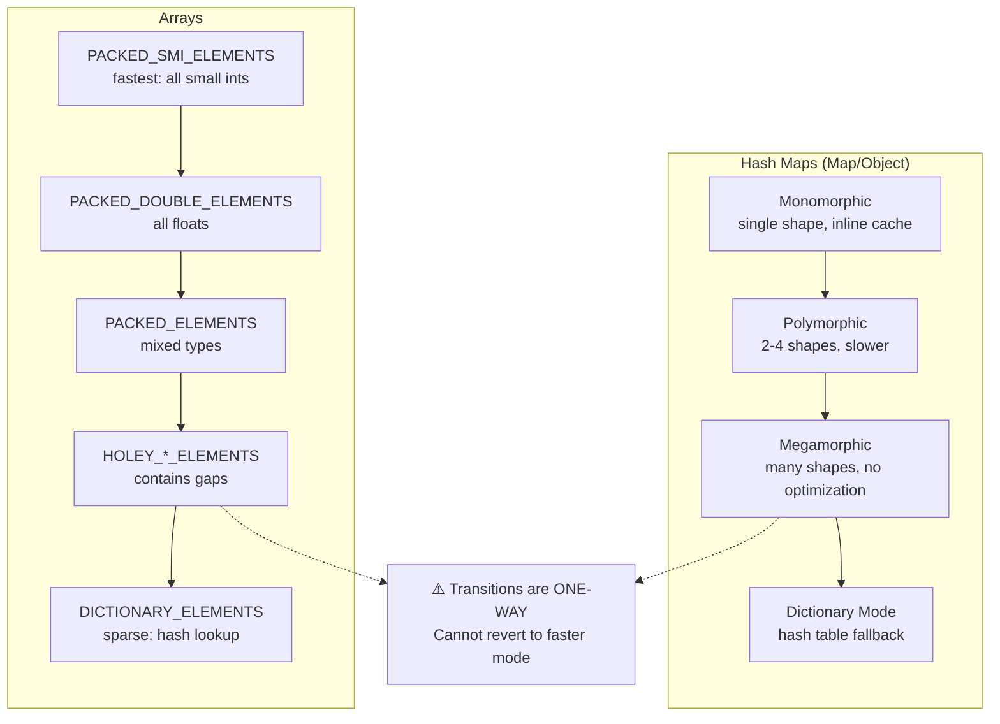
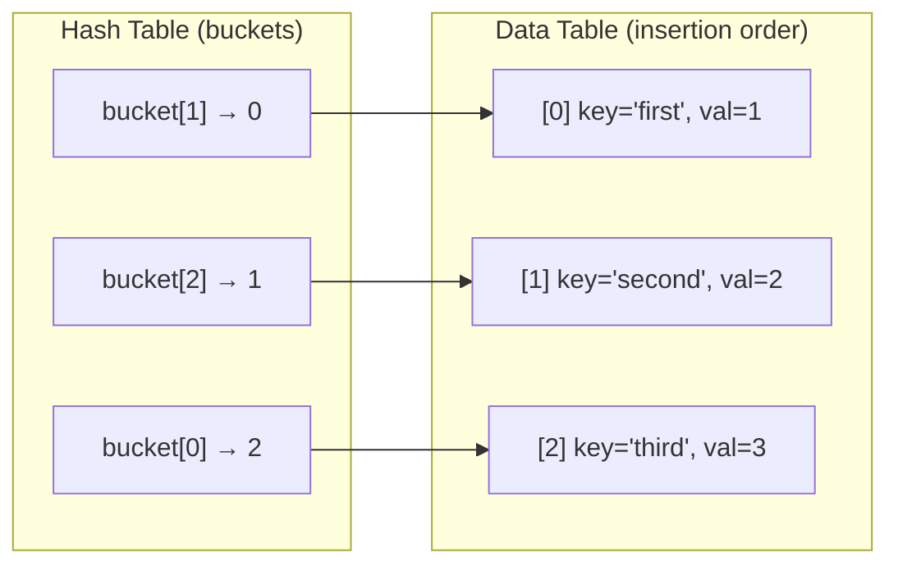

# Arrays and Hash Maps: Engine Internals and Performance Reality

Theoretical complexity hides the real story. Arrays promise O(1) access but degrade to O(n) with sparse indices. Hash maps guarantee O(1) lookups until collisions chain into linear probes. Understanding V8's internal representations—elements kinds, hidden classes, and deterministic hash tables—reveals when these data structures actually deliver their promised performance and when they fail.

<figure>



<figcaption>V8's internal representation hierarchy. Both structures can irreversibly degrade from optimized to slow modes.</figcaption>
</figure>

## Abstract

Memory layout determines real-world performance more than algorithmic complexity. Arrays exploit CPU cache lines through contiguous allocation—accessing adjacent elements costs nearly nothing when they share a 64-byte cache line. Hash maps trade memory for constant-time lookups, but load factors below 0.75 mean 25%+ waste, and collisions can chain into O(n) traversals.

V8 maintains multiple internal representations for both structures. Arrays transition through 21 "elements kinds"—from PACKED_SMI (fastest) to DICTIONARY (slowest)—and these transitions are permanent. Objects use "hidden classes" that enable monomorphic inline caches; adding properties dynamically forces costly shape transitions. Maps use Tyler Close's deterministic hash table algorithm, maintaining insertion order through dual data structures (hash table for lookup, data table for iteration).

The critical insight: writing `arr[1000] = x` on an empty array, deleting object properties, or creating polymorphic call sites permanently degrades performance. Understanding these transitions matters more than memorizing Big O notation.

## V8 Array Internals: Elements Kinds

V8 categorizes arrays into 21 distinct "elements kinds" based on their contents. The engine optimizes operations differently for each kind, and transitions between kinds are irreversible.

### The Elements Kind Hierarchy

The most common kinds, ordered from fastest to slowest:

| Elements Kind | Contents | Access Pattern |
|---------------|----------|----------------|
| PACKED_SMI_ELEMENTS | Small integers only (-2³¹ to 2³¹-1) | Direct memory offset |
| PACKED_DOUBLE_ELEMENTS | Floating-point numbers | Unboxed 64-bit doubles |
| PACKED_ELEMENTS | Any values (mixed) | Boxed elements, type checks |
| HOLEY_SMI_ELEMENTS | Small ints with gaps | Hole check on every access |
| HOLEY_DOUBLE_ELEMENTS | Doubles with gaps | Hole check + unboxing |
| HOLEY_ELEMENTS | Mixed with gaps | Hole check + type check |
| DICTIONARY_ELEMENTS | Sparse indices | Hash table lookup |

```js title="Elements kind transitions" collapse={1-2}
// Illustrating irreversible transitions

const arr = [1, 2, 3];           // PACKED_SMI_ELEMENTS (optimal)
arr.push(4.5);                    // → PACKED_DOUBLE_ELEMENTS (still good)
arr.push('string');               // → PACKED_ELEMENTS (boxed, slower)
arr[100] = 'x';                   // → HOLEY_ELEMENTS (permanent hole)
// Cannot revert to PACKED_* even if you fill indices 4-99
```

### Why Holes Are Expensive

When an array contains holes (missing indices), V8 must check every access to determine if the index contains a value or is empty. This check propagates through the prototype chain—a hole at `arr[5]` requires checking `Array.prototype[5]` and `Object.prototype[5]`.

```js title="Hole check overhead" collapse={1-2}
// Demonstrating the prototype chain lookup cost

const arr = [1, , 3];  // HOLEY_SMI_ELEMENTS

// Accessing arr[1] requires:
// 1. Check arr.hasOwnProperty(1) → false (hole)
// 2. Check Array.prototype.hasOwnProperty(1) → false
// 3. Check Object.prototype.hasOwnProperty(1) → false
// 4. Return undefined

// Contrast with packed array:
const packed = [1, 2, 3];
// Accessing packed[1]:
// 1. Direct memory read at (base + 1 * element_size)
// 2. Return value
```

### Dictionary Mode: When Arrays Become Hash Maps

Sparse arrays—those with large gaps between indices—switch to dictionary mode. V8's heuristic triggers this when storing to an index would create too many holes relative to array capacity.

```js title="Triggering dictionary mode" collapse={1-2}
// Sparse assignment forces hash table storage

const arr = [];
arr[0] = 'first';
arr[1000000] = 'sparse';  // DICTIONARY_ELEMENTS

// Now arr[0] access requires:
// 1. Hash the key "0"
// 2. Probe the hash table
// 3. Return value if found

// Memory comparison (approximate):
// Dense arr[0..999999]: ~8MB (1M × 8 bytes)
// Sparse with 2 elements: ~140 bytes (hash table overhead)
```

Dictionary mode makes sense for genuinely sparse data. The trade-off: random access degrades from O(1) direct indexing to O(1) average hash lookup with potential O(n) worst-case on collision chains.

## V8 Object Internals: Hidden Classes and Shapes

Objects in V8 use "hidden classes" (also called "shapes" or "maps" internally—not to be confused with the Map data structure). Hidden classes describe an object's memory layout: which properties exist and at what offset.

### Shape Transitions and Inline Caching

When V8 first sees a property access like `obj.x`, it doesn't know where `x` is stored. After the first access, it caches the property's offset for that shape. Subsequent accesses to objects with the same shape use this "inline cache" for direct memory access.

```js title="Hidden class optimization" collapse={1-2}
// Demonstrating shape-based optimization

// All objects with same property order share a hidden class
function createPoint(x, y) {
  const p = {};
  p.x = x;  // Transition: {} → {x}
  p.y = y;  // Transition: {x} → {x, y}
  return p;
}

const p1 = createPoint(1, 2);
const p2 = createPoint(3, 4);
// p1 and p2 share the same hidden class

function getX(point) {
  return point.x;  // After first call: inline cached
}

getX(p1);  // Misses cache, caches offset for shape {x,y}
getX(p2);  // Hits cache! Direct memory read at cached offset
```

### Polymorphism Kills Performance

When a function receives objects with different shapes, V8's inline cache becomes "polymorphic" (2-4 shapes) or "megamorphic" (many shapes). Megamorphic sites abandon caching entirely.

```js title="Polymorphism degradation" collapse={1-2}
// Demonstrating inline cache pollution

function getX(obj) {
  return obj.x;
}

// Creating objects with different shapes
const a = { x: 1 };                    // Shape: {x}
const b = { y: 2, x: 3 };              // Shape: {y, x} — different!
const c = { x: 4, y: 5 };              // Shape: {x, y} — also different!
const d = { z: 6, x: 7 };              // Shape: {z, x}
const e = { x: 8, z: 9 };              // Shape: {x, z}

// Calling with many shapes forces megamorphic
[a, b, c, d, e].forEach(getX);
// getX is now megamorphic — falls back to dictionary lookup
```

### Delete Destroys Optimization

The `delete` operator is particularly expensive. It forces the object into "slow mode" (dictionary properties) and cannot be undone.

```js title="Delete operator consequences" collapse={1-2}
// Why delete is slow

const obj = { a: 1, b: 2, c: 3 };
// obj uses fast properties (hidden class)

delete obj.b;
// obj transitions to dictionary mode
// All subsequent property accesses use hash lookups

// Preferred alternative:
const obj2 = { a: 1, b: 2, c: 3 };
obj2.b = undefined;  // Maintains shape, just clears value
// obj2 keeps fast properties
```

## Hash Map Internals: V8's Deterministic Hash Tables

JavaScript's `Map` must iterate in insertion order (per ECMA-262). Standard hash tables don't preserve insertion order, so V8 uses Tyler Close's deterministic hash table algorithm.

### Dual Data Structure Design

V8's Map implementation maintains two separate structures:

1. **Hash table**: Array of bucket indices for O(1) key lookup
2. **Data table**: Entries stored in insertion order



Lookup: hash the key → find bucket → follow index to data table entry.
Iteration: simply walk the data table sequentially (O(n) total, O(1) per element).

### Hash Code Computation

V8 computes hash codes differently by type:

| Key Type | Hash Strategy | Storage |
|----------|--------------|---------|
| Small integers (Smis) | Identity function | Computed on access |
| Heap numbers | Bit manipulation of value | Computed on access |
| Strings | Content-based hash | Cached in string header |
| Symbols | Content-based hash | Cached in symbol header |
| Objects | Random seed-based | Cached in object header |

For objects, V8 generates a random hash code on first use and caches it. This prevents algorithmic complexity attacks while ensuring consistent hashing.

### Memory Optimization: Hash Code Hiding

For small Maps (≤1022 entries), V8 stores the hash code in unused bits of the backing store's length field. Since capacity maxes at 1022, only 10 bits are needed for length, leaving 21 bits for the hash code.

This optimization improved SixSpeed Map/Set benchmarks by ~500%.

For larger Maps or dictionary-mode objects, V8 allocates an extra word per object to store the hash code.

## Collision Resolution and HashDoS

V8 uses separate chaining for collision resolution: entries with the same bucket form linked chains.

### When O(1) Becomes O(n)

With pathological inputs, attackers can force all keys into the same bucket, degrading every operation to O(n).

**CVE-2025-27209** (Node.js v24): V8's rapidhash string hashing was vulnerable to collision attacks. Attackers could generate hash-colliding strings without knowing the hash seed, causing severe slowdowns.

**Affected versions**: Node.js v20.x, v22.x, v24.x
**Fixed in**: v20.19.4, v22.17.1, v24.4.1

```js title="HashDoS impact" collapse={1-2}
// Illustrative example (do not use for attacks)

// If attacker controls keys and can generate collisions:
const map = new Map();

// Worst case: all keys hash to same bucket
// Each insertion: O(n) to traverse chain
// Total for n insertions: O(n²)

// Mitigation: rate limiting, input validation, updated runtime
```

### Load Factor and Resizing

V8 maintains a load factor (entries / buckets) around 0.5-0.75. When exceeded, the table rehashes:

1. Allocate new table with ~2× capacity
2. Recompute bucket indices for all entries
3. Copy entries to new locations

This O(n) operation amortizes to O(1) per insertion over time, but causes latency spikes during resizing.

## Map vs Object vs Array: When to Use Each

| Criterion | Array | Object | Map |
|-----------|-------|--------|-----|
| Sequential dense data | ✅ Optimal | ❌ Wrong tool | ❌ Wrong tool |
| Keyed lookups (strings) | ❌ | ✅ Good | ✅ Best for frequent updates |
| Non-string keys | ❌ | ❌ Coerces to string | ✅ Any key type |
| Insertion order | ❌ Not guaranteed | ⚠️ Complex rules | ✅ Guaranteed |
| Frequent add/delete | ⚠️ End operations only | ❌ Delete is slow | ✅ Designed for this |
| Iteration performance | ✅ Cache-friendly | ⚠️ Property enumeration | ✅ Sequential data table |
| Memory efficiency | ✅ Best when dense | ⚠️ Hidden class overhead | ⚠️ Hash table overhead |

### Benchmark Reality

Real-world V8 benchmarks (approximate, varies by workload):

| Operation | Object | Map | Winner |
|-----------|--------|-----|--------|
| Insertion | 1× | 4-5× faster | Map |
| Key lookup | 1× | 2-3× faster | Map |
| Has-key check | 1× | ~1× | Tie |
| Deletion | 1× | 10-50× faster | Map |
| Iteration | ~1× | ~1× | Tie (Map slightly better) |

Objects win only when the shape is stable and properties are accessed via monomorphic call sites. For dynamic keyed collections, Map dominates.

## Cache Locality: Why Memory Layout Matters

Modern CPUs fetch memory in cache lines (typically 64 bytes). Accessing one element loads adjacent elements for free.

### Array Contiguous Advantage

```js title="Cache-friendly vs cache-hostile" collapse={1-2}
// Demonstrating cache effects

// Cache-friendly: sequential access
const arr = new Array(1000000).fill(0);
for (let i = 0; i < arr.length; i++) {
  arr[i] += 1;  // Adjacent memory, cache hits
}

// Cache-hostile: random access
const indices = [...Array(1000000).keys()].sort(() => Math.random() - 0.5);
for (let i = 0; i < indices.length; i++) {
  arr[indices[i]] += 1;  // Random jumps, cache misses
}

// Sequential access is 3-10× faster than random access
// on the same data, due purely to cache effects
```

### Typed Arrays: Maximum Cache Efficiency

For numeric data, TypedArrays guarantee contiguous memory with fixed element sizes:

```js title="TypedArray memory layout" collapse={1-2}
// TypedArrays for performance-critical numeric work

const floats = new Float64Array(1000000);
// Guaranteed: 1000000 × 8 bytes = 8MB contiguous

// Regular array equivalent:
const regular = new Array(1000000).fill(0.0);
// V8 may optimize to contiguous doubles, or may not
// Adding a string element forces reallocation

// TypedArrays: fixed size, fixed type, maximum cache efficiency
// Regular arrays: flexible, but optimization is fragile
```

## Practical Recommendations

### For Arrays

1. **Pre-allocate when size is known**: `new Array(n).fill(defaultValue)` creates a packed array
2. **Avoid holes**: Never skip indices or use `delete arr[i]`
3. **Keep types homogeneous**: Mixing integers and floats transitions to PACKED_DOUBLE; adding strings transitions to PACKED_ELEMENTS
4. **Use TypedArrays for numeric data**: Guarantees contiguous memory and type stability

### For Objects

1. **Initialize all properties in constructors**: Establishes stable shape early
2. **Add properties in consistent order**: Objects with properties added in same order share hidden classes
3. **Never use `delete`**: Set to `undefined` or `null` instead
4. **Avoid dynamic property names in hot paths**: Use Map instead

### For Maps

1. **Default choice for dynamic keyed collections**: Designed for frequent add/remove
2. **Use when keys aren't strings**: Objects coerce keys; Maps preserve type
3. **Use when insertion order matters**: Guaranteed iteration order
4. **Consider memory overhead for small collections**: Object may be more efficient for <10 fixed keys

## Conclusion

Big O notation describes algorithmic bounds, not real-world performance. V8's internal representations—elements kinds for arrays, hidden classes for objects, deterministic hash tables for Maps—determine actual execution speed.

The actionable insights: keep arrays dense and homogeneous, maintain stable object shapes, use Map for dynamic collections. Understand that transitions to slower modes are permanent—a single sparse assignment or property deletion can degrade performance for the lifetime of that data structure.

## Appendix

### Prerequisites

- Big O notation and amortized analysis
- Basic understanding of hash tables and collision resolution
- JavaScript object and array fundamentals

### Terminology

- **Elements kind**: V8's internal classification of array contents determining storage and access strategy
- **Hidden class / Shape**: V8's internal description of an object's property layout enabling inline caching
- **Inline cache (IC)**: Cached property offset enabling direct memory access without property lookup
- **Monomorphic**: Call site that always sees one shape; optimal for inline caching
- **Polymorphic**: Call site seeing 2-4 shapes; uses polymorphic inline cache
- **Megamorphic**: Call site seeing many shapes; abandons inline caching
- **Dictionary mode**: Fallback to hash table storage when fast properties aren't possible
- **Load factor**: Ratio of entries to buckets in a hash table; affects collision probability
- **HashDoS**: Denial-of-service attack exploiting hash collisions to degrade O(1) to O(n)

### Summary

- V8 arrays have 21 elements kinds; transitions from packed to holey/dictionary are permanent
- V8 objects use hidden classes; maintaining consistent shapes enables inline caching
- `delete` forces dictionary mode on objects—set to `undefined` instead
- Maps use deterministic hash tables: hash table for lookup, data table for insertion-order iteration
- Cache locality often matters more than algorithmic complexity—contiguous beats sparse
- HashDoS attacks can degrade hash table operations from O(1) to O(n)

### References

- [ECMA-262 16th Edition](https://ecma-international.org/wp-content/uploads/ECMA-262_16th_edition_june_2025.pdf) — ECMAScript 2025 Language Specification
- [Elements kinds in V8](https://v8.dev/blog/elements-kinds) — V8 Blog on array internal representations
- [Fast properties in V8](https://v8.dev/blog/fast-properties) — V8 Blog on hidden classes and property access
- [Optimizing hash tables: hiding the hash code](https://v8.dev/blog/hash-code) — V8 Blog on Map/Set memory optimization
- [V8 Deep Dives: Understanding Map Internals](https://itnext.io/v8-deep-dives-understanding-map-internals-45eb94a183df) — Detailed analysis of V8's Map implementation
- [CVE-2025-27209: Node.js HashDoS](https://zeropath.com/blog/cve-2025-27209-nodejs-v8-hashdos) — HashDoS vulnerability in V8 string hashing
- [A tour of V8: object representation](https://jayconrod.com/posts/52/a-tour-of-v8-object-representation) — Deep dive into V8 object internals
