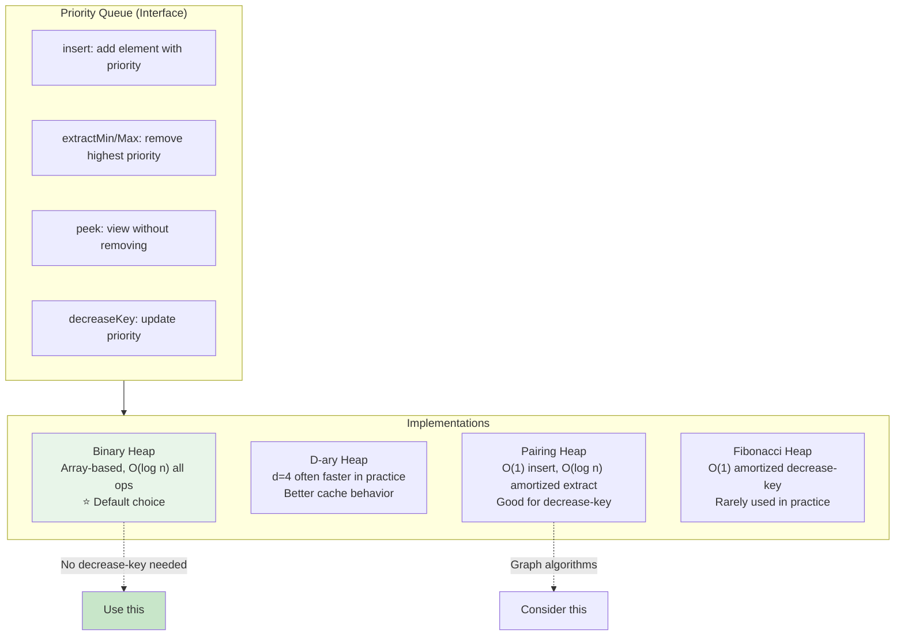

# Heaps and Priority Queues: Internals, Trade-offs, and When Theory Breaks Down

Heaps provide the fundamental abstraction for "give me the most important thing next" in O(log n) time. Priority queues—the abstract interface—power task schedulers, shortest-path algorithms, and event-driven simulations. Binary heaps dominate in practice not because they're theoretically optimal, but because array storage exploits cache locality. Understanding the gap between textbook complexity and real-world performance reveals when to use standard libraries, when to roll your own, and when the "better" algorithm is actually worse.

<figure>



<figcaption>Priority queue implementations. Binary heaps win for most workloads; pairing heaps excel when decrease-key is frequent.</figcaption>
</figure>

## Abstract

A heap is a complete binary tree stored in an array where each parent dominates its children (min-heap: parent ≤ children, max-heap: parent ≥ children). Array indices encode parent-child relationships: for a node at index `i`, the parent is at `⌊(i-1)/2⌋`, children at `2i+1` and `2i+2`. This implicit structure eliminates pointer overhead and enables contiguous memory access.

The core operations:

| Operation | Binary Heap | What Happens |
|-----------|-------------|--------------|
| peek | O(1) | Root is always min/max |
| insert | O(log n) | Add at end, bubble up |
| extractMin/Max | O(log n) | Swap root with last, bubble down |
| buildHeap | O(n) | Heapify bottom-up (not n × log n) |
| decreaseKey | O(log n) | Update value, bubble up |

The O(n) buildHeap complexity is counterintuitive—it works because most nodes are near the leaves where heapify is cheap. Fibonacci heaps offer O(1) amortized decrease-key, but their constant factors make them slower than binary heaps in practice for all but very large, dense graphs.

**The critical insight**: theoretical complexity is dominated by cache effects for heap sizes exceeding L1/L2 cache. A 4-ary heap can be 17-30% faster than a binary heap due to reduced tree height and better cache line utilization, despite performing more comparisons per level.

## The Heap Property and Array Representation

A binary heap satisfies two constraints:

1. **Shape property**: A complete binary tree—all levels filled except possibly the last, which fills left-to-right
2. **Heap property**: Each node dominates its children (min-heap: `A[parent] ≤ A[child]`, max-heap: `A[parent] ≥ A[child]`)

### Why Array Storage Works

The complete binary tree constraint enables an elegant array representation without explicit pointers:

```ts title="Heap index arithmetic (0-indexed)" collapse={1-2}
// Fundamental relationships for array-based heaps

function parent(i: number): number {
  return Math.floor((i - 1) / 2);  // Equivalent: (i - 1) >> 1
}

function leftChild(i: number): number {
  return 2 * i + 1;  // Equivalent: (i << 1) + 1
}

function rightChild(i: number): number {
  return 2 * i + 2;  // Equivalent: (i << 1) + 2
}
```

CLRS uses 1-indexed arrays where `parent(i) = ⌊i/2⌋`, `left(i) = 2i`, `right(i) = 2i + 1`. Production implementations use 0-indexed arrays—the arithmetic is slightly messier but avoids wasting index 0.

**Memory layout advantage**: With 64-byte cache lines and 8-byte elements, a cache line holds 8 heap nodes. Sequential access during heapify loads multiple nodes for free. This is why array-based heaps outperform pointer-based structures despite identical asymptotic complexity.

### The Shape Guarantee

The complete tree property means:
- A heap with n nodes has height `⌊log₂ n⌋`
- Level k contains at most `2^k` nodes
- The last level may be incomplete, but fills left-to-right

This guarantees balanced structure without rotations or rebalancing—unlike BSTs where adversarial insertion order creates O(n) height.

## Core Operations: How Bubbling Works

### Insert (Bubble Up / Sift Up)

Insert places the new element at the end (maintaining completeness) then restores the heap property by repeatedly swapping with the parent if violated:

```ts title="Insert with bubble up" collapse={1-4, 20-25}
// Binary min-heap implementation
// heap is an array, size is the current element count

class MinHeap<T> {
  private heap: T[] = [];
  private compare: (a: T, b: T) => number;

  constructor(compareFn: (a: T, b: T) => number = (a, b) => (a as number) - (b as number)) {
    this.compare = compareFn;
  }

  insert(value: T): void {
    this.heap.push(value);           // Add at end (O(1) amortized)
    this.bubbleUp(this.heap.length - 1);  // Restore heap property
  }

  private bubbleUp(index: number): void {
    while (index > 0) {
      const parentIdx = Math.floor((index - 1) / 2);
      if (this.compare(this.heap[index], this.heap[parentIdx]) >= 0) {
        break;  // Heap property satisfied
      }
      // Swap with parent
      [this.heap[index], this.heap[parentIdx]] = [this.heap[parentIdx], this.heap[index]];
      index = parentIdx;
    }
  }
}
```

**Worst case**: The new element is smaller than the root, requiring `log n` swaps up the entire height. **Best case**: The element belongs at the bottom, O(1). **Average case**: For random insertions, about half the path to root, still O(log n).

### Extract Min/Max (Bubble Down / Sift Down)

Extraction swaps the root with the last element, removes the last, then restores the heap property by bubbling down:

```ts title="Extract with bubble down" collapse={1-6}
// Continuing the MinHeap class

extractMin(): T | undefined {
  if (this.heap.length === 0) return undefined;
  if (this.heap.length === 1) return this.heap.pop();

  const min = this.heap[0];
  this.heap[0] = this.heap.pop()!;  // Move last to root
  this.bubbleDown(0);               // Restore heap property
  return min;
}

private bubbleDown(index: number): void {
  const size = this.heap.length;
  while (true) {
    const left = 2 * index + 1;
    const right = 2 * index + 2;
    let smallest = index;

    // Find smallest among node and its children
    if (left < size && this.compare(this.heap[left], this.heap[smallest]) < 0) {
      smallest = left;
    }
    if (right < size && this.compare(this.heap[right], this.heap[smallest]) < 0) {
      smallest = right;
    }

    if (smallest === index) break;  // Heap property satisfied

    [this.heap[index], this.heap[smallest]] = [this.heap[smallest], this.heap[index]];
    index = smallest;
  }
}
```

**Key detail**: We compare with both children and swap with the smaller one (min-heap). Swapping with the larger child would violate the heap property for the other subtree.

### Why Swap-with-Last Works

Removing the root directly would leave a hole requiring expensive restructuring. Swapping with the last element:

1. Maintains the complete tree shape (last element gone, root replaced)
2. Only potentially violates the heap property at the root
3. Bubbling down is bounded by tree height

## Build Heap: The O(n) Surprise

The naive approach—insert n elements one by one—costs O(n log n). But building a heap by calling heapify (bubble down) from the middle of the array upward runs in O(n).

### The Mathematical Insight

At most `⌈n/2^(h+1)⌉` nodes exist at height h. Heapify at height h costs O(h). The total work:

$$
\sum_{h=0}^{\lfloor \log n \rfloor} \frac{n}{2^{h+1}} \cdot O(h) = O(n) \sum_{h=0}^{\infty} \frac{h}{2^h} = O(n) \cdot 2 = O(n)
$$

The infinite series $\sum_{h=0}^{\infty} h/2^h = 2$ converges. Most nodes are leaves (height 0, zero work). Only one node has height log n (the root). The work distribution is heavily skewed toward cheap operations.

```ts title="Build heap in O(n)" collapse={1-3}
// Convert arbitrary array to valid heap

function buildHeap<T>(arr: T[], compare: (a: T, b: T) => number): void {
  const n = arr.length;
  // Start from last non-leaf node, heapify each
  for (let i = Math.floor(n / 2) - 1; i >= 0; i--) {
    heapify(arr, n, i, compare);
  }
}

function heapify<T>(arr: T[], size: number, index: number, compare: (a: T, b: T) => number): void {
  let smallest = index;
  const left = 2 * index + 1;
  const right = 2 * index + 2;

  if (left < size && compare(arr[left], arr[smallest]) < 0) smallest = left;
  if (right < size && compare(arr[right], arr[smallest]) < 0) smallest = right;

  if (smallest !== index) {
    [arr[index], arr[smallest]] = [arr[smallest], arr[index]];
    heapify(arr, size, smallest, compare);
  }
}
```

**Practical implication**: When you have all elements upfront, use buildHeap. It's 2× faster than repeated insertion for the same result.

## Heap Sort: O(n log n) Guaranteed, But Slower in Practice

Heap sort works by building a max-heap, then repeatedly extracting the maximum:

```ts title="Heap sort algorithm" collapse={1-3}
// In-place, unstable, O(n log n) guaranteed

function heapSort<T>(arr: T[], compare: (a: T, b: T) => number): void {
  const n = arr.length;

  // Build max-heap (reverse comparison)
  for (let i = Math.floor(n / 2) - 1; i >= 0; i--) {
    maxHeapify(arr, n, i, compare);
  }

  // Extract elements one by one
  for (let i = n - 1; i > 0; i--) {
    [arr[0], arr[i]] = [arr[i], arr[0]];  // Move max to end
    maxHeapify(arr, i, 0, compare);        // Restore heap on reduced array
  }
}
```

### Why Heap Sort Loses to Quicksort

| Factor | Heap Sort | Quicksort |
|--------|-----------|-----------|
| Worst case | O(n log n) always | O(n²) without pivot optimization |
| Cache locality | Poor—jumps across array | Excellent—linear partitioning |
| Branch prediction | Poor—unpredictable swap paths | Better—partition scans are predictable |
| Practical speed | 1× baseline | 2-3× faster typically |

Quicksort scans memory linearly during partitioning, loading cache lines efficiently. Heap sort jumps between parent and children nodes, causing cache misses. Modern implementations like introsort use heap sort as a fallback when quicksort degenerates—getting quicksort's speed with heap sort's worst-case guarantee.

### Heap Sort Is Not Stable

Stability means equal elements maintain their original relative order. Heap sort swaps elements across large distances (root with last position), breaking stability. For stability, use merge sort or Timsort.

## D-ary Heaps: When More Children Means Faster

A d-ary heap generalizes binary heaps to d children per node:
- Index calculations: `parent(i) = ⌊(i-1)/d⌋`, children at `d*i + 1` through `d*i + d`
- Tree height: `log_d(n)` instead of `log_2(n)`
- Insert: Fewer levels to bubble up (faster)
- Extract: More comparisons per level to find smallest child (slower)

### Why 4-ary Heaps Win in Practice

Empirical benchmarks show 4-ary heaps are 17-30% faster than binary heaps. The reasons:

1. **Reduced height**: A 4-ary heap with 1M elements has height ~10 vs ~20 for binary
2. **Cache line utilization**: Four 8-byte children fit in a 64-byte cache line
3. **Fewer memory accesses**: Despite more comparisons, fewer cache misses dominate

```ts title="4-ary heap parent/child calculations" collapse={1-2}
// D-ary heap with d=4

const D = 4;

function parent(i: number): number {
  return Math.floor((i - 1) / D);
}

function firstChild(i: number): number {
  return D * i + 1;
}

// During bubble-down, compare all D children
function findSmallestChild(heap: number[], parentIdx: number, size: number): number {
  let smallest = parentIdx;
  const start = D * parentIdx + 1;
  const end = Math.min(start + D, size);

  for (let i = start; i < end; i++) {
    if (heap[i] < heap[smallest]) {
      smallest = i;
    }
  }
  return smallest;
}
```

**When to use d-ary**: For large heaps exceeding L2 cache where memory access dominates CPU cycles. For small heaps (<1000 elements), binary heaps are simpler and fast enough.

## Fibonacci Heaps: Theoretically Optimal, Practically Slow

Fibonacci heaps achieve:
- Insert: O(1) amortized
- Find-min: O(1)
- Decrease-key: O(1) amortized
- Extract-min: O(log n) amortized
- Merge: O(1)

This makes Dijkstra's algorithm O(m + n log n) instead of O(m log n) with binary heaps—significant for dense graphs where m ≈ n².

### Why Fibonacci Heaps Lose in Practice

1. **High constant factors**: The lazy consolidation machinery adds substantial overhead
2. **Pointer chasing**: Node-based structure defeats cache prefetching
3. **Complex implementation**: More opportunities for bugs, harder to optimize
4. **Amortized ≠ consistent**: Individual operations can spike to O(n)

Experimental studies consistently show pairing heaps outperform Fibonacci heaps despite weaker theoretical guarantees. For most applications, a binary heap with the "duplicate node" strategy (described below) beats both.

### The Duplicate Node Strategy

Instead of decrease-key, insert a new node with the updated priority. When extracting, skip stale entries:

```ts title="Priority queue without decrease-key" collapse={1-5}
// Used in Dijkstra's algorithm implementations
// Trade memory for simplicity—no need to track node positions

interface PQEntry<T> {
  priority: number;
  value: T;
  valid: boolean;  // Or use a Set to track processed nodes
}

class SimplePriorityQueue<T> {
  private heap: PQEntry<T>[] = [];

  insert(priority: number, value: T): void {
    this.heap.push({ priority, value, valid: true });
    this.bubbleUp(this.heap.length - 1);
  }

  // Instead of decrease-key, insert again and mark old as invalid
  update(oldEntry: PQEntry<T>, newPriority: number): void {
    oldEntry.valid = false;
    this.insert(newPriority, oldEntry.value);
  }

  extractMin(): T | undefined {
    while (this.heap.length > 0) {
      const entry = this.extractTop();
      if (entry?.valid) return entry.value;
      // Skip invalid entries from previous decrease-key operations
    }
    return undefined;
  }
}
```

This wastes memory (duplicate entries) but avoids tracking node positions in the heap—a significant implementation simplification.

## Standard Library Implementations

### Python: heapq Module

Python's `heapq` provides functions operating on regular lists. It's a min-heap only—for max-heap, negate values.

```python title="Python heapq usage" collapse={1-2}
# heapq operates on lists, doesn't wrap them

import heapq

data = [5, 1, 8, 3, 2]
heapq.heapify(data)       # O(n) in-place transformation
heapq.heappush(data, 4)   # O(log n) insert
smallest = heapq.heappop(data)  # O(log n) extract min

# No decrease-key—use duplicate node strategy
# No max-heap—negate values or use custom comparison
```

CPython implements `heapq` in C (`_heapqmodule.c`) for performance. The Python fallback in `Lib/heapq.py` uses optimized sift-up/sift-down that minimizes swaps by finding the final position before moving the element.

**Design decision**: Python uses 0-indexed arrays and `<` operator only (not `<=`), maintaining stability for equal elements within the heap operations themselves (though heapsort remains unstable).

### Go: container/heap Package

Go requires implementing an interface rather than providing a ready-to-use type:

```go title="Go heap interface implementation" collapse={1-5, 25-35}
// Go's heap requires implementing heap.Interface
// which embeds sort.Interface (Len, Less, Swap) plus Push and Pop

package main

import (
    "container/heap"
)

type IntHeap []int

func (h IntHeap) Len() int           { return len(h) }
func (h IntHeap) Less(i, j int) bool { return h[i] < h[j] }
func (h IntHeap) Swap(i, j int)      { h[i], h[j] = h[j], h[i] }

// Push and Pop are called by heap package, not directly
func (h *IntHeap) Push(x any) { *h = append(*h, x.(int)) }
func (h *IntHeap) Pop() any {
    old := *h
    n := len(old)
    x := old[n-1]
    *h = old[0 : n-1]
    return x
}

// Usage
func main() {
    h := &IntHeap{5, 1, 8, 3, 2}
    heap.Init(h)           // O(n)
    heap.Push(h, 4)        // O(log n)
    min := heap.Pop(h)     // O(log n)
}
```

**Why Go's design is confusing**: The `Push` and `Pop` methods on your type are for the heap package to call internally—you call `heap.Push(h, x)` and `heap.Pop(h)`. This indirection enables generic algorithms without generics (pre-Go 1.18 design).

### JavaScript: No Built-in Heap

JavaScript has no standard heap/priority queue. Common approaches:

1. **Third-party libraries**: `fastpriorityqueue` is optimized for V8
2. **Roll your own**: ~50 lines for a basic binary heap
3. **Sorted array**: O(n) insert but simple—fine for small n

```ts title="Minimal TypeScript binary heap" collapse={1-3}
// Production-grade implementation would add error handling

class MinHeap<T> {
  private heap: T[] = [];

  constructor(private compare: (a: T, b: T) => number = (a, b) => (a as any) - (b as any)) {}

  push(val: T): void {
    this.heap.push(val);
    let i = this.heap.length - 1;
    while (i > 0) {
      const p = (i - 1) >> 1;
      if (this.compare(this.heap[i], this.heap[p]) >= 0) break;
      [this.heap[i], this.heap[p]] = [this.heap[p], this.heap[i]];
      i = p;
    }
  }

  pop(): T | undefined {
    if (this.heap.length <= 1) return this.heap.pop();
    const top = this.heap[0];
    this.heap[0] = this.heap.pop()!;
    let i = 0;
    while (true) {
      const l = 2 * i + 1, r = 2 * i + 2;
      let min = i;
      if (l < this.heap.length && this.compare(this.heap[l], this.heap[min]) < 0) min = l;
      if (r < this.heap.length && this.compare(this.heap[r], this.heap[min]) < 0) min = r;
      if (min === i) break;
      [this.heap[i], this.heap[min]] = [this.heap[min], this.heap[i]];
      i = min;
    }
    return top;
  }

  peek(): T | undefined { return this.heap[0]; }
  get size(): number { return this.heap.length; }
}
```

## Real-World Applications

### Dijkstra's Shortest Path

The canonical priority queue application. Each vertex gets a tentative distance; the heap efficiently finds the next vertex to process:

```ts title="Dijkstra with binary heap" collapse={1-10, 35-45}
// Graph represented as adjacency list
// Edge: { to: number, weight: number }

interface Edge { to: number; weight: number; }
type Graph = Edge[][];

interface HeapEntry {
  vertex: number;
  distance: number;
}

function dijkstra(graph: Graph, source: number): number[] {
  const n = graph.length;
  const dist = Array(n).fill(Infinity);
  dist[source] = 0;

  const heap = new MinHeap<HeapEntry>((a, b) => a.distance - b.distance);
  heap.push({ vertex: source, distance: 0 });

  const visited = new Set<number>();

  while (heap.size > 0) {
    const { vertex, distance } = heap.pop()!;

    if (visited.has(vertex)) continue;  // Skip stale entries
    visited.add(vertex);

    for (const { to, weight } of graph[vertex]) {
      const newDist = distance + weight;
      if (newDist < dist[to]) {
        dist[to] = newDist;
        heap.push({ vertex: to, distance: newDist });  // Duplicate node strategy
      }
    }
  }

  return dist;
}
```

**Complexity**: O((V + E) log V) with binary heap. For dense graphs (E ≈ V²), this becomes O(V² log V). A Fibonacci heap improves this to O(E + V log V), but only matters for very large, dense graphs.

### K-way Merge (External Sorting)

Merging k sorted streams using a heap of size k:

```ts title="K-way merge with heap" collapse={1-8}
// Merge k sorted iterators into one sorted output
// Used in external sorting, merge sort, database joins

interface StreamEntry<T> {
  value: T;
  streamIndex: number;
}

function* kWayMerge<T>(
  streams: Iterator<T>[],
  compare: (a: T, b: T) => number
): Generator<T> {
  const heap = new MinHeap<StreamEntry<T>>(
    (a, b) => compare(a.value, b.value)
  );

  // Initialize heap with first element from each stream
  for (let i = 0; i < streams.length; i++) {
    const result = streams[i].next();
    if (!result.done) {
      heap.push({ value: result.value, streamIndex: i });
    }
  }

  // Extract min and refill from same stream
  while (heap.size > 0) {
    const { value, streamIndex } = heap.pop()!;
    yield value;

    const next = streams[streamIndex].next();
    if (!next.done) {
      heap.push({ value: next.value, streamIndex });
    }
  }
}
```

**Complexity**: O(n log k) where n is total elements across all streams. Each of n elements enters and leaves the heap once, costing O(log k) each.

### Event-Driven Simulation / Task Scheduling

Priority queues order events by timestamp, enabling efficient simulation:

```ts title="Event scheduler pattern" collapse={1-5}
// Generic event-driven simulation framework

interface Event {
  timestamp: number;
  execute: () => Event[];  // Returns new events to schedule
}

class EventScheduler {
  private queue = new MinHeap<Event>((a, b) => a.timestamp - b.timestamp);
  private currentTime = 0;

  schedule(event: Event): void {
    if (event.timestamp < this.currentTime) {
      throw new Error('Cannot schedule event in the past');
    }
    this.queue.push(event);
  }

  run(until: number): void {
    while (this.queue.size > 0 && this.queue.peek()!.timestamp <= until) {
      const event = this.queue.pop()!;
      this.currentTime = event.timestamp;
      const newEvents = event.execute();
      for (const e of newEvents) {
        this.schedule(e);
      }
    }
  }
}
```

### Finding K Largest/Smallest Elements

A min-heap of size k efficiently tracks the k largest elements in a stream:

```ts title="Top-K with bounded heap" collapse={1-3}
// O(n log k) for n elements, O(k) space

function topK<T>(items: Iterable<T>, k: number, compare: (a: T, b: T) => number): T[] {
  const heap = new MinHeap<T>(compare);

  for (const item of items) {
    if (heap.size < k) {
      heap.push(item);
    } else if (compare(item, heap.peek()!) > 0) {
      heap.pop();
      heap.push(item);
    }
  }

  // Extract in sorted order
  const result: T[] = [];
  while (heap.size > 0) {
    result.push(heap.pop()!);
  }
  return result.reverse();
}
```

For k largest, use a min-heap and keep only elements larger than the minimum. The heap always contains the k largest seen so far.

## Edge Cases and Failure Modes

### Empty Heap Operations

`extractMin` and `peek` on an empty heap should be handled gracefully:

```ts title="Defensive heap operations" collapse={1-2}
// Return undefined rather than throw

peek(): T | undefined {
  return this.heap[0];  // undefined if empty
}

pop(): T | undefined {
  if (this.heap.length === 0) return undefined;
  // ... rest of implementation
}
```

### Comparison Function Pitfalls

Incorrect comparisons cause subtle bugs:

```ts title="Comparison function gotchas" collapse={1-2}
// Common mistakes in comparison functions

// WRONG: NaN comparison
const badCompare = (a: number, b: number) => a - b;
// NaN - anything = NaN, which is neither < 0 nor >= 0

// WRONG: Inconsistent ordering
const unstable = (a: Obj, b: Obj) => Math.random() - 0.5;
// Heap operations require transitive, antisymmetric comparison

// CORRECT: Handle edge cases
const safeCompare = (a: number, b: number) => {
  if (Number.isNaN(a)) return 1;  // Push NaN to bottom
  if (Number.isNaN(b)) return -1;
  return a - b;
};
```

### Heap Corruption from External Mutation

If stored objects are mutated, the heap property breaks:

```ts title="Mutation corruption example" collapse={1-5}
// DO NOT mutate objects in a heap without re-heapifying

interface Task { priority: number; name: string; }

const heap = new MinHeap<Task>((a, b) => a.priority - b.priority);
const task = { priority: 5, name: 'important' };
heap.push(task);

// WRONG: This corrupts the heap
task.priority = 1;  // Heap doesn't know about this change

// CORRECT: Remove, update, re-insert
// Or use immutable objects
// Or implement decrease-key that maintains heap invariant
```

### Integer Overflow in Index Calculations

For very large heaps (>2³⁰ elements), 32-bit index arithmetic can overflow:

```ts title="Safe index calculations" collapse={1-2}
// Use BigInt or bounds checking for massive heaps

function leftChild(i: number): number {
  const result = 2 * i + 1;
  if (result < i) throw new Error('Index overflow');
  return result;
}
```

In practice, heaps rarely exceed millions of elements—a 4-byte integer handles indices up to ~2 billion.

## Conclusion

Binary heaps provide the right balance of simplicity, performance, and generality for most priority queue needs. The array representation eliminates pointer overhead and exploits cache locality. Understanding the O(n) buildHeap analysis and why heap sort underperforms quicksort despite better worst-case bounds illuminates the gap between theoretical and practical performance.

For graph algorithms, the "duplicate node" strategy—insert new entries instead of decrease-key—often beats sophisticated heaps by avoiding position tracking overhead. When heap size exceeds cache, consider 4-ary heaps for the cache-friendly wider tree. Fibonacci heaps remain a textbook curiosity except for specialized applications on very large, dense graphs.

The priority queue abstraction itself matters more than the heap variant. Standard libraries provide adequate implementations; optimize the data structure only after profiling proves it's the bottleneck.

## Appendix

### Prerequisites

- Big O notation and amortized analysis
- Basic tree terminology (height, complete, balanced)
- Array indexing and memory layout concepts

### Terminology

- **Heap property**: Parent dominates children (min-heap: parent ≤ children, max-heap: parent ≥ children)
- **Complete binary tree**: All levels filled except possibly the last, which fills left-to-right
- **Bubble up (sift up)**: Move an element toward the root to restore heap property
- **Bubble down (sift down, heapify)**: Move an element toward leaves to restore heap property
- **Decrease-key**: Update an element's priority and restore heap property; critical for graph algorithms
- **Amortized analysis**: Average cost per operation over a sequence, allowing expensive operations if rare
- **D-ary heap**: Generalization where each node has d children instead of 2
- **Implicit data structure**: Structure encoded in array positions rather than explicit pointers

### Summary

- Binary heaps store complete trees in arrays; parent/child relationships via index arithmetic
- Insert bubbles up (O(log n)), extract bubbles down (O(log n)), peek is O(1)
- buildHeap runs in O(n), not O(n log n)—most nodes are cheap to heapify
- Heap sort guarantees O(n log n) but loses to quicksort due to cache effects
- 4-ary heaps can be 17-30% faster due to better cache utilization
- Fibonacci heaps have better theoretical bounds but lose in practice
- For Dijkstra without decrease-key needs, use duplicate node strategy with binary heap
- JavaScript lacks built-in heaps; Python's heapq is min-heap only; Go requires interface implementation

### References

- [Binary heap - Wikipedia](https://en.wikipedia.org/wiki/Binary_heap) — Comprehensive overview of binary heap structure and operations
- [Fibonacci heap - Wikipedia](https://en.wikipedia.org/wiki/Fibonacci_heap) — Detailed analysis of Fibonacci heap amortized bounds
- [CS 161 Lecture 4 - Stanford](https://web.stanford.edu/class/archive/cs/cs161/cs161.1168/lecture4.pdf) — Build heap O(n) proof from CLRS
- [D-ary heap - Wikipedia](https://en.wikipedia.org/wiki/D-ary_heap) — Cache performance benefits of d-ary heaps
- [heapq — Python documentation](https://docs.python.org/3/library/heapq.html) — Python standard library heap implementation
- [CPython heapq.py source](https://github.com/python/cpython/blob/main/Lib/heapq.py) — Pure Python heap implementation with detailed comments
- [Go container/heap package](https://pkg.go.dev/container/heap) — Go standard library heap interface
- [Pairing heap - Wikipedia](https://en.wikipedia.org/wiki/Pairing_heap) — Practical alternative to Fibonacci heaps
- [Why Are Golang Heaps So Complicated - DoltHub](https://www.dolthub.com/blog/2023-12-01-why-are-go-heaps-confusing/) — Analysis of Go's heap interface design decisions
- [Heapify Analysis Without Math - nilmamano.com](https://nilmamano.com/blog/heapify-analysis) — Intuitive O(n) buildHeap proof
- [Decrease-Key Dijkstra's Algorithm - Baeldung](https://www.baeldung.com/cs/dijkstra-decrease-key) — Comparison of decrease-key strategies
