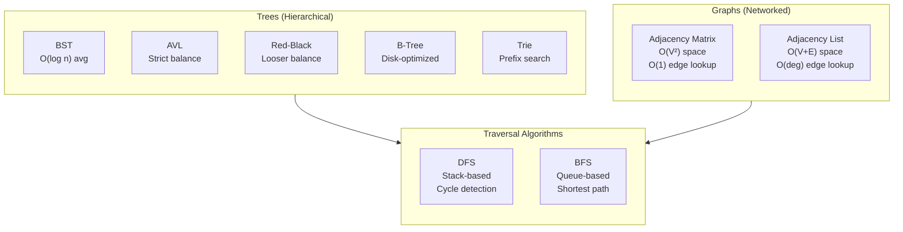

# Trees and Graphs: Traversals and Applications

Hierarchical and networked data structures that underpin file systems, databases, build tools, and routing. This guide covers tree variants (BST, AVL, Red-Black, B-trees, tries), graph representations (adjacency matrix vs list), traversal algorithms (DFS, BFS), and key algorithms (cycle detection, topological sort, shortest paths). Focus on design trade-offs and when to choose each structure.

<figure>



<figcaption>Trees model hierarchical relationships; graphs model arbitrary connections. Traversal choice depends on the problem: DFS for dependencies and cycles, BFS for shortest paths.</figcaption>
</figure>

## Abstract

Trees and graphs share a fundamental property: nodes connected by edges. The distinction lies in structure constraints—trees enforce hierarchy (single parent, no cycles), while graphs allow arbitrary connections.

**Core mental model:**

- **Tree variants optimize different access patterns**: AVL for search-heavy workloads (stricter balance = fewer comparisons), Red-Black for write-heavy workloads (fewer rotations), B-trees for disk I/O (multiple keys per node = fewer seeks), tries for prefix operations (shared prefixes = O(key length) search)
- **Graph representation is a space-time trade-off**: Adjacency matrices give O(1) edge lookup but O(V²) space; adjacency lists give O(V+E) space but O(degree) edge lookup. Choose based on graph density.
- **Traversal choice follows from problem structure**: DFS uses a stack and explores deeply first—ideal for cycle detection, topological sort, and backtracking. BFS uses a queue and explores level-by-level—ideal for shortest paths in unweighted graphs.
- **Union-Find enables near-O(1) connectivity queries** through path compression and union by rank, making it the go-to structure for dynamic connectivity and Kruskal's MST.

## Tree Fundamentals

### Binary Search Tree (BST)

A BST maintains the invariant: left subtree values < node < right subtree values. This enables O(log n) search, insertion, and deletion—_when balanced_.

**The problem**: Without balancing, insertions in sorted order create a linear chain. A BST of n elements inserted in ascending order degenerates to a linked list with O(n) operations.

```ts title="bst-insertion.ts" collapse={1-3, 20-30}
// BST node structure
interface BSTNode<T> {
  value: T
  left: BSTNode<T> | null
  right: BSTNode<T> | null
}

// Worst case: sorted insertions create O(n) height
// insert(1), insert(2), insert(3), insert(4)
// Results in:
//   1
//    \
//     2
//      \
//       3
//        \
//         4

// Solution: self-balancing trees (AVL, Red-Black)
```

### AVL Trees: Strict Balance for Search-Heavy Workloads

AVL trees (Adelson-Velsky and Landis, 1962) were the first self-balancing BSTs. The invariant: for every node, the height difference between left and right subtrees (balance factor) must be -1, 0, or +1.

**Design rationale**: Strict balancing minimizes tree height, guaranteeing O(log n) operations. The trade-off is more rotations during modifications.

**When to use**: Read-heavy workloads where search performance matters more than write throughput. Database indexes with infrequent updates.

**Rotation mechanics**: After insertion or deletion, if balance factor becomes ±2, perform single or double rotations to restore balance. Four cases: Left-Left, Right-Right (single rotation), Left-Right, Right-Left (double rotation).

### Red-Black Trees: Looser Balance for Write-Heavy Workloads

Red-Black trees (Guibas and Sedgewick, 1978) use node coloring instead of strict height balance. Five invariants:

1. Every node is red or black
2. Root is black
3. Leaves (NIL) are black
4. Red nodes have black children
5. All paths from node to descendant leaves have equal black nodes

**Design rationale**: Looser balance (height can be up to 2× optimal) means fewer rotations during modifications. Maximum 2 rotations per insertion, 3 per deletion.

**When to use**: Write-heavy workloads. System-level data structures where modification frequency is high.

**Real-world usage**: Java `TreeMap`, C++ `std::map`, Linux kernel's Completely Fair Scheduler (CFS).

### AVL vs Red-Black: The Trade-off

| Aspect        | AVL                              | Red-Black                   |
| ------------- | -------------------------------- | --------------------------- |
| Balance       | Strict (height diff ≤ 1)         | Loose (height ≤ 2× optimal) |
| Search        | Slightly faster (shorter height) | Slightly slower             |
| Insert/Delete | More rotations                   | Fewer rotations (max 2-3)   |
| Use case      | Search-dominant                  | Write-dominant              |

### B-Trees: Disk I/O Optimization

Binary trees are inefficient for disk storage: each node access requires a disk seek (~10ms latency). With millions of nodes, tree traversal becomes I/O-bound.

**Design rationale**: B-trees increase the branching factor. Each node contains multiple keys (typically sized to fit a disk page, 4-16KB), reducing tree height and disk seeks.

A B-tree of order m:

- Each node has at most m children
- Each node (except root) has at least ⌈m/2⌉ children
- All leaves are at the same depth

**B+ tree variant**: Internal nodes contain only keys for routing; all data lives in leaf nodes, which are linked for efficient range scans. Used by most databases.

**Real-world usage**: SQLite, PostgreSQL, MySQL indexes. File systems: NTFS, HFS+, ext4, Btrfs.

```ts title="btree-node.ts" collapse={1-2, 15-20}
// B-tree node structure (simplified)
interface BTreeNode<K, V> {
  keys: K[] // Up to m-1 keys
  children: BTreeNode<K, V>[] // Up to m children
  isLeaf: boolean
}

// Example: B-tree of order 4 (up to 3 keys, 4 children per node)
// A single node can store keys [10, 20, 30]
// Children partition the key space:
// [-∞, 10), [10, 20), [20, 30), [30, +∞)

// Disk optimization: one node = one disk page
// Tree of 1M keys with order 100: height ≤ 3
// Only 3 disk reads for any lookup
```

### Tries: Prefix-Optimized Search

Tries (prefix trees) organize strings by shared prefixes. Each edge represents a character; paths from root to marked nodes spell complete strings.

**Design rationale**: Exploit prefix sharing. Looking up "prefix" in a trie of 1M words takes O(6) operations—independent of dictionary size.

**Trade-off**: Higher memory than hash tables (each character requires a node or edge), but enables prefix queries that hash tables cannot support.

**When to use**:

- Autocomplete (find all strings with prefix)
- Spell checking
- IP routing (longest prefix matching)
- T9 predictive text

**Complexity**: O(L) for search, insert, delete—where L is key length, not dictionary size.

## Graph Representations

Graphs model relationships without hierarchical constraints. The choice of representation determines performance for different operations.

### Adjacency Matrix

A V×V matrix where `matrix[i][j]` indicates the edge from vertex i to j (1/0 for unweighted, weight value for weighted).

```ts title="adjacency-matrix.ts" collapse={1-2, 18-25}
// Adjacency matrix representation
class GraphMatrix {
  private matrix: number[][]

  constructor(vertices: number) {
    this.matrix = Array.from({ length: vertices }, () => Array(vertices).fill(0))
  }

  addEdge(u: number, v: number, weight = 1): void {
    this.matrix[u][v] = weight
    // For undirected: this.matrix[v][u] = weight;
  }

  hasEdge(u: number, v: number): boolean {
    return this.matrix[u][v] !== 0 // O(1)
  }
}
```

**Operations**:

- Edge lookup: O(1)
- Add/remove edge: O(1)
- Find neighbors: O(V)—must scan entire row
- Space: O(V²)—always, regardless of edge count

**When to use**: Dense graphs where E ≈ V², frequent edge existence checks, small graphs where V² is acceptable.

### Adjacency List

Array or map of vertices, each storing a list of adjacent vertices.

```ts title="adjacency-list.ts" collapse={1-2, 20-27}
// Adjacency list representation
class GraphList {
  private adj: Map<number, Set<number>>

  constructor() {
    this.adj = new Map()
  }

  addEdge(u: number, v: number): void {
    if (!this.adj.has(u)) this.adj.set(u, new Set())
    this.adj.get(u)!.add(v)
    // For undirected: add reverse edge
  }

  hasEdge(u: number, v: number): boolean {
    return this.adj.get(u)?.has(v) ?? false // O(1) with Set
  }

  neighbors(u: number): number[] {
    return [...(this.adj.get(u) ?? [])] // O(degree)
  }
}
```

**Operations**:

- Edge lookup: O(degree) with list, O(1) with Set/hash
- Add edge: O(1)
- Remove edge: O(degree) with list, O(1) with Set
- Find neighbors: O(degree)—exactly the neighbors, no scanning
- Space: O(V + E)

**When to use**: Sparse graphs (E << V²), most real-world graphs (social networks, road networks), memory-constrained environments.

### Representation Trade-offs

| Operation          | Adjacency Matrix | Adjacency List |
| ------------------ | ---------------- | -------------- |
| Space              | O(V²)            | O(V + E)       |
| Edge lookup        | O(1)             | O(degree)      |
| Neighbor iteration | O(V)             | O(degree)      |
| Add edge           | O(1)             | O(1)           |
| Remove edge        | O(1)             | O(degree)      |
| Dense graphs       | ✓ Efficient      | ✗ Wasteful     |
| Sparse graphs      | ✗ Wasteful       | ✓ Efficient    |

**Rule of thumb**: If E < V²/64, adjacency list is more space-efficient. Most real graphs are sparse.

## Traversal Algorithms

### Depth-First Search (DFS)

DFS explores as deep as possible before backtracking. Uses a stack (explicit or call stack).

```ts title="dfs-traversal.ts" collapse={1-3, 30-40}
// DFS - Recursive (uses call stack)
function dfsRecursive(graph: Map<number, number[]>, start: number, visited = new Set<number>()): void {
  if (visited.has(start)) return
  visited.add(start)

  // Process node here
  console.log(start)

  for (const neighbor of graph.get(start) ?? []) {
    dfsRecursive(graph, neighbor, visited)
  }
}

// DFS - Iterative (explicit stack)
function dfsIterative(graph: Map<number, number[]>, start: number): void {
  const visited = new Set<number>()
  const stack = [start]

  while (stack.length > 0) {
    const node = stack.pop()!
    if (visited.has(node)) continue
    visited.add(node)

    // Process node here
    console.log(node)

    // Add neighbors in reverse for same order as recursive
    const neighbors = graph.get(node) ?? []
    for (let i = neighbors.length - 1; i >= 0; i--) {
      if (!visited.has(neighbors[i])) {
        stack.push(neighbors[i])
      }
    }
  }
}
```

**Tree DFS variants**:

- **Preorder** (root-left-right): Process node before children. Use: tree copying, serialization.
- **Inorder** (left-root-right): Process node between children. Use: BST sorted traversal.
- **Postorder** (left-right-root): Process node after children. Use: tree deletion, expression evaluation, dependency resolution.

**Complexity**: O(V + E) time, O(V) space for visited set + recursion stack.

**When to use**: Cycle detection, topological sorting, path finding in mazes, detecting connected components.

### Breadth-First Search (BFS)

BFS explores all neighbors at current depth before moving deeper. Uses a queue.

```ts title="bfs-traversal.ts" collapse={1-3, 25-35}
// BFS - Level-order traversal
function bfs(graph: Map<number, number[]>, start: number): void {
  const visited = new Set<number>()
  const queue: number[] = [start]
  visited.add(start)

  while (queue.length > 0) {
    const node = queue.shift()! // Dequeue front

    // Process node here
    console.log(node)

    for (const neighbor of graph.get(node) ?? []) {
      if (!visited.has(neighbor)) {
        visited.add(neighbor)
        queue.push(neighbor)
      }
    }
  }
}
```

**Complexity**: O(V + E) time, O(V) space for visited set + queue.

**Key property**: BFS finds shortest path in unweighted graphs. The first time BFS reaches a node, it's via the shortest path (in terms of edge count).

**When to use**: Shortest path (unweighted), level-order traversal, finding nearest neighbors, web crawling by depth.

### DFS vs BFS: Choosing the Right Traversal

| Aspect         | DFS                                             | BFS                                              |
| -------------- | ----------------------------------------------- | ------------------------------------------------ |
| Data structure | Stack                                           | Queue                                            |
| Exploration    | Deep first                                      | Level by level                                   |
| Path finding   | Any path                                        | Shortest path (unweighted)                       |
| Memory         | O(max depth)                                    | O(max width)                                     |
| Use cases      | Cycle detection, topological sort, maze solving | Shortest path, level traversal, nearest neighbor |

**Memory consideration**: In wide, shallow graphs, DFS uses less memory. In deep, narrow graphs, BFS uses less memory. For balanced trees, both use O(log n).

## Cycle Detection

### Undirected Graphs: DFS with Parent Tracking

In undirected graphs, an edge to a visited node that isn't the parent indicates a cycle.

```ts title="cycle-undirected.ts" collapse={1-3, 25-35}
// Cycle detection in undirected graph
function hasCycleUndirected(graph: Map<number, number[]>, vertices: number[]): boolean {
  const visited = new Set<number>()

  function dfs(node: number, parent: number | null): boolean {
    visited.add(node)

    for (const neighbor of graph.get(node) ?? []) {
      if (!visited.has(neighbor)) {
        if (dfs(neighbor, node)) return true
      } else if (neighbor !== parent) {
        // Visited and not parent = cycle
        return true
      }
    }
    return false
  }

  // Check all components
  for (const v of vertices) {
    if (!visited.has(v) && dfs(v, null)) return true
  }
  return false
}
```

### Directed Graphs: Three-Color DFS

In directed graphs, use three states: unvisited (white), currently visiting (gray), fully visited (black). A back edge to a gray node indicates a cycle.

```ts title="cycle-directed.ts" collapse={1-3, 30-40}
// Cycle detection in directed graph (three-color algorithm)
enum Color {
  WHITE,
  GRAY,
  BLACK,
}

function hasCycleDirected(graph: Map<number, number[]>, vertices: number[]): boolean {
  const color = new Map<number, Color>()
  vertices.forEach((v) => color.set(v, Color.WHITE))

  function dfs(node: number): boolean {
    color.set(node, Color.GRAY) // Currently visiting

    for (const neighbor of graph.get(node) ?? []) {
      if (color.get(neighbor) === Color.GRAY) {
        // Back edge to node in current path = cycle
        return true
      }
      if (color.get(neighbor) === Color.WHITE) {
        if (dfs(neighbor)) return true
      }
    }

    color.set(node, Color.BLACK) // Fully visited
    return false
  }

  for (const v of vertices) {
    if (color.get(v) === Color.WHITE && dfs(v)) return true
  }
  return false
}
```

**Why three colors?** In directed graphs, revisiting a node isn't inherently a cycle—it could be via a different path. Only revisiting a node _in the current DFS path_ (gray) indicates a cycle.

## Topological Sorting

Topological sort produces a linear ordering of DAG (Directed Acyclic Graph) vertices where for every edge u→v, u appears before v. Essential for dependency resolution.

### Kahn's Algorithm (BFS-based)

Process vertices with no incoming edges first, then update in-degrees.

```ts title="topological-kahn.ts" collapse={1-3, 35-45}
// Kahn's algorithm - BFS-based topological sort
function topologicalSortKahn(graph: Map<number, number[]>, vertices: number[]): number[] | null {
  // Calculate in-degrees
  const inDegree = new Map<number, number>()
  vertices.forEach((v) => inDegree.set(v, 0))

  for (const [_, neighbors] of graph) {
    for (const neighbor of neighbors) {
      inDegree.set(neighbor, (inDegree.get(neighbor) ?? 0) + 1)
    }
  }

  // Queue vertices with in-degree 0
  const queue = vertices.filter((v) => inDegree.get(v) === 0)
  const result: number[] = []

  while (queue.length > 0) {
    const node = queue.shift()!
    result.push(node)

    for (const neighbor of graph.get(node) ?? []) {
      const newDegree = inDegree.get(neighbor)! - 1
      inDegree.set(neighbor, newDegree)
      if (newDegree === 0) {
        queue.push(neighbor)
      }
    }
  }

  // If not all vertices processed, cycle exists
  return result.length === vertices.length ? result : null
}
```

**Advantage**: Naturally detects cycles—if result doesn't include all vertices, a cycle exists.

### DFS-based Approach

Add vertices to result after visiting all descendants (postorder), then reverse.

```ts title="topological-dfs.ts" collapse={1-3, 30-40}
// DFS-based topological sort
function topologicalSortDFS(graph: Map<number, number[]>, vertices: number[]): number[] | null {
  const visited = new Set<number>()
  const inStack = new Set<number>() // For cycle detection
  const result: number[] = []

  function dfs(node: number): boolean {
    if (inStack.has(node)) return false // Cycle
    if (visited.has(node)) return true

    visited.add(node)
    inStack.add(node)

    for (const neighbor of graph.get(node) ?? []) {
      if (!dfs(neighbor)) return false
    }

    inStack.delete(node)
    result.push(node) // Postorder
    return true
  }

  for (const v of vertices) {
    if (!visited.has(v) && !dfs(v)) return null
  }

  return result.reverse()
}
```

**Real-world applications**:

- Build systems (Maven, Gradle, Make): Compile dependencies before dependents
- Package managers (npm, pip): Install dependencies in correct order
- Task scheduling: Execute prerequisites before dependent tasks
- Database migrations: Apply schema changes in dependency order
- Course scheduling: Prerequisites before advanced courses

## Shortest Path Algorithms

### BFS for Unweighted Graphs

BFS inherently finds shortest paths when all edges have equal weight (or weight = 1).

```ts title="bfs-shortest-path.ts" collapse={1-3, 25-35}
// Shortest path in unweighted graph using BFS
function shortestPath(graph: Map<number, number[]>, start: number, end: number): number[] | null {
  const visited = new Set<number>()
  const parent = new Map<number, number>()
  const queue = [start]
  visited.add(start)

  while (queue.length > 0) {
    const node = queue.shift()!
    if (node === end) {
      // Reconstruct path
      const path = [end]
      let current = end
      while (parent.has(current)) {
        current = parent.get(current)!
        path.unshift(current)
      }
      return path
    }

    for (const neighbor of graph.get(node) ?? []) {
      if (!visited.has(neighbor)) {
        visited.add(neighbor)
        parent.set(neighbor, node)
        queue.push(neighbor)
      }
    }
  }
  return null // No path exists
}
```

### Dijkstra's Algorithm (Non-negative Weights)

Greedy algorithm using a priority queue. Always processes the vertex with smallest known distance.

**Invariant**: When a vertex is dequeued, its distance is final.

**Limitation**: Cannot handle negative edge weights—the greedy assumption breaks.

**Complexity**: O(E + V log V) with binary heap, O(E + V log V) with Fibonacci heap.

**Use cases**: GPS navigation, network routing (OSPF protocol).

### Bellman-Ford (Handles Negative Weights)

Relaxes all edges V-1 times. Can detect negative cycles.

**Algorithm**:

1. Initialize distances (source = 0, others = ∞)
2. Repeat V-1 times: for each edge (u,v), if dist[u] + weight < dist[v], update dist[v]
3. Check for negative cycles: if any edge can still be relaxed, negative cycle exists

**Complexity**: O(V·E)—slower than Dijkstra but handles negative weights.

**Use cases**: Routing protocols (RIP), arbitrage detection in currency exchange.

### Algorithm Selection

| Scenario                 | Algorithm      | Complexity     |
| ------------------------ | -------------- | -------------- |
| Unweighted graph         | BFS            | O(V + E)       |
| Non-negative weights     | Dijkstra       | O(E + V log V) |
| Negative weights         | Bellman-Ford   | O(V·E)         |
| All-pairs shortest paths | Floyd-Warshall | O(V³)          |

## Union-Find (Disjoint Set Union)

Union-Find manages a collection of disjoint sets, answering "are x and y connected?" in near-constant time.

### Operations

- **MakeSet(x)**: Create a singleton set containing x
- **Find(x)**: Return the representative (root) of x's set
- **Union(x, y)**: Merge the sets containing x and y

### Optimizations

**Path compression**: During Find, make every node point directly to the root.

```ts title="union-find.ts" collapse={1-3, 35-45}
// Union-Find with path compression and union by rank
class UnionFind {
  private parent: Map<number, number>
  private rank: Map<number, number>

  constructor(elements: number[]) {
    this.parent = new Map()
    this.rank = new Map()
    elements.forEach((e) => {
      this.parent.set(e, e) // Each element is its own parent
      this.rank.set(e, 0)
    })
  }

  find(x: number): number {
    if (this.parent.get(x) !== x) {
      // Path compression: point directly to root
      this.parent.set(x, this.find(this.parent.get(x)!))
    }
    return this.parent.get(x)!
  }

  union(x: number, y: number): void {
    const rootX = this.find(x)
    const rootY = this.find(y)
    if (rootX === rootY) return

    // Union by rank: attach smaller tree to larger
    const rankX = this.rank.get(rootX)!
    const rankY = this.rank.get(rootY)!
    if (rankX < rankY) {
      this.parent.set(rootX, rootY)
    } else if (rankX > rankY) {
      this.parent.set(rootY, rootX)
    } else {
      this.parent.set(rootY, rootX)
      this.rank.set(rootX, rankX + 1)
    }
  }

  connected(x: number, y: number): boolean {
    return this.find(x) === this.find(y)
  }
}
```

**Union by rank**: Attach the shorter tree to the taller one, preventing worst-case linear chains.

**Combined complexity**: O(α(n)) per operation, where α is the inverse Ackermann function. For all practical purposes, α(n) ≤ 4, making operations effectively O(1).

**Use cases**:

- Kruskal's MST algorithm
- Cycle detection in undirected graphs
- Connected components
- Network connectivity (social graphs, computer networks)
- Image segmentation

## Production Applications

### DOM and Virtual DOM (React)

The DOM (Document Object Model) is a tree where each node represents an HTML element. React's reconciliation algorithm diffs virtual DOM trees.

**The O(n³) problem**: A general algorithm to transform one tree into another with minimum edit operations requires O(n³) time—prohibitive for UI updates.

**React's heuristics** (from React documentation):

1. Elements of different types produce different trees (full rebuild)
2. Elements of same type with different `key` props are different instances
3. Same type, same key → minimal diff

**Result**: O(n) diffing with well-chosen keys. Without keys, React falls back to index-based matching, causing unnecessary re-renders when list order changes.

### File Systems

File systems use tree structures for directory hierarchies and B-trees for efficient storage.

**Inode-based structure** (Linux, macOS):

- Directory entries map filenames to inode numbers
- Inodes store metadata and block pointers
- Multi-level indexing (direct, indirect, double indirect) for large files

**Dentry cache**: Kernel caches directory lookups, avoiding repeated disk reads for path traversal.

### Dependency Resolution (Build Systems)

Gradle, Maven, and npm model dependencies as DAGs and use topological sorting.

**Gradle's two-phase resolution**:

1. **Graph resolution**: Build DAG of dependencies and transitive dependencies
2. **Artifact resolution**: Fetch files for resolved components

Topological sort determines build order and enables parallel execution of independent tasks.

### Database Indexing

B-trees are the standard for database indexes because they minimize disk I/O.

**Why B-trees**: A binary tree with 1M keys has height ~20. A B-tree of order 100 with 1M keys has height ~3. Each level requires a disk seek—reducing seeks by 85% dramatically improves query performance.

### Social Networks

Social graphs use graph algorithms for friend recommendations and connectivity.

**Common algorithms**:

- **Common neighbors**: Suggest users with most mutual connections
- **BFS**: Find 1st/2nd/3rd degree connections
- **Personalized PageRank**: User-specific importance ranking

## Complexity Reference

### Tree Operations

| Structure      | Search   | Insert   | Delete   | Space  | Best For        |
| -------------- | -------- | -------- | -------- | ------ | --------------- |
| BST (balanced) | O(log n) | O(log n) | O(log n) | O(n)   | General purpose |
| AVL            | O(log n) | O(log n) | O(log n) | O(n)   | Search-heavy    |
| Red-Black      | O(log n) | O(log n) | O(log n) | O(n)   | Write-heavy     |
| B-tree         | O(log n) | O(log n) | O(log n) | O(n)   | Disk storage    |
| Trie           | O(L)     | O(L)     | O(L)     | O(n·L) | Prefix search   |

### Graph Operations by Representation

| Operation          | Adjacency Matrix | Adjacency List |
| ------------------ | ---------------- | -------------- |
| Space              | O(V²)            | O(V + E)       |
| Edge lookup        | O(1)             | O(degree)      |
| Neighbor iteration | O(V)             | O(degree)      |
| Add edge           | O(1)             | O(1)           |
| Remove edge        | O(1)             | O(degree)      |

### Algorithm Complexity

| Algorithm        | Time           | Space | Use Case                          |
| ---------------- | -------------- | ----- | --------------------------------- |
| DFS              | O(V + E)       | O(V)  | Cycle detection, topological sort |
| BFS              | O(V + E)       | O(V)  | Shortest path (unweighted)        |
| Dijkstra         | O(E + V log V) | O(V)  | Shortest path (non-negative)      |
| Bellman-Ford     | O(V·E)         | O(V)  | Shortest path (negative weights)  |
| Topological Sort | O(V + E)       | O(V)  | Dependency resolution             |
| Union-Find       | O(α(n))        | O(n)  | Connectivity, MST                 |

## Conclusion

Trees and graphs model hierarchical and networked relationships respectively. The key engineering decisions are:

1. **Tree variant selection**: Match the data structure to access patterns—AVL for reads, Red-Black for writes, B-trees for disk, tries for prefixes.

2. **Graph representation**: Adjacency lists for sparse graphs (most real-world cases), matrices only for dense graphs with frequent edge lookups.

3. **Traversal choice**: DFS for problems requiring path exploration (cycles, dependencies), BFS for shortest path and level-order problems.

4. **Union-Find for connectivity**: Near-O(1) operations make it the optimal choice for dynamic connectivity problems.

These structures underpin critical systems—file systems, databases, build tools, social networks, and routing. Understanding their trade-offs enables informed architectural decisions.

## Appendix

### Prerequisites

- Big O notation and complexity analysis
- Recursion and iteration
- Basic data structures (arrays, linked lists, hash maps)
- Stack and queue operations

### Terminology

- **BST (Binary Search Tree)**: Binary tree where left < root < right
- **AVL tree**: Self-balancing BST with strict height balance (difference ≤ 1)
- **Red-Black tree**: Self-balancing BST using node coloring for looser balance
- **B-tree**: Multi-way search tree optimized for disk I/O
- **Trie (prefix tree)**: Tree structure for string storage with shared prefixes
- **DAG (Directed Acyclic Graph)**: Directed graph with no cycles
- **DFS (Depth-First Search)**: Traversal exploring deep before wide
- **BFS (Breadth-First Search)**: Traversal exploring level by level
- **Topological sort**: Linear ordering of DAG vertices respecting edge direction
- **Union-Find**: Data structure for disjoint set operations with near-O(1) complexity

### Summary

- **Tree variants optimize different dimensions**: AVL for search, Red-Black for writes, B-trees for disk, tries for prefixes
- **Graph representation choice depends on density**: Adjacency list for sparse (E << V²), matrix for dense
- **DFS uses stack, BFS uses queue**: Choose based on problem structure—depth exploration vs level-order
- **Cycle detection**: Parent tracking for undirected, three-color for directed graphs
- **Topological sort requires DAG**: Kahn's (BFS) or DFS-based, both O(V + E)
- **Union-Find achieves near-O(1)** through path compression and union by rank

### References

- [Introduction to Algorithms (CLRS)](https://mitpress.mit.edu/books/introduction-algorithms-fourth-edition) - Chapters on BSTs, Red-Black trees, B-trees, graph algorithms
- [Red-Black Tree - Wikipedia](https://en.wikipedia.org/wiki/Red%E2%80%93black_tree) - Properties and implementation
- [AVL Tree - Wikipedia](https://en.wikipedia.org/wiki/AVL_tree) - Balance factors and rotations
- [B-tree - Wikipedia](https://en.wikipedia.org/wiki/B-tree) - Structure and disk optimization rationale
- [SQLite B-Tree Module](https://sqlite.org/btreemodule.html) - Production B-tree implementation
- [React Reconciliation](https://legacy.reactjs.org/docs/reconciliation.html) - DOM diffing algorithm and heuristics
- [Trie - Wikipedia](https://en.wikipedia.org/wiki/Trie) - Prefix tree structure and applications
- [Disjoint Set Union - CP-Algorithms](https://cp-algorithms.com/data_structures/disjoint_set_union.html) - Union-Find optimizations
- [Dijkstra vs Bellman-Ford - Baeldung](https://www.baeldung.com/cs/dijkstra-vs-bellman-ford) - Shortest path algorithm comparison
- [Gradle Dependency Resolution](https://docs.gradle.org/current/userguide/graph_resolution.html) - Build system graph handling
