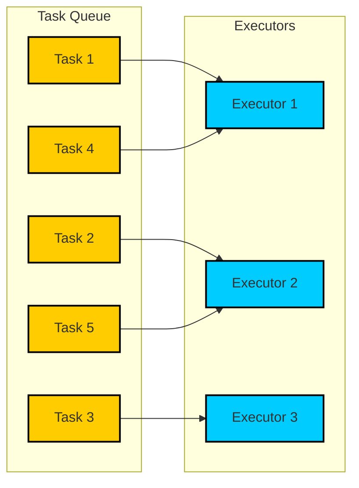
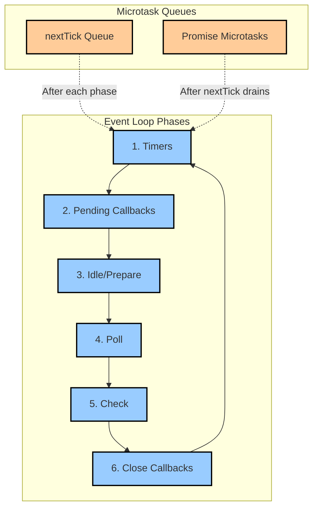
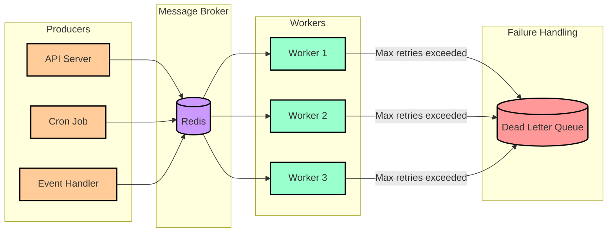
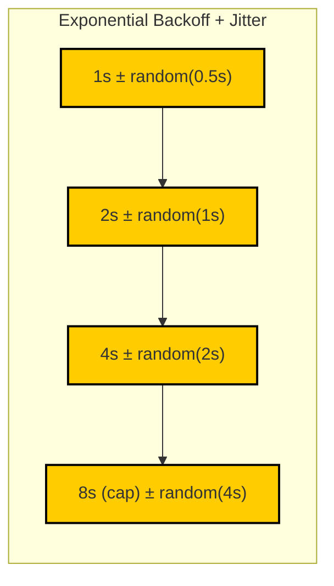
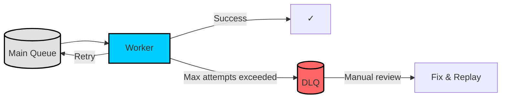
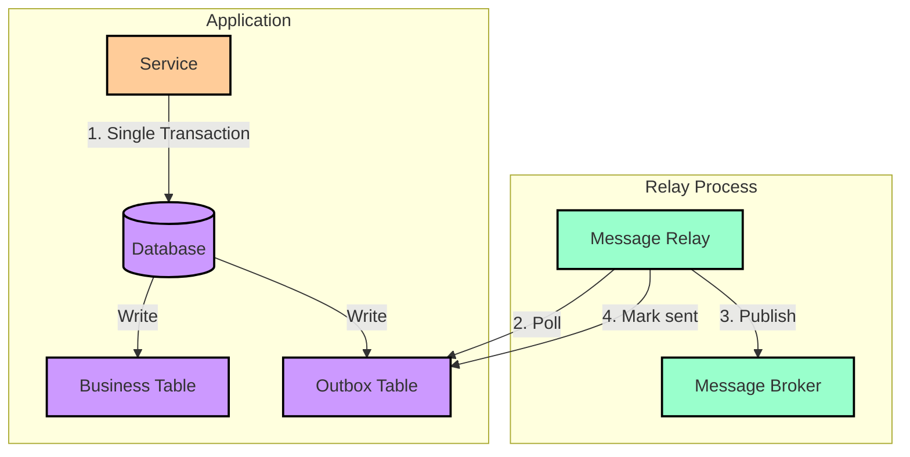
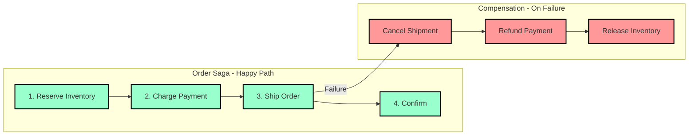
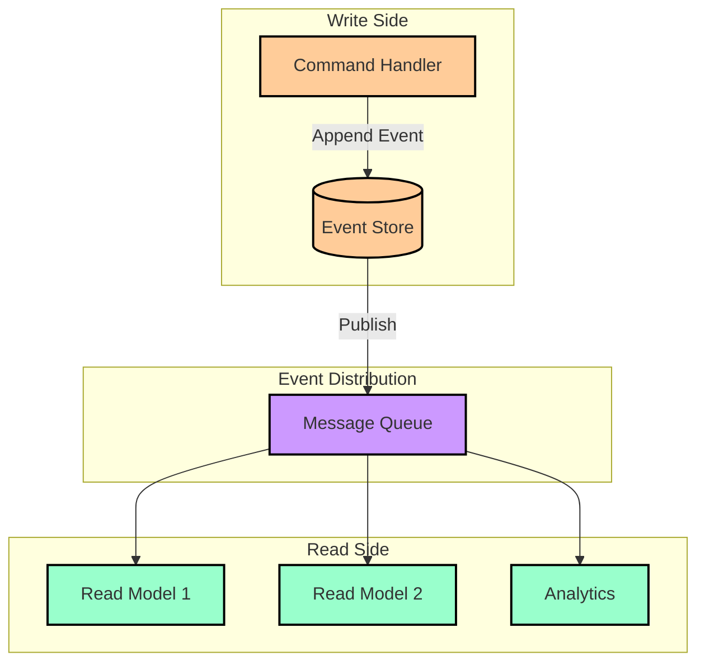

# Async Queue Pattern in JavaScript

Build resilient, scalable asynchronous task processing systems—from basic in-memory queues to advanced distributed patterns—using Node.js. This article covers the design reasoning behind queue architectures, concurrency control mechanisms, and resilience patterns for production systems.

<figure>



<figcaption>Asynchronous task queue distributing work across multiple executors with bounded concurrency</figcaption>

</figure>

## Abstract

Async queues solve a fundamental tension: how to maximize throughput while respecting resource constraints. The core mental model:

```
Producer → Queue (buffer) → Consumer(s)
           ↑                    ↓
     Backpressure ←──── Concurrency Control
```

**Key design decisions:**

| Decision             | In-Memory Queue                          | Distributed Queue                               |
| -------------------- | ---------------------------------------- | ----------------------------------------------- |
| **Persistence**      | None—process crash loses all jobs        | Redis/DB-backed—survives restarts               |
| **Scalability**      | Single process only                      | Competing consumers across nodes                |
| **Failure handling** | Caller's responsibility                  | Built-in retries, DLQ, stalled detection        |
| **When to use**      | Local concurrency control, rate limiting | Cross-process coordination, durability required |

**Resilience fundamentals:**

- **Idempotency**: Design consumers to handle duplicate delivery safely
- **Backpressure**: Bound queue size to prevent memory exhaustion
- **Exponential backoff + jitter**: `delay = min(cap, base × 2^attempt) + random()` prevents thundering herd
- **Dead Letter Queue (DLQ)**: Isolate poison messages that exceed retry attempts

## Part 1: The Foundation of Asynchronous Execution

### 1.1 The Event Loop and In-Process Concurrency

Node.js uses a single-threaded, event-driven architecture. This model excels at I/O-bound operations but blocks the main thread during CPU-intensive work. Understanding the event loop phases is essential for designing queue processors that remain responsive.

<figure>



<figcaption>Node.js event loop phases with microtask queues processed between each phase</figcaption>

</figure>

**Event Loop Phases** (as of Node.js 20+):

The event loop executes in six phases: timers → pending callbacks → idle/prepare → poll → check → close callbacks. Each phase has a FIFO queue of callbacks.

- **Microtask processing**: After each phase completes, Node.js drains the `nextTick` queue first, then the Promise microtask queue. Both complete before the next phase begins.
- **Priority order**: `process.nextTick()` > Promise microtasks > macrotasks (setTimeout, setImmediate)

> **Node.js 20 change (libuv 1.45.0)**: Timers now run only _after_ the poll phase, not before and after as in earlier versions. This affects callback ordering for code that depends on precise timer/I/O interleaving.

**Why this matters for queues**: A queue processor that performs synchronous CPU work starves the event loop, preventing lock renewals (in distributed queues) and incoming I/O from being handled. Design processors to yield control regularly via `await` or `setImmediate()`.

### 1.2 In-Memory Task Queues: Controlling Local Concurrency

In-memory queues throttle async operations within a single process—useful for rate limiting API calls or controlling database connection usage.

**Library comparison (as of January 2025):**

| Library          | Weekly Downloads | Design Focus                      | Concurrency Control                |
| ---------------- | ---------------- | --------------------------------- | ---------------------------------- |
| **fastq** v1.20  | 60M+             | Raw performance, minimal overhead | Simple concurrency count           |
| **p-queue** v9.1 | 10M+             | Feature-rich, priority support    | Fixed/sliding window rate limiting |

**p-queue** provides priority scheduling, per-operation timeouts, and sliding-window rate limiting. **fastq** uses object pooling via `reusify` for reduced GC pressure—6x higher adoption for performance-critical scenarios.

**Naive implementation** (for understanding the pattern):

```ts file=./2025-01-24-code-sample.ts collapse={1-1, 45-95, 97-114}

```

> **Note**: This uses [`Promise.withResolvers()`](https://developer.mozilla.org/en-US/docs/Web/JavaScript/Reference/Global_Objects/Promise/withResolvers) (Baseline 2024).

**Critical limitations of in-memory queues:**

| Limitation                     | Impact                              | Mitigation                                          |
| ------------------------------ | ----------------------------------- | --------------------------------------------------- |
| **No persistence**             | Process crash loses all queued jobs | Use distributed queue for durability                |
| **Single process**             | Cannot scale horizontally           | Distributed queue with competing consumers          |
| **No backpressure by default** | Unbounded memory growth under load  | Monitor queue size, reject new tasks when saturated |
| **Caller handles errors**      | Silent failures if not awaited      | Always handle returned promises                     |

**Backpressure pattern with p-queue:**

```typescript title="backpressure.ts" collapse={1-2}
import PQueue from "p-queue"

const queue = new PQueue({ concurrency: 10 })

async function addWithBackpressure<T>(task: () => Promise<T>): Promise<T> {
  // Block producer when queue exceeds threshold
  if (queue.size > 100) {
    await queue.onSizeLessThan(50) // Wait until queue drains
  }
  return queue.add(task)
}
```

## Part 2: Distributed Async Task Queues

For persistence, horizontal scaling, and cross-process coordination, tasks must be managed by a distributed queue system.

### 2.1 Distributed Architecture Components

<figure>



<figcaption>Distributed queue with producers, Redis broker, competing consumers, and DLQ for failed jobs</figcaption>

</figure>

**Component responsibilities:**

- **Producers**: Enqueue jobs with payload, priority, delay, and retry configuration
- **Message Broker**: Persistent store (Redis for BullMQ) providing at-least-once delivery
- **Workers (Competing Consumers)**: Dequeue and process jobs; multiple workers increase throughput
- **Dead Letter Queue**: Captures jobs exceeding retry attempts for manual inspection

**Why Redis for BullMQ?** Redis provides atomic operations (MULTI/EXEC), sorted sets for delayed jobs, and pub/sub for worker coordination—all with sub-millisecond latency.

### 2.2 Node.js Distributed Queue Libraries

| Library         | Backend          | Design Philosophy                          | Best For                              |
| --------------- | ---------------- | ------------------------------------------ | ------------------------------------- |
| **BullMQ** v5.x | Redis            | Modern, feature-rich, production-grade     | Most distributed queue needs          |
| **Agenda**      | MongoDB          | Cron-style scheduling                      | Recurring jobs with complex schedules |
| **Temporal**    | PostgreSQL/MySQL | Workflow orchestration with state machines | Long-running, multi-step workflows    |

### 2.3 BullMQ Deep Dive

BullMQ (v5.67+) is the production standard for Node.js distributed queues. Key design decisions:

**Stalled job detection**: Workers acquire a lock when processing a job. If the lock expires (default: 30s) without renewal, BullMQ marks the job as stalled and either requeues it or moves it to failed. This handles worker crashes but also triggers if CPU-bound work starves the event loop.

```typescript title="producer.ts" collapse={1-5}
import { Queue } from "bullmq"

const connection = { host: "localhost", port: 6379 }
const emailQueue = new Queue("email-processing", { connection })

async function queueEmailJob(userId: number, template: string) {
  await emailQueue.add(
    "send-email",
    { userId, template },
    {
      attempts: 5,
      backoff: { type: "exponential", delay: 1000 },
      removeOnComplete: { count: 1000 }, // Keep last 1000 completed jobs
      removeOnFail: { age: 7 * 24 * 3600 }, // Keep failed jobs for 7 days
    },
  )
}
```

**Worker with concurrency tuning**:

```typescript title="worker.ts" collapse={1-2}
import { Worker } from "bullmq"

const emailWorker = new Worker(
  "email-processing",
  async (job) => {
    const { userId, template } = job.data
    // I/O-bound: email API call
    await sendEmail(userId, template)
  },
  {
    connection: { host: "localhost", port: 6379 },
    concurrency: 100, // High concurrency for I/O-bound work
    lockDuration: 30000, // 30s lock, must complete or renew
  },
)
```

**Concurrency tuning guidance:**

- **I/O-bound jobs** (API calls, DB queries): concurrency 100–300
- **CPU-bound jobs**: Use sandboxed processors (separate process) with low concurrency
- **Mixed**: Start low, measure, increase—monitor for stalled jobs

**Sandboxed processors** for CPU-intensive work:

```typescript title="sandboxed-worker.ts"
// Main process
const worker = new Worker("cpu-intensive", "./processor.js", {
  connection,
  useWorkerThreads: true, // Node.js Worker Threads (BullMQ 3.13+)
})

// processor.js (separate file)
export default async function (job) {
  // CPU work here doesn't block main process
  return heavyComputation(job.data)
}
```

**Job flows** for dependencies (parent waits for all children):

```typescript title="flow.ts" collapse={1-2}
import { FlowProducer } from "bullmq"

const flowProducer = new FlowProducer({ connection })

await flowProducer.add({
  name: "process-order",
  queueName: "orders",
  data: { orderId: "123" },
  children: [
    { name: "validate", queueName: "validation", data: { orderId: "123" } },
    { name: "reserve", queueName: "inventory", data: { orderId: "123" } },
    { name: "charge", queueName: "payments", data: { orderId: "123" } },
  ],
})
// Parent job waits in 'waiting-children' state until all children complete
```

**Rate limiting** (global across all workers):

```typescript title="rate-limited-worker.ts"
const worker = new Worker("api-calls", processor, {
  connection,
  limiter: {
    max: 10, // 10 jobs
    duration: 1000, // per second
  },
})
```

## Part 3: Engineering for Failure

### 3.1 Retries with Exponential Backoff and Jitter

Naive immediate retries cause thundering herd—all failed jobs retry simultaneously, overwhelming the recovering service.

<figure>



<figcaption>Exponential backoff with jitter desynchronizes retries, preventing load spikes</figcaption>

</figure>

**Formula**: `delay = min(cap, base × 2^attempt) + random(0, delay × jitterFactor)`

**BullMQ implementation**:

```typescript title="retry-config.ts"
await queue.add("api-call", payload, {
  attempts: 5,
  backoff: {
    type: "exponential",
    delay: 1000, // Base: 1s, 2s, 4s, 8s, 16s
  },
})
```

**Why jitter?** Without jitter, jobs that failed at the same time retry at the same time. Jitter spreads retries uniformly, smoothing load on downstream services.

### 3.2 Dead Letter Queue Pattern

Some jobs are inherently unprocessable: malformed payloads, missing dependencies, or bugs in consumer logic. These "poison messages" must be isolated.

<figure>



<figcaption>DLQ isolates poison messages, allowing main queue processing to continue</figcaption>

</figure>

BullMQ automatically moves jobs to "failed" state after exhausting retries. Query failed jobs for manual inspection:

```typescript title="dlq-inspection.ts"
const failedJobs = await queue.getFailed(0, 100) // Get first 100 failed jobs
for (const job of failedJobs) {
  console.log(`Job ${job.id} failed: ${job.failedReason}`)
  // Optionally: fix data and retry
  await job.retry()
}
```

### 3.3 Idempotent Consumers

Distributed queues provide **at-least-once delivery**. Network partitions, worker crashes, or lock expiration can cause duplicate delivery. Consumers must handle this safely.

**Idempotency strategies:**

| Strategy              | Implementation                            | Trade-off                       |
| --------------------- | ----------------------------------------- | ------------------------------- |
| **Unique constraint** | DB unique index on job ID                 | Simple; fails fast on duplicate |
| **Idempotency key**   | Store processed keys in Redis/DB with TTL | Allows explicit duplicate check |
| **Conditional write** | `UPDATE ... WHERE version = ?`            | Handles concurrent execution    |

```typescript title="idempotent-consumer.ts" collapse={1-3}
import { Worker } from "bullmq"
import { db } from "./database"

const worker = new Worker("user-registration", async (job) => {
  const { userId, userData } = job.data

  // Check if already processed using job ID
  const existing = await db.processedJobs.findByPk(job.id)
  if (existing) {
    console.log(`Job ${job.id} already processed, skipping`)
    return
  }

  // Atomic: create user + mark job processed
  await db.transaction(async (t) => {
    await db.users.create(userData, { transaction: t })
    await db.processedJobs.create({ jobId: job.id, processedAt: new Date() }, { transaction: t })
  })
})
```

## Part 4: Advanced Architectural Patterns

### 4.1 Transactional Outbox Pattern

**Problem**: How do you atomically update a database AND publish an event? If you publish first and the DB write fails, you've sent an invalid event. If you write first and publishing fails, the event is lost.

<figure>



<figcaption>Transactional outbox ensures atomic DB writes and event publishing via relay process</figcaption>

</figure>

**Solution**: Write events to an "outbox" table in the same transaction as business data. A separate relay process polls the outbox and publishes to the message broker.

```typescript title="transactional-outbox.ts"
async function createUserWithEvent(userData: UserData) {
  return await db.transaction(async (t) => {
    const user = await db.users.create(userData, { transaction: t })

    // Event written atomically with business data
    await db.outbox.create(
      {
        eventType: "USER_CREATED",
        aggregateId: user.id,
        payload: JSON.stringify({ userId: user.id, ...userData }),
        status: "PENDING",
      },
      { transaction: t },
    )

    return user
  })
}

// Separate relay process (runs continuously)
async function relayOutboxEvents() {
  const pending = await db.outbox.findAll({ where: { status: "PENDING" }, limit: 100 })
  for (const event of pending) {
    await messageBroker.publish(event.eventType, JSON.parse(event.payload))
    await event.update({ status: "SENT" })
  }
}
```

**Trade-offs:**

- **Pros**: Guarantees consistency between DB and events; survives broker outages
- **Cons**: Adds latency (polling interval); requires relay process; eventual consistency only

### 4.2 Saga Pattern for Distributed Transactions

When a business operation spans multiple services (each with its own database), traditional ACID transactions don't apply. The Saga pattern coordinates distributed operations through a sequence of local transactions with compensating actions for rollback.

<figure>



<figcaption>Saga with compensating transactions: each step has a corresponding rollback action</figcaption>

</figure>

**Choreography vs. Orchestration:**

| Aspect            | Choreography                               | Orchestration                        |
| ----------------- | ------------------------------------------ | ------------------------------------ |
| **Coordination**  | Services react to events autonomously      | Central orchestrator directs steps   |
| **Coupling**      | Loose—services don't know about each other | Tighter—orchestrator knows all steps |
| **Debugging**     | Harder—flow distributed across services    | Easier—single point of visibility    |
| **Failure point** | Distributed                                | Orchestrator (must be resilient)     |

```typescript title="saga-orchestrator.ts" collapse={20-26}
class OrderSagaOrchestrator {
  async execute(orderData: OrderData) {
    const steps: SagaStep[] = [
      { action: () => this.reserveInventory(orderData), compensate: () => this.releaseInventory(orderData) },
      { action: () => this.chargePayment(orderData), compensate: () => this.refundPayment(orderData) },
      { action: () => this.createShipment(orderData), compensate: () => this.cancelShipment(orderData) },
    ]

    const completed: SagaStep[] = []
    try {
      for (const step of steps) {
        await step.action()
        completed.push(step)
      }
    } catch (error) {
      // Compensate in reverse order
      for (const step of completed.reverse()) {
        await step.compensate()
      }
      throw error
    }
  }

  private async reserveInventory(order: OrderData) {
    /* ... */
  }
  private async releaseInventory(order: OrderData) {
    /* ... */
  }
  // ... other steps
}
```

### 4.3 Event Sourcing with Message Queues

Event Sourcing stores state changes as an immutable sequence of events rather than current state. Queues distribute these events to consumers that build read models (CQRS).

<figure>



<figcaption>Event Sourcing with CQRS: events flow from write side through queue to multiple read models</figcaption>

</figure>

**Why use queues with Event Sourcing?**

- **Decoupling**: Read model consumers don't need to poll the event store
- **Replay**: Queue consumers can replay from a point in time (Kafka log compaction)
- **Scaling**: Multiple consumer groups process events independently

**Kafka** is commonly used because its durable, replayable log naturally fits the event store pattern. Log compaction retains the last event per key, enabling efficient state reconstruction.

## Conclusion

Async queue patterns form the backbone of scalable Node.js systems. The progression from in-memory queues to distributed systems follows increasing requirements:

1. **In-memory** (p-queue, fastq): Local concurrency control, no durability
2. **Distributed** (BullMQ): Cross-process coordination, persistence, at-least-once delivery
3. **Workflow orchestration** (Temporal, Sagas): Complex multi-step operations with compensation

Key design principles apply at every level:

- **Bound your queues**: Implement backpressure to prevent memory exhaustion
- **Design for failure**: Exponential backoff, idempotent consumers, dead letter queues
- **Monitor everything**: Queue depth, processing latency, retry rate, stalled job count
- **Match concurrency to workload**: High for I/O-bound, low (with sandboxing) for CPU-bound

## Appendix

### Prerequisites

- Node.js event loop fundamentals (phases, microtask queue)
- JavaScript Promises and async/await
- Redis basics (for BullMQ sections)
- Database transactions (for outbox pattern)

### Terminology

- **Backpressure**: Mechanism to slow producers when consumers can't keep up
- **Competing Consumers**: Pattern where multiple workers pull from the same queue
- **DLQ (Dead Letter Queue)**: Queue for messages that fail processing repeatedly
- **Idempotency**: Property where repeated operations produce the same result
- **Jitter**: Random delay added to prevent synchronized retries
- **Stalled Job**: Job whose lock expired without completion (worker crash or CPU starvation)

### Summary

- In-memory queues (p-queue v9.x, fastq v1.20.x) control local concurrency with no persistence
- BullMQ v5.x provides Redis-backed distributed queues with retries, rate limiting, flows, and stalled detection
- Exponential backoff with jitter prevents thundering herd on transient failures
- Idempotent consumers are mandatory for at-least-once delivery systems
- Transactional outbox ensures atomic DB writes and event publishing
- Saga pattern coordinates distributed transactions through compensating actions
- Monitor queue depth, latency, retry rate, and stalled job count in production

### References

- [Node.js Event Loop Documentation](https://nodejs.org/en/learn/asynchronous-work/event-loop-timers-and-nexttick) - Official guide to event loop phases and microtask processing
- [BullMQ Documentation](https://docs.bullmq.io/) - Complete reference for BullMQ v5.x
- [BullMQ Stalled Jobs Guide](https://docs.bullmq.io/guide/workers/stalled-jobs) - Lock-based stalled detection mechanism
- [BullMQ Concurrency Guide](https://docs.bullmq.io/guide/workers/concurrency) - Tuning guidance for different workloads
- [p-queue npm](https://www.npmjs.com/package/p-queue) - Promise-based queue with priority and rate limiting
- [fastq GitHub](https://github.com/mcollina/fastq) - High-performance in-memory queue by Matteo Collina
- [MDN Promise.withResolvers()](https://developer.mozilla.org/en-US/docs/Web/JavaScript/Reference/Global_Objects/Promise/withResolvers) - Baseline 2024 API
- [Saga Pattern - microservices.io](https://microservices.io/patterns/data/saga.html) - Distributed transaction coordination
- [Transactional Outbox - microservices.io](https://microservices.io/patterns/data/transactional-outbox.html) - Atomic DB writes and event publishing
- [Event Sourcing - Martin Fowler](https://martinfowler.com/eaaDev/EventSourcing.html) - Foundational pattern explanation
