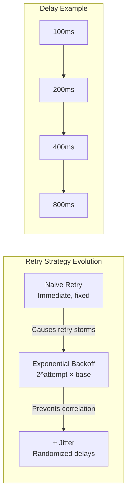

# Exponential Backoff and Retry Strategy

Learn how to build resilient distributed systems using exponential backoff, jitter, and modern retry strategies to handle transient failures and prevent cascading outages.

<figure>



<figcaption>Evolution from naive retries to exponential backoff with jitter for preventing thundering herd problems</figcaption>

</figure>

## Abstract

Exponential backoff with jitter solves a fundamental contention problem: how multiple uncoordinated clients can share a recovering resource without overwhelming it. The core insight is that deterministic retry timing causes correlated failures—clients that fail together retry together.

**The mental model has three layers:**

1. **Backoff spreads load over time**: The formula `delay = min(cap, base × 2^attempt)` creates exponentially growing windows. After 5 failures with base=100ms, the delay reaches 3.2s—giving the server breathing room.

2. **Jitter decorrelates clients**: Without randomization, 1000 clients failing at t=0 all retry at t=100ms, t=200ms, t=400ms... creating synchronized spikes. Full jitter (`delay = random(0, calculated_delay)`) spreads retries uniformly across each window.

3. **Retry budgets prevent amplification**: Even with jitter, deep call chains amplify load. Google's formula—allow retries only when `retry_ratio < 10%`—caps worst-case amplification at 1.1x instead of 3x per layer.

**The hierarchy of defense:**

| Layer | Mechanism                    | Handles            | Typical Config                    |
| ----- | ---------------------------- | ------------------ | --------------------------------- |
| 1     | Single retry                 | Network blips      | 1 attempt, no delay               |
| 2     | Exponential backoff + jitter | Transient overload | 3-5 attempts, 100ms base, 30s cap |
| 3     | Retry budget                 | Cascade prevention | 10% ratio per client              |
| 4     | Circuit breaker              | Persistent failure | 50% failures → open for 30s       |

**Prerequisites:** Idempotency. Non-idempotent operations cannot be safely retried—design idempotency keys into APIs before implementing retry logic.

## I. Introduction: Beyond Naive Retries

The fundamental challenge for the systems architect is not to eliminate these failures—an impossible task—but to handle them with a grace and intelligence that prevents them from amplifying into catastrophic, system-wide outages. The initial, intuitive response to a transient failure is to simply try again. However, the manner in which this retry is executed is one of the most critical factors determining the stability of a distributed system.

The most dangerous anti-pattern in this domain is the simplistic, immediate retry. A naive `while(true)` loop or a fixed, short-delay retry mechanism, when implemented across multiple clients, can trigger a devastating feedback loop known as a "retry storm" or a "thundering herd". As a service begins to recover from an initial fault, it is immediately inundated by a synchronized flood of retry attempts from all its clients. This surge overwhelms the recovering service, consuming its connection pools, threads, and CPU cycles, effectively preventing it from stabilizing.

### The Core Problem: Contention Resolution

The core problem that exponential backoff addresses—contention for a shared resource by multiple, uncoordinated actors—is a fundamental and recurring pattern in computer science. There is a direct and powerful parallel between the high-level challenge of service-to-service communication in a microservices architecture and the low-level problem of packet transmission in networking protocols.

The "thundering herd" problem, where thousands of clients simultaneously retry requests against a single recovering API endpoint, is functionally identical to a packet collision storm in early Ethernet networks. In both scenarios, multiple independent agents attempt to use a shared resource (the API server, the physical network cable) at the same time, leading to mutual interference that degrades system throughput to near zero.

## II. The Mechanics of Exponential Backoff

### From Linear to Exponential

| Strategy    | Formula                    | Delay Sequence (base=1s) | Problem                             |
| ----------- | -------------------------- | ------------------------ | ----------------------------------- |
| Constant    | `delay = base`             | 1s, 1s, 1s, 1s           | No adaptation to outage severity    |
| Linear      | `delay = base × attempt`   | 1s, 2s, 3s, 4s           | Growth too slow for severe overload |
| Exponential | `delay = base × 2^attempt` | 1s, 2s, 4s, 8s           | Matches geometric recovery needs    |

Exponential backoff's power comes from matching the typical recovery curve of overloaded systems. When a service is overwhelmed, it needs time proportional to the severity of overload—not constant additional time. The exponential curve creates "breathing room" that grows with failure count.

### The Core Algorithm and its Parameters

The canonical implementation of exponential backoff is almost always a capped exponential backoff. The capping mechanism is crucial to prevent delays from growing to impractical lengths. The formula is as follows:

```
delay = min(cap, base * factor^attempt)
```

Each component of this formula is a critical tuning parameter:

- **base**: The initial delay, typically a small value like 100ms
- **factor**: The multiplicative base of the exponent, commonly set to 2 (binary exponential backoff)
- **attempt**: The zero-indexed counter for the number of retries
- **cap**: An essential upper bound on the delay, typically set between 30 and 60 seconds

### Mathematical Justification

The collision probability analysis comes from Ethernet's BEB (Binary Exponential Backoff) algorithm in IEEE 802.3. After `c` collisions, the delay window is `[0, 2^c - 1]` slot times. The expected backoff is `(2^c - 1) / 2`.

For N contending clients with collision count c:

- Collision probability per slot: `1/N` for each client to choose the same slot
- With window size `2^c`: collision probability ≈ `N / 2^c`
- At c=10 with 1000 clients: collision probability ≈ 0.1%

This is why the IEEE 802.3 spec caps at `c=10` (1024 slots). Beyond this, the law of diminishing returns applies—larger windows provide minimal additional benefit while increasing latency.

## III. Preventing Correlated Failures with Jitter

### Deconstructing the "Thundering Herd"

The exponential backoff algorithm, in its pure, deterministic form, contains a subtle but critical flaw. While it effectively spaces out retries over increasingly long intervals, it does so in a predictable way. Consider a scenario where a network event causes a thousand clients to fail their requests to a service at the exact same moment. With a simple exponential backoff strategy, all one thousand of those clients will calculate the exact same delay for their first retry (e.g., base \* 2^1). They will all go silent, and then, at the same precise millisecond in the future, all one thousand will retry simultaneously.

### Jitter as a De-correlation Mechanism

Jitter is the mechanism for breaking this correlation. By introducing a controlled amount of randomness into the backoff delay, jitter ensures that the retries from multiple clients are spread out over a time window rather than being clustered at a single point. This de-correlation smooths the load on the downstream service, transforming a series of sharp, debilitating spikes into a more manageable, near-constant rate of retries.

### Jitter Algorithms Compared

AWS's 2015 analysis established three canonical jitter strategies. The choice depends on whether you prioritize spread (full), predictability (equal), or adaptiveness (decorrelated).

#### Full Jitter (Recommended)

```typescript
sleep = random_between(0, min(cap, (base * 2) ^ attempt))
```

- **Spread**: Maximum randomization across entire window
- **Trade-off**: Occasional near-zero delays, but lowest total completion time in aggregate
- **AWS recommendation**: Full jitter for most applications

#### Equal Jitter

```typescript
temp = min(cap, (base * 2) ^ attempt)
sleep = temp / 2 + random_between(0, temp / 2)
```

- **Spread**: Half the window, guaranteed minimum wait
- **Trade-off**: More predictable latency, slightly higher total completion time
- **Use case**: When you need bounded minimum delay for resource cleanup

#### Decorrelated Jitter

```typescript
sleep = min(cap, random_between(base, previous_sleep * 3))
```

- **Spread**: Depends on previous delay, not attempt count
- **Trade-off**: Naturally adaptive, but clamping to `cap` repeatedly degrades distribution
- **Caveat (2024)**: When `previous_sleep * 3 > cap`, repeated clamping causes delays to cluster near `cap`, losing the decorrelation benefit. Full jitter avoids this edge case.

## IV. Production-Ready Implementation

### Design Goals

A production-grade retry utility must be designed as a robust, flexible, and reusable component that promotes clean code and a clear separation of concerns. The ideal implementation takes the form of a higher-order function or decorator that can wrap any async operation.

Key design goals include:

- **Configurability**: All core parameters must be configurable
- **Pluggable Jitter Strategies**: Choice of jitter algorithm should be injectable
- **Intelligent Error Filtering**: Distinguish between retryable and non-retryable errors
- **Cancellation Support**: Integration with AbortController for proper resource management

### Core Implementation

```typescript title="retry-with-backoff.ts" collapse={1-22, 63-85}
// Type Definitions
export type JitterStrategy = (delay: number) => number

export interface RetryOptions {
  maxRetries?: number
  initialDelay?: number
  maxDelay?: number
  backoffFactor?: number
  jitterStrategy?: JitterStrategy
  isRetryableError?: (error: unknown) => boolean
  abortSignal?: AbortSignal
}

// Jitter Strategy Implementations
export const fullJitter: JitterStrategy = (delay) => Math.random() * delay

export const equalJitter: JitterStrategy = (delay) => {
  const halfDelay = delay / 2
  return halfDelay + Math.random() * halfDelay
}

// Core Retry Utility
export async function retryWithBackoff<T>(operation: () => Promise<T>, options: RetryOptions = {}): Promise<T> {
  const {
    maxRetries = 5,
    initialDelay = 100,
    maxDelay = 30000,
    backoffFactor = 2,
    jitterStrategy = fullJitter,
    isRetryableError = (error: unknown) => !(error instanceof Error && error.name === "AbortError"),
    abortSignal,
  } = options

  let attempt = 0
  let lastError: unknown

  while (attempt <= maxRetries) {
    if (abortSignal?.aborted) {
      throw new DOMException("Aborted", "AbortError")
    }

    try {
      return await operation()
    } catch (error) {
      lastError = error

      if (!isRetryableError(error) || attempt === maxRetries || abortSignal?.aborted) {
        throw lastError
      }

      const exponentialDelay = initialDelay * Math.pow(backoffFactor, attempt)
      const cappedDelay = Math.min(exponentialDelay, maxDelay)
      const jitteredDelay = jitterStrategy(cappedDelay)

      console.warn(`Attempt ${attempt + 1} failed. Retrying in ${Math.round(jitteredDelay)}ms...`)

      await delay(jitteredDelay, abortSignal)
      attempt++
    }
  }

  throw lastError
}

// Helper function for cancellable delays
const delay = (ms: number, signal?: AbortSignal): Promise<void> => {
  return new Promise((resolve, reject) => {
    if (signal?.aborted) {
      return reject(new DOMException("Aborted", "AbortError"))
    }

    const onAbort = () => {
      clearTimeout(timeoutId)
      reject(new DOMException("Aborted", "AbortError"))
    }

    const timeoutId = setTimeout(() => {
      signal?.removeEventListener("abort", onAbort)
      resolve()
    }, ms)

    signal?.addEventListener("abort", onAbort, { once: true })
  })
}
```

### Example Usage

```typescript title="example-usage.ts" collapse={1-22}
class HttpError extends Error {
  constructor(
    public status: number,
    message: string,
  ) {
    super(message)
    this.name = "HttpError"
  }
}

function isHttpErrorRetryable(error: unknown): boolean {
  if (error instanceof Error && error.name === "AbortError") {
    return false
  }

  if (error instanceof HttpError) {
    return error.status >= 500 || error.status === 429
  }

  return true
}

async function resilientFetchExample() {
  const controller = new AbortController()

  try {
    const data = await retryWithBackoff(() => fetchSomeData("https://api.example.com/data", controller.signal), {
      maxRetries: 4,
      initialDelay: 200,
      maxDelay: 5000,
      jitterStrategy: equalJitter,
      isRetryableError: isHttpErrorRetryable,
      abortSignal: controller.signal,
    })
    console.log("Successfully fetched data:", data)
  } catch (error) {
    console.error("Operation failed after all retries:", error)
  }
}
```

## V. The Broader Resilience Ecosystem

Exponential backoff with jitter is a powerful and essential tool, but it is not a panacea. Its true power is unlocked when it is employed as one component within a comprehensive, multi-layered resilience strategy.

### Backoff and Circuit Breakers: A Symbiotic Relationship

The relationship between exponential backoff and the circuit breaker pattern is the most critical interaction in this ecosystem. They operate at different scopes:

| Pattern             | Scope                    | Trigger                | Response                |
| ------------------- | ------------------------ | ---------------------- | ----------------------- |
| Exponential backoff | Single request           | Transient error        | Wait, retry             |
| Circuit breaker     | All requests to endpoint | Failure rate threshold | Fast-fail, stop calling |

**Implementation order matters**: Retry logic must be encapsulated within circuit breaker protection. The sequence:

1. Check circuit breaker state—if open, fast-fail without attempting
2. Execute request
3. On transient error → exponential backoff retries
4. After max retries exhausted → report failure to circuit breaker
5. Circuit breaker tracks failure rate → opens if threshold exceeded

**Service mesh integration (Istio)**: Modern Kubernetes deployments separate these concerns:

```yaml
# VirtualService - retry configuration
apiVersion: networking.istio.io/v1beta1
spec:
  http:
    - retries:
        attempts: 3
        perTryTimeout: 2s
        retryOn: 5xx,reset,connect-failure

---
# DestinationRule - circuit breaker (outlier detection)
apiVersion: networking.istio.io/v1beta1
spec:
  trafficPolicy:
    outlierDetection:
      consecutive5xxErrors: 5
      interval: 30s
      baseEjectionTime: 30s
```

The service mesh handles both patterns at the infrastructure layer, removing the need for application-level circuit breaker libraries in many cases.

### Backoff, Throttling, and Retry Budgets

#### Handling Explicit Signals (RFC 9110)

When a service responds with HTTP 429 (Too Many Requests) or 503 (Service Unavailable), check for the `Retry-After` header. Per RFC 9110 Section 10.2.3, this header specifies either:

- **Absolute time**: `Retry-After: Wed, 21 Oct 2025 07:28:00 GMT`
- **Relative delay**: `Retry-After: 120` (seconds)

The client-side implementation should:

1. Parse `Retry-After` if present—it takes precedence over calculated backoff
2. Fall back to exponential backoff if header is absent
3. Add jitter even when honoring `Retry-After` to decorrelate synchronized retries

```typescript collapse={1-5}
function getRetryDelay(response: Response, calculatedDelay: number): number {
  const retryAfter = response.headers.get("Retry-After")
  if (!retryAfter) return calculatedDelay

  // Check if it's a number (seconds) or HTTP-date
  const seconds = parseInt(retryAfter, 10)
  if (!isNaN(seconds)) return seconds * 1000

  const date = Date.parse(retryAfter)
  if (!isNaN(date)) return Math.max(0, date - Date.now())

  return calculatedDelay
}
```

#### The Retry Budget Concept

Google SRE's retry budget pattern provides a global defense against retry amplification. The implementation uses two complementary limits:

**Per-request limit**: Maximum 3 retry attempts per request. After 3 failures, propagate the error to the caller.

**Per-client retry budget**: Track the ratio of retries to total requests. Allow retries only when:

```
retry_ratio = retries / (requests + retries) < 0.1  // 10% threshold
```

**Impact analysis**: Without per-client budgets, a 3-layer system with 3 retries each amplifies load by `3^3 = 27x`. With the 10% budget, worst-case amplification drops to approximately `1.1x` per layer.

The distinction matters: backends must signal whether overload is localized (retry elsewhere) or system-wide (stop retrying). gRPC uses status codes for this: `UNAVAILABLE` (transient, retry) vs `RESOURCE_EXHAUSTED` (backpressure, don't retry immediately).

### Alternative Strategies: Contrasting with Request Hedging

Request hedging targets tail latency (p99 and above), not failure handling. In large-scale systems, a fraction of requests are slow due to GC (Garbage Collection) pauses, network jitter, or hot spots.

| Aspect       | Exponential Backoff         | Request Hedging                           |
| ------------ | --------------------------- | ----------------------------------------- |
| Goal         | Handle failures             | Reduce tail latency                       |
| Execution    | Serial: fail → wait → retry | Parallel: request → wait → send duplicate |
| Trigger      | Error response              | Timeout (e.g., p95 latency)               |
| Load impact  | Reduces load during outage  | Increases load (~1-2% more requests)      |
| gRPC support | `retryPolicy`               | `hedgingPolicy` (gRFC A6)                 |

gRPC's hedging configuration (gRFC A6) sends parallel copies after `hedgingDelay` and cancels when any succeeds:

```json
{
  "hedgingPolicy": {
    "maxAttempts": 3,
    "hedgingDelay": "0.5s",
    "nonFatalStatusCodes": ["UNAVAILABLE", "UNKNOWN"]
  }
}
```

**Critical**: Hedging and retry are mutually exclusive per-method in gRPC. You cannot configure both on the same method.

## VI. Operationalizing Backoff

### The Prerequisite of Idempotency

The single most important prerequisite for any automatic retry mechanism is idempotency. An operation is idempotent if making the same request multiple times has the exact same effect on the system's state as making it just once.

For write operations (e.g., HTTP POST, PUT, DELETE), idempotency must be explicitly designed into the API. A common technique is to require the client to generate a unique key (e.g., a UUID) and pass it in a header like `Idempotency-Key`.

### Tuning Parameters in Production

The parameters for a backoff strategy should not be chosen arbitrarily or left as library defaults. They must be tuned based on the specific context of the service being called and the business requirements of the operation.

#### Using Latency Metrics

The initial timeout and backoff parameters should be directly informed by the performance metrics of the downstream service. A widely adopted best practice is to set the per-attempt timeout to a value slightly above the service's p99 or p99.5 latency under normal, healthy conditions.

#### Error Budgets

The maximum number of retries (maxRetries) should be considered in the context of the service's SLOs (Service Level Objectives) and corresponding error budget. A critical, user-facing request path might have a very small retry count (e.g., 2-3) to prioritize failing fast.

### Observability: What to Log and Monitor

For every retry attempt, the system should log:

- The specific operation being retried
- The attempt number (e.g., "retry 2 of 5")
- The calculated delay before the jitter was applied
- The final, jittered delay that was used
- The specific error (including stack trace and any relevant error codes) that triggered the retry

Key metrics to collect and dashboard include:

- **Retry Rate**: The number of retries per second, broken down by endpoint or downstream service
- **Success Rate After Retries**: The percentage of operations that ultimately succeed after one or more retries
- **Final Failure Rate**: The percentage of operations that fail even after all retries are exhausted
- **Circuit Breaker State**: The current state (Closed, Open, Half-Open) of any associated circuit breakers
- **Retry Delay Distribution**: A histogram of the actual delays used

## VII. Learning from Real-World Failures

### Case Study 1: The Thundering Herd (Discord/Slack)

**Scenario**: This pattern manifests when a large number of clients are disconnected from a central service simultaneously, either due to a network partition or a brief failure of the service itself.

**Failure Mode**: The massive, synchronized surge of reconnection attempts acts as a self-inflicted DDoS (Distributed Denial of Service) attack. In the case of Discord, a "flapping" service triggered a "thundering herd" of reconnections that exhausted memory in frontend services.

**Lesson**: This is the canonical failure mode that jittered backoff is designed to prevent. Without randomization and a gradual backoff in connection logic, the recovery of a service can trigger its immediate re-failure.

### Case Study 2: Retry Amplification (Google SRE Example)

**Scenario**: Consider a deeply nested, multi-layered microservices architecture. A single user action at the top layer triggers a chain of calls down through the stack, ultimately hitting a database.

**Failure Mode**: When the lowest-level dependency (the database) begins to fail under load, the retry logic at each layer amplifies the load multiplicatively. If each of three layers performs up to 4 attempts (1 initial + 3 retries), a single initial user request can result in up to 4³=64 attempts on the already-struggling database.

**Lesson**: Retry logic must be implemented holistically and with awareness of the entire system architecture. The best practice is to retry at a single, well-chosen layer of the stack.

### Case Study 3: Non-Idempotent Retries (Twilio)

**Scenario**: A billing service at Twilio experienced a failure in its backing Redis cluster. The application logic was structured to first charge a customer's credit card and then, in a separate step, update the customer's internal account balance.

**Failure Mode**: Because the operation was not idempotent, the retry caused the customer's credit card to be charged a second time. The system "continued to retry the transaction again and again," leading to multiple erroneous charges for customers.

**Lesson**: This incident underscores the absolute criticality of idempotency as a prerequisite for automated retries. If an operation has side effects that cannot be made idempotent, it must not be subject to a generic, automated retry mechanism.

## VIII. Conclusion

This exploration of exponential backoff has journeyed from the fundamental mechanics of the algorithm to its sophisticated application within a broader ecosystem of resilience patterns, culminating in the harsh lessons learned from real-world system failures.

The overarching conclusion is that robust failure handling is not an optional feature or an afterthought; it is a foundational design principle for any distributed system. The naive retry, born of good intentions, is a liability at scale. A disciplined, intelligent retry strategy, built on the principles of exponential backoff and jitter, is an asset that underpins system stability.

The patterns discussed—particularly the symbiotic relationship between exponential backoff for transient faults and circuit breakers for persistent ones—represent a mature engineering philosophy. It is a philosophy that shifts the focus from attempting to prevent all failures, an impossible goal, to engineering systems that can gracefully tolerate and automatically recover from them.

The final call to action for the expert practitioner is to move beyond simplistic implementations and to embrace a holistic, data-driven, and context-aware approach to building resilient systems. This requires:

1. **Understanding the Theory**: Recognizing that patterns like jittered backoff are not arbitrary but are grounded in the mathematics of contention resolution
2. **Implementing with Discipline**: Building flexible, configurable, and observable retry utilities that are aware of idempotency and cancellation
3. **Thinking in Ecosystems**: Architecting systems where resilience patterns work in concert, each handling the class of failure for which it was designed
4. **Tuning with Data**: Using production metrics—latency percentiles, error rates, and SLOs—to inform the configuration of every backoff and circuit breaker parameter
5. **Learning from Failure**: Treating every incident and post-mortem as an invaluable source of knowledge to harden systems against future failures

By adopting this comprehensive mindset, engineers can transform the unpredictable nature of distributed systems from a source of fragility into an opportunity for resilience, building applications that remain available and responsive even in the face of inevitable, challenging conditions.

## Appendix

### Prerequisites

- Understanding of HTTP status codes (4xx vs 5xx error classes)
- Familiarity with async/await patterns in JavaScript/TypeScript
- Basic distributed systems concepts (latency, availability, consistency)

### Terminology

| Term                    | Definition                                                                       |
| ----------------------- | -------------------------------------------------------------------------------- |
| **BEB**                 | Binary Exponential Backoff—the algorithm from IEEE 802.3 Ethernet                |
| **p99**                 | 99th percentile latency—the latency at which 99% of requests complete            |
| **SLO**                 | Service Level Objective—target reliability/performance metrics                   |
| **Idempotency**         | Property where repeated operations produce the same result as a single execution |
| **Thundering herd**     | Coordinated retry storm when many clients fail and retry simultaneously          |
| **Retry amplification** | Multiplicative load increase in multi-layer systems where each layer retries     |

### Summary

- Exponential backoff spreads retry load over time: `delay = min(cap, base × 2^attempt)`
- Jitter decorrelates clients—full jitter (`random(0, delay)`) recommended for maximum spread
- Retry budgets (10% threshold) prevent cascade failures in deep call chains
- Circuit breakers handle persistent failures; backoff handles transient ones—use both
- Always honor `Retry-After` headers when present (RFC 9110)
- Idempotency is a prerequisite—non-idempotent operations cannot be safely retried

### References

**Specifications**

- [RFC 9110 - HTTP Semantics](https://httpwg.org/specs/rfc9110.html) - Section 10.2.3 for Retry-After header
- [IEEE 802.3](https://standards.ieee.org/ieee/802.3/7071/) - Binary Exponential Backoff algorithm origin
- [gRFC A6 - gRPC Client Retries](https://github.com/grpc/proposal/blob/master/A6-client-retries.md) - Retry and hedging specification

**Official Documentation**

- [AWS Architecture Blog - Exponential Backoff and Jitter](https://aws.amazon.com/blogs/architecture/exponential-backoff-and-jitter/) - Canonical jitter analysis
- [AWS Builders' Library - Timeouts, Retries, and Backoff](https://aws.amazon.com/builders-library/timeouts-retries-and-backoff-with-jitter/)
- [AWS SDK Retry Behavior](https://docs.aws.amazon.com/sdkref/latest/guide/feature-retry-behavior.html) - Standard and Adaptive modes
- [Google SRE Book - Handling Overload](https://sre.google/sre-book/handling-overload/) - Retry budget patterns
- [Google Cloud Storage Retry Strategy](https://cloud.google.com/storage/docs/retry-strategy)
- [gRPC Retry Documentation](https://grpc.io/docs/guides/retry/)
- [Istio Circuit Breaking](https://istio.io/latest/docs/tasks/traffic-management/circuit-breaking/)

**Architecture Patterns**

- [Azure Circuit Breaker Pattern](https://learn.microsoft.com/en-us/azure/architecture/patterns/circuit-breaker)
- [Azure Retry Pattern](https://learn.microsoft.com/en-us/azure/architecture/patterns/retry)
- [Netflix Hystrix Wiki](https://github.com/Netflix/Hystrix/wiki) - Historical reference (maintenance mode)

**Code Samples**

- [Code Samples With Tests](https://github.com/sujeet-pro/code-samples/tree/main/patterns/exponential-backoff)
