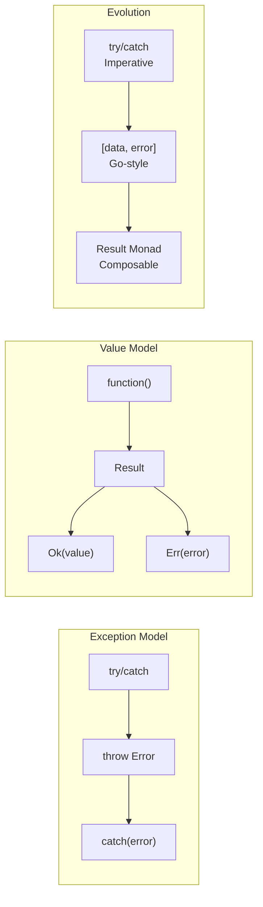
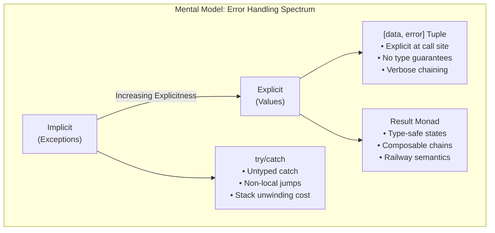
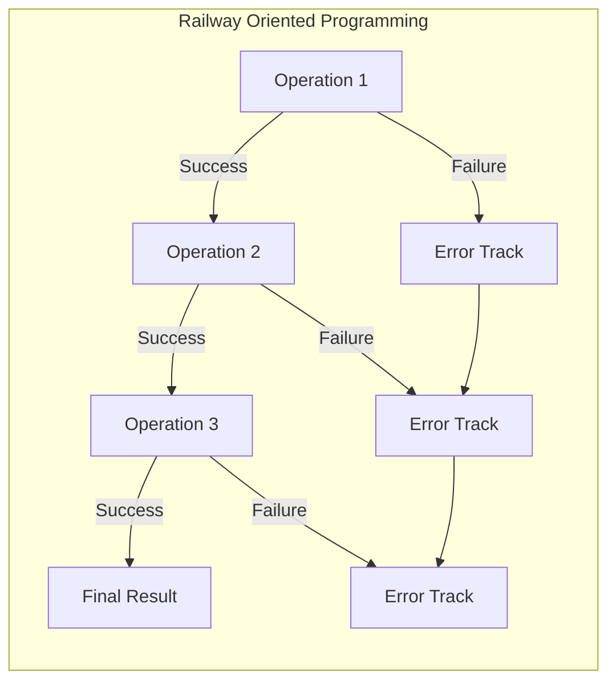

# JavaScript Error Handling Patterns

Master exception-based and value-based error handling approaches, from traditional try-catch patterns to modern functional programming techniques with monadic structures.

<figure>



<figcaption>Evolution from exception-based to value-based error handling paradigms</figcaption>

</figure>

## Abstract

<figure>



<figcaption>Error handling paradigms: from implicit exception propagation to explicit value-based composition</figcaption>

</figure>

The core decision in JavaScript error handling is **where failure information lives**: in an invisible control flow path (exceptions) or in the function's return type (values). This choice ripples through your entire architecture.

**Exception model** (`try/catch`): Failure is a side effect. Functions have two exit paths—return and throw—but the type signature only declares one. The runtime unwinds the stack searching for handlers, which is expensive (~10-100x slower than returns) and makes control flow non-local.

**Value model** (`Result<T, E>`): Failure is data. Functions return a discriminated union that forces callers to acknowledge both outcomes. Operations compose via `.map()` (transform success) and `.andThen()` (chain fallible operations), with failures automatically bypassing subsequent success handlers—this is Railway Oriented Programming.

**The trade-off matrix**:

| Criterion       | try/catch                  | [data, error]          | Result Monad        |
| --------------- | -------------------------- | ---------------------- | ------------------- |
| Type safety     | `catch` receives `unknown` | Convention-based       | Compiler-enforced   |
| Composability   | Imperative nesting         | Repetitive `if (err)`  | Fluent chaining     |
| Failure forcing | Easy to ignore             | Easy to ignore         | Linting can enforce |
| Performance     | Stack unwinding            | Value return           | Value return        |
| Debugging       | Native stack traces        | May lose stack context | Errors are values   |

**Recommendation**: Use `neverthrow` (v8.x) for new TypeScript code—it balances type safety with ergonomics and has ESLint rules that enforce Result consumption. Reserve `try/catch` for external boundaries (parsing user input, calling throwing APIs) and convert immediately to Result types.

## Introduction

Error handling shapes architecture. The choice between exceptions and values determines how failure propagates through your system, how composition works, and what guarantees your type system can provide.

JavaScript's `try...catch` mechanism, standardized in ECMAScript 3 (ES3, December 1999), treats errors as exceptional events that halt normal execution and transfer control elsewhere. This model served well for decades but carries fundamental limitations: untyped catch blocks, non-local control flow, and easy error swallowing.

The functional alternative—errors as return values—gained momentum with TypeScript's adoption and the influence of languages like Rust (`Result<T, E>`) and Haskell (`Either a b`). Libraries like `neverthrow` and `fp-ts` bring these patterns to JavaScript, offering type safety and composability that exceptions cannot provide.

> **Version context**: This article covers ECMAScript 2025 (ES16) for language features and TypeScript 5.x for type system capabilities. TC39 proposal stages are current as of January 2026.

## Section 1: The Orthodox Approach - Exceptions as Control Flow

JavaScript's exception model, rooted in imperative traditions inherited from C++ and Java, treats errors as control flow events that halt execution and transfer to a handler.

### 1.1 The Core Mechanics: try, throw, and Error

Per ECMA-262 §14.15, the `try` statement provides structured exception handling:

```javascript collapse={1-2}
// ECMA-262 §14.15: TryStatement
// try Block Catch | try Block Finally | try Block Catch Finally
try {
  const result = riskyOperation()
  return processResult(result)
} catch (error) {
  console.error("Operation failed:", error)
  return fallbackValue
} finally {
  cleanup() // Always executes, even after return/throw
}
```

**Execution semantics** (per ECMA-262 §14.15.3):

1. Execute the `try` block
2. If an exception is thrown, the runtime creates a **ThrowCompletion** record and searches the call stack for a matching `catch`
3. If found, bind the thrown value to the catch parameter and execute the catch block
4. Execute `finally` regardless of outcome—even if `try` or `catch` contains `return` or `throw`

**Critical edge case**: The `finally` block can override returns and suppress exceptions:

```javascript
function surprising() {
  try {
    throw new Error("Original error")
  } finally {
    return "finally wins" // Suppresses the throw!
  }
}
surprising() // Returns "finally wins", no error thrown
```

**The `throw` statement** (ECMA-262 §14.14) accepts any value—this is a design flaw, not a feature:

```javascript collapse={1-3}
// ECMA-262 allows throwing ANY value
// This makes catch blocks fundamentally untyped

// Anti-patterns (still legal):
throw "Something went wrong" // string
throw 404 // number
throw { code: "E_FAIL" } // plain object
throw null // null (breaks error.message access)

// Correct pattern:
throw new Error("Something went wrong")
throw new TypeError("Expected string, got number")
```

**Error hierarchy** (ECMA-262 §20.5): The built-in error types form a prototype chain:

- `Error` (base)
  - `EvalError`, `RangeError`, `ReferenceError`, `SyntaxError`, `TypeError`, `URIError`
  - `AggregateError` (ES2021, for `Promise.any` rejections)

Each instance captures:

- `message`: Human-readable description
- `name`: Error type name (e.g., "TypeError")
- `stack`: Non-standard but universally implemented stack trace
- `cause` (ES2022): Optional chained error for wrapping

> **ES2022 addition**: The `cause` option enables error chaining without losing the original stack:
>
> ```javascript
> throw new Error("High-level failure", { cause: originalError })
> ```

### 1.2 Asynchronous Error Propagation

Promises (ES2015) and async/await (ES2017) extend exception semantics to asynchronous code, but with critical differences in error propagation.

**Promise rejection** uses `.catch()` for error handling:

```javascript collapse={1-2}
// Promise rejection becomes ThrowCompletion when awaited
// or is handled by .catch()
fetch("/api/data")
  .then((response) => response.json())
  .then((data) => processData(data))
  .catch((error) => {
    console.error("Request failed:", error)
    return fallbackData
  })
```

**async/await** (ES2017) unifies syntax but changes timing:

```javascript collapse={1-2}
// await converts Promise rejection to thrown exception
// enabling standard try/catch
async function fetchData() {
  try {
    const response = await fetch("/api/data")
    const data = await response.json()
    return processData(data)
  } catch (error) {
    console.error("Request failed:", error)
    return fallbackData
  }
}
```

**Critical edge cases and failure modes**:

1. **Unhandled rejection** (silent failure pre-Node 15):

   ```javascript
   async function leaky() {
     fetch("/api/data") // No await, no catch - rejection lost!
   }
   ```

   > **Node.js evolution**: Prior to Node.js 15, unhandled rejections only emitted warnings. Node.js 15+ crashes the process by default (`--unhandled-rejections=throw`).

2. **Promise constructor anti-pattern**:

   ```javascript
   // Exceptions in Promise executor are caught and become rejections
   new Promise((resolve) => {
     throw new Error("Sync throw") // Becomes rejection, not uncaught exception
   })

   // BUT: async callbacks inside the executor are NOT caught
   new Promise((resolve) => {
     setTimeout(() => {
       throw new Error("Escapes!") // Uncaught exception
     }, 0)
   })
   ```

3. **Concurrent await gotcha**:

   ```javascript collapse={1-3}
   // Sequential: Second fetch waits for first
   // If first fails, second never starts
   const a = await fetch("/a") // Throws here
   const b = await fetch("/b") // Never reached

   // Concurrent: Both start immediately
   // First rejection wins, second rejection is unhandled!
   const [a, b] = await Promise.all([
     fetch("/a"), // Rejects
     fetch("/b"), // Also rejects - this rejection is "lost"
   ])

   // Fix: Use Promise.allSettled for independent operations
   const results = await Promise.allSettled([fetch("/a"), fetch("/b")])
   ```

### 1.3 A Critical Assessment of the Exception Model

Exceptions have fundamental architectural costs that motivate alternatives.

**1. Functions have invisible exit paths**

A signature like `function processData(data): ProcessedData` lies—the function has two exit paths (return and throw), but only one is declared. This breaks referential transparency and makes reasoning about code harder.

```typescript
// Type signature promises ProcessedData
function processData(data: Input): ProcessedData {
  if (!data.valid) throw new Error("Invalid") // Hidden exit
  return transform(data)
}

// Caller has no compile-time warning
const result = processData(input) // Might throw!
```

**2. Stack unwinding is expensive**

When an exception is thrown, the runtime must:

1. Allocate an Error object and capture the stack trace
2. Search up the call stack for a `catch` handler
3. Unwind each stack frame, running any `finally` blocks

**Performance impact**: Throwing is 10-100x slower than returning. In V8, a thrown error costs ~1-2μs vs ~10-50ns for a return. This matters in hot paths.

```javascript collapse={1-4}
// Benchmark: 1M iterations
// Return path: ~15ms
// Throw path: ~1500ms (100x slower)

// Anti-pattern: using exceptions for control flow
function findItem(arr, predicate) {
  try {
    arr.forEach((item) => {
      if (predicate(item)) throw item // Don't do this
    })
  } catch (found) {
    return found
  }
  return null
}
```

**3. TypeScript's `unknown` catch parameter**

Per TypeScript 4.4+, catch variables are typed as `unknown` (previously `any`). This is correct—JavaScript allows throwing anything—but forces runtime guards:

```typescript
try {
  riskyOperation()
} catch (error) {
  // error: unknown - must narrow before use
  if (error instanceof Error) {
    console.log(error.message) // Safe
  } else if (typeof error === "string") {
    console.log(error) // Also possible
  } else {
    console.log("Unknown error type", error)
  }
}
```

> **TypeScript history**: Prior to 4.4, catch variables were `any` by default. The `useUnknownInCatchVariables` compiler option (now default with `strict`) changed this to `unknown`, forcing explicit type narrowing.

**4. Silent error swallowing**

Nothing prevents empty or incomplete catch blocks:

```typescript
try {
  await criticalOperation()
} catch (e) {
  // "I'll handle this later" - famous last words
  console.log("Error occurred")
  // No re-throw, no recovery, error is lost
}
```

**5. Error.isError (ES2026)**

A new standard feature advancing to Stage 4 addresses error type checking across realms:

```javascript
// Problem: instanceof fails across iframes/realms
const iframe = document.createElement("iframe")
document.body.appendChild(iframe)
const IframeError = iframe.contentWindow.Error
const foreignError = new IframeError("from iframe")

foreignError instanceof Error // false! Different Error constructor

// Solution (ES2026):
Error.isError(foreignError) // true - works across realms
```

## Section 2: The Paradigm Shift - Errors as Return Values

The functional alternative treats errors as data, not control flow. Failure becomes part of the return type, making it visible in signatures and enforceable by the type system.

### 2.1 The Go-Style Tuple Pattern

Go's idiomatic `value, err := operation()` pattern has been adapted to JavaScript. Functions return `[data, error]` tuples:

```typescript collapse={1-3}
// Helper to convert Promise rejections to tuples
// Commonly called "to" or "safe"

function to<T>(promise: Promise<T>): Promise<[T | null, Error | null]> {
  return promise.then((data) => [data, null]).catch((err) => [null, err])
}

async function fetchUserData(id: string) {
  const [user, err] = await to(fetch(`/api/users/${id}`))
  if (err) {
    console.error("Failed to fetch user:", err)
    return null
  }
  return user
}
```

**Why this pattern exists**: Explicit error acknowledgment at call sites. The `err` variable is visible, nudging developers to handle it.

**Why it's a leaky abstraction**:

1. **No type-level exclusivity**: `[T | null, Error | null]` allows four states: `[value, null]`, `[null, error]`, `[null, null]`, and `[value, error]`. Only two are valid.

   ```typescript
   // TypeScript cannot prevent this:
   const result: [User | null, Error | null] = [null, null] // Valid type, invalid state
   ```

2. **Verbose chaining** produces "staircase code":

   ```typescript collapse={1-5}
   // Each step needs its own error check
   // Compare to .andThen() chaining in Result types

   async function processUserOrder(userId: string) {
     const [user, err1] = await to(fetchUser(userId))
     if (err1) return [null, err1]

     const [orders, err2] = await to(fetchOrders(user.id))
     if (err2) return [null, err2]

     const [processed, err3] = await to(processOrders(orders))
     if (err3) return [null, err3]

     return [processed, null]
   }
   ```

3. **No forced handling**: Nothing prevents ignoring the error:

   ```typescript
   const [user, err] = await to(fetchUser(id))
   // Oops, forgot to check err
   console.log(user.name) // Runtime error if err was set
   ```

4. **Stack trace loss**: If the caught value isn't an Error instance, you lose debugging context:

   ```typescript
   // Some APIs reject with non-Error values
   const [data, err] = await to(someBadApi())
   // err might be a string, number, or object - no stack trace
   ```

**When tuples make sense**: Simple scripts, prototypes, or when you genuinely cannot add dependencies. For production systems, prefer proper Result types.

### 2.2 The Functional Evolution: Monadic Error Handling

The `Result` monad (or `Either` in Haskell/fp-ts terminology) formalizes error-as-value with type-safe guarantees. This pattern originates from ML-family languages and was popularized in Rust.

**The core insight**: A discriminated union with exactly two variants:

```typescript
type Result<T, E> =
  | { ok: true; value: T } // Success
  | { ok: false; error: E } // Failure
```

This structure makes invalid states **impossible at the type level**. You cannot have both value and error, or neither.

**Railway Oriented Programming** (Scott Wlaschin's term) visualizes this as two parallel tracks:

<figure>



<figcaption>Failures automatically bypass subsequent success handlers—the "railway" metaphor</figcaption>

</figure>

**The chainable API**:

```typescript collapse={1-3}
// Result monad operations compose declaratively
// Each transforms or short-circuits based on Ok/Err state

const result = parseNumber("10")
  .map((x) => x * 2) // Transform Ok value (Err passes through)
  .andThen(
    (
      x, // Chain fallible operation
    ) => (x > 15 ? ok(x) : err("Value too small")),
  )
  .orElse((e) => ok(defaultValue)) // Recover from error
  .match(
    (value) => `Success: ${value}`, // Handle Ok
    (error) => `Error: ${error}`, // Handle Err
  )
```

**Core methods explained**:

| Method                | Also Known As             | Behavior                                              |
| --------------------- | ------------------------- | ----------------------------------------------------- |
| `.map(fn)`            | `fmap`                    | Transform `Ok` value; `Err` passes through unchanged  |
| `.andThen(fn)`        | `chain`, `flatMap`, `>>=` | Chain fallible operation; `fn` returns `Result`       |
| `.orElse(fn)`         | `recover`                 | Transform `Err`; `Ok` passes through unchanged        |
| `.match(onOk, onErr)` | `fold`, `cata`            | Exit the monad—extract a value by handling both cases |

**Why `.andThen()` is the key operation**: It prevents nested Result types. Without it:

```typescript
// .map() on a fallible function produces nested Results
const nested: Result<Result<number, string>, ParseError> = parseNumber("10").map((n) => validateRange(n)) // validateRange returns Result

// .andThen() flattens automatically
const flat: Result<number, string | ParseError> = parseNumber("10").andThen((n) => validateRange(n))
```

**Monad laws** (for the mathematically inclined): Any proper Result implementation must satisfy:

1. **Left identity**: `ok(a).andThen(f) ≡ f(a)`
2. **Right identity**: `m.andThen(ok) ≡ m`
3. **Associativity**: `m.andThen(f).andThen(g) ≡ m.andThen(x => f(x).andThen(g))`

## Section 3: Implementing Monadic Patterns in Practice

Several TypeScript libraries implement the Result pattern with different trade-offs in API design, scope, and ecosystem integration.

### 3.1 The Comprehensive Toolkit: fp-ts

[fp-ts](https://gcanti.github.io/fp-ts/) (v2.16.x, latest as of January 2026) is a complete functional programming toolkit for TypeScript. Its `Either<E, A>` type implements the Result pattern with `Left<E>` for failure and `Right<A>` for success (matching Haskell convention).

**Key design choice**: Standalone pipeable functions rather than method chaining. Data flows through `pipe()`:

```typescript title="fp-ts-example.ts" collapse={1-4}
import { pipe } from "fp-ts/function"
import * as E from "fp-ts/Either"
// fp-ts uses free functions + pipe() rather than method chaining
// This enables tree-shaking and follows FP conventions

function parseNumber(s: string): E.Either<string, number> {
  const n = parseFloat(s)
  return isNaN(n) ? E.left("Invalid number") : E.right(n)
}

const result = pipe(
  parseNumber("10"),
  E.map((x) => x * 2),
  E.chain((x) => (x > 15 ? E.right(x) : E.left("Value too small"))),
  E.match(
    (error) => `Computation failed: ${error}`,
    (value) => `Computation succeeded: ${value}`,
  ),
)
// result is "Computation succeeded: 20"
```

**fp-ts strengths**:

- Mathematically rigorous (follows Haskell patterns)
- Rich ecosystem: `Option`, `Task`, `Reader`, `State`, etc.
- Strong tree-shaking via module imports

**fp-ts weaknesses**:

- Steep learning curve—requires understanding FP vocabulary
- Verbose for simple cases
- `pipe()` syntax unfamiliar to OOP developers

> **Ecosystem evolution**: fp-ts is merging with Effect-TS, which represents what would be fp-ts v3. For new projects, consider Effect-TS directly if you want the full FP ecosystem.

### 3.2 The Pragmatic Choice: neverthrow

[neverthrow](https://github.com/supermacro/neverthrow) (v8.2.0, February 2025) focuses specifically on Result types with an ergonomic, method-chaining API familiar to OOP developers.

```typescript title="neverthrow-example.ts" collapse={1-2}
import { ok, err, Result } from "neverthrow"
// Method chaining instead of pipe() - more familiar to most JS devs

function parseNumber(s: string): Result<number, string> {
  const n = parseFloat(s)
  return isNaN(n) ? err("Invalid number") : ok(n)
}

const result = parseNumber("10")
  .map((x) => x * 2)
  .andThen((x) => (x > 15 ? ok(x) : err("Value too small")))
  .match(
    (value) => `Computation succeeded: ${value}`,
    (error) => `Computation failed: ${error}`,
  )
```

**neverthrow v8.x changes** (breaking from v7):

- `.orElse()` can now change the `Ok` type (requires explicit type arguments in some cases)
- `safeTry` no longer requires `.safeUnwrap()` call
- New `.orTee()` method for side effects on errors (v8.2.0)
- `ok()`, `err()`, `okAsync()`, `errAsync()` accept zero arguments for void returns

**The killer feature: ESLint enforcement**

[eslint-plugin-neverthrow](https://github.com/mdbetancourt/eslint-plugin-neverthrow) enforces Result consumption. This rule fails if you don't handle a Result:

```typescript
// ESLint error: Result must be consumed
const result = parseNumber("10") // Error: unconsumed Result

// Fixed: must use .match(), .unwrapOr(), or ._unsafeUnwrap()
const value = parseNumber("10").unwrapOr(0)
```

This eliminates the "forgot to check error" class of bugs entirely.

**ResultAsync for promises**:

```typescript collapse={1-3}
import { ResultAsync, okAsync, errAsync } from "neverthrow"
// ResultAsync wraps Promise<Result> with chainable API
// Avoids the awkwardness of Promise + Result nesting

const fetchUser = (id: string): ResultAsync<User, FetchError> =>
  ResultAsync.fromPromise(
    fetch(`/api/users/${id}`).then((r) => r.json()),
    (e) => new FetchError(e),
  )

// Chains work across async boundaries
const result = await fetchUser("123")
  .andThen((user) => fetchOrders(user.id))
  .map((orders) => orders.filter((o) => o.active))
```

### 3.3 The Broader Ecosystem

| Library                                              | Focus              | API Style          | Notes                            |
| ---------------------------------------------------- | ------------------ | ------------------ | -------------------------------- |
| [ts-results](https://github.com/vultix/ts-results)   | Minimal Result     | Method chaining    | Lightweight, zero dependencies   |
| [oxide.ts](https://github.com/traverse1984/oxide.ts) | Rust-like          | Method chaining    | Closer to Rust's std::result API |
| [Effect-TS](https://effect.website/)                 | Full effect system | Method + generator | fp-ts successor, comprehensive   |
| [true-myth](https://github.com/true-myth/true-myth)  | Maybe + Result     | Method chaining    | Good documentation               |

### 3.4 Comparative Analysis

| Criterion      | try/catch           | [data, error]        | fp-ts Either                | neverthrow                |
| -------------- | ------------------- | -------------------- | --------------------------- | ------------------------- |
| Type safety    | `unknown` in catch  | Convention-based     | Compiler-enforced           | Compiler + lint enforced  |
| Ergonomics     | High (simple cases) | Low (verbose checks) | Medium (learning curve)     | High (familiar API)       |
| Composability  | Poor (imperative)   | Poor (manual chains) | Excellent (designed for it) | Excellent (fluent chains) |
| Performance    | ~1-2μs per throw    | ~10-50ns per return  | ~10-50ns per return         | ~10-50ns per return       |
| Bundle size    | 0 (native)          | 0 (native)           | ~15KB (tree-shaken)         | ~5KB (tree-shaken)        |
| ESLint support | Basic               | None                 | None                        | Full consumption rules    |
| Async support  | Native async/await  | Manual wrapping      | TaskEither                  | ResultAsync               |

**Decision matrix**:

```
Need simplicity + no deps?     → Go-style tuples (accept limitations)
Need type safety + ergonomics? → neverthrow (recommended default)
Need full FP ecosystem?        → fp-ts or Effect-TS
Need Rust-like API?            → oxide.ts
```

## Section 4: The Future of Ergonomic Error Handling

TC39 proposals in progress could dramatically improve value-based error handling ergonomics. Understanding their current status helps evaluate when (or if) to adopt polyfills.

### 4.1 The Pipeline Operator (|>): Streamlining Composition

**Status**: Stage 2 (as of January 2026)

**Champions**: J. S. Choi, James DiGioia, Ron Buckton, Tab Atkins-Bittner

The [Pipeline Operator proposal](https://github.com/tc39/proposal-pipeline-operator) provides left-to-right function composition. TC39 settled on the **Hack pipe** variant after rejecting F#-style pipes twice.

**Syntax**: The right-hand side contains an expression with a topic reference (currently `%`, but not finalized):

```javascript title="pipeline-operator-example.js" collapse={1-5}
import * as E from 'fp-ts/Either';
// Future syntax: Hack pipe with topic reference %
// The % placeholder represents the value from the previous step

declare function getUser(id: string): E.Either<Error, User>;
declare function validatePermissions(user: User): E.Either<Error, User>;

// Hack pipe variant (Stage 2)
const result = getUser(id)
  |> E.chain(%, user => validatePermissions(user))
  |> E.map(%, user => user.name)
  |> E.match(%,
       e => console.error(`Failure: ${e.message}`),
       name => console.log(`Success: ${name}`)
     );
```

**Why Hack pipes over F# pipes?**: F# pipes (`|> fn`) only work with unary functions. Hack pipes (`|> fn(%, arg)`) work with any expression, supporting multi-argument functions and method calls.

**Current blockers**: The topic token (`%`) is still being bikeshedded. Alternative proposals include `^`, `#`, and `@@`. This syntactic debate has stalled progress.

**Adoption recommendation**: Use Babel's pipeline plugin for experimentation, but don't rely on it for production—syntax may change.

### 4.2 Pattern Matching: The Definitive Result Consumer

**Status**: Stage 1 (since May 2018, limited advancement since April 2021)

The [Pattern Matching proposal](https://github.com/tc39/proposal-pattern-matching) introduces a `match` expression far more powerful than `switch`, with deep destructuring, type guards, and custom matchers.

**Proposed syntax**:

```javascript collapse={1-3}
// Pattern matching would be the ideal Result consumer
// Exhaustive, declarative, and type-safe

declare function processData(): Result<string, Error>;

const result = processData();

// Future syntax (Stage 1 - may change significantly)
const message = match (result) {
  when { ok: true, value: let v }:
    `Success: ${v}`;
  when { ok: false, error: let e }:
    `Error: ${e.message}`;
}
```

**Key features**:

- **Exhaustiveness**: Missing cases trigger TypeErrors (or compile errors with tooling)
- **Binding patterns**: `let v` binds matched values
- **Custom matchers**: `Symbol.customMatcher` enables library integration
- **`is` operator**: Boolean pattern test for conditionals

**Why it matters for error handling**: Pattern matching provides a native way to exhaustively handle discriminated unions—exactly what Result types are.

**Current reality**: Stage 1 with limited recent activity. The proposal has remained at this stage since 2018. Don't hold your breath; use `.match()` methods in libraries instead.

### 4.3 The Safe Assignment Operator (?=): Native Result Types

**Status**: Community proposal (NOT in TC39 stages)

The [Safe Assignment Operator proposal](https://github.com/arthurfiorette/proposal-try-operator) (originally `proposal-safe-assignment-operator`) is a community-driven attempt to bring Go-style error handling to JavaScript. It is **not yet a formal TC39 proposal**—it exists in the TC39 discourse forum but hasn't advanced through official stages.

**Proposed syntax**:

```javascript collapse={1-4}
// Proposed ?= operator catches throws and returns tuple
// Similar to Go's err, val := operation() pattern
// Note: This is NOT in TC39 stages yet

// Instead of try/catch:
const [err, data] ?= JSON.parse(jsonString);
if (err) return null;

// Chains require explicit checks at each step:
async function processUserRequest(requestId) {
  const [err1, request] ?= await fetchRequest(requestId);
  if (err1) return { error: "Failed to fetch request" };

  const [err2, user] ?= parseUser(request.body);
  if (err2) return { error: "Failed to parse user" };

  const [err3, permissions] ?= await fetchPermissions(user.id);
  if (err3) return { error: "Failed to fetch permissions" };

  return { data: permissions };
}
```

**Tuple semantics**:

- Success: `[null, value]`
- Failure: `[error, undefined]`

**Why it's interesting**:

- Works with existing throwing code—no refactoring needed
- Familiar to Go developers
- `Symbol.result` enables library integration (neverthrow, etc.)

**Why it may not succeed**:

1. **Still verbose**: Requires `if (err)` after each operation—same as Go, worse than `.andThen()`
2. **No composition**: Doesn't chain like Result monads
3. **Type system limitations**: `[T | null, E | null]` has the same four-state problem as manual tuples
4. **Community-only**: No TC39 champion has adopted it yet

**Adoption recommendation**: Don't wait for this. Use neverthrow or fp-ts today. If `?=` ever ships, migration from Result types is straightforward.

### 4.4 Supporting Syntax: do and throw Expressions

Two additional TC39 proposals improve error handling ergonomics:

**throw Expressions** — Stage 2 (has TypeScript support)

[Proposal](https://github.com/tc39/proposal-throw-expressions) | Champion: Ron Buckton

Allows `throw` in expression contexts:

```javascript collapse={1-2}
// throw as expression enables inline validation
// TypeScript already supports this syntax

// Default parameters
const greet = (name = throw new Error("Required")) => `Hello, ${name}`

// Arrow functions (single expression)
const fail = () => throw new Error("Not implemented")

// Ternary and logical operators
const value = condition ? result : throw new Error("Failed")
const required = maybeValue || throw new Error("Missing")
```

**Grammar restriction**: Binary operators cannot directly follow `throw` without parentheses—use `(throw expr)` in complex expressions.

**do Expressions** — Stage 1

[Proposal](https://github.com/tc39/proposal-do-expressions)

Allows block statements as expressions:

```javascript
function getUserId(blob) {
  const obj = do {
    try {
      JSON.parse(blob)
    } catch {
      null // Last value is the expression result
    }
  }
  return obj?.userId
}
```

**Note**: `return` inside `do` exits the containing function, not the block. This is intentional but can surprise.

## Section 5: Synthesis and Recommendations

### 5.1 Decision Framework

**When to use try/catch**:

- API boundaries (parsing user input, calling external APIs)
- Top-level application safety nets
- When immediate conversion to Result types isn't practical

**When to use Go-style tuples**:

- Scripts and prototypes where dependencies are undesirable
- Simple, linear operations with 1-2 fallible calls
- When team consensus on Result types hasn't been reached

**When to use Result types (neverthrow, fp-ts)**:

- Business logic with multiple fallible operations
- Data processing pipelines
- Any code path where "forgot to check error" would cause production issues
- When type safety and composability outweigh learning curve

**Library selection**:

| Scenario                 | Recommendation                              |
| ------------------------ | ------------------------------------------- |
| Most TypeScript projects | neverthrow — best ergonomics/safety balance |
| Full FP commitment       | fp-ts or Effect-TS                          |
| Minimal bundle size      | ts-results (~2KB)                           |
| Rust API familiarity     | oxide.ts                                    |

### 5.2 Migration Strategy

Converting an existing codebase to Result types works best incrementally:

1. **Start at boundaries**: Convert functions that call external APIs or parse user input
2. **Install ESLint enforcement**: Prevent unconsumed Results from the start
3. **Expand inward**: Convert business logic functions as you touch them
4. **Keep try/catch at the edge**: Entry points (HTTP handlers, CLI commands) catch unconverted throws

```typescript collapse={1-5}
// Migration pattern: wrap throwing functions at boundaries
// Internal code uses Result, external boundaries convert

import { Result, ok, err, ResultAsync } from "neverthrow"

// Boundary function: converts throws to Result
function parseJson<T>(input: string): Result<T, SyntaxError> {
  try {
    return ok(JSON.parse(input))
  } catch (e) {
    return err(e instanceof SyntaxError ? e : new SyntaxError(String(e)))
  }
}

// Internal function: pure Result-based composition
function processUserInput(input: string): Result<User, ParseError | ValidationError> {
  return parseJson<UserInput>(input)
    .mapErr((e) => new ParseError(e.message))
    .andThen(validateUser)
}
```

### 5.3 Conclusion

The trajectory is clear: JavaScript error handling is moving from implicit exception propagation toward explicit value-based composition. This shift reflects broader industry trends—Rust's `Result`, Go's tuples, and Haskell's `Either` have proven that explicit errors produce more reliable systems.

For new TypeScript projects, **neverthrow with ESLint enforcement** is the pragmatic default. It provides compile-time safety, lint-time consumption enforcement, and an API familiar to JavaScript developers. Reserve exceptions for true boundaries and unexpected failures.

The TC39 proposals (pipeline, pattern matching) may eventually make this pattern feel native, but their uncertain timelines make waiting impractical. The library ecosystem is mature enough today.

The investment in learning Result types pays dividends in reduced production errors, clearer code review conversations ("did you handle the error case?"), and composable business logic that doesn't hide failure modes in invisible control flow.

## Appendix

### Prerequisites

- Familiarity with TypeScript generics and union types
- Understanding of Promise and async/await semantics
- Basic functional programming concepts (map, chain/flatMap)

### Terminology

| Term                             | Definition                                                                                                            |
| -------------------------------- | --------------------------------------------------------------------------------------------------------------------- |
| **Discriminated union**          | A union type where each variant has a literal field (tag) enabling type narrowing                                     |
| **Monad**                        | An abstraction providing `unit` (wrap value) and `bind` (chain operations) satisfying identity and associativity laws |
| **Railway Oriented Programming** | Error handling pattern where success/failure are parallel tracks, with failures bypassing subsequent success handlers |
| **Result/Either**                | Discriminated union with exactly two variants: success (`Ok`/`Right`) and failure (`Err`/`Left`)                      |
| **ThrowCompletion**              | ECMA-262 term for the completion record created when `throw` executes                                                 |
| **Topic reference**              | In Hack pipes, the placeholder (`%`) representing the value from the previous pipeline step                           |

### Summary

- **Exceptions** have invisible exit paths, `unknown`-typed catches, stack unwinding costs (~100x slower than returns), and easy error swallowing
- **Go-style tuples** make errors explicit but lack type exclusivity, compose poorly, and don't force handling
- **Result monads** provide type-safe discriminated unions with composable `.map()`, `.andThen()`, `.match()` APIs
- **neverthrow** (v8.x) is the recommended default—ergonomic API plus ESLint enforcement of Result consumption
- **TC39 proposals** (pipeline Stage 2, pattern matching Stage 1, safe assignment community-only) may improve ergonomics but have uncertain timelines
- **Migration strategy**: Convert at boundaries first, expand inward, keep try/catch at entry points

### References

**Specifications**

- [ECMA-262](https://262.ecma-international.org/) — ECMAScript Language Specification (ES2025/ES16)
- [ECMA-262 §14.15](https://262.ecma-international.org/#sec-try-statement) — The try Statement
- [ECMA-262 §14.14](https://262.ecma-international.org/#sec-throw-statement) — The throw Statement
- [ECMA-262 §20.5](https://262.ecma-international.org/#sec-error-objects) — Error Objects

**TC39 Proposals**

- [Pipeline Operator (Stage 2)](https://github.com/tc39/proposal-pipeline-operator) — Hack-style `|>` operator
- [Pattern Matching (Stage 1)](https://github.com/tc39/proposal-pattern-matching) — `match` expression
- [throw expressions (Stage 2)](https://github.com/tc39/proposal-throw-expressions) — throw in expression contexts
- [do expressions (Stage 1)](https://github.com/tc39/proposal-do-expressions) — Block statements as expressions
- [Safe Assignment Operator](https://github.com/arthurfiorette/proposal-try-operator) — Community proposal for `?=`

**Libraries**

- [neverthrow](https://github.com/supermacro/neverthrow) (v8.2.0) — Type-safe Result types for TypeScript
- [eslint-plugin-neverthrow](https://github.com/mdbetancourt/eslint-plugin-neverthrow) — ESLint rules enforcing Result consumption
- [fp-ts](https://gcanti.github.io/fp-ts/) (v2.16.x) — Typed functional programming library
- [Effect-TS](https://effect.website/) — fp-ts successor with full effect system
- [ts-results](https://github.com/vultix/ts-results) — Minimal Result implementation
- [oxide.ts](https://github.com/traverse1984/oxide.ts) — Rust-like Result API

**Core Maintainer Content**

- [Railway Oriented Programming](https://fsharpforfunandprofit.com/rop/) — Scott Wlaschin's foundational article on error handling patterns
- [Error Handling in Go](https://go.dev/blog/error-handling-and-go) — Go's explicit error handling philosophy
- [Working with Errors in Go 1.13](https://go.dev/blog/go1.13-errors) — Error wrapping and `errors.Is`/`As`
