# JavaScript String Length: Graphemes, UTF-16, and Unicode

JavaScript's `string.length` returns UTF-16 code units—a 1995 design decision that predates Unicode's expansion beyond 65,536 characters. This causes `'👨‍👩‍👧‍👦'.length` to return 11 instead of 1, breaking character counting, truncation, and cursor positioning for any text containing emoji, combining marks, or supplementary plane characters. Understanding the three abstraction layers—grapheme clusters, code points, and code units—is essential for correct Unicode handling.

<figure>


<figcaption>
Photo by <a href="https://unsplash.com/@rikku72?utm_content=creditCopyText&utm_medium=referral&utm_source=unsplash">Maria Cappelli</a> on <a href="https://unsplash.com/photos/assorted-color-and-shape-plastic-toy-fXjG59gqZxo?utm_content=creditCopyText&utm_medium=referral&utm_source=unsplash">Unsplash</a>
</figcaption>
</figure>

<figure>



<figcaption>Text exists at multiple abstraction layers: grapheme clusters (what users see), code points (Unicode characters), and code units (what JavaScript counts)</figcaption>
</figure>

```mermaid
flowchart TD
    subgraph "User Perception"
        G["👨‍👩‍👧‍👦<br/>1 grapheme cluster"]
    end

    subgraph "Unicode Code Points"
        CP1["👨 U+1F468"]
        ZWJ1["‍ U+200D"]
        CP2["👩 U+1F469"]
        ZWJ2["‍ U+200D"]
        CP3["👧 U+1F467"]
        ZWJ3["‍ U+200D"]
        CP4["👦 U+1F466"]
    end

    subgraph "UTF-16 Code Units (string.length = 11)"
        CU1["D83D DC68"]
        CU2["200D"]
        CU3["D83D DC69"]
        CU4["200D"]
        CU5["D83D DC67"]
        CU6["200D"]
        CU7["D83D DC66"]
    end

    G --> CP1 & CP2 & CP3 & CP4
    CP1 --> CU1
    ZWJ1 --> CU2
    CP2 --> CU3
    ZWJ2 --> CU4
    CP3 --> CU5
    ZWJ3 --> CU6
    CP4 --> CU7
```

## Abstract

Text exists at three abstraction layers, and JavaScript operates at the wrong one for user-facing operations:

| Layer                 | What It Represents          | JavaScript API              | `'👨‍👩‍👧‍👦'` |
| --------------------- | --------------------------- | --------------------------- | ------ |
| **Grapheme clusters** | User-perceived characters   | `Intl.Segmenter`            | 1      |
| **Code points**       | Unicode abstract characters | `[...str]`, `codePointAt()` | 7      |
| **Code units**        | UTF-16 encoding units       | `string.length`, `charAt()` | 11     |

**The design constraint**: JavaScript adopted Java's UCS-2 encoding in 1995 when Unicode fit in 16 bits. When Unicode expanded (UTF-16, 1996), JavaScript preserved backward compatibility by exposing surrogate pairs as separate characters rather than breaking existing code.

**The solution**: Use `Intl.Segmenter` (Baseline April 2024) for grapheme-aware operations. For code point operations, use spread `[...str]` or the `u` regex flag. Reserve `string.length` for byte-level operations only.

**Critical gotchas**:

- `string.slice(0, n)` can corrupt emoji by splitting surrogate pairs
- `split('')` breaks supplementary plane characters into invalid halves
- ES2024 added `isWellFormed()` and `toWellFormed()` to detect and fix lone surrogates

## The Problem: What You See vs. What You Get

Per [ECMA-262 §6.1.4](https://tc39.es/ecma262/#sec-ecmascript-language-types-string-type), a String is "a finite ordered sequence of zero or more 16-bit unsigned integer values." The `length` property returns the number of these 16-bit code units—not characters, not code points, not graphemes.

This design predates Unicode's expansion beyond the Basic Multilingual Plane (BMP). When emoji and supplementary characters were added, they required surrogate pairs (two code units), but JavaScript couldn't change `length` semantics without breaking the web.

```typescript
const logLengths = (...items) => console.log(items.map((item) => `${item}: ${item.length}`))

// BMP characters (U+0000 to U+FFFF): 1 code unit each
logLengths("A", "a", "À", "⇐", "⇟")
// ['A: 1', 'a: 1', 'À: 1', '⇐: 1', '⇟: 1']

// Supplementary plane emoji (U+10000+): 2 code units (surrogate pair)
logLengths("🧘", "🌦", "😂", "😃", "🥖", "🚗")
// ['🧘: 2', '🌦: 2', '😂: 2', '😃: 2', '🥖: 2', '🚗: 2']

// ZWJ sequences: multiple code points joined by U+200D
logLengths("🧘", "🧘🏻‍♂️", "👨‍👩‍👧‍👦")
// ['🧘: 2', '🧘🏻‍♂️: 7', '👨‍👩‍👧‍👦: 11']
```

The family emoji `👨‍👩‍👧‍👦` consists of 7 code points (4 emoji + 3 ZWJ characters), but 11 code units because each base emoji requires a surrogate pair.

## The Solution: Intl.Segmenter

`Intl.Segmenter` implements [Unicode Standard Annex #29](https://unicode.org/reports/tr29/) (UAX #29), which defines grapheme cluster boundaries. It became [Baseline](https://web.dev/blog/intl-segmenter) in April 2024 and is defined in [ECMA-402](https://tc39.es/ecma402/#segmenter-objects) (ECMAScript Internationalization API).

**Why a separate API?** Grapheme cluster rules are complex and locale-sensitive. UAX #29 includes 13+ rules covering Hangul syllables, Indic conjuncts, emoji ZWJ sequences, and regional indicators. This logic doesn't belong in core string methods.

```typescript
function getGraphemeLength(str: string, locale = "en"): number {
  return [...new Intl.Segmenter(locale, { granularity: "grapheme" }).segment(str)].length
}

console.log("👨‍👩‍👧‍👦".length) // 11 (code units)
console.log(getGraphemeLength("👨‍👩‍👧‍👦")) // 1 (grapheme)

// Iterate over grapheme clusters
const segmenter = new Intl.Segmenter("en", { granularity: "grapheme" })
for (const { segment, index } of segmenter.segment("👨‍👩‍👧‍👦🌦️🧘🏻‍♂️")) {
  console.log(`'${segment}' at code unit index ${index}`)
}
// '👨‍👩‍👧‍👦' at code unit index 0
// '🌦️' at code unit index 11
// '🧘🏻‍♂️' at code unit index 14
```

The `granularity` option supports `"grapheme"` (default), `"word"`, and `"sentence"`. Word segmentation is particularly valuable for languages like Thai, Japanese, and Chinese that don't use whitespace between words.

## Why UTF-16? The Historical Constraints

### The UCS-2 Era (1991-1996)

Unicode 1.0 (1991) assumed 65,536 characters would suffice for all human writing systems. UCS-2 (Universal Character Set, 2-byte) encoded each code point directly as a 16-bit integer. Java adopted UCS-2 in 1995, and JavaScript—designed to "look like Java"—followed suit.

**The critical assumption**: 16 bits = all of Unicode. This held for 5 years.

### Unicode Expands (1996)

Unicode 2.0 (1996) introduced supplementary planes to support historic scripts, mathematical symbols, and eventually emoji. The encoding expanded from 65,536 to 1,114,112 possible code points (17 planes × 65,536 each).

UTF-16 extended UCS-2 with surrogate pairs: code points above U+FFFF are encoded as two 16-bit code units. The BMP range D800-DFFF was reserved for surrogates, ensuring backward compatibility—existing UCS-2 text remained valid UTF-16.

### JavaScript's Compatibility Constraint

JavaScript couldn't break existing code by changing `length` semantics. The solution: expose UTF-16 code units directly. Per [Mathias Bynens' analysis](https://mathiasbynens.be/notes/javascript-encoding), JavaScript engines use "UCS-2 with surrogates"—they allow lone surrogates that strict UTF-16 would reject.

```typescript
// Lone surrogate (invalid UTF-16, valid JavaScript string)
const invalid = "\uD800" // High surrogate without low surrogate
invalid.length // 1
invalid.isWellFormed() // false (ES2024)
```

**Design trade-off**: Backward compatibility over correctness. Existing string manipulation code continued to work, but character counting became unreliable for supplementary characters.

## Unicode Architecture: Planes and Surrogate Pairs

### The 17 Unicode Planes

Unicode allocates 1,114,112 code points across 17 planes. Only planes 0-3 and 14-16 are currently assigned:

| Plane | Range            | Name                                   | JavaScript Implications            |
| ----- | ---------------- | -------------------------------------- | ---------------------------------- |
| 0     | U+0000–U+FFFF    | Basic Multilingual Plane (BMP)         | 1 code unit per character          |
| 1     | U+10000–U+1FFFF  | Supplementary Multilingual Plane (SMP) | 2 code units; contains most emoji  |
| 2-3   | U+20000–U+3FFFF  | Ideographic Extension Planes           | 2 code units; rare CJK characters  |
| 14    | U+E0000–U+EFFFF  | Special-purpose Plane                  | Variation selectors, language tags |
| 15-16 | U+F0000–U+10FFFF | Private Use Areas                      | Application-defined; 2 code units  |

### Surrogate Pair Encoding

Supplementary characters (U+10000+) are encoded using a mathematical transformation that maps them to surrogate pairs:

```typescript
// Encoding algorithm for code point → surrogate pair
function toSurrogatePair(codePoint: number): [number, number] {
  const temp = codePoint - 0x10000
  const high = Math.floor(temp / 0x400) + 0xd800 // D800-DBFF
  const low = (temp % 0x400) + 0xdc00 // DC00-DFFF
  return [high, low]
}

// U+1F4A9 (💩) → [0xD83D, 0xDCA9]
toSurrogatePair(0x1f4a9) // [55357, 56489]

// Verification
"💩".charCodeAt(0) // 55357 (0xD83D) - high surrogate
"💩".charCodeAt(1) // 56489 (0xDCA9) - low surrogate
"💩".codePointAt(0) // 128169 (0x1F4A9) - full code point
```

The ranges D800-DBFF (high surrogates) and DC00-DFFF (low surrogates) are permanently reserved in the BMP—they never represent characters directly.

## Unsafe String Operations

JavaScript's pre-ES6 string methods operate on code units, creating several failure modes:

### Corruption via Slicing

```typescript
const text = "Hello 💩 World"

// Dangerous: arbitrary index may split surrogate pair
text.substring(0, 7) // "Hello �" - corrupted high surrogate

// Safe: slice at code point boundaries
const chars = [...text]
chars.slice(0, 7).join("") // "Hello 💩"
```

### Invalid Split Results

```typescript
// Dangerous: splits surrogate pairs into invalid characters
"💩".split("") // ['\uD83D', '\uDCA9'] - two invalid strings

// Safe: spread preserves code points
[..."💩"] // ['💩']
```

### charAt and charCodeAt Limitations

```typescript
const emoji = "💩"

emoji.length      // 2 (code units, not characters)
emoji.charAt(0)   // '\uD83D' (lone high surrogate - invalid)
emoji.charAt(1)   // '\uDCA9' (lone low surrogate - invalid)
emoji.charCodeAt(0) // 55357 (high surrogate value)

// Safe alternatives
emoji.codePointAt(0) // 128169 (full code point)
emoji.at(0)          // '\uD83D' (still code unit based - ES2022)
[...emoji][0]        // '💩' (code point)
```

### ES2024: Well-Formed String Detection

ES2024 added `isWellFormed()` and `toWellFormed()` to detect and fix lone surrogates—a common source of bugs when interfacing with APIs that require valid UTF-16:

```typescript
const wellFormed = "Hello 💩"
const illFormed = "Hello \uD800" // lone high surrogate

wellFormed.isWellFormed() // true
illFormed.isWellFormed() // false

// Fix by replacing lone surrogates with U+FFFD (replacement character)
illFormed.toWellFormed() // "Hello �"

// Use case: encodeURI throws on ill-formed strings
encodeURI(illFormed) // URIError
encodeURI(illFormed.toWellFormed()) // "Hello%20%EF%BF%BD"
```

## Safe Unicode Operations

### Code Point Iteration (ES6+)

The `for...of` loop and spread operator iterate over code points, not code units:

```typescript
const text = "A💩Z"

// Code unit iteration (broken)
for (let i = 0; i < text.length; i++) {
  console.log(text[i]) // 'A', '\uD83D', '\uDCA9', 'Z' - 4 items
}

// Code point iteration (correct for supplementary characters)
for (const char of text) {
  console.log(char) // 'A', '💩', 'Z' - 3 items
}

// Spread also iterates code points
[...text] // ['A', '💩', 'Z']
[...text].length // 3 (code points)
text.length // 4 (code units)
```

**Limitation**: Code point iteration still doesn't handle grapheme clusters. `[..."👨‍👩‍👧‍👦"]` returns 7 elements (4 emoji + 3 ZWJ), not 1.

### Unicode-Aware Regular Expressions

The `u` flag (ES6) enables code point matching and Unicode property escapes:

```typescript
// Without u flag: . matches one code unit
/^.$/.test("💩") // false (💩 is 2 code units)

// With u flag: . matches one code point
/^.$/u.test("💩") // true

// Unicode property escapes (ES2018)
/\p{Emoji}/u.test("💩")           // true
/\p{Script=Latin}/u.test("A")    // true
/\p{Script=Cyrillic}/u.test("а") // true (Cyrillic 'а', not Latin 'a')

// Extended grapheme cluster matching (ES2024 /v flag)
/^\p{RGI_Emoji}$/v.test("👨‍👩‍👧‍👦") // true - matches full ZWJ sequence
```

### String Normalization

Unicode allows multiple representations of the same visual character. Normalize before comparison:

```typescript
const e1 = "é" // U+00E9 (precomposed: single code point)
const e2 = "e\u0301" // U+0065 + U+0301 (decomposed: base + combining acute)

e1 === e2 // false (different code points)
e1.normalize() === e2.normalize() // true (NFC: canonical composition)
e1.length // 1
e2.length // 2

// Normalization forms
"é".normalize("NFC") // Canonical Composition (default)
"é".normalize("NFD") // Canonical Decomposition
"é".normalize("NFKC") // Compatibility Composition
"é".normalize("NFKD") // Compatibility Decomposition
```

**When to normalize**: Always normalize user input before storage or comparison. Use NFC (default) for general text; NFKC for search/matching where compatibility equivalents should match.

## Full-Stack Unicode Considerations

### Database Storage: The MySQL utf8 Trap

MySQL's `utf8` charset is actually `utf8mb3`—a 3-byte encoding that cannot store supplementary plane characters:

```sql
-- Dangerous: silently truncates emoji or throws errors
CREATE TABLE users (name VARCHAR(255) CHARACTER SET utf8);
INSERT INTO users VALUES ('Hello 💩'); -- Error or truncation

-- Safe: full UTF-8 support (4 bytes per character max)
CREATE TABLE users (name VARCHAR(255) CHARACTER SET utf8mb4);
```

As of MySQL 8.0, `utf8` is deprecated and `utf8mb4` is the default. PostgreSQL's `UTF8` encoding has always supported the full Unicode range.

### API Design

```typescript
// Always specify encoding in Content-Type
res.setHeader("Content-Type", "application/json; charset=utf-8")

// Normalize input at system boundary
const sanitized = userInput
  .normalize("NFC") // Canonical composition
  .replace(/\p{C}/gu, "") // Remove control characters

// Validate well-formedness before external APIs
if (!sanitized.isWellFormed()) {
  throw new Error("Invalid Unicode input")
}
```

### Character Limits in APIs

When enforcing length limits, decide which layer you're measuring:

```typescript
const MAX_GRAPHEMES = 280 // Twitter-style limit

function validateLength(text: string): boolean {
  const segmenter = new Intl.Segmenter("en", { granularity: "grapheme" })
  const graphemeCount = [...segmenter.segment(text)].length
  return graphemeCount <= MAX_GRAPHEMES
}

// "👨‍👩‍👧‍👦".repeat(280) passes - 280 graphemes
// But it's 11 * 280 = 3080 code units for storage
```

## Edge Cases and Failure Modes

### Cursor Positioning

Text editors must position cursors between grapheme clusters, not code units or code points:

```typescript
// User sees: "👨‍👩‍👧‍👦" (1 character)
// Code units: 11 positions
// Code points: 7 positions
// Valid cursor positions: 2 (before and after)

function getCursorPositions(text: string): number[] {
  const segmenter = new Intl.Segmenter("en", { granularity: "grapheme" })
  const positions = [0]
  for (const { index, segment } of segmenter.segment(text)) {
    positions.push(index + segment.length)
  }
  return positions
}

getCursorPositions("👨‍👩‍👧‍👦") // [0, 11] - only 2 valid positions
```

### Visual Spoofing (Homograph Attacks)

Different scripts contain visually identical characters:

```typescript
const cyrillicA = "а" // U+0430 (Cyrillic Small Letter A)
const latinA = "a" // U+0061 (Latin Small Letter A)

cyrillicA === latinA // false
cyrillicA.normalize() === latinA.normalize() // false (different scripts)

// Detecting mixed scripts
function detectMixedScripts(text: string): boolean {
  const scripts = new Set<string>()
  for (const char of text) {
    // Check script property (simplified)
    if (/\p{Script=Latin}/u.test(char)) scripts.add("Latin")
    if (/\p{Script=Cyrillic}/u.test(char)) scripts.add("Cyrillic")
    // Add more scripts as needed
  }
  return scripts.size > 1
}

detectMixedScripts("pаypal.com") // true - mixed Latin and Cyrillic
```

### Buffer Size Calculations

UTF-8 byte length differs from code unit count:

```typescript
// Code units vs UTF-8 bytes
const text = "Hello 💩"
text.length // 8 code units
Buffer.byteLength(text, "utf8") // 10 bytes (💩 = 4 bytes in UTF-8)

// Safe buffer allocation
function safeBuffer(text: string): Buffer {
  return Buffer.from(text, "utf8") // Auto-sizes correctly
}

// Dangerous: assumes code units = bytes
const buf = Buffer.alloc(text.length) // Only 8 bytes
buf.write(text) // Truncation risk
```

### Combining Characters and Length

Combining marks attach to preceding base characters:

```typescript
const composed = "é" // U+00E9 (1 code point)
const decomposed = "e\u0301" // U+0065 + U+0301 (2 code points)

composed.length // 1
decomposed.length // 2

// Both render identically, but different lengths
// Always normalize before length checks
```

## Practical Patterns

### Safe String Truncation

```typescript
function truncateGraphemes(text: string, maxGraphemes: number, ellipsis = "…"): string {
  const segmenter = new Intl.Segmenter("en", { granularity: "grapheme" })
  const segments = [...segmenter.segment(text)]

  if (segments.length <= maxGraphemes) return text

  return (
    segments
      .slice(0, maxGraphemes - 1)
      .map((s) => s.segment)
      .join("") + ellipsis
  )
}

truncateGraphemes("Hello 👨‍👩‍👧‍👦 World", 8) // "Hello 👨‍👩‍👧‍👦…"
// Code unit truncation would break: "Hello 👨‍👩‍👧‍👦 World".slice(0, 8) = "Hello �"
```

### Username Validation

```typescript
function validateUsername(username: string): { valid: boolean; error?: string } {
  const normalized = username.normalize("NFC")

  // Check well-formedness
  if (!normalized.isWellFormed()) {
    return { valid: false, error: "Invalid Unicode" }
  }

  // Count graphemes
  const segmenter = new Intl.Segmenter("en", { granularity: "grapheme" })
  const graphemeCount = [...segmenter.segment(normalized)].length

  if (graphemeCount < 3 || graphemeCount > 20) {
    return { valid: false, error: "Username must be 3-20 characters" }
  }

  // Detect mixed scripts (homograph defense)
  const hasLatin = /\p{Script=Latin}/u.test(normalized)
  const hasCyrillic = /\p{Script=Cyrillic}/u.test(normalized)
  if (hasLatin && hasCyrillic) {
    return { valid: false, error: "Mixed scripts not allowed" }
  }

  return { valid: true }
}
```

### Normalize-on-Boundary Pattern

Normalize text at system boundaries (input/output), process internally with consistent encoding:

```typescript
class TextProcessor {
  // Normalize and validate on input
  static ingest(raw: string): string {
    const normalized = raw.normalize("NFC")
    if (!normalized.isWellFormed()) {
      throw new Error("Ill-formed Unicode input")
    }
    return normalized
  }

  // Internal processing on normalized text
  static process(text: string): string {
    // Safe to use code point iteration here
    return [...text].map((c) => c.toUpperCase()).join("")
  }

  // Ensure well-formed output
  static emit(text: string): string {
    return text.toWellFormed() // Replace any lone surrogates
  }
}
```

## Conclusion

JavaScript's `string.length` returning UTF-16 code units is a 1995 design decision that predates Unicode's expansion. The language preserved backward compatibility at the cost of intuitive character counting.

The fix isn't to "repair" `length`—it's to use the right abstraction layer for each task:

- **User-facing operations** (counting, truncation, cursor positioning): `Intl.Segmenter`
- **Protocol/encoding work** (surrogate handling, regex matching): Code point APIs (`[...str]`, `/u` flag)
- **Byte-level operations** (buffer sizing, wire format): Code units (`length`, `charCodeAt`)

ES2024's `isWellFormed()` and `toWellFormed()` close the gap for interoperability with systems that require valid UTF-16. Combined with `Intl.Segmenter`, JavaScript now has a complete Unicode story—you just need to know which tool to reach for.

## Appendix

### Prerequisites

- Basic JavaScript string operations
- Understanding of what Unicode is (character sets vs encodings)

### Terminology

- **BMP (Basic Multilingual Plane)**: Unicode code points U+0000 to U+FFFF; require 1 UTF-16 code unit
- **Code point**: A Unicode character's numerical value (U+0000 to U+10FFFF)
- **Code unit**: A fixed-size encoding unit (16 bits for UTF-16, 8 bits for UTF-8)
- **Grapheme cluster**: A user-perceived character, potentially composed of multiple code points (defined by UAX #29)
- **Surrogate pair**: Two UTF-16 code units encoding a supplementary plane character (U+10000+)
- **ZWJ (Zero-Width Joiner)**: U+200D; combines emoji into sequences like 👨‍👩‍👧‍👦

### Summary

- `string.length` returns UTF-16 code units, not characters or graphemes
- Supplementary characters (emoji, rare CJK) require 2 code units (surrogate pairs)
- ZWJ sequences combine multiple code points into single visual characters
- Use `Intl.Segmenter` for grapheme-aware operations (Baseline April 2024)
- Use `[...str]` or `/u` flag for code point-level operations
- ES2024 added `isWellFormed()` and `toWellFormed()` for surrogate validation
- Always normalize user input with `normalize("NFC")` before storage/comparison

### References

- [ECMA-262 §6.1.4: The String Type](https://tc39.es/ecma262/#sec-ecmascript-language-types-string-type) - Specification defining strings as 16-bit code unit sequences
- [ECMA-402: Intl.Segmenter](https://tc39.es/ecma402/#segmenter-objects) - Internationalization API specification for text segmentation
- [UAX #29: Unicode Text Segmentation](https://unicode.org/reports/tr29/) - Unicode Standard Annex defining grapheme cluster boundaries
- [JavaScript's internal character encoding: UCS-2 or UTF-16? - Mathias Bynens](https://mathiasbynens.be/notes/javascript-encoding) - Historical analysis of JavaScript's encoding choice
- [String.prototype.isWellFormed - MDN](https://developer.mozilla.org/en-US/docs/Web/JavaScript/Reference/Global_Objects/String/isWellFormed) - ES2024 well-formed string detection
- [Intl.Segmenter - MDN](https://developer.mozilla.org/en-US/docs/Web/JavaScript/Reference/Global_Objects/Intl/Segmenter) - API documentation and browser support
- [Intl.Segmenter is now part of Baseline - web.dev](https://web.dev/blog/intl-segmenter) - Browser support announcement (April 2024)
- [MySQL 8.0: When to use utf8mb3 over utf8mb4](https://dev.mysql.com/blog-archive/mysql-8-0-when-to-use-utf8mb3-over-utf8mb4/) - Database charset guidance
