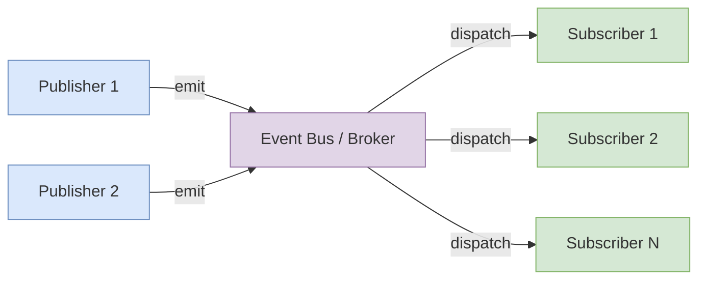
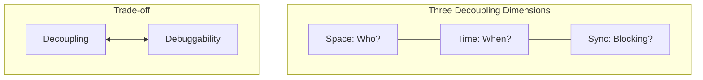

# Publish-Subscribe Pattern in JavaScript

Architectural principles, implementation trade-offs, and production patterns for event-driven systems. Covers the three decoupling dimensions, subscriber ordering guarantees, error isolation strategies, and when Pub/Sub is the wrong choice.

<figure>



<figcaption>Pub/Sub architecture: publishers emit to a broker that dispatches to all registered subscribers</figcaption>
</figure>

## Abstract

**Mental Model:** Pub/Sub trades explicit control flow for decoupling. Publishers fire events into a broker without knowing who (if anyone) receives them. Subscribers register interest without knowing who produces events. The broker is the single point of coupling.

<figure>



<figcaption>Pub/Sub provides space, time, and synchronization decoupling—at the cost of implicit control flow</figcaption>
</figure>

**Core Trade-off:** Loose coupling enables independent component evolution and many-to-many communication. The cost is implicit control flow—debugging requires tracing events across the system rather than following function calls.

**Key Implementation Decisions:**

| Decision           | Recommendation                | Why                                                                              |
| ------------------ | ----------------------------- | -------------------------------------------------------------------------------- |
| Subscriber storage | `Map<string, Set<Function>>`  | O(1) add/delete, prevents duplicates, preserves insertion order (ES6+ guarantee) |
| Error isolation    | try/catch per subscriber      | One failing subscriber must not break others                                     |
| Async publish      | Return `Promise.allSettled()` | Await completion without short-circuiting on errors                              |
| Cleanup            | Return unsubscribe function   | Prevents memory leaks; ties to component lifecycle                               |

**When NOT to Use:**

- Request-response patterns (use direct calls)
- Single known recipient (Observer pattern suffices)
- When you need delivery guarantees (Pub/Sub doesn't guarantee delivery)
- Simple systems unlikely to scale (unnecessary indirection)

## The Three Dimensions of Decoupling

Eugster et al.'s foundational paper ["The Many Faces of Publish/Subscribe"](https://dl.acm.org/doi/10.1145/857076.857078) defines pub/sub as providing "full decoupling of the communicating entities in time, space, and synchronization":

1. **Space Decoupling**: Publishers emit events without knowledge of which subscribers (if any) will receive them. Subscribers register without knowing which publishers produce events. Neither knows the other's identity, location, or count.

2. **Time Decoupling**: Publishers and subscribers need not be active simultaneously. In distributed systems (MQTT, AMQP), a subscriber can receive messages published while it was offline. In-process implementations typically lack this—events are lost if no subscriber exists at publish time.

3. **Synchronization Decoupling**: Publishing is non-blocking. The publisher hands the event to the broker and continues immediately. This contrasts with RPC, which the paper notes has "synchronous nature... [which] introduces a strong time, synchronization, and also space coupling."

### Pub/Sub vs Observer Pattern

| Aspect        | Observer                           | Pub/Sub                                          |
| ------------- | ---------------------------------- | ------------------------------------------------ |
| Coupling      | Subject knows observers directly   | Publishers and subscribers unknown to each other |
| Intermediary  | None—Subject IS the dispatcher     | Broker/Event Bus required                        |
| Cardinality   | One-to-many                        | Many-to-many                                     |
| Typical scope | In-process, single component       | Cross-component, potentially distributed         |
| Use case      | UI state binding, reactive streams | Module communication, microservices              |

Observer is appropriate when a single subject owns the state and notifies dependents. Pub/Sub is appropriate when multiple independent components need to communicate without direct references.

## Basic Implementation

A minimal implementation using ES6+ `Set` for O(1) subscriber management:

```ts title="basic-pub-sub.ts"
type Callback<T> = (data: T) => void

export class PubSub<T> {
  #subscribers = new Set<Callback<T>>()

  subscribe(callback: Callback<T>) {
    this.#subscribers.add(callback)
    return () => this.#subscribers.delete(callback)
  }

  publish(data: T) {
    for (const subscriber of this.#subscribers) {
      subscriber(data)
    }
  }
}
```

**Why `Set` over `Array`:**

- **O(1) add/delete** vs O(n) for array splice
- **Automatic deduplication**—same callback added twice is stored once
- **Insertion order guaranteed** per ECMA-262: "Set objects iterate through elements in insertion order"

If you need the same callback to fire multiple times per event (rare), use an array instead.

**Usage:**

```ts title="basic-usage.ts"
const events = new PubSub<{ userId: string; action: string }>()

const unsubscribe = events.subscribe((data) => console.log(data.action))

events.publish({ userId: "123", action: "login" })
events.publish({ userId: "123", action: "logout" })

unsubscribe() // Critical: prevents memory leaks
```

### DOM EventTarget Alternative

The browser's `EventTarget` provides native pub/sub via `CustomEvent`:

```ts title="dom-event-target.ts" collapse={1-2, 8-12}
// Publisher
const event = new CustomEvent("user:login", { detail: { userId: "123" } })
document.dispatchEvent(event)

// Subscriber
document.addEventListener("user:login", (e: CustomEvent) => {
  console.log(e.detail.userId)
})
```

**Limitations:**

- **Main thread only**—doesn't work in Web Workers or Node.js
- **No TypeScript generics**—`detail` is `any`
- **Global namespace**—all events share `document`, risking collisions

Custom implementation adds ~16 lines but works across all JavaScript runtimes.

## Production-Grade Implementation

Production systems require: topic-based routing, error isolation, async support, and proper typing. Key design decisions explained inline:

```ts title="production-pub-sub.ts" collapse={1-8, 72-75}
type Callback<T = unknown> = (data: T) => void | Promise<void>

interface Subscription {
  token: number
  unsubscribe: () => void
}

// Using Map<string, Map<number, Callback>> for:
// - O(1) topic lookup
// - O(1) subscriber add/remove by token
// - Stable iteration order (subscribers called in registration order)
class PubSub {
  private topics = new Map<string, Map<number, Callback>>()
  private nextToken = 0

  subscribe<T>(topic: string, callback: Callback<T>): Subscription {
    const token = this.nextToken++

    if (!this.topics.has(topic)) {
      this.topics.set(topic, new Map())
    }
    this.topics.get(topic)!.set(token, callback as Callback)

    return {
      token,
      unsubscribe: () => {
        const subscribers = this.topics.get(topic)
        if (subscribers) {
          subscribers.delete(token)
          // Clean up empty topics to prevent memory growth
          if (subscribers.size === 0) this.topics.delete(topic)
        }
      },
    }
  }

  // Synchronous publish with error isolation
  // Returns: whether any subscribers existed
  publish<T>(topic: string, data: T): boolean {
    const subscribers = this.topics.get(topic)
    if (!subscribers || subscribers.size === 0) return false

    for (const callback of subscribers.values()) {
      // Critical: try/catch per subscriber
      // One failing subscriber must not break others
      try {
        callback(data)
      } catch (error) {
        console.error(`[PubSub] Error in subscriber for "${topic}":`, error)
        // Optional: emit to error topic for centralized handling
        // this.publish('pubsub:error', { topic, error, data })
      }
    }
    return true
  }

  // Async publish: waits for all subscribers, doesn't short-circuit on errors
  async publishAsync<T>(topic: string, data: T): Promise<PromiseSettledResult<void>[]> {
    const subscribers = this.topics.get(topic)
    if (!subscribers || subscribers.size === 0) return []

    // Promise.allSettled (ES2020) ensures all subscribers complete
    // even if some reject—critical for reliable event handling
    const promises = Array.from(subscribers.values()).map(async (callback) => {
      await callback(data)
    })

    return Promise.allSettled(promises)
  }
}

// Singleton for cross-module communication
export const pubsub = new PubSub()
```

**Design Decisions:**

| Choice                                  | Rationale                                                           |
| --------------------------------------- | ------------------------------------------------------------------- |
| `Map<string, Map<number, Callback>>`    | Nested maps give O(1) operations at both topic and subscriber level |
| Numeric tokens                          | Monotonic IDs avoid collision; simpler than UUID                    |
| `Promise.allSettled` over `Promise.all` | Doesn't short-circuit on first rejection—all subscribers complete   |
| Empty topic cleanup                     | Prevents unbounded memory growth from stale topics                  |
| Per-subscriber try/catch                | Isolates failures; one bad subscriber doesn't break others          |

### Memory Leak Prevention

Memory leaks in pub/sub arise when subscribers outlive their intended scope. Common patterns:

1. **Anonymous functions can't be removed** — `removeEventListener` requires the same function reference
2. **Closures capture component state** — subscriber holds references preventing garbage collection
3. **Missing cleanup on unmount** — React components, Angular services, etc.

Node.js warns at 11+ listeners per event: `MaxListenersExceededWarning: Possible EventEmitter memory leak detected`.

**React Pattern (useEffect cleanup):**

```tsx title="react-usage.tsx" collapse={1-4}
import { useEffect, useState } from "react"
import { pubsub } from "./pubsub"

interface StatusEvent {
  userId: string
  isOnline: boolean
}

function UserStatus({ userId }: { userId: string }) {
  const [isOnline, setIsOnline] = useState(false)

  useEffect(() => {
    const { unsubscribe } = pubsub.subscribe<StatusEvent>("user:status", (data) => {
      if (data.userId === userId) setIsOnline(data.isOnline)
    })
    // Critical: cleanup on unmount or userId change
    return unsubscribe
  }, [userId])

  return <span>{isOnline ? "Online" : "Offline"}</span>
}
```

**Key points:**

- Return `unsubscribe` directly from `useEffect` — it's already a cleanup function
- Include `userId` in deps array — re-subscribes when prop changes
- Named function isn't needed since we use the returned `unsubscribe`

## Subscriber Ordering and Error Handling

### Execution Order Guarantees

**Are subscribers called in registration order?** It depends on the implementation.

Per ECMA-262, `Map` and `Set` iterate in insertion order. Our implementation using `Map<number, Callback>` guarantees subscribers execute in registration order.

Per [Node.js EventEmitter docs](https://nodejs.org/api/events.html): "All listeners attached to it at the time of emitting are called in order."

Per [WHATWG DOM Standard](https://dom.spec.whatwg.org/): EventTarget listeners are called in registration order within each phase.

**Caveat:** Not all libraries guarantee order. If order matters for your use case, either:

1. Use a single subscriber that orchestrates the sequence
2. Verify your library's implementation

### Async Subscriber Pitfalls

Node.js docs warn: "Using async functions with event handlers is problematic, because it can lead to an unhandled rejection in case of a thrown exception."

```ts title="async-pitfall.ts"
// Dangerous: unhandled rejection if async handler throws
pubsub.subscribe("data", async (data) => {
  await saveToDatabase(data) // If this throws, rejection is unhandled
})
```

**Solutions:**

1. **Use `publishAsync` with `Promise.allSettled`** (shown in production implementation)
2. **Wrap async subscribers in try/catch:**

```ts title="safe-async-subscriber.ts"
pubsub.subscribe("data", async (data) => {
  try {
    await saveToDatabase(data)
  } catch (error) {
    // Handle locally or emit to error topic
    pubsub.publish("error", { source: "data", error })
  }
})
```

## Advanced Capabilities

### Hierarchical Topics and Wildcard Subscriptions

Topic naming convention: `domain.entity.action` (e.g., `user.profile.updated`, `cart.item.added`).

Wildcard types (MQTT convention):

- `*` — matches exactly one segment: `user.*.login` matches `user.123.login`
- `#` — matches zero or more segments (must be last): `user.#` matches `user`, `user.123`, `user.123.login`

```ts title="wildcard-matching.ts" collapse={1-3}
// Matches subscription patterns like "user.*.login" or "user.#"
// against published topics like "user.123.login"
function topicMatches(pattern: string, topic: string): boolean {
  const patternParts = pattern.split(".")
  const topicParts = topic.split(".")

  for (let i = 0; i < patternParts.length; i++) {
    const p = patternParts[i]
    if (p === "#") return true // Multi-level: match rest
    if (p !== "*" && p !== topicParts[i]) return false
  }

  return patternParts.length === topicParts.length
}
```

### Backpressure Considerations

Standard pub/sub has **no built-in backpressure**. Publishers emit as fast as they can regardless of subscriber capacity.

**Strategies:**

- **Debounce/throttle at publish** — lossy but prevents flooding
- **Buffer with limits** — accumulate events, drop oldest when full
- **Async iterator with highWater** — libraries like [event-iterator](https://github.com/rolftimmermans/event-iterator) provide backpressure signals

For high-throughput systems, consider message queues (RabbitMQ, Redis Streams) with explicit acknowledgment.

## When NOT to Use Pub/Sub (Antipatterns)

Understanding when to avoid pub/sub is as important as knowing when to use it.

### 1. Forcing Commands into Pub/Sub

Per [CodeOpinion](https://codeopinion.com/beware-anti-patterns-in-event-driven-architecture/): "Commands do not use the publish-subscribe pattern. Trying to force everything into publish-subscribe when that's not the pattern you want will lead you to apply more patterns incorrectly."

**Command vs Event:**

- **Command**: "CreateOrder" — directed to a specific handler, expects execution
- **Event**: "OrderCreated" — notification of something that happened, no expectation of specific handler

### 2. Request-Reply Disguised as Events

If your publisher expects a specific response event back, you've recreated synchronous RPC with extra complexity. Use direct function calls or actual RPC instead.

### 3. CRUD Events Lacking Intent

`CustomerChanged` doesn't indicate _why_ something changed. Consumers must diff the data to infer intent. Prefer intent-revealing events: `CustomerAddressUpdated`, `CustomerDeactivated`.

### 4. Simple Systems

Pub/sub adds indirection. For a small app with straightforward component communication, direct function calls or context/props are simpler and more debuggable.

### 5. When Delivery Guarantees Matter

In-process pub/sub doesn't guarantee delivery. If no subscriber exists when an event fires, it's lost. For critical events, use message queues with persistence (Redis Streams, RabbitMQ, Kafka).

### Debugging Challenges

Martin Fowler: "It can become problematic if there really is a logical flow that runs over various event notifications. The problem is that it can be hard to see such a flow as it's not explicit in any program text."

The implicit control flow that provides loose coupling also makes debugging harder. Distributed tracing and careful logging are essential for production pub/sub systems.

## Real-World Applications

### Frontend: Cross-Component Communication

Pub/sub solves "prop drilling" when unrelated components need to react to the same events.

**E-commerce cart example:**

- `ProductCard` publishes `cart.item.added` on button click
- `CartIcon` subscribes → updates badge count
- `Toast` subscribes → shows confirmation
- `Analytics` subscribes → tracks conversion

Each subscriber is independent. Adding a new reaction requires no changes to `ProductCard`.

### Backend: Event-Driven Microservices

External brokers (Redis Pub/Sub, RabbitMQ, Google Cloud Pub/Sub, Kafka) provide distributed pub/sub with durability.

**User registration flow:**

- `UserService` publishes `user.created`
- `EmailService` → sends welcome email
- `AnalyticsService` → tracks signup metrics
- `OnboardingService` → queues tutorial sequence

Services deploy independently. Adding a new reaction (e.g., CRM sync) requires no changes to `UserService`.

## Build vs Buy Decision

For production, prefer battle-tested libraries unless you need custom semantics.

| Library                                                         | Size   | Wildcards        | TypeScript | API                        | Maintained       |
| --------------------------------------------------------------- | ------ | ---------------- | ---------- | -------------------------- | ---------------- |
| [mitt](https://github.com/developit/mitt)                       | 200B   | `*` (all events) | Yes        | `on()`, `off()`, `emit()`  | Yes (11k+ stars) |
| [nanoevents](https://github.com/ai/nanoevents)                  | 107B   | No               | Yes        | Returns unbind from `on()` | Yes              |
| [EventEmitter3](https://github.com/primus/eventemitter3)        | 1.5KB  | No               | Yes        | Node.js-compatible         | Yes              |
| [EventEmitter2](https://github.com/EventEmitter2/EventEmitter2) | Larger | Yes (`*`, `**`)  | Yes        | Extended EE API            | Yes              |

**Recommendations:**

- **Minimal footprint**: mitt or nanoevents (both under 200B)
- **Node.js API compatibility**: EventEmitter3
- **Wildcards needed**: EventEmitter2 (or MQTT/AMQP for distributed)
- **Learning**: Build your own—the 20-line implementation teaches the core

**mitt caveat:** The `*` handler receives all events but is a listener, not a wildcard pattern. Publishing to `*` directly causes double-triggering issues.

## Best Practices Summary

### Implementation Checklist

| Practice                        | Why                                                        |
| ------------------------------- | ---------------------------------------------------------- |
| Return unsubscribe function     | Enables cleanup; prevents memory leaks                     |
| Use `Map/Set` not plain objects | O(1) operations, guaranteed iteration order                |
| try/catch per subscriber        | Isolates failures; one bad handler doesn't break others    |
| `Promise.allSettled` for async  | Waits for all handlers; doesn't short-circuit on rejection |
| Clean up empty topics           | Prevents unbounded memory growth                           |
| Hierarchical topic names        | `domain.entity.action` enables wildcards, organization     |

### Error Handling Strategies

1. **Per-subscriber isolation**: Wrap each callback in try/catch (shown in production implementation)
2. **Error topic**: Emit to `pubsub:error` for centralized handling
3. **Dead-letter queue**: For distributed systems, track repeatedly failing messages
4. **Dev mode exceptions**: Optionally rethrow in development for stack traces

## Conclusion

Pub/Sub trades explicit control flow for decoupling. Publishers emit without knowing receivers; subscribers react without knowing sources. This enables independent component evolution and many-to-many communication at the cost of implicit, harder-to-trace control flow.

**Use pub/sub when:**

- Multiple independent components need to react to the same events
- Components should evolve independently (add/remove reactions without changing publishers)
- You're building event-driven architecture (frontend cross-component communication, backend microservices)

**Avoid pub/sub when:**

- You need request-response semantics
- There's a single known recipient (use Observer or direct calls)
- Delivery guarantees are required (use message queues)
- The system is simple and unlikely to need the decoupling

Implementation is straightforward: `Map<string, Set<Function>>`, return unsubscribe, try/catch per subscriber. The challenge is architectural—knowing when the indirection is worth the debuggability cost.

## Appendix

### Prerequisites

- JavaScript ES6+ (Map, Set, Promise, async/await)
- Basic understanding of event-driven programming
- Familiarity with React hooks (for framework examples)

### Terminology

| Term                   | Definition                                                           |
| ---------------------- | -------------------------------------------------------------------- |
| **Publisher**          | Component that emits events; unaware of subscribers                  |
| **Subscriber**         | Component that registers callbacks for events; unaware of publishers |
| **Broker / Event Bus** | Intermediary that routes events from publishers to subscribers       |
| **Topic / Channel**    | Named category for events; subscribers register interest by topic    |
| **Backpressure**       | Mechanism for consumers to signal producers to slow down             |

### Summary

- Pub/Sub provides three-dimensional decoupling: space, time, synchronization
- Use `Map<string, Set<Function>>` for O(1) operations and guaranteed order
- Always return unsubscribe function; tie cleanup to component lifecycle
- Isolate subscriber errors with per-callback try/catch
- Use `Promise.allSettled` for async publish to avoid short-circuiting
- Avoid for request-response, single recipients, or when delivery guarantees matter
- Libraries: mitt (200B), nanoevents (107B) for minimal footprint

### References

**Specifications & Standards:**

- [The Many Faces of Publish/Subscribe](https://dl.acm.org/doi/10.1145/857076.857078) - Eugster et al., ACM Computing Surveys 2003. Foundational paper defining the three dimensions of decoupling.
- [ECMA-262: Map and Set Objects](https://tc39.es/ecma262/multipage/keyed-collections.html) - Guarantees insertion order for iteration.
- [WHATWG DOM Standard: EventTarget](https://dom.spec.whatwg.org/#interface-eventtarget) - Browser's native pub/sub mechanism.
- [OASIS MQTT 5.0 Specification](https://docs.oasis-open.org/mqtt/mqtt/v5.0/mqtt-v5.0.html) - Distributed pub/sub protocol.

**Official Documentation:**

- [Node.js Events Documentation](https://nodejs.org/api/events.html) - EventEmitter ordering guarantees, async handler pitfalls.
- [MDN: CustomEvent](https://developer.mozilla.org/en-US/docs/Web/API/CustomEvent) - Browser native event API.
- [MDN: WeakRef](https://developer.mozilla.org/en-US/docs/Web/JavaScript/Reference/Global_Objects/WeakRef) - Memory management considerations.

**Libraries:**

- [mitt](https://github.com/developit/mitt) - 200B functional event emitter.
- [nanoevents](https://github.com/ai/nanoevents) - 107B with TypeScript support.
- [EventEmitter3](https://github.com/primus/eventemitter3) - Node.js-compatible API.
- [EventEmitter2](https://github.com/EventEmitter2/EventEmitter2) - Wildcard support.

**Architectural Guidance:**

- [Enterprise Integration Patterns: Publish-Subscribe Channel](https://www.enterpriseintegrationpatterns.com/patterns/messaging/PublishSubscribeChannel.html) - Messaging patterns reference.
- [CodeOpinion: Antipatterns in Event-Driven Architecture](https://codeopinion.com/beware-anti-patterns-in-event-driven-architecture/) - When not to use pub/sub.
