# Change Data Capture

Change Data Capture (CDC) extracts and streams database changes to downstream systems in real-time. Rather than polling databases or maintaining dual-write logic, CDC reads directly from the database's internal change mechanisms—transaction logs, replication streams, or triggers—providing a reliable, non-invasive way to propagate data changes across systems.

This article covers CDC approaches, log-based implementation internals, production patterns, and when each variant makes sense.

<figure>

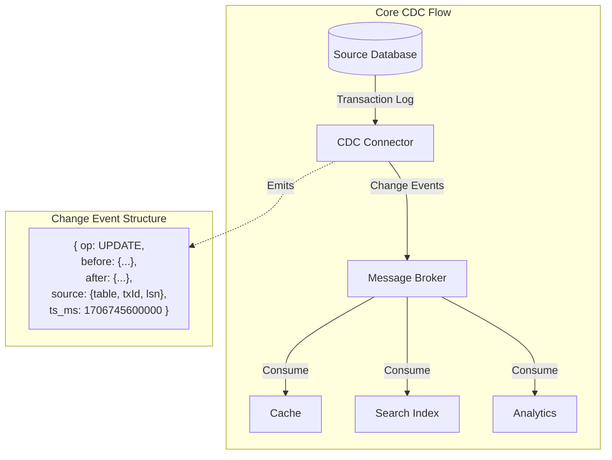

<figcaption>CDC captures changes from the database's transaction log and emits structured change events to downstream consumers—each event contains the operation type, before/after state, and source metadata.</figcaption>
</figure>

## Abstract

CDC provides **eventually-consistent data propagation** without application-level dual writes. The fundamental insight: databases already track all changes internally for durability and replication—CDC exposes this stream externally.

**Core mental model:**

- **Log-based CDC** reads the database's Write-Ahead Log (WAL) or binary log. Non-invasive, captures all changes including those from direct SQL. The gold standard for production.
- **Trigger-based CDC** uses database triggers to capture changes. Higher database overhead, but works when log access is unavailable.
- **Polling-based CDC** queries for changes via timestamps or sequence columns. Misses hard deletes, adds query load, but requires no special database access.

**Key insight**: The choice between approaches is a **source access vs. operational complexity** tradeoff. Log-based requires database configuration and replication slots but captures everything with minimal overhead. Polling requires no special access but misses deletions and adds query load.

**Production reality**: Log-based CDC dominates production systems. Debezium (open-source) and AWS DMS (managed) are the primary tools. Most implementations use Kafka as the change event transport.

## The Problem

### Why Naive Solutions Fail

**Approach 1: Dual Writes in Application Code**

```typescript collapse={1-5}
async function updateUser(userId: string, data: UserData) {
  await db.users.update(userId, data)
  await kafka.publish("users", { op: "UPDATE", after: data })
}
```

Fails because:

- **Partial failures**: Database commits but Kafka publish fails. Data is now inconsistent.
- **Distributed transaction complexity**: 2PC across database and Kafka is slow and fragile.
- **Missed changes**: Direct SQL updates, migrations, and other services bypass the publish logic.
- **Ordering**: No guarantee that Kafka messages arrive in commit order.

**Approach 2: Polling with Timestamps**

```sql
SELECT * FROM users WHERE updated_at > :last_poll_time
```

Fails because:

- **Misses hard deletes**: Deleted rows don't appear in query results.
- **Clock skew**: `updated_at` timestamp may not reflect actual commit order across replicas.
- **Polling interval trade-off**: Frequent polling adds load; infrequent polling adds latency.
- **Transaction visibility**: May read uncommitted or partially committed transactions.

**Approach 3: Trigger-Based Capture**

```sql
CREATE TRIGGER user_changes AFTER INSERT OR UPDATE OR DELETE ON users
FOR EACH ROW EXECUTE FUNCTION capture_change();
```

Fails at scale because:

- **Transaction overhead**: Trigger executes within the transaction, adding latency to every write.
- **Lock contention**: Writing to a change table can create lock conflicts.
- **Operational burden**: Triggers must be maintained across schema changes.

### The Core Challenge

The fundamental tension: **application code cannot reliably capture all database changes without the database's cooperation**. Direct SQL, stored procedures, migrations, and multiple services all modify data outside application control.

CDC resolves this by **reading changes where they're already reliably recorded**—the database's transaction log. This log exists for durability and replication; CDC treats it as a public API.

## CDC Approaches

### Log-Based CDC (Primary Approach)

**How it works:**

1. CDC connector acts as a replica consumer for the database's transaction log
2. Connector maintains position (LSN, binlog coordinates, or GTID) for resumability
3. Changes parsed from binary log format into structured events
4. Events published to message broker, maintaining transaction boundaries

**Database-specific mechanisms:**

| Database   | Log Type              | Access Method            | Position Tracking         |
| ---------- | --------------------- | ------------------------ | ------------------------- |
| PostgreSQL | WAL (Write-Ahead Log) | Logical Replication Slot | LSN (Log Sequence Number) |
| MySQL      | Binary Log            | Binlog client protocol   | GTID or file:position     |
| MongoDB    | Oplog                 | Change Streams API       | Resume token              |
| SQL Server | Transaction Log       | CDC tables or log reader | LSN                       |

**Why log-based is preferred:**

- **Complete capture**: Every committed change, including DDL, is in the log
- **Minimal overhead**: Reading the log adds no load to write path
- **Transactional boundaries**: Changes can be grouped by transaction
- **Ordering guarantees**: Log order matches commit order

**Trade-offs:**

| Advantage                      | Disadvantage                    |
| ------------------------------ | ------------------------------- |
| Captures all changes           | Requires database configuration |
| No write-path overhead         | Log format is database-specific |
| Transaction ordering preserved | Replication slot management     |
| Includes deletes and DDL       | Requires log retention tuning   |

### Trigger-Based CDC

**How it works:**

1. Create triggers on source tables for INSERT, UPDATE, DELETE
2. Triggers write change records to shadow tables
3. Separate process polls shadow tables and publishes events
4. Shadow table records deleted after successful publish

**When to choose:**

- Log-based access unavailable (managed databases, permission restrictions)
- Only specific tables need capture (trigger overhead is localized)
- Legacy databases without logical replication support

**Trade-offs:**

| Advantage                             | Disadvantage                     |
| ------------------------------------- | -------------------------------- |
| Works without special database access | Adds latency to every write      |
| Full control over captured data       | Trigger maintenance overhead     |
| Selective capture                     | Lock contention on shadow tables |

### Polling-Based CDC

**How it works:**

1. Query source tables periodically for changes since last poll
2. Use `updated_at` timestamp or sequence column to identify changes
3. Mark captured rows or track high-water mark
4. Publish changes to downstream systems

**When to choose:**

- Read replica available for polling (isolates from production writes)
- Soft deletes only (hard deletes not used)
- Near-real-time acceptable (seconds to minutes latency)

**Limitations:**

- Cannot capture hard deletes without tombstone markers
- Timestamp precision issues (multiple changes within same timestamp)
- Must poll frequently to approach real-time
- No transaction grouping

### Decision Framework

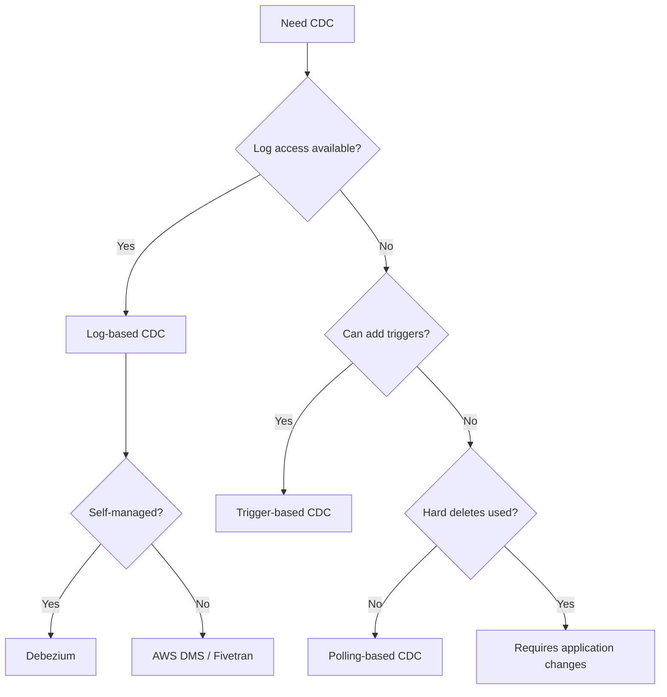

## Log-Based CDC Internals

### PostgreSQL: WAL and Logical Replication

PostgreSQL's CDC uses **logical replication**, which decodes the physical WAL into logical change events.

**Architecture:**

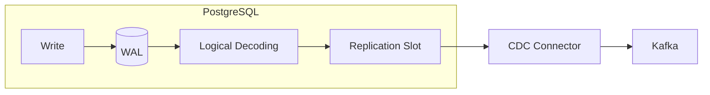

**Configuration requirements:**

```sql
-- postgresql.conf
wal_level = logical                    -- Required for logical replication
max_replication_slots = 4              -- One per CDC connector
max_wal_senders = 4                    -- Connections for replication

-- Create replication slot (done by Debezium automatically)
SELECT pg_create_logical_replication_slot('debezium', 'pgoutput');
```

**Output plugins:**

| Plugin          | Output Format   | Use Case                                        |
| --------------- | --------------- | ----------------------------------------------- |
| `pgoutput`      | Binary protocol | Native PostgreSQL replication, Debezium default |
| `wal2json`      | JSON            | External systems requiring JSON                 |
| `test_decoding` | Text            | Debugging and testing                           |

**Critical operational concern—slot bloat:**

PostgreSQL retains WAL as long as a replication slot hasn't consumed it. If a CDC connector goes down:

```sql
-- Monitor slot lag
SELECT slot_name,
       pg_size_pretty(pg_wal_lsn_diff(pg_current_wal_lsn(), restart_lsn)) AS lag
FROM pg_replication_slots;

-- Set maximum retained WAL (PostgreSQL 13+)
ALTER SYSTEM SET max_slot_wal_keep_size = '10GB';
```

Without `max_slot_wal_keep_size`, an inactive slot can fill the disk. This is the most common CDC production incident.

**Version evolution:**

> **PostgreSQL 17 (2024)**: Introduced logical replication failover. Replication slot state can be synchronized to standby servers, enabling CDC continuity during primary failover. Prior versions required re-snapshotting after failover.

### MySQL: Binary Log

MySQL's CDC reads the binary log, which records all data modifications.

**Configuration requirements:**

```ini
# my.cnf
server-id = 1                          # Unique across replication topology
log_bin = mysql-bin                    # Enable binary logging
binlog_format = ROW                    # Required: ROW format (not STATEMENT)
binlog_row_image = FULL                # Capture before and after state
expire_logs_days = 3                   # Retention period
```

**GTID (Global Transaction ID):**

GTIDs uniquely identify transactions across the replication topology, enabling position-independent replication.

```sql
-- Enable GTID mode
gtid_mode = ON
enforce_gtid_consistency = ON

-- Format: server_uuid:transaction_id
-- Example: 3E11FA47-71CA-11E1-9E33-C80AA9429562:23
```

**Why GTID matters for CDC:**

- **Resumability**: CDC connector can resume from GTID regardless of binlog file rotation
- **Failover**: After primary failover, GTID identifies exactly which transactions to resume from
- **Multi-source**: When capturing from multiple MySQL instances, GTIDs prevent duplicate processing

**Binlog format comparison:**

| Format    | Content                             | CDC Compatibility                        |
| --------- | ----------------------------------- | ---------------------------------------- |
| STATEMENT | SQL statements                      | Poor—cannot determine actual row changes |
| ROW       | Actual row changes                  | Required for CDC                         |
| MIXED     | Statement or row depending on query | Unreliable for CDC                       |

### MongoDB: Change Streams

MongoDB provides Change Streams, a high-level API over the oplog (operations log).

```typescript collapse={1-3}
const client = new MongoClient(uri)
const db = client.db("mydb")

// Watch collection-level changes
const changeStream = db.collection("users").watch([], {
  fullDocument: "updateLookup", // Include full document on updates
  fullDocumentBeforeChange: "whenAvailable", // Include before-image (MongoDB 6.0+)
})

changeStream.on("change", (change) => {
  // change.operationType: 'insert' | 'update' | 'delete' | 'replace'
  // change.fullDocument: current document state
  // change.fullDocumentBeforeChange: previous state (if configured)
  // change._id: resume token for resumability
})
```

**Key differences from relational CDC:**

- **Schema-free**: Documents can vary; change events reflect actual structure
- **Nested changes**: Updates to nested fields captured as partial updates
- **Resume tokens**: Opaque tokens for resumability (vs. LSN/GTID)

**Limitation**: Change Streams require replica set or sharded cluster. Single-node MongoDB doesn't support CDC.

## Design Paths

### Path 1: Debezium + Kafka Connect

**Context**: Open-source CDC platform. Most popular choice for self-managed CDC.

**Architecture:**

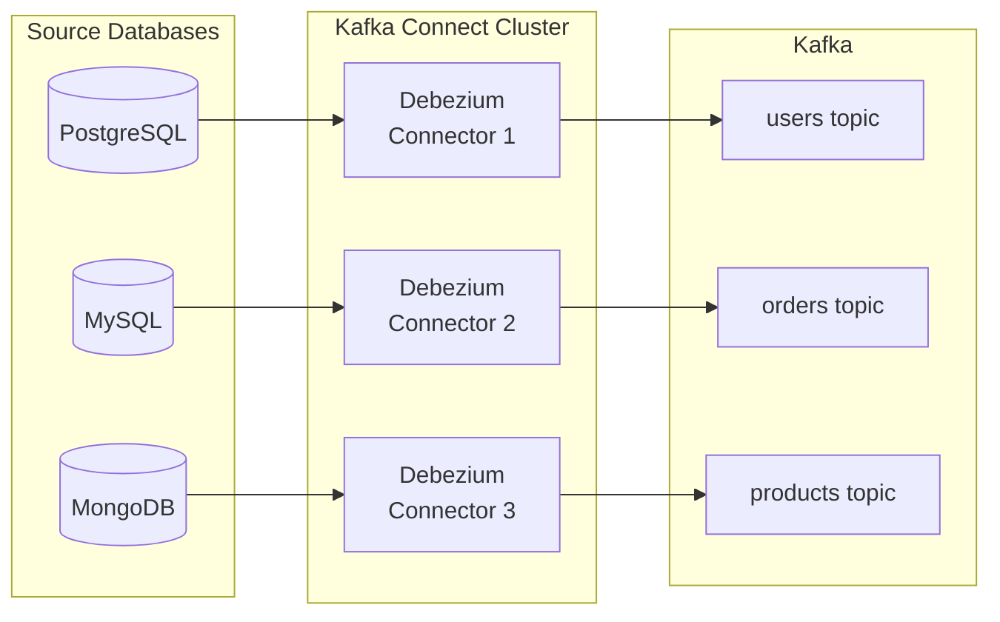

**When to choose this path:**

- Self-managed infrastructure with Kafka already in place
- Need sub-second latency
- Require full control over configuration and schema handling
- Multi-database environments

**Key characteristics:**

- One Kafka topic per table (configurable)
- Schema Registry integration for Avro/Protobuf/JSON Schema
- Exactly-once semantics with Kafka 3.3.0+ and KRaft
- Snapshot for initial data load, then streaming

**Configuration example:**

```json collapse={1-2, 15-25}
{
  "name": "users-connector",
  "config": {
    "connector.class": "io.debezium.connector.postgresql.PostgresConnector",
    "database.hostname": "db.example.com",
    "database.port": "5432",
    "database.user": "debezium",
    "database.password": "${secrets:postgres/password}",
    "database.dbname": "myapp",
    "topic.prefix": "myapp",
    "table.include.list": "public.users,public.orders",
    "slot.name": "debezium_users",
    "publication.name": "dbz_publication",
    "snapshot.mode": "initial",
    "key.converter": "io.confluent.connect.avro.AvroConverter",
    "key.converter.schema.registry.url": "http://schema-registry:8081",
    "value.converter": "io.confluent.connect.avro.AvroConverter",
    "value.converter.schema.registry.url": "http://schema-registry:8081",
    "transforms": "unwrap",
    "transforms.unwrap.type": "io.debezium.transforms.ExtractNewRecordState",
    "transforms.unwrap.drop.tombstones": "false",
    "transforms.unwrap.delete.handling.mode": "rewrite"
  }
}
```

**Trade-offs vs other paths:**

| Aspect             | Debezium            | AWS DMS         | Fivetran         |
| ------------------ | ------------------- | --------------- | ---------------- |
| Latency            | Sub-second          | Seconds-minutes | Seconds-minutes  |
| Cost (100GB/day)   | Infrastructure only | ~$200-400/mo    | ~$1,500-3,000/mo |
| Operational burden | High                | Low             | Very low         |
| Customization      | Full control        | Limited         | Limited          |
| Schema handling    | Schema Registry     | Basic           | Automatic        |

**Real-world: Shopify**

Shopify migrated from query-based to Debezium CDC:

- **Scale**: 173B requests on Black Friday 2024, 12TB data/minute peak
- **Implementation**: Debezium + Kafka Connect on Kubernetes
- **Outcome**: Real-time analytics replaced batch processing; fraud detection went from minutes to milliseconds

### Path 2: AWS Database Migration Service

**Context**: Managed CDC service integrated with AWS ecosystem.

**Architecture:**

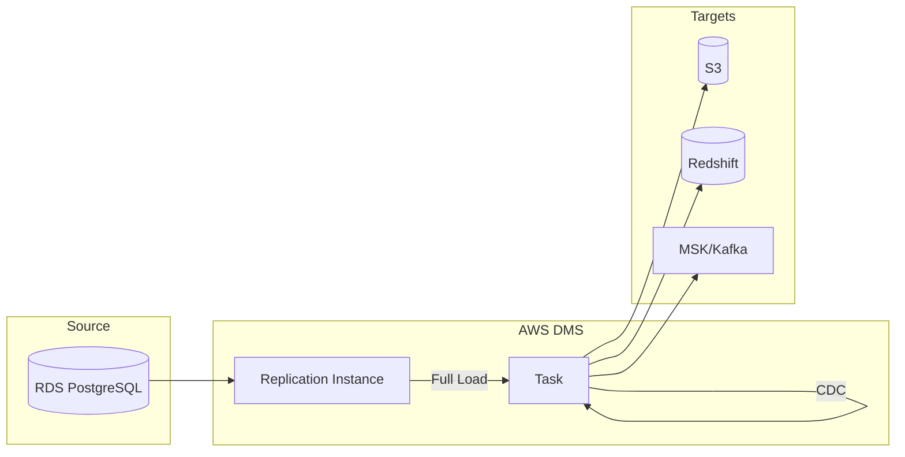

**When to choose this path:**

- AWS-centric infrastructure
- Prefer managed over self-managed
- Target is AWS service (S3, Redshift, DynamoDB)
- Batch/near-real-time acceptable (not sub-second)

**Key characteristics:**

- Full load + ongoing CDC in single task
- Automatic schema migration (optional)
- Built-in monitoring via CloudWatch
- No Kafka required (direct to S3/Redshift)

**Limitations:**

- **Tables without primary keys**: Skipped during CDC (critical gap)
- **Latency**: Seconds to minutes, not sub-second
- **Large transactions**: Can cause significant lag
- **DDL propagation**: Limited support; may require manual intervention

**Cost model (2025):**

| Component            | Pricing                             |
| -------------------- | ----------------------------------- |
| Replication instance | $0.016-$0.624/hour (size-dependent) |
| Data transfer        | Standard AWS rates                  |
| Storage              | $0.10/GB-month                      |

### Path 3: Maxwell's Daemon (MySQL-Specific)

**Context**: Lightweight MySQL CDC tool. Simpler than Debezium for MySQL-only environments.

**Architecture:**

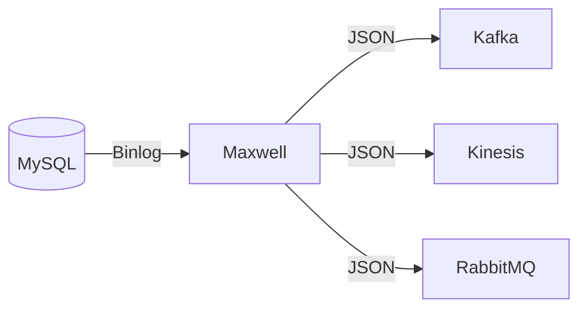

**When to choose:**

- MySQL only
- Want simpler deployment than full Kafka Connect
- JSON output acceptable (no schema registry)
- Lower operational overhead priority

**Output format:**

```json
{
  "database": "myapp",
  "table": "users",
  "type": "update",
  "ts": 1706745600,
  "data": { "id": 1, "name": "Alice", "email": "alice@example.com" },
  "old": { "name": "Old Name" }
}
```

**Trade-offs:**

| Advantage               | Disadvantage                 |
| ----------------------- | ---------------------------- |
| Simple deployment       | MySQL only                   |
| Multiple output targets | No schema registry           |
| Lightweight             | Less mature ecosystem        |
| Easy JSON parsing       | Single-threaded per database |

### Comparison Matrix

| Factor             | Debezium        | AWS DMS         | Maxwell      | Fivetran        |
| ------------------ | --------------- | --------------- | ------------ | --------------- |
| Databases          | 10+             | 20+             | MySQL only   | 500+            |
| Latency            | Sub-second      | Seconds-minutes | Sub-second   | Seconds-minutes |
| Deployment         | Self-managed    | Managed         | Self-managed | SaaS            |
| Schema evolution   | Schema Registry | Basic           | JSON only    | Automatic       |
| Cost at scale      | Low (infra)     | Medium          | Low          | High            |
| Operational burden | High            | Low             | Medium       | Very low        |

## Production Implementations

### LinkedIn: Databus

**Context**: LinkedIn built Databus (2012) as one of the first production CDC systems. Open-sourced; influenced later designs.

**Architecture:**

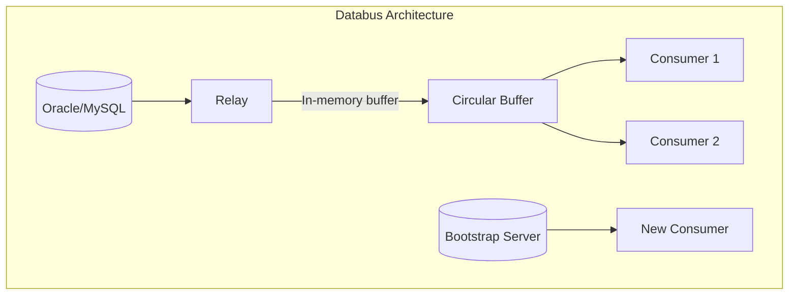

**Implementation details:**

- **Relay pattern**: Relays pull from OLTP database, deserialize to Avro, store in circular memory buffer
- **Bootstrap service**: Provides full data snapshots for new consumers or catch-up
- **Infinite lookback**: New consumers can request full dataset without stressing production database
- **Transactional ordering**: Preserves commit order within source

**Scale:**

- Thousands of events/second per relay server
- Millisecond end-to-end latency
- Powers: Social Graph Index, People Search Index, member profile replicas

**Key insight from LinkedIn:**

> "The relay maintains a sliding time window of changes in memory. Consumers that fall behind can catch up from the relay; consumers that fall too far behind bootstrap from a snapshot and then resume streaming."

### Airbnb: SpinalTap + Riverbed

**Context**: Airbnb uses CDC for their materialized views framework, processing billions of events daily.

**SpinalTap (CDC layer):**

- Scalable CDC across MySQL, DynamoDB, and internal storage
- Kafka as event transport
- Handles sharded monolith with transactional consistency

**Riverbed (materialized views):**

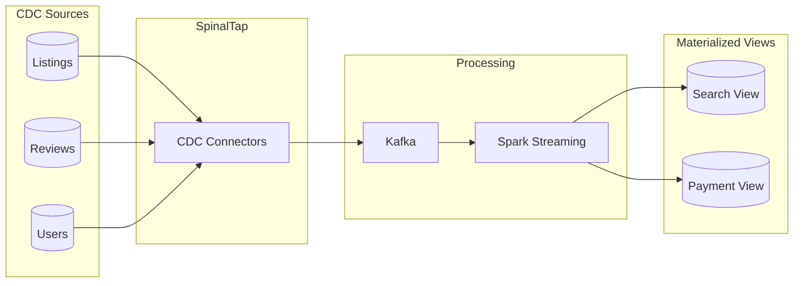

**Scale (2024):**

- 2.4 billion CDC events per day
- 350 million documents written daily to materialized views
- 50+ materialized views (search, payments, reviews, itineraries)
- Lambda architecture: Kafka (online) + Spark (offline)

**What worked:**

- GraphQL DSL for declarative view definitions
- Automatic schema evolution handling
- Real-time search index updates

### Netflix: DBLog

**Context**: Netflix developed DBLog for CDC across heterogeneous databases.

**Key innovation—incremental snapshots:**

Traditional CDC: Full snapshot (locks table) → Start streaming

DBLog approach:

```
1. Start CDC streaming (no snapshot)
2. Incrementally snapshot in chunks:
   - Select small range by primary key
   - Emit snapshot events
   - Continue streaming concurrently
3. Reconcile snapshot with streaming at consumer
```

**Benefits:**

- No long-running locks or table copies
- Snapshot can be paused/resumed
- Works alongside live traffic

**Production since 2018:**

- Powers Delta platform (data synchronization)
- Studio applications event processing
- Connectors for MySQL, PostgreSQL, CockroachDB, Cassandra

### WePay: Cassandra CDC

**Context**: WePay (now part of Chase) built CDC for Cassandra, which lacks native CDC support.

**Implementation:**

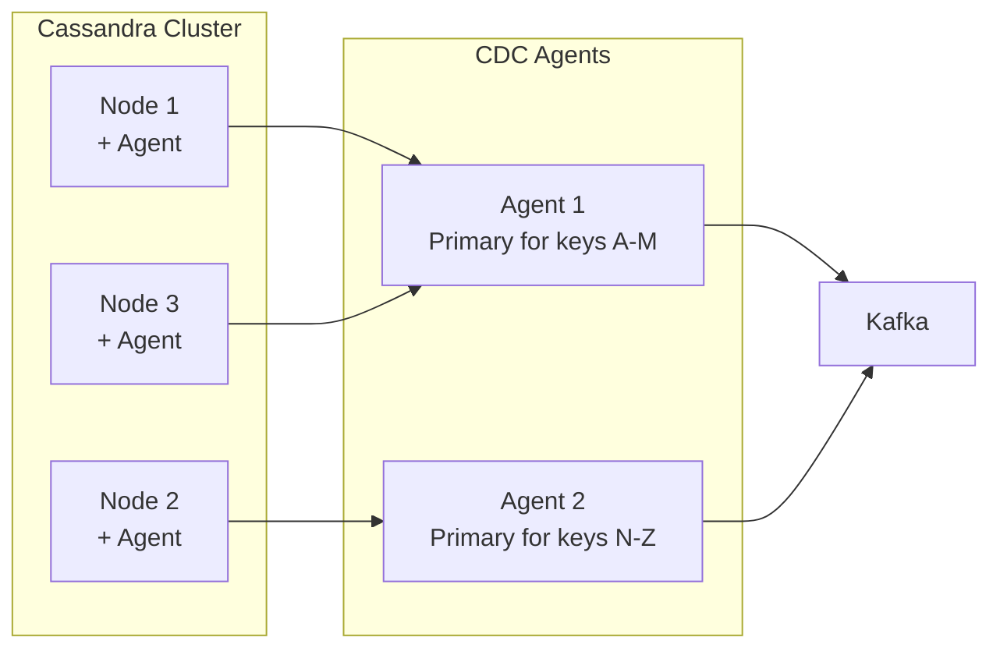

**Key design decisions:**

- **Agent per node**: Each Cassandra node has a local CDC agent reading commit logs
- **Primary agent pattern**: Each agent is "primary" for a subset of partition keys, avoiding duplicates
- **Exactly-once**: Achieved at agent level through offset tracking

**Open-sourced**: Now part of Debezium as incubating Cassandra connector.

### Implementation Comparison

| Aspect            | LinkedIn Databus  | Airbnb SpinalTap   | Netflix DBLog        | WePay Cassandra       |
| ----------------- | ----------------- | ------------------ | -------------------- | --------------------- |
| Primary database  | Oracle/MySQL      | MySQL/DynamoDB     | Heterogeneous        | Cassandra             |
| Snapshot approach | Bootstrap server  | Full then stream   | Incremental chunks   | N/A (no snapshot)     |
| Scale             | Thousands/sec     | Billions/day       | Studio-scale         | Payments-scale        |
| Open-source       | Yes (archived)    | No                 | Concepts only        | Yes (Debezium)        |
| Key innovation    | Relay + bootstrap | Materialized views | Incremental snapshot | Primary agent pattern |

## Schema Evolution

### The Schema Challenge

CDC events must carry schema information. When source schema changes, downstream consumers must handle the evolution.

**Problem scenarios:**

1. **Column added**: New events have field; old events don't
2. **Column removed**: Old events have field; new events don't
3. **Column renamed**: Appears as remove + add
4. **Type changed**: `INT` → `BIGINT`, `VARCHAR(50)` → `VARCHAR(100)`

### Schema Registry Integration

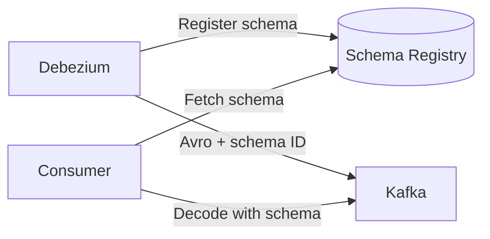

**How it works:**

1. CDC connector serializes event with schema
2. Schema registered in Schema Registry (if new)
3. Event includes schema ID reference (not full schema)
4. Consumer fetches schema by ID, caches locally
5. Consumer deserializes using fetched schema

**Compatibility modes:**

| Mode     | Allows                       | Use Case                           |
| -------- | ---------------------------- | ---------------------------------- |
| BACKWARD | New schema can read old data | Consumers updated before producers |
| FORWARD  | Old schema can read new data | Producers updated before consumers |
| FULL     | Both directions              | Most restrictive; safest           |
| NONE     | Any change                   | Development only                   |

**Recommended approach**: BACKWARD_TRANSITIVE (all previous versions readable by latest)

### Handling DDL Changes

**Safe operations (backward compatible):**

- Add nullable column
- Add column with default value
- Increase column size (`VARCHAR(50)` → `VARCHAR(100)`)

**Breaking operations (require coordination):**

- Remove column
- Rename column
- Change column type
- Add NOT NULL column without default

**Migration pattern for breaking changes:**

```
1. Add new column (nullable)
2. Deploy producers writing to new column
3. Backfill new column from old column
4. Deploy consumers reading new column
5. Stop writing old column
6. Remove old column
```

### Debezium Schema Handling

Debezium can be configured to:

```json
{
  "schema.history.internal.kafka.topic": "schema-changes.myapp",
  "schema.history.internal.kafka.bootstrap.servers": "kafka:9092",
  "include.schema.changes": "true"
}
```

**Schema change events:**

```json
{
  "source": { "table": "users", "db": "myapp" },
  "ddl": "ALTER TABLE users ADD COLUMN phone VARCHAR(20)",
  "databaseName": "myapp",
  "tableChanges": [{
    "type": "ALTER",
    "id": "myapp.users",
    "table": {
      "columns": [...]
    }
  }]
}
```

## Exactly-Once Semantics

### The Delivery Challenge

CDC involves multiple hops where failures can occur:

```
Database → CDC Connector → Kafka → Consumer → Target System
```

Each transition can fail after partial completion.

### Kafka Exactly-Once (Since 0.11.0)

**Idempotent producer:**

```properties
enable.idempotence=true
```

Producer assigns sequence number to each message. Broker deduplicates by (producer_id, sequence).

**Transactional writes:**

```java
producer.initTransactions();
producer.beginTransaction();
producer.send(record1);
producer.send(record2);
producer.commitTransaction(); // Atomic: all or nothing
```

**Consumer isolation:**

```properties
isolation.level=read_committed
```

Consumer only sees committed transactional messages.

### Debezium EOS (Kafka 3.3.0+)

Debezium source connectors support exactly-once when:

1. Kafka Connect configured for exactly-once source
2. Kafka version 3.3.0+ with KRaft
3. Connector offset storage in Kafka

```properties
# Kafka Connect worker config
exactly.once.source.support=enabled
```

**How it works:**

1. Connector reads changes and offset atomically
2. Writes records + offset update in single Kafka transaction
3. On restart, resumes from last committed offset
4. No duplicate events published to Kafka

**Important caveat**: This is exactly-once from database to Kafka. Consumer-to-target still needs idempotent handling.

### End-to-End Exactly-Once

For true end-to-end exactly-once:

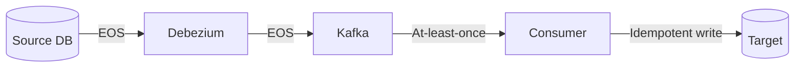

Consumer-side idempotency:

```typescript collapse={1-5}
async function processChange(change: ChangeEvent) {
  const key = `${change.source.table}:${change.key}`
  const version = change.source.lsn

  // Idempotent upsert using source version
  await target.upsert(
    {
      id: key,
      data: change.after,
      _version: version,
    },
    {
      where: { _version: { lt: version } }, // Only apply if newer
    },
  )
}
```

## CDC Consumer Patterns

### Transactional Outbox Integration

The **transactional outbox pattern** ensures reliable event publishing by writing events to a database table (outbox) within the same transaction as business data.

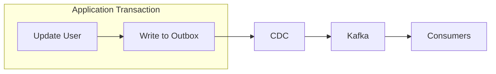

**CDC as outbox relay:**

```sql
-- Outbox table
CREATE TABLE outbox (
    id UUID PRIMARY KEY,
    aggregate_type VARCHAR(255),
    aggregate_id VARCHAR(255),
    type VARCHAR(255),
    payload JSONB,
    created_at TIMESTAMP DEFAULT NOW()
);

-- Application writes to outbox in same transaction
BEGIN;
UPDATE users SET email = 'new@example.com' WHERE id = 123;
INSERT INTO outbox (id, aggregate_type, aggregate_id, type, payload)
VALUES (gen_random_uuid(), 'User', '123', 'EmailChanged', '{"email": "new@example.com"}');
COMMIT;
```

**Debezium outbox transform:**

```json
{
  "transforms": "outbox",
  "transforms.outbox.type": "io.debezium.transforms.outbox.EventRouter",
  "transforms.outbox.table.field.event.key": "aggregate_id",
  "transforms.outbox.table.field.event.payload": "payload",
  "transforms.outbox.route.topic.replacement": "events.${routedByValue}"
}
```

### Cache Invalidation

CDC enables event-driven cache invalidation without TTL guessing:

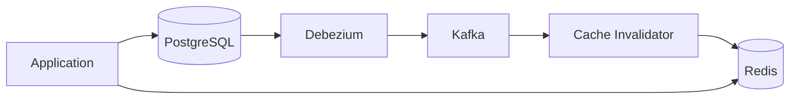

**Implementation:**

```typescript collapse={1-8}
interface ChangeEvent {
  op: "c" | "u" | "d" // create, update, delete
  before: Record<string, unknown> | null
  after: Record<string, unknown> | null
  source: { table: string }
}

async function handleChange(change: ChangeEvent) {
  const table = change.source.table
  const key = change.after?.id ?? change.before?.id

  // Invalidate cache entry
  await redis.del(`${table}:${key}`)

  // Optional: warm cache with new value
  if (change.op !== "d" && change.after) {
    await redis.setex(`${table}:${key}`, 3600, JSON.stringify(change.after))
  }
}
```

**Benefits over TTL:**

- Immediate invalidation (sub-second vs. minutes/hours)
- No stale reads from long TTLs
- No thundering herd from short TTLs

### Search Index Synchronization

CDC keeps search indices in sync with source of truth:

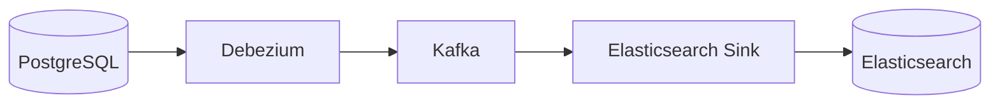

**Kafka Connect Elasticsearch sink:**

```json
{
  "connector.class": "io.confluent.connect.elasticsearch.ElasticsearchSinkConnector",
  "topics": "myapp.public.products",
  "connection.url": "http://elasticsearch:9200",
  "type.name": "_doc",
  "key.ignore": "false",
  "schema.ignore": "true",
  "behavior.on.null.values": "delete"
}
```

**Handling deletions:**

- Debezium emits tombstone (null value) for deletes
- Sink connector translates tombstone to Elasticsearch delete
- Index stays synchronized including deletions

### Analytics Pipeline Feeding

CDC enables real-time analytics without batch ETL:

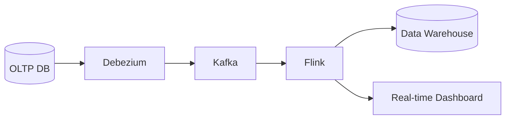

**Lambda architecture simplification:**

| Traditional                | CDC-Based                          |
| -------------------------- | ---------------------------------- |
| Batch ETL (daily) + Stream | Single CDC stream                  |
| Batch for completeness     | Snapshot + stream for completeness |
| Hours-old data             | Seconds-old data                   |
| Multiple pipelines         | Single pipeline                    |

## Common Pitfalls

### 1. Replication Slot Disk Bloat (PostgreSQL)

**The mistake**: Not monitoring replication slot lag.

**What happens**: CDC connector goes down or can't keep up. PostgreSQL retains all WAL since last consumed position. Disk fills. Database crashes.

**Example**: Connector had network issue for 2 hours. 50GB of WAL accumulated. Recovery required manual slot deletion and re-snapshot.

**Solutions:**

```sql
-- Monitor slot lag
SELECT slot_name,
       pg_size_pretty(pg_wal_lsn_diff(pg_current_wal_lsn(), restart_lsn)) AS lag,
       active
FROM pg_replication_slots;

-- Set maximum retained WAL (PostgreSQL 13+)
ALTER SYSTEM SET max_slot_wal_keep_size = '10GB';

-- Alert on inactive slots
SELECT slot_name FROM pg_replication_slots WHERE NOT active;
```

### 2. Tables Without Primary Keys

**The mistake**: Creating tables without primary keys, then adding them to CDC.

**What happens**: AWS DMS skips these tables entirely during CDC. Debezium can capture but updates/deletes can't be keyed properly.

**Example**: Legacy table `audit_log` had no PK. Added to CDC scope. All changes captured as creates; updates appeared as new rows.

**Solutions:**

- Add primary keys to all tables before enabling CDC
- Use composite key if no natural key exists
- For truly keyless tables, add surrogate key column

### 3. Large Transaction Handling

**The mistake**: Running batch updates (millions of rows) during CDC operation.

**What happens**: Debezium buffers changes until transaction commits. Memory pressure. Downstream lag. Potential OOM.

**Example**: Nightly job updating 5M rows in single transaction. CDC connector memory spiked to 8GB, causing restart. Other tables' CDC delayed by 30 minutes.

**Solutions:**

- Break large updates into batches with commits
- Configure Debezium memory limits
- Schedule large batch jobs during low-traffic windows
- Use `incremental.snapshot` for backfills

### 4. Snapshot + Streaming Race Conditions

**The mistake**: Not understanding snapshot isolation during initial load.

**What happens**: Snapshot reads table at point-in-time. Streaming starts from "after snapshot." Changes during snapshot can be missed or duplicated.

**Example**:

1. Snapshot starts at LSN 100
2. Row inserted at LSN 150
3. Snapshot reads row (sees insertion)
4. Streaming starts at LSN 100
5. Streaming also captures insertion at LSN 150
6. Duplicate row in target

**Solutions:**

Debezium handles this correctly when configured properly:

```json
{
  "snapshot.mode": "initial",
  "snapshot.locking.mode": "minimal"
}
```

Consumer must be idempotent to handle potential duplicates during snapshot-to-streaming transition.

### 5. Schema Change During CDC

**The mistake**: Assuming DDL changes propagate seamlessly.

**What happens**:

- Column added: Old consumers fail parsing
- Column removed: Data loss if not handled
- Type changed: Deserialization errors

**Example**: Added `phone` column to `users` table. CDC captured the DDL. Downstream consumer's Avro schema didn't have `phone`. Consumer crashed with schema mismatch error.

**Solutions:**

- Use Schema Registry with BACKWARD compatibility
- Test schema changes in staging with CDC running
- Coordinate consumer deployments with schema changes
- Monitor for schema change events before production DDL

## Implementation Guide

### Starting Point Decision

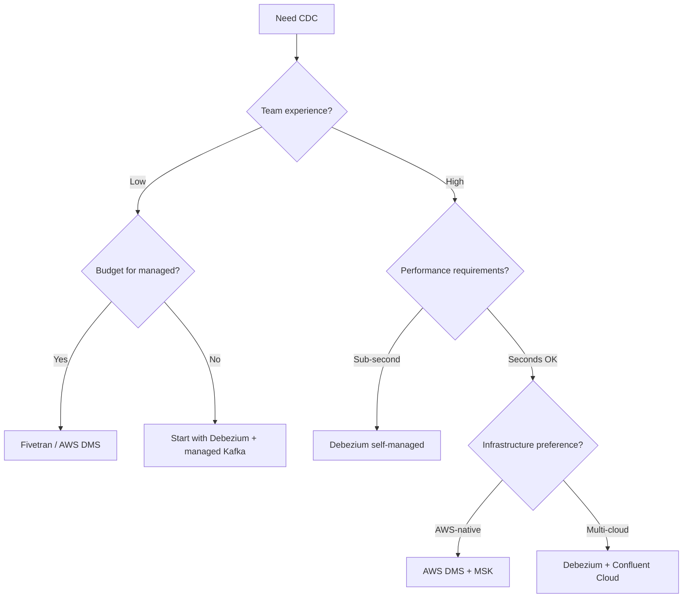

### Checklist for Production CDC

**Database preparation:**

- [ ] Enable logical replication/binary logging
- [ ] Create dedicated CDC user with minimal permissions
- [ ] Configure log retention appropriately
- [ ] Add primary keys to all tables in scope
- [ ] Test DDL change impact

**Infrastructure:**

- [ ] Kafka cluster sized for CDC throughput
- [ ] Schema Registry deployed and accessible
- [ ] Monitoring dashboards for connector lag
- [ ] Alerting on replication slot lag (PostgreSQL)
- [ ] Alerting on connector failures

**Operational:**

- [ ] Runbook for connector restart
- [ ] Runbook for re-snapshot after extended downtime
- [ ] Backup strategy for connector offsets
- [ ] Schema change coordination process
- [ ] Large transaction handling policy

### Capacity Planning

**Throughput estimation:**

```
CDC messages/sec ≈ (writes/sec to source tables) × (avg columns per table / 10)
```

Each CDC message size depends on row size and change type (update includes before/after).

**Kafka sizing:**

| Metric               | Recommendation                            |
| -------------------- | ----------------------------------------- |
| Partitions per topic | 2-3 × expected consumer parallelism       |
| Replication factor   | 3 (standard Kafka recommendation)         |
| Retention            | 7 days minimum (allows consumer recovery) |
| Broker disk          | 3 × (daily CDC volume) × retention days   |

## Conclusion

CDC transforms database changes into reliable event streams, enabling real-time data propagation without application-level dual writes. Log-based CDC—reading from WAL, binlog, or oplog—is the production standard, capturing all changes with minimal database impact.

**Key decisions:**

1. **Log-based vs. polling**: Log-based captures everything including deletes; polling is simpler but misses hard deletes and adds latency
2. **Debezium vs. managed**: Debezium offers sub-second latency and full control; managed services (DMS, Fivetran) reduce operational burden
3. **Schema evolution strategy**: Schema Registry with BACKWARD compatibility prevents consumer breakage

**Critical operational concerns:**

- PostgreSQL replication slot bloat is the most common production incident
- Large transactions can cause memory pressure and downstream lag
- Tables without primary keys create CDC gaps

**Start simple**: Single database → Debezium → Kafka → single consumer. Add complexity (schema registry, multiple sources, complex routing) as requirements demand.

## Appendix

### Prerequisites

- Database administration fundamentals (replication, transaction logs)
- Message broker concepts (Kafka topics, partitions, consumer groups)
- Distributed systems basics (eventual consistency, exactly-once semantics)

### Terminology

| Term                 | Definition                                                          |
| -------------------- | ------------------------------------------------------------------- |
| **WAL**              | Write-Ahead Log—PostgreSQL's transaction log for durability         |
| **Binlog**           | Binary Log—MySQL's log of all data modifications                    |
| **Oplog**            | Operations Log—MongoDB's capped collection recording writes         |
| **LSN**              | Log Sequence Number—position in PostgreSQL WAL                      |
| **GTID**             | Global Transaction ID—MySQL's cross-topology transaction identifier |
| **Replication slot** | PostgreSQL mechanism to track consumer position and retain WAL      |
| **Tombstone**        | Kafka message with null value indicating deletion                   |
| **Schema Registry**  | Service storing and versioning message schemas                      |
| **Snapshot**         | Initial full data load before streaming changes                     |

### Summary

- CDC extracts database changes from transaction logs without impacting write performance
- **Log-based CDC** (Debezium, DMS) is the production standard—captures all operations including deletes and DDL
- **PostgreSQL** uses logical replication slots; monitor `max_slot_wal_keep_size` to prevent disk bloat
- **MySQL** requires `binlog_format=ROW` and benefits from GTID for resumability across failover
- **Exactly-once semantics** require Kafka 3.3.0+ with KRaft; consumer-side idempotency for end-to-end guarantees
- **Schema evolution** needs Schema Registry with BACKWARD compatibility; coordinate schema changes with consumer deployments
- **Transactional outbox** pattern integrates naturally with CDC for reliable event publishing

### References

**Official Documentation:**

- [Debezium Documentation](https://debezium.io/documentation/reference/stable/architecture.html) - Architecture, connectors, and configuration
- [Debezium Exactly-Once Delivery](https://debezium.io/blog/2023/06/22/towards-exactly-once-delivery/) - EOS implementation details
- [PostgreSQL Logical Replication](https://www.postgresql.org/docs/current/logical-replication.html) - Native PostgreSQL replication
- [PostgreSQL Logical Decoding](https://www.postgresql.org/docs/current/logicaldecoding.html) - WAL decoding internals
- [MySQL Binary Log](https://dev.mysql.com/doc/refman/8.0/en/binary-log.html) - Binlog configuration and format
- [MySQL GTID](https://dev.mysql.com/doc/refman/8.4/en/replication-gtids-concepts.html) - Global Transaction ID concepts
- [MongoDB Change Streams](https://www.mongodb.com/docs/manual/changeStreams/) - Change Stream API reference
- [AWS DMS CDC](https://docs.aws.amazon.com/dms/latest/userguide/CHAP_Task.CDC.html) - DMS ongoing replication

**Engineering Blogs:**

- [LinkedIn: Open Sourcing Databus](https://engineering.linkedin.com/data-replication/open-sourcing-databus-linkedins-low-latency-change-data-capture-system) - Original Databus architecture
- [Shopify: Capturing Every Change](https://shopify.engineering/capturing-every-change-shopify-sharded-monolith) - CDC at Shopify scale
- [Netflix: DBLog](https://netflixtechblog.com/dblog-a-generic-change-data-capture-framework-69351fb9099b) - Incremental snapshot approach
- [Airbnb: SpinalTap](https://medium.com/airbnb-engineering/capturing-data-evolution-in-a-service-oriented-architecture-72f7c643ee6f) - CDC for materialized views

**Patterns and Best Practices:**

- [Transactional Outbox Pattern](https://microservices.io/patterns/data/transactional-outbox.html) - Reliable event publishing pattern
- [AWS Transactional Outbox](https://docs.aws.amazon.com/prescriptive-guidance/latest/cloud-design-patterns/transactional-outbox.html) - AWS implementation guide
- [PostgreSQL Replication Slots Deep Dive](https://www.morling.dev/blog/mastering-postgres-replication-slots/) - Operational guidance
- [Advantages of Log-Based CDC](https://debezium.io/blog/2018/07/19/advantages-of-log-based-change-data-capture/) - Comparison with other approaches

**Kafka Exactly-Once:**

- [Kafka Exactly-Once Semantics](https://www.confluent.io/blog/exactly-once-semantics-are-possible-heres-how-apache-kafka-does-it/) - Confluent explanation
- [KIP-98: Exactly Once Delivery](https://cwiki.apache.org/confluence/display/KAFKA/KIP-98+-+Exactly+Once+Delivery+and+Transactional+Messaging) - Original Kafka proposal
