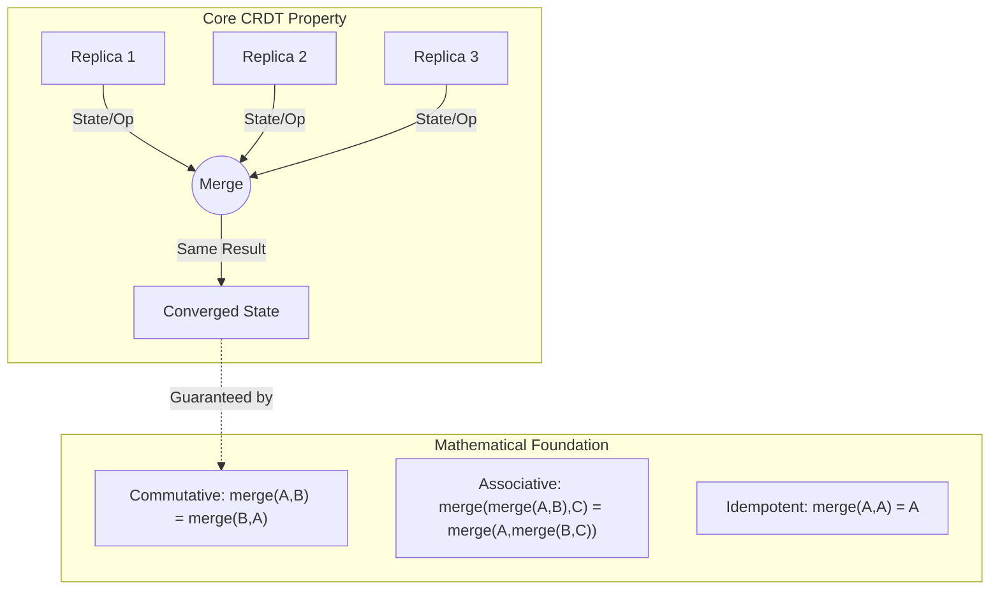
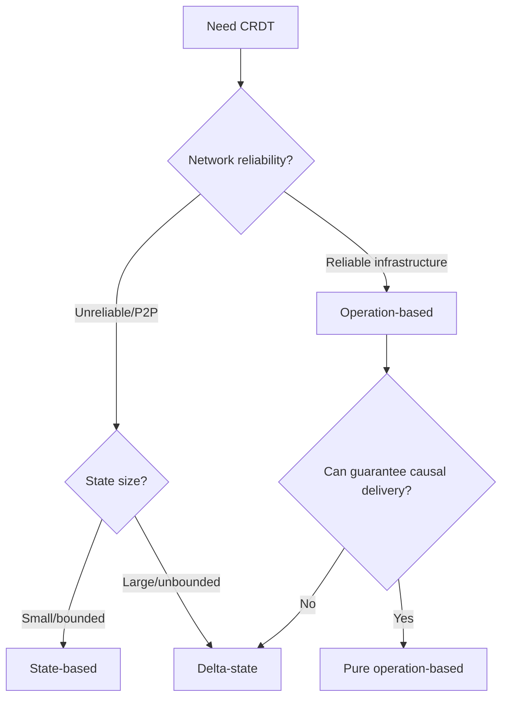
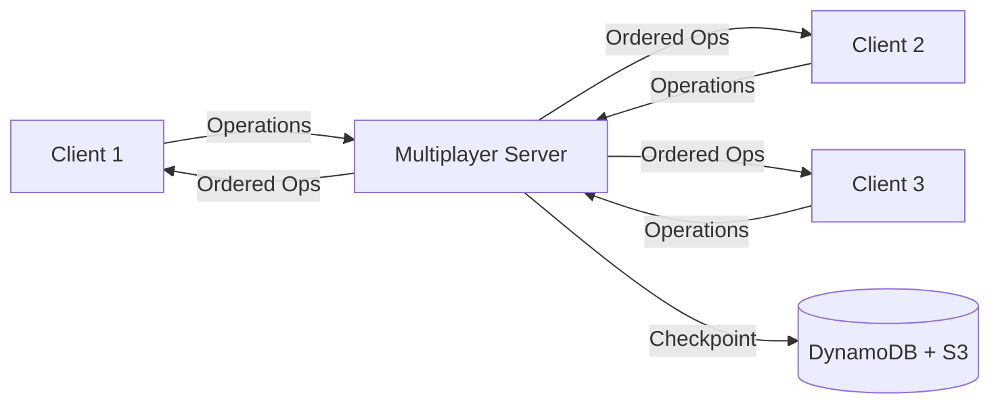
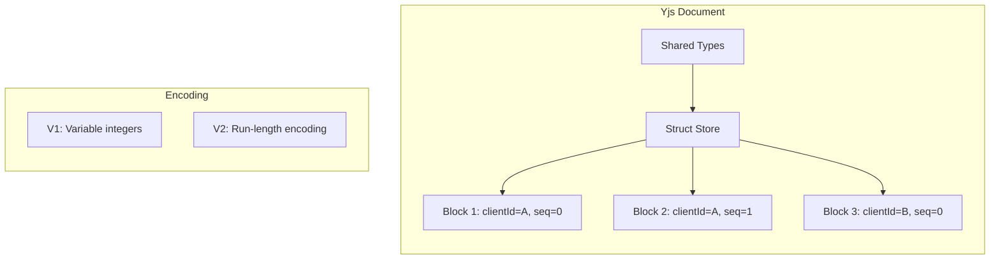
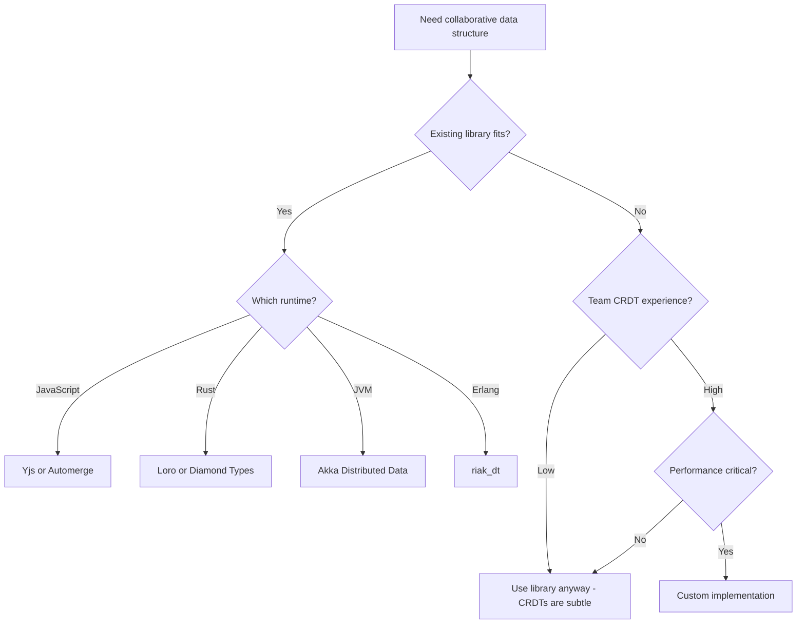

# CRDTs for Collaborative Systems

Conflict-free Replicated Data Types (CRDTs) are data structures mathematically guaranteed to converge to the same state across distributed replicas without coordination. They solve the fundamental challenge of distributed collaboration: allowing concurrent updates while ensuring eventual consistency without locking or consensus protocols.

This article covers CRDT fundamentals, implementation variants, production deployments, and when to choose CRDTs over Operational Transformation (OT).

<figure>



<figcaption>CRDTs guarantee convergence through mathematical properties of the merge function—order of operations, network duplicates, and timing are irrelevant.</figcaption>
</figure>

## Abstract

CRDTs guarantee convergence through **join-semilattice** properties: merge operations must be commutative, associative, and idempotent. This makes them fundamentally different from consensus-based systems—no coordination overhead, no leader election, no blocking on network partitions.

**Core mental model:**

- **State-based (CvRDT)**: Send full state, merge via lattice join. Simple semantics, any delivery order works. Cost: state transfer size.
- **Operation-based (CmRDT)**: Send operations only. Small messages, but requires exactly-once causal delivery. Cost: delivery infrastructure.
- **Delta-state**: Hybrid—send incremental state changes. Best of both when implemented correctly.

**Key insight**: The choice between variants is a **delivery infrastructure vs. merge complexity** tradeoff. State-based pushes complexity into the merge function and tolerates unreliable networks. Operation-based pushes complexity into the delivery layer and achieves smaller messages.

**Production reality**: Most systems use hybrid approaches. Figma uses operation-based with server ordering. Yjs and Automerge use optimized delta-state. Riak uses state-based with delta optimization.

## The Problem

### Why Naive Solutions Fail

**Approach 1: Last-Writer-Wins with Wall Clocks**

```typescript
// Naive LWW - seems simple
function merge(a: { value: T; timestamp: number }, b: { value: T; timestamp: number }) {
  return a.timestamp > b.timestamp ? a : b
}
```

Fails because:

- **Clock skew**: Node A's clock is 5 seconds ahead. Its writes always win regardless of actual order.
- **Lost updates**: Two users edit simultaneously. One user's entire work disappears.
- **Non-deterministic**: Same updates processed in different order can produce different results across replicas.

**Approach 2: Locking/Pessimistic Concurrency**

Fails because:

- **Unavailable during partitions**: Can't acquire lock when network splits.
- **Latency penalty**: Every operation requires round-trip to lock server.
- **Deadlocks**: Distributed deadlock detection is complex and slow.

**Approach 3: Consensus on Every Write (Paxos/Raft)**

Fails because:

- **Unavailable during partitions**: Consensus requires majority quorum.
- **High latency**: Multiple round-trips per write (Paxos: 2 RTTs minimum).
- **Doesn't scale**: Every write touches every node. P2P scenarios impossible.

### The Core Challenge

The fundamental tension: **strong consistency requires coordination, coordination requires availability sacrifice** (CAP theorem).

CRDTs resolve this by **designing data structures where concurrent operations commute**. Instead of preventing conflicts, they make conflicts mathematically impossible to produce divergent states.

## CRDT Foundations

### Join-Semilattice Mathematics

CRDTs are built on **join-semilattices**—partially ordered sets where any two elements have a least upper bound (join/merge).

**Formal requirements for merge function ⊔:**

| Property    | Definition                | Why It Matters                           |
| ----------- | ------------------------- | ---------------------------------------- |
| Commutative | A ⊔ B = B ⊔ A             | Order of receiving updates is irrelevant |
| Associative | (A ⊔ B) ⊔ C = A ⊔ (B ⊔ C) | Grouping of merges is irrelevant         |
| Idempotent  | A ⊔ A = A                 | Duplicate messages are harmless          |

**Monotonicity constraint**: Updates must be **inflations**—they can only move "up" in the lattice ordering. You can never return to a previous state.

> "Any state-based object satisfying the monotonic semilattice property is strongly eventually consistent."
> — Shapiro et al., "A Comprehensive Study of Convergent and Commutative Replicated Data Types" (2011)

### Strong Eventual Consistency (SEC)

CRDTs provide **Strong Eventual Consistency**:

1. **Eventual delivery**: Every update eventually reaches every replica
2. **Convergence**: Replicas that have received the same updates are in identical states
3. **Termination**: All operations complete locally without blocking

This is stronger than eventual consistency (which only guarantees convergence "eventually") because SEC guarantees **immediate local completion** and **deterministic convergence**.

## Design Paths

### Path 1: State-Based CRDTs (CvRDT)

**How it works:**

1. Each replica maintains full local state
2. Periodically, replicas exchange their complete state
3. Receiving replica merges incoming state with local state using join operation
4. Merge function satisfies semilattice properties

**When to choose this path:**

- Network is unreliable (messages may be lost, duplicated, reordered)
- State size is bounded or compressible
- Merge function is computationally cheap
- Simpler implementation is preferred over message efficiency

**Key characteristics:**

- Any gossip protocol works—no ordering guarantees needed
- Duplicate messages are automatically handled (idempotence)
- Full state must be transmitted on every sync

**G-Counter example (state-based):**

```typescript collapse={1-2}
type NodeId = string

interface GCounter {
  counts: Map<NodeId, number> // Each node tracks its own increment count
}

function increment(counter: GCounter, nodeId: NodeId): GCounter {
  const newCounts = new Map(counter.counts)
  newCounts.set(nodeId, (counter.counts.get(nodeId) ?? 0) + 1)
  return { counts: newCounts }
}

function merge(a: GCounter, b: GCounter): GCounter {
  // Pairwise maximum - satisfies all semilattice properties
  const merged = new Map<NodeId, number>()
  const allNodes = new Set([...a.counts.keys(), ...b.counts.keys()])
  for (const nodeId of allNodes) {
    merged.set(nodeId, Math.max(a.counts.get(nodeId) ?? 0, b.counts.get(nodeId) ?? 0))
  }
  return { counts: merged }
}

function value(counter: GCounter): number {
  return [...counter.counts.values()].reduce((sum, n) => sum + n, 0)
}
```

**Trade-offs:**

| Advantage                                     | Disadvantage                                     |
| --------------------------------------------- | ------------------------------------------------ |
| Simple delivery—any order, duplicates OK      | State transfer can be expensive                  |
| Easy to reason about—state is self-describing | State can grow unbounded (actor IDs, tombstones) |
| Works over unreliable networks                | Merge computation on every sync                  |

**Real-world: Riak** uses state-based CRDTs with delta optimization. They maintain full state but only transmit deltas when possible.

### Path 2: Operation-Based CRDTs (CmRDT)

**How it works:**

1. Each replica maintains local state
2. Operations are applied locally and broadcast to other replicas
3. Receiving replicas apply operations to their local state
4. Operations must commute when applied concurrently

**When to choose this path:**

- Reliable, exactly-once, causally-ordered delivery available
- Operations are small relative to state size
- Low-latency propagation is critical
- Can invest in delivery infrastructure

**Key characteristics:**

- Small message size (just the operation)
- Requires reliable causal broadcast—significant infrastructure investment
- Must handle late joiners (replay history or checkpoint + recent ops)

**G-Counter example (operation-based):**

```typescript
type Operation = { type: "increment"; nodeId: string; amount: number }

function apply(counter: number, op: Operation): number {
  // Operations must be delivered exactly once, in causal order
  return counter + op.amount
}

// The delivery layer must guarantee:
// 1. No duplicates
// 2. No lost messages
// 3. Causal ordering (if A caused B, A delivered before B)
```

**Trade-offs:**

| Advantage                        | Disadvantage                             |
| -------------------------------- | ---------------------------------------- |
| Small messages (operations only) | Requires reliable causal delivery layer  |
| Immediate propagation possible   | Must track history for late joiners      |
| Lower bandwidth                  | More complex reasoning about concurrency |

**Real-world: Figma** uses operation-based approach with their own delivery layer. Server provides ordering and validation. They invested heavily in transport infrastructure to achieve low-latency sync.

### Path 3: Delta-State CRDTs

**How it works:**

1. Track changes since last sync as "deltas"
2. Send only the delta (incremental state change), not full state
3. Deltas are themselves CRDTs—can be merged like states
4. Falls back to full state sync when deltas unavailable

**When to choose this path:**

- Want small messages like op-based but unreliable network like state-based
- State is large but changes are typically small
- Can track sync points between replicas

**Key insight from research:**

> "Delta-state CRDTs combine the distributed nature of operation-based CRDTs with the uniquely simple model of state-based CRDTs."
> — Almeida et al., "Delta State Replicated Data Types" (2018)

**Trade-offs:**

| Advantage                           | Disadvantage                   |
| ----------------------------------- | ------------------------------ |
| Small messages in common case       | Must track sync state per peer |
| Works over unreliable networks      | Delta storage overhead         |
| Falls back gracefully to full state | More complex implementation    |

**Real-world: Yjs and Automerge** both use delta-state approaches with sophisticated compression.

### Comparison Matrix

| Factor                      | State-Based        | Operation-Based      | Delta-State          |
| --------------------------- | ------------------ | -------------------- | -------------------- |
| Message size                | Full state         | Single operation     | Incremental delta    |
| Delivery requirement        | Any (gossip OK)    | Exactly-once, causal | Any                  |
| Late joiner handling        | Send current state | Replay history       | Send deltas or state |
| Implementation complexity   | In merge function  | In delivery layer    | In delta tracking    |
| Network partition tolerance | Excellent          | Poor                 | Excellent            |
| Typical latency             | Higher (batched)   | Lower (immediate)    | Medium               |

### Decision Framework



## Common CRDT Data Structures

### Counters

**G-Counter (Grow-Only):** Covered above. Foundation for other counters.

**PN-Counter (Positive-Negative):** Two G-Counters—one for increments, one for decrements.

```typescript collapse={1-8}
interface PNCounter {
  P: GCounter // Positive increments
  N: GCounter // Negative increments (decrements)
}

function increment(counter: PNCounter, nodeId: string): PNCounter {
  return { ...counter, P: GCounter.increment(counter.P, nodeId) }
}

function decrement(counter: PNCounter, nodeId: string): PNCounter {
  return { ...counter, N: GCounter.increment(counter.N, nodeId) }
}

function value(counter: PNCounter): number {
  return GCounter.value(counter.P) - GCounter.value(counter.N)
}

function merge(a: PNCounter, b: PNCounter): PNCounter {
  return {
    P: GCounter.merge(a.P, b.P),
    N: GCounter.merge(a.N, b.N),
  }
}
```

### Registers

**LWW-Register (Last-Writer-Wins):** Associates timestamp with each update. Highest timestamp wins.

```typescript
interface LWWRegister<T> {
  value: T
  timestamp: number // Lamport timestamp, NOT wall clock
  nodeId: string // Tie-breaker for equal timestamps
}

function merge<T>(a: LWWRegister<T>, b: LWWRegister<T>): LWWRegister<T> {
  if (a.timestamp > b.timestamp) return a
  if (b.timestamp > a.timestamp) return b
  // Equal timestamps: deterministic tie-breaker
  return a.nodeId > b.nodeId ? a : b
}
```

**Critical**: Use Lamport timestamps, not wall clocks. Wall clock skew causes non-deterministic behavior.

**MV-Register (Multi-Value):** Preserves all concurrent values instead of picking winner.

```typescript collapse={1-4}
interface MVRegister<T> {
  values: Map<VectorClock, T> // All concurrent values
}

function write<T>(reg: MVRegister<T>, value: T, clock: VectorClock): MVRegister<T> {
  // Remove all values that this write supersedes
  const newValues = new Map<VectorClock, T>()
  for (const [vc, v] of reg.values) {
    if (!clock.dominates(vc)) {
      newValues.set(vc, v) // Keep concurrent values
    }
  }
  newValues.set(clock, value)
  return { values: newValues }
}

function read<T>(reg: MVRegister<T>): T[] {
  return [...reg.values.values()] // May return multiple values
}
```

**Design decision**: MV-Register pushes conflict resolution to the application. Use when automatic resolution (LWW) loses important data.

### Sets

**G-Set (Grow-Only):** Elements can only be added, never removed.

**2P-Set (Two-Phase):** Add-set and remove-set. Element present if in add-set but not remove-set.

- **Limitation**: Once removed, element can never be re-added.

**OR-Set (Observed-Remove):** Most practical set CRDT. Each element tagged with unique ID. Remove only affects observed tags.

```typescript collapse={1-6}
type Tag = string // Globally unique (e.g., UUID or nodeId + sequence)

interface ORSet<T> {
  elements: Map<T, Set<Tag>> // Element -> set of tags
}

function add<T>(set: ORSet<T>, element: T, tag: Tag): ORSet<T> {
  const tags = new Set(set.elements.get(element) ?? [])
  tags.add(tag)
  const newElements = new Map(set.elements)
  newElements.set(element, tags)
  return { elements: newElements }
}

function remove<T>(set: ORSet<T>, element: T): ORSet<T> {
  // Remove only tags we've "observed" - concurrent adds survive
  const newElements = new Map(set.elements)
  newElements.delete(element)
  return { elements: newElements }
}

function merge<T>(a: ORSet<T>, b: ORSet<T>): ORSet<T> {
  const merged = new Map<T, Set<Tag>>()
  const allElements = new Set([...a.elements.keys(), ...b.elements.keys()])
  for (const element of allElements) {
    const tagsA = a.elements.get(element) ?? new Set()
    const tagsB = b.elements.get(element) ?? new Set()
    const unionTags = new Set([...tagsA, ...tagsB])
    if (unionTags.size > 0) {
      merged.set(element, unionTags)
    }
  }
  return { elements: merged }
}

function has<T>(set: ORSet<T>, element: T): boolean {
  return (set.elements.get(element)?.size ?? 0) > 0
}
```

**Add-wins semantics**: Concurrent add and remove → element present. This matches user intuition in most applications.

## Sequence CRDTs for Text Editing

Sequence CRDTs enable collaborative text editing. Each character gets a unique, ordered identifier that persists across all replicas.

### The Interleaving Problem

**The challenge**: Users A and B both type at position 5. A types "foo", B types "bar". Naive merge produces "fboaor" instead of "foobar" or "barfoo".

```
Initial:  "Hello|World"  (both cursors at position 5)
User A:   "Hello|foo|World"
User B:   "Hello|bar|World"
Naive:    "Hellofboaor World"  ← Characters interleaved!
Correct:  "HellofoobarWorld" or "HellobarfooWorld"
```

### Major Algorithms

| Algorithm   | Approach                      | Interleaving   | ID Growth | Notes                           |
| ----------- | ----------------------------- | -------------- | --------- | ------------------------------- |
| RGA         | Linked list + timestamps      | Can interleave | Linear    | Good general performance        |
| Logoot/LSEQ | Fractional positions          | Can interleave | Unbounded | Simple but IDs grow             |
| Fugue       | Designed for non-interleaving | Minimal        | Bounded   | Proven maximal non-interleaving |
| Eg-walker   | Event graph replay            | Minimal        | Bounded   | State-of-the-art performance    |

**Fugue algorithm** (2023): Specifically designed to satisfy "maximal non-interleaving"—concurrent inserts at the same position are never interleaved.

> "We prove that Fugue satisfies a maximally strong non-interleaving property."
> — Gentle et al., "The Art of the Fugue" (2023)

### Rich Text: Peritext

**Peritext** handles inline formatting (bold, italic, links) in CRDTs.

**Key insight**: Formatting spans are linked to stable character identifiers, not positions. Formatting marks accumulate—remove marks don't delete add marks, they add counter-marks.

**Design decisions:**

- **Expand on edges**: When typing at the end of bold text, new characters inherit bold formatting
- **Anchor to characters**: Formatting boundaries attached to character IDs, not positions
- **Never delete marks**: Add "remove bold" marks rather than deleting "add bold" marks

## Production Implementations

### Figma: Server-Ordered Operations

**Context**: Real-time collaborative design tool. Millions of concurrent users editing complex documents.

**Implementation choices:**

- **Pattern variant**: Operation-based with server ordering
- **Architecture**: WebSocket to multiplayer servers; server is authoritative
- **Conflict resolution**: LWW per-property-per-object. Two users changing different properties don't conflict.
- **Persistence**: State in-memory, checkpointed to S3 every 30-60 seconds. Transaction log in DynamoDB.



**What worked:**

- Simplified conflict resolution by making server authoritative for ordering
- LWW per-property avoids complex merge logic for most operations

**What was hard:**

- Text editing required more sophisticated merging—adopted **Eg-walker** algorithm for code layers (2024)
- Handling network partitions while maintaining responsiveness

**Source**: [Figma Engineering Blog - How Figma's Multiplayer Technology Works](https://www.figma.com/blog/how-figmas-multiplayer-technology-works/)

### Yjs: Delta-State with Optimization

**Context**: Most popular CRDT library. 900k+ weekly npm downloads. Powers many collaborative editors.

**Implementation choices:**

- **Pattern variant**: Delta-state with sophisticated encoding
- **Architecture**: Network-agnostic. Works P2P, client-server, or hybrid.
- **Data model**: Shared types (Y.Map, Y.Array, Y.Text) that mirror JavaScript types

**Internal architecture:**



**Key optimizations:**

- **Block merging**: Consecutive operations from same client merged into single block
- **Efficient encoding**: V2 encoding influenced by Automerge research—run-length encoding for sequences
- **Deleted content removal**: Can delete content from deleted structs (tombstones kept, content discarded)

**What worked:**

- Network-agnostic design enables diverse deployment scenarios
- Provider architecture separates sync logic from data logic

**What was hard:**

- Garbage collection—tombstones accumulate over time
- Large documents can have significant memory overhead

**Source**: [Yjs Documentation](https://docs.yjs.dev/), [Yrs Architecture Deep Dive](https://www.bartoszsypytkowski.com/yrs-architecture/)

### Automerge: Local-First Philosophy

**Context**: Designed for local-first software where user's device is primary. "PostgreSQL for your local-first app."

**Implementation choices:**

- **Pattern variant**: State-based with optimized sync
- **Architecture**: Rust core, bindings for JS/WASM, C, Swift
- **Philosophy**: Automatic merging—no git-style merge conflicts exposed to users

**Key differentiators:**

- **Rigorous proofs**: Convergence verified with Isabelle theorem prover
- **Compact storage**: Sophisticated compression format
- **Deterministic conflict resolution**: Lamport timestamps + actor IDs ensure same result everywhere

**What worked:**

- Clean API hides CRDT complexity from application developers
- Excellent offline support out of the box

**What was hard:**

- Performance at scale—led to complete Rust rewrite
- Sync protocol complexity

**Source**: [Automerge Documentation](https://automerge.org/), [Local-First Software](https://www.inkandswitch.com/local-first/)

### Riak: Database-Level CRDTs

**Context**: Distributed key-value database. First production database to adopt CRDTs (2012).

**Implementation choices:**

- **Pattern variant**: State-based with delta optimization
- **Types supported**: Counters, Sets, Maps, HyperLogLogs (bucket-level); Flags, Registers (embedded)
- **Consistency**: Vector clocks for causality, optional causal consistency mode

**Production scale (League of Legends):**

- 7.5 million concurrent users
- 11,000 messages per second
- In-game chat powered by Riak CRDTs

**Challenges encountered:**

- Sets perform poorly for writes as cardinality grows
- Sets >500KB have issues—addressed with delta-replication and decomposition
- Recommended: decompose large sets into multiple entries

**Source**: [Riak Data Types Documentation](https://docs.riak.com/riak/kv/2.2.3/learn/concepts/crdts/index.html)

### Implementation Comparison

| Aspect          | Figma             | Yjs              | Automerge        | Riak             |
| --------------- | ----------------- | ---------------- | ---------------- | ---------------- |
| Variant         | Op-based (server) | Delta-state      | State-based      | State + delta    |
| Architecture    | Centralized       | Any              | P2P/local-first  | Distributed DB   |
| Offline support | Limited           | Excellent        | Excellent        | N/A (server)     |
| Rich text       | Eg-walker         | Native           | Peritext         | N/A              |
| Maturity        | Production        | Production       | Production       | Production       |
| Best for        | Real-time SaaS    | Editor libraries | Local-first apps | Key-value stores |

## Operational Concerns

### Garbage Collection

**The tombstone problem**: Deleted elements leave markers (tombstones) that must persist until all replicas have seen them. These accumulate over time.

**Why tombstones exist**: If replica A has tombstone for X, and replica B still has X, A must keep tombstone so X gets deleted when B syncs. Otherwise, X "resurrects."

**Strategies:**

| Strategy        | Mechanism                                                     | Trade-off                             |
| --------------- | ------------------------------------------------------------- | ------------------------------------- |
| Epoch-based     | Split into live/compacted portions at version vector boundary | Requires version vector tracking      |
| Stability-based | Remove when update known to all replicas                      | Requires global knowledge             |
| Time-based      | Remove after `gc_grace_seconds` (Cassandra)                   | May resurrect if replica rejoins late |
| Consensus-based | Paxos/2PC to agree on removal                                 | Defeats purpose of coordination-free  |

**Production approach (Cassandra)**: `gc_grace_seconds` defaults to 10 days. Tombstones older than this are removed during compaction. Set based on expected node recovery time.

### Causality Tracking

**Lamport timestamps**: Simple logical clock. Provides partial ordering but cannot distinguish concurrent events.

```typescript
// Lamport timestamp: increment on every event, max+1 on receive
let clock = 0

function localEvent(): number {
  return ++clock
}

function receiveEvent(remoteTimestamp: number): number {
  clock = Math.max(clock, remoteTimestamp) + 1
  return clock
}
```

**Vector clocks**: Full causality tracking. Can determine happened-before, happened-after, or concurrent.

```typescript collapse={1-4}
type VectorClock = Map<NodeId, number>

function increment(vc: VectorClock, nodeId: NodeId): VectorClock {
  const newVc = new Map(vc)
  newVc.set(nodeId, (vc.get(nodeId) ?? 0) + 1)
  return newVc
}

function merge(a: VectorClock, b: VectorClock): VectorClock {
  const merged = new Map<NodeId, number>()
  const allNodes = new Set([...a.keys(), ...b.keys()])
  for (const nodeId of allNodes) {
    merged.set(nodeId, Math.max(a.get(nodeId) ?? 0, b.get(nodeId) ?? 0))
  }
  return merged
}

function happenedBefore(a: VectorClock, b: VectorClock): boolean {
  // a < b iff all entries in a <= corresponding entry in b, and at least one <
  let hasLess = false
  for (const [nodeId, aTime] of a) {
    const bTime = b.get(nodeId) ?? 0
    if (aTime > bTime) return false
    if (aTime < bTime) hasLess = true
  }
  for (const [nodeId, bTime] of b) {
    if (!a.has(nodeId) && bTime > 0) hasLess = true
  }
  return hasLess
}

function concurrent(a: VectorClock, b: VectorClock): boolean {
  return !happenedBefore(a, b) && !happenedBefore(b, a)
}
```

**Cost**: O(N) space per operation where N is number of nodes. For large systems, consider hybrid logical clocks or bounded vector clocks.

### Handling Late Joiners

**Challenge**: New replica needs full state. For large documents with long histories, this is expensive.

**Strategies:**

1. **Full state transfer**: Simple but costly. Works for state-based CRDTs.
2. **Checkpoint + recent ops**: Periodically snapshot state; new nodes get snapshot + ops since.
3. **Delta sync**: Track version vectors; send deltas since last known state.

**Eg-walker approach**: Store event graph on disk, document state as plain text. New joiners get current text + subset of event graph needed for future merges.

## CRDT vs Operational Transformation

### Historical Context

- **OT**: Invented late 1980s. Powers Google Docs. Requires central server for transformation.
- **CRDT**: First proposed 2006 (WOOT). Designed for decentralized/offline systems.

### Fundamental Difference

**OT**: Transform operations against each other to preserve intent.

```
User A: insert("X", 5)  → transform against B's op → insert("X", 6)
User B: insert("Y", 3)  → transform against A's op → insert("Y", 3)
```

**CRDT**: Design operations that commute naturally.

```
User A: insert("X", id_a)  → apply directly
User B: insert("Y", id_b)  → apply directly
Result: determined by ID ordering, not transformation
```

### Comparison

| Aspect                    | OT                                           | CRDT                         |
| ------------------------- | -------------------------------------------- | ---------------------------- |
| Architecture              | Requires central server                      | Works P2P or centralized     |
| Offline support           | Poor (needs server)                          | Excellent                    |
| Intent preservation       | Better (transforms designed for it)          | Varies by algorithm          |
| Implementation complexity | High (transform functions error-prone)       | Moderate                     |
| Proven correctness        | Difficult (many flawed algorithms published) | Mathematical proofs possible |

### When to Choose Each

**Choose OT when:**

- Always-online application with reliable connectivity
- Centralized architecture already exists
- Intent preservation is critical (e.g., cursor positions in concurrent edits)
- Using existing OT infrastructure (Google Docs API, ShareDB)

**Choose CRDT when:**

- Offline-first is required
- P2P or decentralized architecture
- Multi-device sync with unreliable networks
- Edge computing scenarios
- Want mathematical guarantees of convergence

### The Convergence: Eg-walker

Recent research (Eg-walker, 2024) combines benefits of both:

> "Eg-walker achieves order of magnitude less memory than existing CRDTs, orders of magnitude faster document loading, and orders of magnitude faster branch merging than OT—all while working P2P without a central server."
> — Gentle & Kleppmann, "Collaborative Text Editing with Eg-walker" (EuroSys 2025)

**Key insight**: Store the event graph (DAG of edits) on disk. Keep document state as plain text in memory. Build CRDT structure temporarily during merge, then discard.

## Common Pitfalls

### 1. Unbounded State Growth

**The mistake**: Not planning for tombstone/history cleanup.

**Example**: Notion-like app storing all operations. After 1 year, loading a page requires replaying 100K operations taking 30+ seconds.

**Solutions:**

- Periodic state snapshots with operation truncation
- Tombstone GC with grace period
- Compaction strategies (Eg-walker approach)

### 2. Assuming Strong Consistency

**The mistake**: Building features that assume immediate consistency.

**Example**: "Undo" feature that undoes "last operation"—fails with concurrent edits because "last" is ambiguous.

**Solutions:**

- Design for concurrent operations from the start
- Use causal consistency, not wall-clock ordering
- Undo should undo "my last operation," not "the last operation"

### 3. Clock Skew with LWW

**The mistake**: Using wall clocks for LWW timestamps.

**Example**: Server with clock 5 seconds ahead always wins conflicts, even against more recent actual edits.

**Solutions:**

- Use Lamport timestamps or vector clocks
- If wall clocks required, use hybrid logical clocks (HLC)

### 4. Large Set Operations

**The mistake**: Using OR-Set for large, frequently-modified collections.

**Example (Riak)**: OR-Sets >500KB have significant performance issues—each element carries metadata.

**Solutions:**

- Decompose into multiple smaller sets
- Use specialized data structures (CRDTs for counters, not sets, when counting)
- Consider application-level sharding

### 5. Ignoring Merge Complexity

**The mistake**: Assuming merge is always fast.

**Example**: State-based CRDT with O(n²) merge. Works fine with 100 elements, falls over with 10,000.

**Solutions:**

- Analyze merge complexity during design
- Use delta-state to reduce merge frequency
- Profile with realistic data sizes

## Implementation Guide

### Starting Point Decision



### Library Recommendations

| Library               | Language | Best For                  | Maturity                            |
| --------------------- | -------- | ------------------------- | ----------------------------------- |
| Yjs                   | JS/TS    | Collaborative editing     | Production (900k+ weekly downloads) |
| Automerge             | JS/Rust  | Local-first apps          | Production                          |
| Loro                  | Rust/JS  | Rich text, moveable trees | Production                          |
| Diamond Types         | Rust     | High-performance text     | Production                          |
| Akka Distributed Data | JVM      | Actor-based systems       | Production                          |
| riak_dt               | Erlang   | Key-value stores          | Production                          |

### Building Custom: Checklist

Only build custom when existing libraries genuinely don't fit:

- [ ] Define merge semantics precisely before coding
- [ ] Prove commutativity/associativity/idempotence mathematically
- [ ] Handle clock skew (use logical clocks)
- [ ] Plan garbage collection strategy upfront
- [ ] Test with network partition simulation (e.g., Jepsen)
- [ ] Test with artificial latency injection
- [ ] Benchmark with realistic data sizes
- [ ] Consider formal verification (TLA+, Isabelle)

## Conclusion

CRDTs provide a mathematically rigorous solution to distributed collaboration. The semilattice properties—commutative, associative, idempotent merge—guarantee convergence without coordination.

**Key decisions:**

1. **State vs operation vs delta**: Trade delivery complexity against message size
2. **Data structure selection**: Match CRDT type to application semantics (counters, sets, sequences)
3. **Build vs buy**: Use existing libraries unless you have exceptional requirements and CRDT expertise

**The ecosystem is mature**: Yjs, Automerge, and Loro are production-ready. Recent algorithms (Fugue, Eg-walker) solve longstanding problems like interleaving and state growth.

**Start simple**: LWW-Register and OR-Set cover most use cases. Graduate to sequence CRDTs only when building collaborative text editing.

## Appendix

### Prerequisites

- Distributed systems fundamentals (network partitions, consistency models)
- CAP theorem and eventual consistency
- Basic understanding of partial orders and lattice theory helpful but not required

### Terminology

| Term                  | Definition                                                                                    |
| --------------------- | --------------------------------------------------------------------------------------------- |
| **CvRDT**             | Convergent (state-based) CRDT                                                                 |
| **CmRDT**             | Commutative (operation-based) CRDT                                                            |
| **Tombstone**         | Marker indicating deleted element; must persist for convergence                               |
| **Vector clock**      | Logical clock tracking causality across multiple nodes                                        |
| **Lamport timestamp** | Simple logical clock; partial ordering only                                                   |
| **Join-semilattice**  | Set with a join (merge) operation that is commutative, associative, idempotent                |
| **SEC**               | Strong Eventual Consistency—replicas converge to identical state after receiving same updates |
| **OT**                | Operational Transformation—alternative approach requiring central server                      |

### Summary

- CRDTs guarantee convergence through **join-semilattice properties**: merge must be commutative, associative, and idempotent
- **State-based** CRDTs tolerate unreliable networks but transfer full state; **operation-based** require reliable causal delivery but send small messages; **delta-state** is the practical hybrid
- **OR-Set** is the most practical set CRDT; **Fugue** and **Eg-walker** are state-of-the-art for text editing
- Production systems (Figma, Yjs, Automerge, Riak) all use hybrid approaches optimized for their use cases
- **Garbage collection** is the primary operational challenge—plan tombstone strategy from the start
- **Use existing libraries** (Yjs, Automerge, Loro) unless requirements are exceptional

### References

**Foundational Papers:**

- [A Comprehensive Study of Convergent and Commutative Replicated Data Types](https://inria.hal.science/inria-00555588/document) - Shapiro et al., INRIA 2011. The definitive CRDT reference.
- [Conflict-free Replicated Data Types (SSS 2011)](https://link.springer.com/chapter/10.1007/978-3-642-24550-3_29) - Shapiro et al. Conference paper version.
- [Delta State Replicated Data Types](https://arxiv.org/abs/1603.01529) - Almeida et al. Delta-state CRDT formalization.
- [Pure Operation-Based Replicated Data Types](https://arxiv.org/abs/1710.04469) - Baquero & Shoker. Pure op-based CRDTs.

**Text Editing:**

- [The Art of the Fugue: Minimizing Interleaving in Collaborative Text Editing](https://arxiv.org/pdf/2305.00583) - Gentle et al., 2023. Fugue algorithm.
- [Collaborative Text Editing with Eg-walker](https://arxiv.org/abs/2409.14252) - Gentle & Kleppmann, EuroSys 2025. State-of-the-art performance.
- [Peritext: A CRDT for Rich Text](https://www.inkandswitch.com/peritext/) - Litt et al. Rich text formatting in CRDTs.

**Production Implementations:**

- [How Figma's Multiplayer Technology Works](https://www.figma.com/blog/how-figmas-multiplayer-technology-works/) - Figma Engineering Blog.
- [Yjs Documentation](https://docs.yjs.dev/) - Yjs official docs.
- [Automerge](https://automerge.org/) - Automerge project site.
- [Riak Data Types](https://docs.riak.com/riak/kv/2.2.3/learn/concepts/crdts/index.html) - Riak CRDT documentation.
- [Loro](https://loro.dev/) - Loro CRDT library.

**Additional Resources:**

- [crdt.tech](https://crdt.tech/) - Official CRDT resources, papers, and implementations list.
- [Local-First Software](https://www.inkandswitch.com/local-first/) - Ink & Switch essay on local-first architecture.
- [CRDT Glossary](https://crdt.tech/glossary) - Standard terminology definitions.
