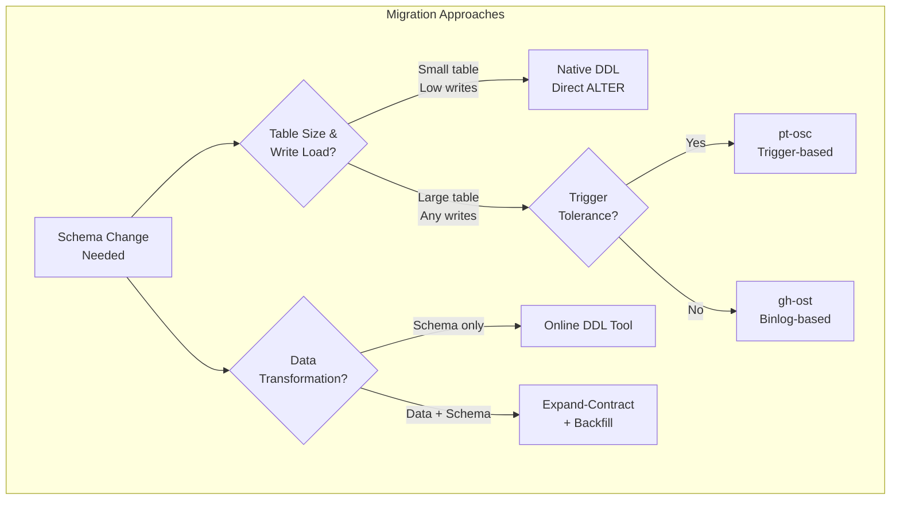
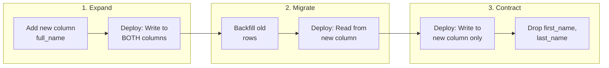
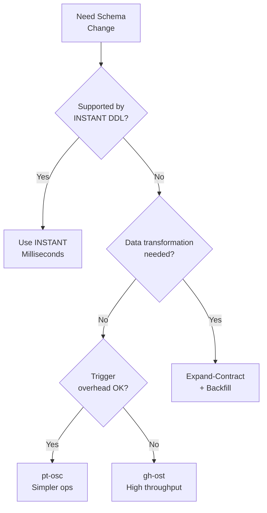
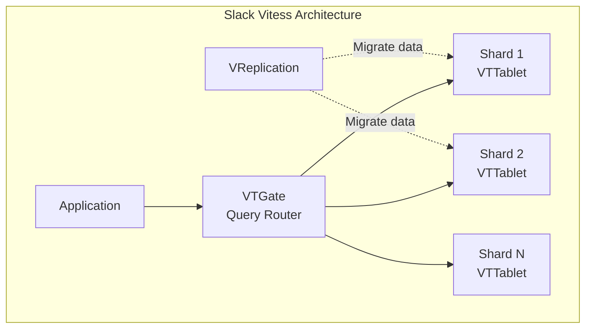
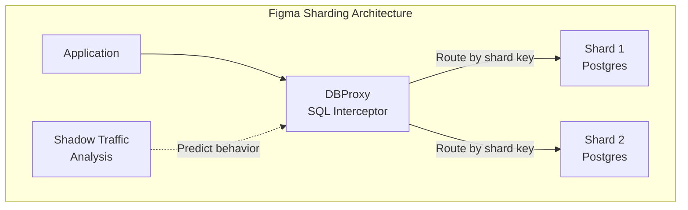
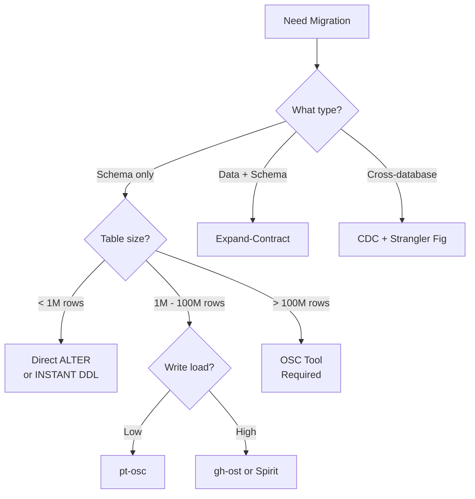

# Database Migrations at Scale

Changing database schemas in production systems without downtime requires coordinating schema changes, data transformations, and application code across distributed systems. The core challenge: the schema change itself takes milliseconds, but MySQL's `ALTER TABLE` on a 500GB table with row locking would take days and block all writes. This article covers the design paths, tool mechanisms, and production patterns that enable zero-downtime migrations.

<figure>



<figcaption>Decision tree for selecting migration approach based on table characteristics and change type.</figcaption>
</figure>

## Abstract

Database migrations at scale are fundamentally about **change isolation**—ensuring schema modifications don't block production traffic. Three primary mechanisms achieve this:

1. **Shadow table approach**: Create a copy of the table with the new schema, copy data in batches, capture ongoing changes, then atomically swap. The critical design choice is _how_ to capture changes—triggers (synchronous, blocks queries) vs. binlog consumption (asynchronous, adds latency).

2. **Expand-contract pattern**: Add new columns/tables alongside old ones, run dual-write/dual-read during transition, then remove old structures. This trades migration complexity for deployment flexibility—any stage can be rolled back independently.

3. **Native instant DDL**: Metadata-only changes that avoid data copying entirely. Limited to specific operations (MySQL 8.0.29+ supports adding/dropping columns instantly), but transforms hours-long migrations into milliseconds.

The production reality: most migrations combine these approaches. A column type change might use gh-ost for the schema change, expand-contract for application rollout, and backfill jobs for data transformation—each stage with its own rollback plan.

## The Problem

### Why Naive Schema Changes Fail

**Approach 1: Direct `ALTER TABLE`**

MySQL's `ALTER TABLE` (pre-8.0, or for unsupported operations) acquires a metadata lock that blocks all queries for the duration of the table copy:

```sql
-- On a 200GB table with 500M rows, this takes 4-8 hours
-- ALL reads and writes blocked for the entire duration
ALTER TABLE orders ADD COLUMN shipping_estimate DATETIME;
```

The table must be copied row-by-row to a new structure. For a 200GB table at 100MB/s internal throughput, that's ~33 minutes just for copying—but with checkpointing, validation, and lock contention, real-world times are 4-8 hours. During this time, the application is effectively down.

**Approach 2: Blue-Green Table Swap**

Create a new table, copy data, swap:

```sql
CREATE TABLE orders_new LIKE orders;
ALTER TABLE orders_new ADD COLUMN shipping_estimate DATETIME;
INSERT INTO orders_new SELECT *, NULL FROM orders;
RENAME TABLE orders TO orders_old, orders_new TO orders;
```

The `RENAME` is atomic, but the gap between finishing the `INSERT` and executing `RENAME` means writes to `orders` are lost. On a table with 1,000 writes/second, even a 100ms gap loses 100 records.

**Approach 3: Application-Level Dual Write**

Write to both old and new tables from application code:

```python
def create_order(order_data):
    db.execute("INSERT INTO orders ...", order_data)
    db.execute("INSERT INTO orders_new ...", order_data)  # Add new column
```

Without distributed transactions, a crash between the two writes leaves the tables inconsistent. More subtly, the two writes aren't atomic—concurrent transactions might see different states. Stripe's engineering blog notes that dual-write "works only if you can tolerate some data inconsistency during the migration window."

### The Core Challenge

The fundamental tension: **schema changes require exclusive access, but production systems require continuous availability**. Online schema change (OSC) tools resolve this by creating the illusion of atomicity through careful orchestration—maintaining a shadow copy that stays synchronized until a brief, sub-second cutover.

## Design Paths

### Path 1: Trigger-Based (pt-online-schema-change)

Percona's pt-online-schema-change (pt-osc) uses MySQL triggers to synchronously capture changes.

**Mechanism:**

1. Create shadow table `_orders_new` with new schema
2. Create `AFTER INSERT`, `AFTER UPDATE`, `AFTER DELETE` triggers on original table
3. Copy rows in batches (default: 1,000 rows per chunk)
4. Triggers mirror every DML to the shadow table in real-time
5. Atomic swap: `RENAME TABLE orders TO _orders_old, _orders_new TO orders`

**Why triggers?** The synchronous nature means zero replication lag—every change to the original table is immediately applied to the shadow table within the same transaction. This simplifies the cutover: when the batch copy finishes, the shadow table is already current.

**Code flow:**

```sql
-- Trigger created by pt-osc (simplified)
CREATE TRIGGER pt_osc_ins_orders AFTER INSERT ON orders
FOR EACH ROW
  REPLACE INTO _orders_new (id, ..., shipping_estimate)
  VALUES (NEW.id, ..., NULL);
```

**Trade-offs:**

| Aspect               | Characteristic                                  |
| -------------------- | ----------------------------------------------- |
| Consistency          | Strong—changes are synchronous                  |
| Performance overhead | 10-15% on DML operations (trigger execution)    |
| Replication format   | Works with statement-based, row-based, or mixed |
| Foreign keys         | Better support than gh-ost                      |
| Cut-over             | Atomic RENAME, sub-second                       |

**When to choose:**

- Environments with statement-based replication (SBR)
- Tables with foreign key constraints
- Lower write throughput (<5,000 writes/sec on typical hardware)
- Simpler operational requirements

**Real-world:** Percona benchmarks show pt-osc completing migrations ~2x faster than gh-ost under light load, because triggers execute in parallel with the application while gh-ost's single-threaded binlog processing serializes changes.

### Path 2: Binlog-Based (gh-ost)

GitHub's gh-ost avoids triggers entirely by consuming the MySQL binary log.

**Mechanism:**

1. Create shadow table `_orders_gho` with new schema
2. Connect to a replica and simulate being a replica itself
3. Copy rows in batches from the original table
4. Simultaneously tail the binlog for changes to the original table
5. Apply binlog events to the shadow table asynchronously
6. Cut-over using a lock-and-rename coordination protocol

**Why binlog?** Triggers compete with application queries for row locks and add parsing overhead to every DML. On high-throughput tables (10,000+ writes/sec), trigger contention causes deadlocks and latency spikes. Binlog consumption is asynchronous—it doesn't block application queries.

**The cut-over challenge:**

MySQL doesn't support atomic table swap within a single connection that holds a lock. gh-ost's solution uses two connections:

```
Connection 1: LOCK TABLES orders WRITE, _orders_gho WRITE
              -- Creates sentry table to block premature RENAME
Connection 2: RENAME TABLE orders TO _orders_del, _orders_gho TO orders
              -- Blocked until sentry is dropped
Connection 1: DROP TABLE sentry; UNLOCK TABLES
              -- RENAME executes, appears atomic to replicas
```

The sentry table mechanism ensures the RENAME only executes after all binlog events are applied. From the replica's perspective (which only sees the binlog), the RENAME appears instantaneous.

**Trade-offs:**

| Aspect               | Characteristic                                      |
| -------------------- | --------------------------------------------------- |
| Consistency          | Eventually consistent during migration (binlog lag) |
| Performance overhead | Network I/O for binlog, but no trigger overhead     |
| Replication format   | Requires row-based replication (RBR)                |
| Foreign keys         | No support (can't track FK updates via binlog)      |
| Cut-over             | Coordinated lock-and-rename, typically 1-3 seconds  |

**When to choose:**

- High write throughput (>5,000 writes/sec)
- Long-running migrations where throttling is needed
- Need for true pause capability (pausing gh-ost stops all migration work)
- Modern MySQL 5.7+ / 8.0 environments with RBR

**Real-world:** GitHub migrates tables with millions of rows while serving production traffic. Their documentation notes that under sustained high load, gh-ost may lag behind indefinitely if writes exceed single-threaded binlog processing capacity.

### Path 3: Native Instant DDL (MySQL 8.0+)

MySQL 8.0.12 introduced `ALGORITHM=INSTANT` for metadata-only changes.

**Supported instant operations (8.0.29+):**

- `ADD COLUMN` at any position
- `DROP COLUMN`
- `RENAME COLUMN`
- `SET DEFAULT` / `DROP DEFAULT`
- Modify `ENUM`/`SET` column definition

**Mechanism:**

Instead of copying the table, MySQL stores the new column definition in metadata. Existing rows return `NULL` (or the default value) for the new column until explicitly updated. New rows include the column in their storage format.

```sql
-- Completes in milliseconds regardless of table size
ALTER TABLE orders ADD COLUMN shipping_estimate DATETIME, ALGORITHM=INSTANT;
```

**Why the 64-version limit?** Each instant operation increments a row version counter. MySQL caps this at 64 to bound the complexity of interpreting row formats during reads. After 64 instant operations, you must rebuild the table (which MySQL will do automatically if you try another instant operation beyond the limit).

**Trade-offs:**

| Aspect              | Characteristic                               |
| ------------------- | -------------------------------------------- |
| Speed               | Milliseconds for any table size              |
| Limitations         | 64 instant operations per table rebuild      |
| Row format          | Compressed tables not supported              |
| Combined operations | Can't mix instant + non-instant in one ALTER |

**When to choose:**

- Adding nullable columns or columns with defaults
- Dropping unused columns
- Any supported operation on tables too large for OSC

**Gotcha:** Even "online" ALTER TABLE on the primary causes replication lag on replicas. The replica must acquire the same locks and perform the same operation. For non-instant operations on large tables, replicas will lag for hours.

### Path 4: Expand-Contract (Application-Coordinated)

For changes that require data transformation (not just schema changes), the expand-contract pattern decouples the migration into independently deployable stages.

**Phases:**



**Stage 1: Expand (backward compatible)**

```sql
ALTER TABLE users ADD COLUMN full_name VARCHAR(255);
```

```python
# Application code v2: Write to both
def update_user_name(user_id, first, last):
    db.execute("""
        UPDATE users
        SET first_name = %s, last_name = %s, full_name = %s
        WHERE id = %s
    """, (first, last, f"{first} {last}", user_id))
```

**Stage 2: Migrate (transition)**

Run backfill job:

```sql
-- Process in batches of 10,000
UPDATE users
SET full_name = CONCAT(first_name, ' ', last_name)
WHERE full_name IS NULL
LIMIT 10000;
```

Deploy read from new column:

```python
def get_display_name(user_id):
    return db.query("SELECT full_name FROM users WHERE id = %s", user_id)
```

**Stage 3: Contract (remove legacy)**

```python
# Application code v4: Write only new column
def update_user_name(user_id, full_name):
    db.execute("UPDATE users SET full_name = %s WHERE id = %s", (full_name, user_id))
```

```sql
ALTER TABLE users DROP COLUMN first_name, DROP COLUMN last_name;
```

**Trade-offs:**

| Aspect                 | Characteristic                                    |
| ---------------------- | ------------------------------------------------- |
| Rollback capability    | Each stage independently reversible               |
| Deployment flexibility | Different services can be at different stages     |
| Complexity             | Multiple deployments, temporary increased storage |
| Duration               | Days to weeks for full migration                  |

**When to choose:**

- Data transformation required (not just schema change)
- Multiple services read/write the table
- Need fine-grained rollback at each stage
- Regulatory or audit requirements for gradual rollout

**Real-world:** Stripe uses expand-contract for all schema migrations involving data changes. Their engineering blog notes: "We never change more than a few hundred lines at a time—each stage is a separate pull request with its own review."

### Decision Framework



## Production Implementations

### GitHub: gh-ost at Scale

**Context:** GitHub serves millions of repositories with MySQL clusters handling tens of thousands of queries per second. Schema changes on tables like `commits` (billions of rows) were impossible with traditional OSC tools.

**Implementation choices:**

- Pattern variant: Binlog-based with replica consumption
- Key customization: Configurable throttling based on replica lag, custom cut-over timing
- Scale: Tables with hundreds of millions of rows, thousands of writes/sec

**Specific details:**

- Reads binlog from replica to minimize primary load
- Supports `--postpone-cut-over` to schedule final swap during low-traffic windows
- Dynamic configuration via Unix socket while migration runs
- Heartbeat injection for lag detection (configurable, default 500ms)

**What worked:**

- True pause capability—unlike trigger-based tools, pausing gh-ost means zero additional load
- Testability—can run in "test-on-replica" mode that never touches production

**What was hard:**

- Single-threaded binlog processing can't keep up with very high write loads
- Initial versions had bugs in cut-over that caused brief outages
- Network bandwidth—must transfer both data copy and binlog stream

### Slack: Vitess Migration

**Context:** Slack's messaging infrastructure required scaling from a single MySQL shard to dozens while maintaining sub-100ms latency for message delivery.

**Implementation choices:**

- Pattern variant: VReplication-based (Vitess's internal replication)
- Key customization: Table comprising 20% of overall query load migrated incrementally
- Scale: 0 to 2.3 million QPS over 3 years

**Architecture:**



**Specific details:**

- Generic backfill system for cloning tables with double-writes from application
- Parallel double-read diffing to verify semantic correctness before cutover
- Data model based on collocating all data per Slack team on same shard

**What worked:**

- VReplication's built-in consistency guarantees reduced custom verification code
- Declarative schema migrations—define desired state, Vitess computes diff

**What was hard:**

- 3-year migration timeline required maintaining backward compatibility throughout
- Double-read verification caught subtle bugs that would have caused data loss

### Figma: PostgreSQL Horizontal Sharding

**Context:** Figma's single PostgreSQL database on AWS's largest RDS instance was approaching capacity limits with ~100x growth from 2020-2022.

**Implementation choices:**

- Pattern variant: Custom horizontal sharding with proxy layer
- Key customization: DBProxy service intercepts SQL and routes dynamically
- Scale: Largest RDS instance to horizontally sharded cluster

**Architecture:**



**Specific details:**

- DBProxy implements load-shedding and request hedging
- Shadow application readiness testing predicts live traffic behavior
- Maintained rollback capability throughout—no one-way migrations

**What worked:**

- ~30 seconds downtime during table moves (vs. hours with traditional approaches)
- Transparent scale-out—no future application changes required

**What was hard:**

- Evaluated CockroachDB, TiDB, Spanner—migration risk too high for timeline
- Skip expensive backfills by designing schema for eventual sharding from start

### Stripe: Scientist for Verification

**Context:** Stripe migrates millions of active payment objects while maintaining 99.999% availability and financial consistency.

**Implementation choices:**

- Pattern variant: Expand-contract with shadow verification
- Key customization: GitHub Scientist library for runtime comparison
- Scale: 5 million database queries per second

**Scientist verification pattern:**

```ruby
# Compare old and new code paths in production
experiment = Scientist::Experiment.new("order-migration")
experiment.use { legacy_order_lookup(id) }     # Control: always returned
experiment.try { new_order_lookup(id) }        # Candidate: compared
experiment.run
```

**Specific details:**

- Runs both code paths, compares results, publishes mismatches
- Never uses Scientist for writes (side effects would execute twice)
- Data reconciliation scripts run alongside experiments
- Hadoop MapReduce for offline data transformation (vs. expensive production queries)

**What worked:**

- Caught subtle bugs in new code paths before cutover
- Mismatches trigger alerts, allowing fixes before full rollout

**What was hard:**

- Scientist blocks run sequentially—data may change between executions
- Large-scale comparisons require careful sampling to avoid performance impact

### Implementation Comparison

| Aspect       | GitHub (gh-ost)  | Slack (Vitess)   | Figma (Custom)        | Stripe (Scientist)             |
| ------------ | ---------------- | ---------------- | --------------------- | ------------------------------ |
| Approach     | Binlog-based OSC | VReplication     | Proxy + sharding      | Expand-contract + verification |
| Scale        | Billions of rows | 2.3M QPS         | 100x growth           | 5M queries/sec                 |
| Downtime     | 1-3 sec cutover  | Sub-second       | ~30 sec moves         | Zero (staged)                  |
| Verification | Test-on-replica  | Double-read diff | Shadow traffic        | Scientist comparison           |
| Rollback     | Re-run migration | VReplication     | Maintained throughout | Per-stage                      |

## Implementation Guide

### Starting Point Decision



### Tool Selection Matrix

| Tool            | Best For                              | Avoid When                                   |
| --------------- | ------------------------------------- | -------------------------------------------- |
| **INSTANT DDL** | Add/drop columns, any table size      | Unsupported operations, 64-version limit hit |
| **pt-osc**      | Simpler setup, FK support, SBR        | High write load (>5K/sec), trigger-sensitive |
| **gh-ost**      | High throughput, pausable, testable   | Foreign keys, SBR environments               |
| **Spirit**      | MySQL 8.0+, checkpoint/resume         | Non-MySQL, need FK support                   |
| **Vitess**      | Already on Vitess, need revertibility | Single database, simple schema               |
| **pgroll**      | PostgreSQL, reversible migrations     | Not Postgres 14+, can't use views            |

### Backfill Best Practices

**Batching and throttling:**

```python
def backfill_column(batch_size=10000, sleep_between=0.5):
    last_id = 0
    while True:
        # Process batch
        result = db.execute("""
            UPDATE users
            SET full_name = CONCAT(first_name, ' ', last_name)
            WHERE id > %s AND full_name IS NULL
            ORDER BY id LIMIT %s
        """, (last_id, batch_size))

        if result.rowcount == 0:
            break

        last_id = get_max_id_from_batch()

        # Checkpoint for resume
        save_checkpoint(last_id)

        # Throttle to avoid replica lag
        time.sleep(sleep_between)
```

**Key requirements:**

- **Idempotent**: Safe to re-run on failure
- **Resumable**: Checkpoint progress for restart
- **Throttled**: Monitor replica lag, pause if > threshold
- **Batched by primary key**: Avoid full table scans

### Verification Checklist

Before cutover:

- [ ] Shadow table row count matches original (within replication lag window)
- [ ] Checksum verification passes (Spirit, pt-osc support this)
- [ ] Replica lag is within acceptable bounds
- [ ] No blocking queries on the table
- [ ] Rollback procedure documented and tested

During cutover:

- [ ] Cut-over scheduled during low-traffic window
- [ ] Monitoring dashboards open
- [ ] On-call engineer available
- [ ] Rollback trigger defined (latency spike, error rate)

After cutover:

- [ ] Application metrics stable
- [ ] No increase in error rates
- [ ] Old table preserved for 24-48 hours (emergency rollback)
- [ ] Cleanup scheduled (drop old table after validation period)

## Common Pitfalls

### 1. Blocking Queries During Cut-Over

**The mistake:** Running long-running queries while attempting cut-over.

**What happens:** gh-ost and pt-osc need a metadata lock for the final RENAME. Long-running `SELECT` statements (reporting queries, analytics) hold metadata locks that block the cut-over. The migration waits, and new queries queue behind it, causing application timeout.

**Solutions:**

- Kill long-running queries before cut-over window
- Use `--postpone-cut-over` to schedule during low-traffic windows
- Implement query timeout policies in the application

### 2. Foreign Key Constraints

**The mistake:** Using gh-ost on tables with foreign keys.

**What happens:** gh-ost creates a shadow table without FK relationships. Inserts to child tables referencing the original table fail because the FK points to the wrong table during migration.

**Solutions:**

- Use pt-osc for tables with foreign keys
- Remove FKs before migration, re-add after (requires application-level integrity)
- Migrate parent tables before child tables

### 3. Underestimating Backfill Duration

**The mistake:** Assuming backfill will complete in production test time × table size ratio.

**What happens:** Production has more concurrent load, larger transactions, more replica lag. A backfill that took 2 hours in staging takes 2 days in production, blocking the contract phase.

**Solutions:**

- Run backfill during off-peak hours
- Use aggressive throttling (better slow than blocking production)
- Parallelize across partitions if table is partitioned

### 4. Missing Rollback Plan

**The mistake:** Planning only for success.

**What happens:** Migration completes, application deployed, then subtle data corruption discovered. No clear path to restore the old schema with new data intact.

**Solutions:**

- Keep old columns/tables for 24-48 hours after cutover
- Design for bidirectional compatibility during expand phase
- Test rollback procedure before starting migration

### 5. Instant DDL Version Limit

**The mistake:** Assuming INSTANT DDL always works.

**What happens:** After 64 instant operations on a table, MySQL forces a table rebuild. This can surprise teams mid-migration with a multi-hour ALTER.

**Solutions:**

- Track instant operation count per table
- Proactively rebuild tables approaching the limit during maintenance windows
- Use `SELECT NAME, TOTAL_ROW_VERSIONS FROM INFORMATION_SCHEMA.INNODB_TABLES`

## Conclusion

Database migrations at scale reduce to a core principle: **isolate change from production traffic through incremental, reversible steps**. The shadow table approach (whether trigger-based or binlog-based) enables schema changes without downtime. Expand-contract enables data transformations without big-bang deployments. Native instant DDL enables metadata changes without any table copying.

The production patterns—verification via Scientist-style comparison, throttled backfills, careful cut-over coordination—exist because migrations fail. GitHub built gh-ost after trigger-based tools caused deadlocks. Stripe built Scientist after code migrations introduced subtle bugs. Figma built custom sharding after evaluating NewSQL databases.

The common thread: plan for rollback at every stage, verify before trusting, and never assume the happy path.

## Appendix

### Prerequisites

- Understanding of database replication (binary log, replica lag)
- Familiarity with ACID transactions and locking
- Knowledge of blue-green deployment patterns

### Summary

- **Shadow table approach**: pt-osc (triggers) vs. gh-ost (binlog)—choose based on write load and foreign key needs
- **Expand-contract**: For data transformations, decouple into backward-compatible stages
- **Instant DDL**: Use for supported operations; track the 64-version limit
- **Verification matters**: Stripe's Scientist, Slack's double-read—verify before cutover
- **Plan for failure**: Keep old structures 24-48 hours, test rollback before starting

### References

- [gh-ost: GitHub's Online Schema-Change Tool](https://github.com/github/gh-ost) - Design documentation and cut-over mechanism
- [pt-online-schema-change](https://docs.percona.com/percona-toolkit/pt-online-schema-change.html) - Percona Toolkit documentation
- [MySQL 8.0 Online DDL Operations](https://dev.mysql.com/doc/refman/8.0/en/innodb-online-ddl-operations.html) - Official MySQL documentation on INSTANT algorithm
- [Spirit: MySQL Online Schema Change](https://github.com/block/spirit) - Block's modern reimplementation of gh-ost
- [Vitess Online DDL](https://vitess.io/docs/user-guides/schema-changes/ddl-strategies/) - VReplication-based migrations
- [pgroll: Zero-Downtime PostgreSQL Migrations](https://github.com/xataio/pgroll) - Expand-contract for PostgreSQL
- [Stripe Engineering: Online Migrations at Scale](https://stripe.com/blog/online-migrations) - Expand-contract and Scientist verification
- [GitHub Scientist](https://github.com/github/scientist) - Runtime comparison library
- [Slack Engineering: Scaling Datastores with Vitess](https://slack.engineering/scaling-datastores-at-slack-with-vitess/) - 3-year Vitess migration
- [Figma: How the Databases Team Lived to Tell the Scale](https://www.figma.com/blog/how-figmas-databases-team-lived-to-tell-the-scale/) - Custom PostgreSQL sharding
- [Martin Fowler: Parallel Change](https://martinfowler.com/bliki/ParallelChange.html) - Expand-contract pattern origin
