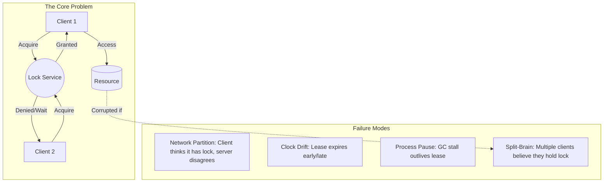
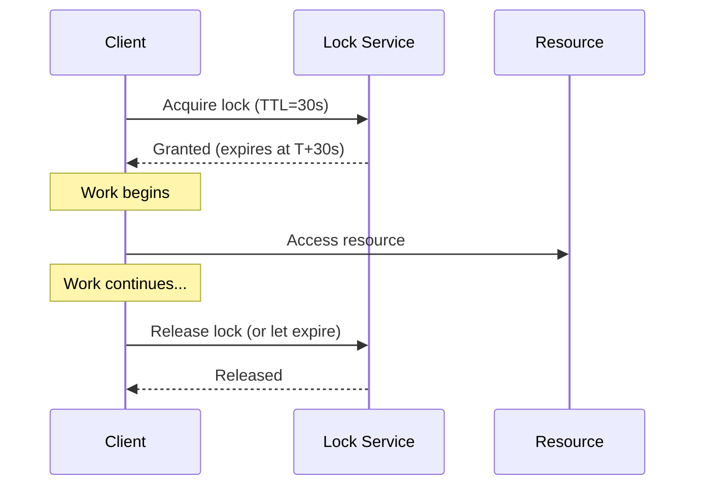
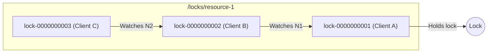
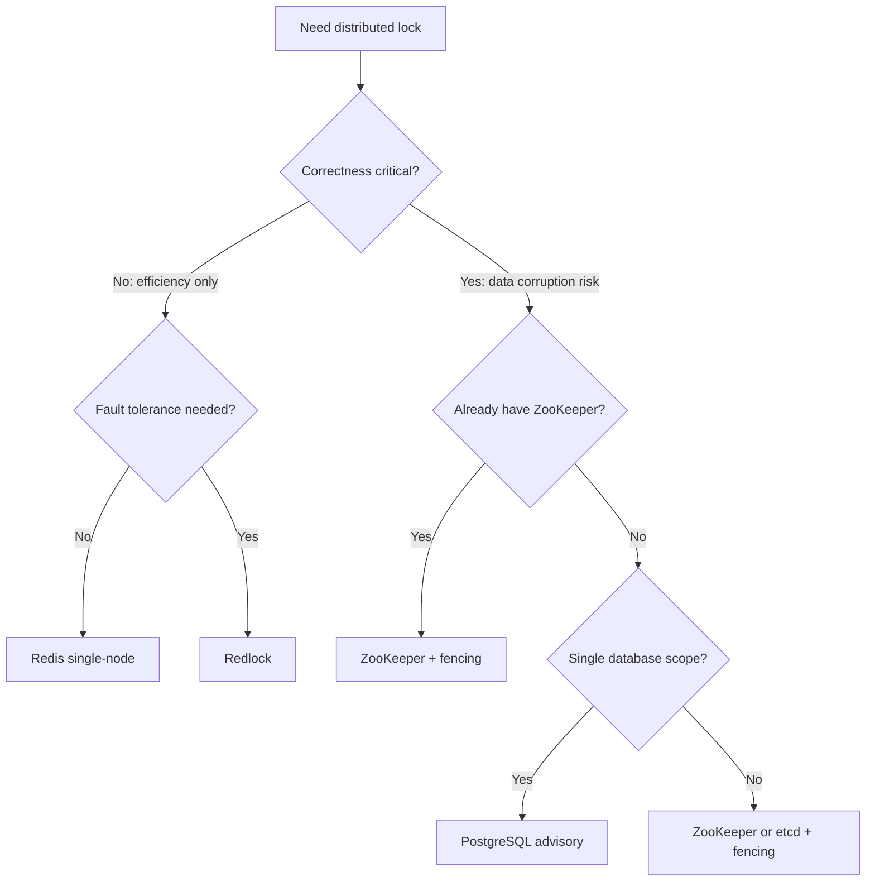
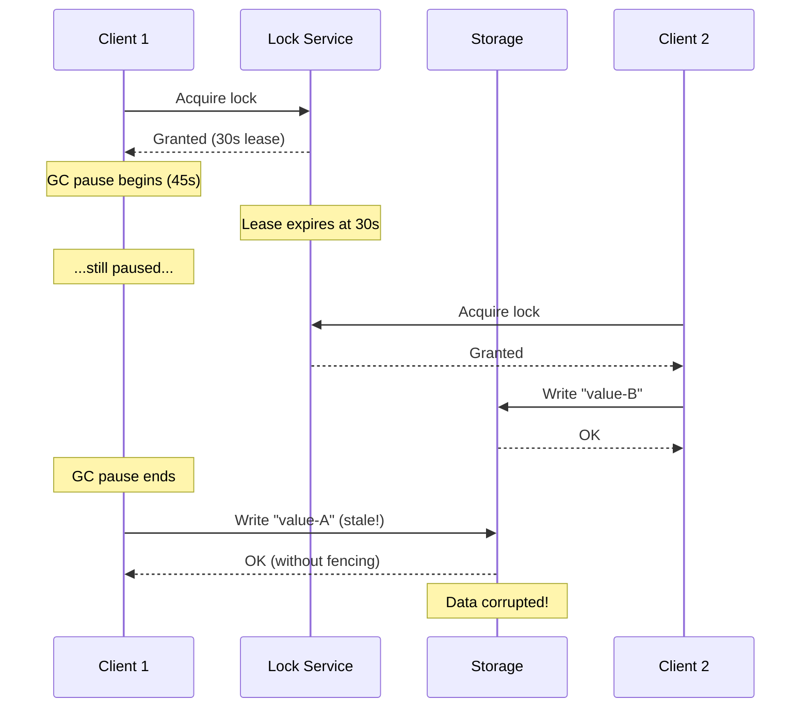
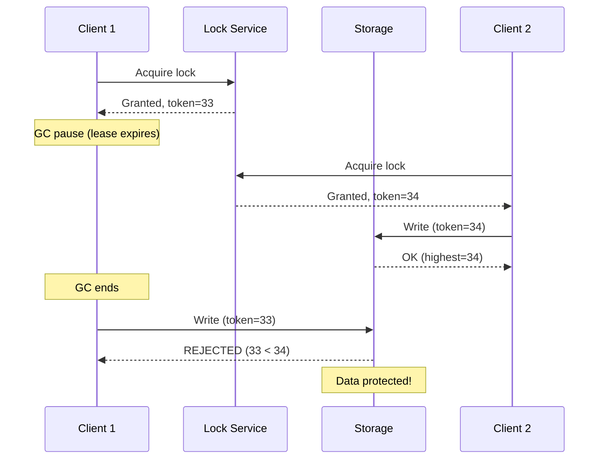
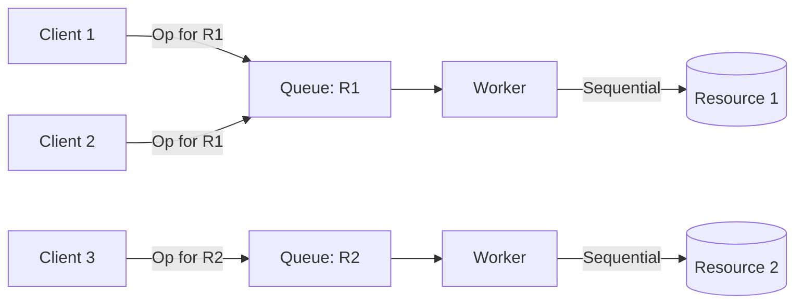

# Distributed Locking

Distributed locks coordinate access to shared resources across multiple processes or nodes. Unlike single-process mutexes, they must handle network partitions, clock drift, process pauses, and partial failures—all while providing mutual exclusion guarantees that range from "best effort" to "correctness critical."

This article covers lock implementations (Redis, ZooKeeper, etcd, Chubby), the Redlock controversy, fencing tokens, lease-based expiration, and when to avoid locks entirely.

<figure>



<figcaption>Distributed locks must handle failures that single-process locks never face—network partitions, clock drift, and process pauses can all cause multiple clients to believe they hold the same lock simultaneously.</figcaption>
</figure>

## Abstract

Distributed locking is fundamentally harder than it appears. The safety property—at most one client holds the lock at any time—requires either **consensus protocols** (ZooKeeper, etcd) or careful timing assumptions that can fail under realistic conditions (Redlock).

**Core mental model:**

- **Efficiency locks**: Prevent duplicate work. Occasional double-execution is tolerable. Redis single-node or Redlock works.
- **Correctness locks**: Protect invariants. Double-execution corrupts data. Requires consensus + fencing tokens.

**Key insight**: Most lock implementations provide **leases** (auto-expiring locks) rather than indefinite locks. Leases prevent deadlock from crashed clients but introduce the fundamental problem: **what if the lease expires while the client is still working?**

**Fencing tokens** solve this: the lock service issues a monotonically increasing token with each lock grant. The protected resource rejects operations with tokens lower than the highest it has seen. This transforms lease expiration from a safety violation into a detected-and-rejected stale operation.

**Decision framework:**

| Requirement                     | Implementation           | Trade-off                      |
| ------------------------------- | ------------------------ | ------------------------------ |
| Best-effort deduplication       | Redis single-node        | Single point of failure        |
| Efficiency with fault tolerance | Redlock (5 nodes)        | No fencing, timing assumptions |
| Correctness critical            | ZooKeeper/etcd + fencing | Operational complexity         |
| Already using PostgreSQL        | Advisory locks           | Limited to single database     |

## The Problem

### Why Naive Solutions Fail

**Approach 1: File-based locks across NFS**

```typescript
// Naive NFS lock - seems simple
async function acquireLock(path: string): Promise<boolean> {
  try {
    await fs.writeFile(path, process.pid, { flag: "wx" }) // exclusive create
    return true
  } catch {
    return false // file exists
  }
}
```

Fails because:

- **NFS semantics vary**: `O_EXCL` isn't atomic on all NFS implementations
- **No expiration**: If the process crashes, lock file persists forever
- **No fencing**: Stale lock holders can still access the resource

**Approach 2: Database row locks**

```sql
-- Lock by inserting a row
INSERT INTO locks (resource_id, holder, acquired_at)
VALUES ('resource-1', 'client-a', NOW())
ON CONFLICT DO NOTHING;
```

Fails because:

- **No automatic expiration**: Crashed clients leave orphan locks
- **Clock drift**: `acquired_at` timestamps unreliable across nodes
- **Single point of failure**: Database becomes bottleneck

**Approach 3: Redis SETNX without TTL**

```
SETNX resource:lock client-id
```

Fails because:

- **No expiration**: Crashed client locks resource forever
- **Race on release**: Client must check-then-delete atomically

### The Core Challenge

The fundamental tension: **distributed systems are asynchronous**—there are no bounded delays on message delivery, no bounded process pauses, and no bounded clock drift.

Distributed locks exist to provide **mutual exclusion** across this asynchronous environment. The challenge: you cannot distinguish a slow client from a crashed client, and you cannot trust clocks.

> "Distributed locks are not just a scaling challenge—they're a correctness challenge. The algorithm must be correct even when clocks are wrong, networks are partitioned, and processes pause unexpectedly."
> — Martin Kleppmann, "How to do distributed locking" (2016)

## Lease-Based Locking

All practical distributed locks use **leases**—time-bounded locks that expire automatically. This prevents indefinite lock holding by crashed clients.

### Core Mechanism



### TTL Selection Formula

```
MIN_VALIDITY = TTL - (T_acquire - T_start) - CLOCK_DRIFT
```

Where:

- **TTL**: Initial lease duration
- **T_acquire - T_start**: Time elapsed acquiring the lock
- **CLOCK_DRIFT**: Maximum expected clock skew between client and server

**Practical guidance:**

- **JVM applications**: TTL ≥ 60s (stop-the-world GC can pause for seconds)
- **Go/Rust applications**: TTL ≥ 30s (less GC concern, but network issues)
- **General rule**: TTL should be 10x your expected operation duration

### Clock Skew Issues

**Wall-clock danger:** Redis uses wall-clock time for TTL expiration. If the server's clock jumps forward (NTP adjustment, manual change), leases expire prematurely.

**Example failure scenario:**

1. Client acquires lock with TTL=30s at server time T
2. NTP adjusts server clock forward by 20s
3. Lock expires at "T+30s" = actual T+10s
4. Client still working; another client acquires lock
5. **Two clients now hold the "same" lock**

**Mitigation:** Use monotonic clocks where possible. Linux `clock_gettime(CLOCK_MONOTONIC)` measures elapsed time without wall-clock adjustments.

> **Prior to Redis 7.0:** TTL expiration relied entirely on wall-clock time. Redis 7.0+ uses monotonic clocks internally for some operations, but the fundamental issue remains for distributed Redlock scenarios where multiple independent clocks are involved.

## Design Paths

### Path 1: Redis Single-Node Lock

**When to choose:**

- Lock is for efficiency (prevent duplicate work), not correctness
- Single point of failure is acceptable
- Lowest latency requirement

**Implementation:**

```typescript collapse={1-2}
import { Redis } from "ioredis"

async function acquireLock(redis: Redis, resource: string, clientId: string, ttlMs: number): Promise<boolean> {
  // SET with NX (only if not exists) and PX (millisecond expiry)
  const result = await redis.set(resource, clientId, "NX", "PX", ttlMs)
  return result === "OK"
}

async function releaseLock(redis: Redis, resource: string, clientId: string): Promise<boolean> {
  // Lua script: atomic check-and-delete
  // Only delete if we still own the lock
  const script = `
    if redis.call("get", KEYS[1]) == ARGV[1] then
      return redis.call("del", KEYS[1])
    else
      return 0
    end
  `
  const result = await redis.eval(script, 1, resource, clientId)
  return result === 1
}
```

**Why the Lua script for release:** Without atomic check-and-delete, this race exists:

1. Client A's lock expires
2. Client B acquires lock
3. Client A (still thinking it has lock) calls `DEL`
4. Client A deletes Client B's lock

**Trade-offs:**

| Advantage                 | Disadvantage               |
| ------------------------- | -------------------------- |
| Simple implementation     | Single point of failure    |
| Low latency (~1ms)        | No automatic failover      |
| Well-understood semantics | Lost locks on master crash |

**Real-world:** This approach works well for rate limiting, cache stampede prevention, and other scenarios where occasional double-execution is tolerable.

### Path 2: Redlock (Multi-Node Redis)

**When to choose:**

- Need fault tolerance for efficiency locks
- Can tolerate timing assumptions
- Want Redis ecosystem (Lua scripts, familiar API)

**Algorithm (N=5 independent Redis instances):**

1. Get current time in milliseconds
2. Try to acquire lock on ALL N instances sequentially, with small timeout per instance
3. Lock is acquired if: majority (N/2 + 1) succeeded AND total elapsed time < TTL
4. Validity time = TTL - elapsed time
5. If failed, release lock on ALL instances (even those that succeeded)

```typescript collapse={1-8}
import { Redis } from "ioredis"
import { randomBytes } from "crypto"

interface RedlockResult {
  acquired: boolean
  validity: number
  value: string
}

async function redlockAcquire(instances: Redis[], resource: string, ttlMs: number): Promise<RedlockResult> {
  const value = randomBytes(20).toString("hex")
  const startTime = Date.now()
  const quorum = Math.floor(instances.length / 2) + 1

  let acquired = 0
  for (const redis of instances) {
    try {
      const result = await redis.set(resource, value, "NX", "PX", ttlMs)
      if (result === "OK") acquired++
    } catch {
      // Instance unavailable, continue
    }
  }

  const elapsed = Date.now() - startTime
  const validity = ttlMs - elapsed

  if (acquired >= quorum && validity > 0) {
    return { acquired: true, validity, value }
  }

  // Failed - release all locks
  await Promise.all(instances.map((r) => releaseLock(r, resource, value)))
  return { acquired: false, validity: 0, value }
}
```

**Critical limitation:** Redlock generates random values (20 bytes from `/dev/urandom`), not monotonically increasing tokens. **You cannot use Redlock values for fencing** because resources cannot determine which token is "newer."

**Trade-offs vs single-node:**

| Aspect            | Single-Node | Redlock (N=5)              |
| ----------------- | ----------- | -------------------------- |
| Fault tolerance   | None        | Survives N/2 failures      |
| Latency           | ~1ms        | ~5ms (sequential attempts) |
| Complexity        | Low         | Medium                     |
| Fencing support   | No          | No                         |
| Clock assumptions | Server only | All N servers + client     |

### Path 3: ZooKeeper

**When to choose:**

- Correctness-critical locks (fencing required)
- Already running ZooKeeper (Kafka, HBase ecosystem)
- Can tolerate higher latency for stronger guarantees

**Ephemeral sequential node recipe:**



**Algorithm:**

1. Client creates ephemeral sequential node under `/locks/resource`
2. Client lists all children, sorts by sequence number
3. If client's node has lowest sequence: lock acquired
4. Otherwise: set watch on the node with next-lowest sequence number
5. When watch fires: repeat step 2

**Why watch predecessor, not parent:**

- Watching parent causes **thundering herd**: all N clients wake when lock releases
- Watching predecessor: only next client wakes

**Fencing via zxid:** ZooKeeper's transaction ID (zxid) is a monotonically increasing 64-bit number. Use the zxid of your lock node as a fencing token.

```java collapse={1-6}
import org.apache.zookeeper.*;
import java.util.List;
import java.util.Collections;

public class ZkLock {
    private final ZooKeeper zk;
    private final String lockPath;
    private String myNode;

    public long acquireLock(String resource) throws Exception {
        // Create ephemeral sequential node
        myNode = zk.create(
            "/locks/" + resource + "/lock-",
            new byte[0],
            ZooDefs.Ids.OPEN_ACL_UNSAFE,
            CreateMode.EPHEMERAL_SEQUENTIAL
        );

        while (true) {
            List<String> children = zk.getChildren("/locks/" + resource, false);
            Collections.sort(children);

            String smallest = children.get(0);
            if (myNode.endsWith(smallest)) {
                // We have the lock - return zxid as fencing token
                Stat stat = zk.exists(myNode, false);
                return stat.getCzxid();
            }

            // Find predecessor and watch it
            int myIndex = children.indexOf(myNode.substring(myNode.lastIndexOf('/') + 1));
            String predecessor = children.get(myIndex - 1);

            // This blocks until predecessor is deleted
            Stat stat = zk.exists("/locks/" + resource + "/" + predecessor, true);
            if (stat != null) {
                // Wait for watch notification
                synchronized (this) { wait(); }
            }
        }
    }
}
```

**Trade-offs:**

| Advantage                           | Disadvantage                  |
| ----------------------------------- | ----------------------------- |
| Strong consistency (Zab consensus)  | Higher latency (2+ RTTs)      |
| Automatic cleanup (ephemeral nodes) | Operational complexity        |
| Fencing tokens (zxid)               | Session management overhead   |
| No clock assumptions                | Quorum unavailable = no locks |

### Path 4: etcd

**When to choose:**

- Kubernetes-native environment
- Prefer gRPC over custom protocols
- Need distributed KV store beyond just locking

**Lease-based locking:**

etcd provides first-class lease primitives. A lease is a token with a TTL; keys can be attached to leases and are automatically deleted when the lease expires.

```go collapse={1-10}
package main

import (
    "context"
    "time"
    clientv3 "go.etcd.io/etcd/client/v3"
    "go.etcd.io/etcd/client/v3/concurrency"
)

func acquireLock(client *clientv3.Client, resource string) (*concurrency.Mutex, error) {
    // Create session with 30s TTL
    session, err := concurrency.NewSession(client, concurrency.WithTTL(30))
    if err != nil {
        return nil, err
    }

    // Create mutex and acquire
    mutex := concurrency.NewMutex(session, "/locks/"+resource)
    ctx, cancel := context.WithTimeout(context.Background(), 5*time.Second)
    defer cancel()

    if err := mutex.Lock(ctx); err != nil {
        return nil, err
    }

    // Use mutex.Header().Revision as fencing token
    return mutex, nil
}
```

**Fencing via revision:** etcd assigns a globally unique, monotonically increasing revision to every modification. Use `mutex.Header().Revision` as your fencing token.

**Critical limitation (Jepsen finding):** Under network partitions, etcd locks can fail to provide mutual exclusion. Jepsen testing found ~18% loss of acknowledged updates when locks protected concurrent modifications. The root cause: etcd must sacrifice correctness to preserve liveness in asynchronous systems.

> "etcd's lock is not safe. It is possible for two processes to simultaneously hold the same lock, even in healthy clusters."
> — Kyle Kingsbury, Jepsen analysis of etcd 3.4.3 (2020)

**Trade-offs:**

| Advantage                           | Disadvantage                   |
| ----------------------------------- | ------------------------------ |
| Raft consensus (strong consistency) | Jepsen found safety violations |
| Native lease support                | Higher latency than Redis      |
| Kubernetes integration              | Operational complexity         |
| Revision-based fencing              | Quorum unavailable = no locks  |

### Path 5: Database Advisory Locks (PostgreSQL)

**When to choose:**

- Already using PostgreSQL
- Lock scope is single database
- Don't want external dependencies

**Session-level advisory locks:**

```sql
-- Acquire lock (blocks until available)
SELECT pg_advisory_lock(hashtext('resource-1'));

-- Try acquire (returns immediately)
SELECT pg_try_advisory_lock(hashtext('resource-1'));

-- Release
SELECT pg_advisory_unlock(hashtext('resource-1'));
```

**Transaction-level advisory locks:**

```sql
-- Automatically released at transaction end
SELECT pg_advisory_xact_lock(hashtext('resource-1'));

-- Then do your work within the transaction
UPDATE resources SET ... WHERE id = 'resource-1';
```

**Lock ID generation:** Advisory locks take a 64-bit integer key. Use `hashtext()` for string-based resource IDs, or encode your own scheme.

**Connection pooling danger:** Session-level locks are tied to the database connection. With connection pooling (PgBouncer), your "session" may be reused by another client, leaking locks. **Use transaction-level locks with connection pooling.**

**Trade-offs:**

| Advantage                     | Disadvantage                |
| ----------------------------- | --------------------------- |
| No external dependencies      | Single database scope       |
| ACID guarantees               | Connection pooling issues   |
| Already have PostgreSQL       | Not for multi-database      |
| Automatic transaction cleanup | Lock ID collisions possible |

### Comparison Matrix

| Factor                 | Redis Single | Redlock         | ZooKeeper    | etcd             | PostgreSQL      |
| ---------------------- | ------------ | --------------- | ------------ | ---------------- | --------------- |
| Fault tolerance        | None         | N/2 failures    | N/2 failures | N/2 failures     | Database HA     |
| Fencing tokens         | No           | No              | Yes (zxid)   | Yes (revision)   | No              |
| Latency (acquire)      | ~1ms         | ~5-10ms         | ~10-50ms     | ~10-50ms         | ~1-5ms          |
| Clock assumptions      | Yes          | Yes (all nodes) | No           | No               | No              |
| Correctness guarantee  | No           | No              | Yes          | Partial (Jepsen) | Yes (single DB) |
| Operational complexity | Low          | Medium          | High         | Medium           | Low             |

### Decision Framework



## Fencing Tokens

### The Problem They Solve

Leases expire. When they do, a "stale" lock holder may still be executing its critical section. Without fencing, this corrupts the protected resource.

**Example failure scenario:**



### How Fencing Tokens Work

1. Lock service issues **monotonically increasing token** with each grant
2. Client includes token with every operation on protected resource
3. Resource tracks **highest token ever seen**
4. Resource **rejects** operations with token < highest seen



### Implementation Pattern

**Lock service side:**

```typescript collapse={1-4}
interface LockGrant {
  token: bigint // Monotonically increasing
  expiresAt: number
}

class FencingLockService {
  private nextToken: bigint = 1n
  private locks: Map<string, { holder: string; token: bigint; expiresAt: number }> = new Map()

  acquire(resource: string, clientId: string, ttlMs: number): LockGrant | null {
    const existing = this.locks.get(resource)
    if (existing && existing.expiresAt > Date.now()) {
      return null // Lock held
    }

    const token = this.nextToken++
    const expiresAt = Date.now() + ttlMs
    this.locks.set(resource, { holder: clientId, token, expiresAt })

    return { token, expiresAt }
  }
}
```

**Resource side:**

```typescript collapse={1-6}
interface FencedWrite {
  token: bigint
  data: unknown
}

class FencedStorage {
  private highestToken: Map<string, bigint> = new Map()
  private data: Map<string, unknown> = new Map()

  write(resource: string, write: FencedWrite): boolean {
    const highest = this.highestToken.get(resource) ?? 0n

    if (write.token < highest) {
      // Stale token - reject
      return false
    }

    // Accept write, update highest seen
    this.highestToken.set(resource, write.token)
    this.data.set(resource, write.data)
    return true
  }
}
```

### Why Random Values Don't Work

Redlock uses random values (20 bytes), not ordered tokens. A resource cannot determine if `abc123` is "newer" than `xyz789`. This is why Redlock cannot provide fencing—the values lack the **ordering property** required to reject stale operations.

> "To make the lock safe with fencing, you need not just a random token, but a monotonically increasing token. And the only way to generate a monotonically increasing token is to use a consensus protocol."
> — Martin Kleppmann

### ZooKeeper zxid as Fencing Token

ZooKeeper's transaction ID (zxid) is perfect for fencing:

- **Monotonically increasing**: Every ZK transaction increments it
- **Globally ordered**: All clients see same ordering
- **Available at lock time**: `Stat.getCzxid()` returns creation zxid

```java
// When acquiring lock
Stat stat = zk.exists(myLockNode, false);
long fencingToken = stat.getCzxid();

// When accessing resource
resource.write(data, fencingToken);
```

## The Redlock Controversy

### Kleppmann's Critique (2016)

Martin Kleppmann identified fundamental problems with Redlock:

**1. Timing assumptions violated by real systems:**

Redlock assumes bounded network delay, bounded process pauses, and bounded clock drift. Real systems violate all three:

- Network packets can be delayed arbitrarily (TCP retransmits, routing changes)
- GC pauses can exceed lease TTL (observed: 1+ minutes in production JVMs)
- Clock skew can be seconds under adversarial NTP conditions

**2. No fencing capability:**

Even if Redlock worked perfectly, it generates random values, not monotonic tokens. Resources cannot reject stale operations.

**3. Clock jump scenario:**

1. Client acquires lock on 3 of 5 Redis instances
2. Clock on one instance jumps forward (NTP sync)
3. Lock expires prematurely on that instance
4. Another client acquires on 3 instances (the jumped one + 2 others)
5. **Two clients now hold majority**

### Antirez's Response

Salvatore Sanfilippo (Redis creator) responded:

**1. Random values + CAS = sufficient:**

> "The token is a random string. If you use check-and-set (CAS), you can use the random string to ensure that only the lock owner can modify the resource."

**2. Post-acquisition time check:**

Redlock spec includes checking elapsed time after acquisition. If elapsed > TTL, the lock is considered invalid. This allegedly handles delayed responses.

**3. Monotonic clocks:**

Proposed using `CLOCK_MONOTONIC` instead of wall clocks to eliminate clock jump issues.

### The Verdict

Neither argument is fully satisfying:

| Kleppmann's points       | Antirez's counterpoints      | Reality                                                             |
| ------------------------ | ---------------------------- | ------------------------------------------------------------------- |
| GC pauses violate timing | Post-acquisition check helps | Pauses can happen _during_ resource access, not just during acquire |
| No fencing possible      | Random + CAS works           | CAS requires resource to store lock value; not always feasible      |
| Clock jumps break safety | Use monotonic clocks         | Cross-machine monotonic clocks don't exist                          |

**Practical guidance:**

- **Efficiency locks**: Redlock is acceptable. Double-execution is annoying but not catastrophic.
- **Correctness locks**: Use consensus-based systems (ZooKeeper) with fencing tokens. Redlock's random values cannot fence.

## Production Implementations

### Google Chubby: The Original

**Context:** Internal distributed lock service powering GFS, BigTable, and other Google infrastructure. Open-sourced concept inspired ZooKeeper.

**Architecture:**

- 5-replica Paxos cluster
- Replicas elect master using Paxos; master lease is several seconds
- Client sessions with grace periods (45s default)
- Files + locks (locks are files with special semantics)

**Key design decisions:**

- **Coarse-grained locks**: Designed for locks held minutes to hours, not milliseconds
- **Advisory locks by default**: Files don't prevent access without explicit lock checks
- **Master lease renewal**: Master doesn't lose leadership on brief network blips
- **Client grace period**: On leader change, clients have 45s to reconnect before session (and locks) invalidate

**Fencing mechanism:** Chubby supports sequencers (fencing tokens). The lock service hands out sequencers; resources can verify them with Chubby before accepting writes.

> "If a process's lease has expired, the lock server will refuse to validate the sequencer."
> — Mike Burrows, "The Chubby Lock Service" (2006)

**Scale:** Chubby is not designed for high-frequency locking. It's optimized for reliability of infrequent operations, not throughput.

### Uber: Driver Assignment

**Context:** When a rider requests a cab, multiple nearby drivers could be assigned. Exactly one driver must be assigned per ride.

**Problem:**

- Multiple matching service instances receive the same request
- Race condition: both try to assign the same driver
- Result: driver assigned to multiple rides, customer experience failure

**Solution:**

- Distributed lock on `driver:{driver_id}` before assignment
- Lock held only during assignment operation (~10-100ms)
- Redis-based (likely Redlock or single-node with replication)

**Why it works:** This is an efficiency lock. If two services somehow both assign the same driver (lock failure), the booking system downstream rejects the duplicate. Occasional failures are detected and handled.

### Netflix: Job Deduplication

**Context:** Millions of distributed jobs, some triggered by events that may arrive multiple times.

**Problem:**

- Event arrives at multiple consumer instances
- Same job should execute exactly once
- Idempotency alone doesn't help if job has side effects

**Solution approach:**

- Acquire lock before processing event
- Lock key: `job:{event_id}:{job_type}`
- TTL: Expected job duration + buffer
- Combined with idempotency keys in downstream services

**Insight:** Netflix uses a layered approach—locks provide first-line deduplication, idempotent operations provide safety net, and monitoring detects drift.

### Implementation Comparison

| Aspect    | Google Chubby              | Uber                       | Netflix                    |
| --------- | -------------------------- | -------------------------- | -------------------------- |
| Lock type | Correctness                | Efficiency                 | Efficiency                 |
| Duration  | Minutes-hours              | Milliseconds               | Seconds                    |
| Backend   | Paxos (custom)             | Redis                      | Redis/ZK hybrid            |
| Fencing   | Sequencers                 | Downstream checks          | Idempotency keys           |
| Scale     | Low freq, high reliability | High freq, acceptable loss | High freq, acceptable loss |

## Lock-Free Alternatives

### When to Avoid Locks Entirely

Distributed locks add complexity and failure modes. Before reaching for a lock, consider:

**1. Idempotent operations:**

If your operation can safely execute multiple times with the same result, you don't need a lock.

```typescript
// Bad: non-idempotent
async function incrementCounter(id: string) {
  const current = await db.get(id)
  await db.set(id, current + 1)
}

// Good: idempotent with versioning
async function setCounterIfMatch(id: string, expectedVersion: number, newValue: number) {
  await db
    .update(id)
    .where("version", expectedVersion)
    .set({ value: newValue, version: expectedVersion + 1 })
}
```

**2. Compare-and-Swap (CAS):**

Many databases support atomic CAS. Use it instead of external locks.

```sql
-- CAS-based update
UPDATE resources
SET value = 'new-value', version = version + 1
WHERE id = 'resource-1' AND version = 42;

-- Check rows affected - if 0, retry with fresh version
```

**3. Optimistic concurrency:**

Assume no conflicts; detect and retry on collision.

```typescript collapse={1-6}
interface VersionedResource {
  data: unknown
  version: number
}

async function optimisticUpdate(id: string, transform: (data: unknown) => unknown) {
  while (true) {
    const resource = await db.get(id)
    const newData = transform(resource.data)

    const updated = await db.update(id, {
      data: newData,
      version: resource.version + 1,
      _where: { version: resource.version },
    })

    if (updated) return // Success
    // Version conflict - retry
  }
}
```

**4. Queue-based serialization:**

Route all operations for a resource to a single queue/partition.



This eliminates concurrent access by design.

### Decision: Lock vs Lock-Free

| Factor                  | Use Distributed Lock         | Use Lock-Free                    |
| ----------------------- | ---------------------------- | -------------------------------- |
| Operation complexity    | Multi-step, non-decomposable | Single atomic operation          |
| Conflict frequency      | Rare                         | Frequent (CAS retries expensive) |
| Side effects            | External (can't retry)       | Local (can retry)                |
| Existing infrastructure | Lock service available       | Database has CAS                 |
| Team expertise          | Lock patterns understood     | Lock-free patterns understood    |

## Common Pitfalls

### 1. Holding Locks Across Async Boundaries

**The mistake:** Acquiring lock, then making RPC calls or doing I/O while holding it.

```typescript
// Dangerous: lock held during external call
const lock = await acquireLock(resource)
const data = await externalService.fetch() // Network call!
await db.update(resource, data)
await releaseLock(lock)
```

**What goes wrong:**

- External call takes 10s; lock TTL is 5s
- Lock expires while you're still working
- Another client acquires and corrupts data

**Solution:** Minimize lock scope. Fetch data first, then lock-update-unlock quickly.

```typescript
// Better: minimize lock duration
const data = await externalService.fetch()

const lock = await acquireLock(resource)
await db.update(resource, data)
await releaseLock(lock)
```

### 2. Ignoring Lock Acquisition Failure

**The mistake:** Assuming lock acquisition always succeeds.

```typescript
// Dangerous: no failure handling
await acquireLock(resource)
await criticalOperation()
await releaseLock(resource)
```

**What goes wrong:**

- Lock service unavailable → operation proceeds without lock
- Lock contention → silent failure, concurrent access

**Solution:** Always check acquisition result and handle failure.

```typescript
const acquired = await acquireLock(resource)
if (!acquired) {
  throw new Error("Failed to acquire lock - cannot proceed")
}
try {
  await criticalOperation()
} finally {
  await releaseLock(resource)
}
```

### 3. Lock-Release Race with TTL

**The mistake:** Releasing a lock you no longer own (it expired and was re-acquired).

```typescript
// Dangerous: release without ownership check
await lock.release() // May delete another client's lock!
```

**What goes wrong:**

1. Your lock expires due to slow operation
2. Another client acquires the lock
3. Your `release()` deletes their lock
4. Third client acquires, now two clients think they have it

**Solution:** Atomic release that checks ownership (shown in Redis Lua script earlier).

### 4. Thundering Herd on Lock Release

**The mistake:** All waiting clients wake simultaneously when lock releases.

**What goes wrong with ZooKeeper naive implementation:**

- 1000 clients watch `/locks/resource` parent node
- Lock releases, all 1000 receive watch notification
- All 1000 call `getChildren()` simultaneously
- ZooKeeper overloaded, lock acquisition stalls

**Solution:** Watch predecessor only (shown in ZooKeeper recipe earlier). Only one client wakes per release.

### 5. Missing Fencing on Correctness-Critical Locks

**The mistake:** Using Redlock (or any lease-based lock) without fencing for correctness-critical operations.

```typescript
// Dangerous: no fencing
const lock = await redlock.acquire(resource)
await storage.write(data) // Stale lock holder can overwrite!
await redlock.release(lock)
```

**Solution:** Either use a lock service with fencing tokens (ZooKeeper) or accept that this lock is efficiency-only.

### 6. Session-Level Locks with Connection Pooling

**The mistake:** Using PostgreSQL session-level advisory locks with PgBouncer.

```sql
-- Acquired by connection in pool
SELECT pg_advisory_lock(12345);
-- Connection returned to pool
-- Other client reuses connection
-- Lock is still held by "other" client!
```

**Solution:** Use transaction-level locks with pooling.

```sql
BEGIN;
SELECT pg_advisory_xact_lock(12345);
-- Do work
COMMIT; -- Lock automatically released
```

## Conclusion

Distributed locking is a coordination primitive that requires careful consideration of failure modes, timing assumptions, and fencing requirements.

**Key decisions:**

1. **Efficiency vs correctness:** Most locks are for efficiency (preventing duplicate work). These can use simpler implementations with known failure modes. Correctness-critical locks require consensus protocols and fencing.

2. **Fencing is non-negotiable for correctness:** Without fencing tokens, lease expiration during long operations corrupts data. Random lock values (Redlock) cannot fence.

3. **Timing assumptions are dangerous:** Redlock's safety depends on bounded network delays, process pauses, and clock drift. Real systems violate all three.

4. **Consider lock-free alternatives:** Idempotent operations, CAS, optimistic concurrency, and queue-based serialization often work better than distributed locks.

**Start simple:** Single-node Redis locks work for most efficiency scenarios. Graduate to ZooKeeper with fencing only when correctness is critical and you understand the operational cost.

## Appendix

### Prerequisites

- Distributed systems fundamentals (network partitions, consensus)
- CAP theorem and consistency models
- Basic understanding of lease-based coordination

### Terminology

| Term               | Definition                                                                        |
| ------------------ | --------------------------------------------------------------------------------- |
| **Lease**          | Time-bounded lock that expires automatically                                      |
| **Fencing token**  | Monotonically increasing identifier that resources use to reject stale operations |
| **TTL**            | Time-To-Live; duration before lease expires                                       |
| **Quorum**         | Majority of nodes (N/2 + 1) required for consensus                                |
| **Split-brain**    | Network partition where multiple partitions believe they are authoritative        |
| **zxid**           | ZooKeeper transaction ID; monotonically increasing, usable as fencing token       |
| **Advisory lock**  | Lock that doesn't prevent access—just signals intention                           |
| **Ephemeral node** | ZooKeeper node that is automatically deleted when the client session ends         |

### Summary

- Distributed locks are **harder than they appear**—network partitions, clock drift, and process pauses all cause multiple clients to believe they hold the same lock
- **Leases** (auto-expiring locks) prevent deadlock but introduce the lease-expiration-during-work problem
- **Fencing tokens** solve this by having the resource reject operations from stale lock holders
- **Redlock** provides fault-tolerant efficiency locks but **cannot fence** (random values lack ordering)
- **ZooKeeper/etcd** provide fencing tokens (zxid/revision) but add operational complexity
- **Lock-free alternatives** (CAS, idempotency, queues) often work better than distributed locks
- For **correctness-critical** locks: use consensus + fencing; for **efficiency** locks: Redis single-node is often sufficient

### References

**Foundational:**

- [How to do distributed locking](https://martin.kleppmann.com/2016/02/08/how-to-do-distributed-locking.html) - Martin Kleppmann's analysis of Redlock.
- [Is Redlock safe?](https://antirez.com/news/101) - Salvatore Sanfilippo's response.
- [The Chubby Lock Service for Loosely-Coupled Distributed Systems](https://research.google/pubs/the-chubby-lock-service-for-loosely-coupled-distributed-systems/) - Mike Burrows, OSDI 2006.

**Implementation Documentation:**

- [Redis Distributed Locks](https://redis.io/docs/latest/develop/clients/patterns/distributed-locks/) - Official Redis distributed lock documentation.
- [ZooKeeper Recipes and Solutions](https://zookeeper.apache.org/doc/current/recipes.html) - Official ZooKeeper lock recipe.
- [etcd Concurrency API](https://etcd.io/docs/v3.5/dev-guide/api_concurrency_ref/) - etcd lease and lock APIs.
- [PostgreSQL Advisory Locks](https://www.postgresql.org/docs/current/explicit-locking.html#ADVISORY-LOCKS) - PostgreSQL documentation.

**Testing and Analysis:**

- [Jepsen: etcd 3.4.3](https://jepsen.io/analyses/etcd-3.4.3) - Kyle Kingsbury's analysis finding safety violations in etcd locks.
- [Designing Data-Intensive Applications](https://dataintensive.net/) - Martin Kleppmann. Chapter 8 covers distributed coordination.

**Libraries:**

- [Redisson](https://redisson.org/) - Redis Java client with distributed locks.
- [node-redlock](https://github.com/mike-marcacci/node-redlock) - Redlock implementation for Node.js.
- [Curator](https://curator.apache.org/) - ZooKeeper recipes including distributed locks.
