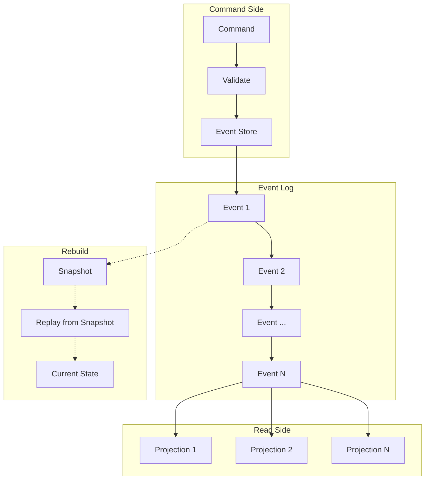
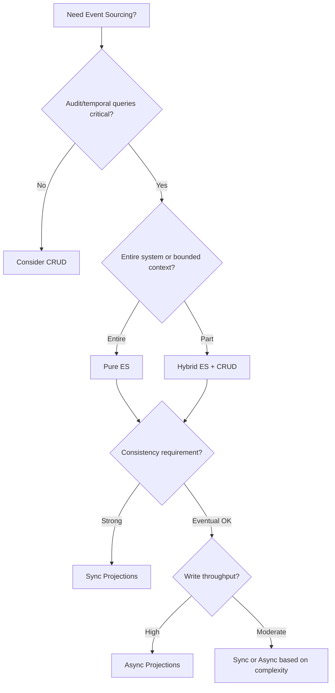

# Event Sourcing

A deep-dive into event sourcing: understanding the core pattern, implementation variants, snapshot strategies, schema evolution, and production trade-offs across different architectures.

<figure>



<figcaption>Event sourcing architecture: commands produce events stored immutably; projections derive read models; state rebuilt by replaying events from snapshots.</figcaption>
</figure>

## Abstract

Event sourcing stores application state as a sequence of immutable events rather than current state. The core insight: **events are facts that happened—they cannot be deleted or modified, only appended**. State is derived by replaying events (a "left fold" over the event stream).

Key mental model:

- **Write path**: Commands → Validation → Event(s) → Append to stream
- **Read path**: Subscribe to events → Project into read-optimized models
- **Recovery**: Snapshot + Replay events since snapshot = Current state

Design decisions after choosing event sourcing:

1. **Stream granularity**: Per-aggregate (common) vs shared streams (rare)
2. **Projection strategy**: Synchronous (strong consistency) vs async (eventual)
3. **Snapshot policy**: Event-count vs time-based vs state-triggered
4. **Schema evolution**: Upcasting (transform on read) vs stream transformation (migrate data)

Event sourcing is not CQRS (Command Query Responsibility Segregation), but with event sourcing you must use CQRS—reads come from projections, not the event store.

## The Problem

### Why Naive Solutions Fail

**Approach 1: Mutable state in a database (CRUD)**

- **Fails because**: Current state overwrites history. You cannot answer "what was the balance at 3pm yesterday?" without separate audit logging.
- **Example**: A bank account shows $500. A customer disputes a charge. Without event history, proving what transactions occurred requires mining application logs—if they exist.

**Approach 2: Adding audit tables alongside CRUD**

- **Fails because**: Audit tables and current state can diverge. The audit is a second-class citizen—queries hit current state, audits are bolted on.
- **Example**: A bug updates the balance without writing to the audit table. Now the audit and state disagree. Which is correct?

**Approach 3: Database triggers for audit logging**

- **Fails because**: Triggers capture "what changed," not "why it changed." You see "balance changed from 600 to 500" but not "customer withdrew $100 at ATM #4421."
- **Example**: Debugging why an order was cancelled. Trigger logs show "status changed to CANCELLED" but not "cancelled by customer due to shipping delay."

### The Core Challenge

The fundamental tension: **optimized writes vs queryable history**. CRUD optimizes for writes (overwrite current state) but sacrifices history. Audit logging preserves history but creates dual-write complexity and semantic loss.

Event sourcing exists to make **events the single source of truth**—current state becomes a derived view that can be rebuilt at any time.

## Pattern Overview

### Core Mechanism

Every state change is captured as an immutable event appended to an event stream. Current state is derived by replaying events from the beginning (or from a snapshot).

From Martin Fowler's foundational definition:

> "Capture all changes to an application state as a sequence of events."

Events are structured facts:

```typescript collapse={1-3}
// Event structure
interface DomainEvent {
  eventId: string // Unique identifier
  streamId: string // Aggregate this event belongs to
  eventType: string // e.g., "OrderPlaced", "ItemAdded"
  data: unknown // Event-specific payload
  metadata: {
    timestamp: Date
    version: number // Position in stream
    causationId?: string // What caused this event
    correlationId?: string // Request/saga identifier
  }
}
```

State reconstruction follows a deterministic left-fold:

```
currentState = events.reduce(applyEvent, initialState)
```

### Key Invariants

1. **Append-only**: Events are never updated or deleted. The event store is an immutable log.
2. **Deterministic replay**: Given the same events in the same order, replay produces identical state.
3. **Event ordering**: Events within a stream are totally ordered by version number.
4. **Idempotent projections**: Projections must handle duplicate event delivery gracefully.

### Failure Modes

| Failure                          | Impact                                                | Mitigation                                          |
| -------------------------------- | ----------------------------------------------------- | --------------------------------------------------- |
| Event store unavailable          | Commands blocked; reads from projections may continue | Multi-region replication; read replicas             |
| Projection lag                   | Stale read models                                     | Monitor lag; circuit breaker on staleness threshold |
| Event schema mismatch            | Projection crashes or produces incorrect state        | Schema registry; upcasting; versioned projections   |
| Unbounded event growth           | Replay becomes prohibitively slow                     | Snapshots; event archival to cold storage           |
| Concurrent writes to same stream | Optimistic concurrency violation                      | Retry with conflict resolution; smaller aggregates  |

## Design Paths

### Path 1: Pure Event Sourcing

**When to choose this path:**

- Audit trail is a regulatory requirement (finance, healthcare)
- Temporal queries are core functionality ("what was the state on date X?")
- Domain naturally expresses state changes as events
- You need to rebuild projections for new query patterns

**Key characteristics:**

- Events are the **only** source of truth
- All read models are projections derived from events
- No direct database writes outside the event store
- State can be fully rebuilt from events at any time

**Implementation approach:**

```typescript collapse={1-5, 15-25}
// Pure event sourcing: aggregate loaded from events
interface Aggregate<TState, TEvent> {
  state: TState
  version: number
}

// Command handler pattern
async function handle<TState, TEvent>(
  command: Command,
  loadAggregate: (id: string) => Promise<Aggregate<TState, TEvent>>,
  decide: (state: TState, command: Command) => TEvent[],
  appendEvents: (streamId: string, expectedVersion: number, events: TEvent[]) => Promise<void>,
): Promise<void> {
  const aggregate = await loadAggregate(command.aggregateId)
  const newEvents = decide(aggregate.state, command)
  await appendEvents(command.aggregateId, aggregate.version, newEvents)
}

// Loading aggregate from event store
async function loadAggregate<TState, TEvent>(
  streamId: string,
  eventStore: EventStore,
  evolve: (state: TState, event: TEvent) => TState,
  initialState: TState,
): Promise<Aggregate<TState, TEvent>> {
  const events = await eventStore.readStream(streamId)
  const state = events.reduce(evolve, initialState)
  return { state, version: events.length }
}
```

**Real-world example:**

LMAX Exchange processes 6 million orders per second using pure event sourcing. Their Business Logic Processor runs entirely in-memory, single-threaded. Events are the recovery mechanism—on restart, they replay from last snapshot plus subsequent events to reconstruct state in milliseconds.

Key implementation details:

- Ring buffer (Disruptor) handles I/O concurrency: 20 million slots for input
- Latency: sub-50 nanosecond event processing (mean latency 3 orders of magnitude below queue-based approaches)
- Nightly snapshots; BLP restarts every night with zero downtime via replication

**Trade-offs vs other paths:**

| Aspect                  | Pure Event Sourcing              | Hybrid (ES + CRUD)                          |
| ----------------------- | -------------------------------- | ------------------------------------------- |
| Audit completeness      | Full history guaranteed          | Partial—only ES domains audited             |
| Query flexibility       | Build any projection from events | Some data may not be projectable            |
| Complexity              | Higher—must project all reads    | Lower—CRUD for simple domains               |
| Migration cost          | Very high (all-or-nothing)       | Incremental                                 |
| Team expertise required | Event-driven thinking throughout | Can isolate ES to specific bounded contexts |

### Path 2: Hybrid Event Sourcing (ES + CRUD)

**When to choose this path:**

- Some domains require audit trails; others don't
- Team has mixed experience with event-driven architecture
- Migrating from existing CRUD system incrementally
- Read-heavy workloads where projection lag is unacceptable for some data

**Key characteristics:**

- Core business domains use event sourcing (orders, transactions, inventory)
- Supporting domains use CRUD (user preferences, product catalog)
- Clear boundaries between ES and CRUD contexts
- Events may be published from CRUD systems for integration

**Implementation approach:**

```typescript collapse={1-3}
// Hybrid: Event-sourced orders, CRUD product catalog

// Order aggregate (event-sourced)
class OrderAggregate {
  apply(event: OrderEvent): void {
    switch (event.type) {
      case "OrderPlaced":
        this.status = "placed"
        this.items = event.data.items
        break
      case "OrderShipped":
        this.status = "shipped"
        break
    }
  }
}

// Product service (CRUD with event publishing)
class ProductService {
  async updatePrice(productId: string, newPrice: number): Promise<void> {
    // CRUD update
    await this.db.products.update(productId, { price: newPrice })
    // Publish event for downstream consumers (not source of truth)
    await this.eventBus.publish({ type: "PriceUpdated", productId, newPrice })
  }
}
```

**Real-world example:**

Walmart's Inventory Availability System uses hybrid event sourcing. The inventory domain is fully event-sourced to track every stock movement. Product catalog data (descriptions, images) remains in traditional databases. Events from inventory updates feed projections that power real-time availability queries for millions of customers.

Key details:

- Events partitioned by product-node ID for scalability
- Command processor validates business rules before event emission
- Read and write sides use different tech stacks, scaled independently

**Trade-offs vs pure ES:**

| Aspect                 | Hybrid                                      | Pure ES                           |
| ---------------------- | ------------------------------------------- | --------------------------------- |
| Migration path         | Gradual, bounded context by context         | Big-bang or strangler pattern     |
| Team adoption          | Easier—ES expertise not required everywhere | Requires organization-wide buy-in |
| Consistency            | Mixed—ES domains eventual, CRUD immediate   | Eventual consistency throughout   |
| Operational complexity | Higher—two paradigms to operate             | Single paradigm (but complex)     |

### Path 3: Event Sourcing with Synchronous Projections

**When to choose this path:**

- Strong consistency between writes and reads required
- Projection latency is unacceptable
- Lower throughput acceptable for consistency guarantee
- Single-node or low-scale deployments

**Key characteristics:**

- Projections updated in same transaction as event append
- Read model immediately reflects write
- No eventual consistency concerns
- Limited scalability—projection work blocks command processing

**Implementation approach:**

```typescript collapse={1-2, 18-22}
// Synchronous projection: update read model in same transaction
async function handleCommand(command: PlaceOrderCommand): Promise<void> {
  await db.transaction(async (tx) => {
    // 1. Load aggregate
    const order = await loadFromEvents(tx, command.orderId)

    // 2. Execute business logic
    const events = order.place(command.items)

    // 3. Append events
    await appendEvents(tx, command.orderId, events)

    // 4. Update projection synchronously
    for (const event of events) {
      await updateOrderListProjection(tx, event)
      await updateInventoryProjection(tx, event)
    }
  })
  // Transaction commits: events + projections atomically
}
```

**Real-world example:**

Marten (for .NET/PostgreSQL) supports inline projections that run within the same database transaction as event appends. This guarantees that when a command succeeds, the read model is immediately consistent.

From Marten documentation: inline projections are "run as part of the same transaction as the events being captured and updated in the underlying database as well."

**Trade-offs:**

| Aspect            | Synchronous Projections                 | Async Projections                    |
| ----------------- | --------------------------------------- | ------------------------------------ |
| Consistency       | Strong—reads reflect writes immediately | Eventual—lag between write and read  |
| Throughput        | Lower—projection work blocks writes     | Higher—writes return without waiting |
| Scalability       | Limited by projection cost              | Projections scale independently      |
| Failure isolation | Projection failure fails the write      | Write succeeds; projection can retry |

### Path 4: Event Sourcing with Asynchronous Projections

**When to choose this path:**

- High write throughput required
- Eventual consistency acceptable
- Projections are expensive (aggregations, joins)
- Need to scale reads independently of writes

**Key characteristics:**

- Events appended to store; command returns immediately
- Background processes subscribe to event streams
- Projections catch up asynchronously
- Must handle out-of-order delivery, duplicates, and lag

**Implementation approach:**

```typescript collapse={1-4, 20-28}
// Async projection with checkpointing
interface ProjectionState {
  lastProcessedPosition: number
  // projection-specific state
}

async function runProjection(
  subscription: EventSubscription,
  project: (state: ProjectionState, event: DomainEvent) => ProjectionState,
  checkpoint: (position: number) => Promise<void>,
): Promise<void> {
  let state = await loadProjectionState()

  for await (const event of subscription.fromPosition(state.lastProcessedPosition)) {
    state = project(state, event)

    // Checkpoint periodically (not every event—batching for performance)
    if (event.position % 100 === 0) {
      await checkpoint(event.position)
    }
  }
}

// Idempotent projection handling duplicates
function projectOrderPlaced(state: OrderListState, event: OrderPlacedEvent): OrderListState {
  // Skip if already processed (idempotency)
  if (state.processedEventIds.has(event.eventId)) {
    return state
  }

  return {
    ...state,
    orders: [...state.orders, { id: event.data.orderId, status: "placed" }],
    processedEventIds: state.processedEventIds.add(event.eventId),
  }
}
```

**Real-world example:**

Netflix's Downloads feature (launched November 2016) uses Cassandra-backed event sourcing with async projections. The team built this in six months, transforming from a stateless to stateful service.

Key implementation details:

- Three components: Event Store, Aggregate Repository, Aggregate Service
- Projections rebuild on-demand for debugging
- Horizontal scaling limited only by disk space

**Trade-offs:**

| Aspect            | Async Projections                          | Sync Projections                    |
| ----------------- | ------------------------------------------ | ----------------------------------- |
| Write latency     | Low—return immediately                     | Higher—wait for projections         |
| Read freshness    | Eventual (seconds to minutes lag)          | Immediate                           |
| Failure isolation | Yes—projection failures don't block writes | No—projection failure fails command |
| Complexity        | Higher—handle duplicates, ordering, lag    | Lower—transactional guarantees      |

### Decision Framework



## Snapshot Strategies

Replaying thousands of events for every command becomes prohibitive. Snapshots store materialized state at a point in time, enabling replay from snapshot + recent events.

### When to Snapshot

From the EventStoreDB team: "Do not add snapshots right away. They are not needed at the beginning."

Add snapshots when:

- Aggregate event counts exceed hundreds (measure first)
- Load times impact user experience or SLAs
- Cold start times are unacceptable

### Snapshot Approaches

| Strategy            | Trigger                                      | Pros                            | Cons                                    |
| ------------------- | -------------------------------------------- | ------------------------------- | --------------------------------------- |
| **Event-count**     | Every N events (e.g., 100)                   | Predictable load times          | May snapshot unnecessarily              |
| **Time-based**      | Every N hours/days                           | Operational simplicity          | Variable event counts between snapshots |
| **State-triggered** | On significant transitions (draft→published) | Snapshots at natural boundaries | Requires domain knowledge               |
| **On-demand**       | When load time exceeds threshold             | Only when needed                | First slow load before snapshot exists  |

### Implementation

```typescript collapse={1-5, 22-30}
// Snapshot-aware aggregate loading
interface Snapshot<TState> {
  state: TState
  version: number
  schemaVersion: number // For schema evolution
}

async function loadWithSnapshot<TState, TEvent>(
  streamId: string,
  eventStore: EventStore,
  snapshotStore: SnapshotStore,
  evolve: (state: TState, event: TEvent) => TState,
  initialState: TState,
): Promise<{ state: TState; version: number }> {
  // Try loading snapshot first
  const snapshot = await snapshotStore.load<TState>(streamId)

  const startVersion = snapshot?.version ?? 0
  const startState = snapshot?.state ?? initialState

  // Replay only events after snapshot
  const events = await eventStore.readStream(streamId, { fromVersion: startVersion + 1 })
  const state = events.reduce(evolve, startState)

  return { state, version: startVersion + events.length }
}

// Snapshot after command if threshold exceeded
async function maybeSnapshot<TState>(
  streamId: string,
  state: TState,
  version: number,
  snapshotStore: SnapshotStore,
  threshold: number = 100,
): Promise<void> {
  const lastSnapshot = await snapshotStore.getVersion(streamId)
  if (version - lastSnapshot > threshold) {
    await snapshotStore.save(streamId, { state, version, schemaVersion: 1 })
  }
}
```

### Schema Evolution for Snapshots

When snapshot schema changes:

1. Increment `schemaVersion` in new snapshots
2. On load, check `schemaVersion`
3. If outdated, discard snapshot and rebuild from events

This is simpler than migrating snapshots—events are the source of truth; snapshots are ephemeral optimization.

## Event Schema Evolution

Events are immutable and stored forever. Schema changes must be backward-compatible or handled via transformation.

### Core Principle

From Greg Young (EventStoreDB creator):

> "A new version of an event must be convertible from the old version. If not, it is not a new version but a new event."

### Evolution Strategies

#### Strategy 1: Additive Changes (Preferred)

Add optional fields; never remove or rename.

```typescript collapse={1-3}
// Version 1
interface OrderPlacedV1 {
  orderId: string
  customerId: string
  items: OrderItem[]
}

// Version 2: Added optional field
interface OrderPlacedV2 {
  orderId: string
  customerId: string
  items: OrderItem[]
  discountCode?: string // New optional field
}

// Projection handles both
function projectOrder(event: OrderPlacedV1 | OrderPlacedV2): Order {
  return {
    id: event.orderId,
    customerId: event.customerId,
    items: event.items,
    discountCode: "discountCode" in event ? event.discountCode : undefined,
  }
}
```

#### Strategy 2: Upcasting (Transform on Read)

Transform old events to new schema when reading.

```typescript collapse={1-4, 18-22}
// Upcaster transforms old schema to current schema
type Upcaster<TOld, TNew> = (old: TOld) => TNew

const orderPlacedUpcasters: Map<number, Upcaster<unknown, OrderPlacedV3>> = new Map([
  [
    1,
    (v1: OrderPlacedV1) => ({
      ...v1,
      discountCode: undefined,
      source: "unknown", // Default for old events
    }),
  ],
  [
    2,
    (v2: OrderPlacedV2) => ({
      ...v2,
      source: "unknown",
    }),
  ],
])

function upcast(event: StoredEvent): DomainEvent {
  const upcaster = orderPlacedUpcasters.get(event.schemaVersion)
  return upcaster ? upcaster(event.data) : event.data
}
```

**When to use**: Schema changes are frequent; you want projections to only handle the latest version.

**Trade-off**: CPU cost on every read; upcaster chain grows over time.

#### Strategy 3: Stream Transformation (Migrate Data)

Rewrite the event stream with transformed events during a release window.

**When to use**: Breaking changes that upcasting cannot handle; reducing technical debt from long upcaster chains.

**Trade-off**: Requires downtime or careful blue-green deployment; must preserve event IDs and ordering.

**Warning from Greg Young**: "Updating an existing event can cause large problems." Prefer stream transformations (copy with transform) over in-place modification.

### Schema Registry

For production systems, use a schema registry:

- Store event schemas with versions
- Validate events against schema on write
- Reject events that don't conform
- Generate types from schemas (Avro, Protobuf, JSON Schema)

## Projections and Read Models

Projections transform event streams into query-optimized read models.

### Projection Lifecycle (Marten Model)

| Type       | Execution                  | Consistency     | Use Case                              |
| ---------- | -------------------------- | --------------- | ------------------------------------- |
| **Inline** | Same transaction as events | Strong          | Critical reads; simple projections    |
| **Async**  | Background process         | Eventual        | Complex aggregations; high throughput |
| **Live**   | On-demand, not persisted   | None (computed) | One-time analytics; debugging         |

### Building Projections

```typescript collapse={1-6}
// Projection as left-fold over events
interface Projection<TState> {
  initialState: TState
  apply: (state: TState, event: DomainEvent) => TState
}

// Order list projection for dashboard
const orderListProjection: Projection<OrderListState> = {
  initialState: { orders: [], totalRevenue: 0 },

  apply(state, event) {
    switch (event.type) {
      case "OrderPlaced":
        return {
          ...state,
          orders: [...state.orders, { id: event.data.orderId, status: "placed", total: event.data.total }],
          totalRevenue: state.totalRevenue + event.data.total,
        }
      case "OrderShipped":
        return {
          ...state,
          orders: state.orders.map((o) => (o.id === event.data.orderId ? { ...o, status: "shipped" } : o)),
        }
      case "OrderRefunded":
        return {
          ...state,
          orders: state.orders.map((o) => (o.id === event.data.orderId ? { ...o, status: "refunded" } : o)),
          totalRevenue: state.totalRevenue - event.data.refundAmount,
        }
      default:
        return state
    }
  },
}
```

### Rebuilding Projections

Since events are source of truth, projections can be rebuilt at any time:

1. Drop existing projection state
2. Replay all events through projection logic
3. New projection reflects current business logic

**Use cases**:

- Bug fix in projection logic
- New read model for new query pattern
- Schema change in read database

**Warning**: Rebuilding from millions of events takes time. For Netflix Downloads, "re-runs took DAYS to complete" during development—mitigated by snapshots and event archival.

### Cross-Projection Dependencies

**Problem**: Projection A depends on Projection B's state. During replay, B may not be at the same position as A.

From Dennis Doomen's production experience:

> "Rebuilding projection after schema upgrade caused projector to read from another projection that was at a different state in the event store's history."

**Solutions**:

1. **Single-pass projections**: Project to denormalized models; avoid joins at projection time
2. **Explicit dependencies**: Projections declare dependencies; rebuild engine ensures correct ordering
3. **Position tracking**: Each projection tracks which events it has seen; dependent projections wait

## Event Store Technologies

### EventStoreDB (KurrentDB)

Purpose-built for event sourcing.

**Performance characteristics**:

- 15,000+ writes/second
- 50,000+ reads/second
- Quorum-based replication (majority must acknowledge)

**Strengths**:

- Native event sourcing primitives (streams, subscriptions, projections)
- Optimistic concurrency per stream
- Persistent subscriptions with checkpointing
- Built-in projections in JavaScript

**Limitations**:

- No built-in sharding (must implement at application level)
- Performance bounded by disk I/O
- Read-only replicas require cluster connection

### Apache Kafka

Designed for event streaming, not event sourcing.

**Why Kafka is problematic for event sourcing** (from Serialized.io):

1. **Topic scalability**: Not designed for millions of topics (aggregates can easily reach millions)
2. **Entity loading**: No practical way to load events for specific entity by ID within a topic
3. **No optimistic concurrency**: Cannot do "save this event only if version is still X"
4. **Compaction destroys history**: Log compaction keeps only latest value per key—antithetical to event sourcing

**Where Kafka fits**: Transport layer for events to downstream consumers. Use dedicated event store for source of truth, Kafka for integration.

### PostgreSQL-Backed Stores

Use relational database as event store.

**Implementation patterns**:

- **Transactional outbox**: Events + state change in same transaction
- **LISTEN/NOTIFY**: PostgreSQL async notifications for real-time subscriptions
- **Advisory locks**: Application-level locking for projection synchronization

**Libraries**: Marten (.NET), pg-event-store (Node.js), Eventide (Ruby)

**Trade-offs**:

| Aspect                    | PostgreSQL                      | EventStoreDB                       |
| ------------------------- | ------------------------------- | ---------------------------------- |
| Operational familiarity   | High (existing expertise)       | New technology to learn            |
| Event sourcing primitives | Must build or use library       | Native                             |
| Transactions              | Full ACID with application data | Event store separate from app DB   |
| Scaling                   | Traditional DB scaling          | Purpose-built but limited sharding |

### Cloud Services

**AWS EventBridge**: Event routing and orchestration; not an event store. 90+ AWS service integrations. Use for serverless event-driven architectures, not as source of truth.

**Azure Event Hubs**: High-volume event ingestion (millions/second). Kafka-compatible. Geo-disaster recovery. Similar caveats as Kafka for event sourcing.

## Production Implementations

### LMAX: 6 Million Orders/Second

**Context**: Financial exchange requiring ultra-low latency and complete audit trail.

**Architecture**:

- Business Logic Processor (BLP): Single-threaded, in-memory, event-sourced
- Disruptor: Lock-free ring buffer for I/O (25M+ messages/second, sub-50ns latency)
- Replication: Three BLPs process all input events (two in primary DC, one DR)

**Specific details**:

- Ring buffers: 20M slots (input), 4M slots (output each)
- Nightly snapshots; BLPs restart nightly with zero downtime
- Cryptographic operations offloaded from core logic
- Validation split: state-independent checks before BLP, state-dependent in BLP

**What worked**: In-memory event sourcing eliminated database as bottleneck.

**What was hard**: Debugging distributed replay; ensuring determinism in business logic.

**Source**: [Martin Fowler - LMAX Architecture](https://martinfowler.com/articles/lmax.html)

### Netflix Downloads: Six-Month Build

**Context**: November 2016 feature launch requiring stateful service (download tracking, licensing) built in months.

**Architecture**:

- Cassandra-backed event store
- Three components: Event Store, Aggregate Repository, Aggregate Service
- Async projections for query optimization

**Specific details**:

- Horizontal scaling: only disk space was the constraint
- Projections rebuilt during debugging/development
- Full auditing enabled rapid issue diagnosis

**What worked**: Event sourcing flexibility enabled pivoting requirements during development.

**What was hard**: Rebuild times during development ("re-runs took DAYS")—mitigated by snapshotting.

**Source**: [InfoQ - Scaling Event Sourcing for Netflix Downloads](https://www.infoq.com/presentations/netflix-scale-event-sourcing/)

### Uber Cadence: Durable Execution at Scale

**Context**: Workflow orchestration for hundreds of applications across Uber.

**Architecture**:

- Event sourcing for workflow state (deterministic replay)
- Components: Front End, History Service, Matching Service
- Cassandra backend

**Specific details**:

- Multitenant clusters with hundreds of domains each
- Single service supports 100+ applications
- Worker Goroutines reduced from 16K to 100 per history host (95%+ reduction)

**Key insight**: Workflows are event-sourced—state reconstructed by replaying historical events. Cadence (and its fork, Temporal) demonstrates event sourcing for durable execution, not just data storage.

**Source**: [Uber Engineering - Cadence Overview](https://www.uber.com/blog/open-source-orchestration-tool-cadence-overview/)

### Implementation Comparison

| Aspect            | LMAX               | Netflix Downloads | Uber Cadence           |
| ----------------- | ------------------ | ----------------- | ---------------------- |
| Domain            | Financial exchange | Media licensing   | Workflow orchestration |
| Events/second     | 6M orders          | Not disclosed     | Hundreds of domains    |
| Consistency       | Single-threaded    | Eventual          | Per-workflow           |
| Storage           | In-memory + disk   | Cassandra         | Cassandra              |
| Snapshot strategy | Nightly            | As needed         | Per-workflow history   |
| Team size         | Small, specialized | 6-month team      | Platform team          |

## Common Pitfalls

### 1. Unbounded Event Growth

**The mistake**: Not planning for event retention or archival.

**Example**: Financial app storing every price tick (millions/day). After one year, rebuilding account balances requires replaying 3TB of events. Queries take minutes; cold starts are impossible.

**Solutions**:

- **Snapshots**: Every N events or time period
- **Archival**: Move events older than N days to cold storage (S3, Glacier)
- **Temporal streams**: Segment streams by time period (orders-2024-Q1)

### 2. Assuming Event Order Guarantees

**The mistake**: Building logic that assumes "event A always comes before event B."

**Reality** (from production war stories): "Events are duplicated, delayed, reordered, partially processed, or replayed long after the context that created them has changed."

**Example**: Projection assumes `OrderPlaced` arrives before `OrderShipped`. During backfill, events arrive out of order; projection crashes.

**Solutions**:

- Treat each event as independent input
- Build projections that handle any arrival order
- Use event timestamps for ordering within projections, not arrival order

### 3. Dual-Write to Event Store and Downstream

**The mistake**: Writing event to store, then publishing to message queue in separate operations.

**Example**: `appendEvent()` succeeds, `publishToKafka()` fails. Event exists but downstream never sees it.

**Solutions**:

- **Transactional outbox**: Write event + outbox entry in same transaction; separate process polls outbox
- **Change Data Capture (CDC)**: Database-level capture of event table changes
- **Event store with built-in pub/sub**: EventStoreDB subscriptions

### 4. Projection Complexity Explosion

**The mistake**: Building projections with complex joins, aggregations, and cross-stream queries.

**Example**: "Order revenue by region by product category by month" projection requires joining order events, product catalog, and region data. Rebuild takes hours.

**Solutions**:

- Denormalize aggressively at projection time
- Accept data duplication in read models
- Build multiple focused projections vs one complex one
- Consider whether query belongs in analytics layer (data warehouse)

### 5. Schema Migration Nightmares

**The mistake**: Changing event schemas without migration strategy.

**Example** (from production): Team added `discount_code` field to `OrderPlaced` events. Old projections ignored it. Replay applied 2024 logic to 2022 events, giving customers unintended discounts.

**Solutions**:

- **Additive changes only**: New optional fields with defaults
- **Versioned projections**: Tag projections with compatible schema versions
- **Code version in events**: Every event carries code version that created it
- **Upcasters**: Transform old events to current schema on read

### 6. "Time Travel Debugging" Oversold

**The mistake**: Expecting event sourcing to make debugging trivial.

**Reality** (from Chris Kiehl's experience): "99% of the time 'bad states' were bad events caused by standard run-of-the-mill human error. Having a ledger provided little value over normal debugging intuition."

**Practical questions**:

- How do you apply time-travel on production data?
- How do you inspect intermediate states if events are in binary format?
- How do you fix bugs for users already impacted?

**Example**: "Order stuck in pending for 3 hours" took 6 hours to debug—what would've been a 20-minute fix in CRUD required understanding the full event history.

**Solution**: Event sourcing provides audit capability, not magic debugging. Invest in:

- Event visualization tooling
- Projection debugging (show state at any event)
- Compensating event workflows for fixing bad state

## GDPR and Data Deletion

Event sourcing's immutability conflicts with "right to be forgotten."

### Crypto Shredding Pattern

From Mathias Verraes:

**How it works**:

1. Store personal data encrypted in event store (not plaintext)
2. Store encryption key separately (different database/filesystem)
3. When user requests deletion, delete only the encryption key
4. Encrypted data becomes permanently unreadable

**Implementation**:

```typescript collapse={1-4, 18-25}
// Events store only encrypted personal data
interface OrderPlacedEvent {
  orderId: string
  customerRef: string // Reference to customer, not PII
  encryptedCustomerData: string // AES-encrypted name, address
  items: OrderItem[]
}

// Key storage separate from event store
interface CustomerKeyStore {
  getKey(customerRef: string): Promise<CryptoKey | null>
  deleteKey(customerRef: string): Promise<void> // "Forget" customer
}

// Projection decrypts only if key exists
async function projectOrder(event: OrderPlacedEvent, keyStore: CustomerKeyStore): Promise<OrderReadModel> {
  const key = await keyStore.getKey(event.customerRef)
  const customerData = key
    ? await decrypt(event.encryptedCustomerData, key)
    : { name: "[deleted]", address: "[deleted]" }

  return {
    orderId: event.orderId,
    customerName: customerData.name,
    // ...
  }
}
```

**Benefits**:

- Event stream remains intact (immutable)
- Deleting key effectively removes data from all backups
- Existing events still queryable for non-personal data

**Legal caveat**: GDPR states encrypted personal information is still personal information. Some legal interpretations argue crypto shredding may not be fully compliant. Consult legal counsel.

### Forgettable Payloads Alternative

Store personal data in separate database; events contain only references.

**Trade-off**: Requires joins at read time; personal data store becomes another system to maintain.

## Conclusion

Event sourcing replaces mutable state with an immutable log of domain events. Current state is derived, not stored. This enables complete audit trails, temporal queries, and projection flexibility—at the cost of increased complexity, eventual consistency, and schema evolution challenges.

Key takeaways:

1. **Not a silver bullet**: CQRS/ES adds complexity. Use only for bounded contexts where audit trails or temporal queries justify the cost.
2. **Design decisions multiply**: Stream granularity, projection strategy, snapshot policy, and schema evolution must all be decided.
3. **Production realities differ from theory**: Real systems handle out-of-order events, duplicate delivery, projection lag, and schema migrations.
4. **Start simple**: No snapshots initially. Synchronous projections if consistency matters. Add complexity only when measured.
5. **Kafka is not an event store**: Purpose-built stores (EventStoreDB) or database-backed solutions (Marten, PostgreSQL) are better fits.

## Appendix

### Prerequisites

- Understanding of domain-driven design (aggregates, bounded contexts)
- Familiarity with distributed systems consistency models (eventual vs strong)
- Basic understanding of CQRS (Command Query Responsibility Segregation)

### Terminology

| Term                       | Definition                                                                |
| -------------------------- | ------------------------------------------------------------------------- |
| **Event**                  | Immutable fact representing something that happened in the domain         |
| **Stream**                 | Ordered sequence of events for an aggregate                               |
| **Projection**             | Read model derived by applying events to initial state                    |
| **Snapshot**               | Materialized state at a point in time; optimization for replay            |
| **Upcasting**              | Transforming old event schema to current schema on read                   |
| **Aggregate**              | DDD concept; consistency boundary containing related entities             |
| **Left-fold**              | Reducing a sequence to a single value by applying a function cumulatively |
| **Optimistic concurrency** | Conflict detection by checking version hasn't changed since read          |
| **Transactional outbox**   | Pattern for reliable event publishing within database transaction         |

### Summary

- **Core pattern**: State = replay(events). Events are immutable facts; current state is derived.
- **Design paths**: Pure ES vs hybrid; sync vs async projections. Choose based on consistency and throughput requirements.
- **Snapshots**: Add when replay time becomes problematic. Event-count or time-based triggers.
- **Schema evolution**: Additive changes preferred. Upcasting for breaking changes. Never modify existing events in place.
- **Production reality**: Handle out-of-order events, duplicates, projection lag, and unbounded growth.
- **GDPR**: Crypto shredding pattern separates encryption keys from encrypted data.

### References

#### Foundational Sources

- [Martin Fowler - Event Sourcing](https://martinfowler.com/eaaDev/EventSourcing.html) - Original definition and patterns
- [Martin Fowler - CQRS](https://martinfowler.com/bliki/CQRS.html) - CQRS relationship and warnings
- [Greg Young - CQRS Documents](https://cqrs.files.wordpress.com/2010/11/cqrs_documents.pdf) - Comprehensive CQRS/ES guide from the pattern's creator
- [Microsoft - Exploring CQRS and Event Sourcing](https://www.microsoft.com/en-us/download/details.aspx?id=34774) - Reference implementation with Greg Young foreword

#### Production Case Studies

- [Martin Fowler - LMAX Architecture](https://martinfowler.com/articles/lmax.html) - 6M orders/second event sourcing
- [Netflix Tech Blog - Scaling Event Sourcing for Downloads](https://netflixtechblog.com/scaling-event-sourcing-for-netflix-downloads-episode-2-ce1b54d46eec) - Six-month build case study
- [Walmart Global Tech - Inventory Availability System](https://medium.com/walmartglobaltech/design-inventory-availability-system-using-event-sourcing-1d0f022e399f) - Hybrid event sourcing at scale
- [Uber Engineering - Cadence Overview](https://www.uber.com/blog/open-source-orchestration-tool-cadence-overview/) - Event sourcing for durable execution

#### Implementation Patterns

- [Event-Driven.io - Projections and Read Models](https://event-driven.io/en/projections_and_read_models_in_event_driven_architecture/) - Projection lifecycle patterns
- [Event-Driven.io - Event Versioning](https://event-driven.io/en/how_to_do_event_versioning/) - Schema evolution strategies
- [Domain Centric - Snapshotting](https://domaincentric.net/blog/event-sourcing-snapshotting) - Snapshot strategy decision framework
- [Marten Documentation](https://martendb.io/) - PostgreSQL-backed event sourcing for .NET

#### Failure Modes and Lessons

- [Dennis Doomen - The Ugly of Event Sourcing](https://www.dennisdoomen.com/2017/11/the-ugly-of-event-sourcingreal-world.html) - Production war stories
- [Chris Kiehl - Event Sourcing is Hard](https://chriskiehl.com/article/event-sourcing-is-hard) - Debugging reality check
- [Serialized.io - Why Kafka is Not for Event Sourcing](https://serialized.io/blog/apache-kafka-is-not-for-event-sourcing/) - Technology selection guidance

#### GDPR and Compliance

- [Mathias Verraes - Crypto Shredding Pattern](https://verraes.net/2019/05/eventsourcing-patterns-throw-away-the-key/) - Data deletion strategy
- [Event-Driven.io - GDPR in Event-Driven Architecture](https://event-driven.io/en/gdpr_in_event_driven_architecture/) - Compliance patterns

#### Tools and Frameworks

- [EventStoreDB Documentation](https://developers.eventstore.com/) - Purpose-built event store
- [LMAX Disruptor](https://lmax-exchange.github.io/disruptor/) - High-performance ring buffer
- [Axon Framework](https://www.axoniq.io/framework) - Java CQRS/ES toolkit (70M+ downloads)
- [Temporal.io](https://temporal.io/) - Durable execution platform (Cadence fork)
